<properties
    pageTitle="Gerir cofres de cópia de segurança do Azure e servidores Azure utilizando o modelo de implementação clássica | Microsoft Azure"
    description="Utilize este tutorial para saber como gerir cofres de cópia de segurança do Azure e os servidores de."
    services="backup"
    documentationCenter=""
    authors="markgalioto"
    manager="jwhit"
    editor="tysonn"/>

<tags
    ms.service="backup"
    ms.workload="storage-backup-recovery"
    ms.tgt_pltfrm="na"
    ms.devlang="na"
    ms.topic="article"
    ms.date="09/27/2016"
    ms.author="jimpark;markgal"/>

# Gerir cofres de cópia de segurança do Azure e os servidores de utilizar o modelo de implementação clássico

> [AZURE.SELECTOR]
- [Gestor de recursos](backup-azure-manage-windows-server.md)
- [Clássico](backup-azure-manage-windows-server-classic.md)

Este artigo vai encontrar uma descrição geral das tarefas de gestão de cópia de segurança disponíveis através do portal clássico do Azure e o agente de cópia de segurança do Microsoft Azure.

[AZURE.INCLUDE [learn-about-deployment-models](../../includes/learn-about-deployment-models-classic-include.md)]Modelo de implementação do Gestor de recursos.

## Tarefas de gestão de portais
1. Inicie sessão no [Portal de gestão](https://manage.windowsazure.com).

2. Clique em **Serviços de recuperação**e, em seguida, clique no nome da cópia de segurança cofre para ver a página de início rápido.

    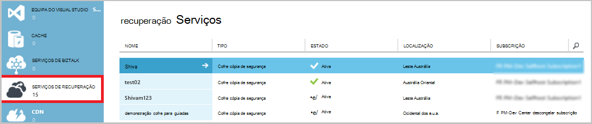

Ao selecionar as opções na parte superior da página de início rápido, pode ver as tarefas de gestão disponíveis.

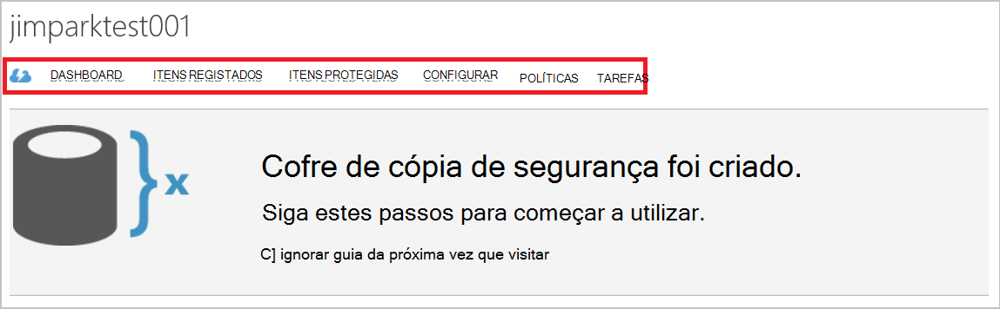

### Dashboard
Selecione o **Dashboard** para ver a descrição geral de utilização para o servidor. **Descrição geral de utilização** inclui:

- O número de servidores do Windows registados para a nuvem
- O número de Azure máquinas virtuais protegidas na nuvem
- O armazenamento total consumido no Azure
- O estado das tarefas recentes

Na parte inferior do Dashboard, pode efetuar as seguintes tarefas:

- **Certificado de gerir** - se um certificado foi utilizado para registar o servidor, em seguida, utilize esta opção para actualizar o certificado. Se estiver a utilizar credenciais do cofre, não utilize **Gerir certificado**.
- **Eliminar** - elimina o Cofre de cópia de segurança atual. Se já não está a ser utilizado cofre uma cópia de segurança, pode eliminá-lo para libertar espaço de armazenamento. **Eliminar** apenas é activado após terem sido eliminados todos os servidores registados do Cofre de palavras.

## Itens registados
Selecione **Registered itens** para ver os nomes dos servidores que estão registados para deste cofre.

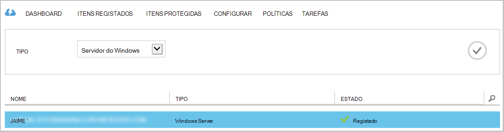

As **tipo de** filtro as predefinições para Azure Virtual Machine. Para ver os nomes dos servidores que estão registados para deste cofre, selecione **Windows server** a partir do menu pendente.

A partir daqui pode efetuar as seguintes tarefas:

- **Permitir Re-registo** - quando esta opção está selecionada para um servidor pode utilizar o **Assistente de registo** no agente de cópia de segurança do Microsoft Azure no local para registar o servidor com cópia de segurança cofre uma segunda vez. Poderá ter de voltar a registar devido a um erro no certificado ou se um servidor teve recompilado.
- **Eliminar** - elimina um servidor do cofre a cópia de segurança. Todos os dados armazenados associados ao servidor é eliminada imediatamente.

    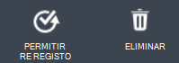

## Itens protegidas
Selecione **Protegida itens** para ver os itens que tenham sido cópia de segurança dos servidores.

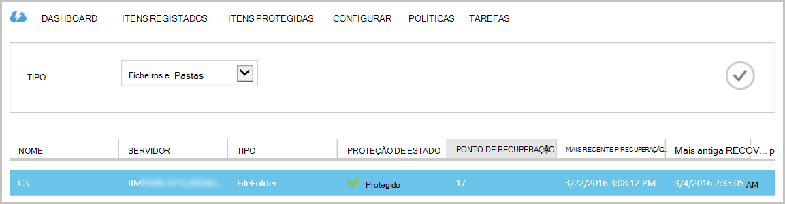

## Configurar

No separador **Configurar** pode selecionar a opção de redundância de armazenamento adequado. A melhor hora para selecionar a opção de redundância de armazenamento é direita depois de criar um cofre e antes de quaisquer máquinas estão registadas para a mesma.

>[AZURE.WARNING] Assim que um item foi registado ao Cofre de palavras, a opção de redundância de armazenamento está bloqueada e não pode ser modificada.

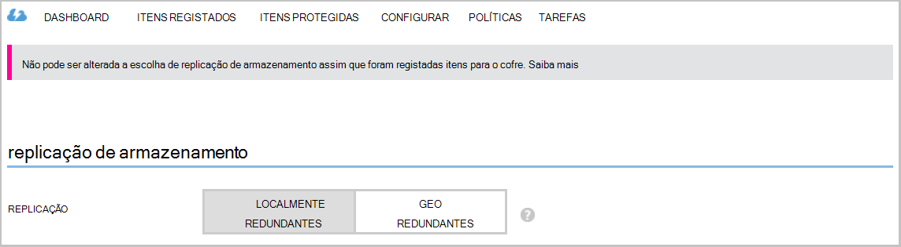

Consulte este artigo para obter mais informações sobre a [redundância de armazenamento](../storage/storage-redundancy.md).

## Tarefas de agente de cópia de segurança do Microsoft Azure

### Consola

Abra o **agente de cópia de segurança do Microsoft Azure** (pode encontrá-lo ao procurar o seu computador *Cópia de segurança do Microsoft Azure*).

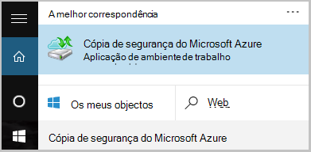

Pode efetuar as seguintes tarefas de gestão de **ações** disponíveis à direita da consola do agente de cópia de segurança:

- Registar o servidor
- Agendar cópia de segurança
- Criar cópias de segurança agora
- Alterar as propriedades

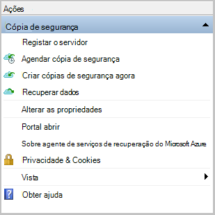

>[AZURE.NOTE] Para **Recuperar dados**, consulte o artigo [Restaurar ficheiros para um servidor ou Windows máquina de cliente do Windows](backup-azure-restore-windows-server.md).

### Modificar uma cópia de segurança existente

1. Na cópia de segurança do Microsoft Azure agente, clique em **Agendar cópia de segurança**.

    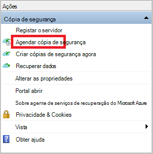

2. No **Assistente de cópia de segurança de agenda** deixe a opção **faça alterações para itens de cópia de segurança ou horas** selecionada e clique em **seguinte**.

    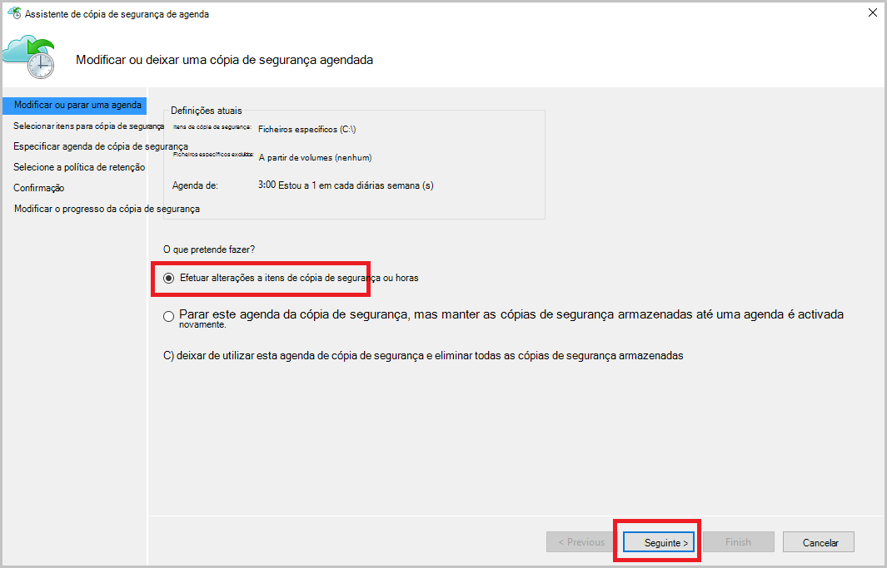

3. Se pretender adicionar ou alterar itens, no ecrã de **Itens selecione fazer cópia de segurança** , clique em **Adicionar itens**.

    Também pode configurar **As definições de exclusão** desta página no assistente. Se pretende excluir ficheiros ou tipos de ficheiro Leia o procedimento para adicionar [as definições de exclusão](#exclusion-settings).

4. Selecione os ficheiros e pastas que pretende fazer cópia de segurança e clique em **OK**.

    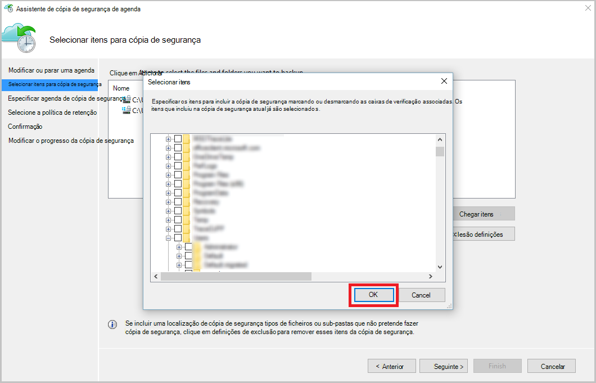

5. Especificar a **agenda de cópia de segurança** e clique em **seguinte**.

    Pode agendar diariamente (a um máximo de 3 vezes por dia) ou cópias de segurança semanais.

    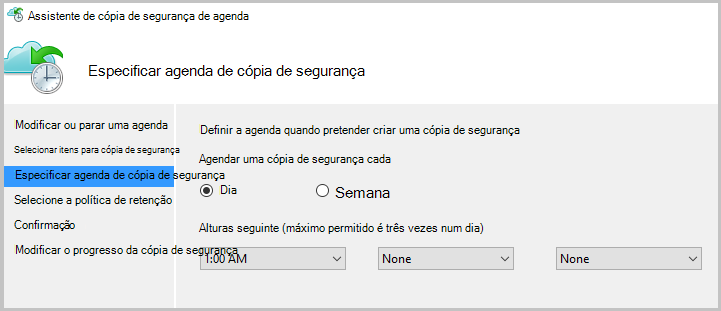

    >[AZURE.NOTE] Especificar a agenda de cópia de segurança é explicado em detalhe neste [artigo](backup-azure-backup-cloud-as-tape.md).

6. Selecione a **Política de retenção** para a cópia de segurança e clique em **seguinte**.

    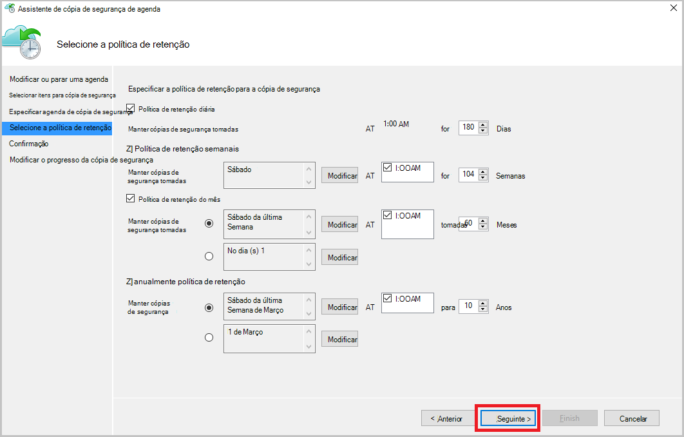

7. No ecrã de **confirmação** reveja as informações e clique em **Concluir**.

8. Assim que o assistente terminar de criar a **agenda de cópia de segurança**, clique em **Fechar**.

    Depois de modificar proteção, pode confirmar que cópias de segurança são acionar corretamente ao aceder ao separador **tarefas** e confirmar a que as alterações serão refletidas nas tarefas de cópia de segurança.

### Ativar a limitação de rede  
O agente de cópia de segurança do Azure fornece um separador de Throttling que permite-lhe controlar como a largura de banda de rede é utilizada durante a transferência de dados. Este controlo pode ser útil se precisar de fazer cópia de segurança dados durante horas de trabalho, mas não pretender que o processo de cópia de segurança para interferir com outro tráfego da internet. Limitação de dados transferência aplica-se para fazer cópia de segurança e restaurar atividades.  

Para ativar a limitação:

1. No do **agente de cópia de segurança**, clique em **Alterar propriedades**.

2. Selecione a caixa de verificação **Ativar a utilização da largura de banda de internet limitação para operações de cópia de segurança** .

    

3. Assim que tiver ativado a limitação, especifique a largura de banda permitida para transferência de dados de cópia de segurança durante o **horário de trabalho** e **horas de trabalho não**.

    Os valores de largura de banda comecem numa quilobytes 512 por segundo (Kbps) e podem aceder 1023 megabytes por segundo (Mbps). Também pode designar o início e de conclusão de **horário de trabalho**e os dias da semana são considerados trabalho dias. A hora fora as horas de trabalho designadas é considerado como horas que não sejam de trabalho.

4. Clique em **OK**.

## Definições de exclusão

1. Abra o **agente de cópia de segurança do Microsoft Azure** (pode encontrá-lo ao procurar o seu computador *Cópia de segurança do Microsoft Azure*).

    

2. Na cópia de segurança do Microsoft Azure agente, clique em **Agendar cópia de segurança**.

    

3. No Assistente de cópia de segurança de agenda deixe a opção **faça alterações para itens de cópia de segurança ou horas** selecionada e clique em **seguinte**.

    

4. Clique em **definições de exclusões**.

    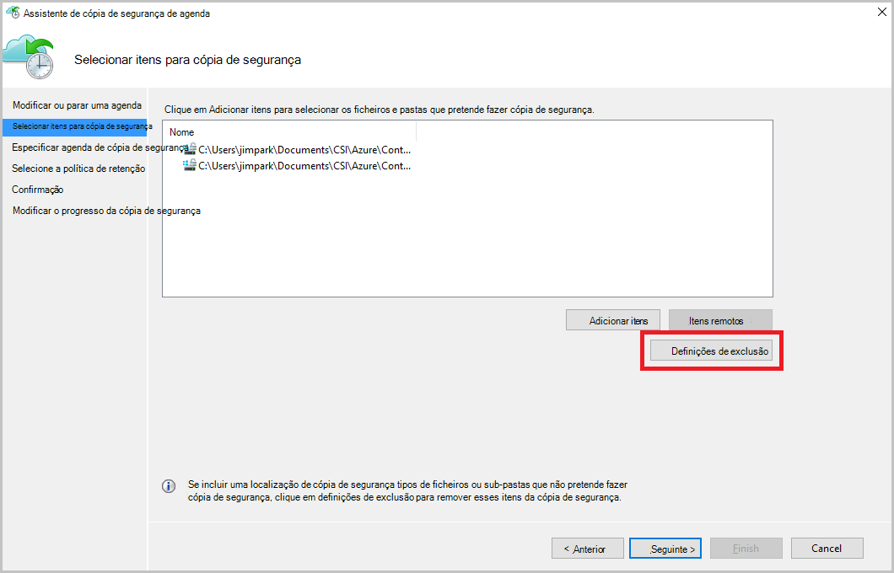

5. Clique em **Adicionar exclusão**.

    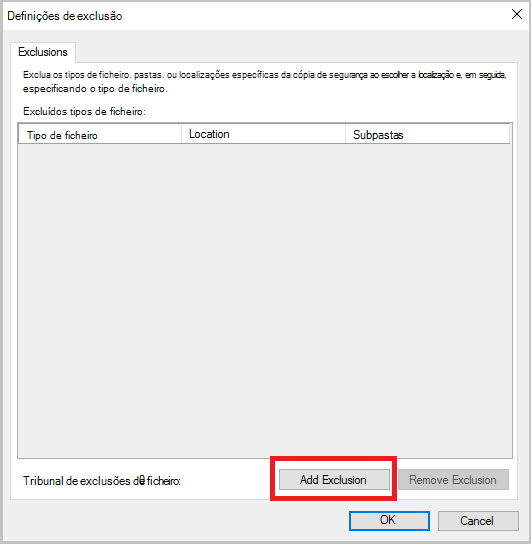

6. Selecione a localização e, em seguida, clique em **OK**.

    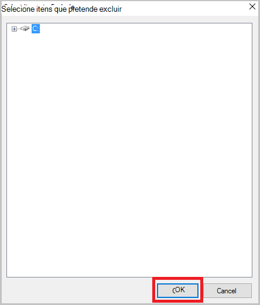

7. Adicione a extensão de ficheiro no campo **Tipo de ficheiro** .

    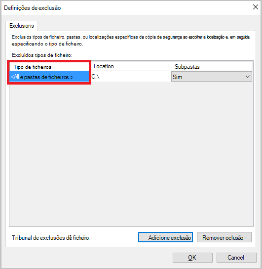

    Adicionar uma extensão. mp3

    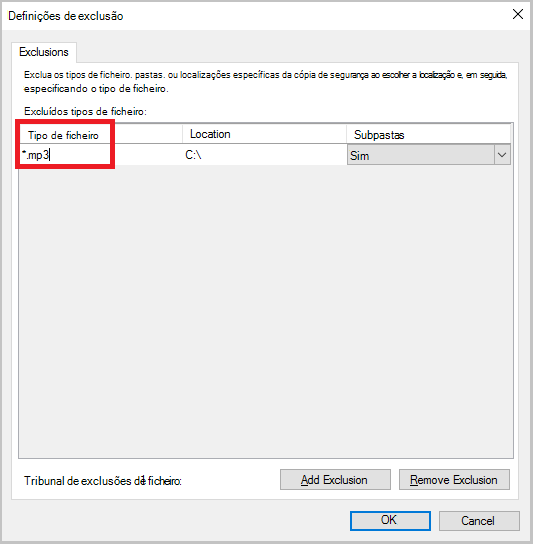

    Para adicionar outra extensão, clique em **Adicionar exclusão** e introduza outra extensão do tipo de ficheiro (adicionar uma extensão. JPEG).

    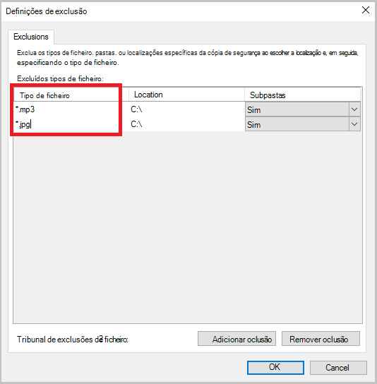

8. Quando tiver adicionado todas as extensões de, clique em **OK**.

9. Continue através do Assistente de cópia de segurança de agenda ao clicar em **seguinte** até à **página de confirmação**e, em seguida, clique em **Concluir**.

    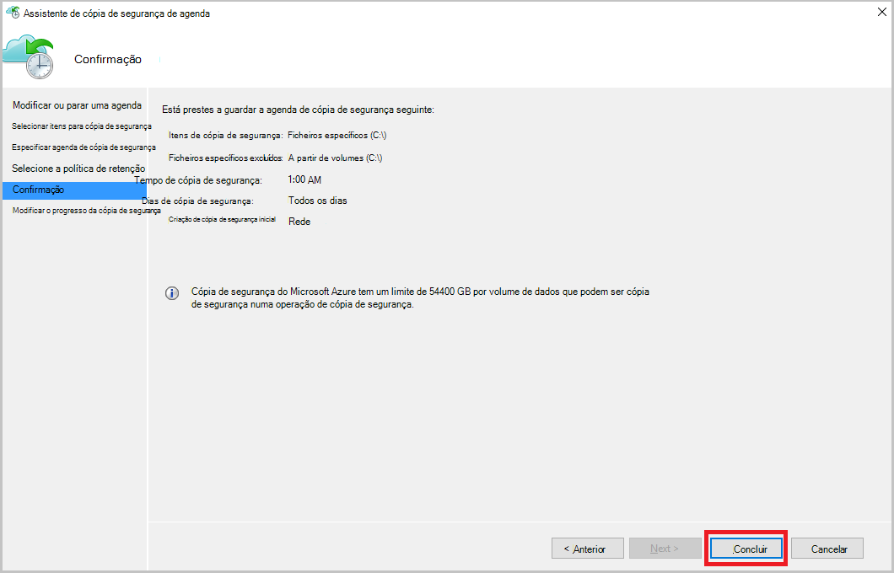

## Próximos passos
- [Restaurar o Windows Server ou do cliente do Windows a partir do Azure](backup-azure-restore-windows-server.md)
- Para saber mais sobre Azure cópia de segurança, consulte o artigo [Descrição geral de cópia de segurança do Azure](backup-introduction-to-azure-backup.md)
- Visite o [Fórum de cópia de segurança Azure](http://go.microsoft.com/fwlink/p/?LinkId=290933)
