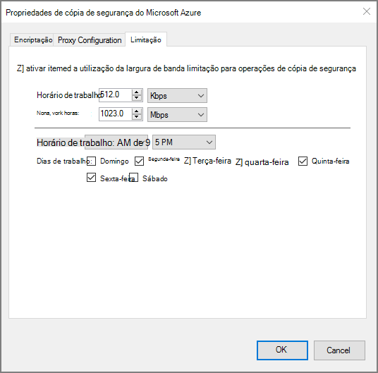

<properties
    pageTitle="Gerir cofres de serviços de recuperação Azure e servidores | Microsoft Azure"
    description="Utilize este tutorial para saber como gerir cofres de serviços de recuperação Azure e os servidores de."
    services="backup"
    documentationCenter=""
    authors="markgalioto"
    manager="cfreeman"
    editor="tysonn"/>

<tags
    ms.service="backup"
    ms.workload="storage-backup-recovery"
    ms.tgt_pltfrm="na"
    ms.devlang="na"
    ms.topic="article"
    ms.date="10/19/2016"
    ms.author="jimpark; markgal"/>


# <a name="monitor-and-manage-azure-recovery-services-vaults-and-servers-for-windows-machines"></a>Monitorizar e gerir cofres de serviços de recuperação Azure servidores de e para máquinas com o Windows

> [AZURE.SELECTOR]
- [Gestor de recursos](backup-azure-manage-windows-server.md)
- [Clássico](backup-azure-manage-windows-server-classic.md)

Este artigo vai encontrar uma descrição geral das tarefas de gestão de cópia de segurança disponíveis através do portal do Azure e o agente de cópia de segurança do Microsoft Azure.

[AZURE.INCLUDE [learn-about-deployment-models](../../includes/learn-about-deployment-models-rm-include.md)]modelo de implementação clássica.

## <a name="management-portal-tasks"></a>Tarefas de gestão de portais

### <a name="access-your-recovery-services-vaults"></a>Aceder ao seu cofres de serviços de recuperação

1. Inicie sessão no [Portal do Azure](https://portal.azure.com/) utilizando a sua subscrição do Azure.

2. No menu concentrador, clique em **Procurar** e na lista de recursos, **Serviços de recuperação**. À medida que começa a escrever, irá filtrar a lista com base no seu teclado. Clique em **Serviços de recuperação cofres**.

     <br/>

2. Selecione o nome do cofre que pretende ver a partir da lista para abrir o pá de dashboard do Cofre de serviços de recuperação.

     <br/>

## <a name="monitor-jobs-and-alerts"></a>Tarefas de monitor e alertas
Monitorizar tarefas e alertas de dashboard do Cofre de serviços de recuperação, onde ver:

- Detalhes de alertas de cópia de segurança
- Ficheiros e pastas, bem como Azure máquinas virtuais protegidas na nuvem
- Armazenamento total consumido no Azure
- Estado da tarefa de cópia de segurança


Clicando em informações em cada um destes mosaicos será aberto o pá associado onde gerir tarefas relacionadas.

Na parte superior do Dashboard de:

- Definições de oferece um acesso tarefas de cópia de segurança disponíveis.
- Cópia de segurança - ajuda-o a cópia de segurança novos ficheiros e pastas (ou Azure VMs) para o Cofre de serviços de recuperação.
- Eliminar - se já não está a ser utilizado um cofre de serviços de recuperação, pode eliminá-lo para libertar espaço de armazenamento. Eliminar apenas é activado após terem sido eliminados todos os servidores protegidos do Cofre de palavras.


## <a name="alerts-for-backups-using-azure-backup-agent"></a>Alertas para cópias de segurança utilizando Azure agente de cópia de segurança:
| Nível de alerta  | Alertas enviadas |
| ------------- | ------------- |
| Crítica | Falha de cópia de segurança, falha de recuperação  |
| Aviso  | Cópia de segurança foi concluída com avisos (quando menos de cem ficheiros não cópia de segurança abrange devido a problemas de danos e ficheiros de mais de um milhão com êxito cópia de segurança abrange)  |
| Informativos  | Nenhum  |
## <a name="manage-backup-alerts"></a>Gerir alertas de cópia de segurança
Clique no mosaico de **Alertas de cópia de segurança** para abrir o pá **Alertas de cópia de segurança** e gerir alertas.


O mosaico de alertas de cópia de segurança mostra-lhe o número de:

- alertas críticos não resolvidas no últimas 24 horas
- alertas de aviso não resolvidas no últimas 24 horas

Clicar em cada uma destas ligações leva-o para a pá **Alertas de cópia de segurança** com uma vista filtrada destes alertas (crítico ou aviso).

A partir do pá alertas de cópia de segurança,:

- Selecione as informações adequadas para incluir com os seus alertas.

    

- Filtre alertas por vezes gravidade, estado e início/fim.

    

- Configurar notificações para gravidade, frequência e os destinatários, bem como ativar ou desativar a alertas.

    

Se **Por alerta** é selecionado como a frequência de **Notificar** ocorre sem agrupamento ou redução em e-mails. Todos os alertas de resultados na notificação de 1. Esta é a predefinição e o e-mail de resolução também é enviado imediatamente.

Se estiver selecionada **Resumo de hora a hora** como o **Notificar** frequência e-mail é enviado para o utilizador que indica que não existem os alertas de novos não resolvidos gerados na última hora. Um e-mail de resolução é enviado no fim da hora.

Alertas podem ser enviados para os níveis de gravidade seguintes:

- crítica
- aviso
- informações

Desativar o alerta com o botão **desativar** no pá de detalhes de tarefa. Quando clica em desativar, pode fornecer notas da resolução.

Selecione as colunas que pretende que apareçam como parte do alerta com o botão **Escolher colunas** .

>[AZURE.NOTE] A partir do pá **Definições** , gerir alertas de cópia de segurança ao selecionar **monitorização e relatórios > alertas e eventos > alertas de cópia de segurança** e, em seguida, clicando em **filtro** ou **Configurar notificações**.

## <a name="manage-backup-items"></a>Gerir os itens de cópia de segurança
Gerir cópias de segurança no local está agora disponível no portal de gestão. Na secção da cópia de segurança do dashboard, o mosaico de **Itens de cópia de segurança** mostra o número de itens de cópia de segurança protegido de forma a cofre.

Clique em **Pastas de ficheiros** no mosaico itens de cópia de segurança.


O pá de itens de cópia de segurança é aberta com o filtro definido para a pasta de ficheiros onde ver cada cópia de segurança específica item listada.


Se selecionar um item específico de cópia de segurança a partir da lista, verá os detalhes essenciais para esse item.

>[AZURE.NOTE] A partir de pá **Definições** , gerir ficheiros e pastas selecionando **itens protegida > itens de cópia de segurança** e, em seguida, selecionar **Pastas de ficheiros** a partir do menu pendente.


## <a name="manage-backup-jobs"></a>Gerir tarefas de cópia de segurança
As tarefas de cópia de segurança para ambas no local (quando o servidor no local é a cópia Azure) e cópias de segurança Azure são visíveis no dashboard.

Na secção da cópia de segurança do dashboard, o mosaico de tarefa de cópia de segurança mostra o número de tarefas:

- em curso
- Ocorreu uma falha na últimas 24 horas.

Para gerir os seus trabalhos de cópia de segurança, clique no mosaico de **Tarefas de cópia de segurança** , que abre o pá trabalhos de cópia de segurança.


Modificar as informações disponíveis no pá tarefas de cópia de segurança com o botão **Escolher colunas** na parte superior da página.

Utilize o botão de **filtro** para selecionar entre ficheiros e pastas e Azure máquina virtual cópia de segurança.

Se não vir a cópia de segurança de ficheiros e pastas, clique em botão **filtro** na parte superior da página e selecione **ficheiros e pastas** a partir do menu tipo de Item.

>[AZURE.NOTE] A partir do pá **Definições** , gerir tarefas de cópia de segurança ao selecionar **monitorização e relatórios > tarefas > tarefas de cópia de segurança** e, em seguida, selecionar **Pastas de ficheiros** a partir do menu pendente.

## <a name="monitor-backup-usage"></a>Monitorizar a utilização de cópia de segurança
Na secção da cópia de segurança do dashboard, o mosaico de utilização de cópia de segurança apresentado armazenamento consumido no Azure. Utilização do armazenamento for fornecida para:
- Utilização do armazenamento na nuvem LRS associada ao Cofre de palavras
- Utilização do armazenamento na nuvem GRS associada ao Cofre de palavras

## <a name="production-servers"></a>Servidores de produção
Para gerir os servidores de produção, clique em **Definições**. Em gerir, clique em **infraestrutura de cópia de segurança > servidores de produção**.

As listas de pá de servidores de produção de todos os servidores de produção disponível. Clique num servidor na lista para abrir os detalhes de servidor.


## <a name="microsoft-azure-backup-agent-tasks"></a>Tarefas de agente de cópia de segurança do Microsoft Azure

## <a name="open-the-backup-agent"></a>Abra o agente de cópia de segurança

Abra o **agente de cópia de segurança do Microsoft Azure** (encontrá-lo ao procurar o seu computador *Cópia de segurança do Microsoft Azure*).


Executar as seguintes tarefas de gestão de **ações** disponíveis à direita da consola do agente de cópia de segurança:

- Registar o servidor
- Agendar cópia de segurança
- Criar cópias de segurança agora
- Alterar as propriedades


>[AZURE.NOTE] Para **Recuperar dados**, consulte o artigo [Restaurar ficheiros para um servidor ou Windows máquina de cliente do Windows](backup-azure-restore-windows-server.md).

## <a name="modify-an-existing-backup"></a>Modificar uma cópia de segurança existente

1. Na cópia de segurança do Microsoft Azure agente, clique em **Agendar cópia de segurança**.

    

2. No **Assistente de cópia de segurança de agenda** deixe a opção **faça alterações para itens de cópia de segurança ou horas** selecionada e clique em **seguinte**.

    

3. Se pretender adicionar ou alterar itens, no ecrã de **Itens selecione fazer cópia de segurança** , clique em **Adicionar itens**.

    Também pode configurar **As definições de exclusão** desta página no assistente. Se pretende excluir ficheiros ou tipos de ficheiro Leia o procedimento para adicionar [as definições de exclusão](#exclusion-settings).

4. Selecione os ficheiros e pastas que pretende fazer cópia de segurança e clique em **OK**.

    

5. Especificar a **agenda de cópia de segurança** e clique em **seguinte**.

    Pode agendar diariamente (a um máximo de 3 vezes por dia) ou cópias de segurança semanais.

    

    >[AZURE.NOTE] Especificar a agenda de cópia de segurança é explicado em detalhe neste [artigo](backup-azure-backup-cloud-as-tape.md).

6. Selecione a **Política de retenção** para a cópia de segurança e clique em **seguinte**.

    

7. No ecrã de **confirmação** reveja as informações e clique em **Concluir**.

8. Assim que o assistente terminar de criar a **agenda de cópia de segurança**, clique em **Fechar**.

    Depois de modificar proteção, pode confirmar que cópias de segurança são acionar corretamente ao aceder ao separador **tarefas** e confirmar a que as alterações serão refletidas nas tarefas de cópia de segurança.

## <a name="enable-network-throttling"></a>Ativar a limitação de rede  
O agente de cópia de segurança do Azure fornece um separador de Throttling que permite-lhe controlar como a largura de banda de rede é utilizada durante a transferência de dados. Este controlo pode ser útil se precisar de fazer cópia de segurança dados durante horas de trabalho, mas não pretender que o processo de cópia de segurança para interferir com outro tráfego da internet. Limitação de dados transferência aplica-se para fazer cópia de segurança e restaurar atividades.  

Para ativar a limitação:

1. No do **agente de cópia de segurança**, clique em **Alterar propriedades**.

2. No **limitação separador, selecione **ative a utilização da largura de banda de internet limitação para operações de cópia de segurança * *.

    

    Assim que tiver ativado a limitação, especifique a largura de banda permitida para transferência de dados de cópia de segurança durante o **horário de trabalho** e **horas de trabalho não**.

    Os valores de largura de banda comecem numa quilobytes 512 por segundo (Kbps) e podem aceder 1023 megabytes por segundo (Mbps). Também pode designar o início e de conclusão de **horário de trabalho**e os dias da semana são considerados trabalho dias. A hora fora as horas de trabalho designadas é considerado como horas que não sejam de trabalho.

3. Clique em **OK**.

## <a name="manage-exclusion-settings"></a>Gerir definições de exclusão

1. Abra o **agente de cópia de segurança do Microsoft Azure** (pode encontrá-lo ao procurar o seu computador *Cópia de segurança do Microsoft Azure*).

    

2. Na cópia de segurança do Microsoft Azure agente, clique em **Agendar cópia de segurança**.

    

3. No Assistente de cópia de segurança de agenda deixe a opção **faça alterações para itens de cópia de segurança ou horas** selecionada e clique em **seguinte**.

    

4. Clique em **definições de exclusões**.

    

5. Clique em **Adicionar exclusão**.

    

6. Selecione a localização e, em seguida, clique em **OK**.

    

7. Adicione a extensão de ficheiro no campo **Tipo de ficheiro** .

    

    Adicionar uma extensão. mp3

    

    Para adicionar outra extensão, clique em **Adicionar exclusão** e introduza outra extensão do tipo de ficheiro (adicionar uma extensão. JPEG).

    

8. Quando tiver adicionado todas as extensões de, clique em **OK**.

9. Continue através do Assistente de cópia de segurança de agenda ao clicar em **seguinte** até à **página de confirmação**e, em seguida, clique em **Concluir**.

    

## <a name="frequently-asked-questions"></a>Perguntas mais frequentes
**Q1. O estado da tarefa de cópia de segurança mostra como concluída no agente de cópia de segurança do Azure, por que motivo não-obter refletida imediatamente no portal?**

A1. Não existem é em atraso máximo de 15 minutos entre o estado da tarefa de cópia de segurança refletido no Azure agente de cópia de segurança e o portal do Azure.

**Q.2 quando falha de uma tarefa de cópia de segurança, quanto tempo demora para subir um alerta?**

2 um alerta é elevado dentro de 20 minutos da falha da cópia de segurança Azure.

**Q3. Existe um caso onde não enviar um e-mail se estiverem configuradas as notificações?**

A3. Abaixo estão casos, quando a notificação não será enviada para reduzir o ruído de alerta:

   - Se as notificações estiverem configuradas à hora e um alerta é elevado e resolvido dentro de hora
   - Trabalho é cancelado.
   - Tarefa de cópia de segurança segunda falhou porque a tarefa de cópia de segurança original está em curso.

## <a name="troubleshooting-monitoring-issues"></a>Resolução de problemas de monitorização

**Problema:** Tarefas e/ou alertas do agente de cópia de segurança do Azure de não aparecem no portal.

**Passos de resolução de problemas:** O processo, ```OBRecoveryServicesManagementAgent```, envia os dados de tarefa e de alerta para o serviço de cópia de segurança do Azure. Ocasionalmente este processo pode tornar-se com problemas ou encerramento.

1. Para verificar o processo não está em execução, abra o **Gestor de tarefas** e verifique se o ```OBRecoveryServicesManagementAgent``` processo está em execução.

2. Partindo do princípio de que o processo não está em execução, abra o **Painel de controlo** e navegar na lista de serviços. Iniciar ou reiniciar **Agente de gestão de serviços do Microsoft Azure recuperação**.

    Para obter mais informações, procure os registos em:<br/>
`<AzureBackup_agent_install_folder>\Microsoft Azure Recovery Services Agent\Temp\GatewayProvider*`. Por exemplo:<br/> `C:\Program Files\Microsoft Azure Recovery Services Agent\Temp\GatewayProvider0.errlog`.

## <a name="next-steps"></a>Próximos passos
- [Restaurar o Windows Server ou do cliente do Windows a partir do Azure](backup-azure-restore-windows-server.md)
- Para saber mais sobre Azure cópia de segurança, consulte o artigo [Descrição geral de cópia de segurança do Azure](backup-introduction-to-azure-backup.md)
- Visite o [Fórum de cópia de segurança Azure](http://go.microsoft.com/fwlink/p/?LinkId=290933)
