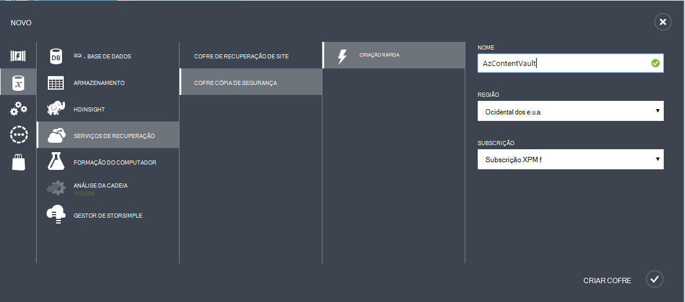
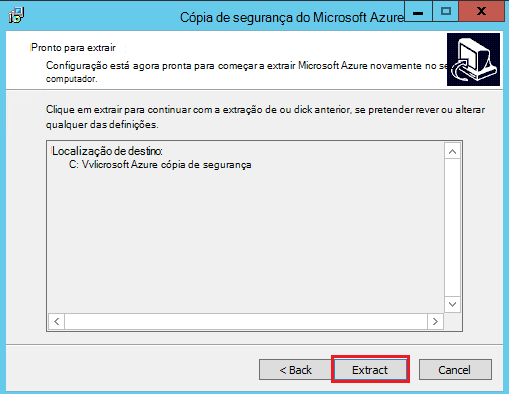

<properties
  pageTitle="Preparar o seu ambiente para criar uma cópia de segurança das cargas de trabalho com o servidor de cópia de segurança do Azure | Microsoft Azure"
  description="Certifique-se de que o seu ambiente está corretamente preparado para criar uma cópia de segurança das cargas de trabalho com o servidor de cópia de segurança do Azure"
  services="backup"
  documentationCenter=""
  authors="pvrk"
  manager="shivamg"
  editor=""
  keywords="servidor de cópia de segurança Azure; cofre cópia de segurança"/>

<tags
  ms.service="backup"
  ms.workload="storage-backup-recovery"
  ms.tgt_pltfrm="na"
  ms.devlang="na"
  ms.topic="article"
  ms.date="08/22/2016"
  ms.author="jimpark;trinadhk;pullabhk; markgal"/>

# <a name="preparing-to-back-up-workloads-using-azure-backup-server"></a>Preparar a cópia de segurança das cargas de trabalho com o servidor de cópia de segurança do Azure

> [AZURE.SELECTOR]
- [Servidor de cópia de segurança Azure](backup-azure-microsoft-azure-backup.md)
- [SCDPM](backup-azure-dpm-introduction.md)
- [Servidor de cópia de segurança Azure (clássico)](backup-azure-microsoft-azure-backup-classic.md)
- [SCDPM (clássico)](backup-azure-dpm-introduction-classic.md)


Este artigo é sobre como preparar o seu ambiente para criar uma cópia de segurança das cargas de trabalho com o servidor de cópia de segurança do Azure. Com o servidor de cópia de segurança do Azure, pode proteger das cargas de trabalho de aplicação como o Hyper-V VMs, Microsoft SQL Server, SharePoint Server, Microsoft Exchange e os clientes Windows a partir de uma única consola.

>[AZURE.WARNING] Servidor de cópia de segurança Azure herda a funcionalidade de Gestor de proteção de dados (DPM) para cópia de segurança de carga de trabalho. Irá encontrar ponteiros a documentação de DPM para algumas destas funcionalidades. No entanto servidor de cópia de segurança do Azure não fornecem protecção na banda ou integrar com o Centro de sistema.

## <a name="1-windows-server-machine"></a>1. máquina de Windows Server


O primeiro passo no sentido começar o servidor de cópia de segurança do Azure e execução deve ter uma máquina de Windows Server.

| Localização | Requisitos mínimos | Instruções adicionais |
| -------- | -------------------- | ----------------------- |
| Azure | Azure máquina de virtual IaaS<br><br>A2 Padrão: 2 núcleos, 3,5 GB de RAM | Pode começar com uma imagem da Galeria simples do Centro de dados do Windows Server 2012 R2. [Proteger IaaS das cargas de trabalho com o servidor de cópia de segurança do Azure (DPM)](https://technet.microsoft.com/library/jj852163.aspx) tem muitas das nuances. Certifique-se de que leia o artigo completamente antes de implementar a máquina. |
| No local | Hyper-V VM,<br> VMWare VM,<br> ou um anfitrião físico<br><br>2 núcleos e 4GB de RAM | Pode deduplicate o armazenamento DPM utilizando a eliminação de duplicados do Windows Server. Saiba mais sobre como [DPM e eliminação de duplicados](https://technet.microsoft.com/library/dn891438.aspx) funcionam em conjunto quando implementados em VMs Hyper-V. |

> [AZURE.NOTE] Recomenda-se que o servidor de cópia de segurança do Azure ser instalado num computador com o Centro de dados do Windows Server 2012 R2. Muitas os pré-requisitos são automaticamente abrangidas com a versão mais recente do sistema operativo Windows.

Se planeia associar este servidor para um domínio a determinada altura, recomenda-se que a atividade participar domínio ser concluída antes da instalação do servidor de cópia de segurança do Azure. Mover uma máquina de servidor de cópia de segurança do Azure existente para um novo domínio depois de implementação não é *suportada*.

## <a name="2-backup-vault"></a>2. cofre cópia de segurança


Quer enviar dados de cópia de segurança para Azure ou mantê-lo localmente, o software tem de estar ligado ao Azure. Para ter mais específica, a máquina de servidor de cópia de segurança do Azure tem de estar registado junto de uma cópia de segurança cofre.

Para criar uma cópia de segurança cofre:

1. Inicie sessão no [Portal de gestão](http://manage.windowsazure.com/).

2. Clique em **Novo** > **Serviços de dados** > **Serviços de recuperação** > **Cofre cópia de segurança** > **criação rápida**. Se tiver múltiplas subscrições associadas à sua conta organizacional, selecione a subscrição correta para associar o cópia de segurança cofre.

3. Em **nome**, introduza um nome amigável para identificar o cofre. Isto tem de ser exclusivo para cada subscrição.

4. Na **região**, selecione a região geográfica para o cofre. Normalmente, a região do Cofre é recolhido com base em restrições de latência de rede ou soberania de dados.

    

5. Clique em **Criar cofre**. Pode demorar algum tempo para o Cofre cópia de segurança criação de. Monitorize as notificações de estado na parte inferior do portal.

    

6. Uma mensagem confirma que o Cofre foi criado com êxito e este será listado na página de serviços de recuperação como ativa.
    

  > [AZURE.IMPORTANT] Certifique-se de que a opção de redundância de armazenamento adequado é escolhida para a direita depois do cofre ter sido criado. Leia mais informações sobre [geo redundantes](../storage/storage-redundancy.md#geo-redundant-storage) [localmente redundantes](../storage/storage-redundancy.md#locally-redundant-storage) opções e nesta [Descrição geral](../storage/storage-redundancy.md).


## <a name="3-software-package"></a>3. pacote de software


### <a name="downloading-the-software-package"></a>Transferir o pacote de software

Semelhante de credenciais do Cofre de palavras, pode transferir a cópia de segurança do Microsoft Azure das cargas de trabalho de aplicação a partir da **Página inicial do rápida** de cópia de segurança cofre.

1. Clique em **para aplicação das cargas de trabalho (disco no disco para na nuvem)**. Isto vai levá-lo para a página do Centro de transferências de onde pode ser transferido o pacote de software.

    

2. Clique em **Transferir**.

    

3. Selecione todos os ficheiros e clique em **seguinte**. Transferir todos os ficheiros provenientes página de transferência de cópia de segurança do Microsoft Azure e coloque todos os ficheiros na mesma pasta.


    Uma vez que o tamanho da transferência de todos os ficheiros em conjunto > 3G, num 10Mbps transfira ligação poderá demorar até 60 minutos para transferência concluir.


### <a name="extracting-the-software-package"></a>Extrair o pacote de software

Depois de transferir todos os ficheiros, clique em **MicrosoftAzureBackupInstaller.exe**. Isto irá iniciar o **Assistente de configuração de cópia de segurança do Microsoft Azure** para extrair os ficheiros de configuração para uma localização especificada pelo utilizador. Continue através do assistente e clique no botão **extrair** para iniciar o processo de extração.

> [AZURE.WARNING] Pelo menos 4GB de espaço livre é necessário para extrair os ficheiros de configuração.




Assim que a extração de processar completo, selecione a caixa para iniciar o recentemente extraída *setup.exe* para começar a instalar o servidor de cópia de segurança do Microsoft Azure e clique no botão **Terminar** .

### <a name="installing-the-software-package"></a>Instalar o pacote de software

1. Clique em **Cópia de segurança do Microsoft Azure** para iniciar o Assistente de configuração.

    

2. No ecrã de boas-vindas, clique no botão **seguinte** . Isto leva-o para a secção *Verifica pré-requisitos* . Neste ecrã, clique no botão **Verificar** para determinar se a pré-requisitos de hardware e software para servidor de cópia de segurança do Azure são satisfeitos. Se todos os pré-requisitos forem foram preenchidas com êxito, verá uma mensagem a indicar que o computador cumpre os requisitos. Clique no botão **seguinte** .

    

3. Necessita de servidor de cópia de segurança do Microsoft Azure SQL Server Standard e o pacote de instalação do servidor de cópia de segurança do Azure fornecido juntamente com os binários do SQL Server adequados conforme necessário. Ao iniciar com uma nova instalação de servidor de cópia de segurança do Azure, deve escolha a opção **Instalar nova instância do SQL Server com esta configuração** e clique no botão **verificar e instalar** . Assim que os pré-requisitos são instalados com êxito, clique em **seguinte**.

    

    Se ocorre uma falha com uma recomendação para reiniciar o computador, faça-o e clique em **Verificar novamente**.

    > [AZURE.NOTE] Azure de cópia de segurança de servidor não irá funcionar com uma instância do SQL Server remota. A instância que está a ser utilizada pelo servidor de cópia de segurança do Azure tem de estar local.

4. Fornecer uma localização para a instalação de ficheiros do servidor de cópia de segurança do Microsoft Azure e clique em **seguinte**.

    

    A localização de rascunho é um requisito para trás até Azure. Certifique-se de que a localização de rascunho é pelo menos 5% dos dados planeados para ser cópias de segurança para a nuvem. Para protecção do disco, discos separados tem de ser configurado assim que a instalação for concluída. Para mais informações sobre agrupamentos de armazenamento, consulte o artigo [Configurar agrupamentos de armazenamento e espaço em disco](https://technet.microsoft.com/library/hh758075.aspx).

5. Fornecer uma palavra-passe segura para contas de utilizador locais restrito e clique em **seguinte**.

    

6. Selecione se pretende utilizar o *Microsoft Update* para verificar a existência de atualizações e clique em **seguinte**.

    >[AZURE.NOTE] Recomendamos que está a ter redirecionar para o Microsoft Update, que oferece atualizações importantes e de segurança para Windows e outros produtos, como o servidor de cópia de segurança do Microsoft Azure do Windows Update.

    

7. Reveja as *Definições de resumo* e clique em **instalar**.

    

8. A instalação acontece em fases. Na primeira fase está instalado o agente de serviços de recuperação do Microsoft Azure no servidor. Também verifica o Assistente de ligação à Internet. Se estiver disponível ligação à Internet pode prosseguir com instalação, caso contrário, é necessário fornecer detalhes do proxy para ligar à Internet.

    O próximo passo é configurar o agente de serviços de recuperação do Microsoft Azure. Como parte da configuração, terá de fornecer que estiver as credenciais do cofre para registar o computador para o cópia de segurança cofre. Também irá fornecer uma frase de acesso para encriptar/desencriptar os dados enviados entre o Azure e as suas instalações. Automaticamente pode gerar uma frase ou fornecer o seu próprio mínimo frase de 16 carateres. Continue com o assistente até que o agente de ter sido configurado.

    

9. Assim que registo do servidor de cópia de segurança do Microsoft Azure for concluída com êxito, o Assistente de configuração geral avança para a instalação e configuração do SQL Server e os componentes de servidor de cópia de segurança do Azure. Assim que a instalação de componentes do SQL Server for concluída, os componentes de servidor de cópia de segurança do Azure estão instalados.

    


Quando o passo de instalação estiver concluída, ícones de ambiente de trabalho do produto irão ter sido criados também. Basta fazer duplo clique no ícone para iniciar o produto.

### <a name="add-backup-storage"></a>Adicionar armazenamento de cópia de segurança

A primeira cópia de segurança é mantida armazenamento anexados à máquina de servidor de cópia de segurança do Azure. Para mais informações sobre a adição de discos, consulte o artigo [Configurar agrupamentos de armazenamento e espaço em disco](https://technet.microsoft.com/library/hh758075.aspx).

> [AZURE.NOTE] Tem de adicionar armazenamento de cópia de segurança, mesmo que planeie enviar dados para Azure. A arquitetura atual do servidor de cópia de segurança do Azure, o cópia de segurança do Azure cofre detém a *segunda* cópia dos dados enquanto o armazenamento local detém a cópia de segurança do primeira (e obrigatória).  

## <a name="4-network-connectivity"></a>4. a conectividade da rede


Servidor de cópia de segurança Azure necessitam de conectividade ao serviço do Azure cópia de segurança para o produto trabalhar com êxito. Para validar se o computador tem de conectividade ao Azure, utilize o ```Get-DPMCloudConnection``` commandlet na consola do Azure PowerShell do servidor de cópia de segurança. Se o resultado do commandlet for VERDADEIRO, em seguida, existe a conectividade, de que outra não haja nenhuma conectividade.

Ao mesmo tempo, a subscrição Azure tem de estar num estado Saudável. Para saber o estado da sua subscrição e geri-lo, inicie a sessão [portal de subscrição]( https://account.windowsazure.com/Subscriptions).

Quando já souber o estado da conectividade Azure e da subscrição do Azure, pode utilizar a tabela abaixo para saber o impacto na funcionalidade de cópia de segurança/restauro oferecido.

| Conectividade de estado | Subscrição do Azure | Fazer cópia de segurança do Azure| Cópia de segurança no disco | Restaurar a partir do Azure | Restaurar a partir do disco |
| -------- | ------- | --------------------- | ------------------- | --------------------------- | ----------------------- |
| Ligado | Ativa | Permitido | Permitido | Permitido | Permitido |
| Ligado | Expirou | Parado | Parado | Permitido | Permitido |
| Ligado | Descontinuada | Parado | Parado | Pontos de recuperação parado e Azure eliminados | Parado |
| Conectividade perdida > 15 dias | Ativa | Parado | Parado | Permitido | Permitido |
| Conectividade perdida > 15 dias | Expirou | Parado | Parado | Permitido | Permitido |
| Conectividade perdida > 15 dias | Descontinuada | Parado | Parado |  Pontos de recuperação parado e Azure eliminados | Parado |

### <a name="recovering-from-loss-of-connectivity"></a>Recuperar de perda de conectividade
Se tiver uma firewall ou um proxy que está a impedir o acesso ao Azure, tem à lista branca os seguintes endereços de domínio no perfil do firewall/proxy:

- www.msftncsi.com
- \*. Microsoft.com
- \*. WindowsAzure.com
- \*. microsoftonline.com
- \*. windows.net

Depois de conectividade ao Azure foi restaurada para o computador servidor de cópia de segurança do Azure as operações que podem ser efetuadas são determinadas pelo Estado de subscrição Azure. A tabela acima tem detalhes sobre as operações permitidas quando o computador for "estabelecido".

### <a name="handling-subscription-states"></a>Tratamento de Estados de subscrição

É possível levar uma subscrição do Azure a partir de um estado *expirado* ou *Deprovisioned* para o estado *activo* . No entanto isto tem algumas implicações sobre o comportamento de produto enquanto o estado não esteja *ativa*:

- Uma subscrição *Deprovisioned* perde funcionalidade para o período que será descontinuada. Em ativar o registo de *ativa*, a funcionalidade de produto da cópia de segurança/restauro é reactivada. Os dados de cópia de segurança no disco local também podem ser obtidos se esta foi mantida com um período de retenção suficientemente grande. No entanto, os dados de cópia de segurança no Azure perdem irremediável assim que a subscrição introduz o estado de *Deprovisioned* .
- Uma subscrição do *expirado* perde apenas da funcionalidade para até que tenham sido fornecidas *ativo* novamente. Quaisquer cópias de segurança agendadas para o período de que a subscrição tiver sido *expirado* não serão executadas.


## <a name="troubleshooting"></a>Resolução de problemas

Se o servidor de cópia de segurança do Microsoft Azure falhar com erros durante a fase de configuração (ou cópia de segurança ou restaurar), consulte este [documento de códigos de erro](https://support.microsoft.com/kb/3041338) para obter mais informações.
Também pode consultar a [cópia de segurança do Azure relacionados com perguntas mais frequentes](backup-azure-backup-faq.md)


## <a name="next-steps"></a>Próximos passos

Pode obter informações detalhadas sobre como [preparar o seu ambiente para DPM](https://technet.microsoft.com/library/hh758176.aspx) no site da Microsoft TechNet. Também contém informações sobre as configurações suportadas no qual Azure cópia de segurança do servidor pode ser implementada e utilizada.

Pode utilizar estes artigos para obter uma compreensão mais aprofundada de proteção de carga de trabalho com o servidor de cópia de segurança do Microsoft Azure.

- [Cópia de segurança do SQL Server](backup-azure-backup-sql.md)
- [Cópia de segurança do SharePoint server](backup-azure-backup-sharepoint.md)
- [Cópia de segurança de servidor alternativo](backup-azure-alternate-dpm-server.md)
