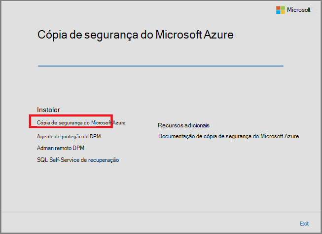
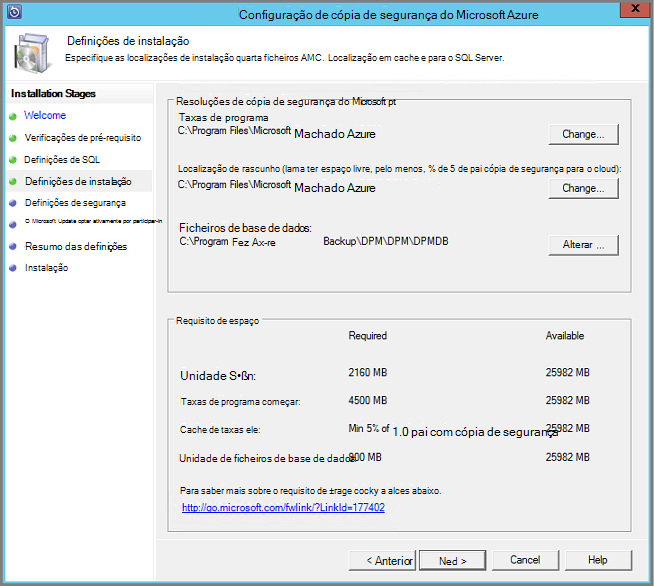
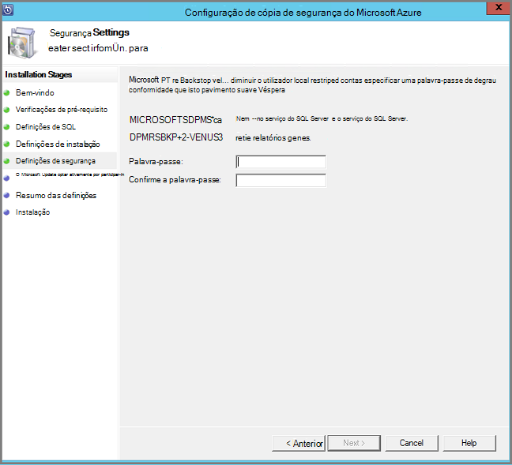
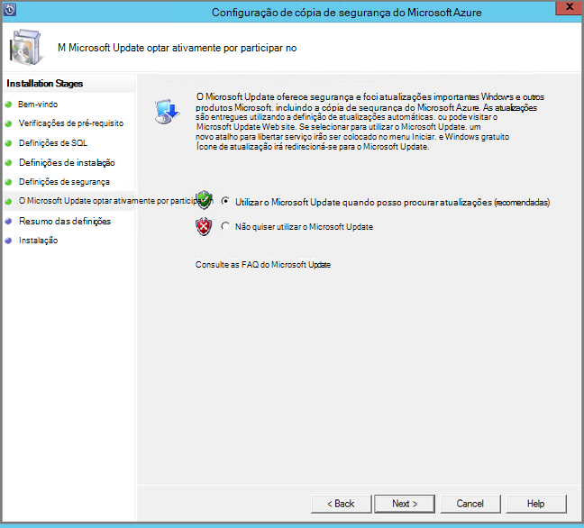
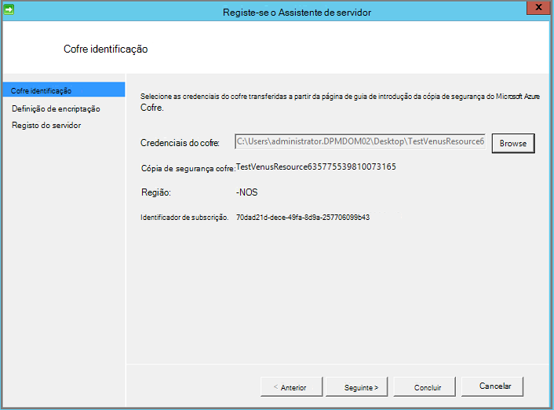
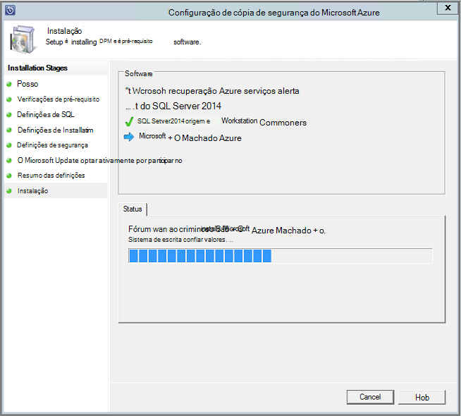

<properties
  pageTitle="Preparar o seu ambiente para criar uma cópia de segurança das cargas de trabalho com o servidor de cópia de segurança do Azure | Microsoft Azure"
  description="Prepare o seu ambiente para utilizar o servidor de cópia de segurança do Azure para proteger ou criar uma cópia de segurança das cargas de trabalho."
  services="backup"
  documentationCenter=""
  authors="PVRK"
  manager="shivamg"
  editor=""
  keywords="servidor de cópia de segurança Azure; proteger das cargas de trabalho; criar uma cópia de segurança das cargas de trabalho"/>

<tags
  ms.service="backup"
  ms.workload="storage-backup-recovery"
  ms.tgt_pltfrm="na"
  ms.devlang="na"
  ms.topic="article"
  ms.date="09/27/2016"
  ms.author="jimpark;trinadhk;pullabhk;markgal"/>

# <a name="preparing-to-back-up-workloads-using-azure-backup-server"></a>Preparar a cópia de segurança das cargas de trabalho com o servidor de cópia de segurança do Azure

> [AZURE.SELECTOR]
- [Servidor de cópia de segurança Azure](backup-azure-microsoft-azure-backup.md)
- [SCDPM](backup-azure-dpm-introduction.md)
- [Servidor de cópia de segurança Azure (clássico)](backup-azure-microsoft-azure-backup-classic.md)
- [SCDPM (clássico)](backup-azure-dpm-introduction-classic.md)

Este artigo explica como preparar o seu ambiente para criar uma cópia de segurança das cargas de trabalho com o servidor de cópia de segurança do Azure. Com o servidor de cópia de segurança do Azure, pode proteger das cargas de trabalho de aplicação como o Hyper-V VMs, Microsoft SQL Server, SharePoint Server, Microsoft Exchange e os clientes Windows a partir de uma única consola. Também pode proteger informações como uma cargas de trabalho do servidor (IaaS) como VMs no Azure.

> [AZURE.NOTE] Azure tem dois modelos de implementação para criar e trabalhar com recursos: [Gestor de recursos e clássica](../resource-manager-deployment-model.md). Este artigo fornece informações e procedimentos para restaurar a VMs implementados a utilizar o modelo de Gestor de recursos.

Servidor de cópia de segurança Azure herda muitas das funcionalidades de cópia de segurança de carga de trabalho a partir do Gestor de proteção de dados (DPM). Este artigo contém ligações a documentação de DPM para explicar algumas das funcionalidades partilhadas. Embora o servidor de cópia de segurança do Azure partilha muitas das mesmas funcionalidades que DPM. Azure de cópia de segurança de servidor não fazer cópia de segurança banda nem integrar com o Centro de sistema.

## <a name="1-choose-an-installation-platform"></a>1. a escolher uma plataforma de instalação

É o primeiro passo no sentido começar o servidor de cópia de segurança do Azure e execução de configurar um servidor do Windows. O servidor pode ser no Azure ou no local.

### <a name="using-a-server-in-azure"></a>Utilizar um servidor no Azure

Quando escolher um servidor para executar o servidor de cópia de segurança do Azure, recomenda-se com uma imagem da galeria do Centro de dados do Windows Server 2012 R2 que começa. O artigo [criar a sua primeira máquina de virtual do Windows no portal do Azure](..\virtual-machines\virtual-machines-windows-hero-tutorial.md), fornece um tutorial para começar a trabalhar com a máquina virtual recomendada no Azure, mesmo se nunca tiver utilizado o Azure antes. Os requisitos mínimos recomendados para o servidor virtual máquina (VM) devem ser: A2 padrão com 2 núcleos e 3,5 GB de RAM.

Proteger das cargas de trabalho com o servidor de cópia de segurança do Azure tem muitas das nuances. O artigo [Instalar DPM como uma máquina virtual Azure](https://technet.microsoft.com/library/jj852163.aspx), ajuda-o a explicar das nuances. Completamente Leia este artigo antes de implementar a máquina.

### <a name="using-an-on-premises-server"></a>Utilizar um servidor no local

Se não pretender executar o servidor de base no Azure, pode executar o servidor numa VM Hyper-V, uma VM VMware ou um anfitrião físico. Os requisitos mínimos recomendados para o hardware do servidor são núcleos de 2 e 4 GB de RAM. Os sistemas operativos suportados estão listados na tabela seguinte.

| Sistema operativo        | Plataforma           | SKU  |
| :------------- |-------------| :-----|
|Windows Server 2012 R2 e SPs mais recentes| 64 bits| Padrão, Centro de dados, Foundation|
|Windows Server 2012 e SPs mais recentes|    64 bits| Centro de dados, Foundation, padrão|
|Armazenamento de Windows Server 2012 R2 e SPs mais recentes  |64 bits|    Padrão, grupo de trabalho|
|Armazenamento de Windows Server 2012 e SPs mais recentes |64 bits |Padrão, grupo de trabalho|


Pode deduplicate o armazenamento DPM utilizando a eliminação de duplicados do Windows Server. Saiba mais sobre como [DPM e eliminação de duplicados](https://technet.microsoft.com/library/dn891438.aspx) funcionam em conjunto quando implementados em VMs Hyper-V.

> [AZURE.NOTE]  Não é possível instalar o servidor de cópia de segurança do Azure num computador em execução como um controlador de domínio.

Servidor de cópia de segurança do Azure tem de aderir a um domínio. Se planeia mover o servidor para um domínio diferente, é recomendável que participar o servidor para o novo domínio antes de instalar o servidor de cópia de segurança do Azure. Mover uma máquina de servidor de cópia de segurança do Azure existente para um novo domínio depois de implementação não é *suportada*.

## <a name="2-recovery-services-vault"></a>2. Cofre de serviços de recuperação de

Quer enviar dados de cópia de segurança para Azure ou mantê-lo localmente, o software tem de estar ligado ao Azure. Para ter mais específica, o computador servidor de cópia de segurança do Azure tem de estar registado junto de recuperação serviços cofre.

Para criar uma recuperação serviços cofre:

1. Inicie sessão no [portal do Azure](https://portal.azure.com/).

2. No menu concentrador, clique em **Procurar** e na lista de recursos, **Serviços de recuperação**. À medida que começa a escrever, irá filtrar a lista com base no seu teclado. Clique em **Serviços de recuperação cofre**.

     <br/>

    É apresentada a lista de serviços de recuperação cofres.

3. No menu de **Serviços de recuperação cofres** , clique em **Adicionar**.

    

    O pá cofre serviços de recuperação abre-se, perguntar para fornecer um **nome**, a **subscrição**, o **grupo de recursos**e a **localização**.

    

4. Para o **nome**, introduza um nome amigável para identificar o cofre. O nome tem de ser exclusivo para a subscrição Azure. Escreva um nome que contém entre 2 e 50 carateres. Tem de iniciar por uma letra e pode conter apenas letras, números e hífenes.

5. Clique em **subscrição** para ver a lista de subscrições disponível. Se não tiver a certeza de qual para utilizar a sua subscrição, utilize a predefinição (ou sugeridos) subscrição. Haverá múltiplas escolhas apenas se a sua conta institucional está associada com múltiplas subscrições Azure.

6. Clique em **grupo de recursos** para ver a lista de grupos de recursos disponível ou clique em **Novo** para criar um novo grupo de recursos. Para obter informações completas sobre grupos de recursos, consulte o artigo [Descrição geral do Gestor de recursos do Azure](../azure-resource-manager/resource-group-overview.md)

7. Clique em **localização** para selecionar a região geográfica para o cofre.

8. Clique em **Criar**. Pode demorar algum tempo para o Cofre de serviços de recuperação seja criada. Monitorize as notificações de estado na área superior direita no portal.
Quando estiver criado cofre, abre no portal.

### <a name="set-storage-replication"></a>Definir a replicação de armazenamento

A opção de replicação de armazenamento permite-lhe escolher entre armazenamento geo redundantes e armazenamento localmente redundante. Por predefinição, o seu Cofre tem armazenamento geo redundante. Deixe a opção definida como armazenamento geo redundante se esta é a cópia de segurança principal. Selecione armazenamento localmente redundante se pretender que uma opção de menos dispendiosa que não se adequarem como resistente. Leia mais informações sobre [geo redundantes](../storage/storage-redundancy.md#geo-redundant-storage) e opções de armazenamento [redundantes localmente](../storage/storage-redundancy.md#locally-redundant-storage) num [Descrição geral de replicação de armazenamento do Windows Azure](../storage/storage-redundancy.md).

Para editar a definição de replicação de armazenamento:

1. Selecione o seu Cofre para abrir o dashboard do cofre e pá as definições. Se a pá **Definições** não abrir, clique em **todas as definições** no dashboard de cofre.

2. No pá **Definições** , clique em **Cópia de segurança infraestrutura** > **Configuração de cópia de segurança** para abrir o pá de **Configuração de cópia de segurança** . Na pá **Configuração de cópia de segurança** , selecione a opção de replicação de armazenamento para o cofre.

    

    Depois de escolher a opção de armazenamento para o cofre, está pronto para associar a VM cofre. Para começar a associação, deve descobrir e registar as máquinas virtuais Azure.

## <a name="3-software-package"></a>3. pacote de software

### <a name="downloading-the-software-package"></a>Transferir o pacote de software
1. Inicie sessão no [portal do Azure](https://portal.azure.com/).

2. Se já tiver um aberto Cofre de serviços de recuperação, avance para o passo 3. Se não possui um serviços de recuperação do Cofre de palavras aberta, mas são no portal do Azure, no menu concentrador, clique em **Procurar**.

    - Na lista de recursos, escreva **Serviços de recuperação**.
    - À medida que começa a escrever, irá filtrar a lista com base no seu teclado. Quando vir **cofres de serviços de recuperação**, clique na mesma.

    

    É apresentada a lista de serviços de recuperação cofres.

    - Na lista de serviços de recuperação cofres, selecione um cofre.

    O dashboard selecionado Cofre é aberta.

    

3. Pá definições é aberto por predefinição. Se estiver fechada, clique em **Definições** para abrir o separador Definições.

    

4. Clique em **cópia de segurança** na **Introdução** para abrir o Assistente de introdução.

    

5. A começar a que se abre, ecrã de cópia de segurança objetivos será selecionada automaticamente.
    

    Na secção **objetivos da cópia de segurança** , selecione *no local* para *onde está a carga de trabalho em execução*.

    

6. Selecione as cargas de trabalho que pretende proteger com o servidor de cópia de segurança do Azure na *que pretende proteger das cargas de trabalho* e clique em **OK**.

    > [AZURE.NOTE] Se estiver a planear proteger apenas os ficheiros e pastas, em seguida, recomendamos que utilize agente de cópia de segurança do Azure. Se está a planear proteger das cargas de trabalho mais que apenas os ficheiros e pastas ou no futuro se está a planear expandir as necessidades de proteção, selecione todos os das cargas de trabalho.

    Isto irá alterar o Assistente de introdução para preparar infraestrutura para proteger das cargas de trabalho a partir no local para Azure.

    

7. No pá de **infraestrutura de preparar** que se abre, clique nas ligações **Transferir** para instalar o servidor de cópia de segurança do Azure e as credenciais do Cofre de transferência. Utilize as credenciais do cofre durante o registo do servidor de cópia de segurança do Azure ao Cofre de palavras de serviços de recuperação. As ligações direcionado para o Centro de transferências onde pode ser transferido o pacote de software.

    

8. Selecione todos os ficheiros e clique em **seguinte**. Transferir todos os ficheiros provenientes página de transferência de cópia de segurança do Microsoft Azure e coloque todos os ficheiros na mesma pasta.

    

    Uma vez que o tamanho da transferência de todos os ficheiros em conjunto > 3G, num 10Mbps transfira ligação poderá demorar até 60 minutos para transferência concluir.


### <a name="extracting-the-software-package"></a>Extrair o pacote de software

Depois de transferir todos os ficheiros, clique em **MicrosoftAzureBackupInstaller.exe**. Isto irá iniciar o **Assistente de configuração de cópia de segurança do Microsoft Azure** para extrair os ficheiros de configuração para uma localização especificada pelo utilizador. Continue através do assistente e clique no botão **extrair** para iniciar o processo de extração.

> [AZURE.WARNING] Pelo menos 4GB de espaço livre é necessário para extrair os ficheiros de configuração.


Assim que a extração de processar completo, selecione a caixa para iniciar o recentemente extraída *setup.exe* para começar a instalar o servidor de cópia de segurança do Microsoft Azure e clique no botão **Terminar** .

### <a name="installing-the-software-package"></a>Instalar o pacote de software

1. Clique em **Cópia de segurança do Microsoft Azure** para iniciar o Assistente de configuração.

    

2. No ecrã de boas-vindas, clique no botão **seguinte** . Isto leva-o para a secção *Verifica pré-requisitos* . Neste ecrã, clique no botão **Verificar** para determinar se a pré-requisitos de hardware e software para servidor de cópia de segurança do Azure são satisfeitos. Se todos os pré-requisitos forem foram preenchidas com êxito, verá uma mensagem a indicar que o computador cumpre os requisitos. Clique no botão **seguinte** .

    

3. Necessita de servidor de cópia de segurança do Microsoft Azure SQL Server Standard e o pacote de instalação do servidor de cópia de segurança do Azure fornecido juntamente com os binários do SQL Server adequados conforme necessário. Ao iniciar com uma nova instalação de servidor de cópia de segurança do Azure, deve escolha a opção **Instalar nova instância do SQL Server com esta configuração** e clique no botão **verificar e instalar** . Assim que os pré-requisitos são instalados com êxito, clique em **seguinte**.

    

    Se ocorre uma falha com uma recomendação para reiniciar o computador, faça-o e clique em **Verificar novamente**.

    > [AZURE.NOTE] Azure de cópia de segurança de servidor não irá funcionar com uma instância do SQL Server remota. A instância que está a ser utilizada pelo servidor de cópia de segurança do Azure tem de estar local.

4. Fornecer uma localização para a instalação de ficheiros do servidor de cópia de segurança do Microsoft Azure e clique em **seguinte**.

    

    A localização de rascunho é um requisito para trás até Azure. Certifique-se de que a localização de rascunho é pelo menos 5% dos dados planeados para ser cópias de segurança para a nuvem. Para protecção do disco, discos separados tem de ser configurado assim que a instalação for concluída. Para mais informações sobre agrupamentos de armazenamento, consulte o artigo [Configurar agrupamentos de armazenamento e espaço em disco](https://technet.microsoft.com/library/hh758075.aspx).

5. Fornecer uma palavra-passe segura para contas de utilizador locais restrito e clique em **seguinte**.

    

6. Selecione se pretende utilizar o *Microsoft Update* para verificar a existência de atualizações e clique em **seguinte**.

    >[AZURE.NOTE] Recomendamos que está a ter redirecionar para o Microsoft Update, que oferece atualizações importantes e de segurança para Windows e outros produtos, como o servidor de cópia de segurança do Microsoft Azure do Windows Update.

    

7. Reveja as *Definições de resumo* e clique em **instalar**.

    

8. A instalação acontece em fases. Na primeira fase está instalado o agente de serviços de recuperação do Microsoft Azure no servidor. Também verifica o Assistente de ligação à Internet. Se estiver disponível ligação à Internet pode prosseguir com instalação, caso contrário, é necessário fornecer detalhes do proxy para ligar à Internet.

    O próximo passo é configurar o agente de serviços de recuperação do Microsoft Azure. Como parte da configuração, terá de fornecer as suas credenciais cofre para registar o computador para o Cofre de serviços de recuperação. Também irá fornecer uma frase de acesso para encriptar/desencriptar os dados enviados entre o Azure e as suas instalações. Automaticamente pode gerar uma frase ou fornecer o seu próprio mínimo frase de 16 carateres. Continue com o assistente até que o agente de ter sido configurado.

    

9. Assim que registo do servidor de cópia de segurança do Microsoft Azure for concluída com êxito, o Assistente de configuração geral avança para a instalação e configuração do SQL Server e os componentes de servidor de cópia de segurança do Azure. Assim que a instalação de componentes do SQL Server for concluída, os componentes de servidor de cópia de segurança do Azure estão instalados.

    


Quando o passo de instalação estiver concluída, ícones de ambiente de trabalho do produto irão ter sido criados também. Basta fazer duplo clique no ícone para iniciar o produto.

### <a name="add-backup-storage"></a>Adicionar armazenamento de cópia de segurança

A primeira cópia de segurança é mantida armazenamento anexados à máquina de servidor de cópia de segurança do Azure. Para mais informações sobre a adição de discos, consulte o artigo [Configurar agrupamentos de armazenamento e espaço em disco](https://technet.microsoft.com/library/hh758075.aspx).

> [AZURE.NOTE] Tem de adicionar armazenamento de cópia de segurança, mesmo que planeie enviar dados para Azure. A arquitetura atual do servidor de cópia de segurança do Azure, o cópia de segurança do Azure cofre detém a *segunda* cópia dos dados enquanto o armazenamento local detém a cópia de segurança do primeira (e obrigatória).

## <a name="4-network-connectivity"></a>4. a conectividade da rede

Servidor de cópia de segurança Azure necessitam de conectividade ao serviço do Azure cópia de segurança para o produto trabalhar com êxito. Para validar se o computador tem de conectividade ao Azure, utilize o ```Get-DPMCloudConnection``` cmdlet na consola do Azure PowerShell do servidor de cópia de segurança. Se o resultado do cmdlet for VERDADEIRO, em seguida, existe a conectividade, de que outra não haja nenhuma conectividade.

Ao mesmo tempo, a subscrição Azure tem de estar num estado Saudável. Para saber o estado da sua subscrição e geri-lo, inicie a sessão [portal de subscrição]( https://account.windowsazure.com/Subscriptions).

Quando já souber o estado da conectividade Azure e da subscrição do Azure, pode utilizar a tabela abaixo para saber o impacto na funcionalidade de cópia de segurança/restauro oferecido.

| Conectividade de estado | Subscrição do Azure | Fazer cópia de segurança do Azure| Cópia de segurança no disco | Restaurar a partir do Azure | Restaurar a partir do disco |
| -------- | ------- | --------------------- | ------------------- | --------------------------- | ----------------------- |
| Ligado | Ativa | Permitido | Permitido | Permitido | Permitido |
| Ligado | Expirou | Parado | Parado | Permitido | Permitido |
| Ligado | Descontinuada | Parado | Parado | Pontos de recuperação parado e Azure eliminados | Parado |
| Conectividade perdida > 15 dias | Ativa | Parado | Parado | Permitido | Permitido |
| Conectividade perdida > 15 dias | Expirou | Parado | Parado | Permitido | Permitido |
| Conectividade perdida > 15 dias | Descontinuada | Parado | Parado |  Pontos de recuperação parado e Azure eliminados | Parado |

### <a name="recovering-from-loss-of-connectivity"></a>Recuperar de perda de conectividade
Se tiver uma firewall ou um proxy que está a impedir o acesso ao Azure, tem à lista branca os seguintes endereços de domínio no perfil do firewall/proxy:

- www.msftncsi.com
- \*. Microsoft.com
- \*. WindowsAzure.com
- \*. microsoftonline.com
- \*. windows.net

Depois de conectividade ao Azure foi restaurada para o computador servidor de cópia de segurança do Azure as operações que podem ser efetuadas são determinadas pelo Estado de subscrição Azure. A tabela acima tem detalhes sobre as operações permitidas quando o computador for "estabelecido".

### <a name="handling-subscription-states"></a>Tratamento de Estados de subscrição

É possível levar uma subscrição do Azure a partir de um estado *expirado* ou *Deprovisioned* para o estado *activo* . No entanto isto tem algumas implicações sobre o comportamento de produto enquanto o estado não esteja *ativa*:

- Uma subscrição *Deprovisioned* perde funcionalidade para o período que será descontinuada. Em ativar o registo de *ativa*, a funcionalidade de produto da cópia de segurança/restauro é reactivada. Os dados de cópia de segurança no disco local também podem ser obtidos se esta foi mantida com um período de retenção suficientemente grande. No entanto, os dados de cópia de segurança no Azure perdem irremediável assim que a subscrição introduz o estado de *Deprovisioned* .
- Uma subscrição do *expirado* perde apenas da funcionalidade para até que tenham sido fornecidas *ativo* novamente. Quaisquer cópias de segurança agendadas para o período de que a subscrição tiver sido *expirado* não serão executadas.


## <a name="troubleshooting"></a>Resolução de problemas

Se o servidor de cópia de segurança do Microsoft Azure falhar com erros durante a fase de configuração (ou cópia de segurança ou restaurar), consulte este [documento de códigos de erro](https://support.microsoft.com/kb/3041338) para obter mais informações.
Também pode consultar a [cópia de segurança do Azure relacionados com perguntas mais frequentes](backup-azure-backup-faq.md)


## <a name="next-steps"></a>Próximos passos

Pode obter informações detalhadas sobre como [preparar o seu ambiente para DPM](https://technet.microsoft.com/library/hh758176.aspx) no site da Microsoft TechNet. Também contém informações sobre as configurações suportadas no qual Azure cópia de segurança do servidor pode ser implementada e utilizada.

Pode utilizar estes artigos para obter uma compreensão mais aprofundada de proteção de carga de trabalho com o servidor de cópia de segurança do Microsoft Azure.

- [Cópia de segurança do SQL Server](backup-azure-backup-sql.md)
- [Cópia de segurança do SharePoint server](backup-azure-backup-sharepoint.md)
- [Cópia de segurança de servidor alternativo](backup-azure-alternate-dpm-server.md)
