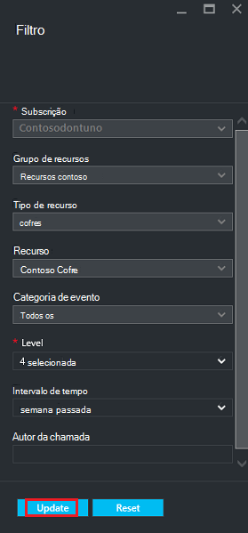

<properties
   pageTitle="Implementado Gestor de recursos do monitor máquina virtual cópias de segurança | Microsoft Azure"
   description="Monitorizar eventos e alertas de cópias de segurança de máquina de virtual implementado Gestor de recursos. Envie e-mail com base em alertas."
   services="backup"
   documentationCenter="dev-center-name"
   authors="markgalioto"
   manager="cfreeman"
   editor=""/>

<tags
ms.service="backup"
ms.workload="storage-backup-recovery"
ms.tgt_pltfrm="na"
ms.devlang="na"
ms.topic="article"
ms.date="08/25/2016"
ms.author="trinadhk; giridham;"/>

# <a name="monitor-alerts-for-azure-virtual-machine-backups"></a>Monitorizar alertas para máquina virtual Azure cópias de segurança

Os alertas estão respostas a partir do serviço de um limite de evento foi cumprido ou ultrapassado. Saber quando iniciar problemas poderá ser crítico para manter os custos de negócio para baixo. Os alertas, normalmente, não ocorrem numa agenda e, por isso, é útil saber mais cedo possível após a ocorrem de alertas. Por exemplo, quando uma tarefa de cópia de segurança ou restaurar falha, ocorre um alerta dentro de cinco minutos da falha. No dashboard do cofre, o mosaico de alertas de cópia de segurança apresenta eventos críticos e de nível de aviso. Nas definições de alertas de cópia de segurança, pode ver todos os eventos. Mas o que deve fazer se ocorre um alerta quando está a trabalhar num problema em separado? Se não souber quando o alerta acontece, pode dever-um incómodo secundário ou poderia comprometer dados. Para certificar-se de que as pessoas corretas estejam cientes de um alerta - quando ocorrer, configure o serviço para enviar as notificações de alerta por correio eletrónico. Para obter detalhes sobre como configurar as notificações de correio eletrónico, consulte o artigo [configurar notificações](backup-azure-monitor-vms.md#configure-notifications).

## <a name="how-do-i-find-information-about-the-alerts"></a>Como posso encontrar informações sobre os alertas de?

Para ver informações sobre o evento que gerou um alerta, terá de abrir o pá alertas de cópia de segurança. Existem duas formas para abrir o pá alertas de cópia de segurança: quer a partir dos alertas de cópia de segurança dispor em mosaico no dashboard de cofre ou de pá de alertas e eventos.

Para abrir o pá alertas de cópia de segurança a partir do mosaico de alertas de cópia de segurança:

- No mosaico **Alertas de cópia de segurança** no dashboard de cofre, clique em **críticas** ou de **aviso** para ver os eventos operacionais para esse nível gravidade.

    


Para abrir o pá alertas de cópia de segurança de pá de alertas e eventos:

1. Dashboard do cofre, clique em **Todas as definições**. 

2. No pá **Definições** , clique em **Alertas e eventos**. 

3. No pá **Alertas e eventos** , clique em **Alertas de cópia de segurança**. 

    O **Alertas de cópia de segurança** pá abre e apresenta os alertas de filtrada.

    

4. Para ver informações detalhadas sobre um determinado alerta, na lista de eventos, clique no alerta para abrir o respetivo pá de **Detalhes** .

    

    Para personalizar os atributos apresentados na lista, consulte o artigo [atributos de evento adicional de vista](backup-azure-monitor-vms.md#view-additional-event-attributes)

## <a name="configure-notifications"></a>Configurar notificações

 Pode configurar o serviço para enviar notificações de correio eletrónico para que os alertas que ocorreram sobre a hora anteriores ou quando ocorrem certos tipos de eventos.

Para configurar as notificações de e-mail para os alertas

1. No menu de alertas de cópia de segurança, clique em **configurar notificações**

    

    É aberta a pá de notificações de configurar.

    

2. No pá de notificações configurar, para as notificações de correio eletrónico, clique em **Ligar**.

    Os destinatários e gravidade caixas de diálogo tem uma estrela junto dos mesmos, pois essa informação é necessária. Fornecer, pelo menos, um endereço de e-mail e selecione pelo menos uma gravidade.

3. Na caixa de diálogo **destinatários (E-Mail)** , escreva os endereços de e-mail para quem recebe as notificações. Utilize o formato: username@domainname.com. Separe os vários endereços de e-mail com um ponto e vírgula (;)).

4. Na área de **notificação** , escolha **Por alerta** para enviar uma notificação quando ocorre o alerta especificado ou **Hora a hora de resumo** para enviar um resumo para a hora anteriores.

5. Na caixa de diálogo **gravidade** , selecione um ou mais níveis que pretende acionar a notificação de e-mail.

6. Clique em **Guardar**.
### <a name="what-alert-types-are-available-for-azure-iaas-vm-backup"></a>Que tipos de alertas estão disponíveis para cópia de segurança do Azure IaaS VM?
| Nível de alerta  | Alertas enviadas |
| ------------- | ------------- |
| Crítica | Falha de cópia de segurança, falha de recuperação  |
| Aviso  | Nenhum |
| Informativos  | Nenhum  |

### <a name="are-there-situations-where-email-isnt-sent-even-if-notifications-are-configured"></a>Existem situações onde o correio eletrónico não é enviado mesmo se estiverem configuradas as notificações?

Existem situações em que não é enviado um alerta, apesar das notificações que foram corretamente configuradas. No e-mail situações seguintes não são enviadas notificações para evitar ruído alerta:

- Se as notificações estão configuradas para comunicação avançada, um alerta é e elevado resolvido dentro a hora.
- O trabalho é cancelado.
- Uma tarefa de cópia de segurança é acionada e, em seguida, falha e outra tarefa de cópia de segurança está em curso.
- Inicia uma tarefa de cópia de segurança agendada para uma VM com capacidade de Gestor de recursos, mas a VM já não existe.

## <a name="customize-your-view-of-events"></a>Personalizar a vista de eventos

A definição de **registos de auditoria** vem com um conjunto de filtros e colunas que mostra informações sobre o evento operacionais predefinido. Pode personalizar a vista para que quando abre o pá de **eventos** ,-mostra-lhe as informações que pretende.

1. No [dashboard de cofre](./backup-azure-manage-vms.md#open-a-recovery-services-vault-in-the-dashboard), procure e clique em **Registos de auditoria** para abrir o pá **eventos** .

    

    É aberto o pá **eventos** para os eventos operacionais filtrados apenas para o Cofre atual.

    

    O pá mostra a lista de crítico, erro, aviso e informativos eventos que ocorreram na semana passada. O intervalo de tempo é um valor predefinido definido no **filtro**. O pá **eventos** também mostra um gráfico de barras quando ocorreram os eventos de controlo. Se não quiser ver o gráfico de barras, no menu de **eventos** , clique em **Ocultar gráfico** para desativar o gráfico a. A vista predefinida de eventos mostra informações de operação, nível, estado, recursos e hora. Para obter informações sobre expor os atributos de evento adicionais, consulte a secção [Expandir informações sobre o evento](backup-azure-monitor-vms.md#view-additional-event-attributes).

2. Para obter informações adicionais sobre um evento operacionais avançado, na coluna **operação** , clique num evento operacional para abrir o respetivo pá. O pá contém informações detalhadas sobre os eventos. Eventos são agrupados por respetivo ID de correlação e uma lista dos eventos que ocorreram no intervalo de tempo.

    

3. Para ver informações detalhadas sobre um evento específico, na lista de eventos, clique no evento para abrir o respetivo pá de **Detalhes** .

    

    As informações de nível de evento são tão detalhadas como recebe as informações. Se prefere ver as informações neste pessoais cada evento e optar por adicionar neste muito detalhes para a pá de **eventos** , consulte a secção [Expandir informações sobre o evento](backup-azure-monitor-vms.md#view-additional-event-attributes).


## <a name="customize-the-event-filter"></a>Personalizar o filtro de evento
Utilize o **filtro** para ajustar ou selecione as informações que aparecem num nomeadamente pá. Para filtrar as informações de evento:

1. No [dashboard de cofre](./backup-azure-manage-vms.md#open-a-recovery-services-vault-in-the-dashboard), procure e clique em **Registos de auditoria** para abrir o pá **eventos** .

    

    É aberto o pá **eventos** para os eventos operacionais filtrados apenas para o Cofre atual.

    

2. No menu de **eventos** , clique em **filtro** para abrir essa pá.

    

3. No pá **filtro** , ajuste os filtros de **nível** **do intervalo de tempo**e **autor da chamada** . Os outros filtros não estão disponíveis, desde que foram definidas para fornecer as informações de atuais para o Cofre de serviços de recuperação.

    

    Pode especificar o **nível** de evento: crítica, erro, aviso ou informativo. Pode escolher qualquer combinação de níveis de evento, mas tem de ter pelo menos um nível seleccionada. Alternar o nível de ou desativar. O filtro **do intervalo de tempo** permite-lhe especificar o período de tempo para captar o eventos. Se utilizar um intervalo de tempo personalizado, pode definir as horas de início e de fim.

4. Assim que estiver pronto para consultar os registos de operações através do seu filtro, clique em **Atualizar**. Apresentam os resultados na pá **eventos** .

    


### <a name="view-additional-event-attributes"></a>Atributos de evento adicional de vista
Utilizar o botão de **colunas** , pode ativar a atributos de evento adicional que seja apresentado na lista de pá **eventos** . A lista de eventos predefinida apresenta as informações de operação, nível, estado, recursos e hora. Para ativar os atributos adicionais:

1. No pá **eventos** , clique em **colunas**.

    

    É aberta a pá **Escolher colunas** .

    

2. Para selecionar o atributo, clique na caixa de verificação. A caixa de verificação atributo alterna e desativar.

3. Clique em **Repor** para repor a lista dos atributos no pá **eventos** . Depois de adicionar ou remover atributos a partir da lista, utilize a **Repor** para ver a nova lista de atributos do evento.

4. Clique em **Atualizar** para atualizar os dados nos atributos do evento. A tabela seguinte fornece informações sobre cada atributo.

| Nome da coluna      |Descrição|
| -----------------|-----------|
| Operação|O nome da operação de|
| Nível|O nível da operação, os valores podem ser: informativos, aviso de erro de crítica|
|Estado|Descritivo estado da operação de|
|Recurso|URL que identifica o recurso; Também conhecido como o ID do recurso|
|Tempo|Tempo, medido a partir a hora atual, quando ocorreu o evento|
|Autor da chamada|Quem ou o que denominado ou acionou o evento; pode ser o sistema ou de um utilizador|
|Data/hora|A hora de quando o evento foi acionou|
|Grupo de recursos|O grupo de recursos associados|
|Tipo de recurso|O tipo de recurso interno utilizado pelo Gestor de recursos|
|ID da subscrição|O ID da subscrição associada|
|Categoria|Categoria do evento|
|ID de correlação|ID de comum de eventos relacionados|


## <a name="use-powershell-to-customize-alerts"></a>Utilizar o PowerShell para personalizar os alertas
Pode obter notificações de alerta personalizadas para as tarefas no portal. Para obter estas tarefas, defina regras de alertas baseadas no PowerShell os eventos de registos operacionais. Utilizar *PowerShell versão 1.3.0 ou posterior*.

Para definir uma notificação personalizada para alertar para falhas de cópia de segurança, utilize um comando, como o script seguinte:

```
PS C:\> $actionEmail = New-AzureRmAlertRuleEmail -CustomEmail contoso@microsoft.com
PS C:\> Add-AzureRmLogAlertRule -Name backupFailedAlert -Location "East US" -ResourceGroup RecoveryServices-DP2RCXUGWS3MLJF4LKPI3A3OMJ2DI4SRJK6HIJH22HFIHZVVELRQ-East-US -OperationName Microsoft.Backup/RecoveryServicesVault/Backup -Status Failed -TargetResourceId /subscriptions/86eeac34-eth9a-4de3-84db-7a27d121967e/resourceGroups/RecoveryServices-DP2RCXUGWS3MLJF4LKPI3A3OMJ2DI4SRJK6HIJH22HFIHZVVELRQ-East-US/providers/microsoft.backupbvtd2/RecoveryServicesVault/trinadhVault -Actions $actionEmail
```

**ResourceId** : pode obter ResourceId dos registos de auditoria. O ResourceId é um URL fornecido na coluna recurso os registos de operação.

**OperationName** : OperationName está no formato "Microsoft.RecoveryServices/recoveryServicesVault/*NomeDoAcontecimento*" onde pode ser *NomeDoAcontecimento* :<br/>
- Registe-se <br/>
- Anular o registo <br/>
- ConfigureProtection <br/>
- Cópia de segurança <br/>
- Restaurar <br/>
- StopProtection <br/>
- DeleteBackupData <br/>
- CreateProtectionPolicy <br/>
- DeleteProtectionPolicy <br/>
- UpdateProtectionPolicy <br/>

**Estado** : valores suportados são iniciado, com êxito ou falhou.

**ResourceGroup** : Este é o grupo de recursos ao qual pertence o recurso. Pode adicionar a coluna de grupo de recursos para os registos gerados. Grupo de recursos é um dos tipos de informações sobre o evento disponíveis.

**Nome** : nome da regra alerta.

**CustomEmail** : Especifique o endereço de e-mail personalizado ao qual pretende enviar uma notificação de alerta

**SendToServiceOwners** : esta opção envia notificações de alerta para todos os administradores e coadministradores da subscrição. Podem ser utilizado no **Novo AzureRmAlertRuleEmail** cmdlet

### <a name="limitations-on-alerts"></a>Limitações de alertas
Alertas baseados em eventos estão sujeitas as seguintes limitações:

1. Alertas são acionou em todas as máquinas virtuais no cofre serviços de recuperação. Não é possível personalizar o alerta para um subconjunto de máquinas virtuais num cofre serviços de recuperação.
2. Esta funcionalidade está na pré-visualização. [Saiba mais](../monitoring-and-diagnostics/insights-powershell-samples.md#create-alert-rules)
3. Os alertas são enviados a partir do "alerts-noreply@mail.windowsazure.com". Atualmente não é possível modificar o remetente de correio eletrónico.


## <a name="next-steps"></a>Próximos passos

Registos dos eventos ativar excelente post-mortem e suporte para as operações de cópia de segurança de auditoria. São registadas as seguintes operações:

- Registe-se
- Anular o registo
- Configurar a protecção
- Cópia de segurança (ambos agendados assim como a pedido cópia de segurança)
- Restaurar
- Parar a protecção
- Eliminar dados de cópia de segurança
- Adicionar política
- Eliminar política
- Política de actualização
- Cancelar tarefa

Para obter uma explicação abrangente de eventos, operações e registos de auditoria nos serviços do Azure, consulte o artigo, [Ver eventos e registos de auditoria](../monitoring-and-diagnostics/insights-debugging-with-events.md).

Para obter informações sobre como recriar uma máquina virtual de um ponto de recuperação, consulte o artigo [Restaurar VMs Azure](backup-azure-restore-vms.md). Se precisar de informações sobre como proteger o seu máquinas virtuais, consulte o artigo [aspeto pela primeira vez: criar uma cópia de segurança VMs para cofre serviços de recuperação](backup-azure-vms-first-look-arm.md). Saiba mais sobre as tarefas de gestão para cópias de segurança VM no artigo, [cópias de segurança do Azure gerir máquina virtual](backup-azure-manage-vms.md).
