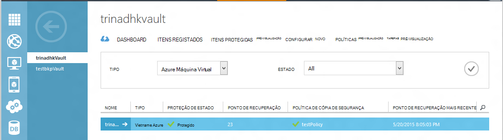
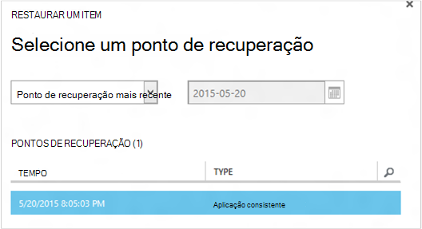
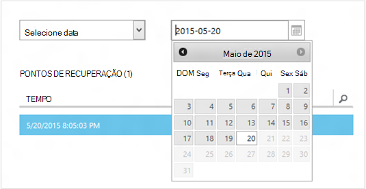
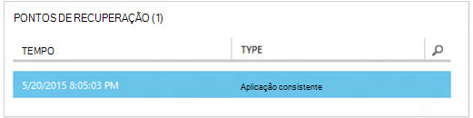
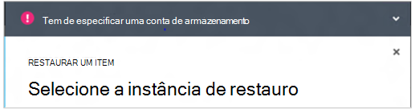
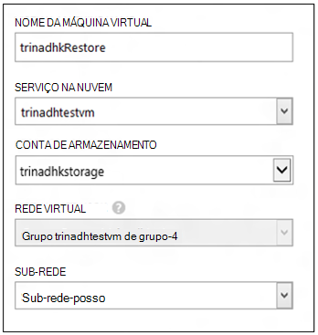
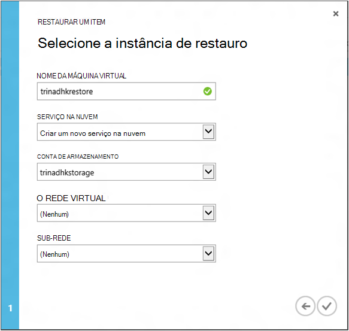
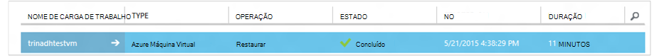

<properties
    pageTitle="Restaurar um máquinas virtuais a partir da cópia de segurança | Microsoft Azure"
    description="Saiba como restaurar uma máquina virtual Azure a partir de um ponto de recuperação"
    services="backup"
    documentationCenter=""
    authors="trinadhk"
    manager="shreeshd"
    editor=""
    keywords="restaurar a cópia de segurança; como restaurar; ponto de recuperação;"/>

<tags
    ms.service="backup"
    ms.workload="storage-backup-recovery"
    ms.tgt_pltfrm="na"
    ms.devlang="na"
    ms.topic="article"
    ms.date="08/02/2016"
    ms.author="trinadhk; jimpark;"/>

# Restaurar máquinas virtuais no Azure

> [AZURE.SELECTOR]
- [Restaurar VMs no portal do Azure](backup-azure-arm-restore-vms.md)
- [Restaurar VMs no portal de clássico](backup-azure-restore-vms.md)

Restaure uma máquina virtual para uma nova VM a partir de cópias de segurança armazenadas num cofre Azure de cópia de segurança com os seguintes passos.

## Restaurar o fluxo de trabalho

### 1. Escolha um item para restaurar

1. Navegue para o separador **Itens protegida** e selecione a máquina virtual que pretende restaurar para uma nova VM.

    

    A coluna de **Ponto de recuperação** na página de **Itens protegida** indicar-lhe o número de pontos de recuperação para uma máquina virtual. A coluna de **Ponto de recuperação do mais recente** indica a hora da cópia de segurança mais recente a partir do qual podem ser restaurada uma máquina virtual.

2. Clique em **Restaurar** para abrir o Assistente de **restaurar um Item** .

    

### 2. Escolha um ponto de recuperação

1. No ecrã de **selecionar um ponto de recuperação** , pode restaurar a partir do ponto de recuperação mais recente ou de um ponto anterior no tempo. A opção de predefinida selecionada quando é aberto o assistente é o *Ponto de recuperação do mais recente*.

    

2. Escolher um ponto anterior na hora, selecione a opção **Selecionar Data** na lista pendente e selecione uma data no controlo de calendário ao clicar no **ícone do calendário**. No controlo, todas as datas que tenham pontos de recuperação são preenchidas com um tom de cinzento claro em são selecionável pelo utilizador.

    

    Ao clicar numa data no controlo de calendário, a recuperação ter pontos disponível em que data será apresentada na tabela de pontos de recuperação abaixo. A coluna **hora** indica o tempo no qual o instantâneo foi tirado. A coluna **tipo** apresenta a [consistência](https://azure.microsoft.com/documentation/articles/backup-azure-vms/#consistency-of-recovery-points) do ponto de recuperação. Cabeçalho de tabela mostra o número de pontos de recuperação disponíveis nesse dia entre parêntesis.

    

3. Selecione o ponto de recuperação a partir da tabela de **Pontos de recuperação** e clique na seta seguinte para ir para o ecrã seguinte.

### 3. Especifique uma localização de destino

1. No ecrã **Selecione restaurar instância** especificar detalhes do local onde restaurar a máquina virtual.

  - Especifique o nome de máquina virtual: num serviço de nuvem determinado, o nome de máquina virtual deve ser único. Não suportamos indevidamente escrever VM existente. 
  - Selecione um serviço na nuvem para a VM: Este é obrigatória para criar uma VM. Pode optar por utilizar um serviço de nuvem existente ou criar um novo serviço na nuvem.

        Whatever cloud service name is picked should be globally unique. Typically, the cloud service name gets associated with a public-facing URL in the form of [cloudservice].cloudapp.net. Azure will not allow you to create a new cloud service if the name has already been used. If you choose to create select create a new cloud service, it will be given the same name as the virtual machine – in which case the VM name picked should be unique enough to be applied to the associated cloud service.

        We only display cloud services and virtual networks that are not associated with any affinity groups in the restore instance details. [Learn More](../virtual-network/virtual-networks-migrate-to-regional-vnet.md).

2. Selecione uma conta de armazenamento para a VM: Este é obrigatória para criar a VM. Pode selecionar a partir de contas de armazenamento existente na mesma região como cofre Azure cópia de segurança. Não suportamos contas de armazenamento que são zona redundante ou de tipo de armazenamento Premium.

    Se existirem sem contas de armazenamento com configuração suportada, consulte crie uma conta de armazenamento da configuração suportada antes de iniciar a operação de restaurar.

    

3. Selecione uma rede Virtual: A rede virtual (VNET) para a máquina virtual deverá ser selecionada no momento da criação da VM. O restauro IU mostra todos os VNETs dentro esta subscrição que podem ser utilizadas. Que não seja obrigatório para selecionar um VNET para a VM restaurada – será possível ligar a máquina virtual restaurada através da internet, mesmo se o VNET não é aplicada.

    Se o serviço de nuvem seleccionado está associado uma rede virtual, não pode alterar a rede virtual.

    

4. Selecione uma sub-rede: caso o VNET tem sub-redes, por predefinição a primeira sub-rede será selecionada. Selecione a sub-rede da sua escolha as opções de lista pendente. Para obter detalhes de sub-rede, vá para a extensão de redes na [home page do portal](https://manage.windowsazure.com/), aceda a **Redes virtuais** e selecione a rede virtual e desagregar em configurar para ver os detalhes de sub-rede.

    

5. Clique no ícone de **Submeter** no Assistente para submeter os detalhes e criar uma tarefa de restaurar.

## Controlar a operação de restauro
Assim que tiver todas as informações para o Assistente de restauro de entrada e apresentado-Azure cópia de segurança vai tentar criar uma tarefa para controlar a operação de restaurar.

Se a criação de tarefa for bem sucedida, irá ver uma notificação de alerta que indica que a tarefa é criada. Pode obter mais detalhes, clicando no botão de **Vista de tarefa** que será direcionado para o separador **tarefas** .

Quando a operação de restauro estiver concluída, este será assinalado como concluída no separador **tarefas** .

Depois de restaurar a máquina virtual poderá ter de voltar a instalar as extensões de existentes no original VM e [modificar os pontos finais](../virtual-machines/virtual-machines-windows-classic-setup-endpoints.md) para o computador virtual no portal do Azure.

## Restaurar pós passos
Se estiver a utilizar uma distribuição de Linux baseado na nuvem-inicialização como Ubuntu, por motivos de segurança, palavra-passe será bloqueada publicar restaurar. Utilize extensão VMAccess a VM restaurada para [Repor a palavra-passe](../virtual-machines/virtual-machines-linux-classic-reset-access.md). Recomendamos que utilize SSH teclas nestes distribuições para evitar a reposição da palavra-passe post restaurar. 

## Cópia de segurança para VMs restaurados
Se tiver restaurado VM serviço na nuvem mesmo com o mesmo nome, tal como foi originalmente cópia de segurança VM, irão continuar cópia de segurança no restauro de mensagem VM. Se tiver restaurado Vm num serviço na nuvem diferente ou especificado um nome diferente para VM restaurado, este será tratado como uma nova VM e precisa de fazer cópia de segurança do programa de configuração para VM restaurado.

## Restaurar uma VM durante Azure falhas de centro de dados
Cópia de segurança do Azure permite restaurar a cópia de segurança VMs para o Centro de dados pares no caso dos dados principais centrar onde VMs estiver a executar experiências falhas e tiver configurado Cofre de cópia de segurança para ser geo redundantes. Durante destes cenários, é necessário selecionar uma conta de armazenamento que se encontra presente no Centro de dados emparelhado e resto do processo de restaurar permanece mesmo. Cópia de segurança do Azure utiliza o serviço de cluster de geo emparelhado para criar a máquina virtual restaurada. 

## Restaurar VMs do controlador de domínio
Cópia de segurança das máquinas virtuais de controlador de domínio (CC) é um cenário suportado com cópia de segurança do Azure. No entanto, deve ser tomado algum cuidado durante o processo de restaurar. A experiência de restaurar é largamente diferente para VMs do controlador de domínio numa configuração único CC vs. VMs numa configuração multi Cc.

### Cc único
A VM pode ser restaurada (como outras VM) a partir do Azure portal ou através do PowerShell.

### Vários CDs
Quando tiver um ambiente do Centro de dados multi, os controladores de domínio tem os seus próprios forma de manter dados sincronizados. Quando um ponto de cópia de segurança mais antigo é restaurado *sem as devidas precauções*, processo de reposição de USN pode instalar o caos num ambiente multi Cc. A forma à direita para recuperar esse uma VM é arranque-la no modo de DSRM.

O desafio surge porque DSRM modo não está presente no Azure. Por isso, para restaurar uma VM essa, não pode utilizar o portal do Azure. O único suportado restaurar mecanismo é baseada no disco restaurar através do PowerShell.

>[AZURE.WARNING] Domínio controlador VMs num ambiente multi CC, não utilize o portal do Azure de restaurar! Restaurar do PowerShell com base só é suportada

Leia mais sobre o [problema de anulação USN](https://technet.microsoft.com/library/dd363553) e estratégias sugeridas corrigi-lo.

## Restaurar VMs com configurações de rede especial
Cópia de segurança do Azure suporta a cópia de segurança para seguir configurações de rede especial das máquinas virtuais.

- VMs em Balanceador de carga (interna e externa)
- VMs com vários IPs reservadas
- VMs com vários NIC

Estas configurações assegurar das seguintes considerações enquanto restaurá-los.

>[AZURE.TIP] Utilize o fluxo de restaurar do PowerShell com base para recriar a configuração de rede especiais do VMs post restaurar.

### Restaurar a partir de IU:
Enquanto restaurar a partir da IU, **Escolha um novo serviço de nuvem sempre**. Tenha em atenção que uma vez que o portal apenas leva-o até obrigatório parâmetros durante o fluxo de restaurar, VMs restaurados utilizando IU irão perder a configuração de rede especial possuem. Por outras palavras, restaurar VMs será VMs normais sem configuração do Balanceador de carga ou múltiplos NIC ou vários IP reservado.

### Restaurar a partir do PowerShell:
PowerShell tem a possibilidade de restaurar apenas os discos VM a partir da cópia de segurança e não criar a máquina virtual. Isto é útil quando restaurar máquinas virtuais que exigem rede especiais configurações mentined acima.

Para poder totalmente recriar os mensagem de máquina virtual restaurar discos, siga estes passos:

1. Restaurar os discos do cofre cópia de segurança através do [PowerShell de cópia de segurança do Azure](../backup-azure-vms-classic-automation.md#restore-an-azure-vm)

2. Criar a configuração VM necessária para o Balanceador de carga / IP reservado vários do NIC/múltiplo, utilizando os cmdlets do PowerShell e a utilização pretendido-la para criar a VM de configuração.
    - Criar VM no serviço na nuvem com [Balanceador de carga interno](https://azure.microsoft.com/documentation/articles/load-balancer-internal-getstarted/)
    - Criar VM para ligar [Internet opostas Balanceador de carga] (https://azure.microsoft.com/en-us/documentation/articles/load-balancer-internet-getstarted/)
    - Criar VM com [vários NIC](https://azure.microsoft.com/documentation/articles/virtual-networks-multiple-nics/)
    - Criar VM com [vários IPs reservadas](https://azure.microsoft.com/documentation/articles/virtual-networks-reserved-public-ip/)

## Próximos passos
- [Resolução de problemas de erros](backup-azure-vms-troubleshoot.md#restore)
- [Gerir máquinas virtuais](backup-azure-manage-vms.md)
