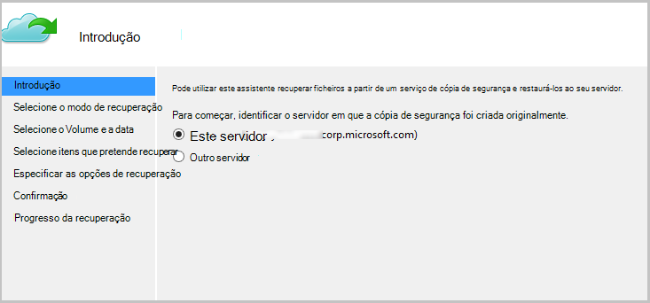
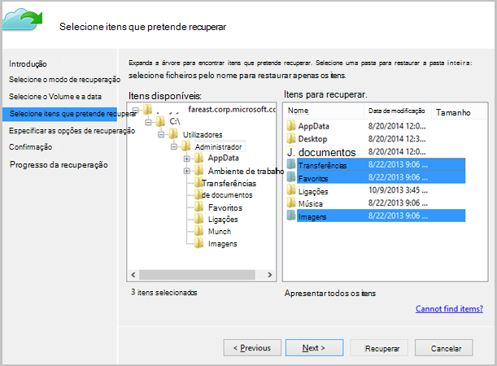

<properties
   pageTitle="Restaurar dados para um cliente de Windows ou Windows Server a partir do Azure utilizando o modelo de implementação do Gestor de recursos | Microsoft Azure"
   description="Saiba como restaurar a partir de um cliente de Windows ou Windows Server."
   services="backup"
   documentationCenter=""
   authors="saurabhsensharma"
   manager="shivamg"
   editor=""/>

<tags
   ms.service="backup"
   ms.workload="storage-backup-recovery"
     ms.tgt_pltfrm="na"
     ms.devlang="na"
     ms.topic="article"
     ms.date="08/02/2016"
     ms.author="trinadhk; jimpark; markgal;"/>

# Restaurar ficheiros para um servidor ou Windows máquina de cliente do Windows com o modelo de implementação do Gestor de recursos

> [AZURE.SELECTOR]
- [Portal do Azure](backup-azure-restore-windows-server.md)
- [Portal clássico](backup-azure-restore-windows-server-classic.md)

Este artigo abrange os passos necessários para realizar os dois tipos de operações de restaurar:

- Restaure dados mesmo computador a partir do qual foram tomadas as cópias de segurança.
- Restaure dados para qualquer outro computador.

Em ambos os casos, os dados serem recuperados do cofre serviços de recuperação do Azure.

[AZURE.INCLUDE [learn-about-deployment-models](../../includes/learn-about-deployment-models-rm-include.md)]modelo de implementação clássica.

## Recuperar dados na mesma máquina
Se acidentalmente eliminado um ficheiro e pretender restaurá-lo na mesma máquina (a partir do qual a cópia de segurança é disponibilizada), os passos seguintes irão ajudá-lo a recuperar os dados.

1. Abra o ajuste de **Cópia de segurança do Microsoft Azure** no.
2. Clique em **Recuperar dados** para iniciar o fluxo de trabalho.

    

3. Selecione o * *este servidor (*yourmachinename*) * * opção para restaurar uma cópia de segurança, o ficheiro no mesmo computador.

    

4. Selecione para **Procurar ficheiros** ou **Procurar ficheiros**.

    Deixe a opção predefinida se pretender restaurar um ou mais ficheiros cujo caminho é conhecido. Se não estão tiver a certeza sobre a estrutura de pastas, mas, optar por procurar um ficheiro, escolha a opção de **pesquisa de ficheiros** . Nesta secção, podemos irá continuar com a opção predefinida.

    

5. Selecione o volume a partir do qual pretende restaurar o ficheiro.

    Pode restaurar a partir de qualquer ponto no tempo. Datas que aparecem a **negrito** no controlo de calendário indicam a disponibilidade de um ponto de restauro. Assim que estiver selecionada uma data, com base na sua agenda de cópia de segurança (e o sucesso de uma operação de cópia de segurança), pode selecionar um ponto de hora a partir da lista pendente **tempo** para baixo.

    

6. Selecione os itens que pretende recuperar. Pode seleções múltiplas/ficheiros de pastas que pretende restaurar.

    

7. Especifique os parâmetros de recuperação.

    

  - Tem uma opção de restaurar na localização original (na qual a ficheiro/pasta seriam substituída) ou para outra localização no mesmo computador.
  - Se o ficheiro/pasta que pretende restaurar existir na localização de destino, pode criar cópias (duas versões do mesmo ficheiro), substituir os ficheiros na localização de destino ou ignorar a recuperação dos ficheiros que existem de destino.
  - É vivamente recomendado que deixe a opção predefinida de restaurar as ACL nos ficheiros que estão a ser recuperadas.

8. Assim que são fornecidas estas entradas do tipo, clique em **seguinte**. O fluxo de trabalho de recuperação, que restaura os ficheiros nesta máquina, será iniciado.

## Recuperar uma máquina alternativo
Se todo o servidor é perdido, ainda pode recuperar dados a partir do Azure cópia de segurança para uma máquina diferente. Os passos seguintes ilustram o fluxo de trabalho.  

Inclui a terminologia utilizada nestes passos:

- *Máquina de origem* – a máquina original de que a cópia de segurança foi tomada e que estão disponível neste momento.
- *Máquina de destino* – máquina ao qual estão a ser recuperar os dados.
- *Cofre exemplo* – a serviços de recuperação do Cofre de palavras que estão registados *máquina de origem* e *o computador de destino* .  

> [AZURE.NOTE] Não podem ser restauradas tiradas de uma máquina de cópias de segurança num computador que esteja a executar uma versão anterior do sistema operativo. Por exemplo, se cópias de segurança forem tomadas a partir de um computador Windows 7,-pode ser restaurado um Windows 8 ou acima máquina. No entanto vice versa não mantenha a tecla verdadeiro.

1. Abra o ajuste de **Cópia de segurança do Microsoft Azure** na *máquina de destino*.
2. Certifique-se de que estão registados para a *máquina de destino* e a *máquina de origem* para o mesmo Cofre de serviços de recuperação.
3. Clique em **Recuperar dados** para iniciar o fluxo de trabalho.

    

4. Selecione **outro servidor**

    

5. Fornece o ficheiro de credenciais do cofre que corresponde aos *Cofre de exemplo*. Se o ficheiro de credenciais do cofre for inválido (ou expirados) Transferir um ficheiro de credenciais do cofre novo a partir do *Cofre de exemplo* no portal do Azure. Assim que o ficheiro de credenciais do Cofre é fornecido, é apresentado o Cofre de serviços de recuperação relativamente ao ficheiro de credenciais do cofre.

6. Selecione a *máquina de origem* a partir da lista de máquinas apresentadas.

    

7. Selecione a opção **Procurar ficheiros** ou **Procurar ficheiros** . Nesta secção, utilizamos a opção de **pesquisa para os ficheiros** .

    

8. Selecione o volume e a data no ecrã seguinte. Para procurar o ficheiro de pasta/nome que pretende restaurar.

    

9. Selecione a localização onde os ficheiros precisam de ser restaurada.

    

10. Forneça a frase de acesso de encriptação que foi fornecido durante o registo do *computador de origem* *Cofre de exemplo*.

    

11. Assim que a entrada de dados for fornecida, clique em **recuperar**, que accionadores restauro dos ficheiros com cópia de segurança para o destino fornecido.

## Próximos passos
- Agora que já recuperado seus ficheiros e pastas, pode [Gerir as cópias de segurança](backup-azure-manage-windows-server.md).
