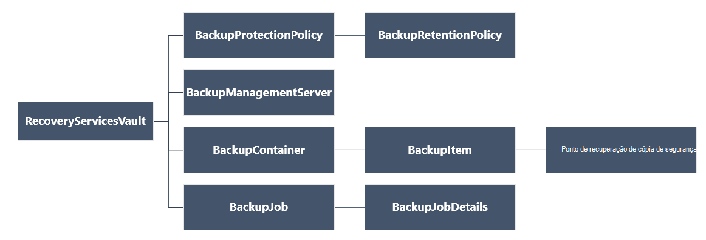

<properties
   pageTitle="Implementar e gerir as cópias de segurança para VMs implementado Gestor de recursos através do PowerShell | Microsoft Azure"
   description="Utilizar o PowerShell para implementar e gerir as cópias de segurança no Azure para VMs implementado Gestor de recursos"
   services="backup"
   documentationCenter=""
   authors="markgalioto"
   manager="cfreeman"
   editor=""/>

<tags
   ms.service="backup"
   ms.devlang="na"
   ms.topic="article"
   ms.tgt_pltfrm="na"
   ms.workload="storage-backup-recovery"
   ms.date="08/03/2016"
   ms.author="markgal; trinadhk"/>

# <a name="deploy-and-manage-backups-for-resource-manager-deployed-vms-using-powershell"></a>Implementar e gerir as cópias de segurança para VMs implementado Gestor de recursos através do PowerShell

> [AZURE.SELECTOR]
- [Gestor de recursos](backup-azure-vms-automation.md)
- [Clássico](backup-azure-vms-classic-automation.md)

Este artigo mostra-lhe como utilizar os cmdlets do Azure PowerShell para fazer cópia de segurança e recuperar uma máquina de virtuais Azure (VM) a partir do cofre serviços de recuperação. Cofre serviços de recuperação é um recurso de Gestor de recursos do Azure e é utilizado para proteger dados e elementos de serviços de cópia de segurança do Azure e recuperação de sites do Azure. Pode utilizar um cofre de serviços de recuperação para proteger VMs implementado Azure Service Manager, bem como VMs implementado Gestor de recursos do Azure.

>[AZURE.NOTE] Azure tem dois modelos de implementação para criar e trabalhar com recursos: [Gestor de recursos e clássica](../resource-manager-deployment-model.md). Este artigo é para utilização com VMs criados utilizando o modelo de Gestor de recursos.

Este artigo explica o utilizar o PowerShell para proteger uma VM e restaurar dados de um ponto de recuperação.

## <a name="concepts"></a>Conceitos

Se não estiver familiarizado com o serviço de cópia de segurança do Azure, para obter uma descrição geral do serviço, consulte o artigo [o que é o Azure cópia de segurança?](backup-introduction-to-azure-backup.md) Antes de começar, certifique-se de que abrangeu essentials sobre os pré-requisitos necessários para trabalhar com cópia de segurança do Azure e as limitações da solução de cópia de segurança VM atual.

Para poder utilizar o PowerShell eficazmente, é necessário compreender a hierarquia de objetos e a partir da qual começar.



Para ver a referência do cmdlet AzureRmRecoveryServicesBackup PowerShell, consulte a [Cópia de segurança do Azure - Cmdlets de serviços de recuperação](https://msdn.microsoft.com/library/mt723320.aspx) na biblioteca do Azure.
Para ver a referência do cmdlet AzureRmRecoveryServicesVault PowerShell, consulte os [Cmdlets do Azure recuperação de serviço](https://msdn.microsoft.com/library/mt643905.aspx).


## <a name="setup-and-registration"></a>Configuração e registo

Para começar:

1. [Transferir a versão mais recente do PowerShell](https://github.com/Azure/azure-powershell/releases) (a versão mínima obrigatória é: 1.4.0)

2. Localize os cmdlets do PowerShell de cópia de segurança do Azure disponíveis ao escrever o seguinte comando:

```
PS C:\> Get-Command *azurermrecoveryservices*

CommandType     Name                                               Version    Source
-----------     ----                                               -------    ------
Cmdlet          Backup-AzureRmRecoveryServicesBackupItem           1.4.0      AzureRM.RecoveryServices.Backup
Cmdlet          Disable-AzureRmRecoveryServicesBackupProtection    1.4.0      AzureRM.RecoveryServices.Backup
Cmdlet          Enable-AzureRmRecoveryServicesBackupProtection     1.4.0      AzureRM.RecoveryServices.Backup
Cmdlet          Get-AzureRmRecoveryServicesBackupContainer         1.4.0      AzureRM.RecoveryServices.Backup
Cmdlet          Get-AzureRmRecoveryServicesBackupItem              1.4.0      AzureRM.RecoveryServices.Backup
Cmdlet          Get-AzureRmRecoveryServicesBackupJob               1.4.0      AzureRM.RecoveryServices.Backup
Cmdlet          Get-AzureRmRecoveryServicesBackupJobDetails        1.4.0      AzureRM.RecoveryServices.Backup
Cmdlet          Get-AzureRmRecoveryServicesBackupManagementServer  1.4.0      AzureRM.RecoveryServices.Backup
Cmdlet          Get-AzureRmRecoveryServicesBackupProperties        1.4.0      AzureRM.RecoveryServices
Cmdlet          Get-AzureRmRecoveryServicesBackupProtectionPolicy  1.4.0      AzureRM.RecoveryServices.Backup
Cmdlet          Get-AzureRMRecoveryServicesBackupRecoveryPoint     1.4.0      AzureRM.RecoveryServices.Backup
Cmdlet          Get-AzureRmRecoveryServicesBackupRetentionPolic... 1.4.0      AzureRM.RecoveryServices.Backup
Cmdlet          Get-AzureRmRecoveryServicesBackupSchedulePolicy... 1.4.0      AzureRM.RecoveryServices.Backup
Cmdlet          Get-AzureRmRecoveryServicesVault                   1.4.0      AzureRM.RecoveryServices
Cmdlet          Get-AzureRmRecoveryServicesVaultSettingsFile       1.4.0      AzureRM.RecoveryServices
Cmdlet          New-AzureRmRecoveryServicesBackupProtectionPolicy  1.4.0      AzureRM.RecoveryServices.Backup
Cmdlet          New-AzureRmRecoveryServicesVault                   1.4.0      AzureRM.RecoveryServices
Cmdlet          Remove-AzureRmRecoveryServicesProtectionPolicy     1.4.0      AzureRM.RecoveryServices.Backup
Cmdlet          Remove-AzureRmRecoveryServicesVault                1.4.0      AzureRM.RecoveryServices
Cmdlet          Restore-AzureRMRecoveryServicesBackupItem          1.4.0      AzureRM.RecoveryServices.Backup
Cmdlet          Set-AzureRmRecoveryServicesBackupProperties        1.4.0      AzureRM.RecoveryServices
Cmdlet          Set-AzureRmRecoveryServicesBackupProtectionPolicy  1.4.0      AzureRM.RecoveryServices.Backup
Cmdlet          Set-AzureRmRecoveryServicesVaultContext            1.4.0      AzureRM.RecoveryServices
Cmdlet          Stop-AzureRmRecoveryServicesBackupJob              1.4.0      AzureRM.RecoveryServices.Backup
Cmdlet          Unregister-AzureRmRecoveryServicesBackupContainer  1.4.0      AzureRM.RecoveryServices.Backup
Cmdlet          Unregister-AzureRmRecoveryServicesBackupManagem... 1.4.0      AzureRM.RecoveryServices.Backup
Cmdlet          Wait-AzureRmRecoveryServicesBackupJob              1.4.0      AzureRM.RecoveryServices.Backup
```


As seguintes tarefas podem ser automatizadas com PowerShell:

- Criar um cofre de serviços de recuperação
- Fazer cópia de segurança ou proteger Azure VMs
- Acionar uma tarefa de cópia de segurança
- Monitorizar a uma tarefa de cópia de segurança
- Restaurar uma VM Azure

## <a name="create-a-recovery-services-vault"></a>Criar um cofre de serviços de recuperação

Os passos seguintes guiá-lo através da criação de um cofre de serviços de recuperação. Cofre serviços de recuperação é diferente do cofre cópia de segurança.

1. Se estiver a utilizar o Azure cópia de segurança pela primeira vez, tem de utilizar o cmdlet **[Register AzureRMResourceProvider](https://msdn.microsoft.com/library/mt679020.aspx)** para registar o fornecedor de serviços de recuperação do Azure com a sua subscrição.

    ```
    PS C:\> Register-AzureRmResourceProvider -ProviderNamespace "Microsoft.RecoveryServices"
    ```

2. Serviços de recuperação Cofre é um recurso de Gestor de recursos, pelo que necessita de colocá-la dentro de um grupo de recursos. Pode utilizar um grupo de recursos existente ou criar um novo grupo de recursos com o cmdlet **[AzureRmResourceGroup novo](https://msdn.microsoft.com/library/mt678985.aspx)** . Ao criar um novo grupo de recursos, especifique o nome e localização do grupo de recursos.  

    ```
    PS C:\> New-AzureRmResourceGroup –Name "test-rg" –Location "West US"
    ```

3. Utilize o cmdlet **[AzureRmRecoveryServicesVault novo](https://msdn.microsoft.com/library/mt643910.aspx)** para criar o novo cofre. Certifique-se de que especificar a mesma localização para o Cofre como foi utilizado para o grupo de recursos.

    ```
    PS C:\> New-AzureRmRecoveryServicesVault -Name "testvault" -ResourceGroupName " test-rg" -Location "West US"
    ```

4. Especificar o tipo de redundância de armazenamento para utilizar; Pode utilizar [Localmente redundantes armazenamento (LRS)](../storage/storage-redundancy.md#locally-redundant-storage) ou [Geo redundantes armazenamento (GRS)](../storage/storage-redundancy.md#geo-redundant-storage). O exemplo seguinte mostra que a opção - BackupStorageRedundancy para testVault está definida para GeoRedundant.

    ```
    PS C:\> $vault1 = Get-AzureRmRecoveryServicesVault –Name "testVault"
    PS C:\> Set-AzureRmRecoveryServicesBackupProperties  -Vault $vault1 -BackupStorageRedundancy GeoRedundant
    ```

    > [AZURE.TIP] Cmdlets de cópia de segurança do Azure muitos requerem o objeto do Cofre de serviços de recuperação como uma entrada. Por este motivo, é conveniente armazenar o objeto do Cofre de serviços de recuperação de cópia de segurança numa variável.

## <a name="view-the-vaults-in-a-subscription"></a>Ver os cofres numa subscrição
Utilize **[Get-AzureRmRecoveryServicesVault](https://msdn.microsoft.com/library/mt643907.aspx)** para ver a lista de todos os cofres na subscrição atual. Pode utilizar este comando para verificar que foi criado um novo cofre, ou para ver que cofres estão disponíveis na subscrição.

Executar o comando Get-AzureRmRecoveryServicesVault e todos os cofres na subscrição são listados.

```
PS C:\> Get-AzureRmRecoveryServicesVault
Name              : Contoso-vault
ID                : /subscriptions/1234
Type              : Microsoft.RecoveryServices/vaults
Location          : WestUS
ResourceGroupName : Contoso-docs-rg
SubscriptionId    : 1234-567f-8910-abc
Properties        : Microsoft.Azure.Commands.RecoveryServices.ARSVaultProperties
```


## <a name="backup-azure-vms"></a>Cópia de segurança VMs Azure
Agora que criou uma Cofre de serviços de recuperação, pode utilizá-lo para proteger uma máquina virtual. No entanto antes de aplicar a proteção, tem de definir o contexto cofre e pretender verificar a política de proteção. Contexto de cofre define o tipo de dados que estão protegidos no cofre. A política de proteção é a agenda para quando a tarefa de cópia de segurança é executada e quanto tempo é mantido, cada instantâneo de cópia de segurança.

Antes de ativar a opção proteção numa VM, tem de definir o contexto cofre. O contexto é aplicado a todos os cmdlets subsequentes.

```
PS C:\> Get-AzureRmRecoveryServicesVault -Name testvault | Set-AzureRmRecoveryServicesVaultContext
```

### <a name="create-a-protection-policy"></a>Criar uma política de proteção

Quando cria um novo cofre, vem com uma política predefinida. Esta política accionadores uma tarefa de cópia de cada dia de cada vez especificado. Pela política predefinida, o limite da cópia de segurança é mantida para 30 dias. Pode utilizar a política predefinida para proteger a VM rapidamente e editar a política mais tarde com detalhes diferentes.

Utilize **[Get-AzureRmRecoveryServicesBackupProtectionPolicy](https://msdn.microsoft.com/library/mt723300.aspx)** para ver a lista de políticas disponível no cofre:

```
PS C:\> Get-AzureRmRecoveryServicesBackupProtectionPolicy -WorkloadType AzureVM
Name                 WorkloadType       BackupManagementType BackupTime                DaysOfWeek
----                 ------------       -------------------- ----------                ----------
DefaultPolicy        AzureVM            AzureVM              4/14/2016 5:00:00 PM
```

> [AZURE.NOTE] O fuso horário do campo BackupTime PowerShell é UTC. No entanto, quando o tempo de cópia de segurança é apresentado no portal do Azure, a hora é ajustada para o seu fuso horário local.

Uma política de proteção de cópia de segurança está associada com pelo menos uma política de retenção.  Política de retenção define quanto tempo um ponto de recuperação é mantido com cópia de segurança do Azure. Utilize **Get-AzureRmRecoveryServicesBackupRetentionPolicyObject** para ver a política de retenção predefinida.  Da mesma forma pode utilizar **Get-AzureRmRecoveryServicesBackupSchedulePolicyObject** para obter a política predefinida para agenda. Os objectos da política agenda e retenção são utilizados como entradas ao cmdlet **AzureRmRecoveryServicesBackupProtectionPolicy novo** .

Uma política de proteção de cópia de segurança define quando e com que frequência é feita a cópia de segurança de um item. O cmdlet novo AzureRmRecoveryServicesBackupProtectionPolicy cria um objeto de PowerShell que detém informações sobre a política de cópia de segurança. A política de cópia de segurança é utilizada como uma entrada ao cmdlet Enable-AzureRmRecoveryServicesBackupProtection.

```
PS C:\> $schPol = Get-AzureRmRecoveryServicesBackupSchedulePolicyObject -WorkloadType "AzureVM"
PS C:\>  $retPol = Get-AzureRmRecoveryServicesBackupRetentionPolicyObject -WorkloadType "AzureVM"
PS C:\>  New-AzureRmRecoveryServicesBackupProtectionPolicy -Name "NewPolicy" -WorkloadType AzureVM -RetentionPolicy $retPol -SchedulePolicy $schPol
Name                 WorkloadType       BackupManagementType BackupTime                DaysOfWeek
----                 ------------       -------------------- ----------                ----------
NewPolicy           AzureVM            AzureVM              4/24/2016 1:30:00 AM
```

### <a name="enable-protection"></a>Activar a protecção

Activar a protecção envolve dois objetos - o item e a política. Ambos os objetos são necessários para ativar a opção proteção no cofre. Assim que a política foram associada a cofre, o fluxo de trabalho de cópia de segurança é acionado ao tempo definido na agenda política.

Para ativar a proteção no não encriptado VMs processador

```
PS C:\> $pol=Get-AzureRmRecoveryServicesBackupProtectionPolicy -Name "NewPolicy"
PS C:\> Enable-AzureRmRecoveryServicesBackupProtection -Policy $pol -Name "V2VM" -ResourceGroupName "RGName1"
```

Para permitir que a proteção no VMs encriptadas [encriptado através de BEK e KEK], tem de conceder permissões para o serviço de cópia de segurança do Azure ler teclas e segredos do cofre chave. 

```
PS C:\> Set-AzureRmKeyVaultAccessPolicy -VaultName 'KeyVaultName' -ResourceGroupName 'RGNameOfKeyVault' -PermissionsToKeys backup,get,list -PermissionsToSecrets get,list -ServicePrincipalName 262044b1-e2ce-469f-a196-69ab7ada62d3
PS C:\> $pol=Get-AzureRmRecoveryServicesBackupProtectionPolicy -Name "NewPolicy"
PS C:\> Enable-AzureRmRecoveryServicesBackupProtection -Policy $pol -Name "V2VM" -ResourceGroupName "RGName1"
```

ASM baseado VMs

```
PS C:\>  $pol=Get-AzureRmRecoveryServicesBackupProtectionPolicy -Name "NewPolicy"
PS C:\>  Enable-AzureRmRecoveryServicesBackupProtection -Policy $pol -Name "V1VM" -ServiceName "ServiceName1"
```

### <a name="modify-a-protection-policy"></a>Modificar uma política de proteção

Para modificar a política, modificar o objeto BackupSchedulePolicyObject ou BackupRetentionPolicy e modificar a política de utilizar o conjunto AzureRmRecoveryServicesBackupProtectionPolicy

O exemplo seguinte altera a contagem de retenção para o 365.

```
PS C:\> $retPol = Get-AzureRmRecoveryServicesBackupRetentionPolicyObject -WorkloadType "AzureVM"
PS C:\> $retPol.DailySchedule.DurationCountInDays = 365
PS C:\> $pol= Get-AzureRmRecoveryServicesBackupProtectionPolicy -Name NewPolicy
PS C:\> Set-AzureRmRecoveryServicesBackupProtectionPolicy -Policy $pol  -RetentionPolicy  $RetPol
```

## <a name="run-an-initial-backup"></a>Executar uma cópia de segurança inicial

A agenda de cópia de segurança de accionadores um inteiro cópias de segurança no inicial novamente para o item. No subsequentes trás ups, a fazer uma cópia de segurança é uma cópia utilizarão. Se pretende forçar a cópia de segurança inicial acontecer numa determinada altura ou mesmo imediatamente, em seguida, utilize o cmdlet **[AzureRmRecoveryServicesBackupItem de cópia de segurança](https://msdn.microsoft.com/library/mt723312.aspx)** :

```
PS C:\> $namedContainer = Get-AzureRmRecoveryServicesBackupContainer -ContainerType "AzureVM" -Status "Registered" -Name "V2VM"
PS C:\> $item = Get-AzureRmRecoveryServicesBackupItem -Container $namedContainer -WorkloadType "AzureVM"
PS C:\> $job = Backup-AzureRmRecoveryServicesBackupItem -Item $item
WorkloadName     Operation            Status               StartTime                 EndTime                   JobID
------------     ---------            ------               ---------                 -------                   ----------
V2VM              Backup               InProgress            4/23/2016 5:00:30 PM                       cf4b3ef5-2fac-4c8e-a215-d2eba4124f27
```

> [AZURE. Nota: O fuso horário dos campos da hora de início e hora de fim no PowerShell é UTC. No entanto, quando a hora é apresentada no portal do Azure, a hora é ajustada para o seu fuso horário local.

## <a name="monitoring-a-backup-job"></a>Monitorização de uma tarefa de cópia de segurança

A maioria das operações de execução longa na cópia de segurança do Azure sejam reproduzidas como uma tarefa. Isto torna mais fácil controlar o progresso sem ter de manter o portal do Azure aberto sempre.

Para obter o estado de uma tarefa em curso mais recente, utilize o cmdlet Get-AzureRmRecoveryservicesBackupJob.

```
PS C:\ > $joblist = Get-AzureRmRecoveryservicesBackupJob –Status InProgress
PS C:\ > $joblist[0]
WorkloadName     Operation            Status               StartTime                 EndTime                   JobID
------------     ---------            ------               ---------                 -------                   ----------
V2VM             Backup               InProgress            4/23/2016 5:00:30 PM           cf4b3ef5-2fac-4c8e-a215-d2eba4124f27
```

Em vez de inquéritos estas tarefas para a conclusão - o que é o código adicional desnecessário - utilizam o cmdlet **[AzureRmRecoveryServicesBackupJob espera](https://msdn.microsoft.com/library/mt723321.aspx)** . Este cmdlet interrompe a execução do até que seja a tarefa estiver concluída ou for atingido o valor de limite de tempo especificado.

```
PS C:\> Wait-AzureRmRecoveryServicesBackupJob -Job $joblist[0] -Timeout 43200
```

## <a name="restore-an-azure-vm"></a>Restaurar uma VM Azure

Existe uma chave diferença entre a restaurar uma VM através do portal Azure e restaurar uma VM através do PowerShell. Com o PowerShell, a operação de restauro está concluída, assim que são criados discos e informações de configuração do ponto de recuperação. A operação de restauro não cria uma máquina virtual. As instruções para criar a máquina virtual de discos são fornecidas. No entanto, para restaurar completamente uma VM, terá de trabalhar através dos seguintes procedimentos:

- Selecione a VM
- Escolher um ponto de recuperação
- Restaurar os discos
- Criar a VM a partir de discos armazenados

O gráfico abaixo mostra a hierarquia de objeto de RecoveryServicesVault para baixo até o BackupRecoveryPoint.


Para restaurar os dados de cópia de segurança, identifique o item de cópias de segurança e o ponto de recuperação que contém os dados em qualquer altura. Em seguida, utilize o cmdlet de **[Restaurar AzureRmRecoveryServicesBackupItem](https://msdn.microsoft.com/library/mt723316.aspx)** para restaurar os dados do Cofre de palavras para a conta do cliente.

### <a name="select-the-vm"></a>Selecione a VM

Para obter o objeto de PowerShell que identifica o produto de cópia de segurança para a direita, iniciar a partir do contentor no cofre e funcionam sua forma para baixo a hierarquia de objeto. Para selecionar o contentor que representa a VM, utilize o cmdlet **[Get-AzureRmRecoveryServicesBackupContainer](https://msdn.microsoft.com/library/mt723319.aspx)** e encaminhar que ao cmdlet **[Get-AzureRmRecoveryServicesBackupItem](https://msdn.microsoft.com/library/mt723305.aspx)** .

```
PS C:\> $namedContainer = Get-AzureRmRecoveryServicesBackupContainer  -ContainerType AzureVM –Status Registered -Name 'V2VM'
PS C:\> $backupitem = Get-AzureRmRecoveryServicesBackupItem –Container $namedContainer  –WorkloadType "AzureVM"
```

### <a name="choose-a-recovery-point"></a>Escolher um ponto de recuperação

Utilize o cmdlet **[Get-AzureRmRecoveryServicesBackupRecoveryPoint](https://msdn.microsoft.com/library/mt723308.aspx)** para listar todos os pontos de recuperação para o item de cópia de segurança. Em seguida, selecione o ponto de recuperação para restaurar. Se tiver a certeza de qual ponto de recuperação para utilizar, é aconselhável para escolher a mais recente RecoveryPointType = AppConsistent ponto na lista.

No script a seguir, a variável, **$rp**, é uma matriz de pontos de recuperação para o item selecionado de cópia de segurança. A matriz é ordenada pela ordem inversa de tempo com o ponto de recuperação mais recente no índice de 0. Utilize a matriz PowerShell padrão indexação para escolher o ponto de recuperação. Por exemplo: $rp [0] irá selecionar do ponto de recuperação mais recente.

```
PS C:\> $startDate = (Get-Date).AddDays(-7)
PS C:\> $endDate = Get-Date
PS C:\> $rp = Get-AzureRmRecoveryServicesBackupRecoveryPoint -Item $backupitem -StartDate $startdate.ToUniversalTime() -EndDate $enddate.ToUniversalTime()
PS C:\> $rp[0]
RecoveryPointAdditionalInfo :
SourceVMStorageType         : NormalStorage
Name                        : 15260861925810
ItemName                    : VM;iaasvmcontainer;RGName1;V2VM
RecoveryPointId             : /subscriptions/XX/resourceGroups/ RGName1/providers/Microsoft.RecoveryServices/vaults/testvault/backupFabrics/Azure/protectionContainers/IaasVMContainer;iaasvmcontainer;RGName1;V2VM/protectedItems/VM;iaasvmcontainer; RGName1;V2VM
                              /recoveryPoints/15260861925810
RecoveryPointType           : AppConsistent
RecoveryPointTime           : 4/23/2016 5:02:04 PM
WorkloadType                : AzureVM
ContainerName               : IaasVMContainer;iaasvmcontainer; RGName1;V2VM
ContainerType               : AzureVM
BackupManagementType        : AzureVM
```


### <a name="restore-the-disks"></a>Restaurar os discos

Utilize o cmdlet **[Restaurar AzureRmRecoveryServicesBackupItem](https://msdn.microsoft.com/library/mt723316.aspx)** para restaurar os dados e a configuração de um item de cópia de segurança para um ponto de recuperação. Depois de ter identificado o ponto de recuperação utilizá-lo como o valor para o parâmetro **- RecoveryPoint** . O código do exemplo anterior, **$rp [0]** foi escolhido como o ponto de recuperação para utilizar. No código de exemplo abaixo, **$rp [0]** for especificada como o ponto de recuperação a utilizar para restaurar a de disco.

Para restaurar os discos e informações de configuração

```
PS C:\> $restorejob = Restore-AzureRmRecoveryServicesBackupItem -RecoveryPoint $rp[0] -StorageAccountName DestAccount -StorageAccountResourceGroupName DestRG
PS C:\> $restorejob
WorkloadName     Operation          Status               StartTime                 EndTime            JobID
------------     ---------          ------               ---------                 -------          ----------
V2VM              Restore           InProgress           4/23/2016 5:00:30 PM                        cf4b3ef5-2fac-4c8e-a215-d2eba4124f27
```

Assim que a tarefa de restauro terminar, utilize o cmdlet **[Get-AzureRmRecoveryServicesBackupJobDetails](https://msdn.microsoft.com/library/mt723310.aspx)** para obter os detalhes da operação de restaurar. A propriedade JobDetails tem as informações necessárias para reconstruir a VM.

```
PS C:\> $restorejob = Get-AzureRmRecoveryServicesBackupJob -Job $restorejob
PS C:\> $details = Get-AzureRmRecoveryServicesBackupJobDetails
```

Depois de restaurar os discos, vá para a secção seguinte para obter informações sobre como criar a VM.

### <a name="create-a-vm-from-restored-disks"></a>Criar uma VM a partir de discos restaurados

Depois de ter restaurado discos, utilize estes passos para criar e configurar máquina virtual do disco.

1. Consulta as propriedades de disco restaurados para obter os detalhes de tarefa.

    ```
    PS C:\> $properties = $details.properties
    PS C:\> $storageAccountName = $properties["Target Storage Account Name"]
    PS C:\> $containerName = $properties["Config Blob Container Name"]
    PS C:\> $blobName = $properties["Config Blob Name"]
    ```

2. Definir o contexto de armazenamento Azure e restaurar o ficheiro de configuração de JSON.

    ```
    PS C:\> Set-AzureRmCurrentStorageAccount -Name $storageaccountname -ResourceGroupName testvault
    PS C:\> $destination_path = "C:\vmconfig.json"
    PS C:\> Get-AzureStorageBlobContent -Container $containerName -Blob $blobName -Destination $destination_path
    PS C:\> $obj = ((Get-Content -Path $destination_path -Encoding Unicode)).TrimEnd([char]0x00) | ConvertFrom-Json
    ```

3. Utilize o ficheiro de configuração de JSON para criar a configuração de VM.

    ```
  PS C:\> $vm = New-AzureRmVMConfig -VMSize $obj.HardwareProfile.VirtualMachineSize -VMName "testrestore"
    ```

4. Anexe o disco de sistema operativo e discos de dados.

      Para não encriptado VMs,

       ```
       PS C:\> Set-AzureRmVMOSDisk -VM $vm -Name "osdisk" -VhdUri $obj.StorageProfile.OSDisk.VirtualHardDisk.Uri -CreateOption “Attach”
       PS C:\> $vm.StorageProfile.OsDisk.OsType = $obj.StorageProfile.OSDisk.OperatingSystemType foreach($dd in $obj.StorageProfile.DataDisks)
       {
       $vm = Add-AzureRmVMDataDisk -VM $vm -Name "datadisk1" -VhdUri $dd.VirtualHardDisk.Uri -DiskSizeInGB 127 -Lun $dd.Lun -CreateOption Attach
       }
       ```
      VMs encriptadas, terá de especificar [informações da chave cofre](https://msdn.microsoft.com/library/dn868052.aspx) antes de que pode anexar discos.
      
      ```
      PS C:\> Set-AzureRmVMOSDisk -VM $vm -Name "osdisk" -VhdUri $obj.StorageProfile.OSDisk.VirtualHardDisk.Uri -DiskEncryptionKeyUrl "https://ContosoKeyVault.vault.azure.net:443/secrets/ContosoSecret007" -DiskEncryptionKeyVaultId "/subscriptions/abcdedf007-4xyz-1a2b-0000-12a2b345675c/resourceGroups/ContosoRG108/providers/Microsoft.KeyVault/vaults/ContosoKeyVault" -KeyEncryptionKeyUrl "https://ContosoKeyVault.vault.azure.net:443/keys/ContosoKey007" -KeyEncryptionKeyVaultId "subscriptions/abcdedf007-4xyz-1a2b-0000-12a2b345675c/resourceGroups/ContosoRG108/providers/Microsoft.KeyVault/vaults/ContosoKeyVault" -CreateOption "Attach" -Windows
      PS C:\> $vm.StorageProfile.OsDisk.OsType = $obj.StorageProfile.OSDisk.OperatingSystemType foreach($dd in $obj.StorageProfile.DataDisks)
       {
       $vm = Add-AzureRmVMDataDisk -VM $vm -Name "datadisk1" -VhdUri $dd.VirtualHardDisk.Uri -DiskSizeInGB 127 -Lun $dd.Lun -CreateOption Attach
       }
      ```
      
5. Configure as definições de rede.

    ```
    PS C:\> $nicName="p1234"
    PS C:\> $pip = New-AzureRmPublicIpAddress -Name $nicName -ResourceGroupName "test" -Location "WestUS" -AllocationMethod Dynamic
    PS C:\> $vnet = Get-AzureRmVirtualNetwork -Name "testvNET" -ResourceGroupName "test"
    PS C:\> $nic = New-AzureRmNetworkInterface -Name $nicName -ResourceGroupName "test" -Location "WestUS" -SubnetId $vnet.Subnets[$subnetindex].Id -PublicIpAddressId $pip.Id
    PS C:\> $vm=Add-AzureRmVMNetworkInterface -VM $vm -Id $nic.Id
    ```

6. Crie a máquina virtual.

    ```
    PS C:\> $vm.StorageProfile.OsDisk.OsType = $obj.StorageProfile.OSDisk.OperatingSystemType
    PS C:\> New-AzureRmVM -ResourceGroupName "test" -Location "WestUS" -VM $vm
    ```

## <a name="next-steps"></a>Próximos passos

Se preferir utilizar o PowerShell para participar com os recursos Azure, consulte o artigo do PowerShell para proteger o Windows Server, [Implementar e gerir cópia de segurança para o Windows Server](./backup-client-automation.md). Também existe um artigo do PowerShell para gerir DPM as cópias de segurança, [Implementar e gerir cópia de segurança para DPM](./backup-dpm-automation.md). Ambos estes artigos tem uma versão para implementações do Gestor de recursos, bem como implementações clássica.  
