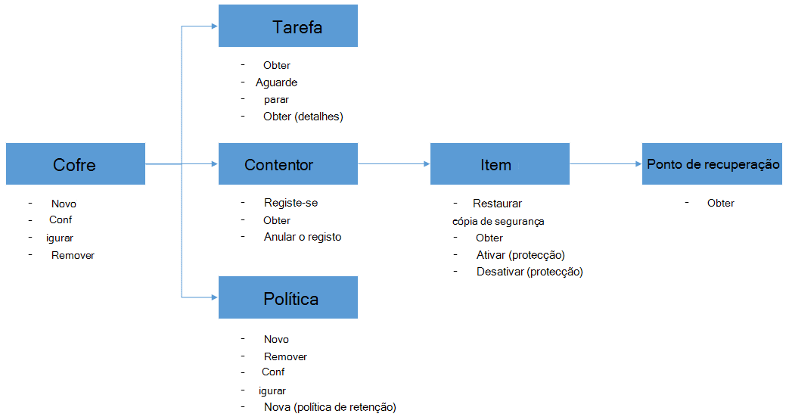

<properties
    pageTitle="Implementar e gerir a cópia de segurança para VMs Azure através do PowerShell | Microsoft Azure"
    description="Saiba como implementar e gerir a cópia de segurança do Azure através do PowerShell"
    services="backup"
    documentationCenter=""
    authors="markgalioto"
    manager="cfreeman"
    editor=""/>

<tags
    ms.service="backup"
    ms.workload="storage-backup-recovery"
    ms.tgt_pltfrm="na"
    ms.devlang="na"
    ms.topic="article"
    ms.date="08/08/2016"
    ms.author="markgal;trinadhk;jimpark" />


# <a name="deploy-and-manage-backup-for-azure-vms-using-powershell"></a>Implementar e gerir a cópia de segurança para VMs Azure através do PowerShell

> [AZURE.SELECTOR]
- [Gestor de recursos](backup-azure-vms-automation.md)
- [Clássico](backup-azure-vms-classic-automation.md)

Este artigo mostra-lhe como utilizar o Azure PowerShell para cópia de segurança e recuperação do Azure VMs. Azure tem dois modelos de implementação diferentes para criar e trabalhar com recursos: Gestor de recurso e clássica. Este artigo aborda a utilizar o modelo de implementação clássica. A Microsoft recomenda a que a maioria das novas implementações utilizam o modelo de Gestor de recursos.

## <a name="concepts"></a>Conceitos


Este artigo fornece informações específicas sobre os cmdlets do PowerShell utilizados para criar uma cópia de segurança máquinas virtuais. Para obter informações introdutórias sobre como proteger Azure VMs, consulte o artigo [Planear a sua infraestrutura de cópia de segurança VM no Azure](backup-azure-vms-introduction.md).

> [AZURE.NOTE] Antes de começar, leia os [Pré-requisitos](backup-azure-vms-prepare.md) necessários para trabalhar com cópia de segurança do Azure e as [limitações](backup-azure-vms-prepare.md#limitations) da solução de cópia de segurança VM atual.

Para utilizar o PowerShell eficazmente, observar para compreender a hierarquia de objetos e a partir da qual começar.



Os dois fluxos mais importantes são ativar proteção para uma VM e restaurar os dados de um ponto de recuperação. O foco deste artigo é para o ajudar a tornar-se adepto trabalhar com os cmdlets do PowerShell para ativar a estes dois cenários.


## <a name="setup-and-registration"></a>Configuração e registo
Para começar:

1. [Transferir o PowerShell mais recente](https://github.com/Azure/azure-powershell/releases) (versão mínima obrigatório é: 1.0.0)

2. Localize os cmdlets do PowerShell de cópia de segurança do Azure disponíveis ao escrever o seguinte comando:

```
PS C:\> Get-Command *azurermbackup*

CommandType     Name                                               Version    Source
-----------     ----                                               -------    ------
Cmdlet          Backup-AzureRmBackupItem                           1.0.1      AzureRM.Backup
Cmdlet          Disable-AzureRmBackupProtection                    1.0.1      AzureRM.Backup
Cmdlet          Enable-AzureRmBackupContainerReregistration        1.0.1      AzureRM.Backup
Cmdlet          Enable-AzureRmBackupProtection                     1.0.1      AzureRM.Backup
Cmdlet          Get-AzureRmBackupContainer                         1.0.1      AzureRM.Backup
Cmdlet          Get-AzureRmBackupItem                              1.0.1      AzureRM.Backup
Cmdlet          Get-AzureRmBackupJob                               1.0.1      AzureRM.Backup
Cmdlet          Get-AzureRmBackupJobDetails                        1.0.1      AzureRM.Backup
Cmdlet          Get-AzureRmBackupProtectionPolicy                  1.0.1      AzureRM.Backup
Cmdlet          Get-AzureRmBackupRecoveryPoint                     1.0.1      AzureRM.Backup
Cmdlet          Get-AzureRmBackupVault                             1.0.1      AzureRM.Backup
Cmdlet          Get-AzureRmBackupVaultCredentials                  1.0.1      AzureRM.Backup
Cmdlet          New-AzureRmBackupProtectionPolicy                  1.0.1      AzureRM.Backup
Cmdlet          New-AzureRmBackupRetentionPolicyObject             1.0.1      AzureRM.Backup
Cmdlet          New-AzureRmBackupVault                             1.0.1      AzureRM.Backup
Cmdlet          Register-AzureRmBackupContainer                    1.0.1      AzureRM.Backup
Cmdlet          Remove-AzureRmBackupProtectionPolicy               1.0.1      AzureRM.Backup
Cmdlet          Remove-AzureRmBackupVault                          1.0.1      AzureRM.Backup
Cmdlet          Restore-AzureRmBackupItem                          1.0.1      AzureRM.Backup
Cmdlet          Set-AzureRmBackupProtectionPolicy                  1.0.1      AzureRM.Backup
Cmdlet          Set-AzureRmBackupVault                             1.0.1      AzureRM.Backup
Cmdlet          Stop-AzureRmBackupJob                              1.0.1      AzureRM.Backup
Cmdlet          Unregister-AzureRmBackupContainer                  1.0.1      AzureRM.Backup
Cmdlet          Wait-AzureRmBackupJob                              1.0.1      AzureRM.Backup
```

As seguintes tarefas de configuração e registo podem ser automatizadas com PowerShell:

- Criar uma cópia de segurança Cofre
- Registar os VMs com o serviço de cópia de segurança do Azure

### <a name="create-a-backup-vault"></a>Criar uma cópia de segurança Cofre

> [AZURE.WARNING] Para clientes que utilizam cópia de segurança do Azure pela primeira vez, tem de registar o fornecedor de cópia de segurança do Azure para ser utilizado com a sua subscrição. Isto pode ser feito, executando o seguinte comando: Register AzureRmResourceProvider - ProviderNamespace "Microsoft.Backup"

Pode criar uma nova cópia de segurança do Cofre de palavras utilizando o cmdlet **AzureRmBackupVault novo** . O Cofre cópia de segurança é um recurso de processador, pelo que necessita de colocá-la dentro de um grupo de recursos. Numa elevados consola Azure PowerShell, execute os seguintes comandos:

```
PS C:\> New-AzureRmResourceGroup –Name “test-rg” –Location “West US”
PS C:\> $backupvault = New-AzureRmBackupVault –ResourceGroupName “test-rg” –Name “test-vault” –Region “West US” –Storage GeoRedundant
```

Pode obter uma lista de todos os cofres cópia de segurança de uma subscrição determinada utilizando o cmdlet **Get-AzureRmBackupVault** .

> [AZURE.NOTE] É conveniente armazenar o objeto cofre cópia de segurança para uma variável. O objeto Cofre é necessária, como uma entrada de muitos Azure cmdlets da cópia de.


### <a name="registering-the-vms"></a>Registar os VMs
É o primeiro passo para configurar a cópia de segurança com cópia de segurança do Azure registar o seu computador ou VM com uma cópia de segurança do Azure cofre. O cmdlet **Register AzureRmBackupContainer** leva-o até as informações de entrada de uma máquina de virtual Azure IaaS e regista-lo com o Cofre especificado. A operação register associa máquina virtual Azure cofre cópia de segurança e controla a VM através do ciclo de vida de cópia de segurança.

Registar o seu VM com o serviço de cópia de segurança do Azure cria um objeto de nível superior do contentor. Normalmente, a um contentor contém vários itens que podem ser cópias de segurança, mas no caso de VMs haverá apenas um item de cópia de segurança para o contentor.

```
PS C:\> $registerjob = Register-AzureRmBackupContainer -Vault $backupvault -Name "testvm" -ServiceName "testvm"
```

## <a name="backup-azure-vms"></a>Cópia de segurança VMs Azure

### <a name="create-a-protection-policy"></a>Criar uma política de proteção
Não é obrigatório para criar uma nova política de proteção para começar a cópia de segurança do seu VMs. O Cofre vem com uma 'Política predefinida' que podem ser utilizados para ativar rapidamente proteção e, em seguida, editadas posteriormente com os detalhes à direita. Pode obter uma lista das políticas de no cofre utilizando o cmdlet **Get-AzureRmBackupProtectionPolicy** :

```
PS C:\> Get-AzureRmBackupProtectionPolicy -Vault $backupvault

Name                      Type               ScheduleType       BackupTime
----                      ----               ------------       ----------
DefaultPolicy             AzureVM            Daily              26-Aug-15 12:30:00 AM
```

> [AZURE.NOTE] O fuso horário do campo BackupTime PowerShell é UTC. No entanto, quando o tempo de cópia de segurança é apresentado no portal do Azure, o fuso horário é alinhado ao seu sistema local juntamente com o em relação à UTC.

Uma política de cópia de segurança está associada com pelo menos uma política de retenção. A política de retenção define quanto tempo um ponto de recuperação é mantido com cópia de segurança do Azure. O cmdlet **Novo AzureRmBackupRetentionPolicy** cria objetos de PowerShell que mantenha informações da política de retenção. Estes objectos de política de retenção são utilizados como entradas para o cmdlet *AzureRmBackupProtectionPolicy novo* ou diretamente com o cmdlet *Enable-AzureRmBackupProtection* .

Uma política de cópia de segurança define quando e com que frequência é feita a cópia de segurança de um item. O cmdlet **Novo AzureRmBackupProtectionPolicy** cria um objeto de PowerShell que detém informações sobre a política de cópia de segurança. A política de cópia de segurança é utilizada como uma entrada ao cmdlet *Enable-AzureRmBackupProtection* .

```
PS C:\> $Daily = New-AzureRmBackupRetentionPolicyObject -DailyRetention -Retention 30
PS C:\> $newpolicy = New-AzureRmBackupProtectionPolicy -Name DailyBackup01 -Type AzureVM -Daily -BackupTime ([datetime]"3:30 PM") -RetentionPolicy $Daily -Vault $backupvault

Name                      Type               ScheduleType       BackupTime
----                      ----               ------------       ----------
DailyBackup01             AzureVM            Daily              01-Sep-15 3:30:00 PM
```

### <a name="enable-protection"></a>Activar a protecção
Activar a protecção envolve dois objectos - o Item e da política, e ambos tem de pertencer a mesma cofre. Assim que a política tiver sido associada ao item, o fluxo de trabalho de cópia de segurança irá funcionam como ricochete na agenda definida.

```
PS C:\> Get-AzureRmBackupContainer -Type AzureVM -Status Registered -Vault $backupvault | Get-AzureRmBackupItem | Enable-AzureRmBackupProtection -Policy $newpolicy
```

### <a name="initial-backup"></a>Cópia de segurança inicial
Irá encarregam-se a agenda de cópia de segurança de efetuar a cópia completa inicial do item e a cópia utilizarão para as cópias de segurança subsequentes. No entanto, se pretende forçar a cópia de segurança inicial acontecer numa determinada altura ou mesmo imediatamente, em seguida, utilize o cmdlet **AzureRmBackupItem de cópia de segurança** :

```
PS C:\> $container = Get-AzureRmBackupContainer -Vault $backupvault -Type AzureVM -Name "testvm"
PS C:\> $backupjob = Get-AzureRmBackupItem -Container $container | Backup-AzureRmBackupItem
PS C:\> $backupjob

WorkloadName    Operation       Status          StartTime              EndTime
------------    ---------       ------          ---------              -------
testvm          Backup          InProgress      01-Sep-15 12:24:01 PM  01-Jan-01 12:00:00 AM
```

> [AZURE.NOTE] O fuso horário dos campos da hora de início e hora de fim apresentado no PowerShell é UTC. No entanto, quando as informações semelhantes são apresentadas no portal do Azure, o fuso horário é alinhado à sua relógio do sistema local.

### <a name="monitoring-a-backup-job"></a>Monitorização de uma tarefa de cópia de segurança
A maioria das operações de execução longa na cópia de segurança do Azure sejam reproduzidas como uma tarefa. Isto torna mais fácil controlar o progresso sem ter de manter o portal do Azure aberto sempre.

Para obter o estado de uma tarefa em curso mais recente, utilize o cmdlet **Get-AzureRmBackupJob** .

```
PS C:\> $joblist = Get-AzureRmBackupJob -Vault $backupvault -Status InProgress
PS C:\> $joblist[0]

WorkloadName    Operation       Status          StartTime              EndTime
------------    ---------       ------          ---------              -------
testvm          Backup          InProgress      01-Sep-15 12:24:01 PM  01-Jan-01 12:00:00 AM
```

Em vez de consulta estas tarefas para a conclusão - qual é o código desnecessário de adicional - é mais simples utilizar o cmdlet **AzureRmBackupJob espera** . Quando utilizada num script, o cmdlet irá colocar em pausa a execução do até que seja a tarefa estiver concluída ou for atingido o valor de limite de tempo especificado.

```
PS C:\> Wait-AzureRmBackupJob -Job $joblist[0] -Timeout 43200
```


## <a name="restore-an-azure-vm"></a>Restaurar uma VM Azure

Para restaurar os dados de cópia de segurança, é necessário identificar o Item de cópias de segurança e o ponto de recuperação que contém os dados em qualquer altura. Esta informação é fornecida ao cmdlet restaurar AzureRmBackupItem para iniciar um restauro de dados do Cofre de palavras para a conta do cliente.

### <a name="select-the-vm"></a>Selecione a VM

Para obter o objeto de PowerShell que identifica o produto de cópia de segurança para a direita, tem de iniciar o contentor no cofre e funcionam sua forma para baixo da hierarquia de objetos. Para selecionar o contentor que representa a VM, utilize o cmdlet **Get-AzureRmBackupContainer** e encaminhar que ao cmdlet **Get-AzureRmBackupItem** .

```
PS C:\> $backupitem = Get-AzureRmBackupContainer -Vault $backupvault -Type AzureVM -name "testvm" | Get-AzureRmBackupItem
```

### <a name="choose-a-recovery-point"></a>Escolher um ponto de recuperação

Agora pode listar todos os pontos de recuperação para o item de cópia de segurança utilizando o cmdlet **Get-AzureRmBackupRecoveryPoint** e selecione o ponto de recuperação para restaurar. Normalmente, os utilizadores escolha o ponto de *AppConsistent* mais recente na lista.

```
PS C:\> $rp =  Get-AzureRmBackupRecoveryPoint -Item $backupitem
PS C:\> $rp

RecoveryPointId    RecoveryPointType  RecoveryPointTime      ContainerName
---------------    -----------------  -----------------      -------------
15273496567119     AppConsistent      01-Sep-15 12:27:38 PM  iaasvmcontainer;testvm;testv...
```

A variável de ```$rp``` é uma matriz de pontos de recuperação de para a cópia de segurança selecionada produto, ordenados por ordem inversa de tempo - o ponto de recuperação mais recente encontra no índice de 0. Utilize a matriz PowerShell padrão indexação para escolher o ponto de recuperação. Por exemplo: ```$rp[0]``` irá selecionar do ponto de recuperação mais recente.

### <a name="restoring-disks"></a>Restaurar discos

Existe uma chave diferença entre as operações de restaurar feito através do portal do Azure e através do Azure PowerShell. Com o PowerShell, a operação de restauro deixa de restaurar os discos e informações de configuração do ponto de recuperação. Não cria uma máquina virtual.

> [AZURE.WARNING] Restaurar-AzureRmBackupItem não cria uma VM. Apenas restaura discos para a conta de armazenamento especificada. Não é o mesmo comportamento que irá deparar no portal do Azure.

```
PS C:\> $restorejob = Restore-AzureRmBackupItem -StorageAccountName "DestAccount" -RecoveryPoint $rp[0]
PS C:\> $restorejob

WorkloadName    Operation       Status          StartTime              EndTime
------------    ---------       ------          ---------              -------
testvm          Restore         InProgress      01-Sep-15 1:14:01 PM   01-Jan-01 12:00:00 AM
```

Pode obter os detalhes da operação de restaurar utilizando o cmdlet **Get-AzureRmBackupJobDetails** assim que a tarefa de restauro terminar. A propriedade *ErrorDetails* terá as informações necessárias para reconstruir a VM.

```
PS C:\> $restorejob = Get-AzureRmBackupJob -Job $restorejob
PS C:\> $details = Get-AzureRmBackupJobDetails -Job $restorejob
```

### <a name="build-the-vm"></a>Construir a VM

Construir a VM terminar discos restaurados pode ser feito utilizando o mais antigo Azure Service gestão os cmdlets do PowerShell, os modelos de Gestor de recursos do Azure nova, ou mesmo utilizando o portal do Azure. Um breve exemplo, iremos mostrar como consegui-utilizando os cmdlets de gestão de serviço do Azure.

```
 $properties  = $details.Properties

 $storageAccountName = $properties["Target Storage Account Name"]
 $containerName = $properties["Config Blob Container Name"]
 $blobName = $properties["Config Blob Name"]

 $keys = Get-AzureStorageKey -StorageAccountName $storageAccountName
 $storageAccountKey = $keys.Primary
 $storageContext = New-AzureStorageContext -StorageAccountName $storageAccountName -StorageAccountKey $storageAccountKey


 $destination_path = "C:\Users\admin\Desktop\vmconfig.xml"
 Get-AzureStorageBlobContent -Container $containerName -Blob $blobName -Destination $destination_path -Context $storageContext


$obj = [xml](((Get-Content -Path $destination_path -Encoding UniCode)).TrimEnd([char]0x00))
 $pvr = $obj.PersistentVMRole
 $os = $pvr.OSVirtualHardDisk
 $dds = $pvr.DataVirtualHardDisks
 $osDisk = Add-AzureDisk -MediaLocation $os.MediaLink -OS $os.OS -DiskName "panbhaosdisk"
 $vm = New-AzureVMConfig -Name $pvr.RoleName -InstanceSize $pvr.RoleSize -DiskName $osDisk.DiskName

 if (!($dds -eq $null))
 {
     foreach($d in $dds.DataVirtualHardDisk)
     {
         $lun = 0
         if(!($d.Lun -eq $null))
         {
             $lun = $d.Lun
         }
         $name = "panbhadataDisk" + $lun
     Add-AzureDisk -DiskName $name -MediaLocation $d.MediaLink
     $vm | Add-AzureDataDisk -Import -DiskName $name -LUN $lun
    }
}

New-AzureVM -ServiceName "panbhasample" -Location "SouthEast Asia" -VM $vm
```

Para mais informações sobre como construir uma VM a partir de discos restaurados, leia sobre os seguintes cmdlets:

- [AzureDisk adicionar](https://msdn.microsoft.com/library/azure/dn495252.aspx)
- [Novo AzureVMConfig](https://msdn.microsoft.com/library/azure/dn495159.aspx)
- [Novo AzureVM](https://msdn.microsoft.com/library/azure/dn495254.aspx)

## <a name="code-samples"></a>Exemplos de código

### <a name="1-get-the-completion-status-of-job-sub-tasks"></a>1. a obter o estado de conclusão subendereço de tarefas do projecto

Para controlar o estado de conclusão das sub-tarefas individuais, pode utilizar o cmdlet **Get-AzureRmBackupJobDetails** :

```
PS C:\> $details = Get-AzureRmBackupJobDetails -JobId $backupjob.InstanceId -Vault $backupvault
PS C:\> $details.SubTasks

Name                                                        Status
----                                                        ------
Take Snapshot                                               Completed
Transfer data to Backup vault                               InProgress
```

### <a name="2-create-a-dailyweekly-report-of-backup-jobs"></a>2. a criar um relatório de diária/semanal das tarefas de cópia de segurança

Os administradores normalmente pretender saber o que executou trabalhos de cópia de segurança nas últimas 24 horas, o estado dessas tarefas de cópia de segurança. Para além disso, a quantidade de dados transferidos dá-administradores de uma forma para estimar respectiva mensal utilização de dados. O script abaixo obtém os dados não processados do serviço de cópia de segurança do Azure e apresenta as informações na consola do PowerShell.

```
param(  [Parameter(Mandatory=$True,Position=1)]
        [string]$backupvaultname,

        [Parameter(Mandatory=$False,Position=2)]
        [int]$numberofdays = 7)


#Initialize variables
$DAILYBACKUPSTATS = @()
$backupvault = Get-AzureRmBackupVault -Name $backupvaultname
$enddate = ([datetime]::Today).AddDays(1)
$startdate = ([datetime]::Today)

for( $i = 1; $i -le $numberofdays; $i++ )
{
    # We query one day at a time because pulling 7 days of data might be too much
    $dailyjoblist = Get-AzureRmBackupJob -Vault $backupvault -From $startdate -To $enddate -Type AzureVM -Operation Backup
    Write-Progress -Activity "Getting job information for the last $numberofdays days" -Status "Day -$i" -PercentComplete ([int]([decimal]$i*100/$numberofdays))

    foreach( $job in $dailyjoblist )
    {
        #Extract the information for the reports
        $newstatsobj = New-Object System.Object
        $newstatsobj | Add-Member -Type NoteProperty -Name Date -Value $startdate
        $newstatsobj | Add-Member -Type NoteProperty -Name VMName -Value $job.WorkloadName
        $newstatsobj | Add-Member -Type NoteProperty -Name Duration -Value $job.Duration
        $newstatsobj | Add-Member -Type NoteProperty -Name Status -Value $job.Status

        $details = Get-AzureRmBackupJobDetails -Job $job
        $newstatsobj | Add-Member -Type NoteProperty -Name BackupSize -Value $details.Properties["Backup Size"]
        $DAILYBACKUPSTATS += $newstatsobj
    }

    $enddate = $enddate.AddDays(-1)
    $startdate = $startdate.AddDays(-1)
}

$DAILYBACKUPSTATS | Out-GridView
```

Se pretender adicionar funcionalidades de gráficos para este saída do relatório, obter informações sobre a mensagem de blogue TechNet [Charting com PowerShell](http://blogs.technet.com/b/richard_macdonald/archive/2009/04/28/3231887.aspx)

## <a name="next-steps"></a>Próximos passos

Se preferir utilizar o PowerShell para participar com os recursos Azure, consulte o artigo do PowerShell para proteger o Windows Server, [Implementar e gerir cópia de segurança para o Windows Server](./backup-client-automation-classic.md). Também existe um artigo do PowerShell para gerir DPM as cópias de segurança, [Implementar e gerir cópia de segurança para DPM](./backup-dpm-automation-classic.md). Ambos estes artigos tem uma versão para implementações do Gestor de recursos, bem como implementações clássica.
