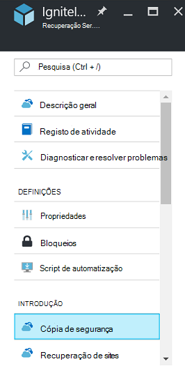
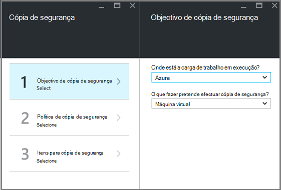
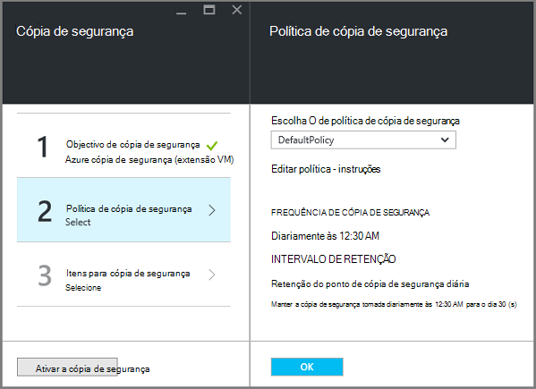
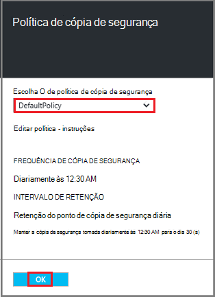
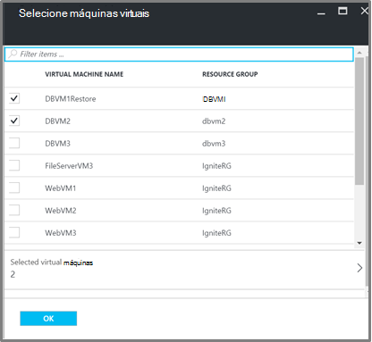
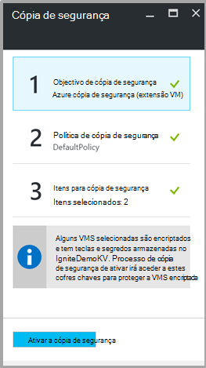

<properties
   pageTitle="Cópia de segurança e restauro encriptado VMs através de cópia de segurança do Azure"
   description="Este artigo fala sobre a cópia de segurança e restauro experiência para VMs encriptado através de encriptação do Azure do disco."
   services="backup"
   documentationCenter=""
   authors="JPallavi"
   manager="vijayts"
   editor=""/>
<tags
   ms.service="backup"
   ms.devlang="na"
   ms.topic="article"
   ms.tgt_pltfrm="na"
   ms.workload="storage-backup-recovery"
   ms.date="10/25/2016"
   ms.author="markgal; jimpark; trinadhk"/>

# Cópia de segurança e restauro encriptado VMs através de cópia de segurança do Azure

Este artigo fala sobre passos para fazer cópia de segurança e restaurar máquinas virtuais utilizando a cópia de segurança do Azure. Também fornece detalhes sobre cenários suportados, pré-requisitos e passos de resolução de problemas para o caso de erro.

## Cenários suportados

> [AZURE.NOTE]
1.  Cópia de segurança e restauro dos VMs encriptadas é suportado apenas para máquinas virtuais de Gestor de recursos implementado. Não é suportada para máquinas virtuais de clássica.  
2.  É suportado apenas para máquinas virtuais encriptadas através de chave de encriptação BitLocker e a chave de encriptação. Não é suportada para máquinas virtuais encriptadas utilizando apenas a chave de encriptação BitLocker.  

## Pré-requisitos

1.  Máquina virtual tenham sido encriptada utilizar [Encriptação do Azure do disco](../security/azure-security-disk-encryption.md). Ser encriptado com chave de encriptação BitLocker e a chave de encriptação.
2.  Recuperação serviços cofre foi criado e conjunto de replicação de armazenamento utilizando passos mencionados no artigo [preparar o seu ambiente para cópia de segurança](backup-azure-arm-vms-prepare.md).

## Cópia de segurança encriptada VM
Utilize os passos seguintes para definir o objetivo de cópia de segurança, definir uma política, configurar itens e cópia de segurança de accionador.

### Configurar cópia de segurança

1. Se já tiver um cofre de serviços de recuperação abrir, avance para o próximo passo. Se não possui um serviços de recuperação do Cofre de palavras aberta, mas são no portal do Azure, no menu concentrador, clique em **Procurar**.

  - Na lista de recursos, escreva **Serviços de recuperação**.
  - À medida que começa a escrever, os filtros de lista com base no seu teclado. Quando vir **cofres de serviços de recuperação**, clique na mesma.
  
        

    É apresentada a lista de serviços de recuperação cofres. Na lista de serviços de recuperação cofres, selecione um cofre.

    O dashboard selecionado Cofre é aberta.

2. A partir da lista de itens que é apresentada em cofre, clique em **cópia de segurança** para abrir o pá de cópia de segurança.

       
    
3. No pá cópia de segurança, clique em **objectivo de cópia de segurança** para abrir o pá de objectivo de cópia de segurança.

       
    
4.   No pá objectivo de cópia de segurança, configure **onde está a carga de trabalho em execução** para Azure e **o que fazer pretende efectuar cópia de segurança** para Máquina Virtual, em seguida, clique em **OK**.

    Fecha a pá de objectivo de cópia de segurança e abre o pá de política de cópia de segurança.

       

5. No pá de política de cópia de segurança, selecione a política de cópia de segurança que pretende aplicar ao Cofre de palavras e clique em **OK**.

       

    Os detalhes da política predefinida estão listados nos detalhes. Se pretender criar uma política, selecione **Criar novo** a partir do menu pendente. Assim que clica em **OK**, a política de cópia de segurança está associada com o cofre.

    Em seguida, selecione VMs para associar o cofre.
    
6. Selecione as máquinas virtuais encriptadas para associar a política especificada e clique em **OK**.

      
   
7. Esta página mostra uma mensagem sobre chave cofre associada às VMs encriptadas selecionadas. Serviço de cópia de segurança requer acesso só de leitura para as chaves e segredos no Cofre de palavras chave. Utiliza estas permissões a chave de cópia de segurança e palavra-passe, juntamente com os VMs associados. 

      

      Agora que definiu todas as definições para cofre, no pá a cópia de segurança clique em ativar a cópia de segurança na parte inferior da página. Ativar cópia de segurança implementa a política cofre e os VMs.

8. A fase seguinte preparação estiver a instalar o agente VM ou certificar-se de que o agente VM está instalado. Para fazer o mesmo, utilize os passos mencionados no artigo [preparar o seu ambiente para cópia de segurança](backup-azure-arm-vms-prepare.md). 

### Tarefa de cópia de segurança acionador
Utilize os passos mencionados no artigo [Cópia de segurança Azure VMs Cofre de serviços de recuperação](backup-azure-arm-vms.md) para tarefa de cópia de segurança de accionador.

## Restaurar VM encriptada
Experiência de restaurar para encriptadas e não encriptado máquinas virtuais é a mesma. Utilize os passos mencionados [Restaurar máquinas virtuais no Azure portal](backup-azure-arm-restore-vms.md) para restaurar a VM encriptada. No caso de precisar de restaurar teclas e segredos, certifique-se de que cofre chave restaurá-las deve já existentes.

## Resolução de problemas de erros

| Operação | Detalhes do erro | Resolução |
| -------- | -------- | -------|
| Cópia de segurança | Falha na validação como máquina virtual está encriptada com BEK sozinho. Cópias de segurança podem ser ativadas apenas para máquinas virtuais encriptadas com BEK e KEK. | Máquina virtual deve ser encriptada utilizando BEK e KEK. Após esta ação, deve ser ativada cópia de segurança. |
| Restaurar | Não é possível restaurar este VM encriptada uma vez que não existe chave cofre associada este VM. | Crie cofre chave utilizando a [Introdução ao Azure chave cofre](../key-vault/key-vault-get-started.md). Consulte o artigo [Restaurar chave cofre chave e secreta utilizando Azure cópia de segurança](backup-azure-restore-key-secret.md) para restaurar chave e palavra-passe, se não estiverem presentes. |
| Restaurar | Não é possível restaurar este VM encriptada uma vez que não existem chave e palavra-passe associada este VM. | Consulte o artigo [Restaurar chave cofre chave e secreta utilizando Azure cópia de segurança](backup-azure-restore-key-secret.md) para restaurar chave e palavra-passe, se não estiverem presentes. |
