<properties
    pageTitle="Primeiro olhar: proteger Azure VMs com serviços cofre recuperação | Microsoft Azure"
    description="Protege Azure VMs com serviços cofre recuperação. Utilize as cópias de segurança de VMs implementado Gestor de recursos, VMs implementado clássica e Premium armazenamento VMs para proteger os seus dados. Criar e registar um cofre de serviços de recuperação. Registe-se VMs, criar a política e proteger VMs no Azure."
    services="backup"
    documentationCenter=""
    authors="markgalioto"
    manager="cfreeman"
    editor=""
    keyword="backups; vm backup"/>

<tags
    ms.service="backup"
    ms.workload="storage-backup-recovery"
    ms.tgt_pltfrm="na"
    ms.devlang="na"
    ms.topic="hero-article"
    ms.date="10/13/2016"
    ms.author="markgal; jimpark"/>

# Primeiro olhar: proteger Azure VMs com serviços cofre recuperação

> [AZURE.SELECTOR]
- [Proteger VMs com cofre recuperação serviços](backup-azure-vms-first-look-arm.md)
- [Proteger VMs com uma cópia de segurança Cofre](backup-azure-vms-first-look.md)

Neste tutorial leva-o através dos passos para criar um cofre de serviços de recuperação e cópias de segurança uma máquina virtual Azure (VM). Proteger cofres de serviços de recuperação:

- Azure VMs implementado Gestor de recursos
- VMs clássicos
- Armazenamento padrão VMs
- Armazenamento de Premium VMs
- VMs encriptados através de encriptação do Azure do disco, com BEK e KEK

Para obter mais informações sobre como proteger armazenamento Premium VMs, consulte o artigo [criar cópias de segurança e restaurar VMs armazenamento Premium](backup-introduction-to-azure-backup.md#back-up-and-restore-premium-storage-vms)

>[AZURE.NOTE] Neste tutorial assume que já tem uma VM na sua subscrição do Azure e que tenham tomadas medidas para permitir que o serviço de cópia de segurança aceder a VM.

[AZURE.INCLUDE [learn-about-Azure-Backup-deployment-models](../../includes/backup-deployment-models.md)]

De alto nível, Eis os passos que irá concluir.  

1. Crie um cofre de serviços de recuperação para uma VM.
2. Utilize o portal do Azure para selecionar um cenário, definir a política e identificar itens para proteger.
3. Execute a cópia de segurança inicial.

## Criar um cofre de serviços de recuperação para uma VM

Recuperação serviços Cofre é uma entidade que armazena todas as cópias de segurança e pontos de recuperação que foram criados ao longo do tempo. O Cofre de serviços de recuperação também contém a política de cópia de segurança aplicada às VMs protegidas.

>[AZURE.NOTE] Cópias de segurança VMs são um processo local. Não é possível agregar VMs de uma localização para recuperação serviços cofre noutra localização. Sim, para cada localização Azure que tenha VMs para ser cópias de segurança, pelo menos uma recuperação serviços cofre tem de existir nessa localização.

Para criar uma recuperação serviços cofre:

1. Inicie sessão no [portal do Azure](https://portal.azure.com/).

2. No menu concentrador, clique em **Procurar** e na lista de recursos, **Serviços de recuperação**. À medida que começa a escrever, os filtros de lista com base no seu teclado. Clique em **Serviços de recuperação cofre**.

    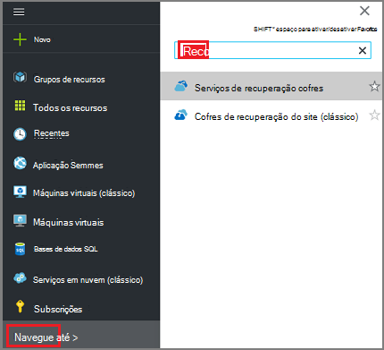  

    São apresentadas na lista de cofres de serviços de recuperação.

3. No menu de **Serviços de recuperação cofres** , clique em **Adicionar**.

    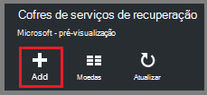

    O pá cofre serviços de recuperação abre-se, perguntar para fornecer um **nome**, a **subscrição**, o **grupo de recursos**e a **localização**.

    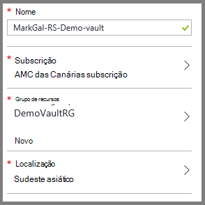

4. Para o **nome**, introduza um nome amigável para identificar o cofre. O nome tem de ser exclusivo para a subscrição Azure. Escreva um nome que contém entre 2 e 50 carateres. Tem de iniciar por uma letra e pode conter apenas letras, números e hífenes.

5. Clique em **subscrição** para ver a lista de subscrições disponível. Se não tiver a certeza de qual para utilizar a sua subscrição, utilize a predefinição (ou sugeridos) subscrição. Existem várias opções apenas se a sua conta institucional está associada com múltiplas subscrições Azure.

6. Clique em **grupo de recursos** para ver a lista de grupos de recursos disponível ou clique em **Novo** para criar um grupo de recursos. Para obter informações completas sobre grupos de recursos, consulte o artigo [Descrição geral do Gestor de recursos do Azure](../azure-resource-manager/resource-group-overview.md)

7. Clique em **localização** para selecionar a região geográfica para o cofre. O cofre, **tem** de ser na mesma região como as máquinas virtuais que pretende proteger.

    >[AZURE.IMPORTANT] Se tem a certeza da localização na qual está a VM, feche fora da caixa de diálogo de criação do cofre e ir para a lista de máquinas virtuais no portal. Se tiver máquinas virtuais no várias regiões, crie uma Cofre de serviços de recuperação em cada região. Crie o Cofre na primeira localização antes de passar para a seguinte. Não é necessário para especificar as contas de armazenamento para armazenar os dados de cópia de segurança – o Cofre de serviços de recuperação e o serviço de cópia de segurança do Azure tratar este automaticamente.

8. Clique em **Criar**. Pode demorar algum tempo para o Cofre de serviços de recuperação seja criada. Monitorize as notificações de estado na área superior direita no portal. Quando estiver criado cofre, aparece na lista de cofres de serviços de recuperação.

    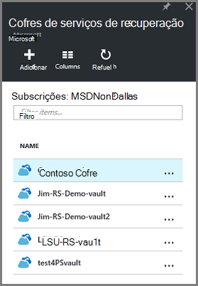

Agora que criou cofre, saiba como configurar a replicação de armazenamento.

### Definir a replicação de armazenamento

A opção de replicação de armazenamento permite-lhe escolher entre armazenamento geo redundantes e armazenamento localmente redundante. Por predefinição, o seu Cofre tem armazenamento geo redundante. Deixe a opção definida como armazenamento geo redundante se esta é a cópia de segurança principal. Selecione armazenamento localmente redundante se pretender que uma opção de menos dispendiosa que não esteja tão resistente. Leia mais informações sobre [geo redundantes](../storage/storage-redundancy.md#geo-redundant-storage) e opções de armazenamento [redundantes localmente](../storage/storage-redundancy.md#locally-redundant-storage) num [Descrição geral de replicação de armazenamento do Windows Azure](../storage/storage-redundancy.md).

Para editar a definição de replicação de armazenamento:

1. Selecione o seu Cofre para abrir o dashboard do cofre e pá as definições. Se a pá **Definições** não abrir, clique em **todas as definições** no dashboard de cofre.

2. No pá **Definições** , clique em **Cópia de segurança infraestrutura** > **Configuração de cópia de segurança** para abrir o pá de **Configuração de cópia de segurança** . Na pá **Configuração de cópia de segurança** , selecione a opção de replicação de armazenamento para o cofre.

    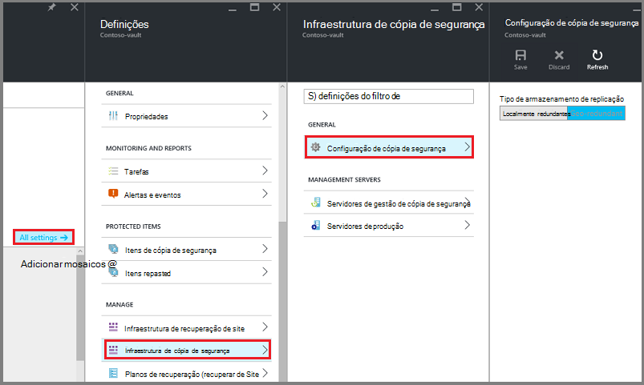

    Depois de escolher a opção de armazenamento para o cofre, está pronto para associar a VM cofre. Para começar a associação, deve descobrir e registar as máquinas virtuais Azure.

## Selecione um objetivo de cópia de segurança, definir a política e definir itens para proteger

Antes de registar uma VM com cofre, execute o processo de deteção para se certificar de que estão identificadas qualquer máquinas virtuais novas que tenham sido adicionadas à subscrição. As consultas de processo Azure para a lista de máquinas virtuais da subscrição, juntamente com informações adicionais, como o nome do serviço na nuvem e a região. No portal do Azure, cenário refere-se para o que vai colocar para o Cofre de serviços de recuperação. A política é a agenda para com que frequência e quando forem tomados pontos de recuperação. A política também inclui o intervalo de retenção para os pontos de recuperação.

1. Se já tiver uma serviços de recuperação cofre abrir, avance para o passo 2. Se não tiver uma recuperação de serviços do Cofre de palavras aberta, mas são no portal do Azure, no menu concentrador, clique em **Procurar**.

  - Na lista de recursos, escreva **Serviços de recuperação**.
  - À medida que começa a escrever, os filtros de lista com base no seu teclado. Quando vir **cofres de serviços de recuperação**, clique na mesma.

      

    É apresentada a lista de cofres de serviços de recuperação.
  - Na lista de cofres de serviços de recuperação, selecione um cofre.

    O dashboard selecionado Cofre é aberta.

    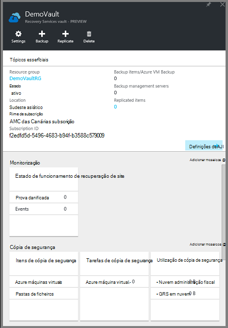

2. No menu de dashboard do cofre, clique em **cópia de segurança** para abrir o pá de cópia de segurança.

    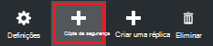

    Quando abre o pá, o serviço de cópia de segurança procura qualquer VMs novos na subscrição.

    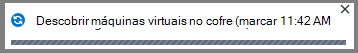

3. No pá cópia de segurança, clique em **objectivo de cópia de segurança** para abrir o pá de objectivo de cópia de segurança.

    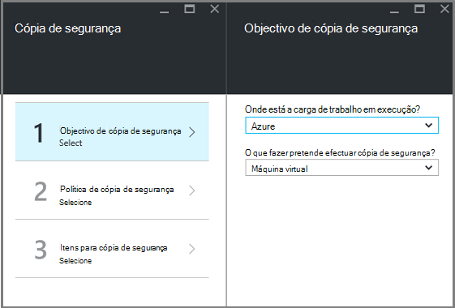

4. No pá objectivo de cópia de segurança, configure **onde está a carga de trabalho em execução** para Azure e **o que fazer pretende efectuar cópia de segurança** para Máquina Virtual, em seguida, clique em **OK**.

    Fecha a pá de objectivo de cópia de segurança e abre o pá de política de cópia de segurança.

    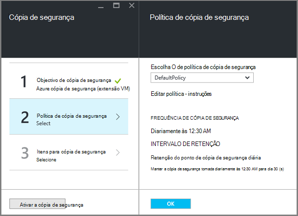

5. No pá de política de cópia de segurança, selecione a política de cópia de segurança que pretende aplicar ao Cofre de palavras e clique em **OK**.

    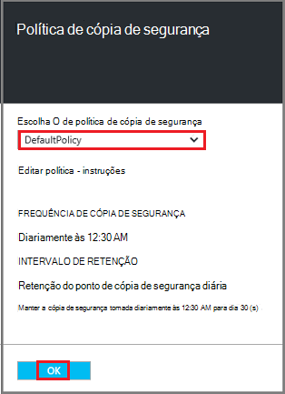

    Os detalhes da política predefinida estão listados nos detalhes. Se pretender criar uma política, selecione **Criar novo** a partir do menu pendente. No menu pendente também fornece uma opção para mudar o tempo quando o instantâneo é despendido, para 7 PM. Para obter instruções sobre como definir uma política de cópia de segurança, consulte o artigo [definir uma política de cópia de segurança](backup-azure-vms-first-look-arm.md#defining-a-backup-policy). Assim que clica em **OK**, a política de cópia de segurança está associada com o cofre.

    Em seguida, selecione VMs para associar o cofre.

6. Selecione as máquinas virtuais para associar a política especificada e clique em **Selecionar**.

    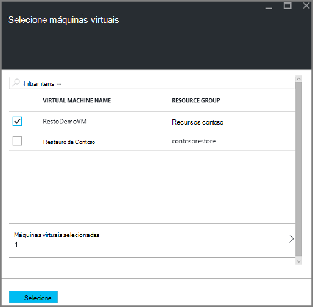

    Se não vir a VM pretendida, verifique se existe na mesma localização Azure como o Cofre de serviços de recuperação.

7. Agora que definiu todas as definições para cofre, no pá a cópia de segurança clique em **Ativar a cópia de segurança** na parte inferior da página. Isto implementa a política cofre e os VMs.

    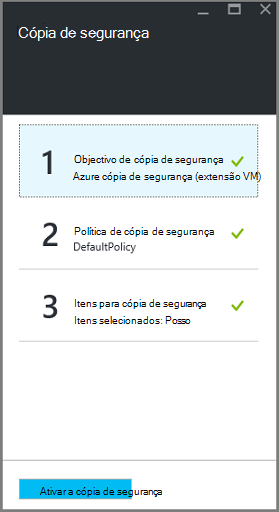

## Cópia de segurança inicial

Assim que uma política de cópia de segurança foi implementada na máquina virtual, que significa não os dados tem sido cópia de segurança. Por predefinição, a primeira agendada cópia de segurança (conforme definido na política de cópia de segurança) é a cópia de segurança inicial. Até que a cópia de segurança inicial ocorre, o último Estado de cópia de segurança no pá **Tarefas de cópia de segurança** mostra como **aviso (cópia de segurança inicial pendentes)**.

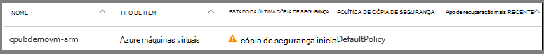

A menos que a cópia de segurança inicial vence iniciar mais cedo, é recomendável que execute **fazer cópia de segurança agora**.

Para executar a **fazer cópia de segurança agora**:

1. No dashboard de cofre, no mosaico de **cópia de segurança** , clique em **máquinas virtuais do Azure**  
    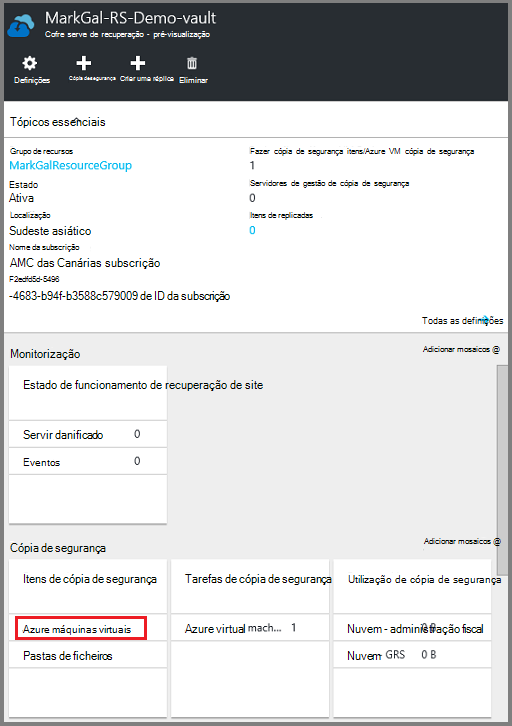

    É aberta a pá de **Itens de cópia de segurança** .

2. No pá **Itens de cópia de segurança** , com o botão direito no cofre que pretende fazer cópia de segurança e clique em **cópia de segurança agora**.

    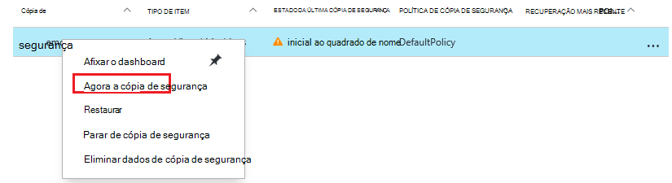

    A tarefa de cópia de segurança é acionada.  

    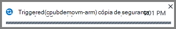

3. Para ver que foi concluída a cópia de segurança inicial, no dashboard de cofre, no mosaico **Trabalhos de cópia de segurança** , clique em **máquinas virtuais Azure**.

    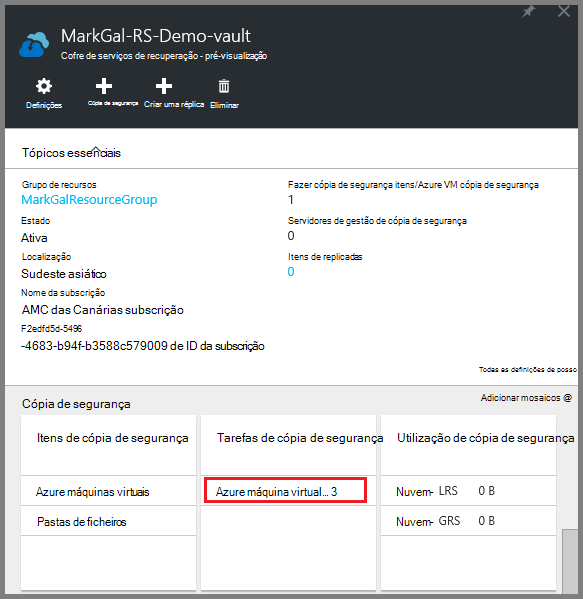

    É aberta a pá trabalhos de cópia de segurança.

4. No pá de tarefas de cópia de segurança, pode ver o estado de todas as tarefas.

    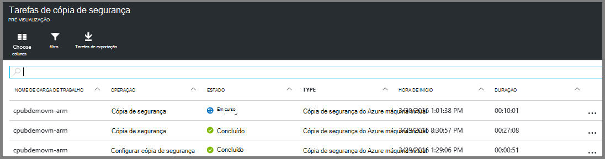

    >[AZURE.NOTE] Como parte da operação de cópia de segurança, o serviço de cópia de segurança do Azure emite um comando a extensão da cópia de segurança na cada VM para esvaziar a todas as gravações e tirar um instantâneo consistente.

    Quando tiver terminada a tarefa de cópia de segurança, o estado é *concluído*.

[AZURE.INCLUDE [backup-create-backup-policy-for-vm](../../includes/backup-create-backup-policy-for-vm.md)]

## Instalar o agente de VM na máquina virtual

Esta informação é fornecida no caso de é necessária. O agente de VM Azure tem de estar instalado no computador virtual Azure para a extensão de cópia de segurança trabalhar. No entanto, se a VM foi criada a partir da Galeria Azure, em seguida, o agente VM já existe na máquina virtual. VMs são migrados do centros de dados no local seria não ter o agente VM instalado. Neste caso, o agente VM tem de estar instalado. Se ocorrerem problemas de cópias de segurança a VM Azure, verifique que o agente de VM Azure corretamente está instalado no computador virtual (consulte a tabela abaixo). Se criar uma VM personalizada, [Certifique-se de que a caixa de verificação **instalar o agente VM** está selecionada](../virtual-machines/virtual-machines-windows-classic-agents-and-extensions.md) antes da máquina virtual está aprovisionado.

Saiba mais sobre o [Agente de VM](https://go.microsoft.com/fwLink/?LinkID=390493&clcid=0x409) e [como instalá-lo](../virtual-machines/virtual-machines-windows-classic-manage-extensions.md).

A tabela seguinte fornece informações adicionais sobre a VM agente para Windows e Linux VMs.

| **Operação** | **Windows** | **Linux** |
| --- | --- | --- |
| Instalar o agente VM | <li>Transfira e instale o [agente MSI](http://go.microsoft.com/fwlink/?LinkID=394789&clcid=0x409). Precisa de privilégios de administrador para concluir a instalação. <li>[Atualize a propriedade VM](http://blogs.msdn.com/b/mast/archive/2014/04/08/install-the-vm-agent-on-an-existing-azure-vm.aspx) para indicar que o agente está instalado. | <li> Instale o mais recente [Linux agente](https://github.com/Azure/WALinuxAgent) a partir de GitHub. Precisa de privilégios de administrador para concluir a instalação. <li> [Atualize a propriedade VM](http://blogs.msdn.com/b/mast/archive/2014/04/08/install-the-vm-agent-on-an-existing-azure-vm.aspx) para indicar que o agente está instalado. |
| Atualizar o agente VM | Atualizar o agente VM é tão simple como reinstalar o [agente de VM binários](http://go.microsoft.com/fwlink/?LinkID=394789&clcid=0x409).  Certifique-se de que nenhuma operação de cópia de segurança está em execução enquanto o agente VM está a ser atualizado. | Siga as instruções em [atualizar o agente de VM Linux ](../virtual-machines-linux-update-agent.md).  Certifique-se de que nenhuma operação de cópia de segurança está em execução enquanto o agente VM está a ser atualizado. |
| Validar a instalação do agente de VM | <li>Navegue para a pasta de *C:\WindowsAzure\Packages* na Azure VM. <li>Deverá localizar o ficheiro de WaAppAgent.exe apresentar.<li> Com o botão direito no ficheiro, aceda às **Propriedades**e, em seguida, selecione o separador **Detalhes** . O campo de versão do produto deve ser 2.6.1198.718 ou superior. | N/D |

### Extensão de cópia de segurança

Quando o agente VM estiver instalado no computador virtual, o serviço de cópia de segurança do Azure instala a extensão de cópia de segurança para o agente de VM. O serviço de cópia de segurança do Azure actualiza de forma totalmente integrada e correcções a extensão de cópia de segurança sem intervenção do utilizador adicionais.

A extensão de cópia de segurança é instalada pelo serviço de cópia de segurança, se está a executar a VM. Uma VM em execução fornece maior dar a oportunidade de obter um ponto de recuperação aplicação consistente. No entanto, o serviço de cópia de segurança do Azure continua a fazer cópia de segurança a VM mesmo se estiver desativada e não foi possível instalar a extensão. Isto é conhecido como Offline VM. Neste caso, o ponto de recuperação serão *Falha consistente*.

## Informações de resolução de problemas
Se está a ter problemas realização de algumas das tarefas neste artigo, consulte as [orientações de resolução de problemas](backup-azure-vms-troubleshoot.md).

## Preços
Cópia de segurança do Azure VM será cobrada com base no modelo de instâncias protegida. Saiba mais informações sobre [Preços de cópia de segurança](https://azure.microsoft.com/pricing/details/backup/)

## Perguntas?
Se tiver dúvidas, ou se existir qualquer funcionalidade que pretende ver incluídas, [envie-nos comentários](http://aka.ms/azurebackup_feedback).
