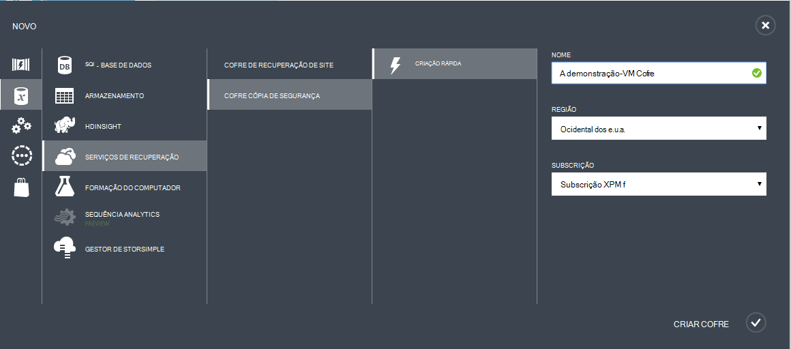
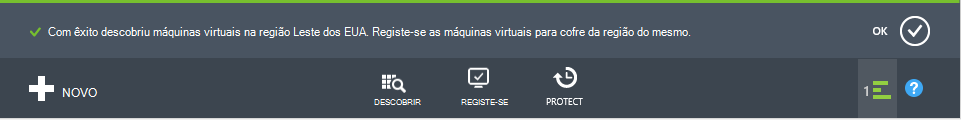

<properties
    pageTitle="Apresentação: Proteger Azure VMs com uma cópia de segurança Cofre | Microsoft Azure"
    description="Protege Azure VMs com Cofre de cópia de segurança. Tutorial explica criar cofre, registe-se VMs, criar política e proteger VMs no Azure."
    services="backup"
    documentationCenter=""
    authors="markgalioto"
    manager="cfreeman"
    editor=""/>

<tags
    ms.service="backup"
    ms.workload="storage-backup-recovery"
    ms.tgt_pltfrm="na"
    ms.devlang="na"
    ms.topic="hero-article"
    ms.date="09/15/2016"
    ms.author="markgal; jimpark"/>

# Primeiro olhar: cópias de segurança máquinas virtuais Azure

> [AZURE.SELECTOR]
- [Proteger VMs com cofre recuperação serviços](backup-azure-vms-first-look-arm.md)
- [Proteger Azure VMs com uma cópia de segurança Cofre](backup-azure-vms-first-look.md)

Neste tutorial leva-o através dos passos para criar cópias de segurança de uma máquina de virtuais Azure (VM) para uma cópia de segurança cofre no Azure. Este artigo descreve o modelo clássico ou modelo de implementação do Gestor do serviço, de cópias de segurança VMs. Se estiver interessado em cópias de uma VM para um cofre de serviços de recuperação que pertence a um grupo de recursos, consulte o artigo [primeiro olhar: proteger VMs com um cofre de serviços de recuperação](backup-azure-vms-first-look-arm.md). Para concluir com êxito neste tutorial, tem de existir estes pré-requisitos:

- Ter criado uma VM na sua subscrição do Azure.
- A VM tem conectividade ao Azure endereços IP públicos. Para obter informações adicionais, consulte [a conectividade da rede](./backup-azure-vms-prepare.md#network-connectivity).

Para agregar uma VM, existem cinco passos principais:  

 identificar um cofre de cópia de segurança existente ou criar uma cópia de segurança cofre.  
 utilizar o portal do Azure clássico para detetar e registar as máquinas virtuais.  
 instalar o agente VM.  
 criar a política para proteger as máquinas virtuais.  
 executar a cópia de segurança.

>[AZURE.NOTE] Azure tem dois modelos de implementação para criar e trabalhar com recursos: [Gestor de recursos e clássica](../resource-manager-deployment-model.md). Neste tutorial é para utilização com os VMs que podem ser criados no portal do Azure clássica. O serviço de cópia de segurança do Azure suporta VMs com base no Gestor de recursos. Para obter detalhes sobre cópias VMs para cofre recuperação serviços, consulte o artigo [veja primeiro: proteger VMs com um cofre de serviços de recuperação](backup-azure-vms-first-look-arm.md).

## Passo 1 - criar uma cópia de segurança cofre para uma VM

Uma cópia de segurança Cofre é uma entidade que armazena todas as cópias de segurança e pontos de recuperação que foram criados ao longo do tempo. O cópia de segurança cofre também contém as políticas de cópia de segurança que são aplicadas a máquinas virtuais a ser cópias de segurança.

1. Inicie sessão no [portal Azure clássica](http://manage.windowsazure.com/).

2. No canto inferior esquerdo do Azure portal, clique em **Novo**

    

3. No Assistente de criação rápida, clique em **Serviços de dados** > **Serviços de recuperação** > **Cofre de cópia de segurança** > **Criação rápida**.

    

    O assistente pede-lhe o **nome** e a **região**. Se administrar mais do que uma subscrição, é apresentada uma caixa de diálogo para escolher a subscrição.

4. Para o **nome**, introduza um nome amigável para identificar o cofre. O nome tem de ser exclusivo para a subscrição Azure.

5. Na **região**, selecione a região geográfica para o cofre. O cofre, **tem** de ser na mesma região como as máquinas virtuais protege.

    Se não souber a região em que existe a VM, fechar este assistente e clique em **máquinas virtuais** na lista de serviços Azure. A coluna localização fornece o nome da região. Se tiver máquinas virtuais em várias regiões, crie uma cópia de segurança cofre em cada região.

6. Se existir sem diálogo **subscrição** no assistente, avance para o próximo passo. Se trabalha com múltiplas subscrições, selecione uma subscrição para associar o novo cofre cópia de segurança.

    

7. Clique em **Criar cofre**. Pode demorar algum tempo para o Cofre cópia de segurança criação de. Monitorize as notificações de estado na parte inferior do portal.

    

    Uma mensagem confirma que o Cofre foi criado com êxito. Estiver listado na página de **Serviços de recuperação** como **ativo**.

    

8. Na lista de cofres na página de **Serviços de recuperação** , selecione o cofre que criou para iniciar a página de **Início rápido** .

    

9. Na página de **Início rápido** , clique em **Configurar** para abrir a opção de replicação de armazenamento.
    

10. A opção de **replicação de armazenamento** , selecione a opção de replicação para o cofre.

    

    Por predefinição, o seu Cofre tem armazenamento geo redundante. Selecione armazenamento geo redundante se esta é a cópia de segurança principal. Selecione armazenamento localmente redundante se pretender que uma opção de menos dispendiosa que não se adequarem como resistente. Leia mais sobre as opções de armazenamento geo redundantes e localmente redundantes na [Descrição geral de replicação de armazenamento do Windows Azure](../storage/storage-redundancy.md).

Depois de escolher a opção de armazenamento para o cofre, está pronto para associar a VM cofre. Para começar a associação, descobrir e registar as máquinas virtuais Azure.

## Passo 2 - descobrir e máquinas virtuais do Azure registe-se
Antes de registar a VM com cofre, execute o processo de deteção para identificar qualquer VMs novos. Isto devolve uma lista de máquinas virtuais da subscrição, juntamente com informações adicionais, como o nome do serviço na nuvem e a região.

1. Inicie sessão no [portal Azure clássico](http://manage.windowsazure.com/)

2. No portal do Azure clássico, clique em **Serviços de recuperação** para abrir a lista de serviços de recuperação cofres.
    

3. Na lista de cofres, selecione o cofre para agregar uma VM.

    Quando selecionar cofre, abre-se na página de **Início rápido**

4. No menu do cofre, clique em **Itens registado**.

    

5. A partir do menu **tipo** , selecione **Azure Virtual Machine**.

    

6. Clique em **DISCOVER** na parte inferior da página.
    

    O processo de deteção poderá demorar alguns minutos, enquanto as máquinas virtuais estão a ser distribuídos num quadro. Existe uma notificação na parte inferior do ecrã que permite-lhe saber se está a ser executado o processo.

    

    As alterações de notificação quando o processo estiver concluída.

    

7. Clique em **Registe-se** na parte inferior da página.
    

8. No menu de atalho **Registar itens** , selecione as máquinas virtuais ao qual pretende registar.

    >[AZURE.TIP] Várias máquinas virtuais pode estar registado junto ao mesmo tempo.

    É criada uma tarefa para cada máquina virtual que selecionou.

9. Clique em **Vista de tarefa** na notificação para ir para a página **tarefas** .

    

    A máquina virtual também é apresentada na lista de itens registados, juntamente com o estado da operação de registo.

    

    Quando a operação for concluída, o estado é alterado para refletir o estado *registado* .

    

## Passo 3 - instalar o agente de VM na máquina virtual

O agente de VM Azure tem de estar instalado no computador virtual Azure para a extensão de cópia de segurança trabalhar. Se a VM foi criada a partir da Galeria Azure, o agente VM já está presente na VM. Pode avançar para [proteger a sua VMs](backup-azure-vms-first-look.md#step-4-protect-azure-virtual-machines).

Se o seu VM migrado a partir de um centro de dados no local, a VM provavelmente não possui o VM Agent instalado. Tem de instalar o agente VM na máquina virtual antes de prosseguir para proteger a VM. Para obter passos detalhados sobre como instalar o agente VM, consulte a [secção de VM agente do artigo VMs de cópia de segurança](backup-azure-vms-prepare.md#vm-agent).

## Passo 4 - criar a política de cópia de segurança
Antes de acionar a tarefa de cópia de segurança inicial, defina agendar quando são disponibilizados instantâneos cópia de segurança. A agenda quando forem tomados instantâneos cópia de segurança e o comprimento do tempo esses instantâneos são mantidas, é a política de cópia de segurança. As informações de retenção são baseadas num esquema de cópia de segurança rotação adquiridos-pai-filho.

1. Navegue para a cópia de segurança do Cofre de palavras em **Serviços de recuperação** no portal do Azure clássica e clique em **Itens registado**.
2. Selecione **máquina de Virtual Azure** a partir do menu pendente.

    

3. Clique em **proteger** na parte inferior da página.
    

    O **Assistente de proteger itens** aparece e lista *apenas* os máquinas virtuais que estão registados e não protegidos.

    

4. Selecione as máquinas virtuais que pretende proteger.

    Se existirem duas ou mais máquinas virtuais com o mesmo nome, utilize o serviço de nuvem para distinguir entre as máquinas virtuais.

5. No menu de **proteção de configurar** seleccionar uma política existente ou criar uma nova política para proteger as máquinas virtuais que identificou.

    Novos cofres de cópia de segurança tenham uma política de predefinido associada cofre. Esta política assume diária instantâneo cada noite e o instantâneo diário é mantido para 30 dias. Cada política de cópia de segurança pode ter várias máquinas virtuais associadas. No entanto, a máquina virtual só pode ser associada uma política de cada vez.

    

    >[AZURE.NOTE] Uma política de cópia de segurança inclui um esquema de retenção para as cópias de segurança agendadas. Se selecionar uma política de cópia de segurança existente, não será possível modificar as opções de retenção no próximo passo.

6. Num **Intervalo de retenção** defina o âmbito diário, semanal, mensal e anual para os pontos de cópia de segurança específicos.

    

    Política de retenção indica o comprimento do tempo para armazenar uma cópia de segurança. Pode especificar políticas de retenção diferente com base em quando a cópia de segurança é disponibilizada.

7. Clique em **tarefas** para ver a lista de tarefas **Proteção de configurar** .

    

    Agora que já estabelecidos a política, vá para o passo seguinte e execute a cópia de segurança inicial.

## Passo 5 - cópia de segurança inicial

Assim que uma máquina virtual foi protegida com uma política, pode ver essa relação no separador **Itens protegida** . Até que a cópia de segurança inicial ocorre, o **Estado de proteção** mostra como **protegido - (pendente cópia de segurança inicial)**. Por predefinição, a primeira cópia de segurança agendada é a *cópia de segurança inicial*.

Para iniciar a cópia de segurança inicial agora:

1. Na página **Itens protegido** , clique em **Cópia de segurança agora** na parte inferior da página.
    

    O serviço de cópia de segurança do Azure cria uma tarefa de cópia de segurança para a operação de cópia de segurança inicial.

2. Clique no separador **tarefas** para ver a lista de tarefas.

    

    Quando cópia de segurança inicial estiver concluída, o estado da máquina virtual no separador **Itens protegida** é *protegida*.

    

    >[AZURE.NOTE] Cópias de segurança máquinas virtuais são um processo local. Não é possível agregar máquinas virtuais a partir de uma região para uma cópia de segurança cofre noutra região. Sim, para cada região Azure que tenha VMs que precisam de ser cópias de segurança, pelo menos uma cofre cópia de segurança deve ser criada na região.

## Próximos passos
Agora que criou com êxito cópias uma VM, existem vários passos que podem ser de interesse. O passo mais lógico é familiarizar-se com a restaurar dados para uma VM. No entanto, existem tarefas de gestão de que irão ajudá-lo a compreender como manter os seus dados seguros e minimizar custos.

- [Gerir e monitorizar o seu máquinas virtuais](backup-azure-manage-vms.md)
- [Restaurar máquinas virtuais](backup-azure-restore-vms.md)
- [Resolução de problemas de orientação](backup-azure-vms-troubleshoot.md)

## Perguntas?
Se tiver dúvidas, ou se existir qualquer funcionalidade que pretende ver incluídas, [envie-nos comentários](http://aka.ms/azurebackup_feedback).
