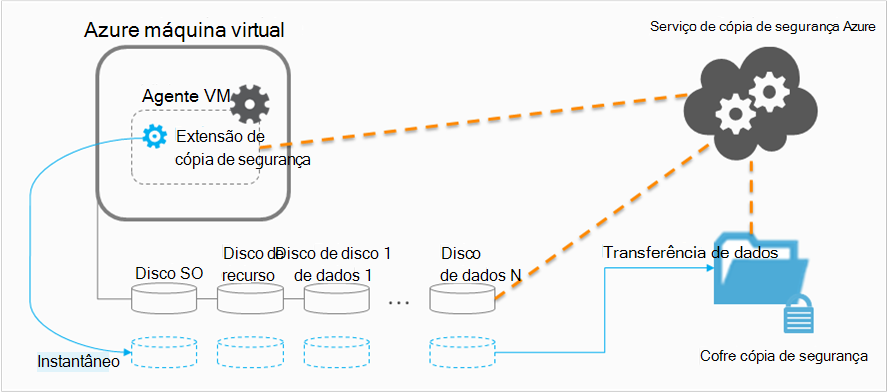

<properties
    pageTitle="Planear a sua infraestrutura de cópia de segurança VM no Azure | Microsoft Azure"
    description="Importantes considerações ao planear a cópia máquinas virtuais no Azure"
    services="backup"
    documentationCenter=""
    authors="markgalioto"
    manager="cfreeman"
    editor=""
    keywords="fazer cópia de segurança vms, criar cópias máquinas virtuais"/>

<tags
    ms.service="backup"
    ms.workload="storage-backup-recovery"
    ms.tgt_pltfrm="na"
    ms.devlang="na"
    ms.topic="article"
    ms.date="10/19/2016"
    ms.author="trinadhk; jimpark; markgal;"/>

# <a name="plan-your-vm-backup-infrastructure-in-azure"></a>Planear a sua infraestrutura de cópia de segurança VM no Azure
Este artigo fornece desempenho e sugestões de recursos para ajudar a planear a sua infraestrutura de cópia de segurança VM. Também define os aspetos chaves do serviço de cópia de segurança; Estes aspectos podem ser críticos para determinar a sua arquitetura, a capacidade de planeamento e de agendamento. Se tiver [preparada o seu ambiente](backup-azure-vms-prepare.md), este é o passo seguinte antes de começar [a cópia de segurança VMs](backup-azure-vms.md). Se precisar de mais informações sobre máquinas virtuais Azure, consulte a [documentação de máquinas virtuais](https://azure.microsoft.com/documentation/services/virtual-machines/).

## <a name="how-does-azure-back-up-virtual-machines"></a>Como é que o Azure cópias de segurança máquinas virtuais?
Quando o serviço de cópia de segurança do Azure inicia uma tarefa de cópia de segurança na hora agendada, accionar a extensão de cópia de segurança para tirar um instantâneo em qualquer altura. Este instantâneo é disponibilizado coordená-lo com o serviço de cópia de sombra de Volume (VSS) para obter um instantâneo consistente dos discos na máquina virtual sem ter de encerrá-lo.

Depois do instantâneo é disponibilizado, os dados são transferidos pelo serviço de cópia de segurança do Azure para o cópia de segurança cofre. Para tornar o processo de cópia de segurança mais eficiente, o serviço identifica e transfere apenas os blocos de dados que tenham sido alterados desde a última cópia de segurança.



Quando a transferência de dados estiver concluída, o instantâneo é removido e é criado um ponto de recuperação.

### <a name="data-consistency"></a>Consistência dos dados
Cópias de segurança e restaurar dados críticos são complicados pelo facto de dados de negócio críticas devem ser cópia de segurança enquanto as aplicações que produza os dados de negócio estão a executar. Para resolver este problema, cópia de segurança do Azure fornece aplicação consistentes cópias de segurança das cargas de trabalho do Microsoft utilizando VSS para se certificar de que dados escritos corretamente ao armazenamento.

>[AZURE.NOTE] Para Linux máquinas virtuais apenas as cópias de segurança ficheiro consistentes são possíveis, uma vez que Linux não tem uma plataforma equivalente para o VSS.

Cópia de segurança do Azure leva VSS completos as cópias de segurança no Windows VMs (mais informações sobre a [cópia de segurança completa VSS](http://blogs.technet.com/b/filecab/archive/2008/05/21/what-is-the-difference-between-vss-full-backup-and-vss-copy-backup-in-windows-server-2008.aspx)de leitura). Para ativar VSS cópias de segurança, o por baixo de registo de chave tem de ser definidas na VM.

```
[HKEY_LOCAL_MACHINE\SOFTWARE\MICROSOFT\BCDRAGENT]
"USEVSSCOPYBACKUP"="TRUE"
```


A seguinte tabela explica os tipos de consistência e as condições que ocorrem em durante Azure VM cópia de segurança e restaurar processos.

| Consistência | Com base em VSS | Explicação e detalhes |
|-------------|-----------|---------|
| Consistência da aplicação | Sim | Este é o tipo de consistência ideal das cargas de trabalho do Microsoft à medida que garante que:<ol><li> O VM *arrancar*. <li>Não existe *nenhuma danos*. <li>Existe *sem perda de dados*.<li> Os dados são consistentes para a aplicação que utiliza os dados, pelo que envolvem a aplicação no momento da cópia de segurança – utilizando o VSS.</ol> A maior parte dos Microsoft das cargas de trabalho tem escritores VSS que efetuar ações específicas de carga de trabalho que estão relacionada com a consistência dos dados. Por exemplo, o Microsoft SQL Server tem um gravador de VSS assegura que o escreve para o ficheiro de registo da transação e a base de dados é feito corretamente.<br><br> Para Azure VM cópias de segurança, introdução um ponto de recuperação aplicação consistentes significa que a cópia de segurança extensão conseguiu chamar o fluxo de trabalho VSS e executá-la *corretamente* antes do instantâneo VM foi tirado. Naturalmente, isto significa que os autores VSS de todas as aplicações na Azure VM foi chamados também.<br><br>(Conheça os [princípios básicos VSS](http://blogs.technet.com/b/josebda/archive/2007/10/10/the-basics-of-the-volume-shadow-copy-service-vss.aspx) e profundas ficar aceder aos detalhes de [como funciona](https://technet.microsoft.com/library/cc785914%28v=ws.10%29.aspx)). |
| Consistência sistema de ficheiros | Sim, para computadores baseados no Windows | Existem dois cenários onde o ponto de recuperação pode ser *sistema de ficheiros consistente*:<ul><li>Cópias de segurança das Linux VMs no Azure, uma vez que Linux não tem uma plataforma equivalente para o VSS.<li>Falha de VSS durante a cópia de segurança para Windows VMs no Azure.</li></ul> Em ambos os casos, o melhor que pode ser efetuado é para se certificar de que: <ol><li> O VM *arrancar*. <li>Não existe *nenhuma danos*.<li>Existe *sem perda de dados*.</ol> Precisam de aplicações implementar o seu próprio mecanismo "fix de segurança" os dados restaurados.|
| Falha de sistema consistência | N | Esta situação é equivalente a uma máquina de virtual com uma "Falha de sistema" (através de um de um repor contornos ou disco rígido). Normalmente, isto acontece quando a máquina virtual Azure encerrar no momento da cópia de segurança. Para cópias de segurança do Azure máquina virtual, introdução um meio de ponto de recuperação falha consistentes a cópia de segurança do Azure dá sem garantias à volta a consistência dos dados nos meios armazenamento – da perspetiva do sistema operativo ou da perspetiva da aplicação. Apenas os dados que já existem no disco no momento da cópia de segurança são o que é capturado e cópias de segurança. <br/> <br/> Apesar de existirem sem garantias, na maioria dos casos, o sistema operativo irá arrancar. Normalmente, isto é seguido por um procedimento de verificação do disco, como chkdsk, corrigir os erros de danos. Quaisquer dados na memória ou escritas não tem sido esvaziadas completamente para o disco serão perdidas. A aplicação, normalmente, segue-se as suas próprias através de verificação caso anulação dados necessita de ser executadas. <br><br>Por exemplo, se o registo de transações contém entradas que não estão presentes na base de dados, em seguida, o software de base de dados não uma reversão até que os dados são consistentes. Quando for distribuídos dados por vários discos virtuais (como volumes expandidos), um ponto de recuperação falha consistentes fornece sem garantias para a regularidade dos dados.|


## <a name="performance-and-resource-utilization"></a>Utilização de recursos e desempenho
Como o software de cópia de segurança que é implementado no local, deverá planear a capacidade e a utilização de recursos necessidades quando cópias de segurança VMs no Azure. Os [limites de armazenamento do Windows Azure](azure-subscription-service-limits.md#storage-limits) definir como estruturar implementações VM para obter um desempenho máximo com impacto mínimo em execução das cargas de trabalho.

Paga a atenção para os seguintes limites de armazenamento Azure ao planear o desempenho de cópia de segurança:

- Saída máximo por conta de armazenamento
- Taxa de total pedido por conta de armazenamento

### <a name="storage-account-limits"></a>Limites de conta de armazenamento
Sempre que os dados de cópia de segurança são copiados a partir de uma conta de armazenamento, conta a no sentido as operações de entrada/saída por segundo (IOPS) e saída (ou débito) métricas da conta de armazenamento. Ao mesmo tempo, as máquinas virtuais estiver em execução e consumir IOPS e débito. O objetivo é garantir que o tráfego total - máquina de cópia de segurança e virtual - não ultrapasse os limites da conta de armazenamento.

### <a name="number-of-disks"></a>Número de discos
O processo de cópia de segurança tentará concluir uma tarefa de cópia de segurança mais rapidamente possível. Ao fazê-lo,-consome recursos tantas como o-lo. No entanto, todas as operações de e/s estão limitadas por *Débito de destino para Blob única*, que tem um limite de 60 MB por segundo. Uma tentativa de maximizar a velocidade, o processo de cópia de segurança tenta cópia de segurança da VM discos *em paralelo*. Por isso, se uma VM tiver quatro discos, em seguida, Azure cópia de segurança tenta criar cópia de segurança de todos os quatro discos em paralelo. Por esta razão, o factor mais importante para determinar o tráfego de cópia de segurança sair de uma conta de armazenamento de cliente é o **número de discos** a ser cópia de segurança da conta de armazenamento.

### <a name="backup-schedule"></a>Agenda de cópia de segurança
Um factor adicional que impactos desempenho é a **agenda de cópia de segurança**. Se configurar as políticas para que todos os VMs cópia de segurança abrange ao mesmo tempo, agendou um doces tráfego. O processo de cópia de segurança irá tentar criar cópia de segurança de todos os discos em paralelo. Uma forma de reduzir o tráfego de cópia de segurança de uma conta de armazenamento é - Certifique-se de que VMs diferentes cópia de segurança abrange em alturas diferentes do dia, com sem sobreposição.

## <a name="capacity-planning"></a>Planeamento de capacidades
Colocar em conjunto em todas as seguintes fatores significa que a utilização de conta de armazenamento tem de ser planeado corretamente. Transferir o [cálculo do Excel planeamento capacidade de cópia de segurança VM](https://gallery.technet.microsoft.com/Azure-Backup-Storage-a46d7e33) para ver o impacto das suas disco e opções de cópia de segurança de agenda.

### <a name="backup-throughput"></a>Cópia de segurança débito
Para cada disco a ser cópia de segurança, cópia de segurança do Azure lê os blocos de no disco e armazena apenas os dados alterados (utilizarão cópia de segurança). Esta tabela mostra os valores de débito médio que pode esperar a partir do Azure cópia de segurança. Utilizar este, pode calcular a quantidade de tempo vai demorar a cópia de um disco de um determinado tamanho.

| Operação de cópia de segurança | Questão débito |
| ---------------- | ---------- |
| Cópia de segurança inicial | 160 Mbps |
| Cópia de segurança utilizarão (DR) | 640 Mbps <br><br> Este débito pode largar significativamente se existir muitas vasilha dispersa no disco que tem de ser cópias de segurança. |

## <a name="total-vm-backup-time"></a>Tempo de cópia de segurança VM total
Enquanto a maioria das vezes cópia de segurança é gasto em ler e copiar dados, existem outras operações que contribuem para o tempo total necessário para agregar uma VM:

- Tempo necessário para [instalar ou atualizar a extensão de cópia de segurança](backup-azure-vms.md#offline-vms).
- Instantâneo tempo, o que é o tempo despendido para acionar um instantâneo. Instantâneos são acionou perto da hora de cópia de segurança agendada.
- Tempo de espera fila de espera. Uma vez que o serviço de cópia de segurança está a processar cópias de segurança a partir de vários clientes, copiar dados de cópia de segurança a partir do instantâneo para a cópia de segurança ou serviços de recuperação cofre poderá não iniciar imediatamente. Nos tempos de pico carregar, o tempo de espera pode esticar até 8 horas devido o número de cópias de segurança a ser processada. No entanto, o tempo de cópia de segurança VM total será menos do que 24 horas para as políticas de cópia de segurança diárias.

## <a name="best-practices"></a>Melhores práticas
Sugerimos seguir estas práticas ao configurar as cópias de segurança para máquinas virtuais:

- Não agende mais do que quatro VMs clássicos de serviço na nuvem mesmo para criar cópias de segurança ao mesmo tempo. Sugerimos escalonamento horas de início de cópia de segurança por uma hora se pretender agregar várias VMs a partir do serviço na nuvem mesmo.
- Não agende mais de 40 VMs implementado Gestor de recursos para fazer cópia de segurança ao mesmo tempo.
- Agende cópias de segurança VM durante o horário de que não sejam de pico para que o serviço de cópia de segurança utiliza IOPS para transferir dados a partir da conta de armazenamento do cliente para a cópia de segurança ou serviços de recuperação do Cofre de palavras.
- Certifique-se de que uma política de endereços VMs distribuir por contas de armazenamento diferente. Sugerimos mais do que 20 protegidos por uma política de discos total de uma conta de armazenamento única. Se tiver maior do que 20 discos numa conta de armazenamento, distribuir a esses VMs por várias políticas para obter o IOPS necessários durante a fase de transferência do processo de cópia de segurança.
- Não restaurarem uma VM a ficar com Premium armazenamento à mesma conta de armazenamento. Se o processo de operação restauro coincidir com a operação de cópia de segurança, reduz o IOPS disponíveis para cópia de segurança.
- Recomendamos que execute cada VM Premium numa conta de armazenamento premium distintos para assegurar um desempenho ideal cópia de segurança.

## <a name="data-encryption"></a>Encriptação de dados

Cópia de segurança do Azure não encriptar os dados como uma parte do processo de cópia de segurança. No entanto, pode encriptar dados dentro da VM e agregar os dados protegidos de forma totalmente integrada (mais informações sobre a [cópia de segurança de dados encriptados](backup-azure-vms-encryption.md)de leitura).


## <a name="how-are-protected-instances-calculated"></a>Como são calculadas instâncias protegidas?
Azure máquinas virtuais que cópia de segurança abrange através de cópia de segurança do Azure está sujeito aos [preços de cópia de segurança do Azure](https://azure.microsoft.com/pricing/details/backup/). O cálculo protegidos instâncias baseia-se o tamanho *real* da máquina virtual, qual é a soma de todos os dados na máquina virtual – excluindo "disco de recurso".

Se *não* faturada com base no tamanho máximo que é suportado para cada disco de dados ligado à máquina virtual, mas dos dados reais armazenados no disco dados. Do mesmo modo, o título de armazenamento de cópia de segurança é baseado a quantidade de dados que são armazenadas com cópia de segurança Azure, que é a soma dos dados reais de cada ponto de recuperação.

Por exemplo, demorar uma máquina de virtual A2 padrão dimensionado de modo que tem dois discos dados adicionais com um tamanho máximo de 1 TB. A tabela abaixo dá os dados reais armazenados em cada um destes discos:

|Tipo de disco|Tamanho máximo|Dados reais apresentados|
|---------|--------|------|
| Disco do sistema operativo | 1023 GB | 17 GB |
| Disco local / disco de recurso | 135 GB | 5 GB (não incluído para cópia de segurança) |
| Disco de dados 1 | 1023 GB | 30 GB |
| Disco de dados 2 | 1023 GB | 0 GB |

Neste caso o tamanho *real* da máquina virtual é 17 GB + 30 GB + 0 GB = 47 GB. Isto torna-se o tamanho de instância protegida que fatura mensal é baseada no. À medida que aumenta a quantidade de dados na máquina virtual, o tamanho do protegida instância utilizado para faturação também serão mudam em conformidade.

Faturação não é iniciado até que a cópia de segurança com êxito primeira seja concluída. Neste momento, a faturação de armazenamento e instâncias protegida será iniciado. Faturação continua desde há *quaisquer dados de cópia de segurança armazenados com cópia de segurança do Azure* para a máquina virtual. Executar a operação de parar proteção não parar a faturação se os dados de cópia de segurança são mantidos.

A faturação para uma máquina virtual especificada vai ser descontinuada apenas se estiver a proteção parado *e* quaisquer dados de cópia de segurança são eliminados. Quando existem sem trabalhos de cópia de segurança ativos (quando tiver sido parada proteção), o tamanho da máquina virtual no momento da última cópia de segurança com êxito torna-se o tamanho de instância protegida que fatura mensal é baseada no.

## <a name="questions"></a>Perguntas?
Se tiver dúvidas, ou se existir qualquer funcionalidade que pretende ver incluídas, [envie-nos comentários](http://aka.ms/azurebackup_feedback).

## <a name="next-steps"></a>Próximos passos

- [Criar uma cópia de segurança máquinas virtuais](backup-azure-vms.md)
- [Gerir máquina virtual cópia de segurança](backup-azure-manage-vms.md)
- [Restaurar máquinas virtuais](backup-azure-restore-vms.md)
- [Resolução de problemas de cópia de segurança VM](backup-azure-vms-troubleshoot.md)
