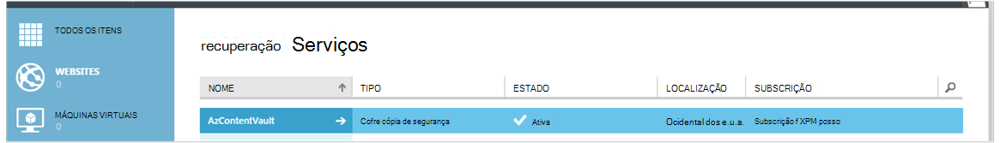
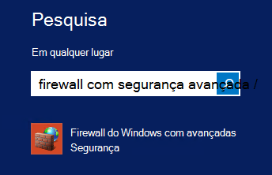
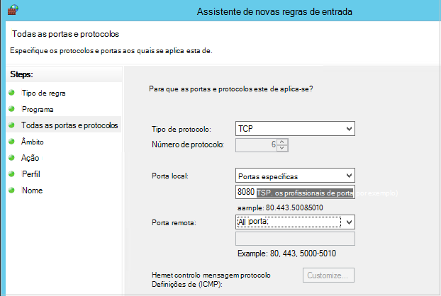

<properties
    pageTitle="Preparar o seu ambiente para agregar Azure máquinas virtuais | Microsoft Azure"
    description="Certifique-se de que o seu ambiente está preparado para cópias de segurança máquinas virtuais no Azure"
    services="backup"
    documentationCenter=""
    authors="markgalioto"
    manager="cfreeman"
    editor=""
    keywords="cópias de segurança; cópias de segurança;"/>

<tags
    ms.service="backup"
    ms.workload="storage-backup-recovery"
    ms.tgt_pltfrm="na"
    ms.devlang="na"
    ms.topic="article"
    ms.date="08/26/2016"
    ms.author="trinadhk; jimpark; markgal;"/>


# <a name="prepare-your-environment-to-back-up-azure-virtual-machines"></a>Preparar o seu ambiente para agregar máquinas virtuais Azure

> [AZURE.SELECTOR]
- [Modelo do Gestor de recursos](backup-azure-arm-vms-prepare.md)
- [Modelo clássico](backup-azure-vms-prepare.md)

Antes de que pode fazer cópia de segurança uma máquina virtual Azure (VM), existem três condições que tem de existir.

- Tem de criar uma cópia de segurança cofre ou identificar uma cópia de segurança cofre existente *na mesma região como a VM*.
- Estabelecer conectividade de rede entre os Azure endereços Internet públicos e os pontos finais de armazenamento Azure.
- Instale o agente VM na VM.

Se souber que estas condições já existem no seu ambiente, em seguida, avance para [agregar um artigo de VMs](backup-azure-vms.md). Caso contrário, continue a ler, este artigo irá guiá-lo através dos passos para preparar o seu ambiente para agregar um VM Azure.


## <a name="limitations-when-backing-up-and-restoring-a-vm"></a>Limitações quando cópias de segurança e restaurar uma VM

>[AZURE.NOTE] Azure tem dois modelos de implementação para criar e trabalhar com recursos: [Gestor de recursos e clássica](../resource-manager-deployment-model.md). A lista seguinte fornece as limitações ao implementar no modelo clássico.

- Cópias de segurança máquinas virtuais com mais de 16 discos de dados não são suportada.
- Cópias de segurança máquinas virtuais com um endereço IP reservado e nenhum ponto final definido não são suportada.
- Dados de cópia de segurança não incluem as unidades de rede instalado anexadas a VM. 
- Substituir uma máquina virtual existente durante o restauro não é suportada. Elimine pela primeira vez a máquina virtual existente e quaisquer discos associados e, em seguida, restaurar os dados a partir de cópia de segurança.
- Região de publicação em cópia de segurança e restauro não é suportada.
- Criar cópias de segurança de máquinas virtuais utilizando o serviço de cópia de segurança do Azure são suportada em todas as regiões públicas do Azure (consulte a [lista de verificação](https://azure.microsoft.com/regions/#services) das regiões suportados). Se a região que procurava não for suportada hoje, não irá aparecer na lista pendente durante a criação do cofre.
- Criar cópias de segurança de máquinas virtuais utilizando o serviço de cópia de segurança do Azure só são suportada para versões do sistema operativo selecione:
  - **Linux**: cópia de segurança Azure suporta [uma lista de distribuições que são reconhecidos por Azure](../virtual-machines/virtual-machines-linux-endorsed-distros.md) exceto Core SO Linux. Outros distribuições trazer o-proprietário-Linux também poderão funcionar, desde que o agente VM está disponível na máquina virtual e suporte para obter Python existe.
  - **Windows Server**: versões mais antigas do que o Windows Server 2008 R2 não são suportadas.
- Restaurar um controlador de domínio (CC) VM que faz parte de uma configuração multi Cc é suportado apenas através do PowerShell. Leia mais sobre como [restaurar um controlador de domínio multi CC](backup-azure-restore-vms.md#restoring-domain-controller-vms).
- Restaurar máquinas virtuais que tem as seguintes configurações de rede especiais é suportado apenas através do PowerShell. VMs que cria utilizando o fluxo de trabalho de restaurar na IU não terão estas configurações de rede depois de concluída a operação de restaurar. Para saber mais, consulte o artigo [Restaurar VMs com configurações de rede especial](backup-azure-restore-vms.md#restoring-vms-with-special-netwrok-configurations).
    - Máquinas virtuais em configuração do Balanceador de carga (interna e externa)
    - Máquinas virtuais com vários endereços IP reservadas
    - Máquinas virtuais com vários adaptadores de rede

## <a name="create-a-backup-vault-for-a-vm"></a>Criar uma cópia de segurança cofre para uma VM

Uma cópia de segurança Cofre é uma entidade que armazena todas as cópias de segurança e pontos de recuperação que foram criados ao longo do tempo. O cópia de segurança cofre também contém as políticas de cópia de segurança que irão ser aplicadas a máquinas virtuais a ser cópias de segurança.

Esta imagem mostra as relações entre várias entidades de cópia de segurança do Azure:     

Para criar uma cópia de segurança cofre:

1. Inicie sessão no [portal do Azure](http://manage.windowsazure.com/).

2. No portal do Azure, clique em **Novo** > **Híbrido integração** > **cópia de segurança**. Quando clica em **cópia de segurança**, irá mudar automaticamente ao portal do clássico (apresentado depois da nota).

    

    >[AZURE.NOTE] Se a sua subscrição foi utilizada pela última vez no portal do clássico, em seguida, a sua subscrição poderá ser aberto no portal do clássico. Neste caso, para criar uma cópia de segurança cofre, clique em **Novo** > **Serviços de dados** > **Serviços de recuperação** > **Cofre cópia de segurança** > **Criação rápida** (consulte a imagem abaixo).

    

3. Para o **nome**, introduza um nome amigável para identificar o cofre. O nome tem de ser exclusivo para a subscrição Azure. Escreva um nome que contém entre 2 e 50 carateres. Tem de iniciar por uma letra e pode conter apenas letras, números e hífenes.

4. Na **região**, selecione a região geográfica para o cofre. O Cofre tem de ser na mesma região como as máquinas virtuais que pretende proteger. Se tiver máquinas virtuais no várias regiões, terá de criar uma cópia de segurança cofre em cada região. Não é necessário para especificar contas de armazenamento para armazenar os dados de cópia de segurança – o Cofre cópia de segurança e a alça de serviço de cópia de segurança do Azure isto automaticamente.

5. Na **subscrição** selecione a subscrição que pretende associar o cópia de segurança cofre. Haverá múltiplas escolhas apenas se a sua conta institucional está associada com múltiplas subscrições Azure.

6. Clique em **Criar cofre**. Pode demorar algum tempo para o Cofre cópia de segurança criação de. Monitorize as notificações de estado na parte inferior do portal.

    

7. Uma mensagem irá confirmar que o Cofre foi criado com êxito. Este será listado na página de **Serviços de recuperação** como **ativo**. Certifique-se escolher à direita do armazenamento adequado redundância opção depois de ter sido criado no cofre. Leia mais sobre como [definir a opção de redundância de armazenamento no cofre cópia de segurança](backup-configure-vault.md#azure-backup---storage-redundancy-options).

    

8. Clique no cofre cópia de segurança para aceder à página de **Início rápido** , onde são apresentadas as instruções para cópias de segurança máquinas virtuais Azure.

    


## <a name="network-connectivity"></a>Conectividade da rede

Para gerir os instantâneos VM, a extensão de cópia de segurança necessita de conectividade para os endereços IP públicos Azure. Sem a ligação à Internet à direita, tempo limite para pedidos de HTTP a máquina virtual e a operação de cópia de segurança falhar. Se a sua implementação tiver restrições de acesso no local (através de um grupo de segurança de rede (NSG), por exemplo), em seguida, escolha uma das seguintes opções para fornecer um caminho de limpar para o tráfego de cópia de segurança:

- [Lista branca de IP do Centro de dados Azure intervalos](http://www.microsoft.com/en-us/download/details.aspx?id=41653) - consulte o artigo para obter instruções sobre como à lista branca os endereços IP.
- Implemente um servidor de proxy HTTP para encaminhar o tráfego.

Ao escolher qual a opção a utilizar, os compromissos são entre capacidade de gestão e controlo granular e custo.

|Opção|Vantagens|Desvantagens|
|------|----------|-------------|
|Intervalos IP lista branca| Não existem custos adicionais.<br><br>Para abrir um NSG access, utilize o cmdlet <i>Set-AzureNetworkSecurityRule</i> . | Complexa para gerir o afetada como intervalos IP alterar ao longo do tempo.<br><br>Fornece acesso a totalidade do Azure e não apenas armazenamento.|
|HTTP proxy| Controlo granular no proxy sobre os URLs de armazenamento permitidos.<br>Acesso a VMs única ponto da Internet.<br>Não sujeito a alterações de endereço IP do Azure.| Custos adicionais para executar uma VM com o software de proxy.|

### <a name="whitelist-the-azure-datacenter-ip-ranges"></a>Intervalos de IP lista branca o Centro de dados do Azure

Lista branca os intervalos IP do Centro de dados Azure, consulte o artigo o [Azure Web site](http://www.microsoft.com/en-us/download/details.aspx?id=41653) para obter mais detalhes nos intervalos IP e instruções.

### <a name="using-an-http-proxy-for-vm-backups"></a>Utilizar um servidor proxy HTTP para cópias de segurança VM
Quando cópias de segurança de uma VM, a extensão de cópia de segurança na VM envia os comandos de gestão de instantâneo ao armazenamento do Azure utilizando um API HTTPS. Encaminha o tráfego de cópia de segurança extensão através de um HTTP proxy, uma vez que é o único componente configurado para o acesso à Internet público.

>[AZURE.NOTE] Não existe nenhuma recomendação para o software de proxy que deverá ser utilizado. Certifique-se de que escolha um proxy que seja compatível com os passos de configuração abaixo.

A imagem de exemplo abaixo mostra os passos de configuração de três necessárias para utilizar um servidor proxy HTTP:

- Aplicação VM encaminha todo o tráfego de HTTP vinculado para a Internet pública através de VM de Proxy.
- Proxy VM permite tráfego de entrada de VMs na rede virtual.
- O grupo de segurança de rede (NSG) com o nome NSF bloqueio necessita de um segurança regra permitindo Internet tráfego de saída do Proxy VM.


Para utilizar um servidor proxy HTTP para comunicar com a Internet pública, siga estes passos:

#### <a name="step-1-configure-outgoing-network-connections"></a>Passo 1. Configurar ligações de saída de rede
###### <a name="for-windows-machines"></a>Para máquinas com o Windows
Isto irá programa de configuração configuração do servidor proxy para a conta de sistema Local.

1. Transferir [PsExec](https://technet.microsoft.com/sysinternals/bb897553)
2. Executar o seguinte comando de elevada,

     ```
     psexec -i -s "c:\Program Files\Internet Explorer\iexplore.exe"
     ```
     Será aberto a janela do internet explorer.
3. Aceda a ferramentas -> Opções da Internet -> ligações -> definições de LAN.
4. Verifique as definições de proxy para a conta de sistema. Definir Proxy IP e porta.
5. Feche o Internet Explorer.

Isto irá configurar uma configuração do proxy globais e será utilizado para qualquer tráfego de saída HTTP/HTTPS.

Se tiver o programa de configuração de um servidor proxy numa conta de utilizador atual (não uma conta de sistema Local), utilize o seguinte script para aplicá-los a SYSTEMACCOUNT:

```
   $obj = Get-ItemProperty -Path Registry::”HKEY_CURRENT_USER\Software\Microsoft\Windows\CurrentVersion\Internet Settings\Connections"
   Set-ItemProperty -Path Registry::”HKEY_USERS\S-1-5-18\Software\Microsoft\Windows\CurrentVersion\Internet Settings\Connections" -Name DefaultConnectionSettings -Value $obj.DefaultConnectionSettings
   Set-ItemProperty -Path Registry::”HKEY_USERS\S-1-5-18\Software\Microsoft\Windows\CurrentVersion\Internet Settings\Connections" -Name SavedLegacySettings -Value $obj.SavedLegacySettings
   $obj = Get-ItemProperty -Path Registry::”HKEY_CURRENT_USER\Software\Microsoft\Windows\CurrentVersion\Internet Settings"
   Set-ItemProperty -Path Registry::”HKEY_USERS\S-1-5-18\Software\Microsoft\Windows\CurrentVersion\Internet Settings" -Name ProxyEnable -Value $obj.ProxyEnable
   Set-ItemProperty -Path Registry::”HKEY_USERS\S-1-5-18\Software\Microsoft\Windows\CurrentVersion\Internet Settings" -Name Proxyserver -Value $obj.Proxyserver
```

>[AZURE.NOTE] Se observar "(407) autenticação de Proxy obrigatório" no registo do servidor proxy, verifique a que sua authrntication está configurado corretamente.

######<a name="for-linux-machines"></a>Para Linux máquinas

Adicionar a linha seguinte para o ```/etc/environment``` ficheiro:

```
http_proxy=http://<proxy IP>:<proxy port>
```

Adicione as seguintes linhas para o ```/etc/waagent.conf``` ficheiro:

```
HttpProxy.Host=<proxy IP>
HttpProxy.Port=<proxy port>
```

#### <a name="step-2-allow-incoming-connections-on-the-proxy-server"></a>Passo 2. Permita ligações de entrada no servidor proxy:

1. No servidor proxy, abra a Firewall do Windows. É a forma mais fácil para aceder a firewall procurar a Firewall do Windows com segurança avançada.

    

2. Na caixa de diálogo Firewall do Windows, **Regras de entrada** com o botão direito e clique em **Nova regra...**.

    

3. No **Assistente de novas regras de entrada**, selecione a opção **personalizada** para o **Tipo de regra** e clique em **seguinte**.

4. Na página para selecionar o **programa**, selecione **Todos os programas** e clique em **seguinte**.

5. Na página de **todas as portas e protocolos** , introduza as seguintes informações e clique em **seguinte**:

    

    - para o *tipo de protocolo* selecione *TCP*
    - para a *Porta Local* selecione *Portas específicas*, no campo abaixo especificar a ```<Proxy Port>``` que tenha sido configurado.
    - para *porta remota* selecione *Todas as portas*

    Para o resto do assistente, clique em tudo para o fim e dê um nome a esta regra.

#### <a name="step-3-add-an-exception-rule-to-the-nsg"></a>Passo 3. Adicione uma regra de exceção para a NSG:

Numa linha de comandos do Azure PowerShell, introduza o seguinte comando:

O comando seguinte adiciona uma exceção para o NSG. Esta exceção permite que o tráfego TCP a partir de qualquer porta 10.0.0.5 qualquer endereço da Internet na porta 80 (HTTP) ou 443 (HTTPS). Se introduzir uma porta específica na Internet pública, certifique-se adicionar essa porta para o ```-DestinationPortRange``` também.

```
Get-AzureNetworkSecurityGroup -Name "NSG-lockdown" |
Set-AzureNetworkSecurityRule -Name "allow-proxy " -Action Allow -Protocol TCP -Type Outbound -Priority 200 -SourceAddressPrefix "10.0.0.5/32" -SourcePortRange "*" -DestinationAddressPrefix Internet -DestinationPortRange "80-443"
```

*Certifique-se de que substitui os nomes no exemplo com os detalhes de adequadas à sua implementação.*


## <a name="vm-agent"></a>Agente VM

Antes de que pode fazer cópia de segurança a máquina virtual Azure, deverá Certifique-se de que o agente do Azure VM corretamente está instalado no computador virtuais. Uma vez que o agente VM é um componente opcional no momento em que a máquina virtual é criada, certifique-se de que a caixa de verificação para que o agente VM está selecionada antes da máquina virtual está aprovisionada.

### <a name="manual-installation-and-update"></a>Instalação manual e atualização

O agente VM já existe na VMs que são criados a partir da Galeria Azure. No entanto, máquinas virtuais que são migradas do centros de dados no local não teria o agent VM instalado. Para tais VMs, o agente VM tem de estar instalado explicitamente. Leia mais sobre como [instalar o agente de VM numa VM existente](http://blogs.msdn.com/b/mast/archive/2014/04/08/install-the-vm-agent-on-an-existing-azure-vm.aspx).

| **Operação** | **Windows** | **Linux** |
| --- | --- | --- |
| Instalar o agente VM | <li>Transfira e instale o [agente MSI](http://go.microsoft.com/fwlink/?LinkID=394789&clcid=0x409). Terá privilégios de administrador para concluir a instalação. <li>[Atualize a propriedade VM](http://blogs.msdn.com/b/mast/archive/2014/04/08/install-the-vm-agent-on-an-existing-azure-vm.aspx) para indicar que o agente está instalado. | <li> Instale o mais recente [Linux agente](https://github.com/Azure/WALinuxAgent) a partir de GitHub. Terá privilégios de administrador para concluir a instalação. <li> [Atualize a propriedade VM](http://blogs.msdn.com/b/mast/archive/2014/04/08/install-the-vm-agent-on-an-existing-azure-vm.aspx) para indicar que o agente está instalado. |
| Atualizar o agente VM | Atualizar o agente VM é tão simple como reinstalar o [binários do agente VM](http://go.microsoft.com/fwlink/?LinkID=394789&clcid=0x409). <br><br>Certifique-se de que nenhuma operação de cópia de segurança está em execução enquanto o agente VM está a ser atualizado. | Siga as instruções em [atualizar o agente Linux VM ](../virtual-machines-linux-update-agent.md). <br><br>Certifique-se de que nenhuma operação de cópia de segurança está em execução enquanto o agente VM está a ser atualizado. |
| Validar a instalação do agente VM | <li>Navegue para a pasta de *C:\WindowsAzure\Packages* na Azure VM. <li>Deverá localizar o ficheiro de WaAppAgent.exe apresentar.<li> Com o botão direito no ficheiro, aceda às **Propriedades**e, em seguida, selecione o separador **Detalhes** . O campo de versão do produto deve ser 2.6.1198.718 ou superior. | N/D |


Saiba mais sobre o [agente de VM](https://go.microsoft.com/fwLink/?LinkID=390493&clcid=0x409) e [como instalá-lo](https://azure.microsoft.com/blog/2014/04/15/vm-agent-and-extensions-part-2/).

### <a name="backup-extension"></a>Extensão de cópia de segurança

Para agregar máquina virtual, o serviço de cópia de segurança do Azure instala uma extensão ao agente VM. O serviço de cópia de segurança do Azure actualiza de forma totalmente integrada e correcções a extensão de cópia de segurança sem intervenção do utilizador adicionais.

A extensão de cópia de segurança é instalada se a VM estiver em execução. Uma VM em execução também fornece maior dar a oportunidade de obter um ponto de recuperação aplicação consistente. No entanto, a cópia de segurança do Azure service irão continuar a criar cópias de segurança a VM – mesmo se estiver desativada e a extensão não foi possível instalado (também conhecidos por Offline VM). Neste caso, o ponto de recuperação serão *Falha consistente* tal como descrito acima.


## <a name="questions"></a>Perguntas?
Se tiver dúvidas, ou se existir qualquer funcionalidade que pretende ver incluídas, [envie-nos comentários](http://aka.ms/azurebackup_feedback).

## <a name="next-steps"></a>Próximos passos
Agora que tenham preparados o seu ambiente para cópias de segurança a VM, o próximo passo lógico é criar uma cópia de segurança. O artigo planeamento fornece informações mais detalhadas sobre cópias de segurança VMs.

- [Criar uma cópia de segurança máquinas virtuais](backup-azure-vms.md)
- [Planear a sua infraestrutura de cópia de segurança VM](backup-azure-vms-introduction.md)
- [Gerir máquina virtual cópias de segurança](backup-azure-manage-vms.md)
