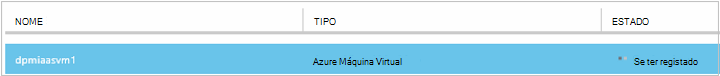
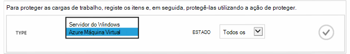
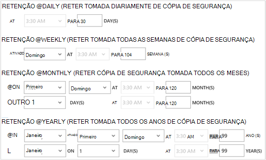

<properties
    pageTitle="Criar uma cópia de segurança Azure máquinas virtuais | Microsoft Azure"
    description="Descobrir o, registe-se e agregar em máquinas virtuais com estes procedimentos para cópia de segurança do Azure máquina virtual."
    services="backup"
    documentationCenter=""
    authors="markgalioto"
    manager="jwhit"
    editor=""
    keywords="cópia de segurança de máquina virtual; criar uma cópia de segurança máquina virtual; recuperação de cópia de segurança e falhas; VM cópia de segurança"/>

<tags
    ms.service="backup"
    ms.workload="storage-backup-recovery"
    ms.tgt_pltfrm="na"
    ms.devlang="na"
    ms.topic="article"
    ms.date="09/28/2016"
    ms.author="trinadhk; jimpark; markgal;"/>

# Criar uma cópia de segurança máquinas virtuais Azure

> [AZURE.SELECTOR]
- [Agregar VMs para serviços de recuperação Cofre](backup-azure-arm-vms.md)
- [Agregar VMs Cofre de cópia de segurança](backup-azure-vms.md)

Este artigo fornece os procedimentos para criar cópias de segurança de uma implementado clássica Azure máquina virtual (VM) cofre uma cópia de segurança. Existem algumas tarefas que precisa para encarregam-se de antes de pode agregar uma máquina virtual Azure. Se ainda não o fez, execute os [Pré-requisitos](backup-azure-vms-prepare.md) para preparar o seu ambiente para criar cópias de segurança dos seus VMs.

Para obter informações adicionais, consulte os artigos [Planear a sua infraestrutura de cópia de segurança VM no Azure](backup-azure-vms-introduction.md) e [máquinas virtuais Azure](https://azure.microsoft.com/documentation/services/virtual-machines/).

>[AZURE.NOTE] Azure tem dois modelos de implementação para criar e trabalhar com recursos: [Gestor de recursos e clássica](../resource-manager-deployment-model.md). Cofre uma cópia de segurança só pode proteger VMs implementado clássica. Não é possível proteger VMs implementado Gestor de recursos com cofre uma cópia de segurança. Consulte o artigo [criar uma cópia de segurança VMs para serviços de recuperação cofre](backup-azure-arm-vms.md) para obter detalhes sobre como trabalhar com serviços de recuperação cofres.

Cópias de segurança Azure máquinas virtuais envolve três passos principais:

>[AZURE.NOTE] Cópias de segurança máquinas virtuais são um processo local. Não é possível agregar máquinas virtuais numa região para uma cópia de segurança cofre noutra região. Por isso, tem de criar uma cópia de segurança cofre cada região Azure, onde existem VMs que vai ser cópias de segurança.

## Passo 1 - descobrir máquinas virtuais Azure
Para garantir que quaisquer máquinas virtuais novas (VMs) adicionadas à subscrição estão identificadas antes de registar, execute o processo de deteção. As consultas de processo Azure para a lista de máquinas virtuais da subscrição, juntamente com informações adicionais, como o nome do serviço na nuvem e a região.

1. Inicie sessão no [portal de clássico](http://manage.windowsazure.com/)

2. Na lista de serviços Azure, clique em **Serviços de recuperação** para abrir a lista de cofres de cópia de segurança e recuperação de sites.
    

3. Na lista de cofres de cópia de segurança, selecione o cofre para agregar uma VM.

    Se este for um novo cofre o portal abre-se para a página de **Início rápido** .

    

    Se o Cofre anteriormente ter sido configurado, o portal abre-se ao menu utilizado mais recentemente.

4. No menu do cofre (na parte superior da página), clique em **Itens registado**.

    

5. A partir do menu **tipo** , selecione **Azure Virtual Machine**.

    

6. Clique em **DISCOVER** na parte inferior da página.
    

    O processo de deteção poderá demorar alguns minutos, enquanto as máquinas virtuais estão a ser distribuídos num quadro. Existe uma notificação na parte inferior do ecrã que permite-lhe saber se está a ser executado o processo.

    

    As alterações de notificação quando o processo estiver concluída. Se o processo de deteção não encontrou as máquinas virtuais, certifique-se primeiro que as VMs existirem. Se o VMs existirem, certifique-se a VMs na mesma região como o Cofre cópia de segurança. Se o VMs existem e estão na mesma região, certifique-se de que o VMs já não estão registados para uma cópia de segurança cofre. Se uma VM está atribuída a uma cópia de segurança Cofre não está disponível para ser atribuídas a outras cofres cópia de segurança.

    

    Uma vez que descobriu os novos itens, aceda ao passo 2 e registar a sua VMs.

##  Passo 2 - Register máquinas virtuais Azure
Registe-se de uma máquina de virtual Azure para associá-la com o serviço de cópia de segurança do Azure. Isto é, normalmente, uma única atividade.

1. Navegue para a cópia de segurança do Cofre de palavras em **Serviços de recuperação** no portal do Azure e, em seguida, clique em **Itens registado**.

2. Selecione **máquina de Virtual Azure** a partir do menu pendente.

    

3. Clique em **Registe-se** na parte inferior da página.
    

4. No menu de atalho **Registar itens** , selecione as máquinas virtuais ao qual pretende registar. Se existirem duas ou mais máquinas virtuais com o mesmo nome, utilize o serviço de nuvem para distinguir entre elas.

    >[AZURE.TIP] Várias máquinas virtuais pode estar registado junto ao mesmo tempo.

    É criada uma tarefa para cada máquina virtual que selecionou.

5. Clique em **Vista de tarefa** na notificação para ir para a página **tarefas** .

    

    A máquina virtual também é apresentada na lista de itens registados, juntamente com o estado da operação de registo.

    

    Quando a operação for concluída, o estado é alterado para refletir o estado *registado* .

    

## Passo 3 - proteger máquinas virtuais Azure
Agora pode configurar uma política de cópia de segurança e retenção para a máquina virtual. Várias máquinas virtuais podem ser protegidas utilizando um único proteger ação.

Azure cofres de cópia de segurança criados depois de Maio de 2015 fornecidos com uma política predefinida incorporada no cofre. Esta política predefinida é fornecido com uma retenção predefinido de 30 dias e uma agenda de cópia de segurança de uma vez diariamente.

1. Navegue para a cópia de segurança do Cofre de palavras em **Serviços de recuperação** no portal do Azure e, em seguida, clique em **Itens registado**.
2. Selecione **máquina de Virtual Azure** a partir do menu pendente.

    

3. Clique em **proteger** na parte inferior da página.

    Aparece o **Assistente de proteger itens** . O assistente só lista máquinas virtuais que estão registadas e não protegidas. Selecione as máquinas virtuais que pretende proteger.

    Se existirem duas ou mais máquinas virtuais com o mesmo nome, utilize o serviço de nuvem para distinguir entre as máquinas virtuais.

    >[AZURE.TIP] Pode proteger várias máquinas virtuais ao mesmo tempo.

    

4. Selecione uma **agenda de cópia de segurança** para agregar as máquinas virtuais que selecionou. Pode escolher a partir de um conjunto de políticas existente ou definir um novo.

    Cada política de cópia de segurança pode ter várias máquinas virtuais associadas. No entanto, a máquina virtual só pode ser associada a uma política em qualquer altura determinada altura.

    

    >[AZURE.NOTE] Uma política de cópia de segurança inclui um esquema de retenção para as cópias de segurança agendadas. Se selecionar uma política de cópia de segurança existente, não é possível modificar as opções de retenção no próximo passo.

5. Selecione um **intervalo de retenção** para associar as cópias de segurança.

    

    Política de retenção indica o comprimento do tempo para armazenar uma cópia de segurança. Pode especificar políticas de retenção diferente com base em quando a cópia de segurança é disponibilizada. Por exemplo, um ponto de cópia de segurança tomado diariamente (que serve como um ponto de recuperação operacionais) pode ser preservado para cerca de 90 dias. Em comparação, um ponto de cópia de segurança tomado no final de cada trimestre (para fins de auditoria) poderá ter de ser preservados para muitos meses ou anos.

    

    Nesta imagem de exemplo:

    - **Política de retenção diária**: cópias de segurança tomadas diariamente são armazenadas para 30 dias.
    - **Política de retenção semanal**: são preservadas cópias de segurança tomadas cada semana de Domingo para 104 semanas.
    - **Política de retenção mensal**: cópias de segurança tomadas do último domingo de cada mês são preservadas 120 meses.
    - **Política de retenção anual**: cópias de segurança tomadas no Domingo primeiro de cada Janeiro são preservadas de anos 99.

    É criada uma tarefa para configurar a política de proteção e associá-as máquinas virtuais a essa política para cada máquina virtual que selecionou.

6. Para ver a lista de tarefas **Proteção configurar** , a partir do menu cofres, clique em **tarefas** e selecione **Configurar proteção** do filtro de **operação** .

    

## Cópia de segurança inicial
Assim que a máquina virtual estiver protegida com uma política, que apresenta no separador **Itens protegido** com o estado de *protegido - (pendente cópia de segurança inicial)*. Por predefinição, a primeira cópia de segurança agendada é a *cópia de segurança inicial*.

Para acionar a cópia de segurança inicial imediatamente depois de configurar proteção:

1. Na parte inferior da página **Itens protegido** , clique em **Cópia de segurança agora**.

    O serviço de cópia de segurança do Azure cria uma tarefa de cópia de segurança para a operação de cópia de segurança inicial.

2. Clique no separador **tarefas** para ver a lista de tarefas.

    

>[AZURE.NOTE] Durante a operação de cópia de segurança, o serviço de cópia de segurança do Azure emite um comando a extensão da cópia de segurança no cada máquina virtual para esvaziar a todas as tarefas de escrita e tirar um instantâneo consistente.

Quando termina a cópia de segurança inicial, o estado da máquina virtual no separador **Itens protegida** é *protegida*.

## Ver o estado de cópia de segurança e detalhes
Assim que protegido, a contagem de máquina virtual também aumenta na página de **Dashboard** de resumo. A página do **Dashboard** também mostra o número de tarefas a partir das últimas 24 horas que foram *bem sucedida*, ter *falhou*e estão *em curso*. Na página **tarefas** , utilize o **Estado**, **operação**ou menus **de** e **até** para filtrar as tarefas.

Os valores no dashboard são atualizados a cada 24 horas.

## Resolução de problemas de erros
Se encontrar problemas durante a segurança o seu máquina virtual, consulte o [artigo resolução de problemas de VM](backup-azure-vms-troubleshoot.md) para obter ajuda.

## Próximos passos

- [Gerir e monitorizar o seu máquinas virtuais](backup-azure-manage-vms.md)
- [Restaurar máquinas virtuais](backup-azure-restore-vms.md)
