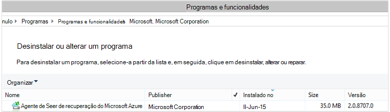

<properties
    pageTitle="Implementar e gerir a cópia de segurança para o Windows Server/cliente através do PowerShell | Microsoft Azure"
    description="Saiba como implementar e gerir a cópia de segurança do Azure através do PowerShell"
    services="backup"
    documentationCenter=""
    authors="saurabhsensharma"
    manager="shivamg"
    editor=""/>

<tags
    ms.service="backup"
    ms.workload="storage-backup-recovery"
    ms.tgt_pltfrm="na"
    ms.devlang="na"
    ms.topic="article"
    ms.date="09/01/2016"
    ms.author="saurabhsensharma;markgal;jimpark;nkolli;trinadhk"/>


# <a name="deploy-and-manage-backup-to-azure-for-windows-serverwindows-client-using-powershell"></a>Implementar e gerir a cópia de segurança para Azure para o Windows Server/cliente do Windows através do PowerShell

> [AZURE.SELECTOR]
- [PROCESSADOR](backup-client-automation.md)
- [Clássico](backup-client-automation-classic.md)

Este artigo mostra-lhe como utilizar o PowerShell para configurar o Azure cópia de segurança no Windows Server ou um cliente do Windows e gestão de cópia de segurança e recuperação.

## <a name="install-azure-powershell"></a>Instalar o Azure PowerShell

[AZURE.INCLUDE [learn-about-deployment-models](../../includes/learn-about-deployment-models-include.md)]

Este artigo foca os cmdlets do PowerShell do Gestor de recursos do Azure (processador) que permitem-lhe utilizar cofre serviços de recuperação num grupo de recursos.

Em Outubro de 2015, foi disponibilizada Azure PowerShell 1.0. Nesta versão foi concluída com êxito o 0.9.8 libertar e importados sobre algumas alterações significativas, sobretudo no padrão de nomenclatura dos cmdlets. 1.0 cmdlets siga o padrão de nomenclatura {verbais}-AzureRm {substantivo}; Considerando que, a 0.9.8 nomes não inclua **Rm** (por exemplo, novo-AzureRmResourceGroup em vez de AzureResourceGroup novo). Quando utilizar o Azure PowerShell 0.9.8, primeiro tem de ativar o modo de Gestor de recursos ao executar o comando **Mudar AzureMode AzureResourceManager** . Este comando não é necessário no 1.0 ou posterior.

Se pretende utilizar os scripts escritos para o 0.9.8 ambiente, num ambiente 1.0 ou posterior, deverá atentamente para testar os scripts num ambiente de produção pré antes de os utilizar de produção para evitar impacto inesperado.

[Transferir a versão mais recente do PowerShell](https://github.com/Azure/azure-powershell/releases) (versão mínima obrigatório é: 1.0.0)


[AZURE.INCLUDE [arm-getting-setup-powershell](../../includes/arm-getting-setup-powershell.md)]

## <a name="create-a-recovery-services-vault"></a>Criar um cofre de serviços de recuperação

Os passos seguintes guiá-lo através da criação de um cofre de serviços de recuperação. Cofre serviços de recuperação é diferente do cofre cópia de segurança.

1. Se estiver a utilizar o Azure cópia de segurança pela primeira vez, tem de utilizar o cmdlet **Register AzureRMResourceProvider** para registar o fornecedor de serviços de recuperação do Azure com a sua subscrição.

    ```
    PS C:\> Register-AzureRmResourceProvider -ProviderNamespace "Microsoft.RecoveryServices"
    ```

2. Serviços de recuperação Cofre é um recurso de processador, pelo que necessita de colocá-la dentro de um grupo de recursos. Pode utilizar um grupo de recursos existente ou crie um novo. Ao criar um novo grupo de recursos, especifique o nome e localização do grupo de recursos.  

    ```
    PS C:\> New-AzureRmResourceGroup –Name "test-rg" –Location "West US"
    ```

3. Utilize o cmdlet **AzureRmRecoveryServicesVault novo** para criar o novo cofre. Certifique-se de que especificar a mesma localização para o Cofre como foi utilizado para o grupo de recursos.

    ```
    PS C:\> New-AzureRmRecoveryServicesVault -Name "testvault" -ResourceGroupName " test-rg" -Location "West US"
    ```

4. Especificar o tipo de redundância de armazenamento para utilizar; Pode utilizar [Localmente redundantes armazenamento (LRS)](../storage/storage-redundancy.md#locally-redundant-storage) ou [Geo redundantes armazenamento (GRS)](../storage/storage-redundancy.md#geo-redundant-storage). O exemplo seguinte mostra que a opção - BackupStorageRedundancy para testVault está definida para GeoRedundant.

    > [AZURE.TIP] Cmdlets de cópia de segurança do Azure muitos requerem o objeto do Cofre de serviços de recuperação como uma entrada. Por este motivo, é conveniente armazenar o objeto do Cofre de serviços de recuperação de cópia de segurança numa variável.

    ```
    PS C:\> $vault1 = Get-AzureRmRecoveryServicesVault –Name "testVault"
    PS C:\> Set-AzureRmRecoveryServicesBackupProperties  -vault $vault1 -BackupStorageRedundancy GeoRedundant
    ```

## <a name="view-the-vaults-in-a-subscription"></a>Ver os cofres numa subscrição
Utilize **Get-AzureRmRecoveryServicesVault** para ver a lista de todos os cofres na subscrição atual. Pode utilizar este comando para verificar que foi criado um novo cofre, ou para ver que cofres estão disponíveis na subscrição.

Executar o comando Get-AzureRmRecoveryServicesVault e todos os cofres na subscrição são listados.

```
PS C:\> Get-AzureRmRecoveryServicesVault
Name              : Contoso-vault
ID                : /subscriptions/1234
Type              : Microsoft.RecoveryServices/vaults
Location          : WestUS
ResourceGroupName : Contoso-docs-rg
SubscriptionId    : 1234-567f-8910-abc
Properties        : Microsoft.Azure.Commands.RecoveryServices.ARSVaultProperties
```


## <a name="installing-the-azure-backup-agent"></a>Instalar o agente de cópia de segurança do Azure
Antes de instalar o agente de cópia de segurança do Azure, tem de ter o programa de instalação transferido e presente no servidor do Windows. Pode obter a versão mais recente do programa de instalação a partir do [Centro de transferências da Microsoft](http://aka.ms/azurebackup_agent) ou de página do Dashboard no Cofre de serviços de recuperação. Guardar o instalador para uma localização facilmente acessível como * C:\Downloads\*.

Para instalar o agente, execute o seguinte comando numa elevados consola PowerShell:

```
PS C:\> MARSAgentInstaller.exe /q
```

Este procedimento instala o agente com todas as opções predefinidas. A instalação leva alguns minutos em segundo plano. Se não especificar a opção */nu* a janela de **Windows Update** será aberta no final da instalação para verificar a existência de atualizações. Depois de instalado, o agente irá apresentar na lista de programas instalados.

Para ver a lista de programas instalados, aceda ao **Painel de controlo** > **programas** > **programas e funcionalidades**.



### <a name="installation-options"></a>Opções de instalação

Para ver todas as opções disponíveis através da linha de comandos, utilize o seguinte comando:

```
PS C:\> MARSAgentInstaller.exe /?
```

As opções disponíveis incluem:

| Opção | Detalhes | Predefinido |
| ---- | ----- | ----- |
| /q | Instalação sossegada | - |
| /p: "localização" | Caminho para a pasta de instalação do agente de cópia de segurança do Azure. | Agente de serviços C:\Program Files\Microsoft recuperação Azure |
| /s: "localização" | Caminho para a pasta da cache do agente de cópia de segurança do Azure. | C:\Program Files\Microsoft recuperação Azure serviços Agent\Scratch |
| /m | Optar ativamente por participar no Microsoft Update | - |
| /NU | Não verificar existência de actualizações após a instalação estiver concluída | - |
| /d | Desinstala agente de serviços de recuperação do Microsoft Azure | - |
| /pH | Endereço do anfitrião proxy | - |
| /po | Número de porta de anfitrião de proxy | - |
| /Pu | O nome de utilizador do proxy anfitrião | - |
| /PW | Palavra-passe de proxy | - |


## <a name="registering-windows-server-or-windows-client-machine-to-a-recovery-services-vault"></a>Registar o Windows Server ou do computador de cliente do Windows para um cofre de serviços de recuperação

Depois de criado o Cofre de serviços de recuperação, transfira o agent mais recente e as credenciais do cofre e armazená-lo numa localização conveniente como C:\Downloads.

```
PS C:\> $credspath = "C:\downloads"
PS C:\> $credsfilename = Get-AzureRmRecoveryServicesVaultSettingsFile -Backup -Vault $vault1 -Path  $credspath
PS C:\> $credsfilename C:\downloads\testvault\_Sun Apr 10 2016.VaultCredentials
```

No Windows Server ou máquina de cliente do Windows, execute o cmdlet [Iniciar OBRegistration](https://technet.microsoft.com/library/hh770398%28v=wps.630%29.aspx) para registar o computador com o cofre.

```
PS C:\> $cred = $credspath + $credsfilename
PS C:\> Start-OBRegistration-VaultCredentials $cred -Confirm:$false
CertThumbprint      :7a2ef2caa2e74b6ed1222a5e89288ddad438df2
SubscriptionID      : ef4ab577-c2c0-43e4-af80-af49f485f3d1
ServiceResourceName: testvault
Region              :West US
Machine registration succeeded.
```

> [AZURE.IMPORTANT] Não utilize caminhos relativos para especificar o ficheiro de credenciais do cofre. Tem de fornecer um caminho absoluto como uma entrada ao cmdlet.

## <a name="networking-settings"></a>Definições de rede
Quando estiver a conectividade do computador do Windows para a internet através de um servidor proxy, as definições de proxy também podem ser fornecidas para o agente de. Neste exemplo, não existe nenhum servidor proxy, para que recomendamos explicitamente são desmarcar quaisquer informações relacionadas com o proxy.

Também pode ser controlada a utilização de largura de banda com as opções de ```work hour bandwidth``` e ```non-work hour bandwidth``` para um determinado conjunto de dias da semana.

Definir os detalhes de proxy e a largura de banda é feito utilizando o cmdlet [Set-OBMachineSetting](https://technet.microsoft.com/library/hh770409%28v=wps.630%29.aspx) :

```
PS C:\> Set-OBMachineSetting -NoProxy
Server properties updated successfully.

PS C:\> Set-OBMachineSetting -NoThrottle
Server properties updated successfully.
```

## <a name="encryption-settings"></a>Definições de encriptação
Os dados de cópia de segurança enviados para cópia de segurança do Azure estão encriptados para proteger a confidencialidade dos dados. A frase de acesso de encriptação é a "palavra-passe" desencriptar os dados no momento da restaurar.

```
PS C:\> ConvertTo-SecureString -String "Complex!123_STRING" -AsPlainText -Force | Set-OBMachineSetting
Server properties updated successfully
```

> [AZURE.IMPORTANT] Manter as informações de frase de acesso seguro e depois de estar definida. Não conseguir restaurar dados a partir do Azure sem esta frase de acesso.

## <a name="back-up-files-and-folders"></a>Criar cópia de segurança de ficheiros e pastas
Todas as cópias de segurança de servidores do Windows e os clientes a cópia de segurança do Azure são regidas por uma política. A política é composto por três partes:

1. Uma **agenda de cópia de segurança** que especifica quando cópias de segurança têm de ser redirecionado e sincronizados com o serviço.
2. Uma **agenda de retenção** que especifica quanto tempo para manter os pontos de recuperação no Azure.
3. **Especificação de inclusão/exclusão de ficheiro** que dita o que devem ser cópia de segurança.

Neste documento, uma vez que recomendamos está a automatização de cópia de segurança, podemos irá partem do pressuposto que nada ter sido configurado. Vamos começar ao criar uma nova política de cópia de segurança utilizando o cmdlet [OBPolicy novo](https://technet.microsoft.com/library/hh770416.aspx) .

```
PS C:\> $newpolicy = New-OBPolicy
```

Neste momento a política estiver em branco e outros cmdlets são necessários para definir o que itens que serão incluídas ou excluídas, quando cópias de segurança será executada e onde serão armazenadas as cópias de segurança.

### <a name="configuring-the-backup-schedule"></a>Configurar a agenda de cópia de segurança
O primeiro as partes de uma política de 3 é a agenda de cópia de segurança, o que é criada utilizando o cmdlet [OBSchedule novo](https://technet.microsoft.com/library/hh770401) . A agenda de cópia de segurança define quando precisar de cópias de segurança ser encaminhado. Quando criar uma agenda que precisa de especificar 2 parâmetros de entrada:

- **Dias da semana em** que a cópia de segurança deve ser executado. Pode executar a tarefa de cópia de segurança no apenas um dia, ou todos os dias da semana, ou qualquer combinação entre elas.
- **Horas do dia** quando deve ser executada a cópia de segurança. Pode definir máximo de 3 diferentes horas do dia quando a cópia de segurança será acionada.

Por exemplo, poderá configurar uma política de cópia de segurança que é executada em 4 PM cada Sábado e Domingo.

```
PS C:\> $sched = New-OBSchedule -DaysofWeek Saturday, Sunday -TimesofDay 16:00
```

A agenda de cópia de segurança, tem de ser associadas uma política e, este pode ser obtido utilizando o cmdlet [Set-OBSchedule](https://technet.microsoft.com/library/hh770407) .

```
PS C:> Set-OBSchedule -Policy $newpolicy -Schedule $sched
BackupSchedule : 4:00 PM Saturday, Sunday, Every 1 week(s) DsList : PolicyName : RetentionPolicy : State : New PolicyState : Valid
```
### <a name="configuring-a-retention-policy"></a>Configurar uma política de retenção
A política de retenção define quanto tempo são mantidos pontos de recuperação criados a partir de tarefas de cópia de segurança. Ao criar uma nova política de retenção utilizando o cmdlet [OBRetentionPolicy novo](https://technet.microsoft.com/library/hh770425) , pode especificar o número de dias que os pontos de recuperação de cópia de segurança têm de ser mantidos com cópia de segurança do Azure. O exemplo abaixo define uma política de retenção de 7 dias.

```
PS C:\> $retentionpolicy = New-OBRetentionPolicy -RetentionDays 7
```

A política de retenção tem de estar associada com a política principal utilizando o cmdlet [Set-OBRetentionPolicy](https://technet.microsoft.com/library/hh770405):

```
PS C:\> Set-OBRetentionPolicy -Policy $newpolicy -RetentionPolicy $retentionpolicy

BackupSchedule  : 4:00 PM
                  Saturday, Sunday,
                  Every 1 week(s)
DsList          :
PolicyName      :
RetentionPolicy : Retention Days : 7

                  WeeklyLTRSchedule :
                  Weekly schedule is not set

                  MonthlyLTRSchedule :
                  Monthly schedule is not set

                  YearlyLTRSchedule :
                  Yearly schedule is not set

State           : New
PolicyState     : Valid
```
### <a name="including-and-excluding-files-to-be-backed-up"></a>Incluir e excluir ficheiros para ser cópias de segurança
Um ```OBFileSpec``` objeto define os ficheiros para ser incluídos e excluídos numa cópia de segurança. Este é um conjunto de regras de âmbito saída a ficheiros protegidos e pastas num computador. Pode ter muitos ficheiros regras de inclusão ou exclusão referida conforme necessário e associação-las a uma política de. Ao criar um novo objeto OBFileSpec, pode:

- Especificar os ficheiros e pastas para ser incluída
- Especifique os ficheiros e pastas para ser excluídas
- Especifique recursiva cópia de segurança dos dados numa pasta (ou) se devem ser cópias apenas os ficheiros de nível superiores na pasta especificada para cima.

O último é obtido utilizando o sinalizador - não recursivo no comando OBFileSpec novo.

No exemplo abaixo, vamos criar cópias de segurança volume c e d: e excluir os binários SO na pasta do Windows e quaisquer pastas temporárias. Para fazê-lo vamos criar duas especificações utilizando o cmdlet [Novo OBFileSpec](https://technet.microsoft.com/library/hh770408) - um para inclusão de ficheiro e outra para exclusão. Assim que as especificações do ficheiro tem sido criadas, as mesmas são associadas com a política utilizando o cmdlet [OBFileSpec adicionar](https://technet.microsoft.com/library/hh770424) .

```
PS C:\> $inclusions = New-OBFileSpec -FileSpec @("C:\", "D:\")

PS C:\> $exclusions = New-OBFileSpec -FileSpec @("C:\windows", "C:\temp") -Exclude

PS C:\> Add-OBFileSpec -Policy $newpolicy -FileSpec $inclusions

BackupSchedule  : 4:00 PM
                  Saturday, Sunday,
                  Every 1 week(s)
DsList          : {DataSource
                  DatasourceId:0
                  Name:C:\
                  FileSpec:FileSpec
                  FileSpec:C:\
                  IsExclude:False
                  IsRecursive:True

                  , DataSource
                  DatasourceId:0
                  Name:D:\
                  FileSpec:FileSpec
                  FileSpec:D:\
                  IsExclude:False
                  IsRecursive:True

                  }
PolicyName      :
RetentionPolicy : Retention Days : 7

                  WeeklyLTRSchedule :
                  Weekly schedule is not set

                  MonthlyLTRSchedule :
                  Monthly schedule is not set

                  YearlyLTRSchedule :
                  Yearly schedule is not set

State           : New
PolicyState     : Valid


PS C:\> Add-OBFileSpec -Policy $newpolicy -FileSpec $exclusions

BackupSchedule  : 4:00 PM
                  Saturday, Sunday,
                  Every 1 week(s)
DsList          : {DataSource
                  DatasourceId:0
                  Name:C:\
                  FileSpec:FileSpec
                  FileSpec:C:\
                  IsExclude:False
                  IsRecursive:True
                  ,FileSpec
                  FileSpec:C:\windows
                  IsExclude:True
                  IsRecursive:True
                  ,FileSpec
                  FileSpec:C:\temp
                  IsExclude:True
                  IsRecursive:True

                  , DataSource
                  DatasourceId:0
                  Name:D:\
                  FileSpec:FileSpec
                  FileSpec:D:\
                  IsExclude:False
                  IsRecursive:True

                  }
PolicyName      :
RetentionPolicy : Retention Days : 7

                  WeeklyLTRSchedule :
                  Weekly schedule is not set

                  MonthlyLTRSchedule :
                  Monthly schedule is not set

                  YearlyLTRSchedule :
                  Yearly schedule is not set

State           : New
PolicyState     : Valid
```

### <a name="applying-the-policy"></a>Aplicar a política
Agora o objeto de política estiver concluído e tem uma agenda de cópia de segurança associada, política de retenção e uma lista de inclusão/exclusão de ficheiros. Agora pode ser consolidada para cópia de segurança do Azure utilizar esta política. Antes de aplicar a política recentemente criada Certifique-se de que não existem sem políticas de cópia de segurança existentes associadas ao servidor utilizando o cmdlet [OBPolicy remover](https://technet.microsoft.com/library/hh770415) . Remover a política irá pedir confirmação. Para ignorar o uso de confirmação de ```-Confirm:$false``` sinalizador com o cmdlet.

```
PS C:> Get-OBPolicy | Remove-OBPolicy
Microsoft Azure Backup Are you sure you want to remove this backup policy? This will delete all the backed up data. [Y] Yes [A] Yes to All [N] No [L] No to All [S] Suspend [?] Help (default is "Y"):
```

Consolidar o objeto de política é feito utilizando o cmdlet [Set-OBPolicy](https://technet.microsoft.com/library/hh770421) . Isto também irá pedir confirmação. Para ignorar o uso de confirmação de ```-Confirm:$false``` sinalizador com o cmdlet.

```
PS C:> Set-OBPolicy -Policy $newpolicy
Microsoft Azure Backup Do you want to save this backup policy ? [Y] Yes [A] Yes to All [N] No [L] No to All [S] Suspend [?] Help (default is "Y"):
BackupSchedule : 4:00 PM Saturday, Sunday, Every 1 week(s)
DsList : {DataSource
         DatasourceId:4508156004108672185
         Name:C:\
         FileSpec:FileSpec
         FileSpec:C:\
         IsExclude:False
         IsRecursive:True,

         FileSpec
         FileSpec:C:\windows
         IsExclude:True
         IsRecursive:True,

         FileSpec
         FileSpec:C:\temp
         IsExclude:True
         IsRecursive:True,

         DataSource
         DatasourceId:4508156005178868542
         Name:D:\
         FileSpec:FileSpec
         FileSpec:D:\
         IsExclude:False
         IsRecursive:True
    }
PolicyName : c2eb6568-8a06-49f4-a20e-3019ae411bac
RetentionPolicy : Retention Days : 7
              WeeklyLTRSchedule :
              Weekly schedule is not set

              MonthlyLTRSchedule :
              Monthly schedule is not set

              YearlyLTRSchedule :
              Yearly schedule is not set
State : Existing PolicyState : Valid
```

Pode ver os detalhes da política de cópia de segurança existente utilizando o cmdlet [Get-OBPolicy](https://technet.microsoft.com/library/hh770406) . É possível desagregação ainda mais a utilizar o cmdlet [Get-OBSchedule](https://technet.microsoft.com/library/hh770423) para a agenda de cópia de segurança e o cmdlet [Get-OBRetentionPolicy](https://technet.microsoft.com/library/hh770427) para as políticas de retenção

```
PS C:> Get-OBPolicy | Get-OBSchedule
SchedulePolicyName : 71944081-9950-4f7e-841d-32f0a0a1359a
ScheduleRunDays : {Saturday, Sunday}
ScheduleRunTimes : {16:00:00}
State : Existing

PS C:> Get-OBPolicy | Get-OBRetentionPolicy
RetentionDays : 7
RetentionPolicyName : ca3574ec-8331-46fd-a605-c01743a5265e
State : Existing

PS C:> Get-OBPolicy | Get-OBFileSpec
FileName : *
FilePath : \?\Volume{b835d359-a1dd-11e2-be72-2016d8d89f0f}\
FileSpec : D:\
IsExclude : False
IsRecursive : True

FileName : *
FilePath : \?\Volume{cdd41007-a22f-11e2-be6c-806e6f6e6963}\
FileSpec : C:\
IsExclude : False
IsRecursive : True

FileName : *
FilePath : \?\Volume{cdd41007-a22f-11e2-be6c-806e6f6e6963}\windows
FileSpec : C:\windows
IsExclude : True
IsRecursive : True

FileName : *
FilePath : \?\Volume{cdd41007-a22f-11e2-be6c-806e6f6e6963}\temp
FileSpec : C:\temp
IsExclude : True
IsRecursive : True
```

### <a name="performing-an-ad-hoc-backup"></a>Efectuar uma cópia de segurança do ad-hoc
Assim que tiver sido definida uma política de cópia de segurança das cópias de segurança ocorrerá pela agenda. Acionar uma cópia de segurança do ad-hoc também é possível utilizar o cmdlet [OBBackup iniciar](https://technet.microsoft.com/library/hh770426) :

```
PS C:> Get-OBPolicy | Start-OBBackup
Taking snapshot of volumes...
Preparing storage...
Estimating size of backup items...
Estimating size of backup items...
Transferring data...
Verifying backup...
Job completed.
The backup operation completed successfully.
```

## <a name="restore-data-from-azure-backup"></a>Restaurar dados a partir do Azure cópia de segurança
Esta secção irá guiá-lo através dos passos para automatizar a recuperação de dados a partir do Azure cópia de segurança. Fazê-lo envolve os seguintes passos:

1. Escolha o volume de origem
2. Escolher um ponto de cópia de segurança para restaurar
3. Escolha um item para restaurar
4. Acionar o processo de restauro

### <a name="picking-the-source-volume"></a>Escolher o volume de origem
Para restaurar um item a partir do Azure cópia de segurança, primeiro tem de identificar a origem do item. Uma vez que recomendamos está a executar os comandos no contexto de um servidor do Windows ou um cliente do Windows, a máquina já é identificada. O passo seguinte identificar a origem é identificar o volume que contém-lo. Uma lista de volumes ou origens a ser cópias de segurança a partir nesta máquina pode ser recuperada executando o cmdlet [Get-OBRecoverableSource](https://technet.microsoft.com/library/hh770410) . Este comando devolve uma matriz de todas as origens de cópia de segurança a partir deste cliente/servidor.

```
PS C:> $source = Get-OBRecoverableSource
PS C:> $source
FriendlyName : C:\
RecoverySourceName : C:\
ServerName : myserver.microsoft.com

FriendlyName : D:\
RecoverySourceName : D:\
ServerName : myserver.microsoft.com
```

### <a name="choosing-a-backup-point-to-restore"></a>Escolher um ponto de cópia de segurança para restaurar
A lista de pontos de cópia de segurança pode ser recuperada executando o cmdlet [Get-OBRecoverableItem](https://technet.microsoft.com/library/hh770399.aspx) com parâmetros adequados. No nosso exemplo, vamos escolher o ponto de cópia de segurança mais recente para o volume de origem *d:.* e utilizá-la para recuperar um ficheiro específico.

```
PS C:> $rps = Get-OBRecoverableItem -Source $source[1]
IsDir : False
ItemNameFriendly : D:\
ItemNameGuid : \?\Volume{b835d359-a1dd-11e2-be72-2016d8d89f0f}\
LocalMountPoint : D:\
MountPointName : D:\
Name : D:\
PointInTime : 18-Jun-15 6:41:52 AM
ServerName : myserver.microsoft.com
ItemSize :
ItemLastModifiedTime :

IsDir : False
ItemNameFriendly : D:\
ItemNameGuid : \?\Volume{b835d359-a1dd-11e2-be72-2016d8d89f0f}\
LocalMountPoint : D:\
MountPointName : D:\
Name : D:\
PointInTime : 17-Jun-15 6:31:31 AM
ServerName : myserver.microsoft.com
ItemSize :
ItemLastModifiedTime :
```
O objeto ```$rps``` é uma matriz de pontos de cópia de segurança. O primeiro elemento é o ponto mais recente e o elemento n-ésimo é o mais antigo ponto. Para escolher o ponto mais recente, vamos utilizar o ```$rps[0]```.

### <a name="choosing-an-item-to-restore"></a>Escolher um item para restaurar
Para identificar o exacto do ficheiro ou pasta para restaurar, modo recursivo utilize o cmdlet [Get-OBRecoverableItem](https://technet.microsoft.com/library/hh770399.aspx) . Dessa forma hierarquia de pastas pode ser consultada exclusivamente utilizando o ```Get-OBRecoverableItem```.

Neste exemplo, se queremos restaurar o ficheiro *finances.xls* podemos pode fazer referência a que utilizando o objeto ```$filesFolders[1]```.

```
PS C:> $filesFolders = Get-OBRecoverableItem $rps[0]
PS C:> $filesFolders
IsDir : True
ItemNameFriendly : D:\MyData\
ItemNameGuid : \?\Volume{b835d359-a1dd-11e2-be72-2016d8d89f0f}\MyData\
LocalMountPoint : D:\
MountPointName : D:\
Name : MyData
PointInTime : 18-Jun-15 6:41:52 AM
ServerName : myserver.microsoft.com
ItemSize :
ItemLastModifiedTime : 15-Jun-15 8:49:29 AM

PS C:> $filesFolders = Get-OBRecoverableItem $filesFolders[0]
PS C:> $filesFolders
IsDir : False
ItemNameFriendly : D:\MyData\screenshot.oxps
ItemNameGuid : \?\Volume{b835d359-a1dd-11e2-be72-2016d8d89f0f}\MyData\screenshot.oxps
LocalMountPoint : D:\
MountPointName : D:\
Name : screenshot.oxps
PointInTime : 18-Jun-15 6:41:52 AM
ServerName : myserver.microsoft.com
ItemSize : 228313
ItemLastModifiedTime : 21-Jun-14 6:45:09 AM

IsDir : False
ItemNameFriendly : D:\MyData\finances.xls
ItemNameGuid : \?\Volume{b835d359-a1dd-11e2-be72-2016d8d89f0f}\MyData\finances.xls
LocalMountPoint : D:\
MountPointName : D:\
Name : finances.xls
PointInTime : 18-Jun-15 6:41:52 AM
ServerName : myserver.microsoft.com
ItemSize : 96256
ItemLastModifiedTime : 21-Jun-14 6:43:02 AM
```

Também pode procurar itens restaurar utilizando o ```Get-OBRecoverableItem``` cmdlet. No nosso exemplo, para procurar *finances.xls* podemos foi possível obter uma alça no ficheiro ao executar este comando:

```
PS C:\> $item = Get-OBRecoverableItem -RecoveryPoint $rps[0] -Location "D:\MyData" -SearchString "finance*"
```

### <a name="triggering-the-restore-process"></a>Acionar o processo de restauro
Para acionar o processo de restauro, podemos primeiro tem de especificar as opções de recuperação. Isto pode ser feito utilizando o cmdlet [OBRecoveryOption novo](https://technet.microsoft.com/library/hh770417.aspx) . Neste exemplo, imaginemos que pretendemos restaurar os ficheiros para *C:\temp*. Também Imaginemos que pretendemos ignorar ficheiros que já existam na pasta de destino *C:\temp*. Para criar uma opção de recuperação, utilize o seguinte comando:

```
PS C:\> $recovery_option = New-OBRecoveryOption -DestinationPath "C:\temp" -OverwriteType Skip
```

Agora acionar restaurar ao utilizar o comando [OBRecovery iniciar](https://technet.microsoft.com/library/hh770402.aspx) no selecionado ```$item``` partir dos resultados da ```Get-OBRecoverableItem``` cmdlet:

```
PS C:\> Start-OBRecovery -RecoverableItem $item -RecoveryOption $recover_option
Estimating size of backup items...
Estimating size of backup items...
Estimating size of backup items...
Estimating size of backup items...
Job completed.
The recovery operation completed successfully.
```


## <a name="uninstalling-the-azure-backup-agent"></a>Desinstalar o agente de cópia de segurança do Azure
Desinstalar o agente de cópia de segurança do Azure pode ser feito utilizando o seguinte comando:

```
PS C:\> .\MARSAgentInstaller.exe /d /q
```

Desinstalar binários agente a partir do computador, tem algumas consequências a ter em conta:

- Remove o filtro de ficheiros a partir do computador e a monitorização de alterações está parada.
- Todas as informações da política são removidas do computador, mas as informações da política continua a ser armazenado no serviço.
- Todas as agendas de cópia de segurança são removidas e não mais cópias de segurança forem tomadas.

No entanto, os dados armazenados no Azure permanece e são mantidos de acordo com a configuração de política de retenção por si. Pontos de mais antigos automaticamente idade.

## <a name="remote-management"></a>Gestão remota
Todos os gestão à volta das agente de cópia de segurança do Azure, políticas e origens de dados podem ser feito remotamente através do PowerShell. O computador que vai ser gerido remotamente tem de estar preparado corretamente.

Por predefinição, o serviço WinRM está configurado para arranque manual. Tem de estar definido o tipo de arranque para *Automático* e o serviço deve ser iniciado. Para verificar se o serviço WinRM está em execução, o valor da propriedade Estado deve ser *em execução*.

```
PS C:\> Get-Service WinRM

Status   Name               DisplayName
------   ----               -----------
Running  winrm              Windows Remote Management (WS-Manag...
```

PowerShell deve ser configurado para comunicação remota.

```
PS C:\> Enable-PSRemoting -force
WinRM is already set up to receive requests on this computer.
WinRM has been updated for remote management.
WinRM firewall exception enabled.

PS C:\> Set-ExecutionPolicy unrestricted -force
```

Computador pode agora ser gerido remotamente - começando pela instalação do agente. Por exemplo, o seguinte script copia o agente para o computador remoto e instala-lo.

```
PS C:\> $dloc = "\\REMOTESERVER01\c$\Windows\Temp"
PS C:\> $agent = "\\REMOTESERVER01\c$\Windows\Temp\MARSAgentInstaller.exe"
PS C:\> $args = "/q"
PS C:\> Copy-Item "C:\Downloads\MARSAgentInstaller.exe" -Destination $dloc - force

PS C:\> $s = New-PSSession -ComputerName REMOTESERVER01
PS C:\> Invoke-Command -Session $s -Script { param($d, $a) Start-Process -FilePath $d $a -Wait } -ArgumentList $agent $args
```

## <a name="next-steps"></a>Próximos passos
Para obter mais informações sobre, consulte Azure cópia de segurança para o Windows Server/Client

- [Introdução ao Azure cópia de segurança](backup-introduction-to-azure-backup.md)
- [Criar uma cópia de segurança servidores do Windows](backup-configure-vault.md)
