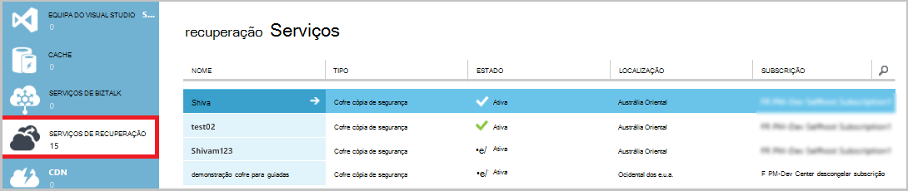

<properties
    pageTitle="Cópia de um cliente para utilizar o modelo clássico de implementação do Azure ou Windows server | Microsoft Azure"
    description="Cópia de segurança servidores do Windows ou clientes para Azure ao criar uma cópia de segurança cofre, credenciais a transferir, instalar o agente de cópia de segurança e concluir uma cópia de segurança inicial dos seus ficheiros e pastas."
    services="backup"
    documentationCenter=""
    authors="markgalioto"
    manager="cfreeman"
    editor=""
    keywords="cópia de segurança Cofre; Agregar um servidor do Windows; cópia de segurança windows;"/>

<tags
    ms.service="backup"
    ms.workload="storage-backup-recovery"
    ms.tgt_pltfrm="na"
    ms.devlang="na"
    ms.topic="article"
    ms.date="08/08/2016"
    ms.author="jimpark; trinadhk; markgal"/>

# Cópia de segurança de um cliente e servidor do Windows Azure utilizando o modelo clássico de implementação

> [AZURE.SELECTOR]
- [Portal clássico](backup-configure-vault-classic.md)
- [Portal do Azure](backup-configure-vault.md)

Este artigo abrange os procedimentos que precisa de seguir para preparar o seu ambiente e agregar um servidor do Windows (ou cliente) para Azure. Também cobrir considerações para implementar a solução de cópia de segurança. Se está interessado em experimentar o Azure cópia de segurança para a primeira vez, este artigo rapidamente orienta durante o processo.

>[AZURE.IMPORTANT] Azure tem dois modelos de implementação diferentes para criar e trabalhar com recursos: Gestor de recursos e clássica. Este artigo aborda a utilizar o modelo de implementação clássica. A Microsoft recomenda a que a maioria das novas implementações utilizam o modelo de Gestor de recursos.

## Antes de começar
Para fazer cópia de segurança um cliente e servidor para Azure, precisa de uma conta Azure. Se não tiver uma, pode criar uma [conta gratuita](https://azure.microsoft.com/free/) apenas de duas minutos.

## Passo 1: Criar uma cópia de segurança Cofre
Para fazer cópia de segurança ficheiros e pastas a partir de um servidor ou cliente, é necessário criar uma cópia de segurança cofre na região geográfica onde pretende armazenar os dados.

### Para criar uma cópia de segurança Cofre

1. Inicie sessão no [portal do clássico](https://manage.windowsazure.com/).

2. Clique em **Novo** > **Serviços de dados** > **Serviços de recuperação** > **Cofre de cópia de segurança**e, em seguida, selecione **Criar rápida**.

3. Para o parâmetro **nome** , introduza um nome amigável para o cópia de segurança cofre. Escreva um nome que contém entre 2 e 50 carateres. Tem de iniciar por uma letra e pode conter apenas letras, números e hífenes. Este nome tem de ser exclusivo para cada subscrição.

4. Para o parâmetro de **região** , selecione a região geográfica para a cópia de segurança cofre. Esta opção determina a região geográfica onde os seus dados de cópia de segurança são enviados. Ao selecionar uma região geográfica que se aproxime a sua localização, pode reduzir a latência da rede quando cópias de segurança Azure.

5. Clique em **Criar cofre**.

    

    Pode demorar algum tempo para o Cofre cópia de segurança criação de. Para verificar o estado, monitorize as notificações na parte inferior do portal clássica.

    Depois de ter sido criado no cofre cópia de segurança, verá uma mensagem a informar que o Cofre foi criado com êxito. Também aparece como **ativo** na lista de **Serviços de recuperação de** recursos.

    

4. Selecione a opção de redundância de armazenamento ao seguir os passos descritos aqui.

    >[AZURE.IMPORTANT] A melhor hora para identificar a sua opção de redundância de armazenamento é à direita após a criação do cofre e antes de quaisquer máquinas estão registadas para o cofre. Depois de um item foi registado ao Cofre de palavras, a opção de redundância de armazenamento está bloqueada e não pode ser modificada.

    Se estiver a utilizar o Azure como um ponto final de armazenamento de cópia de segurança primário (por exemplo, é cópias de segurança para Azure a partir de um servidor do Windows), considere a opção de [armazenamento geo redundante](../storage/storage-redundancy.md#geo-redundant-storage) escolher (a predefinição).

    Se estiver a utilizar o Azure como um ponto final de armazenamento de cópia de segurança superior (por exemplo, estiver a utilizar o Gestor de proteção de dados sistema Centro para armazenar uma cópia de segurança locais no local e utilizar o Azure para necessita de retenção a longo prazo), considere escolher [armazenamento localmente redundante](../storage/storage-redundancy.md#locally-redundant-storage). Este procedimento traz para baixo o custo do armazenamento dos dados no Azure, fornecendo um nível inferior de durabilidade para os seus dados que podem ser aceitáveis para superior cópias ao mesmo.

    **Para selecionar a opção de redundância de armazenamento:**

    um. Clique no cofre que acabou de criar.

    b. Na página de início rápido, selecione **Configurar**.

    

    c. Selecione a opção de redundância de armazenamento adequado.

    Se selecionar **Localmente redundantes**, tem de clicar em **Guardar** (porque **Geo Redundant** está a opção predefinida).

    d. No painel de navegação esquerdo, clique em **Serviços de recuperação** para regressar à lista de recursos para serviços de recuperação.

## Passo 2: Transferir o ficheiro de credenciais do Cofre
Computador no local tem de ser autenticada com uma cópia de segurança cofre antes de-pode agregar dados para Azure. É obtida a autenticação através de *credenciais do cofre*. O ficheiro de credenciais do Cofre é transferido através de um canal seguro a partir do portal clássico. A chave privada de certificado não persistirem no portal do ou o serviço.

Saiba mais sobre [utilizar credenciais para autenticar com o serviço de cópia de segurança do Cofre de palavras](backup-introduction-to-azure-backup.md#what-is-the-vault-credential-file).

### Para transferir o ficheiro de credenciais do cofre para uma máquina local

1. No painel de navegação esquerdo, clique em **Serviços de recuperação**e, em seguida, selecione a cópia de segurança do Cofre de palavras que criou.

    

2.  Na página de início rápido, clique em **credenciais do Cofre de transferência**.

    O portal clássico gera uma credencial cofre utilizando uma combinação do nome do cofre e a data atual. O ficheiro de credenciais do Cofre é utilizado apenas durante o fluxo de trabalho do registo e expira após 48 horas.

    O ficheiro de credenciais do cofre pode ser transferido a partir do portal.

3. Clique em **Guardar** para transferir o ficheiro de credenciais do cofre para a pasta de transferências da conta local. Também pode selecionar **Guardar como** no menu **Guardar** para especificar uma localização para o ficheiro de credenciais do cofre.

    >[AZURE.NOTE] Certifique-se de que o ficheiro de credenciais do Cofre está guardado numa localização que possa ser acedida a partir do seu computador. Se estiver armazenado num bloco de mensagem de servidor ou partilha de ficheiro, certifique-se de que tem as permissões para aceder à mesma.

## Passo 3: Transferir, instalar e registar o agente de cópia de segurança
Depois de criar o Cofre cópia de segurança e transferir o ficheiro de credenciais do cofre, tem de estar instalado um agente em cada um dos seus máquinas com o Windows.

### Para transferir, instalar e registar o agente

1. Clique em **Serviços de recuperação**e, em seguida, selecione o Cofre cópia de segurança que pretende registar com um servidor.

2. Na página de início rápido, clique no agente de **agente para o Windows Server ou Gestor de proteção de dados do sistema centro ou cliente do Windows**. Em seguida, clique em **Guardar**.

    

3. Depois do ficheiro MARSagentinstaller.exe tenha transferido, clique em **Executar** (ou faça duplo clique em **MARSAgentInstaller.exe** desde a localização guardada).

4. Selecione a pasta de instalação e a pasta de cache que são necessários para o agente de e, em seguida, clique em **seguinte**. Especificar a localização da cache tem de ter espaço livre igual a pelo menos 5 por cento os dados de cópia de segurança.

5. Pode continuar a ligar à Internet através das definições de proxy predefinido.          Se utilizar um servidor proxy para ligar à Internet, na página Configuração do Proxy, selecione a caixa de verificação **utilizar definições de proxy personalizado** e, em seguida, introduza os detalhes de servidor de proxy. Se utilizar um proxy autenticado, introduza os detalhes de nome e palavra-passe de utilizador e, em seguida, clique em **seguinte**.

7. Clique em **instalar** para iniciar a instalação do agente. O agente de cópia de segurança instala .NET Framework 4,5 e o Windows PowerShell (se ainda não estiver instalado) para concluir a instalação.

8. Após ter instalado o agente de, clique em **continuar para o registo** para continuar com o fluxo de trabalho.

9. Na página cofre identificação, procure e selecione o ficheiro de credenciais do cofre que tenha transferido anteriormente.

    O ficheiro de credenciais do Cofre é válido apenas 48 horas após ser transferido a partir do portal. Se se deparar com um erro nesta página (por exemplo, "Cofre credenciais ficheiro fornecido expirou"), inicie sessão portal do e transferir novamente o ficheiro de credenciais do cofre.

    Certifique-se de que o ficheiro de credenciais do Cofre está disponível numa localização que possa ser acedida pela aplicação de configuração. Se encontrar erros relacionados com o access, copie o ficheiro de credenciais do cofre para uma localização no mesmo computador temporária e repita a operação.

    Se se deparar com um erro de credenciais do cofre tal como "credenciais Cofre inválido fornecido", o ficheiro está danificado ou não tiver as mais recentes credenciais associadas com o serviço de recuperação. Repetir a operação depois de transferir um ficheiro de credenciais do cofre novo a partir do portal. Este erro pode ocorrer também se um utilizador clica a opção de **credenciais de cofre transferir** várias vezes em rápida sucessão. Neste caso, apenas o último cofre credencial ficheiro é válido.

9. Na página de definição de encriptação, pode gerar uma frase ou fornecer uma frase de acesso (com um mínimo de 16 caracteres). Lembre-se guardar a frase de acesso numa localização segura.

10. Clique em **Concluir**. O Assistente de servidor registar regista o servidor com cópia de segurança.

    >[AZURE.WARNING] Se perder ou esquecer a frase de acesso, o Microsoft não pode ajudá-lo recuperar os dados de cópia de segurança. É o proprietário a frase de acesso de encriptação e, a Microsoft não tem visibilidade da frase de acesso que utiliza. Guarde o ficheiro numa localização segura pois estará necessário durante uma operação de recuperação.

11. Depois da chave de encriptação estiver definida, deixe a caixa de verificação de **Iniciação do Microsoft Azure recuperação serviços Agent** selecionada e, em seguida, clique em **Fechar**.

## Passo 4: Concluir a cópia de segurança inicial

A cópia de segurança inicial inclui duas tarefas chaves:

- Criar a agenda de cópia de segurança
- Cópias de segurança de ficheiros e pastas pela primeira vez

Quando a política de cópia de segurança for concluída a cópia de segurança inicial, que cria pontos de cópia de segurança que pode utilizar se precisar de recuperar os dados. A política de cópia de segurança faz isto com base na agenda definidos por si.

### Para agendar a cópia de segurança

1. Abra o agente de cópia de segurança do Microsoft Azure. (, Será aberto automaticamente se para a esquerda a caixa de verificação de **Iniciação do Microsoft Azure recuperação serviços Agent** selecionada quando tiver fechado o Assistente de servidor registar.) Pode encontrá-lo ao procurar o seu computador **Cópia de segurança do Microsoft Azure**.

    

2. No agente de cópia de segurança, clique em **Agendar cópia de segurança**.

    

3. Na página de introdução do Assistente de cópia de segurança da agenda, clique em **seguinte**.

4. Em itens selecione a página de cópia de segurança, clique em **Adicionar itens**.

5. Selecione os ficheiros e pastas que pretende fazer cópia de segurança e, em seguida, clique em **OK**.

6. Clique em **seguinte**.

7. Na página **Especificar agenda de cópia de segurança** , especifique a **agenda de cópia de segurança** e clique em **seguinte**.

    Pode agendar diária (taxa de juro máximo de três vezes por dia) ou cópias de segurança semanais.

    

    >[AZURE.NOTE] Para obter mais informações sobre como especificar a agenda de cópia de segurança, consulte o artigo da [Cópia de segurança Azure utilizar para substituir a sua infraestrutura de banda](backup-azure-backup-cloud-as-tape.md).

8. Na página **Selecionar política de retenção** , selecione a **Política de retenção** para a cópia de segurança.

    A política de retenção Especifica a duração para o qual será armazenada a cópia de segurança. Em vez de apenas especificando uma "política simples" para todos os pontos de cópia de segurança, pode especificar políticas de retenção diferente com base em quando ocorre a cópia de segurança. Pode modificar as políticas de retenção diária, semanal, mensal e anual para corresponder às suas necessidades.

9. Na página escolher tipo de cópia de segurança inicial, escolha o tipo de cópia de segurança inicial. Deixe a opção **automaticamente através da rede** selecionada e, em seguida, clique em **seguinte**.

    Pode criar cópias automaticamente através da rede ou fazer uma cópia offline. O resto deste artigo descreve o processo de cópias de segurança automaticamente. Se preferir fazer uma cópia de segurança offline, consulte o artigo [Offline fluxo de trabalho de cópia de segurança na cópia de segurança do Azure](backup-azure-backup-import-export.md) para obter informações adicionais.

10. Na página Confirmation, reveja as informações e, em seguida, clique em **Concluir**.

11. Depois do assistente terminar de criar a agenda de cópia de segurança, clique em **Fechar**.

### Ativar a limitação de rede (opcional)

O agente de cópia de segurança fornece limitação de rede. Limitação controlos, como a largura de banda de rede é utilizada durante a transferência de dados. Este controlo pode ser útil se precisar de fazer cópia de segurança dados durante horas de trabalho, mas não pretender que o processo de cópia de segurança para interferir com outro tráfego da Internet. Limitação aplica-se para fazer cópia de segurança e restaurar atividades.

**Para ativar a limitação de rede**

1. No agente de cópia de segurança, clique em **Alterar as propriedades**.

    

2. No separador **Throttling** , selecione a caixa de verificação **Ativar a utilização da largura de banda de internet limitação para operações de cópia de segurança** .

    

3. Depois de ter ativado limitação, especifique a largura de banda permitida para transferência de dados de cópia de segurança durante o **horário de trabalho** e **horas de trabalho não**.

    Os valores de largura de banda começam a quilobits 512 por segundo (Kbps) e podem aceder até 1,023 megabytes por segundo (MBps). Também pode designar o início e de conclusão de **horário de trabalho**, e que dias da semana são dias de trabalho considerado. Horas fora do trabalho designada horas são consideradas não-trabalho horas.

4. Clique em **OK**.

### Para fazer cópia de segurança agora

1. O agente de cópia de segurança, clique em **Cópia de segurança agora** para concluir a propagação inicial através da rede.

    

2. Na página Confirmation, reveja as definições que o novamente o agora assistente irá utilizar para criar uma cópia de segurança do computador. Em seguida, clique em criar **Cópia**.

3. Clique em **Fechar** para fechar o assistente. Se efetuar o seguinte antes de terminar o processo de cópia de segurança, o assistente continua a ser executado em segundo plano.

Depois de concluída a cópia de segurança inicial, o estado de **tarefa concluída** é apresentada na consola de cópia de segurança.

## Próximos passos
- Inscreva-se para uma [conta Azure gratuita](https://azure.microsoft.com/free/).

Para obter informações adicionais sobre como criar cópias VMs ou outros das cargas de trabalho, consulte:

- [Criar uma cópia de segurança IaaS VMs](backup-azure-vms-prepare.md)
- [Cópia de segurança das cargas de trabalho para Azure com o servidor de cópia de segurança do Microsoft Azure](backup-azure-microsoft-azure-backup.md)
- [Cópia de segurança das cargas de trabalho para Azure com DPM](backup-azure-dpm-introduction.md)
