<properties
    pageTitle="Cópia de um cliente para Azure com cópia de segurança do Azure utilizando o modelo de implementação do Gestor de recursos ou Windows Server | Microsoft Azure"
    description="Cópia de segurança servidores do Windows ou clientes para Azure ao criar uma cópia de segurança cofre, credenciais a transferir, instalar o agente de cópia de segurança e concluir uma cópia de segurança inicial dos seus ficheiros e pastas."
    services="backup"
    documentationCenter=""
    authors="markgalioto"
    manager="cfreeman"
    editor=""
    keywords="cópia de segurança Cofre; Agregar um servidor do Windows; cópia de segurança windows;"/>

<tags
    ms.service="backup"
    ms.workload="storage-backup-recovery"
    ms.tgt_pltfrm="na"
    ms.devlang="na"
    ms.topic="article"
    ms.date="08/10/2016"
    ms.author="jimpark; trinadhk; markgal"/>

# Cópia de segurança de um cliente ou Windows Server Azure utilizando o modelo de implementação do Gestor de recursos

> [AZURE.SELECTOR]
- [Portal do Azure](backup-configure-vault.md)
- [Portal clássico](backup-configure-vault-classic.md)

Este artigo explica como para trás o seu Windows Server (ou o cliente do Windows) ficheiros e pastas para Azure com cópia de segurança do Azure utilizando o modelo de implementação do Gestor de recursos.

[AZURE.INCLUDE [learn-about-deployment-models](../../includes/backup-deployment-models.md)]

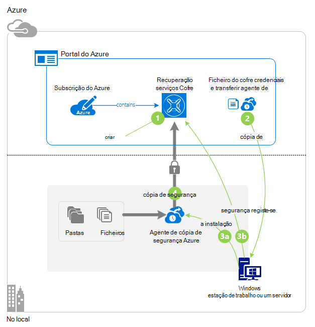

## Antes de começar
Para fazer cópia de segurança um cliente e servidor para Azure, precisa de uma conta Azure. Se não tiver uma, pode criar uma [conta gratuita](https://azure.microsoft.com/free/) apenas de duas minutos.

## Passo 1: Criar um cofre de serviços de recuperação

Cofre serviços de recuperação é uma entidade que armazena todas as cópias de segurança e pontos de recuperação que criar ao longo do tempo. Serviços de recuperação cofre também contém a política de cópia de segurança aplicada às pastas e ficheiros protegidos. Quando cria um cofre de serviços de recuperação, também deve selecionar a opção de redundância de armazenamento adequado.

### Para criar um cofre de serviços de recuperação

1. Se ainda não o tiver feito, início de sessão do [Portal do Azure](https://portal.azure.com/) utilizar a sua subscrição Azure.

2. No menu concentrador, clique em **Procurar** e na lista de recursos, **Serviços de recuperação**. À medida que começa a escrever, irá filtrar a lista com base no seu teclado. Clique em **Serviços de recuperação cofres**.

    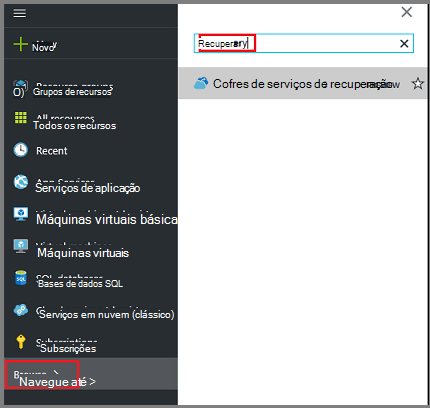  

    É apresentada a lista de serviços de recuperação cofres.

3. No menu de **Serviços de recuperação cofres** , clique em **Adicionar**.

    

    É aberta a pá cofre serviços de recuperação perguntar para fornecer um **nome**, a **subscrição**, o **grupo de recursos**e a **localização**.

    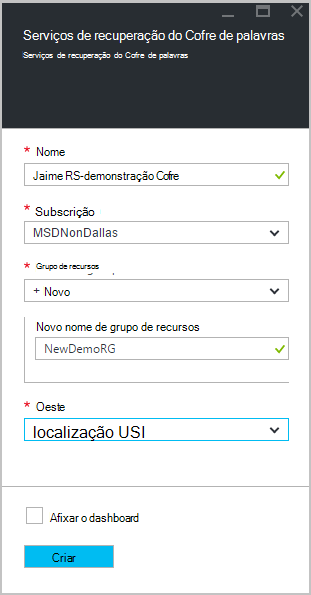

4. Para o **nome**, introduza um nome amigável para identificar o cofre. O nome tem de ser exclusivo para a subscrição Azure. Escreva um nome que contém entre 2 e 50 carateres. Tem de iniciar por uma letra e pode conter apenas letras, números e hífenes.

5. Clique em **subscrição** para ver a lista de subscrições disponível. Se não tiver a certeza de qual para utilizar a sua subscrição, utilize a predefinição (ou sugeridos) subscrição. Haverá múltiplas escolhas apenas se a sua conta institucional está associada com múltiplas subscrições Azure.

6. Clique em **grupo de recursos** para ver a lista de grupos de recursos disponível ou clique em **Novo** para criar um novo grupo de recursos. Para obter informações completas sobre grupos de recursos, consulte o artigo [Descrição geral do Gestor de recursos do Azure](../azure-resource-manager/resource-group-overview.md)

7. Clique em **localização** para selecionar a região geográfica para o cofre. Esta opção determina a região geográfica onde os seus dados de cópia de segurança são enviados. Ao selecionar uma região geográfica que se aproxime a sua localização, pode reduzir a latência da rede quando cópias de segurança Azure.

8. Clique em **Criar**. Pode demorar algum tempo para o Cofre de serviços de recuperação seja criada. Monitorize as notificações de estado na área superior direita no portal. Quando estiver criado cofre, deverá abrir no portal. Se não vir o seu Cofre ficará listado foi concluída, clique em **Atualizar**. Quando atualiza a lista, clique no nome do cofre.

### Para determinar a redundância de armazenamento
Quando cria um cofre de serviços de recuperação em primeiro lugar determinar como o armazenamento é replicado.

1. Na pá **Definições** , que abre automaticamente com o dashboard do cofre, clique em **Infraestrutura de cópia de segurança**.

2. No pá infraestrutura de cópia de segurança, clique em **Configuração de cópia de segurança** para ver o **tipo de replicação de armazenamento**.

    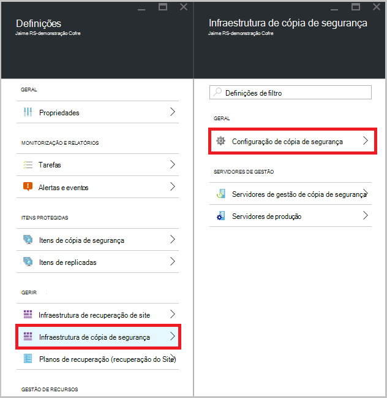

3. Selecione a opção de replicação de armazenamento para o cofre.

    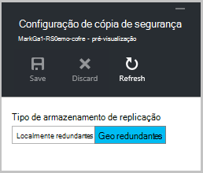

    Por predefinição, o seu Cofre tem armazenamento geo redundante. Se estiver a utilizar o Azure como um ponto final de armazenamento de cópia de segurança principal, continue a utilizar o armazenamento geo redundante. Se estiver a utilizar o Azure como um ponto final de armazenamento de cópia de segurança não principal, em seguida, selecione armazenamento localmente redundante, que irá reduzir os custos do armazenamento dos dados no Azure. Leia mais informações sobre [geo redundantes](../storage/storage-redundancy.md#geo-redundant-storage) e opções de armazenamento [redundantes localmente](../storage/storage-redundancy.md#locally-redundant-storage) nesta [Descrição geral](../storage/storage-redundancy.md).

    Depois de escolher a opção de armazenamento para o cofre, está pronto para associar os ficheiros e pastas no cofre.

Agora que criou uma cofre, pode preparar a sua infraestrutura de cópia de segurança de ficheiros e pastas ao transferir e instalar o agente de serviços de recuperação do Microsoft Azure, transferir cofre credenciais e, em seguida, utilizar essas credenciais para registar o agente cofre.

## Passo 2 - Transferir ficheiros

>[AZURE.NOTE] Activar cópia de segurança através do portal do Azure é brevemente. Neste momento, utilize o agente de serviços de recuperação do Microsoft Azure no local para criar cópias de ficheiros e pastas.

1. Clique em **Definições** no dashboard de Cofre de serviços de recuperação.

    

2. Clique em **Introdução > cópia de segurança** no pá definições.

    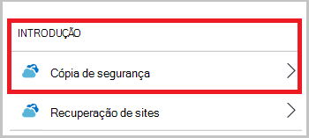

3. Clique em **objectivo de cópia de segurança** no pá a cópia de segurança.

    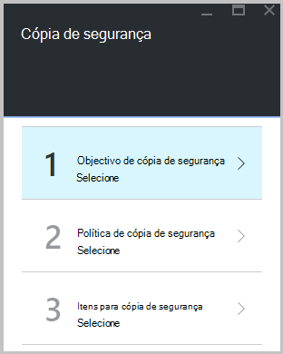

4. Selecionar **no local** a partir de onde é a sua carga de trabalho em execução? menu.

5. Selecione **ficheiros e pastas** a partir de o fazer pretende efectuar cópia de segurança? menu e clique em **OK**.

#### Transfira o agente de serviços de recuperação

1. Clique em **Transferir agente para o Windows Server ou cliente do Windows** no pá a **infraestrutura de preparar** .

    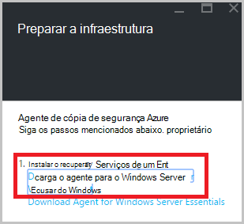

2. Clique em **Guardar** em transferência pop-up. Por predefinição, o ficheiro de **MARSagentinstaller.exe** está guardado para a sua pasta de transferências.

#### Transferência de credenciais do Cofre

1. Clique em **Transferir > Guardar** no pá de infraestrutura de preparar.

    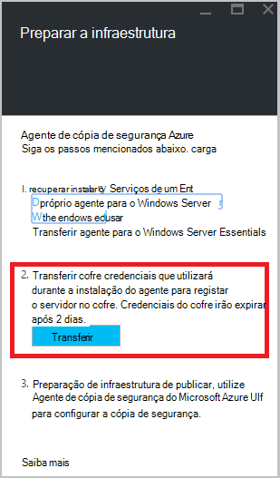

## Passo 3 - instalar e registar o agente

1. Localize e faça duplo clique sobre a **MARSagentinstaller.exe** da pasta transferências (ou outra localização guardada).

2. Conclua o Assistente de configuração de agente do Microsoft Azure recuperação serviços. Para concluir o assistente, tem de:

    - Escolha uma localização para a instalação e a pasta em cache.
    - Forneça o proxy informações do servidor, se utilizar um servidor proxy para ligar à internet.
    - Fornece o utilizador pormenores nome e palavra-passe, se utilizar um proxy autenticado.
    - Fornecer as credenciais do cofre transferido
    - Guarde a frase de acesso de encriptação numa localização segura.

    >[AZURE.NOTE] Se perder ou esquecer a frase de acesso, não é possível ajuda do Microsoft recuperar os dados de cópia de segurança. Guarde o ficheiro numa localização segura. É necessário para restaurar uma cópia de segurança.

Agora está instalado o agente e está registado o seu computador para o cofre. Está pronto para configurar e agendar a cópia de segurança.

### Confirmar a instalação

Para confirmar que o agente foi instalado e registado corretamente, pode procurar os itens que cópia de segurança na secção **Servidor de produção** do portal de gestão. Para fazer isto:

1. Inicie sessão no [Portal do Azure](https://portal.azure.com/) utilizando a sua subscrição do Azure.

2. No menu concentrador, clique em **Procurar** e na lista de recursos, **Serviços de recuperação**. À medida que começa a escrever, irá filtrar a lista com base no seu teclado. Clique em **Serviços de recuperação cofres**.

      

    É apresentada a lista de serviços de recuperação cofres.

2. Selecione o nome do cofre que criou.

    É aberta a pá de dashboard do Cofre de serviços de recuperação.

    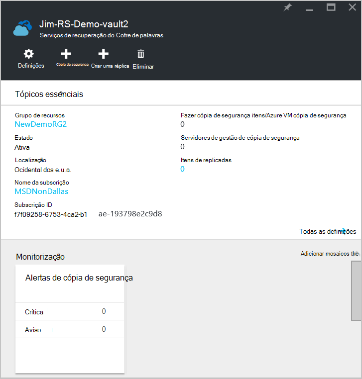  

3. Clique no botão **Definições** na parte superior da página.

4. Clique em **infraestrutura de cópia de segurança > servidores de produção**.

    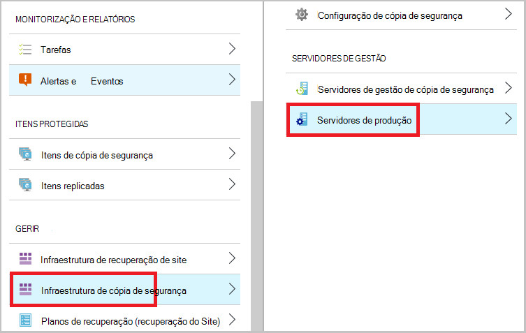

Se vir seus servidores na lista, terá confirmação de que o agente foi instalado e registado corretamente.

## Passo 4: Concluir a cópia de segurança inicial

A cópia de segurança inicial inclui duas tarefas chaves:

- Agendar a cópia de segurança
- Cópia de segurança de ficheiros e pastas pela primeira vez

Para concluir a cópia de segurança inicial, pode utilizar o agente de cópia de segurança do Microsoft Azure.

### Para agendar a cópia de segurança

1. Abra o agente de cópia de segurança do Microsoft Azure. Pode encontrá-lo ao procurar o seu computador **Cópia de segurança do Microsoft Azure**.

    

2. No agente de cópia de segurança, clique em **Agendar cópia de segurança**.

    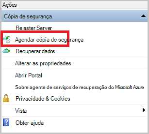

3. Na página de introdução do Assistente de cópia de segurança da agenda, clique em **seguinte**.

4. Em itens selecione a página de cópia de segurança, clique em **Adicionar itens**.

5. Selecione os ficheiros e pastas que pretende fazer cópia de segurança e, em seguida, clique em **OK**.

6. Clique em **seguinte**.

7. Na página **Especificar agenda de cópia de segurança** , especifique a **agenda de cópia de segurança** e clique em **seguinte**.

    Pode agendar diária (taxa de juro máximo de três vezes por dia) ou cópias de segurança semanais.

    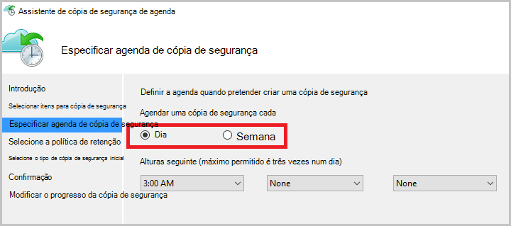

    >[AZURE.NOTE] Para obter mais informações sobre como especificar a agenda de cópia de segurança, consulte o artigo da [Cópia de segurança Azure utilizar para substituir a sua infraestrutura de banda](backup-azure-backup-cloud-as-tape.md).

8. Na página **Selecionar política de retenção** , selecione a **Política de retenção** para a cópia de segurança.

    A política de retenção Especifica a duração para o qual será armazenada a cópia de segurança. Em vez de apenas especificando uma "política simples" para todos os pontos de cópia de segurança, pode especificar políticas de retenção diferente com base em quando ocorre a cópia de segurança. Pode modificar as políticas de retenção diária, semanal, mensal e anual para corresponder às suas necessidades.

9. Na página escolher tipo de cópia de segurança inicial, escolha o tipo de cópia de segurança inicial. Deixe a opção **automaticamente através da rede** selecionada e, em seguida, clique em **seguinte**.

    Pode criar cópias automaticamente através da rede ou fazer uma cópia offline. O resto deste artigo descreve o processo de cópias de segurança automaticamente. Se preferir fazer uma cópia de segurança offline, consulte o artigo [Offline fluxo de trabalho de cópia de segurança na cópia de segurança do Azure](backup-azure-backup-import-export.md) para obter informações adicionais.

10. Na página Confirmation, reveja as informações e, em seguida, clique em **Concluir**.

11. Depois do assistente terminar de criar a agenda de cópia de segurança, clique em **Fechar**.

### Ativar a limitação de rede (opcional)

O agente de cópia de segurança fornece limitação de rede. Limitação controlos, como a largura de banda de rede é utilizada durante a transferência de dados. Este controlo pode ser útil se precisar de fazer cópia de segurança dados durante horas de trabalho, mas não pretender que o processo de cópia de segurança para interferir com outro tráfego da Internet. Limitação aplica-se para fazer cópia de segurança e restaurar atividades.

>[AZURE.NOTE] Limitação de rede não está disponível no Windows Server 2008 R2 SP1, Windows Server 2008 SP2 ou Windows 7 (com os service packs). A rede de cópia de segurança do Azure limitação funcionalidade realiza qualidade do serviço (QoS) no sistema operativo local. Apesar de cópia de segurança do Azure pode proteger estes sistemas operativos, a versão do QoS disponíveis estes plataformas não funciona com cópia de segurança do Azure limitação de rede. Limitação de rede pode ser utilizado na todos os outros [sistemas operativos suportados](backup-azure-backup-faq.md#installation-amp-configuration).

**Para ativar a limitação de rede**

1. No agente de cópia de segurança, clique em **Alterar as propriedades**.

    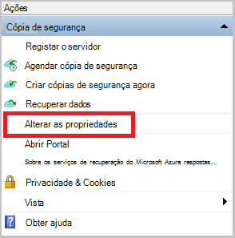

2. No separador **Throttling** , selecione a caixa de verificação **Ativar a utilização da largura de banda de internet limitação para operações de cópia de segurança** .

    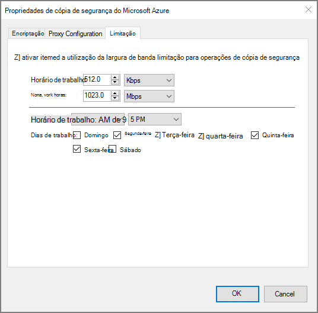

3. Depois de ter ativado limitação, especifique a largura de banda permitida para transferência de dados de cópia de segurança durante o **horário de trabalho** e **horas de trabalho não**.

    Os valores de largura de banda começam a quilobits 512 por segundo (Kbps) e podem aceder até 1,023 megabytes por segundo (MBps). Também pode designar o início e de conclusão de **horário de trabalho**, e que dias da semana são dias de trabalho considerado. Horas fora do trabalho designada horas são consideradas não-trabalho horas.

4. Clique em **OK**.

### Para criar cópias de ficheiros e pastas pela primeira vez

1. O agente de cópia de segurança, clique em **Cópia de segurança agora** para concluir a propagação inicial através da rede.

    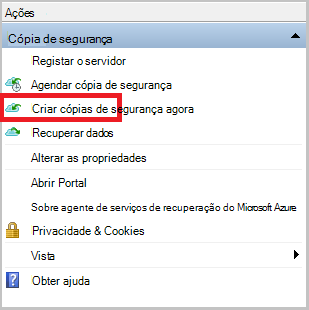

2. Na página Confirmation, reveja as definições que o novamente o agora assistente irá utilizar para criar uma cópia de segurança do computador. Em seguida, clique em criar **Cópia**.

3. Clique em **Fechar** para fechar o assistente. Se efetuar o seguinte antes de terminar o processo de cópia de segurança, o assistente continua a ser executado em segundo plano.

Depois de concluída a cópia de segurança inicial, o estado de **tarefa concluída** é apresentada na consola de cópia de segurança.

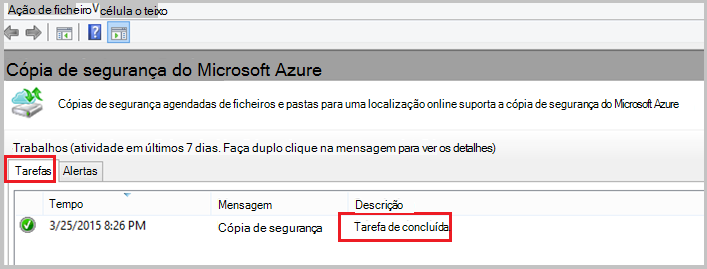

## Perguntas?
Se tiver dúvidas, ou se existir qualquer funcionalidade que pretende ver incluídas, [envie-nos comentários](http://aka.ms/azurebackup_feedback).

## Próximos passos
Para obter informações adicionais sobre como criar cópias VMs ou outros das cargas de trabalho, consulte:

- Agora que tenha de segurança dos seus ficheiros e pastas, pode [Gerir os seus cofres e servidores](backup-azure-manage-windows-server.md).
- Se precisar de restaurar uma cópia de segurança, utilize este artigo para [Restaurar ficheiros a um computador Windows](backup-azure-restore-windows-server.md).
