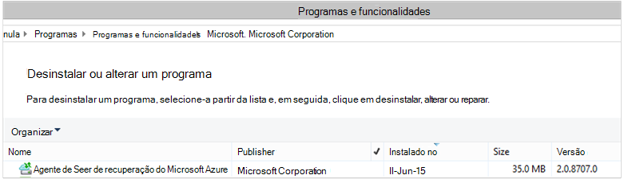

<properties
    pageTitle="Azure fazer cópia de segurança - implementar e gerir novamente para DPM através do PowerShell | Microsoft Azure"
    description="Saiba como implementar e gerir Azure cópia de segurança para o Gestor de proteção de dados (DPM) através do PowerShell"
    services="backup"
    documentationCenter=""
    authors="NKolli1"
    manager="shreeshd"
    editor=""/>

<tags
    ms.service="backup"
    ms.workload="storage-backup-recovery"
    ms.tgt_pltfrm="na"
    ms.devlang="na"
    ms.topic="article"
    ms.date="09/01/2016"
    ms.author="jimpark; anuragm;trinadhk;markgal"/>


# <a name="deploy-and-manage-backup-to-azure-for-data-protection-manager-dpm-servers-using-powershell"></a>Implementar e gerir a cópia de segurança para Azure para os servidores de Gestor de proteção de dados (DPM) através do PowerShell

> [AZURE.SELECTOR]
- [PROCESSADOR](backup-dpm-automation.md)
- [Clássico](backup-dpm-automation-classic.md)

Este artigo mostra-lhe como utilizar o PowerShell para a configuração cópia de segurança do Azure num servidor DPM e para gerir a cópia de segurança e recuperação.

## <a name="setting-up-the-powershell-environment"></a>Configurar o ambiente do PowerShell

[AZURE.INCLUDE [learn-about-deployment-models](../../includes/learn-about-deployment-models-include.md)]

Antes de poder utilizar o PowerShell para gerir as cópias de segurança a partir do Gestor de proteção de dados para Azure, tem de ter o ambiente direita no PowerShell. No início de sessão do PowerShell, certifique-se de que execute o seguinte comando para importar os módulos à direita e permitem-lhe a referenciar corretamente os cmdlets DPM:

```
PS C:> & "C:\Program Files\Microsoft System Center 2012 R2\DPM\DPM\bin\DpmCliInitScript.ps1"

Welcome to the DPM Management Shell!

Full list of cmdlets: Get-Command
Only DPM cmdlets: Get-DPMCommand
Get general help: help
Get help for a cmdlet: help <cmdlet-name> or <cmdlet-name> -?
Get definition of a cmdlet: Get-Command <cmdlet-name> -Syntax
Sample DPM scripts: Get-DPMSampleScript
```

## <a name="setup-and-registration"></a>Configuração e registo
Para começar:

1. [Transferir o PowerShell mais recente](https://github.com/Azure/azure-powershell/releases) (versão mínima obrigatório é: 1.0.0)
2. Ative a cópia de segurança do Azure commandlets ao mudar para modo *AzureResourceManager* utilizando o **Parâmetro AzureMode** commandlet:

```
PS C:\> Switch-AzureMode AzureResourceManager
```

As seguintes tarefas de configuração e registo podem ser automatizadas com PowerShell:

- Criar um cofre de serviços de recuperação
- Instalar o agente de cópia de segurança do Azure
- Registar com o serviço de cópia de segurança do Azure
- Definições de rede
- Definições de encriptação

## <a name="create-a-recovery-services-vault"></a>Criar um cofre de serviços de recuperação

Os passos seguintes guiá-lo através da criação de um cofre de serviços de recuperação. Cofre serviços de recuperação é diferente do cofre cópia de segurança.

1. Se estiver a utilizar o Azure cópia de segurança pela primeira vez, tem de utilizar o cmdlet **Register AzureRMResourceProvider** para registar o fornecedor de serviços de recuperação do Azure com a sua subscrição.

    ```
    PS C:\> Register-AzureRmResourceProvider -ProviderNamespace "Microsoft.RecoveryServices"
    ```

2. Serviços de recuperação Cofre é um recurso de processador, pelo que necessita de colocá-la dentro de um grupo de recursos. Pode utilizar um grupo de recursos existente ou crie um novo. Ao criar um novo grupo de recursos, especifique o nome e localização do grupo de recursos.  

    ```
    PS C:\> New-AzureRmResourceGroup –Name "test-rg" –Location "West US"
    ```

3. Utilize o cmdlet **AzureRmRecoveryServicesVault novo** para criar um novo cofre. Certifique-se de que especificar a mesma localização para o Cofre como foi utilizado para o grupo de recursos.

    ```
    PS C:\> New-AzureRmRecoveryServicesVault -Name "testvault" -ResourceGroupName " test-rg" -Location "West US"
    ```

4. Especificar o tipo de redundância de armazenamento para utilizar; Pode utilizar [Localmente redundantes armazenamento (LRS)](../storage/storage-redundancy.md#locally-redundant-storage) ou [Geo redundantes armazenamento (GRS)](../storage/storage-redundancy.md#geo-redundant-storage). O exemplo seguinte mostra que a opção - BackupStorageRedundancy para testVault está definida para GeoRedundant.

    > [AZURE.TIP] Cmdlets de cópia de segurança do Azure muitos requerem o objeto do Cofre de serviços de recuperação como uma entrada. Por este motivo, é conveniente armazenar o objeto do Cofre de serviços de recuperação de cópia de segurança numa variável.

    ```
    PS C:\> $vault1 = Get-AzureRmRecoveryServicesVault –Name "testVault"
    PS C:\> Set-AzureRmRecoveryServicesBackupProperties  -vault $vault1 -BackupStorageRedundancy GeoRedundant
    ```


## <a name="view-the-vaults-in-a-subscription"></a>Ver os cofres numa subscrição
Utilize **Get-AzureRmRecoveryServicesVault** para ver a lista de todos os cofres na subscrição atual. Pode utilizar este comando para verificar que foi criado um novo cofre, ou para ver que cofres estão disponíveis na subscrição.

Executar o comando Get-AzureRmRecoveryServicesVault e todos os cofres na subscrição são listados.

```
PS C:\> Get-AzureRmRecoveryServicesVault
Name              : Contoso-vault
ID                : /subscriptions/1234
Type              : Microsoft.RecoveryServices/vaults
Location          : WestUS
ResourceGroupName : Contoso-docs-rg
SubscriptionId    : 1234-567f-8910-abc
Properties        : Microsoft.Azure.Commands.RecoveryServices.ARSVaultProperties
```


## <a name="installing-the-azure-backup-agent-on-a-dpm-server"></a>Instalar o agente do Azure cópia de segurança num servidor DPM
Antes de instalar o agente de cópia de segurança do Azure, tem de ter o programa de instalação transferido e presente no servidor do Windows. Pode obter a versão mais recente do programa de instalação a partir do [Centro de transferências da Microsoft](http://aka.ms/azurebackup_agent) ou de página do Dashboard no Cofre de serviços de recuperação. Guardar o instalador para uma localização facilmente acessível como * C:\Downloads\*.

Para instalar o agente, execute o seguinte comando num elevados PowerShell consola **no servidor DPM**:

```
PS C:\> MARSAgentInstaller.exe /q
```

Este procedimento instala o agente com todas as opções predefinidas. A instalação leva alguns minutos em segundo plano. Se não especificar a opção */nu* abre a janela do **Windows Update** no final da instalação para verificar a existência de atualizações.

Mostra o agente para cima na lista de programas instalados. Para ver a lista de programas instalados, aceda ao **Painel de controlo** > **programas** > **programas e funcionalidades**.



### <a name="installation-options"></a>Opções de instalação
Para ver todas as opções disponíveis através de linha de comandos, utilize o seguinte comando:

```
PS C:\> MARSAgentInstaller.exe /?
```

As opções disponíveis incluem:

| Opção | Detalhes | Predefinido |
| ---- | ----- | ----- |
| /q | Instalação sossegada | - |
| /p: "localização" | Caminho para a pasta de instalação do agente de cópia de segurança do Azure. | Agente de serviços C:\Program Files\Microsoft recuperação Azure |
| /s: "localização" | Caminho para a pasta da cache do agente de cópia de segurança do Azure. | C:\Program Files\Microsoft recuperação Azure serviços Agent\Scratch |
| /m | Optar ativamente por participar no Microsoft Update | - |
| /NU | Não verificar existência de actualizações após a instalação estiver concluída | - |
| /d | Desinstala agente de serviços de recuperação do Microsoft Azure | - |
| /pH | Endereço do anfitrião proxy | - |
| /po | Número de porta de anfitrião de proxy | - |
| /Pu | O nome de utilizador do proxy anfitrião | - |
| /PW | Palavra-passe de proxy | - |

## <a name="registering-dpm-to-a-recovery-services-vault"></a>Serviços de registar DPM para uma recuperação do Cofre

Depois de criado o Cofre de serviços de recuperação, transfira o agent mais recente e as credenciais do cofre e armazená-lo numa localização conveniente como C:\Downloads.

```
PS C:\> $credspath = "C:\downloads"
PS C:\> $credsfilename = Get-AzureRmRecoveryServicesVaultSettingsFile -Backup -Vault $vault1 -Path  $credspath
PS C:\> $credsfilename
C:\downloads\testvault\_Sun Apr 10 2016.VaultCredentials
```

No servidor DPM, execute o cmdlet [Iniciar OBRegistration](https://technet.microsoft.com/library/hh770398%28v=wps.630%29.aspx) para registar o computador com o cofre.

```
PS C:\> $cred = $credspath + $credsfilename
PS C:\> Start-OBRegistration-VaultCredentials $cred -Confirm:$false
CertThumbprint      :7a2ef2caa2e74b6ed1222a5e89288ddad438df2
SubscriptionID      : ef4ab577-c2c0-43e4-af80-af49f485f3d1
ServiceResourceName: testvault
Region              :West US
Machine registration succeeded.
```

### <a name="initial-configuration-settings"></a>Definições de configuração inicial
Assim que o servidor DPM está registado com o serviços de recuperação cofre, começa com predefinições de subscrição. Estas definições de subscrição incluem redes, encriptação e a área de teste. Para alterar as definições de subscrição que precisa para obter primeiro uma alça das definições das (predefinição) existente utilizando o cmdlet [Get-DPMCloudSubscriptionSetting](https://technet.microsoft.com/library/jj612793) :

```
$setting = Get-DPMCloudSubscriptionSetting -DPMServerName "TestingServer"
```

Todas as alterações são feitas a este local objecto de PowerShell ```$setting``` e, em seguida, o objeto completo está empenhado em DPM e Azure cópia de segurança para guardá-las utilizando o cmdlet [Set-DPMCloudSubscriptionSetting](https://technet.microsoft.com/library/jj612791) . Tem de utilizar o ```–Commit``` sinalizador para se certificar de que as alterações são mantidas. As definições não serão aplicadas e utilizadas pelo Azure cópia de segurança, a menos que consolidada.

```
PS C:\> Set-DPMCloudSubscriptionSetting -DPMServerName "TestingServer" -SubscriptionSetting $setting -Commit
```

## <a name="networking"></a>Funcionamento em rede
Se estiver a conectividade do computador do DPM para o serviço de cópia de segurança do Azure na internet através de um servidor proxy, as definições do servidor proxy devem ser fornecidas para cópias de segurança com êxito. Isto é feito utilizando o ```-ProxyServer```e ```-ProxyPort```, ```-ProxyUsername``` e o ```ProxyPassword``` parâmetros com o cmdlet [Set-DPMCloudSubscriptionSetting](https://technet.microsoft.com/library/jj612791) . Neste exemplo, não existe nenhum servidor proxy para que recomendamos explicitamente são desmarcar quaisquer informações relacionadas com o proxy.

```
PS C:\> Set-DPMCloudSubscriptionSetting -DPMServerName "TestingServer" -SubscriptionSetting $setting -NoProxy
```

Também pode ser controlada a utilização de largura de banda com opções de ```-WorkHourBandwidth``` e ```-NonWorkHourBandwidth``` para um determinado conjunto de dias da semana. Neste exemplo, estamos não a definir qualquer limitação.

```
PS C:\> Set-DPMCloudSubscriptionSetting -DPMServerName "TestingServer" -SubscriptionSetting $setting -NoThrottle
```

## <a name="configuring-the-staging-area"></a>Configurar a área de transição
O agente de cópia de segurança do Azure em execução no servidor DPM necessita de armazenamento temporário para dados restaurados a partir da nuvem (área de transição local). Configurar a área de teste utilizando o cmdlet [Set-DPMCloudSubscriptionSetting](https://technet.microsoft.com/library/jj612791) e o ```-StagingAreaPath``` parâmetro.

```
PS C:\> Set-DPMCloudSubscriptionSetting -DPMServerName "TestingServer" -SubscriptionSetting $setting -StagingAreaPath "C:\StagingArea"
```

No exemplo acima, a área de teste será definida como *C:\StagingArea* no objeto PowerShell ```$setting```. Certifique-se de que já existe na pasta especificada, senão à consolidação final das definições de subscrição irá falhar.


### <a name="encryption-settings"></a>Definições de encriptação
Os dados de cópia de segurança enviados para cópia de segurança do Azure estão encriptados para proteger a confidencialidade dos dados. A frase de acesso de encriptação é a "palavra-passe" desencriptar os dados no momento da restaurar. É importante manter estas informações seguro e depois de estar definida.

No exemplo abaixo, o primeiro comando converte a cadeia ```passphrase123456789``` para uma cadeia de segura e atribui a cadeia segura para a variável de denominada ```$Passphrase```. o comando segundo define a cadeia segura no ```$Passphrase``` como a palavra-passe para encriptar cópias de segurança.

```
PS C:\> $Passphrase = ConvertTo-SecureString -string "passphrase123456789" -AsPlainText -Force

PS C:\> Set-DPMCloudSubscriptionSetting -DPMServerName "TestingServer" -SubscriptionSetting $setting -EncryptionPassphrase $Passphrase
```

> [AZURE.IMPORTANT] Manter as informações de frase de acesso seguro e depois de estar definida. Não conseguir restaurar dados a partir do Azure sem esta frase de acesso.

Neste momento, deverá efetuadas todas as alterações necessárias para o ```$setting``` objeto. Lembre-se consolidar as alterações.

```
PS C:\> Set-DPMCloudSubscriptionSetting -DPMServerName "TestingServer" -SubscriptionSetting $setting -Commit
```

## <a name="protect-data-to-azure-backup"></a>Proteger os dados para cópia de segurança do Azure
Nesta secção, irá adicionar um servidor de produção para DPM e, em seguida, proteger os dados para o armazenamento DPM local e, em seguida, para cópia de segurança do Azure. Nos exemplos, podemos irá demonstram como cópias de ficheiros e pastas. A lógica facilmente pode ser expandida a cópia de segurança de uma origem de dados suportadas DPM. Todas as cópias de segurança DPM são regidas por um grupo de proteção (page) com quatro partes:

1. **Os membros do grupo** é uma lista de todos os as objectos (também conhecido como *origens de dados* no DPM) que pretende proteger no mesmo grupo proteção. Por exemplo, poderá querer proteger produção VMs num grupo de proteção e bases de dados do SQL Server no outro grupo de proteção como podem ter requisitos diferentes de cópia de segurança. Antes de pode agregar qualquer origem de dados num servidor de produção para se certificar de que precisa do agente DPM é instalado no servidor e é gerido pelo DPM. Siga os passos para [instalar o agente do DPM](https://technet.microsoft.com/library/bb870935.aspx) e ligando-o para o servidor DPM adequado.
2. **Método de proteção de dados** Especifica as localizações cópia de segurança destino - banda, disco e a nuvem. No nosso exemplo, vamos irá proteger dados para o disco local e na nuvem.
3. Uma **agenda de cópia de segurança** que especifica quando precisar de cópias de segurança ser reencaminhado e com que frequência os dados devem ser sincronizados entre o servidor de DPM e o servidor de produção.
4. Uma **agenda de retenção** que especifica quanto tempo para manter os pontos de recuperação no Azure.

### <a name="creating-a-protection-group"></a>Criar um grupo proteção
Comece por criar um novo grupo de proteção utilizando o cmdlet [DPMProtectionGroup novo](https://technet.microsoft.com/library/hh881722) .

```
PS C:\> $PG = New-DPMProtectionGroup -DPMServerName " TestingServer " -Name "ProtectGroup01"
```

O cmdlet acima irá criar um grupo de proteção denominado *ProtectGroup01*. Um grupo de proteção existente também pode ser modificado mais tarde para adicionar a cópia de segurança para a nuvem Azure. No entanto, para efetuar alterações ao grupo de proteção - nova ou existente - precisamos de obter um identificador num objeto *pode ser modificada* utilizando o cmdlet [Get-DPMModifiableProtectionGroup](https://technet.microsoft.com/library/hh881713) .

```
PS C:\> $MPG = Get-ModifiableProtectionGroup $PG
```

### <a name="adding-group-members-to-the-protection-group"></a>Adicionar membros do grupo para o grupo proteção
Cada agente DPM sabe a lista de origens de dados no servidor que estiver instalado no. Para adicionar uma origem de dados para o grupo de proteção, o agente DPM tem de enviar primeiro uma lista das origens de dados novamente para o servidor DPM. Origens de dados de uma ou mais, em seguida, são seleccionadas e ao grupo de proteção. Os passos de PowerShell, conforme necessários para alcançar isto são:

1. Obter uma lista de todos os servidores geridas pelo DPM através do agente de DPM.
2. Escolha um servidor específico.
3. Obter uma lista de todas as origens de dados no servidor.
4. Selecione um ou mais origens de dados e adicioná-los ao grupo proteção

A lista de servidores no qual o agente DPM é instalado e está a ser gerido pelo servidor DPM é adquirida com o cmdlet [Get-DPMProductionServer](https://technet.microsoft.com/library/hh881600) . Neste exemplo, iremos filtrar e apenas configurar PS com nome *productionserver01* para cópia de segurança.

```
PS C:\> $server = Get-ProductionServer -DPMServerName "TestingServer" | where {($_.servername) –contains “productionserver01”
```

Agora obter a lista de origens de dados no ```$server``` utilizando o cmdlet [Get-DPMDatasource](https://technet.microsoft.com/library/hh881605) . Neste exemplo estamos estiver a filtrar para o volume *d:\* que pretendemos configurar para cópia de segurança. Esta origem de dados, em seguida, é adicionada ao grupo de proteção utilizando o cmdlet [DPMChildDatasource adicionar](https://technet.microsoft.com/library/hh881732) . Lembre-se utilizar o *pode ser modificada * objecto de proteção de grupo ```$MPG``` para tornar as adições.

```
PS C:\> $DS = Get-Datasource -ProductionServer $server -Inquire | where { $_.Name -contains “D:\” }

PS C:\> Add-DPMChildDatasource -ProtectionGroup $MPG -ChildDatasource $DS
```

Repita este passo quantas vezes conforme necessário, até ter adicionado todas as origens de dados que selecionou para o grupo de proteção. Também pode começar com apenas uma origem de dados e concluir o fluxo de trabalho para criar o grupo de proteção e num ponto posterior adicionar mais origens de dados para o grupo de proteção.

### <a name="selecting-the-data-protection-method"></a>Selecionar o método de proteção de dados
Assim que a origens de dados foram adicionadas ao grupo de proteção, o passo seguinte é especificar o método de proteção utilizando o cmdlet [Set-DPMProtectionType](https://technet.microsoft.com/library/hh881725) . Neste exemplo, grupo proteção está configurada para disco local e a cópia de segurança da nuvem. Também precisa de especificar a origem de dados que pretende proteger nuvem utilizando o cmdlet de [Adicionar DPMChildDatasource](https://technet.microsoft.com/library/hh881732.aspx) com - sinalizador Online.

```
PS C:\> Set-DPMProtectionType -ProtectionGroup $MPG -ShortTerm Disk –LongTerm Online
PS C:\> Add-DPMChildDatasource -ProtectionGroup $MPG -ChildDatasource $DS –Online
```

### <a name="setting-the-retention-range"></a>Definição do intervalo de retenção
Configure retenção para os pontos de cópia de segurança utilizando o cmdlet [Set-DPMPolicyObjective](https://technet.microsoft.com/library/hh881762) . Enquanto poderão parecer ímpar definir a retenção antes da agenda de cópia de segurança tenha sido definida, utilizando o ```Set-DPMPolicyObjective``` cmdlet define automaticamente a uma agenda de cópia de segurança predefinida, em seguida, pode ser modificada. Sempre é possível conjunto a cópia de segurança em primeiro lugar agendar e a política de retenção após.

No exemplo abaixo, o cmdlet define os parâmetros de retenção para cópias de segurança do disco. Isto irá manter cópias de segurança para 10 dias e dados de sincronização a cada 6 horas entre o servidor de produção e o servidor DPM. O ```SynchronizationFrequencyMinutes``` não definir com que frequência um ponto de cópia de segurança é criado, mas como dados com frequência são copiados para o servidor DPM.  Esta definição impede a ficar demasiado grande cópias de segurança.

```
PS C:\> Set-DPMPolicyObjective –ProtectionGroup $MPG -RetentionRangeInDays 10 -SynchronizationFrequencyMinutes 360
```

Para aceder ao Azure de cópias de segurança (DPM refere-se aos mesmos como cópias de segurança Online) os intervalos de retenção que podem ser configurados para [utilizar um esquema de adquiridos-pai-filho (GFS) de retenção de longo prazo](backup-azure-backup-cloud-as-tape.md). Isto é, pode definir uma política de retenção combinado que envolvam diária, semanal, mensal e anualmente políticas de retenção. Neste exemplo, podemos criar uma matriz, que representa o esquema de retenção complexa queremos e, em seguida, configure o intervalo de retenção utilizando o cmdlet [Set-DPMPolicyObjective](https://technet.microsoft.com/library/hh881762) .

```
PS C:\> $RRlist = @()
PS C:\> $RRList += (New-Object -TypeName Microsoft.Internal.EnterpriseStorage.Dls.UI.ObjectModel.OMCommon.RetentionRange -ArgumentList 180, Days)
PS C:\> $RRList += (New-Object -TypeName Microsoft.Internal.EnterpriseStorage.Dls.UI.ObjectModel.OMCommon.RetentionRange -ArgumentList 104, Weeks)
PS C:\> $RRList += (New-Object -TypeName Microsoft.Internal.EnterpriseStorage.Dls.UI.ObjectModel.OMCommon.RetentionRange -ArgumentList 60, Month)
PS C:\> $RRList += (New-Object -TypeName Microsoft.Internal.EnterpriseStorage.Dls.UI.ObjectModel.OMCommon.RetentionRange -ArgumentList 10, Years)
PS C:\> Set-DPMPolicyObjective –ProtectionGroup $MPG -OnlineRetentionRangeList $RRlist
```

### <a name="set-the-backup-schedule"></a>Definir a agenda de cópia de segurança
DPM define uma agenda de cópia de segurança predefinida automaticamente se especificar a proteção objetivo utilizando o ```Set-DPMPolicyObjective``` cmdlet. Para alterar as agendas predefinido, utilize o cmdlet [Get-DPMPolicySchedule](https://technet.microsoft.com/library/hh881749) seguido o cmdlet [Set-DPMPolicySchedule](https://technet.microsoft.com/library/hh881723) .

```
PS C:\> $onlineSch = Get-DPMPolicySchedule -ProtectionGroup $mpg -LongTerm Online
PS C:\> Set-DPMPolicySchedule -ProtectionGroup $MPG -Schedule $onlineSch[0] -TimesOfDay 02:00
PS C:\> Set-DPMPolicySchedule -ProtectionGroup $MPG -Schedule $onlineSch[1] -TimesOfDay 02:00 -DaysOfWeek Sa,Su –Interval 1
PS C:\> Set-DPMPolicySchedule -ProtectionGroup $MPG -Schedule $onlineSch[2] -TimesOfDay 02:00 -RelativeIntervals First,Third –DaysOfWeek Sa
PS C:\> Set-DPMPolicySchedule -ProtectionGroup $MPG -Schedule $onlineSch[3] -TimesOfDay 02:00 -DaysOfMonth 2,5,8,9 -Months Jan,Jul
PS C:\> Set-DPMProtectionGroup -ProtectionGroup $MPG
```

No exemplo acima, ```$onlineSch``` é uma matriz com quatro elementos que contém a agenda de proteção online existente para o grupo de proteção no esquema de GFS:

1. ```$onlineSch[0]```contém a agenda diária
2. ```$onlineSch[1]```contém a agenda semanal
3. ```$onlineSch[2]```contém o plano mensal
4. ```$onlineSch[3]```contém a agenda anual

Para que se precisar de modificar a agenda semanal, terá de se refira a ```$onlineSch[1]```.

### <a name="initial-backup"></a>Cópia de segurança inicial
Quando cópias de uma origem de dados pela primeira vez, DPM necessidades cria réplica inicial de que cria uma cópia completa de origem de dados a ser protegidos em volume da réplica DPM. Este atividade quer pode ser agendada para uma hora específica ou pode ser acionou manualmente, utilizando o cmdlet [Set-DPMReplicaCreationMethod](https://technet.microsoft.com/library/hh881715) com o parâmetro ```-NOW```.

```
PS C:\> Set-DPMReplicaCreationMethod -ProtectionGroup $MPG -NOW
```
### <a name="changing-the-size-of-dpm-replica--recovery-point-volume"></a>Alterar o tamanho das DPM réplica e o volume do ponto de recuperação
Também pode alterar o tamanho do volume DPM réplica e o volume de cópia sombra utilizando o cmdlet [Set-DPMDatasourceDiskAllocation](https://technet.microsoft.com/library/hh881618.aspx) tal como no exemplo seguinte: Get DatasourceDiskAllocation - a origem de dados $DS conjunto-DatasourceDiskAllocation - a origem de dados $DS - ProtectionGroup $MPG-manual - ReplicaArea (2 gb) - ShadowCopyArea (2 gb)

### <a name="committing-the-changes-to-the-protection-group"></a>Confirmar as alterações ao grupo proteção
Por fim, as alterações tem de ser consolidado antes de DPM pode tomar a cópia de segurança pela configuração do grupo de proteção por nova. Isto pode ser obtido utilizando o cmdlet [Set-DPMProtectionGroup](https://technet.microsoft.com/library/hh881758) .

```
PS C:\> Set-DPMProtectionGroup -ProtectionGroup $MPG
```
## <a name="view-the-backup-points"></a>Visualizar os pontos de cópia de segurança
Pode utilizar o cmdlet [Get-DPMRecoveryPoint](https://technet.microsoft.com/library/hh881746) para obter uma lista de todos os pontos de recuperação para uma origem de dados. Neste exemplo, iremos:
- obter todas as PGs no servidor DPM e armazenados numa matriz```$PG```
- obter as origens de dados correspondente para a```$PG[0]```
- obter todos os pontos de recuperação para uma origem de dados.

```
PS C:\> $PG = Get-DPMProtectionGroup –DPMServerName "TestingServer"
PS C:\> $DS = Get-DPMDatasource -ProtectionGroup $PG[0]
PS C:\> $RecoveryPoints = Get-DPMRecoverypoint -Datasource $DS[0] -Online
```

## <a name="restore-data-protected-on-azure"></a>Restaurar dados protegidos no Azure
Restaurar dados é uma combinação de um ```RecoverableItem``` objeto e um ```RecoveryOption``` objeto. Na secção anterior, podemos tem uma lista dos pontos de cópia de segurança para uma origem de dados.

No exemplo abaixo, podemos demonstram como restaurar uma máquina de virtual Hyper-V de cópia de segurança do Azure através da combinação de pontos de cópia de segurança com o destino para a recuperação. Este exemplo inclui:

- Criar uma opção de recuperação utilizando o cmdlet [DPMRecoveryOption novo](https://technet.microsoft.com/library/hh881592) .
- Obter a matriz de pontos de cópia de segurança utilizando o ```Get-DPMRecoveryPoint``` cmdlet.
- Escolher um ponto de cópia de segurança para restaurar a partir de.

```
PS C:\> $RecoveryOption = New-DPMRecoveryOption -HyperVDatasource -TargetServer "HVDCenter02" -RecoveryLocation AlternateHyperVServer -RecoveryType Recover -TargetLocation “C:\VMRecovery”

PS C:\> $PG = Get-DPMProtectionGroup –DPMServerName "TestingServer"
PS C:\> $DS = Get-DPMDatasource -ProtectionGroup $PG[0]
PS C:\> $RecoveryPoints = Get-DPMRecoverypoint -Datasource $DS[0] -Online

PS C:\> Restore-DPMRecoverableItem -RecoverableItem $RecoveryPoints[0] -RecoveryOption $RecoveryOption
```

Os comandos facilmente podem ser expandidos para qualquer tipo de origem de dados.

## <a name="next-steps"></a>Próximos passos

- Para obter mais informações sobre DPM para cópia de segurança do Azure consulte [Introdução aos DPM cópia de segurança](backup-azure-dpm-introduction.md)
