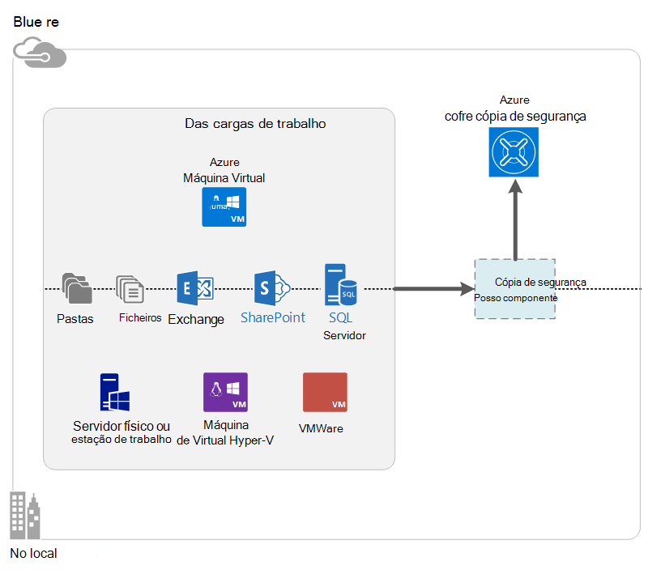

<properties
    pageTitle="O que é o Azure cópia de segurança? | Microsoft Azure"
    description="Ao utilizar os serviços de recuperação e cópias de segurança do Azure, pode criar cópias de segurança e restaurar dados e as aplicações a partir do Windows servidores, computadores de cliente do Windows, DPM do Centro de sistema e máquinas virtuais Azure."
    services="backup"
    documentationCenter=""
    authors="markgalioto"
    manager="cfreeman"
    editor="tysonn"
    keywords="cópia de segurança e restauro; Serviços de recuperação; soluções de cópia de segurança"/>

<tags
    ms.service="backup"
    ms.workload="storage-backup-recovery"
    ms.tgt_pltfrm="na"
    ms.devlang="na"
    ms.topic="get-started-article"
    ms.date="10/19/2016"
    ms.author="jimpark; trinadhk"/>

# O que é o Azure cópia de segurança?
Cópia de segurança do Azure é o serviço que utilizar para criar cópias de segurança e restaurar os dados na nuvem da Microsoft. Substitui o existente no local ou solução de cópia de segurança externa uma solução baseada na nuvem que seja fiável, seguro e custo competitiva. Também ajuda a proteger elementos que são executadas na nuvem. Cópia de segurança do Azure fornece serviços de recuperação criada com base numa infraestrutura de elevada é dimensionáveis, resistentes e altamente disponível.

[Ver uma descrição geral em vídeo de cópia de segurança do Azure](https://azure.microsoft.com/documentation/videos/what-is-azure-backup/)

## Porquê utilizar Azure cópia de segurança?
Soluções de cópia de segurança tradicionais tem evoluiu um tratar na nuvem como um ponto final semelhante de discos ou de banda. Apesar desta abordagem é simple, também é limitado. -Não tirar o máximo partido de uma plataforma nuvem subjacentes e corresponde a uma solução ineficaz, dispendiosa função.
Em contrapartida, cópia de segurança do Azure fornece todas as vantagens de uma solução de cópia de segurança da nuvem eficientes e acessível. Aqui estão algumas das principais vantagens que fornece Azure cópia de segurança.

| Funcionalidade | Benefício |
| ------- | ------- |
| Gestão de armazenamento automáticas | Não é necessária nenhuma despesa de capital para dispositivos de armazenamento no local. Cópia de segurança do Azure atribui automaticamente e gere o armazenamento de cópia de segurança e utiliza um modelo de consumo de pagamento a como-utilizar. |
| Dimensionamento ilimitado | Tirar partido de elevada disponibilidade garantias sem custos gerais de manutenção e monitorização. Cópia de segurança do Azure utiliza a power subjacentes e a escala da nuvem Azure, com as suas capacidades nonintrusive autoscaling. |
| Opções de armazenamento de múltiplos | Escolha o armazenamento de cópia de segurança com base nas necessidades:<li>Um blob do bloco de armazenamento localmente redundante é ideal para os clientes do preço preocupados e ainda ajuda a proteger dados contra falhas de local hardware. <li>Um blob de bloco de armazenamento de replicação geo fornece três mais cópias de um centro de dados par. Estas cópias extra ajudam a garantir que os seus dados de cópia de segurança são altamente disponíveis mesmo se ocorre uma Azure falhas de nível do site. |
| Transferir ilimitado dados | Não existe nenhuma encargo qualquer saída (saída) para transferência de dados durante uma operação de restauro do cofre a cópia de segurança. Dados de entrada para Azure também é gratuito. Funciona com o serviço de importação onde está disponível. |
| Encriptação de dados | Encriptação de dados permite uma transmissão segura e armazenamento dos dados do cliente na nuvem público. A frase de acesso de encriptação está armazenado na origem e nunca é transmitido ou armazenada no Azure. A chave de encriptação é necessário para restaurar os dados e apenas o cliente tem acesso completo aos dados no serviço. |  
| Cópia de segurança da aplicação consistentes | Aplicação consistentes cópias de segurança no Windows ajudam a garantir que correções não são necessárias no momento da restaurar, o que reduz o objectivo de tempo de recuperação. Isto permite que clientes regressar ao estado de execução mais rapidamente. |
| Retenção a longo prazo | Em vez de pagamento para soluções de cópia de segurança da banda externo, os clientes podem até Azure, que fornece uma solução de banda gosto atraente a um baixo custo. |

## Azure componentes de cópia de segurança
Uma vez que a cópia de segurança é uma solução de cópia de segurança híbrido, é composta por vários de componentes de que funcionam em conjunto para ativar ponto a ponto cópia de segurança e restaurar fluxos de trabalho.

### Cenários de implementação

| Componente | Pode ser implementada no Azure? | Pode ser implementado no local? | Armazenamento de destino suportado|
| --- | --- | --- | --- |
| Agente de cópia de segurança Azure | 
**Sim**
 
O agente de cópia de segurança do Azure pode ser implementado no qualquer VM de servidor do Windows que é executada no Azure.
 | 
**Sim**
 
O agente de cópia de segurança pode ser implementado em qualquer Windows Server VM ou máquina física.
 | 
Azure Cofre de cópia de segurança
 |
| Gestor de proteção de dados do sistema centro (DPM) | 
**Sim**

Saiba mais sobre [como pode proteger das cargas de trabalho no Azure utilizando DPM do Centro de sistema](http://blogs.technet.com/b/dpm/archive/2014/09/02/azure-iaas-workload-protection-using-data-protection-manager.aspx).
 | 
**Sim**
 
Saiba mais sobre [como pode proteger das cargas de trabalho e VMs no seu centro de dados](https://technet.microsoft.com/library/hh758173.aspx).
 | 
Disco ligado localmente,
 
Azure Cofre de cópia de segurança,
 
banda (no local apenas)
 |
| Servidor de cópia de segurança Azure | 
**Sim**

Saiba mais sobre [como pode proteger das cargas de trabalho no Azure utilizando o servidor de cópia de segurança do Azure](backup-azure-microsoft-azure-backup.md).
 | 
**Sim**
 
Saiba mais sobre [como pode proteger das cargas de trabalho no Azure utilizando o servidor de cópia de segurança do Azure](backup-azure-microsoft-azure-backup.md).
 | 
Disco ligado localmente,
 
Azure Cofre de cópia de segurança
 |
| Azure cópia de segurança (extensão VM) | 
**Sim**

Parte do Azure ferro

Especializadas para [cópia de segurança do Azure infraestrutura como um máquinas virtuais do serviço (IaaS)](backup-azure-vms-introduction.md).
 | 
**N**
 
Utilize DPM do Centro de sistema para agregar máquinas virtuais no seu centro de dados.
 | 
Azure Cofre de cópia de segurança
 |

### Vantagens de nível de componente e limitações

| Componente | Benefícios | Limitações | Granularidade recuperação |
| --- | --- | --- | --- |
| Agente de cópia de segurança (MARTE) Azure | <li>Pode fazer cópia de segurança ficheiros e pastas num computador sistema operativo Windows, ser-físicos ou virtuais (VMs podem estar em qualquer lugar no local ou Azure)<li>Sem servidor separado de cópia de segurança necessário<li>Utiliza o Azure cofre cópia de segurança | <li>Restaurar três vezes um dia/ficheiro de cópia de segurança nível<li>Ficheiro/pasta/volume restaurar nível apenas, a aplicação não tenha em atenção<li>Não existe suporte para Linux | pastas/ficheiros/volumes |
| Gestor de proteção de dados do Centro de sistema | <li>Instantâneos deverá ter em consideração de aplicação (VSS)<li>Flexibilidade completa para quando tirar cópias de segurança<li>Granularidade recuperação (todas)<li>Pode utilizar Cofre de cópia de segurança do Azure<li>Linux suporte (se alojado no Hyper-V) | <li>Falta de suporte heterogéneo (VMware VM criar cópias de segurança, carga de trabalho do Oracle cópias de segurança).  | pastas/ficheiros/volumes / VMs/aplicações |
| Servidor de cópia de segurança do Microsoft Azure | <li>Instantâneos deverá ter em consideração de aplicação (VSS)<li>Flexibilidade completa para quando tirar cópias de segurança<li>Granularidade recuperação (todas)<li>Pode utilizar Cofre de cópia de segurança do Azure<li>Linux suporte (se alojado no Hyper-V)<li>Não requerem uma licença do Centro de sistema | <li>Falta de suporte heterogéneo (VMware VM criar cópias de segurança, carga de trabalho do Oracle cópias de segurança).<li>Requer sempre uma subscrição do Azure direto<li>Não existe suporte para cópia de segurança banda | pastas/ficheiros/volumes / VMs/aplicações |
| Azure IaaS VM cópia de segurança | <li>Nativas cópias de segurança para Windows/Linux<li>Sem instalação do agente específico necessária<li>Cópia de segurança de nível ferro com sem infraestrutura de cópia de segurança necessário | <li>Uma vez por dia anterior cima/disco restaurar nível<li>Não é possível agregar no local | VMs Todos os discos (utilizando o PowerShell) |

## Quais as aplicações e das cargas de trabalho podem ser cópias de segurança?

| Carga de trabalho | Máquina de origem | Solução de cópia de segurança Azure |
| --- | --- |---|
| Ficheiros e pastas | Windows Server | 
[Agente de cópia de segurança do azure](backup-configure-vault.md),
 
[Centro de sistema DPM](backup-azure-dpm-introduction.md) (+ o agente de cópia de segurança do Azure),
 
[Servidor de cópia de segurança Azure](backup-azure-microsoft-azure-backup.md) (inclui o agente de cópia de segurança do Azure)
  |
| Ficheiros e pastas | Cliente do Windows | 
[Agente de cópia de segurança do azure](backup-configure-vault.md),
 
[Centro de sistema DPM](backup-azure-dpm-introduction.md) (+ o agente de cópia de segurança do Azure),
 
[Servidor de cópia de segurança Azure](backup-azure-microsoft-azure-backup.md) (inclui o agente de cópia de segurança do Azure)
  |
| Máquina de virtual Hyper-V (Windows) | Windows Server | 
[Centro de sistema DPM](backup-azure-backup-sql.md) (+ o agente de cópia de segurança do Azure),
 
[Servidor de cópia de segurança Azure](backup-azure-microsoft-azure-backup.md) (inclui o agente de cópia de segurança do Azure)
 |
| Máquina de virtual Hyper-V (Linux) | Windows Server | 
[Centro de sistema DPM](backup-azure-backup-sql.md) (+ o agente de cópia de segurança do Azure),
 
[Servidor de cópia de segurança Azure](backup-azure-microsoft-azure-backup.md) (inclui o agente de cópia de segurança do Azure)
  |
| Microsoft SQL Server | Windows Server | 
[Centro de sistema DPM](backup-azure-backup-sql.md) (+ o agente de cópia de segurança do Azure),
 
[Servidor de cópia de segurança Azure](backup-azure-microsoft-azure-backup.md) (inclui o agente de cópia de segurança do Azure)
  |
| Microsoft SharePoint | Windows Server | 
[Centro de sistema DPM](backup-azure-backup-sql.md) (+ o agente de cópia de segurança do Azure),
 
[Servidor de cópia de segurança Azure](backup-azure-microsoft-azure-backup.md) (inclui o agente de cópia de segurança do Azure)
   |
| Microsoft Exchange |  Windows Server | 
[Centro de sistema DPM](backup-azure-backup-sql.md) (+ o agente de cópia de segurança do Azure),
 
[Servidor de cópia de segurança Azure](backup-azure-microsoft-azure-backup.md) (inclui o agente de cópia de segurança do Azure)
   |
| Azure IaaS VMs (Windows) | - | [Azure cópia de segurança (extensão VM)](backup-azure-vms-introduction.md) |
| Azure IaaS VMs (Linux) | - | [Azure cópia de segurança (extensão VM)](backup-azure-vms-introduction.md) |

## Suporte de processador e Linux

| Componente | Suporte de processador | Linux (Azure menção) suporte |
| --- | --- | --- |
| Agente de cópia de segurança (MARTE) Azure | Sim | Não (só agente baseado no Windows) |
| Gestor de proteção de dados do Centro de sistema | Sim (agente no convidado) | É possível cópia de segurança apenas ficheiro consistentes de apenas Hyper-V (não VM Azure) |
| Servidor de cópia de segurança Azure (MAK, MAB) | Sim (agente no convidado) | Só é possível fazer cópia de segurança apenas ficheiro consistentes Hyper-V (não Azure VM) (a mesma DPM) |
| Azure IaaS VM cópia de segurança | Sim | Sim |

[AZURE.INCLUDE [learn-about-deployment-models](../../includes/learn-about-deployment-models-include.md)]

## Criar cópias de segurança e restaurar VMs armazenamento Premium

O serviço de cópia de segurança do Azure agora protege Premium armazenamento VMs.

### Criar uma cópia de segurança Premium armazenamento VMs

Enquanto cópias de segurança Premium armazenamento VMs, o serviço de cópia de segurança cria uma localização de transição temporária na conta de armazenamento de Premium. A localização da transição, chamada "AzureBackup-" é igual ao tamanho total de dados dos discos premium anexado a VM.

>[AZURE.NOTE] Não modificar ou editar a localização de transição.

Depois de termina a tarefa de cópia de segurança, a localização de transição é eliminada. O preço de armazenamento que utilizou para a localização de transição é consistente com todos os [preços de armazenamento Premium](../storage/storage-premium-storage.md#pricing-and-billing).

### Restaurar Premium armazenamento VMs

Podem ser restaurado Premium armazenamento VM para um dos armazenamento Premium ou para armazenamento normal. Restaurar um ponto de recuperação Premium armazenamento VM novamente ao armazenamento de Premium é o processo típico da restauração. No entanto, pode ser rentável para restaurar um ponto de recuperação Premium armazenamento VM para armazenamento padrão. Este tipo de restauro pode ser utilizado se precisar de um subconjunto dos ficheiros a partir da VM.

## Funcionalidade
Estas cinco tabelas resumem funcionalidade como cópia de segurança é resolvido cada componente.

### Armazenamento

| Funcionalidade | Agente de cópia de segurança Azure | Centro de sistema DPM | Servidor de cópia de segurança Azure | Azure cópia de segurança (extensão VM) |
| ------- | --- | --- | --- | ---- |
| Azure Cofre de cópia de segurança | ![Sim][green] | ![Sim][green] | ![Sim][green] | ![Sim][green] |
| Armazenamento no disco | | ![Sim][green] | ![Sim][green] |  |
| Armazenamento de banda | | ![Sim][green] |  | |
| Comprimir (cofre cópia de segurança) | ![Sim][green] | ![Sim][green]| ![Sim][green] | |
| Cópia de segurança utilizarão | ![Sim][green] | ![Sim][green] | ![Sim][green] | ![Sim][green] |
| Eliminação de duplicados do disco | | ![Parcialmente][yellow] | ![Parcialmente][yellow]| | |

O Cofre de cópia de segurança é o destino de armazenamento preferido através de todos os componentes. Centro de sistema DPM e o servidor de cópia de segurança também fornecem a opção para ter uma cópia de disco local. No entanto, apenas o sistema Centro DPM fornece a opção para escrever os dados para um dispositivo de armazenamento de banda.

#### Cópia de segurança utilizarão
Cada componente suporta utilizarão cópia de segurança, independentemente do armazenamento de destino (disco, banda, cofre cópia de segurança). Cópia de segurança utilizarão assegura que as cópias de segurança são armazenamento e a hora eficiente, transferindo apenas essas alterações efetuadas desde a última cópia de segurança.

#### Compressão
Cópias de segurança são comprimidas para reduzir o espaço de armazenamento necessários. O componente apenas que não utiliza o compressão é a extensão VM. Com extensão VM, todos os dados de cópia de segurança é copiada a partir de conta de armazenamento do cliente para o Cofre cópia de segurança na mesma região sem comprimi-lo. Enquanto aceder sem compressão ligeiramente inflates armazenamento utilizado, armazenar os dados sem compressão permite que os tempos de restaurar mais rápidos.

#### Eliminação de duplicados
Eliminação de duplicados é suportada para DPM do Centro de sistema e o servidor de cópia de segurança quando esta for [implementado numa máquina virtual Hyper-V](http://blogs.technet.com/b/dpm/archive/2015/01/06/deduplication-of-dpm-storage-reduce-dpm-storage-consumption.aspx). Eliminação de duplicados é executada ao nível do anfitrião ao utilizar a eliminação de duplicados do Windows Server no rígido discos virtuais (VHDs) que estejam anexados a máquina virtual como armazenamento de cópia de segurança.

>[AZURE.WARNING] Eliminação de duplicados não está disponível no Azure para qualquer uma dos componentes de cópia de segurança. Quando DPM do Centro de sistema e o servidor de cópia de segurança são implementados no Azure, não podem ser deduplicated discos de armazenamento anexados à VM.

### Segurança

| Funcionalidade | Agente de cópia de segurança Azure | Centro de sistema DPM | Servidor de cópia de segurança Azure | Azure cópia de segurança (extensão VM) |
| ------- | --- | --- | --- | ---- |
| Segurança de rede (para Azure) | ![Sim][green] |![Sim][green] | ![Sim][green] | ![Parcialmente][yellow]|
| Segurança de dados (no Azure) | ![Sim][green] |![Sim][green] | ![Sim][green] | ![Parcialmente][yellow]|

Todo o tráfego de cópia de segurança a partir do seu servidores para o Cofre de cópia de segurança está encriptado através da utilização avançada 256 padrão de encriptação. Os dados são enviados através de uma ligação HTTPS segura. Os dados de cópia de segurança também são armazenados no cofre cópia de segurança num formato encriptado. Apenas cliente mantém a frase de acesso para desbloquear estes dados. Microsoft não é possível desencriptar os dados de cópia de segurança em qualquer ponto.

>[AZURE.WARNING] A chave utilizada para encriptar os dados de cópia de segurança é apresentar apenas com o cliente. A Microsoft não manter uma cópia no Azure e não tem qualquer acesso à chave. Se a chave é no local incorreto, Microsoft não é possível recuperar os dados de cópia de segurança.

Cópias de segurança Azure VMs necessita de configuração de encriptação *dentro de* máquina virtual. Utilize o BitLocker em máquinas virtuais de Windows e **encriptação dm** em máquinas virtuais de Linux. Cópia de segurança do Azure não encripta automaticamente dados de cópia de segurança que sejam oriundos através deste caminho.

### Suportado das cargas de trabalho

| Funcionalidade | Agente de cópia de segurança Azure | Centro de sistema DPM | Servidor de cópia de segurança Azure | Azure cópia de segurança (extensão VM) |
| ------- | --- | --- | --- | ---- |
| Windows Server máquina – ficheiros e pastas | ![Sim][green] | ![Sim][green] | ![Sim][green] | |
| Máquina de cliente do Windows – ficheiros e pastas | ![Sim][green] | ![Sim][green] | ![Sim][green] | |
| Máquina de virtual Hyper-V (Windows) | | ![Sim][green] | ![Sim][green] | |
| Máquina de virtual Hyper-V (Linux) | | ![Sim][green] | ![Sim][green] | |
| Microsoft SQL Server | | ![Sim][green] | ![Sim][green] | |
| Microsoft SharePoint | | ![Sim][green] | ![Sim][green] | |
| Microsoft Exchange  | | ![Sim][green] | ![Sim][green] | |
| Azure máquina virtual (Windows) | | | | ![Sim][green] |
| Azure máquina virtual (Linux) | | | | ![Sim][green] |

### Rede

| Funcionalidade | Agente de cópia de segurança Azure | Centro de sistema DPM | Servidor de cópia de segurança Azure | Azure cópia de segurança (extensão VM) |
| ------- | --- | --- | --- | ---- |
| Rede compressão (para o servidor de cópia de segurança) | | ![Sim][green] | ![Sim][green] | |
| Rede compressão (para o Cofre cópia de segurança) | ![Sim][green] | ![Sim][green] | ![Sim][green] | |
| Protocolo de rede (para o servidor de cópia de segurança) | | TCP | TCP | |
| Protocolo de rede (para o Cofre cópia de segurança) | HTTPS | HTTPS | HTTPS | HTTPS |

Uma vez que a extensão VM lê os dados diretamente a partir da conta de armazenamento Azure através da rede de armazenamento, não é necessário otimizar o este tráfego. O tráfego é através da rede de armazenamento local no Centro de dados Azure, pelo que não existe pequeno necessidade de compressão devido a considerações sobre a largura de banda.

Se são efetuar cópias de segurança dos seus dados para um servidor de cópia de segurança (DPM ou servidor cópia de segurança), o tráfego do servidor principal para o servidor de cópia de segurança pode ser comprimido para guardar no largura de banda.

#### Limitação de rede
O agente de cópia de segurança do Azure fornece a capacidade de optimização, que permite-lhe controlar como a largura de banda de rede é utilizada durante a transferência de dados. Limitação pode ser útil se precisar de fazer cópia de segurança dados durante horas de trabalho, mas não pretender que o processo de cópia de segurança para interferir com outro tráfego da internet. Limitação para os dados transferência aplica-se para fazer cópia de segurança e restaurar atividades.

### Cópia de segurança e retenção

|  | Agente de cópia de segurança Azure | Centro de sistema DPM | Servidor de cópia de segurança Azure | Azure cópia de segurança (extensão VM) |
| --- | --- | --- | --- | --- |
| Frequência de cópia de segurança (para o Cofre cópia de segurança) | Três cópias de segurança por dia | Duas cópias de segurança por dia |Duas cópias de segurança por dia | Uma cópia de segurança por dia |
| Frequência de cópia de segurança (para o disco) | Não aplicável | 
A cada 15 minutos para SQL Server
 
Cada hora para outros das cargas de trabalho
 | 
A cada 15 minutos para SQL Server
 
Cada hora para outros das cargas de trabalho
 |Não aplicável |
| Opções de retenção | Diária, semanal, mensal, anual | Diária, semanal, mensal, anual | Diária, semanal, mensal, anual |Diária, semanal, mensal, anual |
| Período de retenção | Anos até 99 | Anos até 99 | Anos até 99 | Anos até 99 |
| Pontos de recuperação Cofre de cópia de segurança | Ilimitado | Ilimitado | Ilimitado | Ilimitado |
| Pontos de recuperação no disco local | Não aplicável | 64 para os servidores de ficheiro,  448 para os servidores de aplicações | 64 para os servidores de ficheiro,  448 para os servidores de aplicações |Não aplicável |
| Pontos de recuperação numa banda | Não aplicável | Ilimitado | Não aplicável | Não aplicável |

## O que é o ficheiro de credenciais do Cofre?

O ficheiro de credenciais do Cofre é um certificado gerado pelo portal para cada cofre cópia de segurança. O portal, em seguida, os carregamentos pendentes a chave pública para o serviço de controlo de acesso (ACS). A chave privada é fornecida ao utilizador quando a transferir as credenciais e, em seguida, introduzida durante o registo de máquina. A chave privada autentica a máquina para enviar dados de cópia de segurança para um cofre identificado no serviço de cópia de segurança do Azure.

A credencial Cofre é utilizada apenas durante o fluxo de trabalho do registo. É da sua responsabilidade para se certificar de que o ficheiro de credenciais do Cofre não está comprometido. Se cair mãos de qualquer utilizador não autorizado, o ficheiro de credenciais de cofre pode ser utilizado para registar outras máquinas contra o mesmo cofre. No entanto, uma vez que os dados de cópia de segurança são encriptados através de uma frase de acesso que pertencem apenas para o cliente, não é possível comprometidos dados de cópia de segurança existentes. Para mitigar este preocupações, a cofre credenciais estão definidas para expirar no 48 horas. Enquanto pode transferir as credenciais do Cofre de uma cópia de segurança do Cofre de palavras qualquer número de vezes, o mais recente ficheiro é aplicável durante o fluxo de trabalho do registo.

## Como é que a cópia de segurança do Azure difere do Azure recuperação de sites?
Muitos clientes confunda recuperação de cópia de segurança e recuperação de falhas. Ambos capturar dados e fornecem a semântica de restaurar, mas as propostas de valor core diferentes.

Cópia de segurança Azure copia o dados no local e na nuvem. Recuperação de Site Azure coordenadas replicação máquina virtual e servidor física, activação e reposição de recurso. Ambos os serviços são importantes porque a solução de recuperação de falhas tem de manter os seus dados seguros e recuperáveis (cópia de segurança) *e* manter o seu das cargas de trabalho disponíveis (recuperação do Site) quando ocorrem falhas.

Os conceitos seguintes ajudá-lo a tomar decisões importantes à volta de recuperação de cópia de segurança e falhas.

| Conceito | Detalhes | Cópia de segurança | Recuperação de falhas (DR) |
| ------- | ------- | ------ | ----------------- |
| Objectivo de ponto de recuperação (RPO) | A quantidade de perda de dados aceitável se necessitar de uma recuperação de ser executadas. | Soluções de cópia de segurança tem largura variabilidade no respetivo RPO aceitável. Cópias de segurança de máquina virtual normalmente têm um RPO de um dia, enquanto cópias de segurança da base de dados têm RPOs tão baixos quanto 15 minutos. | Soluções de recuperação de falhas tem RPOs baixos. A cópia de DR pode estar atrás através de aguardar alguns segundos ou alguns minutos. |
| Objectivo de tempo de recuperação (RTO) | A quantidade de tempo que demora para concluir uma recuperação ou restaurar. | Devido ao RPO maior, a quantidade de dados que necessita de uma solução de cópia de segurança para processar é-normalmente muito maior, que leva a mais longa RTOs. Por exemplo, pode demorar dias para restaurar os dados da bandas, consoante o tempo necessário para a banda a partir de uma localização externa de transporte. | Soluções de recuperação de falhas tem RTOs mais pequenos, porque são mais sincronizados com a origem. Alterações menos tem de ser processada. |
| Retenção | Quanto tempo dados tem de ser armazenado | Cenários que requerem recuperação operacional (danos nos dados, eliminação dos ficheiros inadvertidas, falha de sistema operativo), dados de cópia de segurança são normalmente retidos para 30 dias ou menos. Uma perspectiva de conformidade dados poderão ter de ser armazenados para meses ou mesmo anos. Dados de cópia de segurança Idealmente são adequados para o arquivo nestes casos. | Recuperação de falhas tem apenas recuperação operacionais dados, o que normalmente leva-o até algumas horas ou por excesso para um dia. Devido a captura extensivamente dados utilizada no DR soluções, utilizando dados de DR para retenção a longo prazo não é recomendado. |

## Próximos passos

Experimente uma cópia de segurança do Azure simples. Para obter instruções, consulte um nestes tutoriais:

- [Experimente a cópia de segurança do Azure](backup-try-azure-backup-in-10-mins.md)
- [Experimente Azure VM cópia de segurança](backup-azure-vms-first-look.md)

Uma vez que essas tutoriais ajudarão-lo cópias de segurança rapidamente, eles mostram-lhe apenas o caminho mais direto para criar cópias de segurança dos seus dados. Para obter informações adicionais sobre o tipo de cópias de segurança pretende fazer, consulte o artigo:

- [Criar uma cópia de segurança máquina do Windows](backup-configure-vault.md)
- [Criar uma cópia de segurança das cargas de trabalho de aplicação](backup-azure-microsoft-azure-backup.md)
- [Cópia de segurança IaaS Azure VMs](backup-azure-vms-prepare.md)

[green]: ./media/backup-introduction-to-azure-backup/green.png
[yellow]: ./media/backup-introduction-to-azure-backup/yellow.png
[red]: ./media/backup-introduction-to-azure-backup/red.png
