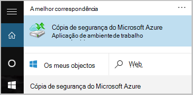

<properties
   pageTitle="Saiba como cópias de ficheiros e pastas a partir do Windows Azure com cópia de segurança do Azure utilizando o modelo de implementação do Gestor de recursos | Microsoft Azure"
   description="Aprenda a cópia de segurança dados do Windows Server ao criar um cofre, instalar o agente de serviços de recuperação e cópias de segurança de ficheiros e pastas Azure."
   services="backup"
   documentationCenter=""
   authors="markgalioto"
   manager="cfreeman"
   editor=""
   keywords="como cópia de segurança; como fazer cópia de segurança"/>

<tags
   ms.service="backup"
   ms.workload="storage-backup-recovery"
   ms.tgt_pltfrm="na"
   ms.devlang="na"
   ms.topic="hero-article"
   ms.date="09/27/2016"
   ms.author="markgal;"/>

# Primeiro olhar: cópias de ficheiros e pastas com cópia de segurança do Azure utilizando o modelo de implementação do Gestor de recursos

Este artigo explica como para trás o seu Windows Server (ou o cliente do Windows) ficheiros e pastas para Azure com cópia de segurança do Azure utilizando o Gestor de recursos. É um tutorial destinado a guiá-lo informações básicas. Se quiser começar a utilizar o Azure cópia de segurança, está no sítio certo.

Se quiser saber mais sobre Azure cópia de segurança, leia esta [Descrição geral](backup-introduction-to-azure-backup.md).

Cópias de segurança de ficheiros e pastas Azure requer seguintes atividades:

 obter uma subscrição do Azure (se ainda não tiver uma). 
 criar cofre serviços de recuperação. 
 transferir os ficheiros necessários. 
 instalar e registar o agente de serviços de recuperação. 
 cópias de ficheiros e pastas.

## Passo 1: Obter uma subscrição do Azure

Se não tiver uma subscrição do Azure, crie uma [conta gratuita](https://azure.microsoft.com/free/) que permite-lhe aceder a qualquer serviço Azure.

## Passo 2: Criar um cofre de serviços de recuperação

Para agregar seus ficheiros e pastas, é necessário criar um cofre de serviços de recuperação na região onde pretende armazenar os dados. Também tem de determinar como pretende que o armazenamento de replicadas.

### Para criar um cofre de serviços de recuperação

1. Se ainda não o tiver feito, início de sessão do [Portal do Azure](https://portal.azure.com/) utilizar a sua subscrição Azure.

2. No menu concentrador, clique em **Procurar** e na lista de recursos, escreva **Serviços de recuperação** e clique em **Serviços de recuperação cofres**.

      

3. No menu de **Serviços de recuperação cofres** , clique em **Adicionar**.

    

    O pá cofre serviços de recuperação abre-se, perguntar para fornecer um **nome**, a **subscrição**, o **grupo de recursos**e a **localização**.

    

4. Para o **nome**, introduza um nome amigável para identificar o cofre.

5. Clique em **subscrição** para ver a lista de subscrições disponível.

6. Clique em **grupo de recursos** para ver a lista de grupos de recursos disponível ou clique em **Novo** para criar um novo grupo de recursos.

7. Clique em **localização** para selecionar a região geográfica para o cofre. Esta opção determina a região geográfica onde os seus dados de cópia de segurança são enviados.

8. Clique em **Criar**.

    Se não vir o seu Cofre ficará listado foi concluída, clique em **Atualizar**. Quando atualiza a lista, clique no nome do cofre.

### Para determinar a redundância de armazenamento
Quando cria um cofre de serviços de recuperação em primeiro lugar determinar como o armazenamento é replicado.

1. Clique em novo cofre para abrir o dashboard.

2. Na pá **Definições** , que abre automaticamente com o dashboard do cofre, clique em **Infraestrutura de cópia de segurança**.

3. No pá infraestrutura de cópia de segurança, clique em **Configuração de cópia de segurança** para ver o **tipo de replicação de armazenamento**.

    

4. Selecione a opção de replicação de armazenamento adequado para o cofre.

    

    Por predefinição, o seu Cofre tem armazenamento geo redundante. Se estiver a utilizar o Azure como um ponto final de armazenamento de cópia de segurança principal, continue a utilizar o armazenamento geo redundante. Se estiver a utilizar o Azure como um ponto final de armazenamento de cópia de segurança não principal, em seguida, selecione armazenamento localmente redundante, que irá reduzir os custos do armazenamento dos dados no Azure. Leia mais informações sobre [geo redundantes](../storage/storage-redundancy.md#geo-redundant-storage) e opções de armazenamento [redundantes localmente](../storage/storage-redundancy.md#locally-redundant-storage) nesta [Descrição geral](../storage/storage-redundancy.md).

Agora que criou uma cofre, pode preparar a sua infraestrutura de cópia de segurança de ficheiros e pastas, transferindo as credenciais de serviços de recuperação do Microsoft Azure agente e cofre.

## Passo 3 - Transferir ficheiros

1. Clique em **Definições** no dashboard de Cofre de serviços de recuperação.

    

2. Clique em **Introdução > cópia de segurança** no pá definições.

    

3. Clique em **objectivo de cópia de segurança** no pá a cópia de segurança.

    

4. Selecionar **no local** a partir de onde é a sua carga de trabalho em execução? menu.

5. Selecione **ficheiros e pastas** a partir de o fazer pretende efectuar cópia de segurança? menu e clique em **OK**.

### Transfira o agente de serviços de recuperação

1. Clique em **Transferir agente para o Windows Server ou cliente do Windows** no pá a **infraestrutura de preparar** .

    

2. Clique em **Guardar** em transferência pop-up. Por predefinição, o ficheiro de **MARSagentinstaller.exe** está guardado para a sua pasta de transferências.

### Transferência de credenciais do Cofre

1. Clique em **Transferir > Guardar** no pá de infraestrutura de preparar.

    

## Passo 4 - instalar e registar o agente

>[AZURE.NOTE] Activar cópia de segurança através do portal do Azure é brevemente. Neste momento, utilize o agente de serviços de recuperação do Microsoft Azure no local para criar cópias de ficheiros e pastas.

1. Localize e faça duplo clique sobre a **MARSagentinstaller.exe** da pasta transferências (ou outra localização guardada).

2. Conclua o Assistente de configuração de agente do Microsoft Azure recuperação serviços. Para concluir o assistente, tem de:

    - Escolha uma localização para a instalação e a pasta em cache.
    - Forneça o proxy informações do servidor, se utilizar um servidor proxy para ligar à internet.
    - Fornece o utilizador detalhes de nome e palavra-passe, se utilizar um proxy autenticado.
    - Fornecer as credenciais do cofre transferido
    - Guarde a frase de acesso de encriptação numa localização segura.

    >[AZURE.NOTE] Se perder ou esquecer a frase de acesso, não é possível ajuda do Microsoft recuperar os dados de cópia de segurança. Guarde o ficheiro numa localização segura. É necessário para restaurar uma cópia de segurança.

Agora está instalado o agente e está registado o seu computador para o cofre. Está pronto para configurar e agendar a cópia de segurança.

## Passo 5: Agregar seus ficheiros e pastas

A cópia de segurança inicial inclui duas tarefas chaves:

- Agendar a cópia de segurança
- Cópia de segurança de ficheiros e pastas pela primeira vez

Para concluir a cópia de segurança inicial, pode utilizar o agente de serviços de recuperação do Microsoft Azure.

### Para agendar a cópia de segurança

1. Abra o agente de serviços de recuperação do Microsoft Azure. Pode encontrá-lo ao procurar o seu computador **Cópia de segurança do Microsoft Azure**.

    

2. No agente de serviços de recuperação, clique em **Agendar cópia de segurança**.

    

3. Na página de introdução do Assistente de cópia de segurança da agenda, clique em **seguinte**.

4. Em itens selecione a página de cópia de segurança, clique em **Adicionar itens**.

5. Selecione os ficheiros e pastas que pretende fazer cópia de segurança e, em seguida, clique em **OK**.

6. Clique em **seguinte**.

7. Na página **Especificar agenda de cópia de segurança** , especifique a **agenda de cópia de segurança** e clique em **seguinte**.

    Pode agendar diária (taxa de juro máximo de três vezes por dia) ou cópias de segurança semanais.

    

    >[AZURE.NOTE] Para obter mais informações sobre como especificar a agenda de cópia de segurança, consulte o artigo da [Cópia de segurança Azure utilizar para substituir a sua infraestrutura de banda](backup-azure-backup-cloud-as-tape.md).

8. Na página **Selecionar política de retenção** , selecione a **Política de retenção** para a cópia de segurança.

    A política de retenção Especifica a duração para o qual será armazenada a cópia de segurança. Em vez de apenas especificando uma "política simples" para todos os pontos de cópia de segurança, pode especificar políticas de retenção diferente com base em quando ocorre a cópia de segurança. Pode modificar as políticas de retenção diária, semanal, mensal e anual para corresponder às suas necessidades.

9. Na página escolher tipo de cópia de segurança inicial, escolha o tipo de cópia de segurança inicial. Deixe a opção **automaticamente através da rede** selecionada e, em seguida, clique em **seguinte**.

    Pode criar cópias automaticamente através da rede ou fazer uma cópia offline. O resto deste artigo descreve o processo de cópias de segurança automaticamente. Se preferir fazer uma cópia de segurança offline, consulte o artigo [Offline fluxo de trabalho de cópia de segurança na cópia de segurança do Azure](backup-azure-backup-import-export.md) para obter informações adicionais.

10. Na página Confirmation, reveja as informações e, em seguida, clique em **Concluir**.

11. Depois do assistente terminar de criar a agenda de cópia de segurança, clique em **Fechar**.

### Para criar cópias de ficheiros e pastas pela primeira vez

1. O agente de serviços de recuperação, clique em **Cópia de segurança agora** para concluir a propagação inicial através da rede.

    

2. Na página Confirmation, reveja as definições que o novamente o agora assistente irá utilizar para criar uma cópia de segurança do computador. Em seguida, clique em criar **Cópia**.

3. Clique em **Fechar** para fechar o assistente. Se efetuar o seguinte antes de terminar o processo de cópia de segurança, o assistente continua a ser executado em segundo plano.

Depois de concluída a cópia de segurança inicial, o estado de **tarefa concluída** é apresentada na consola de cópia de segurança.

## Perguntas?
Se tiver dúvidas, ou se existir qualquer funcionalidade que pretende ver incluídas, [envie-nos comentários](http://aka.ms/azurebackup_feedback).

## Próximos passos
- Obter mais detalhes sobre [cópias de segurança máquinas com o Windows](backup-configure-vault.md).
- Agora que tenha de segurança dos seus ficheiros e pastas, pode [Gerir os seus cofres e servidores](backup-azure-manage-windows-server.md).
- Se precisar de restaurar uma cópia de segurança, utilize este artigo para [Restaurar ficheiros a um computador Windows](backup-azure-restore-windows-server.md).
