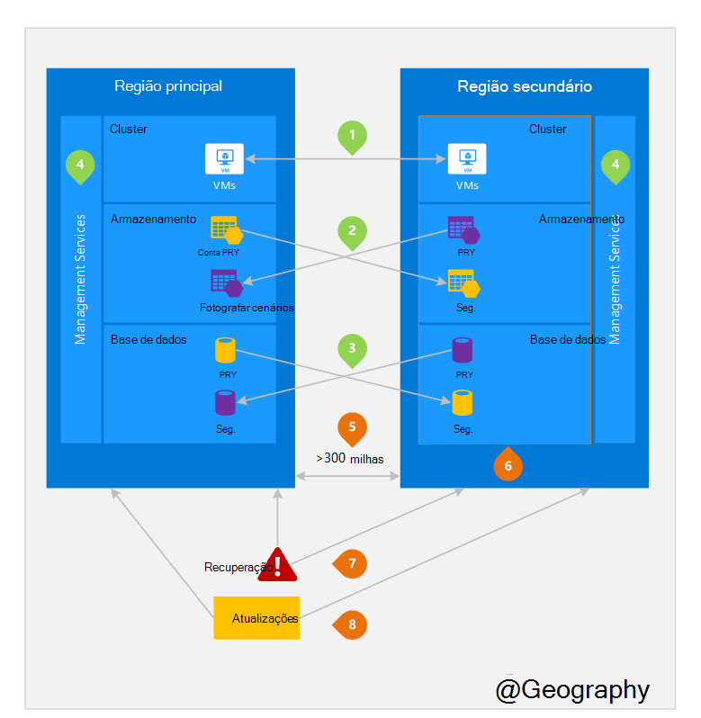

<properties
    pageTitle="Empresas continuidade e falhas recuperação (BCDR): Azure emparelhado regiões | Microsoft Azure"
    description="Azure pares regionais Certifique-se de que aplicações estão e são durante falhas de centro de dados."
    services="site-recovery"
    documentationCenter=""
    authors="rayne-wiselman"
    manager="jwhit"
    editor=""/>

<tags
    ms.service="site-recovery"
    ms.workload="storage-backup-recovery"
    ms.tgt_pltfrm="na"
    ms.devlang="na"
    ms.topic="article"
    ms.date="08/23/2016"
    ms.author="raynew"/>

# Empresas continuidade e falhas recuperação (BCDR): Azure emparelhadas regiões

## O que são emparelhadas regiões?

Azure funciona em vários geografias em todo o mundo. Uma Azure geografia é uma área definida do mundo que contém pelo menos uma região do Azure. Uma região Azure é uma área dentro de uma geografia que contém uma ou mais centros de dados.

Cada região Azure é emparelhado com outra região da geografia mesmo, em conjunto efetuar um par regional. A exceção é sul Brasil que é emparelhado com uma região fora da sua geográficos.

Figura 1 – diagrama par regionais Azure

| Geografia     |  Regiões de pares  |                     |
| :-------------| :-------------   | :-------------      |
| América do Norte | América do Norte Central (EUA) | Sul Central (EUA)    |
| América do Norte | Leste dos EUA          | Ocidental dos e.u.a.             |
| América do Norte | Leste dos EUA 2        | Centrais dos e.u.a.          |
| América do Norte | US Ocidental 2        | Oeste Central (EUA)     |
| Europa        | Europa Norte     | Europa Ocidental         |
| Países da Ásia          | Sudeste asiático  | Este asiático           |
| China         | Texto da Ásia China       | China norte         |
| Japão         | Japão leste       | Japão oeste          |
| Brasil        | Brasil Sul (1) | Sul Central (EUA)    |
| Austrália     | Leste Austrália   | Sudeste Austrália |
| Governo dos e.u.a. | Iowa de administração pública dos e.u.a.      | Virginia de administração pública dos e.u.a.     |
| Índia         | Índia central    | Sul Índia         |
| Canadá        | Canadá Central   | Leste Canadá         |
| REINO UNIDO            | Reino Unido oeste          | Sul Reino Unido            |

Tabela 1 - mapeamento de pares regionais azure

> (1) Sul Brasil é exclusivo porque é par de com uma região fora da sua própria geográficos. Região secundário do Sul do Brasil é sul Central-nos mas da Sul Central-nos região secundário não é sul do Brasil.

Recomendamos que replicadas das cargas de trabalho em pares regionais para beneficiar das políticas de isolamento e disponibilidade do Azure. Por exemplo, o sistema Azure planeadas atualizações são implementadas sequencialmente (não em simultâneo) entre as regiões pares. Isto significa que mesmo no evento raro de uma atualização cablagem, ambas as regiões, não serão afectadas em simultâneo. Além disso, na eventualidade de uma falha de abrangente, recuperação de pelo menos uma região terminar cada par tem prioridade.

## Um exemplo de regiões pares
Figura 2 abaixo mostra uma aplicação hipotética que utiliza o par regional para a recuperação de falhas. Os números verdes realçar as atividades de publicação em região dos três Azure serviços (calcular Azure, armazenamento e base de dados) e como estão configuradas para criar uma réplica entre as regiões. Os benefícios exclusivos de implementação entre as regiões emparelhadas estão realçados pelos números laranja.

Figura 2 – hipotética par regionais Azure

## Região de publicação em atividades
À medida que se refere figura 2.

 **Azure calcular (PaaS)** – tem de aprovisionamento recursos adicionais cluster com antecedência para garantir que os recursos estão disponíveis na região outra durante uma falhas. Para obter mais informações, consulte [orientações técnicas RDP Azure](./resiliency/resiliency-technical-guidance.md).

 **Armazenamento do Windows Azure** - armazenamento Geo redundantes (GRS) está configurado, por predefinição, quando é criada uma conta de armazenamento do Windows Azure. Com GRS, os dados automaticamente são replicados três vezes no interior da região principal e três vezes na região par. Para mais informações, consulte o artigo [Opções de redundância de armazenamento do Azure](storage/storage-redundancy.md).

 **Bases de dados do SQL Azure** – com Azure SQL Geo-replicação padrão, pode configurar a replicação assíncrona das transações para uma região emparelhada. Com a replicação-Geo Premium, pode configurar a replicação para qualquer região do mundo; No entanto, recomendamos que implementar estes recursos numa região para a maioria dos cenários de recuperação de falhas par. Para mais informações, consulte [A replicação Geo base de dados do SQL Azure](./sql-database/sql-database-geo-replication-overview.md).

 **Azure recurso Gestor (processador)** - processador fornece implicitamente lógico isolamento de componentes de gestão de serviço através de regiões. Isto significa falhas lógicas numa região são menos provável que causam impacto na outra.

## Vantagens de regiões pares
À medida que se refere figura 2.  

**isolamento físico** – sempre que possível, Azure prefere, pelo menos, 300 milhas de separação entre centros de dados num par regionais, apesar de esta não é possível ou prático em todas as geografias. Centro de dados física separação reduz a probabilidade de catástrofes naturais, civil unrest, falhas de corrente ou falhas de rede física afetar ambas as regiões ao mesmo tempo. Isolamento está sujeito a restrições dentro a geografia (tamanho de geografia, disponibilidade de infraestrutura de rede/power, regulamentos, etc.).  

**replicação desde de plataforma** - alguns serviços como o armazenamento Geo redundante fornecer a replicação automática à região de par.

**ordem de recuperação de região** – em caso de falha de abrangente, recuperação de uma região tem prioridade terminar cada par. Aplicações que são implementadas entre as regiões emparelhadas sejam tenha a certeza de ter uma das regiões recuperadas com prioridade. Se uma aplicação é implementada através de regiões que não são emparelhadas, poderá ser atrasada recuperação – na pior que as regiões que selecionou podem ser os dois últimos para ser recuperadas.

**sequencial atualizações** – planeado Azure sistema atualizações são lançadas regiões emparelhadas sequencialmente (não em simultâneo) para minimizar o tempo de inatividade, o efeito de erros e lógicas falhas no evento raro de uma atualização incorretas.

**residência de dados** – uma região reside dentro a geografia mesmo como respectivo par (com a exceção das Brasil Sul) para poder cumprir requisitos de residência de dados para fins impostos e lei imposição competência.

