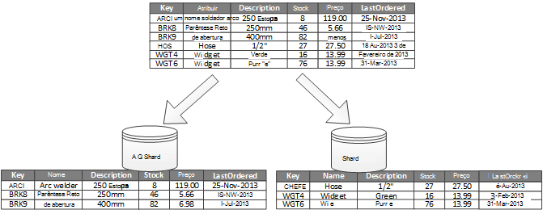
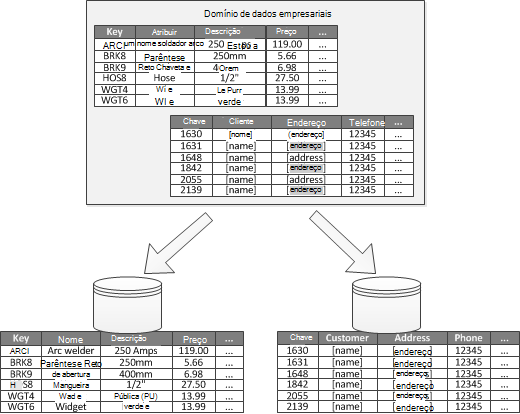

<properties
   pageTitle="Dados a partições orientações | Microsoft Azure"
   description="Orientação sobre como a partições a ser gerido e pode ser consultada separadamente separadas."
   services=""
   documentationCenter="na"
   authors="dragon119"
   manager="christb"
   editor=""
   tags=""/>

<tags
   ms.service="best-practice"
   ms.devlang="na"
   ms.topic="article"
   ms.tgt_pltfrm="na"
   ms.workload="na"
   ms.date="07/14/2016"
   ms.author="masashin"/>

# Guia para a partições dados

[AZURE.INCLUDE [pnp-header](../includes/guidance-pnp-header-include.md)]

## Descrição geral

Em muitos soluções em grande escala, dados são divididos em partições separadas que podem ser geridas e pode ser consultadas separadamente. A partições estratégia têm de ser escolhida cuidadosamente para maximizar os benefícios enquanto minimizar efeitos negativos. Criação de partições pode ajudar a melhorar a escalabilidade, reduzir contenção e otimizar o desempenho. Outra vantagem de criação de partições é que pode conferir um mecanismo para dividir dados pelo padrão de utilização. Por exemplo, pode arquivar dados (frios) antigos, menos ativos no menos dispendioso armazenamento de dados.

## Por que motivo a partições dados?

Mais loja de aplicações e serviços em nuvem e obter os dados como parte das suas operações. A estrutura dos arquivos de dados que utiliza uma aplicação pode ter influenciar significativa no desempenho, débito e escalabilidade de um sistema. É uma técnica frequentemente é aplicada nos sistemas em grande escala dividir os dados em partições separadas.

> O termo _de criação de partições_ que é utilizado nestas orientações refere-se para o processo de física dividi dados em arquivos de dados separado. Esta não é igual a criação de tabela do SQL Server a partições, que é um conceito diferente.

Criar a partições dados podem oferecer um número de benefícios. Por exemplo, podem ser aplicada em para:

- **Escalabilidade melhorar**. Quando dimensionar para cima um sistema de base de dados único, eventualmente irá chegar a um limite de hardware físico. Se dividir os dados em múltiplas partições, cada um dos quais está alojada num servidor separado, pode dimensionar o sistema quase indefinidamente.
- **Melhorar o desempenho**. Operações de acesso de dados em cada partição executada ao longo de um volume mais pequeno de dados. Desde que os dados tiver uma partição de forma adequada, partições podem tornar o seu sistema mais eficaz. Podem executar operações que afetam a mais de uma partição em paralelo. Cada partição pode ficar situada perto da aplicação que utiliza-o para minimizar a latência da rede.
- **Disponibilidade de melhorar**. Separar os dados por vários servidores evita um ponto de falha único. Se um servidor falhar, ou está em manutenção planeada, apenas os dados nessa partição não está disponível. Podem continuar a operações noutras partições. Aumentar o número de partições reduz o impacto relativo de uma falha de servidor único reduzindo a percentagem de dados que não estará disponíveis. Replicação de cada partição ainda mais pode reduzir as hipóteses de uma falha de única partição afetar operações. Se também torna possível separar os dados críticos que têm de ser continuamente e altamente disponível a partir de dados do valor mínimo que tem inferiores requisitos de disponibilidade (por exemplo, ficheiros de registo).
- **Melhorar a segurança**. Dependendo da natureza dos dados e como é dividido, poderá ser possível separar dados confidenciais e que não sejam sensíveis em diferentes partições e, consequentemente, para diferentes servidores ou dados armazena. Em seguida, pode ser otimizada especificamente segurança para os dados confidenciais.
- **Fornecer operacional flexibilidade**. Criação de partições oferece muitas oportunidades para fino operações de sintonização, maximizar eficiência administrativa e minimizar custo. Por exemplo, pode definir estratégias diferentes para a gestão, monitorização, cópia de segurança e restauro e outras tarefas administrativas com base na importância dos dados de cada partição.
- **Corresponder o arquivo de dados para o padrão de utilização**. Criação de partições permite que cada partição seja implementado num tipo de arquivo de dados, baseado no custo e as funcionalidades incorporadas que ofertas de arquivo de dados diferente. Por exemplo, dados binários grandes podem ser armazenados num arquivo de dados blob, enquanto mais dados estruturados podem ser contidos numa base de dados do documento. Para obter mais informações, consulte o artigo [criar uma solução polyglot] no guia de padrões & práticas e [de acesso a dados para soluções altamente dimensionáveis: utilizar SQL, NoSQL e persistente polyglot] no Web site da Microsoft.

Alguns sistemas não implementar a partições porque é considerado um custo em vez de uma vantagem. Razões mais comuns para este justificação incluem:

- Muitos sistemas de armazenamento de dados não suportam associações ao longo a partições e pode ser difícil manter a integridade referencial num sistema com partições. É necessário frequentemente implementar o associações e verificações de integridade no código de aplicação (na camada de criação de partições), que pode resultar em adicionais e/s e complexidade de aplicação.
- Manter a partições nem sempre é uma tarefa comum. Num sistema onde os dados estão voláteis, poderá ter de redistribuir a partições periodicamente para reduzir contenção e quente.
- Algumas ferramentas comuns não funcionam com os dados com partições naturalmente.

## Estruturar a partições

Dados podem ser divididos formas diferentes: horizontalmente, na vertical ou funcional. A estratégia que escolher depende o motivo para criar a partições os dados e os requisitos das aplicações e serviços que irão utilizar os dados.

> [AZURE.NOTE] Os esquemas de criação de partições descritos nestas orientações são explicados de uma forma que seja independente da tecnologia de armazenamento de dados subjacente. Podem ser aplicadas para muitos tipos de arquivos de dados, incluindo relacionais e NoSQL bases de dados.

### Criar a partições estratégias

Estratégias de três típicas para criar a partições dados são:

- **Criar a partições horizontal** (frequentemente chamado _sharding_). Nesta estratégia, cada partição é um arquivo de dados na sua própria direita, mas todas as partições têm o mesmo esquema. Cada partição é conhecida como um _shard_ e contém um subconjunto específico de dados, tal como todas as encomendas de um conjunto específico de clientes numa aplicação do comércio electrónico.
- **Criar a partições vertical**. Nesta estratégia, cada partição mantém um subconjunto dos campos para itens no arquivo de dados. Os campos estão divididos de acordo com os respetivos padrão de utilização. Por exemplo, os campos acedidos frequentemente poderão ser colocados numa partição de vertical e menos acedidos frequentemente campos no outro.
- A **partições funcionais**. Nesta estratégia são agregados dados de acordo com como são utilizadas por cada contexto delimitado no sistema. Por exemplo, um comércio electrónico sistema que implementa separar funções de negócio para a faturação e gestão de inventário do produto pode armazenar dados de fatura numa partição e produto inventário dados no outro.

É importante ter em atenção que podem ser combinadas estratégias de três descritas aqui. Não são mutuamente exclusivos e, recomendamos que considere-las todas ao estruturar um esquema de partições. Por exemplo, poderá dividir dados em shards e, em seguida, utilize a partições vertical para subdividir ainda mais os dados em cada shard. Da mesma forma, os dados de uma partição funcional podem ser divididos em shards (que podem também ser verticalmente divididos).

No entanto, os requisitos diferentes de cada estratégia podem aumentar um número de problemas em conflito. Tem de avaliar e de saldo a todos estes elementos ao estruturar um esquema de criação de partições que cumpre as metas de desempenho geral processamento de dados para o seu sistema. As secções seguintes explorar cada uma das estratégias mais detalhadamente.

### Horizontal a partições (sharding)

Figura 1 mostra uma descrição geral da criação de partições horizontal ou sharding. Neste exemplo, os dados de inventário do produto são divididos em shards com base na chave de produto. Cada shard contém os dados para um intervalo contíguo de chaves de shard (A-G e H-Z), organizados por ordem alfabética.

_Figura 1. Criação de partições na horizontal (sharding) dados com base numa chave de partição_

Sharding ajuda-o escalonado a carregar mais computadores, o que reduz o choque e melhora o desempenho. É possível dimensionar o sistema de saída adicionando ainda mais shards que são executados em servidores adicionais.

Fator de mais importante quando esta partições estratégia de execução é a escolha de chave sharding. Pode ser difícil alterar a chave depois do sistema está em operação. A chave tem de garantir que os dados tiver partições para que a carga de trabalho for par como quanto possível ao longo de shards.

Tenha em atenção que shards diferentes não tem de conter semelhantes volumes de dados. Em vez disso, a consideração mais importante é o número de pedidos de saldo. Algumas shards podem ser muito grandes, mas cada item é o assunto de um número mínimo de operações de acesso. Outros shards poderão ser mais pequenos, mas cada item é acedida muito mais frequentemente. Também é importante garantir que um único shard não excedam os limites de escala (em termos capacidade e recursos de processamento) do arquivo de dados que está a ser utilizado para alojar esse shard.

Se utilizar um esquema de sharding, evite criar pontos (ou a partições quentes) que podem afetar o desempenho e disponibilidade. Por exemplo, se utilizar um hash de um identificador de cliente em vez da primeira letra do nome de um cliente, pode impedir que a distribuição colunas equilibrada que resulta da comuns e menos comuns letras iniciais. Esta é uma técnica típica que ajuda a distribuir dados tarefas mais uniformemente ao longo de partições.

Selecione uma chave de sharding minimiza qualquer futuros requisitos para dividir shards grandes em partes mais pequenas, adesão shards pequenas para a partições maiores ou alterar o esquema que descreva os dados armazenados num conjunto de partições. Estas operações podem ser muito demoradas e pode ser necessário efetuar um ou mais shards offline enquanto são executadas.

Se shards estão replicadas, poderá ser possível manter algumas das réplicas online enquanto outras pessoas estão dividir, intercaladas ou reconfigurar. No entanto, poderá ter o sistema de limitar as operações que podem ser executadas nos dados estes shards enquanto a reconfiguração. Por exemplo, os dados no réplicas podem ser marcados como só de leitura para limitar o âmbito da inconsistências que poderão ocorrer enquanto está a ser reestruturadas shards.

> Para informações mais detalhadas e orientações sobre muitos estes considerações e técnicas aconselhável para criarem arquivos de dados que implementam a partições horizontal, consulte o artigo [padrão Sharding].

### Criar a partições vertical

A utilização mais comuns para a partições vertical é reduzir a e/s e os custos de desempenho associados a obtenção dos itens que são acedidos com mais frequência. Figura 2 mostra um exemplo de criar a partições vertical. Neste exemplo, as propriedades diferentes para cada item de dados são mantidas em partições diferentes. Uma partição contém os dados que são acedidos com mais frequência, incluindo o nome, descrição e informação de preços de produtos. Outro detém o volume em stock e a última data ordenada.

_Figura 2. Dados verticalmente a partições pelo seu padrão de utilização_

Neste exemplo, a aplicação regularmente consultar o nome do produto, descrição e preço quando apresentar os detalhes do produto aos clientes. O nível de cotações e a data quando o produto foi última encomendado fabricante são mantidos numa partição separada uma vez que estes dois itens são utilizados frequentemente em conjunto.

Este esquema partições tem a vantagem adicional que os dados relativamente lento-mover (nome do produto, descrição e preço) são são separados dos dados mais dinâmicos (nível de cotações e última data ordenada). Uma aplicação poderá encontrá-la úteis para os mover lento colocar dados em cache na memória se é acedida com frequência.

Outro cenário típico para que esta estratégia partições é maximizar a segurança dos dados confidenciais. Por exemplo, pode fazê-lo ao armazenar números de cartão de crédito e números de verificação de segurança de cartão correspondente na partições separadas.

Criar a partições vertical também podem reduzir a quantidade de acesso em simultâneo, que tem necessário para os dados.

> Criar a partições vertical funciona ao nível do entidade dentro de um arquivo de dados, parcialmente normalizar uma entidade interrompê-la para baixo de um item da _largura_ a um conjunto de _reduzir_ itens. É ideal adequado para arquivos de dados orientada como HBase e Cassandra. Se forem pouco alterar os dados numa coleção de colunas, também poderá considerar a utilização coluna armazena no SQL Server.

### Criar a partições funcional

Para sistemas onde é possível identificar um contexto delimitado para cada área comercial distintos ou serviço na aplicação, a partições funcional fornece uma técnica para melhorar o desempenho de acesso de isolamento e os dados. Outra utilização comum de criar a partições funcional é separar os dados de leitura / escrita a partir de dados só de leitura, que são utilizados para efeitos de relatórios. Figura 3 mostra uma descrição geral da criação de partições funcional onde os dados de inventário são separados de dados do cliente.

_Figura 3. Dados funcional partições por contexto delimitado ou subdomínio_

Esta estratégia partições pode ajudar a reduzir contenção de acesso de dados através de diferentes partes de um sistema.

## Estruturar a partições para escalabilidade

É crucial para ter em consideração tamanho e a carga de trabalho para cada partição e equilibrá-los para que os dados são distribuídos para alcançar escalabilidade máxima. No entanto, também tem partição os dados para que não ultrapasse os limites de dimensionamento de um arquivo de partição única.

Siga estes passos ao estruturar a partições para escalabilidade:

1. Analisar a aplicação para compreender os padrões de acesso de dados, tal como o tamanho do conjunto de resultados devolvido por cada consulta, a frequência de acesso, a latência inerente e do lado do servidor calcular os requisitos de processamento. Em muitos casos, alguns entidades principais vai exigir a maior parte dos recursos de processamento.
2. Utilize esta análise para determinar as metas de escalabilidade atuais e futuras, como o tamanho de dados e a carga de trabalho. Distribua, em seguida, os dados ao longo das partições para cumprir o destino da escalabilidade. Na criação de partições estratégia horizontal, é importante para se certificar de que a distribuição for par escolher a chave de shard adequado. Para obter mais informações, consulte o [padrão de Sharding].
3. Certifique-se de que os recursos disponíveis para cada partição são suficientes para processar os requisitos de escalabilidade em termos de tamanho de dados e o débito. Por exemplo, o nó que está a alojar uma partição poderá impor a quantidade de espaço de armazenamento, processamento de energia ou largura de banda de rede que fornece um limite disco rígido. Se os requisitos de armazenamento e processamento de dados forem provável que exceda estes limites, poderá ser necessário refinar a sua estratégia de criação de partições ou dividir dados saída ainda mais. Por exemplo, uma abordagem de escalabilidade poderá ser separar o registo de dados das funcionalidades de aplicação core. Pode fazê-lo ao utilizar dados separados lojas para impedir que os requisitos de armazenamento total de dados a partir do excedem o limite de dimensionamento do nó. Se o número total de arquivos de dados excede o limite de nó, poderá ser necessário utilizar nós de armazenamento em separado.
4. Monitorize o sistema em utilização para verificar que os dados são distribuídos como esperado e que a partições podem processar a carga que é que lhes é imposta. É possível que a utilização não corresponder a utilização de que é antecipada pela análise. Nesse caso, poderá ser possível redistribuir as partições. Na sua falta, poderá ser necessário reestruturar as algumas partes do sistema para obter o equilíbrio necessário.

Tenha em atenção que algumas ambientes de nuvem atribuir recursos em termos de limites de infraestrutura. Certifique-se de que os limites do seu limite selecionado fornecem espaço suficiente para qualquer crescimento antecipado do volume de dados, em termos de armazenamento de dados, potência de processamento e da largura de banda.

Por exemplo, se utilizar o armazenamento de tabela do Azure, um shard ocupado poderá exigir mais recursos do que estão disponíveis para uma única partição para processar pedidos. (Existe um limite para o volume dos pedidos de que poderá ser resolvido por uma única partição um determinado período de tempo. Consulte a página [destinos de desempenho e escalabilidade do Azure armazenamento] no Web site da Microsoft para obter mais detalhes).

 Se for o caso, a shard poderá ter de voltar a criar partições para distribuir a carga. Se o tamanho total ou débito destas tabelas exceder a capacidade de uma conta de armazenamento, poderá ser necessário criar contas de armazenamento adicional e distribuir as tabelas por nestas contas. Se o número de contas de armazenamento exceder o número de contas que estão disponíveis para uma subscrição, poderá ser necessário utilizar múltiplas subscrições.

## Estruturar a partições para o desempenho da consulta

Desempenho da consulta com frequência pode ser aumentado utilizando conjuntos de dados mais pequenos e executar consultas paralelas. Cada partição deve conter uma pequena proporção de todo o conjunto de dados. Este redução do volume pode melhorar o desempenho de consultas. No entanto, a partições não não uma alternativa para estruturar e configurar uma base de dados corretamente. Por exemplo, certifique-se de que tem os índices necessários num local se estiver a utilizar uma base de dados relacional.

Siga estes passos ao estruturar a partições para o desempenho da consulta:

1. Examine a requisitos da aplicação e o desempenho:
    - Utilize os requisitos de negócio para determinar as consultas de críticas sempre devem efetuar rapidamente.
    - Monitorize o sistema para identificar as consultas que ter um desempenho lento.
    - Estabelece quais as consultas são executadas com mais frequência. Uma única ocorrência de cada consulta poderá ter de custo mínimo, mas o consumo cumulativo de recursos pode dever significativo. Poderá ser úteis separar os dados que são obtidos por estas consultas para uma partição distinta ou mesmo uma cache.
2. Os dados que está a causar um desempenho lento partição:
    - Limite o tamanho de cada partição para que seja o tempo de resposta de consulta dentro de destino.
    - Estruture a chave de shard para que a aplicação pode encontrar facilmente a partições se estiver a implementar a partições horizontal. Isto impede que a consulta a partir tendo que percorrer todas as partições.
    - Considere a localização de uma partição de. Se possível, tente manter os dados na partições que estão geograficamente fechar para as aplicações e os utilizadores que aceder à mesma.
3. Se uma entidade possui requisitos de desempenho de débito e a consulta, utilize a partições funcional com base nessa entidade. Se esta ainda não corresponderem aos requisitos, aplicam-se de que também a partições horizontal. Na maioria dos casos uma estratégia de criação de partições única será suficiente, mas em alguns casos, é mais eficiente para combinar ambos os estratégias.
4. Considere a utilização de consultas assíncronas que executem o paralelamente a partições para melhorar o desempenho.

## Estruturar a partições para disponibilidade

Criar a partições dados podem melhorar a disponibilidade de aplicações, certificando-se que todo o conjunto de dados não constitui um ponto de falha único e que individuais subconjuntos do conjunto de dados podem ser geridos de forma independente. Replicação a partições que contêm dados críticos também pode melhorar a disponibilidade.

Ao estruturar e implementar a partições, considere os seguintes fatores que afetam a disponibilidade:

- **Os dados como crítico são para operações de negócio**. Alguns dados podem incluir informações críticas de negócio como detalhes da fatura ou as transações de identificação bancária. Outros dados podem incluir dados operacionais menos críticos, como ficheiros de registo, rastreios de desempenho e assim sucessivamente. Depois de identificação de cada tipo de dados, considere:
    - Armazenar dados críticos altamente disponíveis para a partições com um plano de cópia de segurança adequado.
    - Estabelecer gestão separada e monitorizar mecanismos ou procedimentos para os criticalities diferentes de cada conjunto de dados. Coloque os dados que tenham o mesmo nível de criticalidade na mesma partição para que-pode ser cópia de segurança em conjunto com uma frequência adequada. Por exemplo, a partições conter dados para as transações de identificação bancária poderão ter de ser cópia de segurança mais frequentemente do que a partições soltar registo ou informações de rastreio.
- **Como podem ser geridas a partições individuais**. Estruturar a partições para suportar independentes de gestão e manutenção fornece várias vantagens. Por exemplo:
    - Se uma partição falhar, pode possível recuperá-la separadamente sem afetar instâncias de aplicações que aceder aos dados noutras partições.
    - Criar a partições dados por áreas geográficas permite tarefas de manutenção agendada para ocorrem em das horas de expediente para cada localização. Certifique-se de que a partições não são demasiado grandes para impedir que qualquer manutenção planeada a ser concluídas durante este período.
- **Se pretende criar uma réplica dados críticos relativamente a toda a partições**. Esta estratégia pode melhorar a disponibilidade e desempenho, apesar de também podem apresentar se problemas de consistência. Demora tempo para as alterações efetuadas aos dados de uma partição a ser sincronizada com cada réplica. Durante este período, a partições diferentes irão conter valores de dados diferentes.

## Noções sobre como criar partições afeta estrutura e desenvolvimento

Utilizar a partições adiciona complexidade para a estrutura e desenvolvimento do sistema. Considere a partições como parte fundamental da sistema estrutura mesmo que o sistema inicialmente contém apenas uma única partição. Se endereço a partições como um afterthought, quando o sistema de começa a sofrem escalabilidade problemas de desempenho e, a complexidade aumenta porque já tem um sistema direto para manter.

Se atualizar o sistema para incorporar este ambiente de criação de partições, exige modificar a lógica de acesso de dados. Também pode envolvam migrar grandes quantidades de dados existentes para distribuí-lo ao longo a partições, muitas vezes enquanto esperado utilizadores possam continuar a utilizar o sistema.

Em alguns casos, partições não são considerado importante porque o conjunto de dados inicial é pequeno e pode ser facilmente processado por um único servidor. Pode ser verdadeiro num sistema de que não é esperado para dimensionar para além do respetivo tamanho inicial, mas muitos sistemas comerciais necessitam expandir como o número de utilizadores aumenta. Esta expansão é normalmente acompanhar por um crescimento do volume de dados.

Também é importante compreender que partições não não sempre uma função de arquivos de dados de grandes dimensões. Por exemplo, um arquivo de dados pequenas poderá ser acedido fortemente por centenas de clientes em simultâneo. Criar a partições os dados nesta situação podem ajudar a reduzir contenção e melhorar o débito.

Quando estrutura um esquema de partições de dados, considere os seguintes pontos:

- **Sempre que possível, manter os dados para as operações de base de dados mais comuns em conjunto em cada partição para minimizar os dados da publicação em partição operações de acesso**. Consultar ao longo a partições pode ser mais morosa do que consultar apenas a partir de uma única partição, mas otimizar a partições para um conjunto de consultas pode prejudicar outros conjuntos de consultas. Quando não é possível evitar consultar ao longo a partições, minimize o tempo de consulta executando paralelas consultas e agregar os resultados dentro da aplicação. Esta abordagem poderá não ser possível em alguns casos, tal como quando é necessário obter um resultado de uma consulta e utilizá-lo a consulta seguinte.
- **Se as consultas tornar a utilização de dados de referência relativamente estáticos, como código postal tabelas ou listas de produto, considere a hipótese de replicadas estes dados em todas as partições para reduzir o requisito de operações de pesquisa em separado na partições diferentes**. Esta abordagem, também pode reduzir a probabilidade de um conjunto de dados "quente" que está sujeito a tráfego intenso a partir no sistema de toda a tornar-se os dados de referência. No entanto, existe um custo adicional associado a sincronizar as alterações que podem ocorrer este fazer referência a dados.
- **Sempre que possível, minimizar requisitos para a integridade referencial através de partições verticais e funcionais**. Nestes esquemas, é responsável por manter a integridade referencial através de partições quando os dados são atualizados e consumidos a própria aplicação. Consultas que tem de aderir dados ao longo a partições várias lentamente mais mais consultas que participar dados apenas a partir da mesma partição de uma vez que a aplicação normalmente precisa executar consultas consecutivas com base numa chave e, em seguida, numa chave externa. Em vez disso, considere replicação ou anular normalizar os dados relevantes. Para minimizar o tempo de consulta onde partição de publicação em associações são necessárias, executar consultas de paralelas sobre as partições e participar os dados dentro da aplicação.
- **Considere o efeito que o esquema de partições poderão na consistência de dados através de partições.** Avalie se consistência forte é realmente um requisito. Em vez disso, é uma abordagem comuns na nuvem implementar o consistência eventual. Os dados em cada partição são atualizados separadamente e lógica da aplicação assegura que as atualizações são todas concluídas com êxito. Este também processa as inconsistências que podem surgir a partir de consultar dados enquanto está a executar uma operação de são eventualmente consistente. Para obter mais informações sobre como implementar consistência eventual, consulte a [introdução de consistência de dados].
- **Considere como consultas localize a partição do correta**. Se tem uma consulta de analisar todas as partições para localizar os dados necessários, existe um impacto significativo no desempenho, mesmo quando estiver a executar o várias consultas paralelas. Consultas que são utilizadas com verticais e funcionais estratégias partições naturalmente podem especificar as partições. No entanto, horizontal de criação de partições (sharding) pode tornar localizar um item difícil porque cada shard tem o mesmo esquema. É uma solução típica para sharding manter um mapa que pode ser utilizado para procurar a localização de shard para itens específicos dos dados. Este mapa pode ser implementado a lógica sharding da aplicação ou mantido ao arquivo de dados se suporta sharding transparente.
- **Ao utilizar uma estratégia de criação de partições horizontal, considere rebalanceamento periodicamente as shards**. Isto ajuda a distribuir uniformemente os dados por tamanho e por carga de trabalho para minimizar pontos, maximizar o desempenho da consulta e contornar limitações de armazenamento físico. Contudo, esta é uma tarefa complexa que muitas vezes necessita da utilização de uma ferramenta personalizada ou um processo.
- **Se criar uma réplica cada partição, fornece adicional protecção contra falha**. Se uma única réplica falhar, podem ser direccionadas consultas no sentido de uma cópia de trabalho.
- **Se atingir os limites físicos de uma estratégia de criação de partições, poderá ter de expandir a escalabilidade para um nível diferente**. Por exemplo, se a partições são a nível de base de dados, poderá ter de localizar ou criar uma réplica a partições no várias bases de dados. Se a partições já está a nível da base de dados e limitações físicas são um problema, poderá significa que necessita localizar ou criar uma réplica a partições no várias contas de alojamento.
- **Evitar transações que acederem a dados em múltiplas partições**. Alguns dados armazena implementar transaccionais consistência e integridade para operações de que a modificar dados, mas apenas quando os dados estão localizados numa única partição. Se precisar de suporte transaccional através de vários partições, provavelmente terá de implementar esta informação como parte da sua aplicação lógica porque sistemas mais partições não fornecem suporte nativo.

Todos os arquivos de dados necessitam de algumas gestão operacional e monitorizar a atividade. As tarefas podem variar entre carregar os dados, cópias de segurança e restaurar os dados, reorganizar os dados e garantir que o sistema está a funcionar corretamente e eficiente.

Tenha em consideração os seguintes fatores que afetam a gestão operacional:

- **Como implementar gestão adequado e tarefas operacionais quando os dados divididos em partições**. Estas tarefas podem incluir cópia de segurança e restauro, arquivar dados, monitorização o sistema e outras tarefas administrativas. Por exemplo, mantendo consistência lógica durante operações de cópia de segurança e restauro pode ser um desafio.
- **Como carregar os dados em múltiplas partições e adicionar novos dados que estão a chegar a partir de outras origens**. Algumas ferramentas e os utilitários poderão não suporta operações de dados sharded, tais como carregar os dados para a partição correta. Isto significa que pode ter de criar ou obter utilitários e novas ferramentas.
- **Como arquivar e eliminar os dados regularmente**. Para impedir que o crescimento excessivo de partições, tem de arquivar e eliminar dados regularmente (talvez mensalmente). Poderá ser necessário transformar os dados para corresponder ao esquema de um arquivo diferente.
- **Como localizar problemas de integridade dos dados**. Considere a executar um processo periódico para localizar qualquer problemas de integridade dos dados tal como dados numa partição que referencia informações em falta de outra tabela. O processo pode quer tentativa para corrigir automaticamente estes problemas ou subir um alerta para um operador a corrigir os problemas manualmente. Por exemplo, numa aplicação do comércio electrónico, informação da encomenda, poderá ser contida numa partição mas os itens de linha que constituem cada encomenda poderá ser contidos em outro. O processo de colocar uma ordem tem de adicionar dados a outras partições. Se este processo falhar, existem podem estar itens de linha armazenados para que não haja nenhuma ordem correspondente.

Tecnologias de armazenamento de dados diferentes normalmente fornecem os seus próprios funcionalidades para suportar a partições. As secções seguintes resumem as opções que são implementadas pelo frequentemente utilizados por aplicações Azure de arquivos de dados. Estes também descrevem considerações para criarem aplicações que melhor podem tirar partido destas funcionalidades.

## Criação de partições estratégias para a base de dados do SQL Azure

Base de dados SQL Azure é um relacionais da base de dados-como-a-serviço que é executada na nuvem. Baseia-se no Microsoft SQL Server. Uma base de dados relacional divide informações em tabelas e cada tabela contém informações sobre as entidades como uma série de linhas. Cada linha contém colunas que contêm os dados dos campos individuais de uma entidade. A página [o que é a base de dados do SQL Azure?] no Microsoft Web site fornece documentação detalhada sobre como criar e utilizar bases de dados SQL.

## Criar a partições horizontal com base de dados flexível

Uma base de dados do SQL única tem um limite para o volume de dados que pode conter. Débito é limitado pelo fatores arquitetura e o número de ligações em simultâneo que suporta. A funcionalidade flexível da base de dados da base de dados SQL suporta dimensionamento horizontal para uma base de dados do SQL. Base de dados flexível pode partição os seus dados para shards são distribuir por várias bases de dados do SQL. Também pode adicionar ou remover shards conforme o volume de dados que precisa para processar cresce e diminui. Utilizar a base de dados flexível também pode ajudar a reduzir contenção através da distribuição a carga de entre as bases de dados.

> [AZURE.NOTE] Base de dados flexível é uma substituição para a funcionalidade de profissionais da base de dados do SQL Azure. Existentes Federação de base de dados SQL instalações podem ser migradas a base de dados flexível utilizando o utilitário de migração profissionais. Em alternativa, pode implementar o seu próprio mecanismo sharding se o seu cenário não emprestar propriamente dito naturalmente às funcionalidades que são fornecidas pelo flexível da base de dados.

Cada shard é implementada como uma base de dados do SQL. Um shard pode conter mais do que um conjunto de dados (designado por um _shardlet_). Cada base de dados mantém metadados que descreve o shardlets nela contidos. Um shardlet pode ser um item de dados simples ou pode ser um grupo de itens que partilhem a mesma chave shardlet. Por exemplo, se estiver a sharding dados numa aplicação multi-inquilino, a chave de shardlet pode ser o ID do inquilino e todos os dados para um determinado inquilino podem realizar como parte do shardlet mesmo. Dados para outras inquilinos, serão realizados na shardlets diferente.

Cabe o programador para associar um conjunto de dados com uma chave de shardlet. Uma base de dados SQL separada age como um Gestor de mapa global shard. Esta base de dados contém uma lista de todos os shards e shardlets no sistema. Uma aplicação de cliente que acede aos dados liga-se pela primeira vez à global shard mapa Gestor base de dados para obter uma cópia do mapa shard (listar shards e shardlets), que-em seguida, coloca em cache localmente.

Em seguida, a aplicação utiliza estas informações para encaminhar os pedidos de dados para o shard adequado. Esta funcionalidade estiver oculto por trás de uma série de APIs contidos no Azure SQL da base de dados flexível base de dados de biblioteca do cliente, que se encontra disponível como um pacote de NuGet. A página [Descrição geral das funcionalidades de base de dados flexível] no Web site da Microsoft fornece uma introdução à base de dados flexível mais abrangente.

> [AZURE.NOTE] Pode criar uma réplica global shard mapa Gestor base de dados para reduzir a latência e melhorar a disponibilidade. Se implementar a base de dados utilizando uma das camadas comparar Premium, pode configurar geo-replicação do active continuamente copiar dados para bases de dados no regiões diferentes. Crie uma cópia da base de dados em cada região em que sejam baseiam os utilizadores. Em seguida, configure a aplicação para ligar a esta cópia para obter o mapa shard.

> Uma abordagem alternativa é utilizar a sincronização de dados do SQL Azure ou pipeline uma fábrica de dados do Azure a ser replicadas a base de dados do Gestor de mapa shard em regiões. Este formulário de replicação executa periodicamente e é mais adequado se o mapa shard forem alterados com pouca frequência. Para além disso, a base de dados do Gestor de mapa shard não tem de ser criada utilizando um prémio preços de camadas.

Base de dados flexível fornece dois esquemas para mapear os dados para shardlets e armazená-las no shards:

- Um **mapa de shard lista** descreve uma associação entre uma única chave e um shardlet. Por exemplo, num sistema multi-inquilino, os dados de cada inquilino podem ser associados uma chave exclusiva e armazenados na sua própria shardlet. Para garantir a privacidade e de isolamento (ou seja, para impedir que um inquilino eventualidade os recursos de armazenamento de dados disponíveis para outras pessoas), pode realizar-se na sua própria shard cada shardlet.

_Figura 4. Utilizar um mapa de shard de lista para armazenar dados do inquilino shards separadas_

- Um **mapa do intervalo shard** descreve uma associação entre um conjunto de valores chave contíguas e um shardlet. No exemplo multi-inquilino descrito anteriormente, como alternativa à aplicação shardlets dedicada, pode agrupar os dados de um conjunto de inquilinos (cada com a sua própria chave) dentro shardlet o mesmo. Este esquema é menos dispendioso que o primeiro (uma vez que os inquilinos partilham recursos de armazenamento de dados), mas também cria um risco de reduzida e privacidade dos dados isolamento.

_Figura 5. Utilizar um mapa de shard intervalo para armazenar dados para um intervalo de inquilinos um shard_

Tenha em atenção que um único shard pode conter os dados de várias shardlets. Por exemplo, pode utilizar a lista shardlets para armazenar dados para diferentes inquilinos descontíguas na shard mesmo. Também pode misturar shardlets de intervalo e lista shardlets no shard mesmo, embora serão endereçadas através de mapas diferentes da base de dados do Gestor de mapa global shard. (A base de dados do Gestor de mapa global shard pode conter vários mapas shard.) Figura 6 ilustra esta abordagem.

_Figura 6. Implementar a shard vários mapas_

O esquema de criação de partições que implementar pode influenciam significativa no desempenho do seu sistema. Também pode afectar a taxa que shards tem de ser adicionados ou removidos ou a taxa que dados devem voltar a criar partições nos shards. Ao utilizar flexível da base de dados para dados da partição, tenha em consideração os seguintes pontos:

- Agrupar dados são utilizados em conjunto no mesmo shard e evitar operações de que precisam para aceder aos dados que são mantidos em vários shards. Tenha em atenção que, com base de dados flexível, um shard é uma base de dados do SQL na sua própria direita e base de dados do Azure SQL não suporta as associações de base de dados entre sites (que têm a ser executado no lado do cliente). Lembre-se também que numa base de dados SQL Azure, restrições de integridade referencial, accionadores e procedimentos armazenados numa base de dados não podem referenciar objetos no outro. Por conseguinte, não Estruture um sistema que tenha dependências entre shards. Uma base de dados do SQL no entanto, pode, contêm tabelas que contêm cópias dos dados de referência frequentemente utilizados por consultas e outras operações. Estas tabelas não tem de pertencer a qualquer shardlet específico. Replicação estes dados ao longo shards pode ajudar a remover a necessidade de dados de associação que abrange bases de dados. Idealmente, esses dados devem ser estática ou lento-mover para minimizar o esforço de replicação e reduzir as hipóteses do mesmo se tornam obsoletos.

    > [AZURE.NOTE] Apesar de base de dados SQL não suporta associações entre bases de dados, pode executar consultas de shard cruzada com a API flexível de base de dados. Estas consultas transparente podem iteração os dados contidos em todos os shardlets referenciadas por um mapa de shard. A API de base de dados flexível quebras cruzada-shard consultas para baixo numa série de consultas individuais (um para cada base de dados) e, em seguida, intercala os resultados. Para mais informações, consulte a página [com várias shard consultar] no Web site da Microsoft.

- Os dados armazenados na shardlets que pertencem ao mapa de shard mesmo deverão ter o mesmo esquema. Por exemplo, se não crie um mapa de shard de lista que aponta para alguns shardlets que contenha dados do inquilino e outros shardlets que contém informações de produto. Esta regra não é aplicada pelos flexível da base de dados, mas a gestão de dados e consultar torna-se muito complexa se cada shardlet tem um esquema diferente. No exemplo apenas citado, indicado é solução criar duas lista shard mapas: uma que faz referência a dados do inquilino e outro que aponta para informações sobre o produto. Lembre-se de que os dados que pertencem a shardlets diferentes podem ser armazenados numa shard mesmo.

    > [AZURE.NOTE] A funcionalidade de consulta cruzada shard da base de dados API flexível depende cada shardlet no mapa do shard que contém o mesmo esquema.

- Operações transaccionais só são suportadas para dados que são mantidos no interior shard a mesma e não ao longo dos shards. Transações podem ocupar shardlets desde que fazem parte da mesma shard. Por isso, se necessitar de lógica de negócio efetuar operações, ou armazenar os dados afetados o mesmo shard ou implementar consistência eventual. Para obter mais informações, consulte a [introdução de consistência de dados].
- Coloque shards fechar para utilizadores que acederem aos dados nesses shards (por outras palavras, geo-localize os shards). Esta estratégia de ajuda a reduzir a latência.
- Evitar ter uma mistura de altamente activo (pontos) e shards relativamente Inativas. Tente distribuir uniformemente a carga por shards. Isto poderá implicar hashing as teclas de shardlet.
- Se estiver a localizar geo shards, certifique-se de que as teclas hash mapear para shardlets contidos em shards armazenados fechar para utilizadores que aceder a esses dados.
- Atualmente, apenas um limitado conjunto de dados do SQL tipos são suportados como shardlet teclas; _int, bigint, varbinary_ e _uniqueidentifier_. Os tipos SQL _int_ e _bigint_ correspondem aos tipos de dados de _int_ e _por extenso_ no c# e tem os mesmos intervalos. O tipo de _varbinary_ SQL poderá ser resolvido utilizando uma matriz de _bytes_ no c# e o tipo de _uniqueidentier_ SQL corresponde à classe de _Guid_ no .NET Framework.

Como o nome implica, base de dados flexível torna possível para um sistema adicionar e remover shards conforme o volume dos dados encolhe e cresce. APIs na biblioteca de cliente do Azure da base de dados flexível base de dados SQL ativar uma aplicação criar e eliminar shards dinamicamente (e transparente actualizar o Gestor de mapa shard). No entanto, uma operação apagar o último que também requer eliminar todos os dados que shard é remover um shard.

Se necessitar de uma aplicação dividir uma shard em dois shards separadas ou combinar shards, base de dados flexível fornece um serviço de intercalação de divisão separado. Este serviço é executado num serviço na nuvem alojado (que têm de ser criado pelo programador) e migra dados em segurança entre shards. Para mais informações, consulte o tópico [dimensionamento utilizando a ferramenta de intercalação de divisão de base de dados flexível] no Web site da Microsoft.

## Criar a partições estratégias de armazenamento do Windows Azure

Armazenamento Azure fornece três captações para gerir os dados:

- Armazenamento de tabela, implementa o armazenamento de estrutura dimensionáveis. Uma tabela contém uma coleção de entidades, cada uma das quais pode incluir um conjunto de valores e propriedades.
- Armazenamento de BLOBs, que fornece armazenamento para objectos de grandes dimensões e ficheiros.
- Filas de armazenamento, mensagens assíncrona fiável entre aplicações de suporte.

Armazenamento de tabela e armazenamento de BLOBs são armazena essencialmente ao valor da chave que está otimizadas para colocar em espera dados estruturados e não estruturados respetivamente. Filas de armazenamento fornecem um mecanismo para criar aplicações de agregamento, dimensionáveis. Armazenamento de tabela, armazenamento de BLOBs e filas de armazenamento são criadas dentro do contexto de uma conta de armazenamento Azure. Três formas de redundância de suporte de contas de armazenamento:

- **Armazenamento localmente redundante**, o que mantém três cópias dos dados dentro do Centro de dados um único. Este formulário de redundância protege contra falha de hardware, mas não contra uma falhas que englobe o Centro de dados inteiro.
- Armazenamento **zona redundante**, que mantém três cópias dos dados afaste centros de dados diferentes dentro da mesma região (ou entre duas áreas geograficamente fechar). Este formulário de redundância pode proteger contra catástrofes que ocorrem dentro de um única Centro de dados, mas não podem proteger contra rede em grande escala desliga que afetam a toda a região. Tenha em atenção que zona redundantes armazenamento está atualmente apenas atualmente disponível para blobs do bloco.
- **Armazenamento Geo redundante**, o que mantém seis cópias de dados: três cópias numa região (sua região local) e outro três cópias numa região remoto. Este formulário de redundância fornece o mais alto nível de proteção de falhas.

Microsoft publicou destinos escalabilidade para armazenamento do Windows Azure. Para mais informações, consulte a página [destinos de desempenho e escalabilidade de armazenamento do Windows Azure] no Web site da Microsoft. Atualmente, a capacidade de conta de armazenamento total não pode exceder 500 TB. (Isto inclui o tamanho dos dados que são mantidos no armazenamento de tabela e armazenamento de BLOBs, bem como pendentes mensagens que são mantidas na fila de armazenamento).

A taxa de pedido de máximo (partindo do princípio de uma entidade de 1 KB, blob ou tamanho da mensagem) é 20 KBps. Se o seu sistema for provável que excedam estes limites, considere a partições a carga em várias contas de armazenamento. Uma subscrição Azure única pode criar contas de armazenamento até 100. No entanto, tenha em atenção que poderão alterar estes limites ao longo do tempo.

## Criar a partições armazenamento de tabela do Azure

Armazenamento de tabela do Azure é um arquivo de valor de chave que destina-se à volta a partições. Todas as entidades são armazenadas numa partição e a partições são geridas internamente pelo armazenamento de tabela do Azure. Cada entidade que está armazenada numa tabela deve fornecer uma chave de duas partes que inclui:

- **A tecla partição**. Este é um valor de cadeia que determina quais partição de armazenamento de tabela do Azure irá colocar a entidade. Todas as entidades com a mesma chave partição serão armazenadas na mesma partição.
- **A chave de linha**. Este é outro valor de cadeia que identifica entidade dentro da partição. Todas as entidades dentro de uma partição são lexically, ordenadas por ordem ascendente, por esta chave. A combinação de teclas de chave/linha partição deve ser exclusiva para cada entidade e não pode exceder 1 KB de comprimento.

O resto dos dados para uma entidade consiste em campos definidos pelo aplicação. Sem esquemas determinados são impostos e cada linha pode conter um conjunto de campos definidos pelo aplicação diferente. A única limitação é que o tamanho máximo de uma entidade (incluindo as teclas partição e linha) atualmente é 1 MB. O tamanho máximo de uma tabela é 200 TB, ainda que estes valores poderão mudar no futuro. (Consulte a página de [armazenamento do Windows Azure desempenho e escalabilidade destinos] no Web site da Microsoft para obter as informações mais recentes sobre estes limites.)

Se estiver a tentar armazenar entidades que excedam esta capacidade, em seguida, considere dividi-los em várias tabelas. Utilize a partições vertical para dividir os campos nos grupos que estão mais predispostos a ser acedido em conjunto.

Figura 7 mostra a estrutura lógica de uma conta de armazenamento de exemplo (dados Contoso) para uma aplicação de comércio electrónico fictícios. A conta de armazenamento contém três tabelas: informações de cliente, informações de produto e informações de encomenda. Cada tabela tem múltiplas partições.

Na tabela de informações de cliente, os dados são divididos de acordo com o nome da cidade na qual está localizado o cliente e a chave de linha contém o ID de cliente. Na tabela de informações do produto, os produtos estão divididos por categoria de produto e a chave de linha contém o número de produto. Na tabela Info Encomenda, as encomendas são divididas pela data em que foram colocados e a chave de linha especifica a hora que a ordem foi recebida. Tenha em atenção que todos os dados é ordenada pela chave em cada partição de linha.

_Figura 7. As tabelas e a partições numa conta de armazenamento de exemplo_

> [AZURE.NOTE] Armazenamento de tabela do Azure também adiciona um campo de hora para cada entidade. O campo Data/hora é mantido ao armazenamento de tabela e é atualizado sempre que a entidade é modificada e escrita novamente a uma partição. O serviço de armazenamento de tabela utiliza este campo para implementar simultaneidade optimista. (Sempre que uma aplicação escreve uma entidade novamente ao armazenamento de tabelas, o serviço de armazenamento de tabela se compara o valor do carimbo de data/hora na entidade que está a ser escrito com o valor que é mantido em armazenamento de tabela. Se os valores são diferentes, significa que outra aplicação deve ter modificado a entidade desde foi acedidos pela última vez e a operação de escrita falha. Não modificar este campo no seu próprio código e não especificar um valor para este campo quando cria uma nova entidade.

Armazenamento de tabela do Azure utiliza a chave de partição para determinar como deve armazenar os dados. Se uma entidade é adicionada a uma tabela com uma chave de partição anteriormente não utilizadas, o armazenamento de tabela do Azure cria uma nova partição para esta entidade. Outras entidades com a mesma chave partição serão armazenadas na mesma partição.

Este mecanismo de forma eficaz implementa uma estratégia de escala de saída automática. Cada partição é armazenada num servidor único num centro de dados Azure para ajudar a garantir que consultas que obtêm dados a partir de uma única partição executar rapidamente. No entanto, a partições diferentes podem ser distribuídas por vários servidores. Para além disso, um único servidor pode alojar várias partições se estas partições são limitadas de tamanho.

Quando estrutura as entidades para o armazenamento de tabela do Azure, tenha em consideração os seguintes pontos:

- A seleção de valores chave partição chave e linha deve ser esforço pela forma como na qual os dados são acedidos. Selecione uma combinação de teclas o partição chave/linha que suporte a maioria das suas consultas. As consultas mais eficientes obtêm dados especificando a chave de partição e a linha. Consultas que especificam uma chave de partição e um intervalo de teclas de linha podem ser concluídas através da pesquisa de uma única partição. Isto é relativamente rápido, porque os dados são mantidos na ordem de chave de linha. Se consultas não especificar qual partição para digitalizar, a chave de partição poderá necessitar de armazenamento da tabela Azure para digitalizar todas as partições para os seus dados.

    > [AZURE.TIP] Se uma entidade tem uma tecla natural, em seguida, utilizá-la como chave partição e especifique uma cadeia vazia como a chave de linha. Se uma entidade tem uma chave composta composto por duas propriedades, selecione a propriedade mais baixa alteração como a chave de partição e o outro como a chave de linha. Se uma entidade tiver mais de duas propriedades chave, utilize uma concatenação das propriedades para fornecer as teclas partição e linha.

- Se executar consultas que procurar dados utilizando campos que não seja a partições e linha as teclas regularmente, considere a implementação o [padrão de tabela de índice remissivo].
- Se gerar chaves de partição utilizando um monótona crescentes ou decrescentes sequência (tais como "0001", "0002", "0003" e assim sucessivamente) e cada partição contém apenas uma quantidade limitada de dados, armazenamento de tabela do Azure física pode agrupar estas partições em conjunto no mesmo servidor. Este mecanismo assume que a aplicação é provavelmente realizar consultas através de um intervalo contíguo de partições (consultas de intervalo) e está optimizada para este incidente. No entanto, esta abordagem pode levar a pontos de activos com foco num único servidor, uma vez que todas as inserções de novas entidades são ser concentrado numa extremidade ou a outra dos intervalos de contíguos. Pode também reduzir escalabilidade. Para distribuir a carga de tarefas mais uniformemente por servidores, considere o hashing a chave de partição para tornar a sequência mais aleatório.
- Armazenamento de tabela do Azure suporta operações transaccionais para entidades que pertencem a mesma partição. Isto significa que uma aplicação pode executar várias inserir, atualizar, eliminar, substituir ou operações de impressão em série como uma unidade atómica (desde que a operação não inclui entidades mais de 100 e a carga útil do pedido de não excede 4 MB). Operações que aparecem em várias partições não são transaccionais e poderão implicar a implementar consistência eventual, tal como descrito a [introdução de consistência de dados]. Para mais informações sobre o armazenamento de tabela e as transações, aceda à página [as transações de grupo de entidade efectuar] no Web site da Microsoft.
- Dar atenção cuidadosa à granularidade da chave de partição devido às seguintes razões:
    - Utilizar a mesma chave partição para cada entidade faz com que o serviço de armazenamento de tabela criar uma única partição de grandes dimensões é mantida num servidor. Esta impede de dimensionamento saída e, em vez disso foca-se a carga num único servidor. Como resultado, esta abordagem é apenas adequada para sistemas de gerir um pequeno número de entidades. No entanto, esta abordagem Certifique-se de que todas as entidades podem participar em transações do grupo de entidade.
    - Utilizar uma chave de partição exclusivo para cada entidade faz com que o serviço de armazenamento de tabela criar uma partição separada para cada entidade, possivelmente que resulta num grande número de partições pequenas (consoante o tamanho das entidades). Esta abordagem é mais dimensionável que com uma chave de única partição, mas as transações de grupo entidade não são possíveis. Além disso, consultas que obter mais de uma entidade poderão envolvam ler a partir de mais de um servidor. No entanto, se a aplicação efetua consultas de intervalo, em seguida, utilizando uma sequência monótona para gerar chaves a partições poderão ajudar a otimizar estas consultas.
    - Partilhar a chave de partição através de um subconjunto de entidades permite-lhe agrupar entidades na mesma partição relacionadas. Operações que envolvam entidades relacionadas podem ser efetuadas utilizando as transações de grupo entidade e podem ser cumpridas consultas que obter um conjunto de entidades relacionadas acedendo a um único servidor.

Para obter informações adicionais sobre a partições dados no armazenamento de tabela do Azure, consulte o artigo [Guia de estrutura de tabela do Azure armazenamento] no Web site da Microsoft.

## Criar a partições armazenamento de Blobs do Azure

Armazenamento de Blobs do Azure torna soltar objectos binários grandes – atualmente até 200 GB de tamanho para bloquear blobs ou 1 TB para blobs de página. (Para obter as informações mais recentes, ir para a página de [armazenamento do Windows Azure desempenho e escalabilidade destinos] no Web site da Microsoft.) Utilize bloco blobs em cenários como transmissão onde precisa para carregar ou transferir rapidamente grandes volumes de dados. Utilize blobs de página para as aplicações que requerem aleatórios em vez de série acesso a partes dos dados.

Cada blob (bloco ou página) é mantida num contentor de uma conta de armazenamento Azure. Pode utilizar contentores para agrupar blobs relacionadas que têm os mesmos requisitos de segurança, apesar desta agrupamento é lógicos em vez de física. Dentro de um contentor, cada blob tem um nome exclusivo.

Armazenamento de BLOBs é automaticamente dividido com base no nome da blob. Cada blob é mantida na sua própria partição. BLOBs no mesmo contentor não partilhar a uma partição. Esta arquitetura ajuda-o armazenamento de Blobs do Azure para equilibrar a carga entre servidores transparente pois blobs diferentes no mesmo contentor podem ser distribuídas ao longo de servidores diferentes.

Ações de escrever um único bloco (blob bloco) ou página (blob página) são Atómica, mas não estão operações que abrangem blocos, páginas ou blobs. Se precisar de garantir a consistência quando efetuar operações de escrita nos blocos, páginas e blobs, demorar saída um bloqueio de escrita, utilizando uma locação blob.

Armazenamento de Blobs do Azure suporta velocidades de transferência de até 60 MB por pedidos de segundo ou 500 por segundo para cada blob. Se antecipar ultrapassar os estes limites e os dados de BLOBs forem relativamente estáticos, em seguida, considere replicação blobs ao utilizar a rede de entrega de conteúdos do Azure. Para mais informações, consulte a página [utilizar conteúdo rede de entrega do Azure] no Web site da Microsoft. Para sugestões adicionais e considerações, consulte o artigo [utilizar conteúdo rede de entrega do Azure].

## Criar a partições filas de armazenamento Azure

Filas de armazenamento Azure permitem-lhe implementar mensagens assíncrona entre processos. Uma conta de armazenamento Azure pode conter qualquer número de filas e cada fila pode conter qualquer número de mensagens. A única limitação é o espaço que está disponível na conta de armazenamento. O tamanho máximo de uma mensagem individual é 64 KB. Se necessitar de mensagens de maiores que isto, considere utilizar filas Azure Service Bus como alternativa.

Cada fila de armazenamento tem um nome exclusivo dentro da conta de armazenamento que a contém. Azure partições filas com base no nome. Todas as mensagens para a mesma fila são armazenadas na mesma partição, que é controlada por um único servidor. Filas diferentes podem ser geridas por servidores diferentes para o ajudar a equilibrar a carga. A atribuição de filas para servidores é transparente para aplicações e utilizadores.

 Numa aplicação em grande escala, não utilize a mesma fila de armazenamento para todas as instâncias da aplicação porque esta abordagem poderá fazer com que o servidor que aloja fila de espera para se tornar um ponto activo. Em alternativa, utilize filas diferentes para diferentes áreas funcionais da aplicação. Filas de armazenamento Azure não suportam operações, para que encaminha mensagens para diferentes filas deve ter impacto pouco sobre mensagens consistência.

Uma fila de armazenamento Azure pode processar até 2000 mensagens por segundo.  Se precisar de processar mensagens de taxa de juro maior superior a esta, considere criar múltiplas filas. Por exemplo, numa aplicação global, crie filas de armazenamento separado nas contas de armazenamento em separado para processar instâncias da aplicação que estão a ser executada em cada uma das regiões.

## Criar a partições estratégias para Bus de serviço do Azure

Azure Service Bus utiliza um corretor de mensagem para lidar com mensagens que são enviadas a uma fila de serviço Bus ou um tópico. Por predefinição, todas as mensagens que são enviadas a uma fila ou tópico são processadas pelo mesmo processo de corretor de mensagem. Esta arquitetura pode colocar uma limitação de débito global da fila mensagem. No entanto, também pode partição uma fila ou tópico, quando é criado. Pode fazê-lo através da propriedade _EnablePartitioning_ da descrição fila ou tópico _Verdadeiro_.

Uma fila com partições ou tópico é dividido em vários fragmentos, cada um dos quais é cópias por um arquivo de mensagens em separado e o corretor de mensagem. Serviço Bus leva responsabilidade para criar e gerir estes fragmentos. Quando uma aplicação publicar uma mensagem para uma fila com partições ou tópico, o serviço Bus atribui a mensagem para um fragmento para essa fila ou um tópico. Quando uma aplicação recebe uma mensagem a partir de uma subscrição ou fila de espera, o serviço Bus verifica cada fragmento de para a próxima mensagem disponível e, em seguida, transmite-lo para a aplicação para processamento.

Esta estrutura ajuda distribuir a carga por corretor de mensagem e arquivos de mensagens, aumentando a escalabilidade e melhorar a disponibilidade. Se o arquivo de corretor ou mensagem de mensagens para uma fragmento está temporariamente indisponível, o serviço Bus pode obter mensagens a partir de uma dos restantes fragmentos disponíveis.

Serviço Bus atribui uma mensagem a um fragmento da seguinte forma:

- Se a mensagem pertencer a uma sessão, todas as mensagens com o mesmo valor para a propriedade _identificador de sessão_ são enviadas para o mesmo fragmento.
- Se a mensagem não pertence a uma sessão, mas o remetente tiver especificado um valor para a propriedade _PartitionKey_ , em seguida, todas as mensagens com o mesmo valor _PartitionKey_ são enviadas para o mesmo fragmento.

    > [AZURE.NOTE] Se as propriedades de _ID de sessão_ e _PartitionKey_ são ambos especificados, em seguida, tem de estar definidas para o mesmo valor ou a mensagem será rejeitada.
- Se as propriedades de _ID de sessão_ e _PartitionKey_ para uma mensagem não estão especificadas, mas a deteção de duplicados é ativada, a propriedade _MessageId_ será utilizada. Todas as mensagens com o mesmo _MessageId_ serão direcionadas para o mesmo fragmento.
- Se as mensagens não incluem uma propriedade de _ID de sessão, PartitionKey,_ ou _MessageId_ , em seguida, serviço Bus atribui mensagens fragmentos sequencialmente. Se um fragmento estiver disponível, serviço Bus se irá mover para o próximo. Isto significa que uma falha temporária a infraestrutura de mensagens não faz com que a operação de enviar mensagem falhar.

Considere os seguintes pontos quando decidir se ou como um fila de mensagens do serviço Bus ou um tópico de partições:

- Filas Bus de serviço e tópicos são criados no âmbito de um espaço de nomes de serviço Bus. Serviço Bus atualmente permite até 100 filas com partições ou tópicos por espaço de nomes.
- Cada espaço de nomes de serviço Bus impõe as quotas de recursos disponíveis, tal como o número de subscrições por tópico, o número de em simultâneo enviar e receber pedidos por segundo e o número máximo de ligações em simultâneo que podem ser estabelecidas. Estas quotas encontram-se documentados no Web site da Microsoft na página [as quotas de Bus de serviço]. Se pretender exceda estes valores, em seguida, criar espaços de nomes adicionais com os seus próprios filas e tópicos e distribuir o trabalho por estes espaços de nomes. Por exemplo, numa aplicação global, criar espaços de nomes distintos em cada região e configurar instâncias da aplicação para utilizar as filas e tópicos no espaço de nomes mais próximo.
- Mensagens que são enviadas como parte de uma transação tem de especificar uma chave de partição. Isto pode ser uma propriedade de _ID de sessão_, _PartitionKey_ou _MessageId_ . Todas as mensagens que são enviadas como parte da transação mesmo tem de especificar a mesma chave partição porque tem de ser tratados pelo mesmo processo de corretor de mensagem. Não é possível enviar mensagens para diferentes filas ou tópicos dentro da mesma transação.
- Filas com partições e tópicos não podem ser configurados para ser automaticamente eliminados quando estes se tornam idle.
- Filas com partições e tópicos não atualmente ser utilizados com o avançadas mensagem colocação Protocol (AMQP) se estiver a criar soluções em diferentes plataformas ou híbrido.

## Criar a partições estratégias para Azure DocumentDB bases de dados

Azure DocumentDB é uma base de dados NoSQL pode armazenar documentos. Um documento numa base de dados DocumentDB é uma representação serializado JSON de um objeto ou outro bloco de dados. Sem esquemas fixos são impostos, exceto os cada documento tem de conter um ID exclusivo.

Documentos estão organizados em coleções de sites. Pode agrupar documentos relacionados em conjunto numa coleção. Por exemplo, num sistema de que mantém os registos de blogue, pode armazenar os conteúdos de cada mensagem no blogue como um documento numa coleção. Também pode criar coleções de sites para cada tipo de assunto. Em alternativa, numa aplicação multi-inquilino, tal como um sistema onde diferentes autores controlar e gerir os seus próprios mensagens no blogue, pode criar a partições blogues por autor e criar coleções de sites separadas para cada autor. O espaço de armazenamento que está atribuído à coleções de sites é flexível e pode aumentar ou diminuir conforme necessário.

Coleções de documento fornecem um mecanismo natural para criar a partições dados dentro de uma base de dados simples. Interior, uma base de dados DocumentDB pode abranger vários servidores e pode tentar distribuir a carga através da distribuição coleções entre servidores. A forma mais simples para implementar o sharding é criar uma coleção de cada shard.

> [AZURE.NOTE] Cada base de dados DocumentDB tem um _nível de desempenho_ que determina a quantidade de recursos que obtém. Um nível de desempenho está associado um limite de taxas de _unidade pedido_ (RU). O limite da taxa RU Especifica o volume dos recursos já exclusiva reservada e disponível para utilização por essa coleção. O custo de uma coleção de depende o nível de desempenho está seleccionado para essa coleção. Maior que o desempenho nível (e o limite da taxa RU) quanto maior o encargo de. Pode ajustar o nível de desempenho de uma coleção de utilizando o portal do Azure. Para mais informações, consulte a página [níveis de desempenho no DocumentDB] no Web site da Microsoft.

Todas as bases de dados são criados no contexto de uma conta de DocumentDB. Uma única conta de DocumentDB pode conter várias bases de dados e especifica no qual o região são criadas as bases de dados. Cada conta DocumentDB também impõe os suas próprias controlo de acesso. Pode utilizar contas DocumentDB geo-localize shards (colecções dentro de bases de dados) fechar para os utilizadores que precisam de aceder aos mesmos e impor restrições, para que apenas a esses utilizadores podem ligar aos mesmos.

Cada conta DocumentDB tem uma quota que limita o número de bases de dados e coleções de sites que pode conter e na quantidade de armazenamento de documentos que está disponível. Estes limites estão sujeitos a alteração, mas são descritos na página [DocumentDB limites e as quotas] no Web site da Microsoft. É possível teoricamente de se implementar um sistema onde todos os shards pertencem a mesma base de dados, pode chegar o limite da capacidade de armazenamento da conta.

Neste caso, poderá ter de criar contas DocumentDB adicionais e bases de dados e distribuir os shards por estas bases de dados. No entanto, mesmo se estiver pouco alcançar a capacidade de armazenamento de uma base de dados, é aconselhável utilizar várias bases de dados. Se ao facto de cada base de dados tem o seu próprio conjunto de utilizadores e permissões e pode utilizar este mecanismo para identificar o acesso às coleções de numa base por base de dados.

Figura 8 ilustra a estrutura de alto nível da arquitectura DocumentDB.

_Figura 8.  A estrutura da arquitectura DocumentDB_

É a tarefa da aplicação cliente para direcionar pedidos para o shard adequado, normalmente através da implementação os suas próprias mecanismo de mapeamento com base em alguns atributos dos dados que definem a chave de shard. Figura 9 mostra duas DocumentDB bases de dados, cada que contém duas coleções que são serve como shards. Os dados são sharded por um ID de inquilino e contém os dados para um inquilino específico. As bases de dados são criados no contas DocumentDB separadas. Nestas contas estão localizadas na mesma região como os inquilinos para os quais contêm dados. A lógica encaminhamento na aplicação cliente utiliza o ID de inquilino como chave shard.

_Figura 9. Implementar a sharding utilizando uma base de dados do Azure DocumentDB_

Considere os seguintes pontos quando decidir como partição dados com uma base de dados DocumentDB:

- **Os recursos disponíveis para uma base de dados DocumentDB estão sujeitas as limitações de quota da conta DocumentDB**. Cada base de dados pode conter um número de coleções de sites (novamente, não existe um limite), cada uma das coleções está associada um nível de desempenho que controle o limite de taxa de RU (débito reservado) para essa coleção. Para mais informações, aceda à página de [limites de DocumentDB e as quotas] no Web site da Microsoft.
- **Cada documento tem de ter um atributo que pode ser utilizado para identificar exclusivamente esse documento dentro da coleção na qual é mantida**. Este atributo é diferente da chave de shard, que define a coleção de que detém o documento. Uma coleção de pode conter um grande número de documentos. Em teoria, é limitado apenas pelo comprimento máximo do ID do documento. O ID do documento pode ser até 255 carateres.
- **Todas as operações relativamente a um documento são executadas dentro do contexto de uma transação. Transações em DocumentDB bases de dados estão limitadas para a coleção de no qual o documento está contido.** Se uma operação falhar, o trabalho que foi efetuada é revertido. Enquanto o documento estiver sujeito a uma operação, quaisquer alterações efetuadas são sujeitas instantâneo nível de isolamento. Este mecanismo garante que se, por exemplo, um pedido para criar um novo documento falhar, outro utilizador que está a consultar a base de dados em simultâneo não irá visualizar um documento parcial que, em seguida, é removido.
- **Consultas de base de dados DocumentDB também são confinadas ao nível da coleção de**. Uma única consulta pode obter dados a partir de apenas uma coleção. Se precisar de obter dados a partir de várias coleções de sites, tem de consulta individualmente cada uma das coleções e intercalar os resultados no código da aplicação.
- **Bases de dados de DocumentDB suporta programáveis itens que podem ser todas armazenadas numa coleção de ao longo dos documentos**. Estes incluem procedimentos armazenados, as funções definidas pelo utilizador e accionadores (escritos JavaScript). Estes itens podem aceder a qualquer documento dentro da mesma coleção. Além disso, estes itens são executados quer dentro o âmbito da transação ambiente (no caso de um accionador que é acionada, como o resultado de um criar, eliminar ou substituir operação executada relativamente a um documento), ou ao começar uma nova transação (no caso de um procedimento armazenado que é executada como resultado de um pedido de cliente explícito). Se o código de um item programável inicia uma exceção, a transação é revertida. Pode utilizar os procedimentos armazenados e accionadores para manter a integridade e consistência entre documentos, mas estes documentos têm de ser todos parte da mesma coleção de.
- **As coleções de ficheiros que pretende sem soltar nas bases de dados numa conta DocumentDB devem ser pouco provável que excedam os limites de débito definidos pelos níveis de desempenho das colecções**. Estes limites são descritos na página [Gerir DocumentDB capacidade precisa] no Web site da Microsoft. Se antecipar a que estes limites, considere dividir coleções em bases de dados de diferentes contas DocumentDB para reduzir a carga por coleção.

## Criar a partições estratégias para a pesquisa do Azure

A capacidade de procurar dados com frequência é o método principal de navegação e informações detalhadas que são fornecida por muitas aplicações web. É útil utilizadores encontre recursos rapidamente (por exemplo, produtos numa aplicação do comércio electrónico), com base em combinações de critérios de pesquisa. O serviço de pesquisa do Azure fornece capacidades de texto completo pesquisa ao longo do conteúdo da web e inclui funcionalidades como as sugestões automáticas, sugeridas consultas com base em perto correspondências e navegação por facetas. Uma descrição completa destas capacidades está disponível na página [o que é o Azure pesquisa?] no Web site da Microsoft.

Pesquisa Azure armazena conteúdo pesquisável como documentos JSON numa base de dados. Pode definir índices que especifique os campos pesquisáveis nestes documentos e fornecem estas definições de pesquisa do Azure. Quando um utilizador submeter um pedido de pesquisa, o Azure pesquisa utiliza os índices adequados para encontrar itens correspondentes.

Para reduzir contenção, o armazenamento que é utilizado pela pesquisa Azure pode ser dividido em 1, 2, 3, 4, 6 ou 12 partições e cada partição pode ser replicada até 6 horas. O produto do número de partições multiplicada pelo número de réplicas chama-se a _unidade de pesquisa_ (DOM). Uma única ocorrência de pesquisa do Azure pode conter um máximo de 36 SUs (uma base de dados com a 12 partições apenas suporta um máximo de 3 réplicas).

São faturada para cada DOM que está atribuído no seu serviço. À medida que o volume de conteúdo pesquisáveis os aumentos ou a taxa de pedidos de pesquisa cresce, pode adicionar SUs para uma instância existente do Azure pesquisa para processar a carga extra. Procura Azure propriamente dita distribui os documentos uniformemente nas partições. Sem estratégias de criação de partições manuais atualmente são suportadas.

Cada partição pode conter um máximo de 15 milhões de documentos ou ocupar 300 GB de espaço de armazenamento (consoante o que é mais pequeno). Pode criar índices até 50. O desempenho do serviço de varia e depende da complexidade de documentos, os índices disponíveis e os efeitos da latência da rede. Em média, uma única réplica (1 DOM) deverá conseguir processar 15 consultas por segundo (QPS), embora Recomendamos efetuar análise comparativa com os seus dados para obter uma medida mais precisa de débito. Para mais informações, consulte a página [limites de serviço do Azure pesquisa] no Web site da Microsoft.

> [AZURE.NOTE] Pode guardar um conjunto de tipos de dados limitado pesquisáveis documentos, incluindo cadeias, valores booleanos, dados numéricos, dados de data/hora e alguns dados geográficos. Para obter mais detalhes, consulte a página [tipos de dados suportados (Azure procurar)] no Web site da Microsoft.

Tem limitado controlo sobre como procurar Azure partições de dados para cada instância do serviço. No entanto, num ambiente global poderá melhorar o desempenho e reduzir latência e ainda mais contenção através da criação de partições o serviço de si própria, utilizando um dos seguintes estratégias:

- Criar uma instância do Azure pesquisa em cada região geográfica e certifique-se de que as aplicações de cliente são orientadas para o mais próximo instância disponível. Esta estratégia requer que quaisquer atualizações conteúdo pesquisável são replicadas forma atempada em todas as instâncias do serviço.

- Crie duas camadas de pesquisa do Azure:
    - Um serviço local em cada região que contém os dados que com mais frequência são acedidos por utilizadores nesse região. Os utilizadores podem direccionar pedidos para obter os resultados rápidos mas limitados.
    - Um serviço global que engloba todos os dados. Os utilizadores podem direccionar pedidos para obter os resultados mais lentos mas mais completas.

Esta abordagem é mais adequada quando existe uma variação regional significativa nos dados de que estão a ser procuradas.

## Criação de partições estratégias para Azure Redis Cache

Azure Redis Cache fornece um serviço de cache partilhado na nuvem que é baseada no arquivo de dados do valor de chave de Redis. Tal como o nome do mesmo implica, Azure Redis Cache destina-se como uma solução de colocação em cache. Utilizá-la apenas para a suspensão de dados breves e não como um arquivo de dados permanente. Aplicações que utilizam a Cache de Redis Azure deverá conseguir continuar a funcionar se a cache não está disponível. Azure Redis Cache suporta a replicação principal/secundário para fornecer elevada disponibilidade, mas atualmente limita o tamanho máximo da cache para 53 GB. Se precisar de mais espaço em que esta, terá de criar caches adicionais. Para mais informações, aceda à página [Azure Redis Cache] no Web site da Microsoft.

Criar a partições um arquivo de dados Redis envolve dividir os dados em várias instâncias do serviço Redis. Cada instância constitui uma única partição. Azure Redis Cache abstracts os serviços de Redis atrás uma fachada e não expô-las diretamente. A forma mais simples para implementar a partições é criar várias instâncias de Cache Redis do Azure e distribuir os dados por-los.

Pode associar cada item de dados com um identificador (uma chave de partição) que especifica a cache de que armazena o item de dados. A lógica da aplicação de cliente, em seguida, pode utilizar este identificador para encaminhar pedidos para a partição adequada. Este esquema é muito simple, mas se alterar o esquema de partições (por exemplo, se instâncias Azure Redis Cache adicionais são criadas), aplicações de cliente poderão ser necessário reconfigurar.

Redis nativo (não em Cache Redis Azure) suporta lado do servidor a partições com base em Redis clusters. Nesta abordagem, pode dividir os dados uniformemente por servidores utilizando um mecanismo hashing. Cada servidor Redis armazena metadados que descreve o intervalo de teclas de hash que a partição mantém, e também contém informações sobre o qual hash teclas estão localizadas nas partições noutros servidores.

Aplicações de cliente simplesmente enviam pedidos para qualquer um dos servidores Redis participantes (provavelmente o que mais próximo). O servidor de Redis examina o pedido do cliente. Se pode ser resolvido localmente, executa a operação pedida. Caso contrário-reencaminha o pedido para o servidor adequado.

Este modelo é implementado através da utilização Redis clusters e é descrito detalhadamente mais na página [Redis cluster tutorial] no Web site da Redis. Redis clusters são transparente para aplicações de cliente. Servidores Redis adicionais que podem ser adicionados ao cluster (e os dados podem ser divididos novamente) sem necessidade reconfigure o os clientes.

> [AZURE.IMPORTANT] Azure Redis Cache não suporta atualmente Redis clusters. Se pretender implementar esta abordagem com Azure, tem de implementar os próprios servidores Redis instalando Redis num conjunto de máquinas virtuais Azure e configurando-los manualmente. A página [a executar o Redis numa VM de Linux CentOS no Azure] no Web site da Microsoft explica um exemplo que mostra como criar e configurar um nó Redis em execução como um VM Azure.

A página [divisão: como dividir dados entre várias instâncias de Redis] na Redis Web site fornece mais informações sobre como implementar a partições com Redis. O resto nesta secção assume que são implementar a partições lado do cliente ou assistido de proxy.

Considere os seguintes pontos quando decidir como partição dados com o Azure Redis Cache:

- Azure Redis Cache não se destina a funcionar como um arquivo de dados permanente, para que qualquer esquema de partições implementar, o código da aplicação tem de conseguir obter dados a partir de uma localização que não está a cache.
- Devem ser mantidos em dados que são acedidos com frequência em conjunto na mesma partição. Redis é um arquivo de valor de chave poderoso que fornece várias mecanismos altamente otimizados para estruturar dados. Estes mecanismos podem ser um dos seguintes procedimentos:
    - Cadeias simples (dados binários até 512 MB)
    - Tipos de agregação, tais como listas (que podem agir como filas e pilhas)
    - Define (ordenada e não numerada e)
    - Hashes (que podem agrupar campos relacionados, tal como os itens que representam os campos de um objeto)

- Os tipos de agregação permitem-lhe associar muitos valores relacionados com a mesma chave. Uma chave de Redis identifica uma lista, conjunto, ou hash em vez dos itens de dados que contém. Estes tipos estão disponíveis com a Cache de Redis Azure e são descritos pela página [tipos de dados] no Web site da Redis. Por exemplo, na parte de um sistema de comércio electrónico que controla as sequências de são colocadas por clientes, os detalhes de cada cliente podem ser armazenados num hash Redis é codificado utilizando o ID de cliente. Cada hash pode conter uma coleção de ordem IDs para o cliente. Um conjunto de Redis separado pode conter as encomendas, novamente estruturados hashes e codificada utilizando o ID da encomenda. Figura 10 mostra este estrutura. Tenha em atenção que Redis não implementa qualquer outra forma de integridade referencial, para que fique responsabilidade o programador para manter as relações entre clientes e encomendas.

_Figura 10. Estrutura sugerida em armazenamento Redis para a gravação de encomendas de clientes e os respetivos detalhes_

> [AZURE.NOTE] Na Redis, todas as teclas são valores de dados binários (como cadeias Redis) em podem conter até 512 MB de dados. Em teoria, uma chave pode conter quase todas as informações. No entanto, recomendamos que aprova uma convenção de nomenclatura consistente para chaves, que é descritivo do tipo de dados e que identifica a entidade, mas não é demasiado longo. Uma abordagem comum é utilizar teclas do formulário "entity_type:ID". Por exemplo, pode utilizar "cliente: 99" para indicar a chave para um cliente com o ID de 99.

- Pode implementar a partições vertical ao armazenar informações relacionadas em agregações diferentes na mesma base de dados. Por exemplo, numa aplicação do comércio electrónico, pode armazenar frequentemente acedidas informações sobre produtos num Redis hash e menos informações detalhadas utilizadas frequentemente de outra.
Ambas as hashes podem utilizar o mesmo ID do produto como parte da chave. Por exemplo, pode utilizar "produto: _nn_" (onde _nn_ é o ID do produto) para obter as informações de produto e "product_details: _nn_" para os dados detalhados. Esta estratégia pode ajudar a reduzir o volume de dados que provavelmente maior parte das consultas obter.
- Pode criar a partições um Redis dados armazenam, mas lembre-se de que é uma tarefa complexa e morosa. Redis clusters podem criar partições dados automaticamente, mas esta funcionalidade não está disponível com o Azure Redis Cache. Por conseguinte, quando estrutura o esquema de partições, tente deixe espaço livre suficiente em cada partição para permitir que para o crescimento de dados esperados ao longo do tempo. No entanto, lembre-se de que a Cache de Redis Azure se destina a dados em cache temporariamente e que os dados contidos em cache, podem ter um tempo de vida limitado especificado como um valor de time to live (TTL). Para os dados relativamente voláteis, o valor TTL pode ser breve, mas para dados estáticos o valor TTL pode ser muito mais. Evite armazenar grandes quantidades de dados longa vida na cache se o volume destes dados é provável preencher a cache. Pode especificar uma política de eviction faz com que o Azure Redis Cache remover dados se o espaço é um premium.

    > [AZURE.NOTE] Quando utiliza o Azure Redis cache, especifique o tamanho máximo da cache (a partir de 250 MB para 53 GB) ao selecionar a camada comparar adequada. No entanto, depois de ter sido criada uma Cache de Redis Azure, que não é possível aumente (ou diminuir) respetivo tamanho.

- Secções de redis e transações não é possível abranger várias ligações, para que todos os dados que são afectados por um lote ou da transação devem ser mantidos na mesma base de dados (shard).

    > [AZURE.NOTE] Uma sequência de operações de uma transação Redis não é necessariamente atómica. Os comandos que compõem uma transação são verificados e em fila de espera antes de poderem executados. Caso ocorra um erro nesta fase, a fila inteira é eliminada. No entanto, depois da transação foram submetida com êxito, execute os comandos em fila numa sequência. Se a qualquer comando falhar, apenas esse comando deixa de ser executada. Na fila de espera em todos os comandos anterior e subsequentes são executados. Para mais informações, aceda à página [transações] no Web site da Redis.

- Redis suporta um número limitado de operações atómica. As operações apenas deste tipo que suportam múltiplas teclas e valores são MGET e MSET operações. Operações de MGET devolvem uma colecção de valores para obter uma lista de teclas especificado e operações de MSET armazenam um conjunto de valores para uma lista de teclas especificada. Se precisar de utilizar estas operações, os pares de valor de chave são referenciados pelos comandos MSET e MGET devem ser armazenados na mesma base de dados.

## Rebalanceamento a partições

Tal como um sistema de casos e compreender melhor os padrões de utilização, poderá ter de ajustar o esquema de partições. Por exemplo, a partições individuais podem iniciar chamar um desproporcionados volume de tráfego e tornam-se quente, levando a excessiva contenção. Para além disso, pode poderá ter subestimada o volume de dados em algumas partições, a causar aproximar os limites da capacidade de armazenamento nestas partições. Seja qual for a causa, por vezes, é necessário redistribuir a partições para distribuir a carga tarefas mais uniformemente.

Em alguns casos, sistemas de armazenamento de dados que publicamente não expõem como os dados são atribuídos para servidores automaticamente podem redistribuir a partições dentro dos limites dos recursos disponíveis. Em outras situações, rebalanceamento é uma tarefa administrativa que consiste em duas fases:

1. Para determinar a partições nova estratégia para verificar:
    - Quais as partições poderão ter de ser dividir (ou possivelmente combinados).
    - Como alocar dados para estas novas partições através da criação de novas chaves partição.
2. Migrar os dados afetados a partir do esquema de partições antigo para o novo conjunto de partições.

> [AZURE.NOTE] O mapeamento de colecções de base de dados de DocumentDB com servidores é transparente, mas ainda pode chegar a capacidade de armazenamento e limites de débito de uma conta de DocumentDB. Se tal acontecer, poderá ter de reestruturar as o esquema de partições e migrar os dados.

Consoante a tecnologia de armazenamento de dados e a estrutura do seu sistema de armazenamento de dados, poderá conseguir migrar dados entre a partições enquanto se encontram na utilização (migração online). Se este não é possível, poderá ter de fazer as partições afetadas temporariamente indisponível enquanto os dados são relocalizada (migração offline).

## Migração offline

Migração offline pode está a abordagem mais simples porque reduz as hipóteses de contenção ocorrer. Não faça as alterações aos dados, enquanto que está a ser movido e reestruturadas.

Em termos conceptuais, este processo inclui os seguintes passos:

1. Marca o shard offline.
2. Intercalação de divisão e mover os dados para os novos shards.
3. Verifique se os dados.
4. Trazer os novos shards online.
5. Remova o shard antigo.

Para manter a disponibilidade de algumas, pode marcar o shard original como só de leitura no passo 1 em vez de torná-la indisponível. Isto permite que as aplicações para ler os dados enquanto está a ser movido-lo mas não para alterá-lo.

## Migração online

Migração online é mais complexa para efetuar mas menos perturbadora para os utilizadores porque dados permanecem disponíveis durante o processo de todo. O processo é semelhante ao que utilizado pelo migração offline, exceto que o shard original não é marcada offline (passo 1). Consoante a granularidade do processo de migração (por exemplo, se o fazer entre itens ou shard por shard), o código de acesso de dados em aplicações de cliente pode ter que processar leitura e escrita dados que são mantidos em duas localizações (o shard original e a nova shard).

Para obter um exemplo de uma solução que suporta a migração online, consulte o artigo [dimensionamento utilizando a ferramenta de intercalação de divisão de base de dados flexível] no Web site da Microsoft.

## Orientação e padrões relacionados

Quando considerar estratégias para implementar consistência dos dados, os padrões de seguintes podem também ser relevantes para o seu cenário:

- A página de [introdução de consistência de dados] no Web site da Microsoft descreve estratégias para manter a consistência num ambiente distribuído tal como na nuvem.
- A página de [orientação de criação de partições de dados] no Web site da Microsoft fornece uma descrição geral de como estruturar a partições a correspondam a vários critérios numa solução distribuído.
- O [padrão de sharding] conforme descrito no Web site da Microsoft resume algumas estratégias comuns para dados sharding.
- O [padrão de tabela de índice remissivo] , tal como descrito no Web site da Microsoft ilustra como criar índices secundários sobre os dados. Uma aplicação rapidamente pode obter dados com esta abordagem, a utilização de consultas que não fazem referência a chave primária de uma coleção de.
- A [ocorrência padrão de vista] , tal como descrito no Web site da Microsoft descreve como gerar previamente povoadas vistas que resumem dados para suportar operações de consulta rápida. Esta abordagem pode ser útil num arquivo de dados com partições se a partições que contêm os dados que está a ser resumidos são distribuídas através de vários sites.
- O artigo [Utilizar o Azure conteúdo rede de entrega] no Web site da Microsoft fornece orientações adicionais sobre como configurar e utilizar a rede de entrega de conteúdos com Azure.

## Obter mais informações

- A página [o que é a base de dados do SQL Azure?] no Microsoft Web site fornece documentação detalhada que descreve como criar e utilizar bases de dados SQL.
- A página [Descrição geral das funcionalidades de base de dados flexível] no Web site da Microsoft fornece uma introdução à base de dados flexível abrangente.
- A página [dimensionamento utilizando a ferramenta de intercalação de divisão de base de dados flexível] no Web site da Microsoft contém informações sobre como utilizar o serviço de intercalação de divisão para gerir shards flexível da base de dados.
- A página [destinos de desempenho e escalabilidade do Azure armazenamento](https://msdn.microsoft.com/library/azure/dn249410.aspx) no Web site da Microsoft documentos dos limites de redimensionamento e débito atuais do armazenamento do Windows Azure.
- A página [as transações de grupo de entidade efectuar] no Web site da Microsoft fornece informações detalhadas sobre como implementar operações transaccionais sobre entidades que estão armazenadas no armazenamento de tabela do Azure.
- O artigo [Guia de estrutura de tabela de armazenamento do Windows Azure] no Web site da Microsoft contém informações detalhadas sobre a partições dados no armazenamento de tabela do Azure.
- [Utilizar o Azure conteúdo rede de entrega de] página no Web site da Microsoft descreve como criar uma réplica dados que se encontra no armazenamento de Blobs do Azure utilizando a rede de entrega de conteúdos do Azure.
- A página [necessita de gerir DocumentDB capacidade] no Web site da Microsoft contém informações sobre como bases de dados do Azure DocumentDB atribuir recursos.
- A página [o que é o Azure pesquisa?] no Microsoft Web site fornece uma descrição completa das capacidades de que estão disponíveis na pesquisa Azure.
- A página [limites de serviço do Azure pesquisa] no Web site da Microsoft contém informações sobre a capacidade de cada instância do Azure pesquisa.
- A página de [tipos de dados suportados (Azure procurar)] no Web site da Microsoft resume os tipos de dados que pode utilizar em documentos pesquisáveis e índices.
- A página [Azure Redis Cache] no Web site da Microsoft fornece uma introdução ao Azure Redis Cache.
- O [divisão: como dividir dados entre várias instâncias de Redis] página no Web site da Redis fornece informações sobre como implementar a partições com Redis.
- A página [a executar o Redis numa VM de Linux CentOS no Azure] no Web site da Microsoft explica um exemplo que mostra como criar e configurar um nó Redis em execução como um VM Azure.
- A página de [tipos de dados] no Web site da Redis descreve os tipos de dados que estão disponíveis com Redis e Azure Redis Cache.

[Cache de Azure Redis]: http://azure.microsoft.com/services/cache/
[Escalabilidade do armazenamento Azure e o desempenho destinos]: storage/storage-scalability-targets.md
[Guia de estrutura de tabela de armazenamento Azure]: storage/storage-table-design-guide.md
[Criar uma solução Polyglot]: https://msdn.microsoft.com/library/dn313279.aspx
[Acesso aos dados de soluções altamente dimensionáveis: através do SQL, NoSQL e Polyglot persistente]: https://msdn.microsoft.com/library/dn271399.aspx
[Introdução de consistência de dados]: http://aka.ms/Data-Consistency-Primer
[Guia para a partições dados]: https://msdn.microsoft.com/library/dn589795.aspx
[Tipos de dados]: http://redis.io/topics/data-types
[Limites de DocumentDB e as quotas de]: documentdb/documentdb-limits.md
[Descrição geral das funcionalidades de base de dados flexível]: sql-database/sql-database-elastic-scale-introduction.md
[Federations Migration Utility]: https://code.msdn.microsoft.com/vstudio/Federations-Migration-ce61e9c1
[Padrão de tabela de índice remissivo]: http://aka.ms/Index-Table-Pattern
[Gerir as necessidades da capacidade DocumentDB]: documentdb/documentdb-manage.md
[Ocorrência vista padrão]: http://aka.ms/Materialized-View-Pattern
[Consultar várias shard]: sql-database/sql-database-elastic-scale-multishard-querying.md
[Criar a partições: como dividir dados entre várias instâncias de Redis]: http://redis.io/topics/partitioning
[Níveis de desempenho no DocumentDB]: documentdb/documentdb-performance-levels.md
[Efetuar operações de grupo da entidade]: https://msdn.microsoft.com/library/azure/dd894038.aspx
[Redis cluster tutorial]: http://redis.io/topics/cluster-tutorial
[Executar o Redis uma VM de Linux CentOS no Azure]: http://blogs.msdn.com/b/tconte/archive/2012/06/08/running-redis-on-a-centos-linux-vm-in-windows-azure.aspx
[Dimensionamento utilizando a ferramenta de intercalação de divisão da base de dados flexível]: sql-database/sql-database-elastic-scale-overview-split-and-merge.md
[Utilizar a rede de entrega de conteúdos Azure]: cdn/cdn-create-new-endpoint.md
[Quotas de Bus de serviço]: service-bus/service-bus-quotas.md
[Limites de serviço do Azure pesquisa]:  search/search-limits-quotas-capacity.md
[Padrão sharding]: http://aka.ms/Sharding-Pattern
[Tipos de dados suportados (Procurar Azure)]:  https://msdn.microsoft.com/library/azure/dn798938.aspx
[Transações]: http://redis.io/topics/transactions
[O que é o Azure pesquisa?]: search/search-what-is-azure-search.md
[O que é a base de dados do SQL Azure?]: sql-database/sql-database-technical-overview.md
