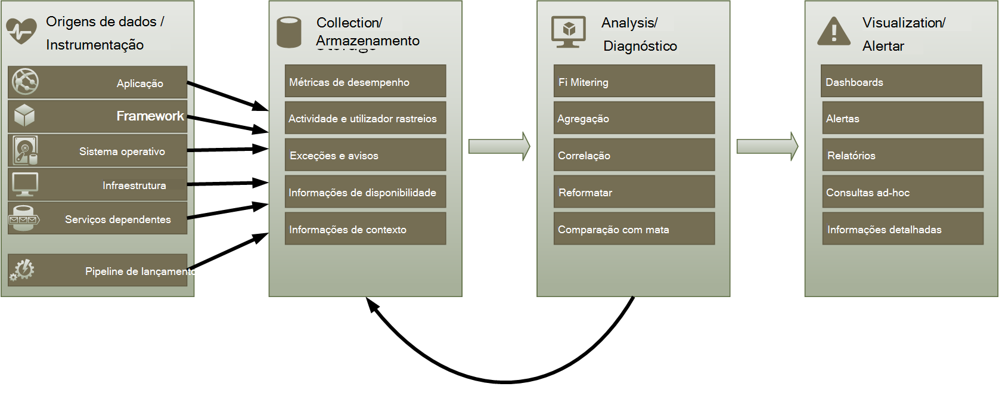
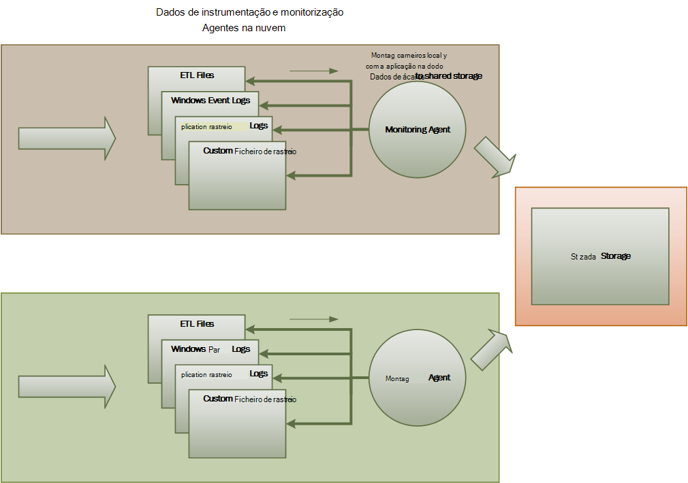
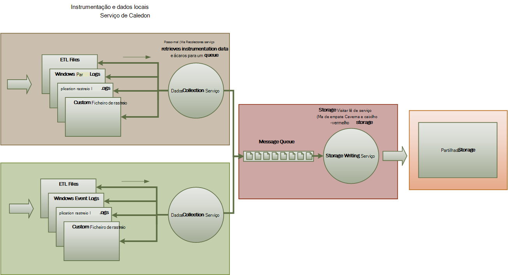
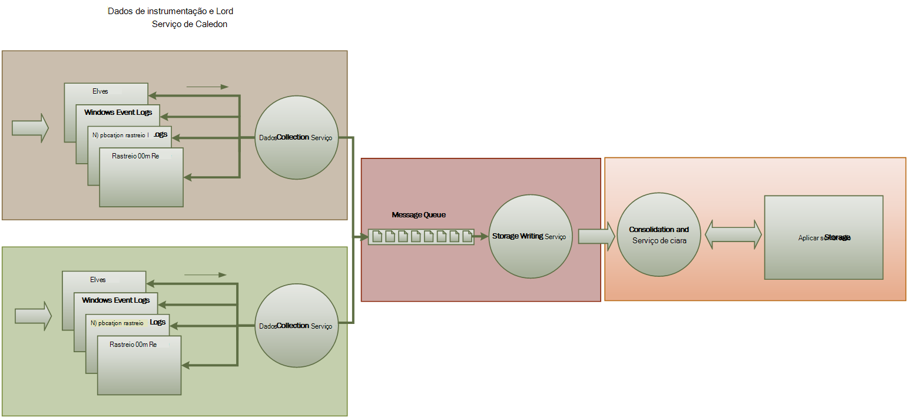

<properties
   pageTitle="Orientação de monitorização e diagnóstico | Microsoft Azure"
   description="Práticas recomendadas para monitorizar aplicações distribuídas na nuvem."
   services=""
   documentationCenter="na"
   authors="dragon119"
   manager="christb"
   editor=""
   tags=""/>

<tags
   ms.service="best-practice"
   ms.devlang="na"
   ms.topic="article"
   ms.tgt_pltfrm="na"
   ms.workload="na"
   ms.date="07/13/2016"
   ms.author="masashin"/>

# <a name="monitoring-and-diagnostics-guidance"></a>Monitorização e diagnósticos de orientação

[AZURE.INCLUDE [pnp-header](../includes/guidance-pnp-header-include.md)]

## <a name="overview"></a>Descrição geral
Distribuído aplicações e serviços em execução na nuvem são, por sua natureza, complexas partes de software que compõem muitas partes mover. Num ambiente de produção, é importante conseguir controlar a forma na qual os utilizadores utilizam o sistema, a utilização de recursos do rastreio e geralmente monitorizar o estado de funcionamento e o desempenho do seu sistema. Pode utilizar estas informações como uma ajuda de diagnóstico para detetar e corrigir problemas e também para ajudar o local certo potenciais problemas e impedir que ocorra.

## <a name="monitoring-and-diagnostics-scenarios"></a>Cenários de monitorização e diagnóstico
Pode utilizar a monitorização para obter uma visão bem como um sistema está a funcionar. Monitorizar é uma parte fundamental de manutenção de alvos de qualidade do serviço. Cenários comuns de recolha de dados de monitorização incluem:

- Certificar-se de que o sistema permanece saudável.
- A disponibilidade do sistema e os respetivos elementos componente de controlo.
- Manutenção de desempenho para se certificar de que o débito do sistema não diminui inesperadamente como o volume de aumentos de trabalho.
- Garantir que o sistema cumpre qualquer acordos do nível de serviço (SLA) estabelecidos com os clientes.
- Proteger a privacidade e segurança do sistema, os utilizadores e os respetivos dados.
- Monitorizar as operações que são efetuadas para fins de auditoria ou de regulamentação.
- Monitorizar a utilização do sistema e informações tendências podem levar a problemas de está a se não forem resolvidas no dia a dia.
- Monitorizar problemas que ocorrem, a partir de relatório inicial através de para análise das causas possíveis, correcção, atualizações de software consecutivas e implementação.
- Rastreio operações e depuração edições de software.

> [AZURE.NOTE] Esta lista não se destina a ser abrangentes. Este documento foca-se nestes cenários como as situações mais comuns para efetuar a monitorização. Poderá haver outras pessoas que são comuns menor ou são específicos do seu ambiente.

As seguintes secções descrevem estes cenários mais detalhadamente. As informações para cada cenário são abordadas no seguinte formato:

1. Uma breve descrição geral do cenário
2. Os requisitos típicos deste cenário
3. Os dados não processados instrumentação necessário para suportar o cenário e possíveis fontes destas informações
4. Como estes dados não processados podem ser analisados e combinados para gerar significativas informações de diagnóstico

## <a name="health-monitoring"></a>Estado de funcionamento de monitorização
Um sistema está em bom estado se for capaz de processamento de pedidos e em execução. É o objetivo do Estado de funcionamento de monitorização gerar um instantâneo do Estado de funcionamento atual do sistema para que possa verificar todos os componentes do sistema estão a funcionar como esperado.

### <a name="requirements-for-health-monitoring"></a>Requisitos de monitorização do Estado de funcionamento
Um operador deve ser alertado rapidamente (dentro de uma questão de segundos) se qualquer parte do sistema é considerada danificado. O operador deverá conseguir determinar quais as partes do sistema estão a funcionar normalmente e quais as partes estiver a ter problemas. Estado de funcionamento do sistema pode ser realçado através de um sistema de tráfego light:

- Vermelho para danificado (o sistema deixou de)
- Amarelo para parcialmente Saudável (o sistema estiver em execução com a funcionalidade reduzida)
- Verde para completamente Saudável

Um sistema de monitorização do Estado de funcionamento abrangente permite um operador desagregar através do sistema para ver o estado de funcionamento de subsistemas e componentes. Por exemplo, se o sistema global é representado como parcialmente saudável, o operador deverá conseguir ampliar e determinar qual funcionalidade não está disponível neste momento.

### <a name="data-sources-instrumentation-and-data-collection-requirements"></a>Origens de dados, instrumentação e requisitos de recolha de dados
Os dados não processados necessário para suportar a monitorização de estado de funcionamento podem ser gerados como consequência da:

- Rastreio execução dos pedidos de utilizador. Estas informações podem ser utilizadas para determinar quais os pedidos tem foi concluída com êxito, que ter ocorrido uma falha e quanto tempo demora de cada pedido.
- Utilizador síntese monitorização. Este processo simula os passos realizados por um utilizador e uma série predefinida de passos a seguir. Deverão ser capturados os resultados de cada passo.
- Registo de exceções, falhas e avisos. Esta informação pode ser capturada estatístico como resultado da declarações de rastreio incorporado para o código da aplicação, bem como obter informações a partir de registos dos eventos dos serviços que o sistema de referências.
- Monitorizar o estado de funcionamento de quaisquer serviços de terceiros que utiliza o sistema. Esta monitorização poderá implicar a obter e analisar dados de estado de funcionamento que estes serviços fornecem. Esta informação poderá demorar vários formatos.
- Monitorização de ponto final. Este mecanismo é descrito detalhadamente mais na secção "Monitorização de disponibilidade".
- Recolher informações de desempenho ambientes, tal como a utilização da CPU do fundo ou atividade e/s (incluindo rede).

### <a name="analyzing-health-data"></a>Analisar dados de estado de funcionamento
É o foco principal do Estado de funcionamento de monitorização indicar rapidamente se está a executar o sistema. Quente análise dos dados de imediatos pode acionar um alerta, se um componente crítico é detetado como danificado. (-Falha responder a uma série consecutiva de pings, por exemplo). O operador, em seguida, pode tomar a ação lentes adequada.

Um sistema mais avançado pode incluir um elemento de aspeto do Office que executa uma análise fria através das cargas de trabalho recentes e atuais. Uma análise fria pode identificar tendências e determinar se o sistema é provável que permaneçam em bom estado ou se o sistema irá precisar de recursos adicionais. Este elemento aspeto do Office deve basear métricas de desempenho críticos, tais como:

- A taxa de pedidos de direccionada cada serviço ou subsystem.
- Pedidos dos tempos de resposta dos seguintes procedimentos.
- O volume de dados a fluir para e terminar cada serviço.

Se o valor de quaisquer métrica exceder um limite definido, o sistema pode aumentar um alerta para ativar um operador ou autoscaling (se disponível) para ações a prevenção necessárias para manter o estado de funcionamento do sistema. Estas ações poderão implicar a adição de recursos, reiniciar um ou mais serviços que estão a falhar ou aplicar a limitação para pedidos de prioridade mais baixa.

## <a name="availability-monitoring"></a>Disponibilidade de monitorização
Um sistema verdadeiramente Saudável requer que estão disponíveis os componentes e subsistemas que compõem o sistema. Disponibilidade de monitorização está intimamente relacionado com a monitorização de estado de funcionamento. Mas Considerando que o estado de funcionamento de monitorização fornece uma vista imediata de estado de funcionamento atual do sistema, monitorização de disponibilidade está em causa com a disponibilidade do sistema e respectivos componentes para gerar estatísticas sobre o tempo de utilização do sistema de controlo.

Em muitos sistemas, alguns componentes (tal como uma base de dados) estão configurados com redundância incorporada para permitir rápida activação pós-falha em caso de falha grave ou perda de conectividade. Idealmente, os utilizadores não devem ter em mente de que ocorreu uma falha na. Mas a partir de uma disponibilidade monitorização perspetiva, é necessário recolher como as informações pessoais possível essas falhas para determinar a causa e efetuar ações lentes para impedir que periódico.

Os dados que é necessário para controlar disponibilidade poderão dependem de um número de níveis inferiores fatores. Muitos dos seguintes fatores poderão ser específicos para a aplicação, o sistema e o ambiente. Um sistema de monitorização eficaz para capturar os dados de disponibilidade que corresponde ao seguintes fatores feixe e, em seguida, agrega-los para dar uma imagem geral do sistema. Por exemplo, num sistema de comércio electrónico, a funcionalidade de empresas que torna um cliente colocar encomendas poderá dependem do repositório onde estão armazenados os detalhes da encomenda e o sistema de pagamento que trata as transações monetárias para paga por estas encomendas. A disponibilidade da peça de ordem posicionamento do sistema, por isso, é uma função da disponibilidade do repositório e o subsystem de pagamento.

### <a name="requirements-for-availability-monitoring"></a>Requisitos de monitorização de disponibilidade
Um operador também deverá conseguir ver a disponibilidade de histórica de cada sistema e subsystem e utilizar estas informações para qualquer tendências que poderá fazer com que um ou mais subsistemas periodicamente falha. (Serviços começar a falhar num momento específico do dia que corresponde às horas de expediente processamento?)

Deve fornecer uma solução de controlo numa vista de imediata e histórica da disponibilidade ou indisponibilidade de cada subsystem. Também deve ser capaz de rapidamente um operador de alerta quando um ou mais dos serviços de falhas ou quando os utilizadores não é possível ligar aos serviços. Esta é uma questão de não só a monitorização de cada serviço, mas também examinar as ações que cada utilizador efetua se estas ações falharem quando tentarem comunicar com um serviço. Até certo ponto, um grau de falha de conectividade é normal e pode estar relacionado breves erros. Mas poderá ser útil para permitir que o sistema subir um alerta para o número de insucessos de conectividade a um subsystem especificado que ocorrer durante um período específico.

### <a name="data-sources-instrumentation-and-data-collection-requirements"></a>Origens de dados, instrumentação e requisitos de recolha de dados
Tal como acontece com estado de funcionamento monitorização, os dados não processados necessário para suportar a monitorização de disponibilidade podem ser gerados estatístico como resultado da síntese utilizador monitorização e o registo quaisquer exceções, falhas e avisos que poderão ocorrer. Além disso, os dados de disponibilidade podem ser obtidos a partir de efetuar a monitorização de ponto final. A aplicação pode expor pontos finais de estado de funcionamento de uma ou mais, cada teste acesso a uma área funcional no interior do sistema. O sistema de monitorização pode executar o ping cada ponto final, seguindo uma agenda definida e recolher os resultados (sucesso ou falha).

Todos os tempos limite, falhas de conectividade de rede e tentativas de repetição de ligação devem ser registadas. Todos os dados devem ser com a hora.

<a name="analyzing-availability-data"></a>
### <a name="analyzing-availability-data"></a>Analisar dados de disponibilidade
Os dados de instrumentação devem ser agregados e associados para os seguintes tipos de análise de suporte:

- A disponibilidade de imediata do sistema e subsistemas.
- As taxas de falha de disponibilidade do sistema e subsistemas. Idealmente, um operador deverá conseguir falhas se ligam às actividades específicas: o que foi passa quando falha do sistema?
- Uma vista de histórica de taxas de falha do sistema ou qualquer subsistemas através de qualquer especificado período e a carga no sistema de (número de pedidos de utilizador, por exemplo) quando ocorreu uma falha.
- As razões para a indisponibilidade do sistema ou qualquer subsistemas. Por exemplo, os motivos poderão estar ligado serviço não está em execução, conectividade perdida, mas temporização saída e ligados mas devolver erros.

Pode calcular a disponibilidade de percentagem de um serviço ao longo de um período de tempo ao utilizar a seguinte fórmula:

```
%Availability =  ((Total Time – Total Downtime) / Total Time ) * 100
```

Isto é útil para fins de SLA. ([SLA monitorização](#SLA-monitoring) é descrito detalhadamente mais tarde estas orientações.) A definição de _tempo de inatividade_ depende do serviço. Por exemplo, Visual Studio equipa construir serviços define o tempo de inatividade como o período (total acumulados minutos) durante o qual construir serviço não está disponível. Um minuto é considerado indisponível se todos os contínuos HTTP pedidos de serviço construir para efetuar operações iniciados por cliente em todo o minuto resultam num código de erro ou não devolvem uma resposta.

## <a name="performance-monitoring"></a>Monitorização de desempenho
Como o sistema é efetuado em mais e mais limite (ao aumentar o volume de utilizadores), o tamanho dos conjuntos de dados que cresce estes acesso de utilizadores e a possibilidade de falha de componentes de uma ou mais torna-se mais prováveis. Frequentemente, uma falha de componente é precedida por uma diminuição no desempenho. Se não conseguir detetar diminuição, que pode tomar pro-activos passos para resolver a situação.

Desempenho do sistema depende de um número de fatores. Cada factor é normalmente medido através dos indicadores de chave de desempenho (KPIs), tal como o número de transações de base de dados por segundo ou o volume de pedidos de rede que são processados com êxito num período de tempo especificado. Alguns destes KPIs poderão estar disponível como medidas de desempenho específicos, Considerando que outras pessoas podem ser derivadas de uma combinação de métricas.

> [AZURE.NOTE] Para determinar a originar má ou bom desempenho requer que compreender o nível de desempenho no qual o sistema deve ser capaz de execução. Isto requer o sistema de observação, enquanto está a funcionar em caso de carga típico e capturar os dados para cada KPI durante um período de tempo. Isto poderá implicar a executar o sistema em caso de carga simulado num ambiente de teste e reunir dos dados adequados antes de implementar o sistema para ambiente de produção.

> Deverá também Certifique-se de que monitorização para fins de desempenho não se tornar uma sobrecarga no sistema. Poderá conseguir dinamicamente ajustar o nível de detalhe para os dados que reúne o processo de monitorização de desempenho.

### <a name="requirements-for-performance-monitoring"></a>Requisitos para monitorizar o desempenho
Para examinar o desempenho do sistema, um operador, normalmente, precisa de ver as informações que inclui:

- As taxas de resposta para pedidos de utilizador.
- O número de pedidos de utilizador em simultâneo.
- O volume de tráfego de rede.
- As taxas na qual empresas as transações são concluídas.
- Média tempo de processamento de pedidos.

Também pode ser útil fornecer ferramentas que permitem um operador para o ajudar a spot correlação, tais como:

- O número de utilizadores em simultâneo versus latência pedido horas (quanto tempo demora para iniciar um pedido de processamento depois do utilizador tem enviá-las).
- O número de utilizadores em simultâneo versus o tempo de resposta média (quanto tempo demora para concluir um pedido de depois de ter começado a processing).
- O volume de pedidos de versus o número de processamento de erros.

Juntamente com estas informações de alto nível funcionais, um operador deverá conseguir obter uma vista detalhada do desempenho para cada componente do sistema. Estes dados normalmente são fornecidos através de contadores de desempenho feixe que monitorizar informações tais como:

- Utilização de memória.
- Número de threads.
- Tempo de processamento de CPU.
- Pedir o comprimento da fila.
- Disco ou na rede taxas e/s e erros.
- Número de bytes escreveu ou ler.
- Indicadores de software intermédio, como o comprimento da fila.

Todas as visualizações deverão permitir que um operador especificar um período de tempo. Os dados apresentados poderão ser um instantâneo da situação actual e/ou uma vista histórica do desempenho.

Um operador deverá conseguir subir um alerta com base em qualquer medida de desempenho para qualquer valor especificado durante qualquer intervalo de tempo especificado.

### <a name="data-sources-instrumentation-and-data-collection-requirements"></a>Origens de dados, instrumentação e requisitos de recolha de dados
Para recolher dados de desempenho de alto nível (débito, número de utilizadores em simultâneo, número de operações de negócio, taxas de erro e assim sucessivamente) monitorizar o progresso de pedidos dos utilizadores à medida que chegam e passam através do sistema. Isso envolve incorporar declarações de rastreio na pontos-chave o código da aplicação, juntamente com informações de temporização. Todas as exceções, falhas e avisos devem ser capturados com dados suficientes para correlações-los com os pedidos que causado-los. O registo de serviços de informação Internet (IIS) é outra fonte úteis.

Se possível, também deve capturar dados de desempenho para qualquer sistemas externos que a aplicação utiliza. Estes sistemas externos poderão fornecer os seus próprios contadores de desempenho ou outras funcionalidades para solicitar dados de desempenho. Se não for possíveis, registos informações como a hora de início e hora de fim de cada pedido efetuada a um sistema externo, juntamente com o estado (com êxito, falha ou aviso) da operação de. Por exemplo, pode utilizar uma abordagem de cronómetro para pedidos de tempo: iniciar um temporizador quando inicia o pedido e, em seguida, parar o temporizador quando tiver terminado do pedido.

Dados de desempenho de baixo nível para os componentes individuais num sistema podem estar disponíveis através de funcionalidades e serviços como o contadores de desempenho do Windows e diagnósticos de Azure.

### <a name="analyzing-performance-data"></a>Analisar dados de desempenho
Muito do trabalho análise consiste em agregar dados de desempenho por tipo de pedido de utilizador e/ou o subsystem ou serviço para o qual cada pedido é enviado. Um exemplo de um pedido de utilizador está a adicionar um item a um carrinho de compras ou a efetuar o processo de dar saída num sistema de comércio electrónico.

Outro requisito comuns é resumir dados de desempenho no percentis selecionados. Por exemplo, um operador poderá determinar os tempos de resposta para 99 por cento de pedidos de, 95 por cento de pedidos e 70 por cento de pedidos de. Poderá haver destinos SLA ou outros objetivos definir para cada percentil. Os resultados em curso devem ser comunicados em tempo real próximo para o ajudar a detetar problemas de imediatos. Os resultados também devem ser agregados ao longo do tempo para fins estatísticos mais longo.

No caso de problemas de latência afetar o desempenho, um operador deverá conseguir identificar rapidamente a causa da congestionamento por examinar a latência da cada passo que efetua cada pedido. Os dados de desempenho, por isso, tem de fornecer um meio revogado medidas de desempenho para cada passo para associam-los a um pedido de específico.

Dependendo dos requisitos de visualização, poderá ser útil gerar e armazenar um cubo de dados que contém as vistas dos dados não processados. Este cubo de dados pode permitir consultas complexas de ad hoc e análise das informações de desempenho.

## <a name="security-monitoring"></a>Monitorização de segurança
Todos os sistemas comerciais que incluem dados sensíveis a maiúsculas e tem de implementar uma estrutura de segurança. A complexidade do dispositivo de segurança é normalmente uma função de sensibilidade dos dados. Num sistema que requer que os utilizadores ser autenticada, deverá de registo:

- Todas as início de sessão no tentativas, falha ou teve êxito.
- Todas as operações efetuadas por – e os detalhes de todos os recursos acedidas por – um utilizador autenticado.
- Quando um utilizador termina uma sessão e termina a sessão.

Monitorização poderá conseguir detetar ataques no sistema de ajuda. Por exemplo, um grande número de tentativas falhadas de início de sessão no pode indicar um força bruta ataque. Um picos inesperados nos pedidos poderão ser o resultado de ataque distribuído (DDoS) negação de serviço. Tem de estar preparado para monitorizar a todos os pedidos para todos os recursos, independentemente da origem destes pedidos. Um sistema de que tem uma início de sessão no vulnerabilidade acidentalmente poderá expor recursos para o mundo exterior sem necessidade de um utilizador realmente iniciar sessão.

### <a name="requirements-for-security-monitoring"></a>Requisitos para monitorização de segurança
Os aspetos mais importantes da monitorização de segurança devem ativar rapidamente um operador para:

- Detecte intrusos tentados por uma entidade não autenticada.
- Identifique tentativas pelas entidades para efetuar operações nos dados para as quais lhes não foi concedido acesso.
- Determine se o sistema ou alguma parte do sistema, é em ataque a partir do exterior ou no interior. (Por exemplo, um utilizador autenticado malicioso poderá estar a tentar trazer o sistema para baixo.)

Para suportar estes requisitos, deve ser notificado um operador:

- Se uma conta torna repetida tentativas de início de sessão no dentro de um período especificado.
- Se uma conta autenticada tentar, repetidamente, aceder a um recurso proibido durante um período especificado.
- Se um grande número de pedidos de não autenticados ou não autorizados ocorrer durante um período especificado.

As informações que são fornecidas para um operador devem incluir o endereço do anfitrião da origem de para cada pedido. Se regularmente surgirem violações de segurança a partir de um determinado intervalo de endereços, poderão ser bloqueados destes anfitriões.

Uma parte fundamental na manutenção de segurança de um sistema está a ser conseguir detetar rapidamente ações que desviar-se do habitual padrão de. Informações como o número de falhados e/ou bem sucedidos pedidos sessão podem ser apresentadas visualmente para ajudar a detectar se existe uma coletor numa atividade de uma vez invulgares. (Um exemplo desta actividade é utilizadores iniciar sessão em 3:00 AM e efetuar um grande número de operações quando inicia o seu dia de descanso na 9:00 AM). Estas informações também podem ser utilizadas para ajudar a configurar autoscaling baseados no tempo. Por exemplo, se um operador observa que um grande número de utilizadores regularmente início de sessão num momento específico do dia, o operador pode dispor iniciar os serviços de autenticação adicionais para processar o volume de trabalho e, em seguida, encerrar estes serviços adicionais quando o pico passou.

### <a name="data-sources-instrumentation-and-data-collection-requirements"></a>Origens de dados, instrumentação e requisitos de recolha de dados
A segurança é um aspecto que abrange todos de sistemas mais distribuídos. Os dados pertinentes serão provável que gerado em vários pontos de ao longo de um sistema. Deverá tomar em consideração aprovar uma abordagem de informações de segurança e gestão de evento (SIEM) para recolher as informações relacionadas com segurança que resulta da eventos criados pela aplicação, equipamento de rede, servidores, firewalls, o software antivírus e outros elementos de prevenção de intrusos.

Monitorização de segurança, pode incorporar dados a partir de ferramentas que não fazem parte da sua aplicação. Estas ferramentas podem incluir utilitários que identificam as atividades de pesquisa de portas ao governamentais: externos ou filtros de rede que detectam tentativas para aceder à sua aplicação e dados não autenticados.

Em todos os casos, os dados recolhidos tem de ativar um administrador determinar a natureza de qualquer ataque e tirar as contra-medidas adequadas.

### <a name="analyzing-security-data"></a>Analisar dados de segurança
Uma funcionalidade de monitorização de segurança é a variedade de origens a partir do qual os dados surge. O formatos diferentes e o nível de detalhe requerem complexa análise dos dados capturados para juntar-um tópico coerente das informações. Para além de forma mais simples de casos (por exemplo, detetar um grande número de início de sessão falhadas-ins ou tentativas para obter acesso não autorizado a recursos críticos), poderá não ser possível executar qualquer processamento automatizado complexo dos dados de segurança. Em vez disso, poderá ser preferível para escrever estes dados, tempo carimbo de data / mas contrário na sua forma original, para um repositório seguro para permitir a análise manual perito.

<a name="SLA-monitoring"></a>

## <a name="sla-monitoring"></a>Monitorização SLA
Muitos sistemas comerciais que suportam clientes pagamento certifique garantias sobre o desempenho do sistema sob a forma de SLA. Basicamente, SLA indicar que o sistema pode processar um volume definido de trabalho um período de tempo aprovada e sem perder informações críticas. Monitorização SLA diz respeito assegurar que o sistema pode reunir SLA determinada com uma precisão.

> [AZURE.NOTE] Monitorização SLA está intimamente relacionado com monitorização de desempenho. Mas, Considerando que a monitorização de desempenho refere-se aos assegurar que o sistema funções _ideal_, monitorização SLA é regida por uma obrigação contratual que define significa que _optimizada_ realmente.

SLA frequentemente é definidas em termos de:

- Disponibilidade geral do sistema. Por exemplo, uma organização poderá garante que o sistema estará disponível para 99,9 por cento do tempo. Isto equivale a mais do que 9 horas de tempo de inatividade por ano ou cerca de 10 minutos por semana.
- Débito operacional. Este aspecto é frequentemente expresso como um ou mais alto – água marcas, tal como a garantir que o sistema pode suporta até 100.000 pedidos de utilizador em simultâneo ou lidar 10.000 transações de negócio em simultâneo.
- Tempo de resposta operacional. O sistema também poderá fazer garantias da taxa à qual são processados os pedidos de. Um exemplo é que vai ser concluída dentro de 2 segundos 99 por cento todas as operações de negócio e, sem única transação irá demorar mais de 10 segundos.

> [AZURE.NOTE] Alguns contratos para sistemas de comerciais também podem incluir SLA ao suporte ao cliente. Um exemplo é que todos os pedidos de suporte técnico irão conferir uma resposta dentro de 5 minutos, e que 99% de todos os problemas será totalmente resolvidos dentro de 1 dia de descanso. Eficaz de [controlo de problemas](#issue-tracking) (descritas posteriormente nesta secção) é fundamental para SLA da reunião, como estes.

### <a name="requirements-for-sla-monitoring"></a>Requisitos de monitorização SLA
Ao nível mais alto, um operador deverá conseguir determinar rapidamente se o sistema é reunião a SLA aprovadas ou não. E se não, o operador deverá poder agregar para baixo e examinar os fatores para determinar as razões para obter um desempenho segunda subjacentes.

Indicadores de alto nível típicos que podem ser representados visualmente incluem:

- A percentagem de tempo de utilização do serviço.
- O débito de aplicação (medido em termos de transações efetuada com êxito e/ou operações por segundo).
- O número de pedidos de aplicação em efetuada com êxito/falha.
- O número de erros de aplicações e de sistema, exceções e avisos.

Todos os destes indicadores de devem ser capazes de que está a ser filtrada por um período de tempo especificado.

Uma aplicação de nuvem provavelmente irá incluir um número de subsistemas e componentes. Um operador deverá conseguir selecionar um indicador de alto nível e ver como é composto a partir do Estado de funcionamento dos elementos subjacentes. Por exemplo, se o tempo de utilização do sistema global de se situar abaixo de um valor aceitável, um operador deverá conseguir ampliar e determinar quais os elementos são que contribuem para esta falha.

> [AZURE.NOTE] Tempo de funcionamento do sistema tem de ser definidas cuidadosamente. Num sistema que utiliza redundância para garantir a disponibilidade máxima, poderão falhar ocorrências individuais de elementos, mas o sistema pode permanecem funcional. Tempo de funcionamento do sistema tal como foi apresentado através da monitorização de estado de funcionamento deverá indicar o tempo de utilização de agregação de cada elemento e não necessariamente se o sistema realmente parou. Para além disso, falhas poderá isoladas. Por isso, mesmo se um sistema não estiver disponível, o resto do sistema poderá permanecem disponível, embora com a funcionalidade diminuída. (Num sistema de comércio electrónico, uma falha de sistema pode impedir que um cliente colocar encomendas, mas o cliente ainda poderá ser possível procurar o catálogo de produtos.)

Para alertar efeitos, o sistema deverá conseguir subir um evento se qualquer um dos indicadores de alto nível exceder um determinado limiar especificado. Os detalhes de níveis inferiores dos vários fatores que compõem o indicador de alto nível deverão estar disponíveis como contextuais dados para o sistema de alerta.

### <a name="data-sources-instrumentation-and-data-collection-requirements"></a>Origens de dados, instrumentação e requisitos de recolha de dados
Os dados não processados necessário para suportar a monitorização de SLA são semelhantes aos dados não processados necessário para a monitorização de desempenho, juntamente com alguns aspetos de saúde e disponibilidade de monitorização. (Consulte essas secções para obter mais detalhes). Pode capturar estes dados ao:

- Efetuar análises de monitorização de ponto final.
- Registo de exceções, falhas e avisos.
- Rastreio a execução de pedidos de utilizador.
- A disponibilidade de quaisquer serviços de terceiros que utiliza o sistema de monitorização.
- Utilizar métricas de desempenho e contadores.

Todos os dados tem de ser temporizados e com a hora.

### <a name="analyzing-sla-data"></a>Analisar dados de SLA
Os dados de instrumentação têm de ser agregados para gerar uma imagem do desempenho geral do sistema. Dados agregados também tem de suportar desagregações a ativar exame do desempenho dos subsistemas subjacentes. Por exemplo, deverá conseguir para:

- Calcular o número total de pedidos de utilizador durante um período especificado e determinar a taxa com e sem êxito destes pedidos.
- Combine os tempos de resposta de pedidos de utilizador para gerar uma visão geral dos tempos de resposta do sistema.
- Analise o progresso de pedidos de utilizador para divide o tempo de resposta geral de um pedido para os tempos de resposta de itens de trabalho individuais contidas nesse pedido.  
- Determine a disponibilidade geral do sistema, como uma percentagem do tempo de utilização para qualquer período específico.
- Analise a disponibilidade de tempo de percentagem dos componentes individuais e serviços do sistema. Isto poderá envolver análise registos que tenham gerados serviços de terceiros.

Muitos sistemas comerciais são necessários para comunicar ilustrações de desempenho real contra SLA aprovada por um período especificado, normalmente num mês. Estas informações podem ser utilizadas para calcular créditos ou outras formas de reembolsos para os clientes se o SLA não forem preenchidas durante o período. Pode calcular disponibilidade para um serviço utilizando a técnica descrita na secção [Analisar dados de disponibilidade](#analyzing-availability-data).

Para fins internos, uma organização também poderá controlar a número natureza e dos incidentes causados serviços a falha. Aprender como resolver estes problemas rapidamente ou eliminá-los completamente, irá ajudá para reduzir o tempo de inatividade e reunir SLA.

## <a name="auditing"></a>Auditoria
Dependendo da natureza da aplicação, poderá haver legais ou outros regulamentos legais que especificam requisitos para auditoria operações dos utilizadores e acesso a todos os dados de gravação. Auditoria pode fornecer provas que os clientes de ligações para pedidos específicos. Não repudiação é um factor importante em muitos sistemas de negócio e para ajudar a manter fidedignidade de estar entre um cliente e a organização que é o responsável pela aplicação ou serviço.

### <a name="requirements-for-auditing"></a>Requisitos para auditoria
Um analista tem de ser capaz de rastrear a sequência de operações de empresas que os utilizadores estão a executar para que pode reconstruir ações dos utilizadores. Poderá ser necessário simplesmente como uma questão de registo, ou como parte de um inquérito forenses.

Informações de auditoria são altamente sensíveis. Provavelmente incluirá dados que identifica os utilizadores do sistema, juntamente com as tarefas que está a executar. Por este motivo, informações de auditoria provavelmente serão assumir a forma de relatórios que só estão disponíveis para os analistas fidedignos em vez de como um sistema interativo que suporta desagregação de operações de gráficas. Um analista deverá conseguir gerar um intervalo de relatórios. Por exemplo, relatórios poderão lista Atividades de todos os utilizadores a ocorrer durante um período de tempo especificado, cronologia da atividade de um único utilizador de detalhe ou a sequência de operações efetuadas relativamente a um ou mais recursos da lista.

### <a name="data-sources-instrumentation-and-data-collection-requirements"></a>Origens de dados, instrumentação e requisitos de recolha de dados
Podem incluir as fontes principais de informação para auditoria:

- O sistema de segurança que gere a autenticação de utilizador.
- Rastrear registos gravar actividade do utilizador.
- Registos de segurança que controlar todos os pedidos de rede identificáveis e não identificável.

O formato dos dados de registo de auditoria e a forma na qual está armazenado poderá ser condicionado por requisitos de regulamentação. Por exemplo, poderá não ser possível limpar os dados de qualquer forma. (-Deve ser registada no seu formato original.) Acesso ao repositório onde é mantida deve ser protegido para prevenir a adulteração de.

### <a name="analyzing-audit-data"></a>Analisar dados de registo de auditoria
Um analista tem de conseguir aceder aos dados não processados na sua totalidade, na sua forma original. Para além do requisito de registo para gerar relatórios de auditoria comuns, serão provável que ser especializados e mantidas externos ao sistema as ferramentas para analisar estes dados.

## <a name="usage-monitoring"></a>A utilização de monitorização
A utilização de monitorização controla como são utilizadas as funcionalidades e componentes de uma aplicação. Um operador pode utilizar os dados recolhidos para:

- Determine quais as funcionalidades são utilizadas e determinam quaisquer potenciais pontos de activos do sistema. Elementos de tráfego de alta podem beneficiar com a partições funcional ou até mesmo replicação para distribuir a carga tarefas mais uniformemente. Um operador também pode utilizar estas informações para determinar quais as funcionalidades são utilizadas com pouca frequência e são candidatos possíveis para extinção ou substituição numa versão futura do sistema.
- Obter informações sobre os eventos de funcionamento do sistema em utilização normal. Por exemplo, um site de comércio electrónico, pode gravar as informações estatísticas sobre o número de transações e o volume de clientes que são responsáveis por-los. Estas informações podem ser utilizadas para planeamento da capacidade à medida que aumenta o número de clientes.
- Deteta (possivelmente indiretamente) a satisfação do utilizador com o desempenho ou a funcionalidade do sistema. Por exemplo, se um grande número de clientes num sistema de comércio electrónico regularmente abandonar os respetivos carrinhos de compras, este poderá devido a um problema com a funcionalidade de dar saída.
- Gera as informações de faturação. Uma aplicação comercial ou serviço multi-inquilino possam cobrar clientes para os recursos que utilizam.
- Impor quotas. Se um utilizador no sistema de multi-inquilino exceder quota paga de processamento a utilização de hora ou recurso durante um período especificado, o seu acesso pode estar limitado ou pode estar limitado processamento.

### <a name="requirements-for-usage-monitoring"></a>Requisitos para a utilização de monitorização
Para examinar a utilização do sistema, um operador, normalmente, precisa de ver as informações que inclui:

- O número de pedidos que são processados pelo cada subsystem e direcionado para cada recurso.
- O trabalho que cada utilizador está a executar.
- O volume de armazenamento de dados que ocupa a cada utilizador.
- Os recursos que está a aceder a cada utilizador.

Um operador também deverá conseguir gerar gráficos. Por exemplo, um gráfico poderá apresentar os utilizadores mais recurso experimentado ou com maior frequência, pode ser consultada recursos ou funcionalidades do sistema.

### <a name="data-sources-instrumentation-and-data-collection-requirements"></a>Origens de dados, instrumentação e requisitos de recolha de dados
A utilização de rastreio pode ser efetuada a um nível relativamente elevado. -Pode anotar as horas de início e de fim de cada pedido e a natureza do pedido (ler, escrever e assim sucessivamente, dependendo do recurso em questão). Pode obter estas informações por:

- Rastreio actividade do utilizador.
- Capturar contadores de desempenho que medem a utilização para cada recurso.
- Monitorizar o consumo de recursos por cada utilizador.

Para fins de medição, também tem de conseguir identificar os utilizadores que são responsáveis para efetuar quais as operações e os recursos que utilizam funcionalidades estas operações. As informações recolhidas devem ser detalhadas suficiente para lhe permitir precisa de faturação.

<a name="issue-tracking"></a>
## <a name="issue-tracking"></a>Controlo de problemas
Clientes e outros utilizadores podem comunicar problemas eventos inesperados ou o comportamento ocorre no sistema. Controlo de problemas estão interessado com gerir a estas questões, associando-os com os esforços para resolver quaisquer problemas subjacentes no sistema e informar os clientes de resoluções possíveis.

### <a name="requirements-for-issue-tracking"></a>Requisitos para o controlo de problemas
Operadores executam frequentemente controlo utilizando um sistema separado que permite que o-los do registo e do relatório de detalhes dos problemas de problemas que os utilizadores relatam. Estes detalhes podem incluir as tarefas que o utilizador estava a tentar executar, os sintomas mais do problema, a sequência de eventos e qualquer erro ou mensagens de aviso que foram emitidas.

### <a name="data-sources-instrumentation-and-data-collection-requirements"></a>Origens de dados, instrumentação e requisitos de recolha de dados
Origem de dados inicial de dados de controlo de problemas é o utilizador quem comunicado o problema em primeiro lugar. O utilizador poderá ser possível fornecer dados adicionais tais como:

- Informação de falha (se a aplicação de incluir um componente de que é executada no ambiente de trabalho do utilizador).
- Um instantâneo do ecrã.
- A data e hora quando ocorreu o erro, juntamente com quaisquer outras informações ambientais tal como a localização do utilizador.

Estas informações podem ser utilizadas para ajudar o esforço depuração e ajudar a construir um acumulado para versões futuras do software.

### <a name="analyzing-issue-tracking-data"></a>Analisar dados de controlo de problemas
Diferentes utilizadores podem comunicar o mesmo problema. O sistema de controlo de problemas deve associar relatórios comuns.

O progresso do esforço de depuração deve ser registado contra cada relatório de problema. Quando o problema for resolvido, o cliente pode ser informado sobre a solução.

Se um utilizador comunicar problemas que tem uma solução conhecida no sistema de controlo de problemas, o operador poderá informar imediatamente o utilizador a solução.

## <a name="tracing-operations-and-debugging-software-releases"></a>Rastreio operações e depuração edições de software
Quando um utilizador comunica um problema, o utilizador só é frequentemente em atenção o impacto imediato que este tenha as operações. O utilizador pode apenas comunicar os resultados da sua própria experiência voltar a um operador que é responsável pela manutenção do sistema. Estes experiências são geralmente apenas um sintoma visível de uma ou mais problemas fundamentais. Em muitos casos, um analista será necessário aprofundar através de cronologia das operações subjacentes para estabelecer a causa de raiz do problema. Este processo é denominado _análise de causa de raiz_.

> [AZURE.NOTE] Análise de causa raiz poderá revelar ineficiências na estrutura de uma aplicação. Nas seguintes situações, poderá ser possível Reformule as os elementos afetados e implementá-los como parte de uma versão posterior. Este processo requer controlo cuidado e os componentes actualizados monitorizarem atentamente.

### <a name="requirements-for-tracing-and-debugging"></a>Requisitos para o rastreio e depuração
Para controlar eventos inesperados e outros problemas, é crucial que os dados de monitorização fornecem informações suficientes para ativar um analista para rastreio novamente para as origens destes problemas e reconstruir a sequência de eventos que ocorreram. Esta informação deve ser suficiente para ativar um analista diagnosticar a causa de raiz de quaisquer problemas. Um programador pode, em seguida, faça as modificações necessárias para impedir que periódico.

### <a name="data-sources-instrumentation-and-data-collection-requirements"></a>Origens de dados, instrumentação e requisitos de recolha de dados
Resolução de problemas, pode envolver rastreio todos os métodos (e os respetivos parâmetros) chamados como parte de uma operação de criar o uma árvore de que ilustra o fluxo lógico através do sistema quando um cliente faz com que um pedido específico. Exceções e avisos de que o sistema gera estatístico como resultado deste fluxo têm de ser capturado e tem sessão iniciada.

Para suportar a depuração, o sistema pode fornecer hooks que permitem um operador capturar informações de estado em pontos cruciais no sistema. Em alternativa, o sistema pode fornecer informações detalhadas passo a passo como progresso operações selecionado. Dados captura a este nível de detalhe podem impor uma carga adicional no sistema e devem ser um processo temporário. Um operador utiliza este processo, sobretudo quando uma série de eventos muito invulgar ocorre e é difícil criar uma réplica ou quando necessita de uma nova versão de um ou mais elementos num sistema de monitorização cuidado para se certificar de que a função de elementos como esperado.

## <a name="the-monitoring-and-diagnostics-pipeline"></a>A monitorização e diagnósticos de tubagem
Monitorização de um sistema distribuído em grande escala coloca um desafio significativo. Cada um dos cenários descritos na secção anterior deve não seja necessariamente considerada isoladamente. É provável que haja ser uma sobreposição significativa nos dados diagnóstico e monitorização necessário para cada situação, embora estes dados poderão ter de ser processadas e apresentados de formas diferentes. Por estas razões, deverá tomar uma vista holística de monitorização e diagnósticos de.

Pode encarar o processo de diagnóstico e monitorização inteira como uma tubagem que inclui as fases apresentadas na figura 1.



_Figura 1. As fases no pipeline de monitorização e diagnósticos de_

Figura 1 realça como os dados de monitorização e diagnósticos de podem ter uma variedade de origens de dados. As fases de recolha e instrumentação estão preocupadas com identificar as origens de onde os dados precisarem de ser capturado para determinar quais os dados para capturar, como capturá-la e como formatar estes dados para que pode ser analisada facilmente. A fase de análise/diagnóstico assume os dados não processados e utiliza-o para gerar informações importantes que pode utilizar um operador para determinar o estado do sistema. O operador pode utilizar estas informações para tomar decisões sobre ações possíveis para tirar e, em seguida, feed os resultados novamente nas fases de recolha e instrumentação. A fase de fase única visualização/alertar apresenta uma vista consumíveis do Estado do sistema. Pode apresentar informações em tempo real próximo utilizando uma série de dashboards. E pode gerar relatórios, gráficos e gráficos para fornecer uma vista histórica dos dados que podem ajudar a identificar tendências a longo prazo. Se a informação indica que um KPI é provável que excedam os limites aceitáveis, nesta fase também pode accionar um alerta para um operador. Em alguns casos, um alerta também pode ser utilizado para acionar um processo automatizado que tenta efetuar ações lentes, como autoscaling.

Tenha em atenção que estes passos constituem um processo contínuo fluxo onde as fases são passa em paralelo. Idealmente, todas as fases devem ser dinamicamente configuráveis. Em alguns pontos, especialmente quando um sistema foi recentemente implementado ou está a ter problemas, poderá ser necessário recolher dados expandidos numa base mais frequente. Alturas, deve ser possível reverter para capturar um nível de base de informações essenciais para confirmar que o sistema está a funcionar corretamente.

Para além disso, todo o processo de monitorização deve ser considerado uma solução direto e em curso que está sujeito a ajuste e melhoramentos como resultado de comentários. Por exemplo, pode começar com vários fatores para determinar o estado de funcionamento do sistema de medida. Análise ao longo do tempo pode conduzir a um refinamento como rejeitar medidas que não estão relevantes, permitindo-lhe com mais precisão concentrar-se nos dados que precisa de enquanto minimizar o ruído de fundo.

## <a name="sources-of-monitoring-and-diagnostic-data"></a>Origens de dados de monitorização e de diagnóstico
As informações que utiliza o processo de monitorização podem ter várias origens, conforme ilustrado na figura 1. Ao nível da aplicação, informações provêm de registos de rastreio incorporados o código do sistema. Os programadores devem seguir uma abordagem padrão para controlar o fluxo de controlo através do respectivo código. Por exemplo, uma entrada a um método pode emitir uma mensagem de rastreio que especifica o nome do método, a hora atual, o valor de cada parâmetro e outras informações pertinentes. Gravar os tempos de entrada e saída também pode provar úteis.

Deve registar todas as exceções e avisos e certifique-se de que mantêm um rastreio completo de quaisquer exceções aninhadas e avisos. Idealmente, também deve capturar informações que identifica o utilizador que está a executar o código, juntamente com informações de correlação actividade (para controlar os pedidos de tal como estes passam através do sistema). E deve iniciar sessão tentativas de acesso a todos os recursos como filas de mensagens, bases de dados, ficheiros e outros serviços dependentes. Esta informação pode ser utilizada para medição e efeitos de auditoria.

Efectuam muitas aplicações de utilização das bibliotecas e quadros para executar tarefas comuns, como aceder a um arquivo de dados ou comunicar através de uma rede. Estes quadros poderá configuráveis para fornecer os seus próprios mensagens de rastreio e informações de diagnóstico observou, tais como taxas da transação e sucessos de transmissão de dados e falhas.

> [AZURE.NOTE] Quadros modernos muitos automaticamente publicar eventos de desempenho e rastreio. Capturar esta informação é simplesmente uma questão de fornecer um meio para obter e armazená-lo onde pode ser processada e analisada.

O sistema operativo onde a aplicação está em execução, pode ser uma origem de feixe informações de todo o sistema, como contadores de desempenho que indicam taxas e/s, a utilização de memória e a utilização da CPU. Também poderão ser comunicados erros do sistema operativo (tal como a falha para abrir um ficheiro corretamente).

Também deve considerar os componentes no qual o seu sistema é executado e infraestrutura subjacente. Serviços de armazenamento, redes virtuais e máquinas virtuais podem ser fontes de contadores de desempenho de nível de infraestrutura importantes e outros dados de diagnóstico.

Se a sua aplicação utiliza outros serviços externos, como um servidor web ou um sistema de gestão de base de dados, estes serviços poderão publicar os seus próprios informações de rastreio, registos de início e contadores de desempenho. Alguns exemplos incluem vistas dinâmicas de gestão do SQL Server para controlar operações realizadas relativamente a uma base de dados do SQL Server e os registos de rastreio IIS para a gravação de pedidos de efetuadas a um servidor web.

Como são modificados os componentes de um sistema e novas versões são implementadas, é importante conseguir problemas de atributo, eventos e métricas para cada versão. Esta informação deve ser associada voltar a pipeline de lançamento para que podem ser registados rapidamente e corrigidos problemas com uma versão específica de um componente.

Problemas de segurança podem ocorrer em qualquer ponto do sistema. Por exemplo, um utilizador pode tentar iniciar sessão com um ID de utilizador inválido ou palavra-passe. Um utilizador autenticado poderá tentar obter acesso não autorizado a um recurso. Ou um utilizador poderá fornecer uma tecla inválida ou desatualizada para aceder a informações encriptadas. Informações relacionadas com segurança para pedidos de efetuada com êxito e falhar sempre devem ser registadas.

A secção [instrumentalizar uma aplicação](#instrumenting-an-application) contém mais informações sobre as informações que deverá capturar. Mas pode utilizar uma variedade de estratégias para recolher estas informações:

- **Aplicação/sistema de monitorização**. Esta estratégia utiliza origens internas dentro da aplicação, os quadros de aplicação, sistema operativo e infraestrutura. O código da aplicação pode gerar a sua própria monitorizar os dados em pontos dos durante o ciclo de vida de um pedido de cliente. A aplicação pode incluir declarações de rastreio que poderão ser activadas ou desactivadas conforme circunstâncias ditam seletivamente. Também poderá ser possível inserção diagnóstico dinamicamente utilizando um quadro diagnóstico. Estes quadros normalmente fornecem plug-ins que pode anexar a vários pontos de instrumentação no seu código e capturar dados de rastreio a estes pontos.

    Para além disso, o seu código e/ou a infraestrutura de subjacente poderá elevar eventos em pontos críticos. Monitorização agentes que estão configurados para ouvir para estes eventos pode gravar as informações de evento.

- **Monitorização do utilizador real**. Esta abordagem regista as interações entre um utilizador e a aplicação e observa o fluxo de cada pedidos e respostas. Estas informações podem ter um objetivo de duas dobrada: pode ser utilizada para a utilização de medição por cada utilizador e pode ser utilizada para determinar se os utilizadores estão a receber uma adequado a qualidade de serviço (por exemplo, tempos de resposta rápida, baixa latência e erros mínimos). Pode utilizar os dados capturados para identificar de áreas de interesse onde ocorrem falhas com mais frequência. Também pode utilizar os dados para identificar elementos onde o sistema mais lento, possivelmente devido a pontos na aplicação ou qualquer outra forma de congestionamento. Se implementar atentamente para esta abordagem, poderá ser possível reconstruir monetários dos utilizadores através da aplicação para depurar e efeitos de teste.

    > [AZURE.IMPORTANT] Deverá tomar em consideração os dados que são capturados através da monitorização reais utilizadores altamente sensíveis porque-pode incluir material confidencial. Se guardar os dados capturados, guarde-o em segurança. Se pretender utilizar os dados para um desempenho monitorização ou efeitos de depuração, pela primeira vez faixa todas as informações de identificação pessoal.

- O **utilizador síntese monitorização**. Nesta abordagem, pode escrever o próprio cliente de teste que simula um utilizador e executa uma série configurável mas típica de operações. Pode controlar o desempenho do cliente de teste para ajudar a determinar o estado do sistema. Também pode utilizar várias instâncias do cliente de teste do como parte de uma operação de testes de carga para estabelecer como o sistema responde em limite e o tipo de monitorização de saída é gerado sob as seguintes condições.

    > [AZURE.NOTE] Pode implementar o utilizador real e síntese monitorização incluindo código que controla e de vezes que a execução de chamadas de método e outras partes de uma aplicação críticas.

- **Criação de perfis**. Esta abordagem é principalmente direcionada para monitorizar e melhorar o desempenho da aplicação. Em vez de funcionamento no nível funcional da monitorização de utilizador real e síntese,-lo para capturar informações de níveis inferiores como funciona a aplicação. Pode implementar a criação de perfis utilizando amostragem periódica do Estado de execução de uma aplicação (para determinar qual porção de código que a aplicação estiver em execução num determinado ponto no tempo). Também pode utilizar instrumentação que insere sondas o código de junctures importantes (como o início e de fim de uma chamada de método) e registos foram invocar quais os métodos, em que altura, e demorou quanto tempo de cada chamada. Em seguida, pode analisar estes dados para determinar quais as partes da aplicação poderão causar problemas de desempenho.

- **Monitorização de ponto final**. Esta técnica utiliza um ou mais diagnóstico pontos finais de que a aplicação expõe especificamente para ativar a monitorização. Um ponto final fornece um caminho para o código da aplicação e pode devolver informações sobre o estado de funcionamento do sistema. Os pontos finais diferentes podem concentrar-nos vários aspetos da funcionalidade. Pode escrever o seu próprio cliente diagnósticos que envia pedidos periódicos para estes pontos finais e assimilar as respostas. Esta abordagem é descrita mais [Padrão de monitorização do Estado de funcionamento do ponto final](https://msdn.microsoft.com/library/dn589789.aspx) no Web site da Microsoft.

Cobertura máximo, deve utilizar uma combinação das seguintes técnicas.

<a name="instrumenting-an-application"></a>
## <a name="instrumenting-an-application"></a>Instrumentalizar uma aplicação
Instrumentação é uma parte fundamental do processo de monitorização. Pode tomar decisões com significado sobre o desempenho e o estado de funcionamento de um sistema de apenas se capturar pela primeira vez os dados que permite-lhe tomar estas decisões. As informações que recolher utilizando instrumentação devem ser suficientes para permitem-lhe avaliar o desempenho, diagnosticar problemas e tomar decisões sem que seja necessário iniciar sessão no servidor de produção remoto para executar o rastreio (e depuração) manualmente. Dados de instrumentação abrangem normalmente métricas e informações que escritos nos registos de rastreio.

Os conteúdos de um registo de rastreio podem ser o resultado de dados textuais escrito pela aplicação ou dados binários que são criados como resultado de um evento de rastreio (se a aplicação é utilizar evento rastreio para Windows – ETW). Também pode ser gerados a partir de registos do sistema registo de eventos decorrente do partes de infraestrutura, tal como um servidor web. Mensagens de registo de textual frequentemente foram concebidas para serem legível, mas também devem ser escritas num formato que permite a um sistema automatizado analisá-los facilmente.

Também deve categorizar os registos. Não escrever todos os dados de rastreio para um único registo, mas utilizar os registos em separado para gravar os resultados do rastreio a partir de diferentes aspectos operacionais do sistema. Em seguida, pode filtrar rapidamente mensagens do registo por ler a partir do registo de adequado em vez de ter que processar num único ficheiro comprido. Nunca escrita informação que possui requisitos de segurança diferente (como informações de auditoria e depuração de dados) para o mesmo registo.

> [AZURE.NOTE] Um registo pode ser implementado como um ficheiro no sistema de ficheiros ou poderá ser contido no outro formato, tal como um blob de armazenamento de Blobs. Informações de registo podem também ser contidas em armazenamento mais estruturado, tais como linhas numa tabela.

Métricas geralmente será uma medida ou contagem de alguns altura ou recurso no sistema num momento específico, com um ou mais etiquetas associadas ou dimensões (por vezes denominadas uma _amostra_). Normalmente, uma única ocorrência de uma métrica não é útil isoladamente. Em vez disso, métricas tem de ser capturado ao longo do tempo. O problema chave a ter em consideração for quais métricas deverá registar e frequência. Gerar dados para métricas demasiado com frequência pode impor uma carga adicional significativa no sistema, Considerando que captura métricas com pouca frequência podem fazer com que perder as circunstâncias esse conduzir a um evento significativo. Tenha em consideração a variará métrica os métrica. Por exemplo, a utilização da CPU num servidor pode variar significativamente a partir do segundo segundo, mas utilização elevada fica um problema apenas se for longa vida através de um número de minutos.

<a name="information-for-correlating-data"></a>
### <a name="information-for-correlating-data"></a>Informações para correlações de dados
Pode facilmente monitorizar contadores de individuais de nível do sistema de desempenho, métricas para recursos de capturar e obter informações de rastreio de aplicação a partir de vários ficheiros de registo. Mas algumas formas de monitorização exigem a fase de análise e diagnóstico no pipeline de monitorização para correlacionar os dados que são obtidos a partir de várias origens. Estes dados poderão demorar vários formulários nos dados não processados e o processo de análise tem de ser fornecido com dados de instrumentação suficientes para conseguir mapear destas diferentes formas. Por exemplo, ao nível do quadro da aplicação, uma tarefa pode ser identificada por um ID de tópico. Dentro de uma aplicação, o trabalho mesmo poderá associado com o ID de utilizador do utilizador que está a executar essa tarefa.

Além disso, existem é provável que dever-se um mapeamento de 1:1 entre threads e pedidos de utilizador, operações assíncronas poderão reutilizar mesmo threads para efetuar operações em nome de utilizador mais do que uma. Para complicar questões além disso, um único pedido poderá ser resolvido por mais do que um tópico como fluxos de execução através do sistema. Se possível, associe cada pedido com um ID de atividade exclusivo é propagado através do sistema, como parte do contexto do pedido. (Técnica para gerar e incluindo atividade IDs em informações de rastreio depende da tecnologia que é utilizada para capturar os dados do rastreio.)

Todos os dados de monitorização devem ser tempo carimbo de data / da mesma forma. Para consistência, registe todas as datas e horas utilizando a hora Universal Coordenada. Isto irá ajudá-lo mais facilmente sequências de rastreio de eventos.

> [AZURE.NOTE] Computadores que funcionem em fusos horários diferentes e as redes poderão não ser sincronizados. Não dependem utilizando carimbos de hora por si só para correlações dados instrumentação que abrange múltiplas máquinas.

### <a name="information-to-include-in-the-instrumentation-data"></a>Informações para incluir os dados de instrumentação
Quando estiver a decidir quais instrumentação os dados que precisa para recolher, tenha em consideração os seguintes pontos:

- Certifique-se de que informações capturadas por eventos de rastreio são máquina e humanos legível. Aprovar esquemas bem definidos para esta informação para facilitar a automatizado transformação de dados do registo através de sistemas e para fornecer consistência para operações e engenharia docentes os registos de leitura. Inclua informações ambientais, como o ambiente de implementação, o computador no qual o processo estiver em execução, os detalhes do processo e a pilha de chamadas.  
- Ative a criação de perfis apenas quando for necessário, porque-pode impor uma sobrecarga significativa no sistema. Criação de perfis utilizando instrumentação registos num evento (tal como uma chamada de método) sempre ocorrer, Considerando que apenas os registos de amostragem seleccionados eventos. A seleção pode ser baseados no tempo (uma vez por cada segundos *n* ), ou a frequência com base em (uma vez a cada *n* pedidos). Se eventos ocorrem muito frequentemente, perfis por instrumentação poderão causar demasiado um encargo e propriamente dito afetar o desempenho geral. Neste caso, a abordagem amostragem poderá ser preferível. No entanto, se a frequência de eventos for baixa, amostragem pode perder--los. Neste caso, instrumentação poderá ser melhor abordagem.
- Fornece contexto suficiente para ativar um programador ou administrador determinar a origem de cada pedido. Isto pode incluir alguma forma de ID de atividade que identifica uma instância específica de um pedido. -Lo também pode incluir informações que podem ser utilizadas para esta actividade se ligam às utilizaria trabalho executado e os recursos utilizados. Tenha em atenção que isto funcione poderá cruza limites do processos e máquinas. Para medição, deve também incluir o contexto (direta ou indiretamente através de outros associados informações) uma referência para o cliente quem causado o pedido para ser efetuadas. Neste contexto fornece informações importantes sobre o estado da aplicação no momento em que foram capturados os dados de monitorização.
- Registe todos os pedidos e a localizações ou a partir do qual são efectuados estes pedidos de regiões. Podem ajudar estas informações para determinar se existem pontos de activos qualquer localização específica. Esta informação também pode ser úteis para determinar se pretende criar a partições uma aplicação ou os dados que utiliza.
- Gravar e capturar os detalhes de exceções cuidadosamente. Muitas vezes, informações de depuração crítico serão perdidas estatístico como resultado da fraca exceções. Capture os detalhes na totalidade de exceções que inicia a aplicação, incluindo quaisquer exceções internas e outras informações de contexto. Inclua a pilha de chamadas se possível.
- Ser consistente dos dados de que os diferentes elementos da sua aplicação capturar, uma vez que este pode auxiliar analisar eventos e correlacioná-los com pedidos de utilizador. Considere utilizar um pacote de abrangente e configuráveis registo para recolher informações em vez de cálculo consoante a forma os programadores para adotar a mesma abordagem como implementar o diferentes partes do sistema. Recolha dados do contadores de chave de desempenho, tal como o volume de e/s a ser executada, de utilização da rede, número de pedidos, a utilização da memória e a utilização da CPU. Alguns serviços de infraestrutura poderão fornecer os seus próprios contadores de desempenho específicos, como o número de ligações para uma base de dados, a taxa no qual as transações estão a ser executadas e o número de transações que teve êxito ou falhar. Aplicações também poderão definir os seus próprios contadores de desempenho específicos.
- Inicie sessão todas as chamadas efetuadas para serviços externos, como sistemas de base de dados, serviços web ou outros serviços de nível do sistema que fazem parte de infraestrutura do. Registar informações sobre o tempo despendido para executar cada chamada e o sucesso ou o fracasso da chamada. Se possível, capture informações sobre todas as falhas para qualquer erros breves que ocorrem e tentativas de repetição.

### <a name="ensuring-compatibility-with-telemetry-systems"></a>Assegurar a compatibilidade com os sistemas de telemetria
Em muitos casos, as informações que produz instrumentação são geradas como uma série de eventos e transmitidas para um sistema de telemetria separada para processamento e análise. Um sistema de telemetria é normalmente independente de qualquer aplicação específica ou tecnologia, mas espera informações para seguir um formato específico que normalmente é definido por um esquema. Esquema de forma eficaz Especifica um contrato que define os campos de dados e tipos de que o sistema de telemetria pode ingerir esta última. O esquema deve ser generalized para permitir que para os dados que chegam a partir de um intervalo de plataformas e dispositivos.

Um esquema comum deve incluir os campos que são comuns a todos os eventos de instrumentação, tais como o nome do evento, a hora do evento, o endereço IP do remetente e os detalhes que são necessários para correlações com outros eventos (como um ID de utilizador, um ID de dispositivo e um ID da aplicação). Lembre-se de que qualquer número de dispositivos poderá elevar eventos, para que o esquema não deve variam consoante o tipo de dispositivo. Para além disso, vários dispositivos poderão elevar eventos para a mesma aplicação; a aplicação poderão suportar guardado no servidor ou qualquer outro formulário da distribuição em diferentes dispositivos.

Esquema de também pode incluir campos de domínio relevantes para um cenário em particular que é comum em diferentes aplicações. Isto pode ser informações sobre exceções, início da aplicação e eventos de fim e sucesso e/ou falha de chamadas de API do serviço web. Todas as aplicações que utilizam o mesmo conjunto de campos de domínio devem emitir o mesmo conjunto de eventos, permitindo-um conjunto de relatórios e análises para ser criado comuns.

Por fim, um esquema pode conter campos personalizados para capturar os detalhes de eventos específicos da aplicação.

### <a name="best-practices-for-instrumenting-applications"></a>Práticas recomendadas para instrumentalizar aplicações
A lista que se segue resume as práticas recomendadas para instrumentalizar uma aplicação distribuída executar na nuvem.

- Facilite a leitura e fácil de analisar registos. Utilizar estruturada registo sempre que possível. Ser conciso e descritivo em mensagens de registo.
- Em todos os registos, identificar a origem e fornecer contexto e informações de temporização, tal como escrito cada registo.
- Utilize o mesmo fuso horário e o formato para todos os carimbos de data / hora. Isto irá ajudar a correlacionar eventos para operações de que aparecem em hardware e services em execução no diferentes regiões geográficas.
- Categorizar registos e escrever mensagens para o ficheiro de registo adequado.
- Não divulgar informações importantes sobre o sistema ou informações pessoais acerca dos utilizadores. Apagar estas informações antes de tem sessão iniciada, mas certifique-se de que os detalhes pertinentes são mantidos. Por exemplo, remover ID e palavra-passe do quaisquer cadeias de ligação de base de dados, mas escrever as informações restantes no registo para que um analista pode determinar que o sistema está a aceder a base de dados correto. Iniciar sessão todas as exceções críticas, mas permitir que o administrador ativar e desativar o registo para níveis inferiores de exceções e avisos. Além disso, capturar e registar todas as informações de lógica de repetição. Estes dados podem ser úteis na monitorização o breves estado de funcionamento do sistema.
- Rastrear terminar processo chamadas, tais como os pedidos de serviços web externos ou bases de dados.
- Não misture mensagens de registo com os requisitos de segurança diferente no mesmo ficheiro de registo. Por exemplo, não depuração de escrita e informações para o mesmo registo de auditoria.
- À exceção dos eventos de auditoria, certifique-se de que todas as de registo de chamadas são operações fire-e-se esqueça de que não bloquear o progresso de operações de negócio. Os eventos de auditoria são excepcionais porque são críticas para o negócio e podem ser classificados como parte fundamental da operações de negócio.
- Certifique-se de que o registo é extensible e não tem qualquer dependências diretas num betão destino. Por exemplo, em vez de escrever informações utilizando _System.Diagnostics.Trace_, definir uma interface abstratos (como _ILogger_) que expõe métodos de registo e que pode ser implementada através de qualquer meio adequado.
- Certifique-se de que todos os registo é incluía e nunca accionadores erros em cascata. Registo não tem gerar quaisquer exceções.
- Trate instrumentação como um processo iterativo em curso e regularmente registos, não apenas quando existe um problema.

## <a name="collecting-and-storing-data"></a>Recolher e armazenar dados
A fase de coleções de sites do processo de monitorização está interessada com a obter as informações que gera instrumentação, estes dados para que seja mais fácil para a fase de análise/diagnóstico consumir e para guardar os dados transformados com logaritmos no armazenamento fiável a formatação. Os dados de instrumentação recolher a partir de diferentes partes de um sistema distribuído podem ser mantidos numa variedade de localizações e com formatos variados. Por exemplo, código da aplicação pode gerar ficheiros de registo de rastreio e gerar dados de registo de eventos de aplicação, Considerando que podem ser capturadas contagens de desempenho chaves aspetos infraestrutura do que a sua aplicação utiliza através de outras tecnologias. Qualquer componentes de terceiros e serviços do que a aplicação utilizar poderá fornecer informações instrumentação em formatos diferentes, utilizando os ficheiros de rastreio separada, blob armazenamento ou até mesmo um arquivo de dados personalizados.

Recolha de dados com frequência é executada através de um serviço de coleções de sites que pode ser executado autonomamente partir da aplicação que gera os dados de instrumentação. Figura 2 ilustra um exemplo desta arquitetura, realce o subsystem de recolha de dados instrumentação.


_Figura 2. Recolha de dados de instrumentação_

Tenha em atenção que se trata de uma vista simplificada. O serviço de coleções de sites não é necessariamente um único processo e poderá inclui muitas partes constituintes em execução em computadores diferentes, tal como descrito nas secções seguintes. Para além disso, se a análise de alguns dados de telemetria deve ser realizada rapidamente (quente análise, conforme descrito na secção [de suporte quente, análise, quente e fria](#supporting-hot-warm-and-cold-analysis) mais tarde neste documento), componentes locais que funcionam fora o serviço de coleções de sites podem executar as tarefas de análise imediatamente. Figura 2 ilustra esta situação para eventos selecionados. Depois de processamento analítico, os resultados podem ser enviados diretamente para a visualização e subsystem alerta. Dados está sujeita a análise quente ou fria são mantidos no armazenamento enquanto aguarda processamento.

Para Azure aplicações e serviços, diagnósticos do Azure fornece uma solução possível para capturar dados. Diagnósticos do Azure reúne dados a partir das seguintes origens para cada nó cluster, agrega-lo e, em seguida, os carregamentos pendentes ao armazenamento do Azure:

- Registos do IIS
- Ocorreu uma falha de pedidos do IIS registos
- Registos de eventos do Windows
- Contadores de desempenho
- Informações de estado da falha de sistema
- Registos de infraestrutura do Azure diagnóstico  
- Registos de erros personalizado
- Origemdoevento .NET
- ETW com base em manifesto

Para obter mais informações, consulte o artigo [Azure: Noções básicas de telemetria e resolução de problemas](http://social.technet.microsoft.com/wiki/contents/articles/18146.windows-azure-telemetry-basics-and-troubleshooting.aspx).

### <a name="strategies-for-collecting-instrumentation-data"></a>Estratégias para recolha de dados de instrumentação
Tendo em conta da natureza flexível da nuvem e para evitar a necessidade de manualmente a obtenção de dados de telemetria de todos os nós no sistema, deverá dispor para os dados serem transferidas para uma localização central e consolidados. Num sistema que abrange várias centros de dados, poderá ser útil recolher pela primeira vez, consolidar e armazenar dados numa base de região por região e, em seguida, agregar os dados regionais para um único sistema central.

Para otimizar a utilização da largura de banda, pode optar por transferir dados menos urgentes no blocos, como lotes. No entanto, os dados tem não ser adiados indefinidamente, especialmente se contém informações sensíveis ao tempo.

#### <a name="pulling-and-pushing-instrumentation-data"></a>_Desligar e conduza dados instrumentação_
O subsystem de recolha de dados instrumentação ativamente pode obter dados de instrumentação a partir de vários registos e outras origens para cada instância da aplicação (o _modelo recolher_). Em alternativa, pode funcionar como um auscultador passiva que aguarda para os dados sejam enviadas a partir dos componentes que constituem cada instância da aplicação (o _modelo de push_).

Uma abordagem para implementar o modelo recolher é utilizar a monitorização agentes que são executadas localmente com cada instância da aplicação. Um agente do controlo é um processo separado que periodicamente obtém (puxa) dos dados de telemetria cobrados à nó local e escreve estas informações diretamente ao armazenamento centralizado que partilham todas as instâncias da aplicação. Este é o mecanismo que implementa diagnósticos do Azure. Cada ocorrência de uma função Azure da web ou de trabalho pode ser configurada para captura diagnóstico e outras informações de rastreio que estão armazenadas localmente. O que é executada ao lado de cada instância agente de monitorização copia os dados especificados para armazenamento do Windows Azure. O artigo [Ativar diagnósticos no Azure serviços em nuvem e máquinas virtuais](./cloud-services/cloud-services-dotnet-diagnostics.md) fornece mais detalhes sobre este processo. Alguns elementos, como o IIS registos, informações de estado da falha de sistema e registos de erro personalizada, são escritos blob armazenamento. Dados a partir do registo de eventos do Windows, os eventos ETW e contadores de desempenho são registados no armazenamento de tabela. Figura 3 ilustra este mecanismo.



_Figura 3. Utilizar um agente de monitorização para separar informações e escrever armazenamento partilhado_

> [AZURE.NOTE] Utilizar um agente de monitorização Idealmente é adequada para capturar dados de instrumentação que transmitem são movidos a partir de uma origem de dados. Um exemplo é a informação de vistas dinâmicas de gestão do SQL Server ou o comprimento de uma fila Azure Service Bus.


É possível utilizar a abordagem tal descrita para armazenar dados de telemetria para uma aplicação pequena em execução num número limitado de nós num único local. No entanto, uma aplicação de nuvem complexas, altamente dimensionáveis, global pode gerar enormes volumes de dados a partir do centenas de funções web e trabalhador, shards de base de dados e outros serviços. Este cheias de dados podem facilmente sobrecarregar a largura de banda e/s disponível com uma localização única e central. Por conseguinte, a solução de telemetria tem de ser dimensionável para impedir que serve como um constrangimento, tal como o sistema expande. Idealmente, a sua solução deve incorporar um grau de redundância para reduzir os riscos de perder informações importantes monitorização (como dados de auditoria ou de faturação) se ocorre uma falha na parte do sistema.

Para resolver estas questões, pode implementar a colocação, conforme apresentado na figura 4. Nesta arquitetura, o local agente de monitorização (se podem ser configurado corretamente) ou recolha de dados personalizada serviço (se não) dados de mensagens para uma fila. Um processo separado execução de forma assíncrona (o armazenamento de serviço de escrita na figura 4) coloca os dados nesta fila e escreve-lo a armazenamento partilhado. Uma fila de mensagens é adequada para este cenário de uma vez que "pelo menos uma vez" fornece semântica ajuda a garantir que os dados em fila não serão perdidos depois é registada. Pode implementar o armazenamento de escrita serviço utilizando uma função de trabalho em separado.



_Figura 4. Utilizar uma fila aos dados do intervalo de tempo instrumentação_

O serviço de recolha de dados local pode adicionar dados a uma fila imediatamente após for recebida. Fila de espera age como um intervalo de tempo e o serviço de escrita de armazenamento pode obter e escrever os dados ao seu próprio ritmo. Por predefinição, uma fila opera primeiro-in, First faseadamente no. Mas pode atribuir prioridades a mensagens para acelerá-los através de fila de espera, se contiverem dados que tem de ser tratados mais rapidamente. Para obter mais informações, consulte o padrão de [Prioridade fila de espera](https://msdn.microsoft.com/library/dn589794.aspx) . Em alternativa, pode utilizar os canais diferentes (como tópicos serviço Bus) para direcionar dados para destinos diferentes, consoante a forma de processamento analítico necessário.

Escalabilidade, pode executar várias instâncias de armazenamento escrever serviço. Se existir um grande volume de eventos, pode utilizar um concentrador de evento a enviar trabalhos dos dados para recursos de cluster diferentes para processamento e armazenamento.

<a name="consolidating-instrumentation-data"></a>
#### <a name="consolidating-instrumentation-data"></a>_Consolidar dados de instrumentação_
Os dados de instrumentação que o serviço de recolha de dados obtém a partir de uma única ocorrência de uma aplicação dá uma vista localizada do Estado de funcionamento e o desempenho dessa ocorrência. Para avaliar o estado de funcionamento geral do sistema, é necessário consolidar alguns aspetos dos dados nas vistas de locais. Pode executar este depois dos dados foram armazenados, mas em alguns casos, pode também consegui-lo como os dados são recolhidos. Em vez de a ser escrito diretamente para o armazenamento partilhado, os dados de instrumentação podem passar através de um serviço de consolidação de dados separado que combina dados e age como um processo de filtro e limpeza. Por exemplo, podem ser agrupados dados instrumentação que inclui as informações de correlação mesmo como um ID de atividade. (É possível que um utilizador inicia a executar uma operação de negócio num nó e, em seguida, obtém transferido para outro nó em caso de falha do nó ou, dependendo de como balanceamento de carga está configurado.) Este processo também pode detetar e remova quaisquer dados duplicados (sempre a possibilidade de se o serviço de telemetria utiliza filas de mensagem para push instrumentação dados saída ao armazenamento). Figura 5 ilustra um exemplo desta estrutura.



_Figura 5. Utilizar um serviço em separado para consolidar e limpar dados instrumentação_

### <a name="storing-instrumentation-data"></a>Armazenamento de dados de instrumentação
Os debates anterior têm descrito uma vista preferir simplistic de forma na qual os dados de instrumentação estão armazenados. Na realidade,-pode fazer sentido para armazenar os diferentes tipos de informações ao utilizar tecnologias que são mais adequadas à forma pela qual cada tipo é provável ser utilizado.

Por exemplo, o armazenamento de BLOBs e tabela Azure têm algumas semelhanças da forma em que está a acedidas. Mas têm limitações nas operações que pode efetuar utilizando-las e a granularidade dos dados que detêm é bastante diferente. Se precisar de efetuar operações analytical mais ou exigir capacidades de pesquisa de texto completo nos dados, poderá ser mais adequada utilizar o armazenamento de dados que fornece as funcionalidades que estão otimizadas para tipos específicos de consultas e acesso a dados. Por exemplo:

- Dados de desempenho de contador podem ser armazenados numa base de dados SQL para activar a análise ad hoc.
- Registos de rastreio podem estar armazenados melhor no Azure DocumentDB.
- Informações de segurança podem ser escritas HDFS.
- Informações de que necessita de texto completo pesquisa podem ser armazenadas através de Elasticsearch (que também pode acelerar pesquisas utilizando indexação formatado).

Pode implementar um serviço adicional que periodicamente obtém os dados a partir do armazenamento partilhado, a partições e filtra os dados de acordo com a sua finalidade e escreve um conjunto de arquivos de dados, conforme apresentado na figura 6 adequado. Uma abordagem alternativa consiste em incluir esta funcionalidade no processo de consolidação e limpeza e escrever os dados diretamente para estas lojas conforme-tem obtidos em vez de guardá-lo no intermédio partilhado área de armazenamento. Cada abordagem tem vantagens e desvantagens. Implementar a um serviço em partições separado diminui a carga a consolidação e o serviço de limpeza e permite-, pelo menos, alguns dos dados com partições a gerar se for necessário (consoante a quantidade de dados é guardado no armazenamento partilhado). No entanto,-consome recursos adicionais. Além disso, poderá haver um atraso de entre os recibos de dados de instrumentação a partir de cada instância da aplicação e a conversão destes dados em acionáveis informações.


_Figura 6. Criar a partições dados de acordo com analytical e requisitos de armazenamento_

Os mesmos dados instrumentação podem ser necessários para mais do que um efeito. Por exemplo, contadores de desempenho podem ser utilizados para fornecer uma vista histórica do desempenho do sistema ao longo do tempo. Esta informação pode ser combinada com outros dados de utilização para gerar informações de faturação do cliente. Nas seguintes situações os mesmos dados podem ser enviados para mais do que um destino, tal como uma base de dados do documento que pode agir como um arquivo de longo prazo para a suspensão de informações de faturação e numa loja multidimensional de acordo com a análise de desempenho complexas.

Também deve considerar urgentemente como os dados são necessários. Dados que fornece informações para alertar é necessário aceder rapidamente, para que deverão ser contido em armazenamento de dados rápida e indexado ou estruturada para optimizar as consultas que executa o sistema de alerta. Em alguns casos, poderá ser necessário para o serviço de telemetria reúne os dados em cada nó para formatar e guardar dados localmente para que uma instância do sistema alerta local pode rapidamente notificá-lo dos problemas. Os mesmos dados podem ser distribuídos ao armazenamento de escrita serviço demonstrado nos diagramas anterior e armazenadas centralmente se também necessário para outras finalidades ().

Informações que são utilizadas para obter mais informações consideradas análise, para elaboração de relatórios e para reparar tendências históricas são menos urgentes e podem ser armazenadas numa forma que suporta extração de dados e consultas ad hoc. Para mais informações, consulte a secção [apoio quente, quente e fria análise](#supporting-hot-warm-and-cold-analysis) mais adiante neste documento.

#### <a name="log-rotation-and-data-retention"></a>_Rotação de registo e retenção de dados_
Instrumentação pode gerar consideráveis volumes de dados. Estes dados podem ser mantidos em vários locais, começando com os ficheiros de registo não processados, ficheiros de rastreio, e outras informações capturadas em cada nó para consolidados, limpo e vista de dados contidos em armazenamento partilhado dividida. Em alguns casos, depois dos dados foi processados e transferidos, os dados de origem não processado original podem ser removidos da cada nó. Noutros casos, poderá ser necessário ou simplesmente útil para guardar as informações não processadas. Por exemplo, os dados que são gerados para fins de depuração poderão ser melhor para a esquerda disponíveis na sua forma não processada mas podem, em seguida, ser apagada concluir rapidamente depois de tem sido corrigidos todos os erros.

Dados de desempenho tem muitas vezes uma longa durabilidade para que possa ser utilizado para reparar as tendências do desempenho e para planeamento da capacidade. A vista destes dados consolidada normalmente é mantida online para um período finito que permita acesso rápido. Após esta ação, poder ser arquivado ou eliminada. Recolher dados de medição e faturaçãohttps clientes poderão ter de ser guardado indefinidamente. Para além disso, os requisitos de regulamentação poderão ditar que as informações recolhidas para fins de auditoria e segurança também precisa de ser arquivados e guardado. Estes dados também são sensíveis e poderão ter de protegidos caso contrário, para evitar a adulteração ou encriptados. Nunca deverá registar palavras-passe dos utilizadores ou outras informações que podem ser utilizadas para cometer fraude de identidade. Deverão ser apagou essas detalhes dos dados de antes de está armazenado.

#### <a name="down-sampling"></a>_Recolha de seta para baixo_
É útil para armazenar dados histórico para que pode identificar tendências a longo prazo. Em vez de guardar dados antigos na sua totalidade, poderá ser possível os dados para reduzir a resolução e poupar nos custos de armazenamento de amostras para baixo. Por exemplo, em vez de gravação de indicadores de desempenho de minuto por minuto, pode consolidar os dados que seja mais de um mês antigo para formar uma vista de hora a hora.

### <a name="best-practices-for-collecting-and-storing-logging-information"></a>Melhores práticas para recolher e armazenar informações de registo
A lista que se segue resume as práticas recomendadas para capturar e armazenar informações de registo:

- O agente de monitorização ou serviço de recolha de dados deverá ser possível executar como um serviço de fora do processo e deve ser simples implementar.
- Todos os de exportação do agente de monitorização de ou serviço de recolha de dados devem ser num formato desconhecido que seja independente dos máquina, sistema operativo ou protocolo de rede. Por exemplo, emitir informações num formato personalizada que descreve como JSON, MessagePack, ou Protobuf em vez de ETL/ETW. Utilizar um formato padrão permite que o sistema construir processamento tubagens; componentes que leiam, transformam e enviar dados no formato de aprovados podem ser facilmente integrados.
- O processo de monitorização e recolha de dados tem de ser incluía e não tem acionar qualquer condições de erro em cascata.
- Em caso de falha breves enviar as informações para um sink de dados, o serviço de recolha de dados ou agente de monitorização deve ser preparado para reordenar os dados de telemetria para que as informações mais recente são enviadas pela primeira vez. (O serviço de monitorização do agente/recolha de dados poderá optar por largar os dados mais antigos, ou guardá-la localmente e transmiti-la mais tarde para acompanhar na sua própria critério.)

## <a name="analyzing-data-and-diagnosing-issues"></a>Analisar dados e diagnosticar problemas
Uma parte do processo de monitorização e diagnósticos de importante está a analisar os dados recolhidos para obter uma imagem de geral bem-estar do sistema. Deve ter definido suas próprias KPIs e métricas de desempenho e é importante compreender como pode estruturar os dados que reuniu aos seus requisitos de análise. Também é importante compreender como os dados que são capturados na diferentes métricas e ficheiros de registo relacionados, uma vez que estas informações podem ser tecla para controlar uma sequência de eventos e ajudar a diagnosticar os problemas que surgir.

Conforme descrito na secção [Consolidating instrumentação dados](#consolidating-instrumentation-data), os dados de cada parte do sistema, normalmente, são capturados localmente, mas geralmente necessita de ser combinado com gerado durante a outros sites que participam no sistema de dados. Estas informações necessita de correlação cuidadosa para se certificar de que os dados são combinados com exatidão. Por exemplo, os dados de utilização de uma operação poderão abranger um nó que aloja a um Web site ao qual se liga um utilizador, um nó que executa um serviço em separado pode ser consultado como parte desta operação e armazenamento de dados contidos noutro nó. Esta informação tem de ser associados em conjunto para fornecer uma visão geral da utilização de recursos e processamento da operação. Algumas pré-processamento e filtragem de dados podem ocorrer no nó no qual os dados são capturados, Considerando que a agregação e a formatação estão mais predispostos ocorrer num nó central.

<a name="supporting-hot-warm-and-cold-analysis"></a>
### <a name="supporting-hot-warm-and-cold-analysis"></a>Análise quente, quente e fria de suporte
Analisar e reformatar dados para visualização, alertar efeitos e elaboração de relatórios podem ser um processo complexo que consome o seu próprio conjunto de recursos. Algumas formas de monitorização são críticas a hora e exigem imediata análise dos dados para serem eficazes. Isto é conhecido como _quente análise_. Alguns exemplos incluem as análises que são necessárias para alertas e alguns aspetos da monitorização de segurança (por exemplo, detetar ataque no sistema). Dados necessário para estes efeitos tem de ser rapidamente disponíveis e estruturadas para processamento eficiente. Em alguns casos, poderá ser necessário deslocar-se a análise de processamento para os nós individuais onde os dados são mantidos.

Outras formas de análise são menos tempo críticos e pode ser necessário algumas cálculo e de agregação depois dos dados não processados foi recebidos. Esta opção é denominada _quente análise_. Análise de desempenho enquadra frequentemente nesta categoria. Neste caso, um evento de desempenho isoladas, única é provável que ser estatisticamente significativa. (-Pode ser causado por um coletor repentina sobre ou falhas.) Os dados a partir de uma série de eventos devem fornecer uma imagem mais fiável do desempenho do sistema.

Análise quente pode também ser utilizado para ajudar a diagnosticar os problemas de saúde. Um evento de estado de funcionamento normalmente é processado através de análise quente e pode aumentar um alerta imediatamente. Um operador deverá conseguir pormenorizar os motivos para o evento de estado de funcionamento através da análise de dados a partir do caminho quente. Estes dados devem conter informações sobre os eventos levando para cima para o problema que causaram o evento de estado de funcionamento.

Alguns tipos de monitorização geram dados mais a longo prazo. Esta análise pode ser executada numa data posterior, possivelmente de acordo com uma agenda predefinida. Em alguns casos, poderá ter a análise efetuar a filtragem complexa de grandes volumes de dados capturados durante um período de tempo. Esta opção é denominada _fria análise_. O requisito de chave é que os dados são armazenados em segurança depois de ela capturada. Por exemplo, a utilização de monitorização e auditorias exigir uma imagem precisa do Estado do sistema em pontos normais altura, mas não tem de estar disponível para processamento imediatamente após-reuniu estas informações de estado.

Um operador também pode utilizar a análise fria para fornecer os dados para uma análise do Estado de funcionamento de aspeto do Office. O operador pode recolher informações históricas durante um período especificado e utilizá-lo em conjunto com os dados de estado de funcionamento atual (obtidos a partir do caminho quente) para o local certo tendências que mais cedo poderão causar problemas de estado de funcionamento. Nestes casos, poderá ser necessário aumentar um alerta para que podem tomar medidas lentes.

### <a name="correlating-data"></a>Dados de correlação
Os dados que instrumentação sucintamente podem fornecer um instantâneo do Estado do sistema, mas o objetivo da análise é tornar estes dados acionáveis. Por exemplo:

- O que fez com uma grande e/s carregar ao nível do sistema num momento específico?
- É o resultado de um grande número de operações de base de dados?
- É isto refletidas na resposta à base de dados horas, o número de transações por segundo e resposta das aplicações momento o mesmo fundo?

Se Sim, uma ação de reparação que poderá reduza a carga poderá shard os dados ao longo do mais servidores. Além disso, as exceções podem surgir como resultado de uma falha na qualquer nível do sistema. Uma exceção frequentemente num nível de accionadores outra falhas no nível acima.

Por estas razões, tem de ser possível correlacionar os diferentes tipos de dados em cada nível para produzir uma visão geral do Estado do sistema e as aplicações que estiver a executar no mesmo de monitorização. Em seguida, pode utilizar estas informações para tomar decisões sobre se o sistema está a funcionar aceitável ou não e determinar o que posso fazer para melhorar a qualidade do sistema.

Conforme descrito na secção [informações para os dados de correlação](#information-for-correlating-data), certifique-se de que os dados não processados instrumentação incluem informações suficientes de ID de contexto e atividade para suportar as agregações necessárias para correlações eventos. Para além disso, estes dados podem ser contidos em diferentes formatos e poderá ser necessário analisar estas informações para convertê-la num formato normalizado para uma análise.

### <a name="troubleshooting-and-diagnosing-issues"></a>Resolução de problemas e diagnosticar problemas
Diagnóstico requer a capacidade para determinar a causa do falhas ou comportamentos inesperados, incluindo efetuar análises de problema de raiz. As informações que normalmente necessário incluem:

- Obter informações detalhadas de registos de eventos e rastreios, para todo o sistema ou um Subsystem especificado durante uma janela de tempo especificado.
- Concluir rastreios resultantes exceções e falhas de qualquer nível especificado que ocorrem dentro do sistema ou um subsystem especificado durante um período especificado.
- Falha de sistema regista para qualquer processos falhados em qualquer lugar no sistema ou um Subsystem especificado durante uma janela de tempo especificado.
- Atividade regista gravação as operações que são efetuadas por todos os utilizadores ou para utilizadores selecionados durante um período especificado.

Analisar dados para resolução de problemas com frequência requer uma técnica aprofundadas compreensão da arquitetura do sistema e os diferentes elementos que compõem a solução. Como resultado, um grande grau de intervenção manual muitas vezes é necessário para interpretar os dados, estabelecer a causa de problemas e recomendar uma estratégia adequada para corrigi-los. Poderá ser adequado simplesmente armazenar uma cópia destas informações no seu formato original e torná-lo disponível para uma análise fria por um perito.

## <a name="visualizing-data-and-raising-alerts"></a>Visualizar dados e aumentar os alertas
Um aspecto importante de qualquer sistema de monitorização é a capacidade para apresentar os dados de forma a que um operador pode rapidamente spot quaisquer problemas ou tendências. Também importante é a capacidade de informar rapidamente um operador se um evento significativo ocorreu que poderá ser necessário atenção.

Apresentação de dados pode demorar vários formulários, incluindo visualização através de dashboards, alertas e relatórios.

### <a name="visualization-by-using-dashboards"></a>Visualização através de dashboards
A forma mais comum para visualização desses dados é utilizar dashboards que podem apresentar informações como uma série de gráficos, gráficos ou algumas outras ilustração. Podem ser parametrizadas estes itens e um analista deverá conseguir selecionar os parâmetros importantes (por exemplo, o período de tempo) para qualquer situação específica.

Dashboards podem ser organizados hierarquicamente. Dashboards de nível superiores podem dê uma vista geral de cada altura do sistema mas permitir a um operador de desagregar os detalhes. Por exemplo, um dashboard que ilustra o disco geral e/s para o sistema deverá permitir que um analista ver os preços e/s por cada disco individual verificar se uma ou mais específicos dispositivos de conta para um desproporcionados volume de tráfego. Idealmente, o dashboard também deve mostrar informações relacionadas, tal como a origem de cada pedido (o utilizador ou atividade) que está a gerar este e/s. Estas informações, em seguida, podem ser utilizadas para determinar se (e como) para distribuir a carga tarefas mais uniformemente em todos os dispositivos, e se o sistema seria um melhor desempenho se tiverem sido adicionados mais dispositivos.

Um dashboard também poderá utilizar a codificação de cores ou algumas outras visual pilhas para indicar os valores que são apresentadas discordantes ou que estejam fora de um intervalo esperado. Utilizar o exemplo anterior:

- Um disco com uma taxa de e/s que está a chegar a sua capacidade máxima durante um período alargado (um disco quente) pode ser realçado num vermelho.
- Um disco com uma taxa de e/s periodicamente é executado no seu limite máximo durante um período curto (um disco quente) pode ser realçado num amarelo.
- Pode ser apresentado um disco que é que apresente a utilização normal verde.

Tenha em atenção que para um sistema de dashboard trabalhar de forma eficaz, tem de ter os dados não processados para trabalhar com. Se estiver a criar o seu próprio sistema de dashboard, ou utilizar um dashboard desenvolvida pela outra organização, tem de compreender os dados que instrumentação precisa para recolher que níveis de granularidade e como devem ser formatada para o dashboard consumir.

Um bom dashboard não apresenta apenas informações, também lhe permite um analista levantar ad hoc perguntas sobre essas informações. Alguns sistemas fornecem ferramentas de gestão do que um operador pode utilizar para efetuar estas tarefas e explorar os dados subjacentes. Em alternativa, dependendo do repositório que é utilizado para colocar em espera estas informações, poderá ser possível consultar estes dados diretamente ou, importe-o para ferramentas de como o Microsoft Excel para análise mais aprofundada e relatórios.

> [AZURE.NOTE] Deve restringir o acesso aos dashboards a pessoal autorizado, uma vez que estas informações podem ser comercialmente sensíveis. Deve também proteger os dados subjacentes de dashboards impedir que os utilizadores alterem-lo.

### <a name="raising-alerts"></a>Aumentar os alertas
Alertar é o processo de analisar os dados de monitorização e instrumentação e gerar uma notificação se é detetado um evento significativo.

Alertar ajuda-o a assegurar que o sistema permanece saudável, responder e seguro. É importante para qualquer sistema que faz com que as garantias de desempenho, a disponibilidade e a privacidade para os utilizadores onde os dados poderão ter de ser executadas imediatamente. Um operador poderá ter de ser notificado sobre o evento que o acionou o alerta. Alertar pode também ser utilizada para invocar funções de sistema como autoscaling.

Alertar normalmente depende os seguintes dados de instrumentação:

- Eventos de segurança. Se indicar os registos de eventos que repetida de autenticação e/ou falhas de autorização estão a ocorrer, o sistema poderá estar em ataque e um operador deve ser informado.
- Métricas de desempenho. O sistema tem responder rapidamente se uma métrica de desempenho em particular excede um determinado limiar especificado.
- Informações de disponibilidade. Se é detetado um erro, poderá ser necessário reiniciar uma ou mais subsistemas, ou rapidamente falhar sobre a um recurso de cópia de segurança. Repetidos falhas num subsystem podem indicar mais graves preocupações.

Operadores poderão receber informações sobre o alerta utilizando muitos canais de entrega como correio eletrónico, um dispositivo pager ou uma mensagem de texto SMS. Um alerta também pode incluir uma indicação de uma situação como críticas se. Muitos sistemas alerta suportam grupos de subscritor e todos os operadores que são membros do grupo mesmo podem receber o mesmo conjunto de alertas.

Um sistema de alerta deve ser personalizável e os valores a partir dos dados subjacentes instrumentação adequados podem ser fornecidos como parâmetros. Esta abordagem permite um operador para filtrar dados e foco nas limiares ou combinações de valores que são de interesse. Tenha em atenção que, em alguns casos, podem ser fornecidos os dados não processados instrumentação para o sistema de alerta. Em outras situações, poderá ser mais adequada fornecer dados agregados. (Por exemplo, um alerta pode ser acionou se a utilização da CPU pelo nó tiver excedido 90 por cento sobre os últimos 10 minutos). Os detalhes fornecidos para o sistema de alerta também devem incluir quaisquer informações de resumo e contexto adequadas. Estes dados podem ajudar a reduzir a possibilidade de eventos falso positivo serão e volta um alerta.

### <a name="reporting"></a>Elaboração de relatórios
Relatório é utilizado para gerar uma vista geral do sistema. -Poderá incorporar dados histórico para além de informações atuais. Relatório de requisitos próprios abrange duas vastas categorias: relatórios operacionais avançados e relatórios de segurança.

Normalmente, relatórios operacionais avançados incluem os seguintes aspetos:

- Agregar estatísticas que pode utilizar para compreender a utilização de recursos do sistema global ou subsistemas especificados durante uma janela de tempo especificado
- Identificar tendências de utilização de recursos do sistema global ou subsistemas especificados durante um período especificado
- Monitorizar as exceções que tenham ocorrido em todo o sistema ou no especificado subsistemas durante um período especificado
- Para determinar a eficiência da aplicação em termos os recursos implementados e, compreensão se o volume dos recursos (e os respetivos custos associados) podem ser reduzidos sem afetar o desempenho desnecessariamente

Relatório de segurança é em causa com registo de utilização dos clientes do sistema. Pode incluir:

- Operações de utilizador de auditoria. Isto requer os pedidos individuais que cada utilizador efetua, juntamente com datas e horas de gravação. Os dados devem ser estruturados para permitir que um administrador para rapidamente reconstruir a sequência de operações que um utilizador efetua durante um período especificado.
- Utilização de recursos de controlo pelo utilizador. Isto requer que a gravação como cada pedido para um utilizador aceder vários recursos que compõem o sistema e durante quanto tempo. Um administrador tem de ser capaz de utilizar estes dados para gerar um relatório de utilização por utilizador durante um período especificado, possivelmente para fins de faturaçãohttps.

Em muitos casos, processos em lotes podem gerar relatórios de acordo com uma agenda definido. (Latência não está normalmente um problema.) Mas, devem também ser disponíveis para geração numa base ad hoc, se necessário. Por exemplo, se estiver a armazenar dados numa base de dados relacional como base de dados SQL Azure, pode utilizar uma ferramenta como SQL Server Reporting Services para extrair e formatar dados e apresentá-lo como um conjunto de relatórios.

## <a name="related-patterns-and-guidance"></a>Orientação e padrões relacionados
- [Orientações Autoscaling](best-practices-auto-scaling.md) descreve como diminuir gestão sobrecarga reduzir a necessidade de um operador para monitorizar o desempenho de um sistema de forma contínua e tomar decisões sobre a adição ou remoção de recursos.
- [Padrão de monitorização do Estado de funcionamento do ponto final](https://msdn.microsoft.com/library/dn589789.aspx) descreve como implementar verificações funcionais dentro de uma aplicação que ferramentas externas podem aceder ao através de pontos finais expostos regulares.
- [Prioridade fila padrão](https://msdn.microsoft.com/library/dn589794.aspx) mostra como atribuir prioridades a mensagens em fila para que os pedidos de urgentes são recebidos e podem ser processados antes de mensagens menos urgentes.

## <a name="more-information"></a>Obter mais informações
- [Monitorizar, diagnosticar e resolver problemas de armazenamento do Windows Azure](./storage/storage-monitoring-diagnosing-troubleshooting.md)
- [Azure: Noções básicas de telemetria e resolução de problemas](http://social.technet.microsoft.com/wiki/contents/articles/18146.windows-azure-telemetry-basics-and-troubleshooting.aspx)
- [Ativar diagnósticos nos serviços em nuvem Azure e máquinas virtuais](./cloud-services/cloud-services-dotnet-diagnostics.md)
- [Azure Redis Cache](https://azure.microsoft.com/services/cache/), [Azure DocumentDB](https://azure.microsoft.com/services/documentdb/)e [HDInsight](https://azure.microsoft.com/services/hdinsight/)
- [Como utilizar filas Bus de serviço](./service-bus-messaging/service-bus-dotnet-get-started-with-queues.md)
- [Empresa do SQL Server em máquinas virtuais do Azure](./virtual-machines/virtual-machines-windows-classic-ps-sql-bi.md)
- [Receber notificações de alerta](./monitoring-and-diagnostics/insights-receive-alert-notifications.md) e [Estado de funcionamento do serviço de faixa](./monitoring-and-diagnostics/insights-service-health.md)
- [Informações de aplicação](./application-insights/app-insights-overview.md)
