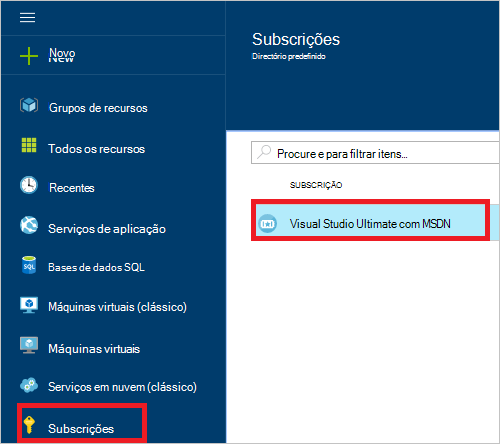
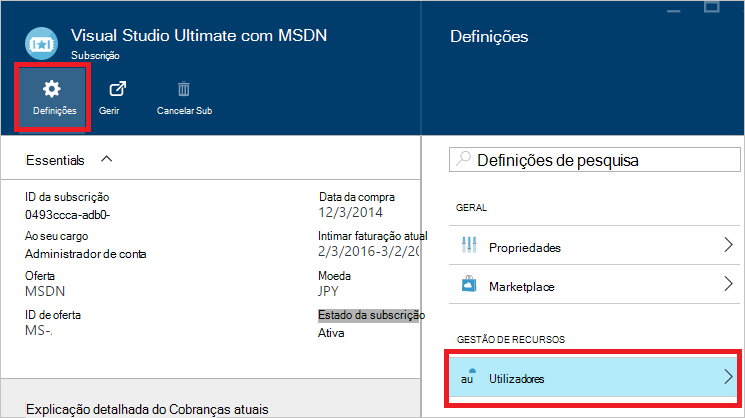
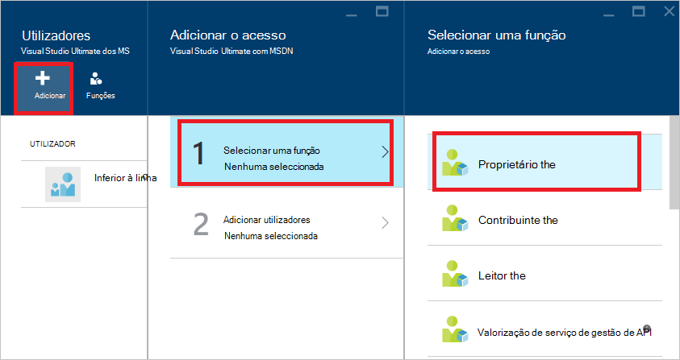
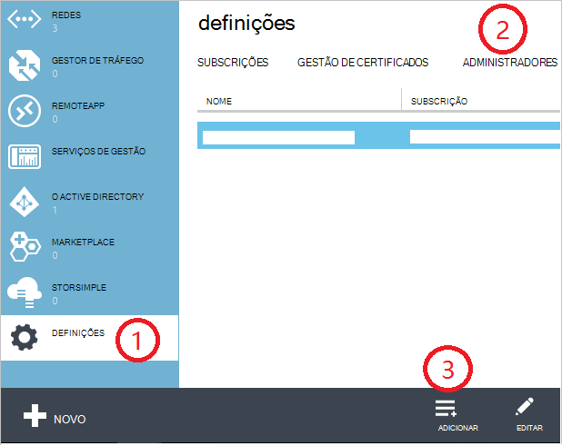
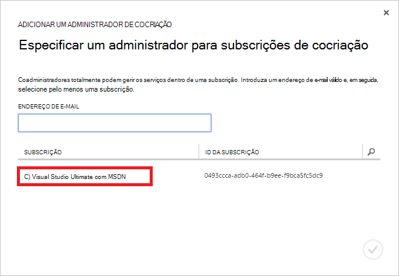
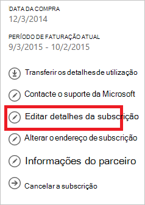
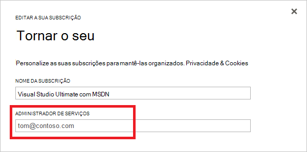

<properties
    pageTitle="Como adicionar ou alterar funções de administrador Azure | Microsoft Azure"
    description="Descreve como adicionar ou alterar administrador cocriação Azure, o administrador de serviços e o administrador de conta"
    services=""
    documentationCenter=""
    authors="genlin"
    manager="mbaldwin"
    editor=""
    tags="billing"/>

<tags
    ms.service="billing"
    ms.workload="na"
    ms.tgt_pltfrm="na"
    ms.devlang="na"
    ms.topic="article"
    ms.date="08/17/2016"
    ms.author="genli"/>

# Como adicionar ou alterar funções de administrador do Azure

Existem três tipos de funções de administrador no Microsoft Azure:

| Função administrativa   | Limite  | Descrição
| ------------- | ------------- |---------------|
|Administrador de conta (AA)  | 1 por conta Azure  |Este é a pessoa que se inscreveu ou comprou subscrições Azure e está autorizada para aceder ao [Centro de conta](https://account.windowsazure.com/Home/Index) e realizar várias tarefas de gestão. Estas incluem ser capaz de criar subscrições, cancelar subscrições, alterar a faturação para uma subscrição e alterar o administrador do serviço.
| Administrador do serviço (SA) | 1 por subscrição Azure  |Esta função está autorizada para gerir serviços no [portal do Azure](https://portal.azure.com). Por predefinição, para uma nova subscrição, o administrador de conta também é o administrador do serviço.|
|Cocriação (AC) de administrador no [portal clássica Azure](https://manage.windowsazure.com)|200 por subscrição| Esta função tem os mesmos privilégios do access como o administrador do serviço, mas não é possível alterar a associação de subscrições a directórios Azure. |

> [AZURE.NOTE] Azure baseada em funções do Active Directory Access controlo RBCA () permite aos utilizadores a serem adicionados ao várias funções. Para mais informações, consulte o artigo [Baseada em Azure Active Directory funções o controlo de acesso](./active-directory/role-based-access-control-configure.md).

> [AZURE.NOTE] Se precisar de mais ajuda em qualquer ponto neste artigo, consulte [contactar o suporte](https://portal.azure.com/?#blade/Microsoft_Azure_Support/HelpAndSupportBlade) para obter o seu problema resolvido rapidamente.

## Como adicionar um administrador para uma subscrição

**Portal do Azure**

1. Inicie sessão no [portal do Azure](https://portal.azure.com).

2. No menu concentrador, selecione a **subscrição** > *a subscrição que pretende que o administrador para aceder a*.

    

3. No pá subscrição, selecione **Definições**> **utilizadores**.

    
4. No pá utilizadores, selecione **Adicionar**>**selecionar uma função** > **proprietário**.

    

    **Nota**
    - A função de proprietário tem os mesmos privilégios do access como administrador cocriação. Esta função não ter privilégios de acesso para o [Centro de conta Azure](https://account.windowsazure.com/subscriptions).
    - Os proprietários que adicionou através do [Azure portal](https://portal.azure.com) não podem gerir serviços no [Azure portal clássica](https://manage.windowsazure.com).  

5. Escreva o endereço de e-mail do utilizador que pretende adicionar como proprietário, clique no utilizador e, em seguida, clique em **Selecionar**.

    

**Azure portal clássico**

1. Inicie sessão no [portal clássica Azure](https://manage.windowsazure.com/).

2. No painel de navegação, selecione **Definições**> **administradores**> **Adicionar**.  

    

3. Escreva o endereço de e-mail da pessoa que pretende adicionar como colega administrador e, em seguida, selecione a subscrição que pretende que o administrador para aceder a cocriação. 

     

O endereço de e-mail que se seguem pode ser adicionado como um administrador de cocriação:

* **Conta Microsoft** (antigo Windows Live ID)  
 Pode utilizar uma Account Microsoft para iniciar sessão para todos os produtos Microsoft orientados consumidor e na nuvem serviços, como o Outlook (Hotmail), Skype (MSN), OneDrive, Windows Phone e Xbox LIVE.
* **Conta institucional** 
 Uma conta institucional é uma conta que é criada em Azure Active Directory. O endereço de conta institucional for parecido com o seguinte: user@ &lt;o domínio&gt;. onmicrosoft.com

### As restrições e limitações

 * Cada subscrição está associada um diretório do Azure AD (também conhecido como o directório predefinido). Para localizar o directório predefinido está associada a subscrição, aceda ao [portal clássico Azure](https://manage.windowsazure.com/), selecione **Definições** > **subscrições**. Verifique o ID da subscrição para localizar o directório predefinido.

 * Se tiver sessão iniciada com uma Account Microsoft, só pode adicionar outros Accounts Microsoft ou utilizadores no diretório predefinida como administrador cocriação.

 * Se tiver sessão iniciada com uma conta institucional, pode adicionar outras contas organizacionais na sua organização como administrador cocriação. Por exemplo, abby@contoso.com pode adicionar bob@contoso.com como administrador do serviço ou administrador de cocriação, mas não é possível adicionar john@notcontoso.com , a menos que john@noncontoso.com é o utilizador no diretório predefinido. Utilizadores com sessão iniciada com contas organizacionais podem continuar a adicionar os utilizadores da Microsoft Account como administrador do serviço ou administrador de cocriação.

 * Agora que é possível que inicie sessão no Azure com uma conta institucional, aqui estão as alterações aos requisitos de conta de administrador de serviços e cocriação de administrador:

    Método de início de sessão| Adicionar Account Microsoft ou os utilizadores dentro do diretório predefinida como AC ou SA?  |Adicionar conta institucional na mesma organização como CA ou SA? |Adicionar conta institucional na organização diferente, tal como AC ou SA?
    ------------- | ------------- |---------------|---------------
    Conta Microsoft |Sim|N|N
    Conta institucional|Sim|Sim|N

## Como alterar o administrador do serviço para uma subscrição

Apenas o administrador de conta, pode alterar o administrador do serviço para uma subscrição.

1. Iniciar sessão no [Centro de conta Azure](https://account.windowsazure.com/subscriptions) utilizando o administrador da conta.

2. Selecione a subscrição que pretende alterar.

3. No lado direito, clique em **Editar subscrição** detalhes.  

    

4. Na caixa de **Administrador do serviço** , introduza o endereço de e-mail do administrador de serviços novos.  

    

## Como alterar o administrador da conta

Para transferir o que é o proprietário da conta Azure para outra conta, consulte o artigo [Transferir a propriedade de uma subscrição do Azure](billing-subscription-transfer.md).

## Próximos passos

* Para saber mais sobre como o acesso de recurso é controlado no Microsoft Azure, consulte [Noções sobre o acesso de recursos no Azure](./active-directory/active-directory-understanding-resource-access.md)

* Para mais informações sobre como Azure Active Directory está relacionada com a sua subscrição do Azure, consulte o artigo [como Azure subscrições estão associadas a Azure Active Directory](./active-directory/active-directory-how-subscriptions-associated-directory.md)

* Para mais informações sobre como Azure Active Directory está relacionada com a sua subscrição do Azure, consulte [atribuir funções de administrador no Azure Active Directory](./active-directory/active-directory-assign-admin-roles.md)

> [AZURE.NOTE] Se ainda tiver ainda mais frequentes, consulte [contactar o suporte](https://portal.azure.com/?#blade/Microsoft_Azure_Support/HelpAndSupportBlade) para obter o seu problema resolvido rapidamente.
