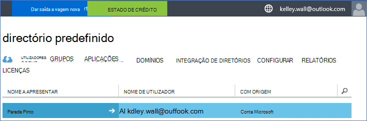
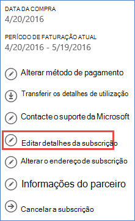
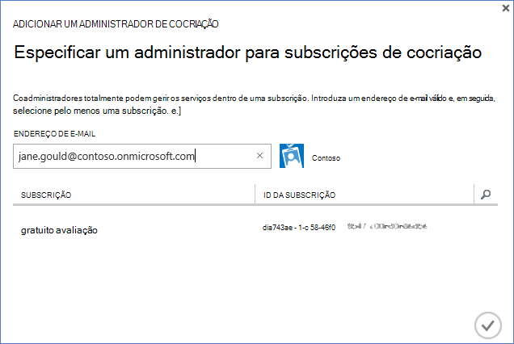

<properties
    pageTitle="Utilizar um inquilino do Office 365 com uma subscrição Azure | Microsoft Azure"
    description="Saiba como adicionar um diretório do Office 365 (inquilino) para uma subscrição do Azure para tornar a associação."
    services=""
    documentationCenter=""
    authors="JiangChen79"
    manager="mbaldwin"
    editor=""
    tags="billing,top-support-issue"/>

<tags
    ms.service="billing"
    ms.workload="na"
    ms.tgt_pltfrm="ibiza"
    ms.devlang="na"
    ms.topic="article"
    ms.date="09/16/2016"
    ms.author="cjiang"/>

# Associar um inquilino do Office 365 com uma subscrição do Azure
Se tiver adquirido subscrições Azure e no Office 365 em separado no passado e agora pretende será possível aceder ao inquilino do Office 365 da subscrição Azure, é fácil fazê-lo. Este artigo mostra-lhe como.

> [AZURE.NOTE] Este artigo não se aplica a clientes do Enterprise Agreement (EA).

## Orientações rápidas
Para associar o seu inquilino do Office 365 com a sua subscrição Azure, utilize a sua conta Azure para adicionar o seu inquilino do Office 365 e, em seguida, associar a sua subscrição Azure o inquilino do Office 365.

## Passos detalhados
Neste cenário, Pinto parede é um utilizador que tenha uma subscrição do Azure sob a conta kelley.wall@outlook.com. Pinto também tem uma subscrição do Office 365 sob a conta kelley.wall@contoso.onmicrosoft.com. Agora Pinto quer ter acesso o inquilino do Office 365 com a subscrição Azure.

### Pré-requisitos
Para a associação funcione corretamente, são necessários os pré-requisitos seguintes:

- Tem as credenciais de administrador de serviços da subscrição do Azure. Os administradores de cocriação não é possível executar um subconjunto dos passos.
- Tem as credenciais de administrador global do inquilino do Office 365.
- O endereço de e-mail do administrador de serviço não tem de estar contido no inquilino do Office 365.
- O endereço de e-mail do administrador de serviço não tem de corresponder que qualquer administrador global do inquilino do Office 365.
- Se estiver a utilizar um endereço de e-mail que é uma conta Microsoft e uma conta institucional, altere temporariamente o administrador do serviço da sua subscrição do Azure utilizar outra conta Microsoft. Pode criar uma nova conta do Microsoft na [página de inscrição de conta Microsoft](https://signup.live.com/).

Para alterar o seu administrador de serviços, siga estes passos:

1. Inicie sessão no [portal de gestão de conta](https://account.windowsazure.com/subscriptions).
2. Selecione a subscrição que pretende alterar.
3. Selecione **Editar detalhes da subscrição**.

    

4. Na caixa de **Administrador do serviço** , introduza o endereço de e-mail do novo administrador de serviço.

    

### Associar o inquilino do Office 365 com a subscrição do Azure
Para associar a subscrição Azure o inquilino do Office 365, siga estes passos:

1.  Inicie sessão no [portal de gestão de contas](https://account.windowsazure.com/subscriptions) com as credenciais de administrador do serviço.
2.  No painel esquerdo, selecione **Do ACTIVE DIRECTORY**.

    

    > [AZURE.NOTE] Não deverá ver o inquilino do Office 365. Se vir, ignore o passo seguinte.

    

3. Adicione o inquilino do Office 365 à sua subscrição do Azure.

    um. Selecione **Novo** > **DIRETÓRIO** > **Criar PERSONALIZADO**.

    

    b. Na página **Adicionar diretório** , em **DIRETÓRIO**, selecione **Utilizar directório existente**. Em seguida, selecione **estou pronto para ser assinado agora**e, selecione **concluída** .

    

    c. Depois de que tem sessão iniciada, inicie sessão com as credenciais de administrador global do seu inquilino do Office 365.

    

    d. Selecione **continuar**.

    

    "e". Selecione **Terminar sessão agora**.

    

    f. Inicie sessão no [portal de gestão de contas](https://account.windowsazure.com/subscriptions) com as credenciais de administrador do serviço.

    

    g. Deverá ver o seu inquilino do Office 365 no dashboard.

    

4. Altere o directório associado à subscrição Azure.

    um. Selecione **Definições**.

    

    b. Selecione a sua subscrição do Azure e, em seguida, selecione **Editar DIRETÓRIO**.
    

    c. Selecione **seguinte** .

    

    > [AZURE.WARNING] Receberá um aviso de que todos os administradores de cocriação serão removidos.

    

    >[AZURE.WARNING] Para além disso, também serão removidos todos os utilizadores de [controlo de acesso baseado em funções RBCA ()](./active-directory/role-based-access-control-configure.md) com o access atribuído dos grupos de recursos existente. No entanto, o aviso que recebe menções apenas a remoção da coadministradores.

    

    d. Selecione **concluída** .

5. Agora pode adicionar o seu contas organizacionais do Office 365 como coadministradores para o inquilino do Azure Active Directory.

    um. Selecione o separador de **administradores** e, em seguida, selecione **Adicionar**.

    

    b. Introduza uma conta institucional do seu inquilino do Office 365, selecione a subscrição Azure e, em seguida, selecione **concluída** .

    

    c. Volte ao separador **administradores** . Deverá ver conta institucional apresentada como administrador cocriação.

    

6. Seguinte pode testar o access com o administrador de cocriação.

    um. Terminar sessão no portal de gestão de conta.

    b. Abra o [portal de gestão de contas](https://account.windowsazure.com/subscriptions) ou o [Azure portal](https://portal.azure.com/).

    c. Se a página de início de sessão no Azure tem uma ligação de **Iniciar sessão com a sua conta de organização**, selecione a ligação. Caso contrário, ignore este passo.

    

    d. Introduza as credenciais de administrador a cocriação e, em seguida, selecione **Iniciar sessão**.

    

## Próximos passos
Cenários relacionados incluem:

- Já tem uma subscrição do Office 365 e estiver pronto para uma subscrição do Azure, mas que pretende utilizar as contas de utilizador do Office 365 existentes para a sua subscrição Azure.
- For um subscritor do Azure e pretende obter uma subscrição do Office 365 para os utilizadores na sua instância do Azure Active Directory existente.

Para saber como realizar estas tarefas, consulte o artigo [utilizar o Office 365 existente de conta com a sua subscrição Azure, ou vice versa](billing-use-existing-office-365-account-azure-subscription.md).
