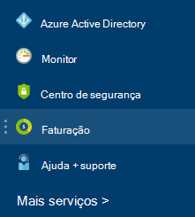

<properties
    pageTitle="Como transferir o Azure faturação dados de utilização da fatura e diária | Microsoft Azure"
    description="Descreve como transferir o Azure fatura de faturação e dados de utilização diária"
    services=""
    documentationCenter=""
    authors="genlin"
    manager="mbaldwin"
    editor=""
    tags="billing"
    />

<tags
    ms.service="billing"
    ms.workload="na"
    ms.tgt_pltfrm="na"
    ms.devlang="na"
    ms.topic="article"
    ms.date="10/10/2016"
    ms.author="genli"/>

# Como transferir o Azure faturação dados de utilização da fatura e diária

> [AZURE.NOTE] Se precisar de mais ajuda em qualquer ponto neste artigo, consulte [contactar o suporte](https://portal.azure.com/?#blade/Microsoft_Azure_Support/HelpAndSupportBlade) para obter o seu problema resolvido rapidamente.

Como administrador de conta Azure, pode ver a fatura de faturação e os dados de utilização diárias no [Azure portal](https://portal.azure.com) ou no [Centro de conta Azure](https://account.windowsazure.com/subscriptions). Eis como:

## Portal do Azure

1. Inicie sessão no [portal do Azure](https://portal.azure.com) como o administrador da conta.

    >[AZURE.NOTE] Apenas o administrador da conta tem permissão para aceder aos dados de faturaçãohttps. Para obter mais informações sobre como determinar quem é o administrador da conta da subscrição, consulte [Perguntas mais frequentes](billing-subscription-transfer.md#faq).

2. No menu concentrador, selecione **faturação**. No pá **faturação** , pode encontrar algumas informações úteis, como data faturação seguinte.

    
3. Na secção de **custos de subscrição** , selecione a subscrição à qual pretende ver.

    
4. Clique em **faturação e a utilização**.

    

5. No pá **o histórico de faturação** , clique em **Transferir fatura** para ver uma cópia da sua fatura. Clique num período de faturação para ver os dados de utilização diárias.

    

## Centro de conta do Azure

1. Inicie a sessão para o [Centro de conta Azure](https://account.windowsazure.com/subscriptions) como o administrador da conta.
2. Selecione a subscrição para o qual pretende que as informações de fatura e a utilização.
3. Selecione **o histórico de FATURAÇÃO**.  
4. Pode ver os extratos para os última seis períodos de faturaçãohttps e o período das atual.   
5. Selecione **Ver a declaração de atual** para ver uma estimativa dos seus encargos ao tempo que a estimativa foi gerada. Estas informações apenas são atualizadas diariamente e não podem incluir a sua utilização. A fatura mensal pode ser diferentes a partir desta estimativa.   
6. Selecione **Transferir fatura** para ver uma cópia da sua fatura última.  
7. Selecione **A utilização de transferir** para transferir dados de utilização diária como um ficheiro CSV. 

> [AZURE.NOTE] Se ainda tiver ainda mais frequentes, consulte [contactar o suporte](https://portal.azure.com/?#blade/Microsoft_Azure_Support/HelpAndSupportBlade) para obter o seu problema resolvido rapidamente.
