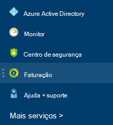

<properties
    pageTitle="Compreender os custos de serviço externos Azure | Microsoft Azure"
    description="Saiba mais sobre faturação dos serviços externos, anteriormente conhecido como Marketplace, encargos no Azure."
    services=""
    documentationCenter=""
    authors="adpick"
    manager="felixwu"
    editor=""
    tags="billing"
    />

<tags
    ms.service="billing"
    ms.workload="na"
    ms.tgt_pltfrm="na"
    ms.devlang="na"
    ms.topic="article"
    ms.date="10/12/2016"
    ms.author="adpick"/>

# Compreender os custos de serviço externos Azure

Este artigo explica a faturação dos serviços externos no Azure. Serviços externos utilizado para ser denominada encomendas Marketplace. Serviços externos são fornecidos por fornecedores independentes do serviço, mas são integrados completamente dentro do Azure ecossistema. Saiba como:

- Identificar serviços externos
- Compreender como a faturação difere outros recursos Azure
- Ver e controlar que imputação dos custos da utilização de serviços externos
- Gerir ordens de serviço externos e como pode paga-los

## O que são Azure serviços externos?

Serviços externos utilizado para ser chamado Azure Marketplace. Geralmente, as mesmas são serviços publicados por terceiros disponíveis para Azure. Por exemplo, ClearDB e SendGrid são serviços externos, que pode comprar no Azure, mas não são publicadas pela Microsoft.

### Identificar serviços externos

Quando aprovisionar um novo serviço externo ou um recurso, é apresentado um aviso:

>[AZURE.NOTE] Serviços externos são publicados por empresas que não estão Microsoft, mas, por vezes, os produtos Microsoft também são categorizados como serviços externos.

### Serviços externos são faturados separadamente

Serviços externos são tratados como encomendas individuais dentro da sua subscrição do Azure. O período de faturação para cada serviço é definido quando adquirir o serviço. Não devem ser confundidas com o período de faturação da subscrição, sob o qual comprou a mesma. Também recebe separadas faturas e o cartão de crédito é cobrado separadamente.

### Cada serviço externo tem um modelo de faturação diferente

Alguns serviços são faturados de uma forma repartição enquanto outras pessoas utilizam um modelo com base pagamento mensal. Precisa de um cartão de crédito para Azure serviços externos, não pode comprar serviços externos com pagamento de fatura.

### Não é possível utilizar mensais créditos gratuitos para serviços externos

Se estiver a utilizar uma subscrição do Azure que inclui [créditos livres](https://azure.microsoft.com/pricing/spending-limits/), não podem ser aplicadas para faturas serviço externo. Utilize um cartão de crédito para comprar serviços externos.

## Visualizar serviço externo despesas e histórico

Pode ver uma lista dos serviços externos que estão num cada subscrição no interior do [Azure portal](https://portal.azure.com/): 

1. Iniciar sessão para o [portal do Azure](https://portal.azure.com/) e, em seguida, [Navegue para a pá **faturação** ](https://portal.azure.com/?flight=1#blade/Microsoft_Azure_Billing/BillingBlade).

     
  
2. Na secção de **custos de subscrição** , selecione a subscrição à qual pretende ver. 
   
    

3. Clique em **serviços externos**.

    

4. Deverá ver cada uma das suas encomendas de serviço externo, o nome do publisher, camada de serviços que comprou, nome que lhe atribuiu o recurso e o estado atual de encomenda. Selecione um serviço externo para ver as anteriores faturas.

    

5. A partir daqui, pode ver anteriores quantidades de fatura, incluindo a desagregação de impostos.

    

## Gerir métodos de pagamento para ordens de serviço externos

Atualize os seus métodos de pagamento para ordens de serviço externos a partir do [Centro de conta](https://account.windowsazure.com/).

> [AZURE.NOTE] Se comprou a sua subscrição com uma conta do trabalho ou na escola deverá [contactar o suporte](https://portal.azure.com/?#blade/Microsoft_Azure_Support/HelpAndSupportBlade) para efetuar alterações ao seu método de pagamento.

1. Iniciar sessão para o [Centro de conta](https://account.windowsazure.com/) e, em seguida, [Navegue para o separador **marketplace** ](https://account.windowsazure.com/Store)

    

2. Selecione o serviço externo que pretende gerir

    

3. Clique em **método de pagamento de alteração** no lado direito da página. Esta ligação fornece-lhe um portal de diferentes para gerir o seu método de pagamento.
    
    

4. Clique em **Editar informações** e siga as instruções para atualizar as suas informações de pagamento.

    
    
## Cancelar uma ordem de serviço externo

Se quiser cancelar a sua encomenda serviço externo, tem de eliminar o recurso no [portal do Azure](https://portal.azure.com).

## Precisa de ajuda? Contacte o suporte.

Se ainda tiver ainda mais frequentes, consulte [contactar o suporte](https://portal.azure.com/?#blade/Microsoft_Azure_Support/HelpAndSupportBlade) para obter o seu problema resolvido rapidamente.
