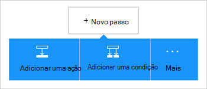

<properties
    pageTitle="Adicionar o conector do Dynamics CRM Online às suas aplicações de lógica | Microsoft Azure"
    description="Crie aplicações de lógica com Azure aplicação de serviço. Fornecedor de ligação Dynamics CRM Online fornece uma API para trabalhar com entidades Dynamics CRM Online."
    services="logic-apps"    
    documentationCenter=""     
    authors="MandiOhlinger"    
    manager="erikre"    
    editor="" 
    tags="connectors" />

<tags
ms.service="logic-apps"
ms.devlang="na"
ms.topic="article"
ms.tgt_pltfrm="na"
ms.workload="integration"
ms.date="08/15/2016"
ms.author="mandia"/>

# Começar a trabalhar com o conector do Dynamics CRM Online
Ligar ao Dynamics CRM Online para criar um novo registo, actualizar um item e muito mais. Com CRM Online, pode:

- Crie o seu fluxo de negócio com base em dados que obter a partir do CRM Online. 
- Ações de utilização que eliminar um registo, obtenha entidades e muito mais. Estas ações obtém uma resposta e, em seguida, disponibilizam o resultado para outras ações. Por exemplo, quando um item for atualizado nos CRM, pode enviar uma mensagem de e-mail com o Office 365.

Este tópico mostra-lhe como utilizar o conector do Dynamics CRM Online numa aplicação lógica e também lista accionadores e ações.

>[AZURE.NOTE] Esta versão do artigo aplica-se para disponibilidade geral lógica aplicações (das versões DG).

Para saber mais sobre aplicações de lógica, consulte o artigo [o que são as aplicações de lógica](../app-service-logic/app-service-logic-what-are-logic-apps.md) e [criar uma aplicação de lógica](../app-service-logic/app-service-logic-create-a-logic-app.md).

## Ligar ao Dynamics CRM Online

Antes de pode aceder a sua aplicação de lógica qualquer serviço, primeiro, criar uma *ligação* ao serviço. Uma ligação fornece conectividade entre uma aplicação de lógica e outro serviço. Por exemplo, para ligar ao Dynamics, tem primeiro uma *ligação*de Dynamics CRM Online. Para criar uma ligação, introduza as credenciais que normalmente utiliza para aceder ao serviço que pretende ligar. Por isso, com o Dynamics, introduza as credenciais para a conta Dynamics CRM Online para criar a ligação.

### Criar a ligação

>[AZURE.INCLUDE [Steps to create a connection to Dynamics CRM Online Connection Provider](../../includes/connectors-create-api-crmonline.md)]

## Utilize um acionador de

Um accionador é um evento que pode ser utilizado para iniciar o fluxo de trabalho definido numa aplicação de lógica. Accionadores "as inquérito" o serviço de um intervalo e a frequência com que pretende. [Saiba mais sobre os accionadores](../app-service-logic/app-service-logic-what-are-logic-apps.md#logic-app-concepts).

1. Na aplicação lógica, escreva "dynamics" para obter uma lista de accionadores:  

    

2. Selecione **Dynamics CRM Online - quando é criado um registo**. Se já existe uma ligação, em seguida, selecione uma organização e entidade a partir da lista pendente.

    

    Se lhe for pedido para iniciar sessão, em seguida, introduza o sinal de detalhes para criar a ligação. [Criar a ligação](connectors-create-api-crmonline.md#create-the-connection) neste tópico lista os passos. 

    > [AZURE.NOTE] Neste exemplo, a aplicação de lógica, é executada quando é criado um registo. Para ver os resultados deste accionador, adicione outra ação que lhe envia uma mensagem de e-mail. Por exemplo, adicione a ação do Office 365 *Enviar um e-mail* que mensagens de correio electrónico quando o novo registo é adicionado. 

3. Selecione o botão **Editar** e defina as **frequência** e **intervalo de** valores. Por exemplo, se pretender que o accionador para consultar a cada 15 minutos, em seguida, defina a **frequência** para **minuto**e defina o **intervalo** para **15**. 

    

4. **Guardar** as suas alterações (canto superior esquerdo da barra de ferramentas). A sua aplicação de lógica está guardada e pode ser activada automaticamente.

## Utilizar uma ação

Uma ação é uma operação realizada pelo fluxo de trabalho definido numa aplicação de lógica. [Saber mais sobre ações](../app-service-logic/app-service-logic-what-are-logic-apps.md#logic-app-concepts).

1. Selecione o sinal de adição. Verá várias opções: **Adicionar uma ação**, **Adicionar uma condição**ou uma das opções **mais** .

    

2. Selecione **Adicionar uma ação**.

3. Na caixa de texto, escreva "dynamics" para obter uma lista de todas as ações disponíveis.

    

4. No nosso exemplo, selecione **Dynamics CRM Online - atualizar um registo**. Se já existe uma ligação, em seguida, selecione o **Nome da organização**, **Nome da entidade**e outras propriedades:  

    

    Se lhe for pedido para as informações de ligação, em seguida, introduza os detalhes para criar a ligação. [Criar a ligação](connectors-create-api-crmonline.md#create-the-connection) neste tópico descreve estas propriedades. 

    > [AZURE.NOTE] Neste exemplo, vamos atualizar um registo existente no CRM Online. Pode utilizar a saída de outro acionador de atualizar o registo. Por exemplo, adicione o accionador SharePoint *Quando um item existente é modificado* . Em seguida, adicione a ação CRM Online *atualizar um registo* que utiliza os campos do SharePoint para atualizar o registo existente no CRM Online. 

5. **Guardar** as suas alterações (canto superior esquerdo da barra de ferramentas). A sua aplicação de lógica está guardada e pode ser activada automaticamente.

## Detalhes técnicos

## Accionadores

|Accionador | Descrição|
|--- | ---|
|[Quando é criado um registo](connectors-create-api-crmonline.md#when-a-record-is-created)|Um fluxo de accionadores quando um objeto é criado no CRM.|
|[Quando um registo é atualizado](connectors-create-api-crmonline.md#when-a-record-is-updated)|Um fluxo de accionadores quando um objeto é modificado no CRM.|
|[Quando é eliminado um registo](connectors-create-api-crmonline.md#when-a-record-is-deleted)|Um fluxo de accionadores quando um objeto é eliminado no CRM.|

## Ações

|Ação|Descrição|
|--- | ---|
|[Registos de lista](connectors-create-api-crmonline.md#list-records)|Esta operação obtém os registos de uma entidade.|
|[Criar um novo registo](connectors-create-api-crmonline.md#create-a-new-record)|Esta operação cria um novo registo de uma entidade.|
|[Obter registo](connectors-create-api-crmonline.md#get-record)|Esta operação obtém o registo especificado para uma entidade.|
|[Eliminar um registo](connectors-create-api-crmonline.md#delete-a-record)|Esta operação elimina um registo a partir de uma coleção de entidade.|
|[Atualizar um registo](connectors-create-api-crmonline.md#update-a-record)|Esta operação atualiza um registo existente para uma entidade.|

### Detalhes do acionador e acção

Nesta secção, consulte o artigo os detalhes específicos sobre cada accionador e ação, incluindo as propriedades de entrada opcionais ou obrigatórias e qualquer associados com o conector de saída correspondente.

#### Quando é criado um registo
Um fluxo de accionadores quando um objeto é criado no CRM. 

|Nome da propriedade| Nome a apresentar|Descrição|
| ---|---|---|
|conjunto de dados *|Nome da organização|Nome da organização CRM, como Contoso|
|tabela *|Nome da entidade|Nome da entidade|
|$skip|Contagem de ignorar|Número de entradas para ignorar (predefinição = 0)|
|$top|Contagem de obter máximo|Número máximo de entradas para obter (predefinição = 256)|
|$filter|Consulta de filtro|Uma consulta de filtro ODATA para restringir as entradas devolvidas|
|$orderby|Order By|Uma consulta de OrdenarPor ODATA para especificar a ordem das entradas|

Um asterisco (*) significa que a propriedade é necessária.

##### Detalhes de saída
ItemsList

| Nome da propriedade | Tipo de dados |
|---|---|
|valor|matriz|

#### Quando um registo é atualizado
Um fluxo de accionadores quando um objeto é modificado no CRM. 

|Nome da propriedade| Nome a apresentar|Descrição|
| ---|---|---|
|conjunto de dados *|Nome da organização|Nome da organização CRM, como Contoso|
|tabela *|Nome da entidade|Nome da entidade|
|$skip|Contagem de ignorar|Número de entradas para ignorar (predefinição = 0)|
|$top|Contagem de obter máximo|Número máximo de entradas para obter (predefinição = 256)|
|$filter|Consulta de filtro|Uma consulta de filtro ODATA para restringir as entradas devolvidas|
|$orderby|Order By|Uma consulta de OrdenarPor ODATA para especificar a ordem das entradas|

Um asterisco (*) significa que a propriedade é necessária.

##### Detalhes de saída
ItemsList

| Nome da propriedade | Tipo de dados |
|---|---|
|valor|matriz|

#### Quando é eliminado um registo
Um fluxo de accionadores quando um objeto é eliminado no CRM. 

|Nome da propriedade| Nome a apresentar|Descrição|
| ---|---|---|
|conjunto de dados *|Nome da organização|Nome da organização CRM, como Contoso|
|tabela *|Nome da entidade|Nome da entidade|
|$skip|Contagem de ignorar|Número de entradas para ignorar (predefinição = 0)|
|$top|Contagem de obter máximo|Número máximo de entradas para obter (predefinição = 256)|
|$filter|Consulta de filtro|Uma consulta de filtro ODATA para restringir as entradas devolvidas|
|$orderby|Order By|Uma consulta de OrdenarPor ODATA para especificar a ordem das entradas|

Um asterisco (*) significa que a propriedade é necessária.

##### Detalhes de saída
ItemsList

| Nome da propriedade | Tipo de dados |
|---|---|
|valor|matriz|

#### Registos de lista
Esta operação obtém os registos de uma entidade. 

|Nome da propriedade| Nome a apresentar|Descrição|
| ---|---|---|
|conjunto de dados *|Nome da organização|Nome da organização CRM, como Contoso|
|tabela *|Nome da entidade|Nome da entidade|
|$skip|Contagem de ignorar|Número de entradas para ignorar (predefinição = 0)|
|$top|Contagem de obter máximo|Número máximo de entradas para obter (predefinição = 256)|
|$filter|Consulta de filtro|Uma consulta de filtro ODATA para restringir as entradas devolvidas|
|$orderby|Order By|Uma consulta de OrdenarPor ODATA para especificar a ordem das entradas|

Um asterisco (*) significa que a propriedade é necessária.

##### Detalhes de saída
ItemsList

| Nome da propriedade | Tipo de dados |
|---|---|
|valor|matriz|

#### Criar um novo registo
Esta operação cria um novo registo de uma entidade. 

|Nome da propriedade| Nome a apresentar|Descrição|
| ---|---|---|
|conjunto de dados *|Nome da organização|Nome da organização CRM, como Contoso|
|tabela *|Nome da entidade|Nome da entidade|

Um asterisco (*) significa que a propriedade é necessária.

##### Detalhes de saída
Nenhum.

#### Obter registo
Esta operação obtém o registo especificado para uma entidade. 

|Nome da propriedade| Nome a apresentar|Descrição|
| ---|---|---|
|conjunto de dados *|Nome da organização|Nome da organização CRM, como Contoso|
|tabela *|Nome da entidade|Nome da entidade|
|ID de *|Identificador do item|Especificar o identificador para o registo|

Um asterisco (*) significa que a propriedade é necessária.

##### Detalhes de saída
Nenhum.

#### Eliminar um registo
Esta operação elimina um registo a partir de uma coleção de entidade. 

|Nome da propriedade| Nome a apresentar|Descrição|
| ---|---|---|
|conjunto de dados *|Nome da organização|Nome da organização CRM, como Contoso|
|tabela *|Nome da entidade|Nome da entidade|
|ID de *|Identificador do item|Especificar o identificador para o registo|

Um asterisco (*) significa que a propriedade é necessária.

#### Atualizar um registo
Esta operação atualiza um registo existente para uma entidade. 

|Nome da propriedade| Nome a apresentar|Descrição|
| ---|---|---|
|conjunto de dados *|Nome da organização|Nome da organização CRM, como Contoso|
|tabela *|Nome da entidade|Nome da entidade|
|ID de *|Identificador do registo|Especificar o identificador para o registo|

Um asterisco (*) significa que a propriedade é necessária.

##### Detalhes de saída
Nenhum.

## Respostas HTTP

Ações e accionadores podem devolver um ou mais dos seguintes códigos de estado HTTP: 

|Nome|Descrição|
|---|---|
|200|OK|
|202|Aceites|
|400|Pedido incorrecto|
|401|Não autorizado|
|403|Proibido|
|404|Não foi encontrado|
|500|Erro de servidor interno. Ocorreu um erro desconhecido.|
|predefinido|A operação falhou.|

## Próximos passos

[Criar uma aplicação de lógica](../app-service-logic/app-service-logic-create-a-logic-app.md). Explore as outras conexões disponíveis nas aplicações de lógica na nossa [lista APIs](apis-list.md).

