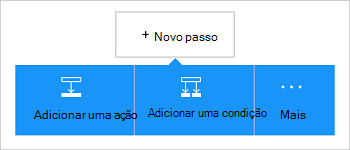

<properties
    pageTitle="Adicionar o Office 365 Outlook connector nas suas aplicações de lógica | Microsoft Azure"
    description="Crie aplicações de lógica com o Office 365 connector para ativar a interação com o Office 365. Por exemplo: criar, editar e atualizar os itens de calendário e contactos."
    services=""    
    documentationCenter=""     
    authors="MandiOhlinger"    
    manager="anneta"    
    editor="" 
    tags="connectors" />

<tags
ms.service="logic-apps"
ms.devlang="na"
ms.topic="article"
ms.tgt_pltfrm="na"
ms.workload="integration"
ms.date="10/18/2016"
ms.author="mandia"/>

# Começar a trabalhar com o Office 365 Outlook connector 

O Office 365 Outlook connector permite interação com o Outlook no Office 365. Utilize esta conexão para criar, editar e atualizar os contactos e itens de calendário e também têm, enviar e responder a e-mails.

Com o Outlook do Office 365,:

- Crie o seu fluxo de trabalho utilizando as funcionalidades de e-mail e calendário no Office 365. 
- Utilize accionadores para iniciar o fluxo de trabalho quando existe um novo e-mail, quando é atualizado um item de calendário e muito mais.
- Utilize as ações para enviar uma mensagem de e-mail, crie um novo evento de calendário e muito mais. Por exemplo, quando existe um novo objeto no Salesforce (um accionador), envie um e-mail para o Office 365 Outlook (uma ação). 

Este tópico mostra-lhe como utilizar o Office 365 Outlook connector numa aplicação lógica e também lista accionadores e ações.

>[AZURE.NOTE] Esta versão do artigo aplica-se para disponibilidade geral lógica aplicações (das versões DG).

Para saber mais sobre aplicações de lógica, consulte o artigo [o que são as aplicações de lógica](../app-service-logic/app-service-logic-what-are-logic-apps.md) e [criar uma aplicação de lógica](../app-service-logic/app-service-logic-create-a-logic-app.md).

## Ligar para o Office 365

Antes de pode aceder a sua aplicação de lógica qualquer serviço, primeiro, criar uma *ligação* ao serviço. Uma ligação fornece conectividade entre uma aplicação de lógica e outro serviço. Por exemplo, para se ligar ao Outlook do Office 365, tem primeiro uma *ligação*do Office 365. Para criar uma ligação, introduza as credenciais que normalmente utiliza para aceder ao serviço que pretende ligar. Por isso, com o Outlook do Office 365, introduza as credenciais para a sua conta do Office 365 para criar a ligação.

## Criar a ligação

>[AZURE.INCLUDE [Steps to create a connection to Office 365](../../includes/connectors-create-api-office365-outlook.md)]

## Utilize um acionador de

Um accionador é um evento que pode ser utilizado para iniciar o fluxo de trabalho definido numa aplicação de lógica. Accionadores "as inquérito" o serviço de um intervalo e a frequência com que pretende. [Saiba mais sobre os accionadores](../app-service-logic/app-service-logic-what-are-logic-apps.md#logic-app-concepts).

1. Na aplicação lógica, escreva "office 365" para obter uma lista de accionadores:  

    

2. Selecione **Outlook do Office 365 - quando um evento futuro está a iniciar mais cedo**. Se já existe uma ligação, em seguida, selecione um calendário a partir da lista pendente.

    

    Se lhe for pedido para iniciar sessão, em seguida, introduza o sinal de detalhes para criar a ligação. [Criar a ligação](connectors-create-api-office365-outlook.md#create-the-connection) neste tópico lista os passos. 

    > [AZURE.NOTE] Neste exemplo, a aplicação de lógica é executada quando um evento do calendário é atualizado. Para ver os resultados deste accionador, adicione outra ação que lhe envia uma mensagem de texto. Por exemplo, adicionar a ação Twilio *Enviar mensagem* esse textos-o quando está a iniciar o evento de calendário em 15 minutos. 

3. Selecione o botão **Editar** e defina as **frequência** e **intervalo de** valores. Por exemplo, se pretender que o accionador para consultar a cada 15 minutos, em seguida, defina a **frequência** para **minuto**e defina o **intervalo** para **15**. 

    

4. **Guardar** as suas alterações (canto superior esquerdo da barra de ferramentas). A sua aplicação de lógica está guardada e pode ser activada automaticamente.

## Utilizar uma ação

Uma ação é uma operação realizada pelo fluxo de trabalho definido numa aplicação de lógica. [Saber mais sobre ações](../app-service-logic/app-service-logic-what-are-logic-apps.md#logic-app-concepts).

1. Selecione o sinal de adição. Verá várias opções: **Adicionar uma ação**, **Adicionar uma condição**ou uma das opções **mais** .

    

2. Selecione **Adicionar uma ação**.

3. Na caixa de texto, escreva "office 365" para obter uma lista de todas as ações disponíveis.

     

4. No nosso exemplo, selecione **Office 365 Outlook - criar contacto**. Se já existe uma ligação, em seguida, escolha o **ID da pasta**, o **nome próprio**e outras propriedades:  

    

    Se lhe for pedido para as informações de ligação, em seguida, introduza os detalhes para criar a ligação. [Criar a ligação](connectors-create-api-office365-outlook.md#create-the-connection) neste tópico descreve estas propriedades. 

    > [AZURE.NOTE] Neste exemplo, vamos criar um novo contacto no Outlook do Office 365. Pode utilizar a saída de outro acionador para criar o contacto. Por exemplo, adicione o accionador SalesForce *quando é criado um objeto* . Em seguida, adicione a ação Outlook do Office 365 *criar contacto* que utiliza os campos de SalesForce para criar o novo contacto novo no Office 365. 

5. **Guardar** as suas alterações (canto superior esquerdo da barra de ferramentas). A sua aplicação de lógica está guardada e pode ser activada automaticamente.

## Detalhes técnicos

Aqui estão os detalhes sobre accionadores, ações e as respostas que suporta esta ligação:

## Accionadores do Office 365

|Accionador | Descrição|
|--- | ---|
|[Quando um evento futuro está a iniciar o mais cedo](connectors-create-api-office365-outlook.md#when-an-upcoming-event-is-starting-soon)|Esta operação de um fluxo de accionadores quando está a iniciar um evento de calendário futuras.|
|[Quando recebe novas mensagens de e-mail](connectors-create-api-office365-outlook.md#when-a-new-email-arrives)|Esta operação de um fluxo de accionadores quando chega um novo e-mail|
|[Quando é criado um novo evento](connectors-create-api-office365-outlook.md#when-a-new-event-is-created)|Esta operação accionadores um fluxo de quando é criado um novo evento num calendário.|
|[Quando um evento é modificado](connectors-create-api-office365-outlook.md#when-an-event-is-modified)|Esta operação accionadores um fluxo de quando é modificado um evento num calendário.|

## Ações do Office 365

|Ação|Descrição|
|--- | ---|
|[Obter e-mails](connectors-create-api-office365-outlook.md#get-emails)|Esta operação obtém os e-mails a partir de uma pasta.|
|[Enviar uma mensagem de e-mail](connectors-create-api-office365-outlook.md#send-an-email)|Esta operação envia uma mensagem de e-mail.|
|[Eliminar e-mail](connectors-create-api-office365-outlook.md#delete-email)|Esta operação elimina uma mensagem de e-mail por id.|
|[Marcar como lido](connectors-create-api-office365-outlook.md#mark-as-read)|Esta operação marca um e-mail como ter sido lida.|
|[Responder a e-mails](connectors-create-api-office365-outlook.md#reply-to-email)|Esta operação respostas a um e-mail.|
|[Obter o anexo](connectors-create-api-office365-outlook.md#get-attachment)|Esta operação obtém um anexo de e-mail por id.|
|[Enviar e-mail com opções](connectors-create-api-office365-outlook.md#send-email-with-options)|Esta operação envia uma mensagem de e-mail com várias opções e aguarda o destinatário apenas responder novamente com uma das opções.|
|[Enviar e-mails de aprovação](connectors-create-api-office365-outlook.md#send-approval-email)|Esta operação envia uma mensagem de e-mail de aprovação e aguarda uma resposta a partir do destinatário.|
|[Obter calendários](connectors-create-api-office365-outlook.md#get-calendars)|Esta operação lista calendários disponíveis.|
|[Obter eventos](connectors-create-api-office365-outlook.md#get-events)|Esta operação obtém eventos de um calendário.|
|[Criar o evento](connectors-create-api-office365-outlook.md#create-event)|Esta operação cria um novo evento num calendário.|
|[Obter o evento](connectors-create-api-office365-outlook.md#get-event)|Esta operação obtém um evento específico a partir de um calendário.|
|[Eliminar o evento](connectors-create-api-office365-outlook.md#delete-event)|Esta operação elimina um evento num calendário.|
|[Atualizar o evento](connectors-create-api-office365-outlook.md#update-event)|Esta operação atualiza um evento num calendário.|
|[Obter as pastas de contactos](connectors-create-api-office365-outlook.md#get-contact-folders)|Esta operação lista as pastas de contactos disponíveis.|
|[Obter contactos](connectors-create-api-office365-outlook.md#get-contacts)|Esta operação obtém contactos a partir de uma pasta de contactos.|
|[Criar contacto](connectors-create-api-office365-outlook.md#create-contact)|Esta operação cria um novo contacto numa pasta de contactos.|
|[Obter contactos](connectors-create-api-office365-outlook.md#get-contact)|Esta operação obtém um contacto específico a partir de uma pasta de contactos.|
|[Eliminar contacto](connectors-create-api-office365-outlook.md#delete-contact)|Esta operação elimina um contacto a partir de uma pasta de contactos.|
|[Atualizar contacto](connectors-create-api-office365-outlook.md#update-contact)|Esta operação atualiza um contacto de uma pasta de contactos.|

### Detalhes do acionador e acção

Nesta secção, consulte o artigo os detalhes específicos sobre cada accionador e ação, incluindo as propriedades de entrada opcionais ou obrigatórias e qualquer associados com o conector de saída correspondente.

#### Quando um evento futuro está a iniciar o mais cedo
Esta operação de um fluxo de accionadores quando está a iniciar um evento de calendário futuras. 

|Nome da propriedade| Nome a apresentar|Descrição|
| ---|---|---|
|tabela *|Id do calendário|Identificador exclusivo do calendário|
|lookAheadTimeInMinutes|Tempo de antecedência aspeto|O tempo (em minutos) para procurar com antecedência eventos futuros|

Um asterisco (*) significa que a propriedade é necessária.

##### Detalhes de saída
CalendarItemsList: A lista de itens de calendário

| Nome da propriedade | Tipo de dados | Descrição |
|---|---|---|
|valor|matriz|Lista de itens de calendário|

#### Obter e-mails
Esta operação obtém os e-mails a partir de uma pasta. 

|Nome da propriedade| Nome a apresentar|Descrição|
| ---|---|---|
|caminhopasta|Caminho da pasta|Caminho da pasta para recuperar mensagens de correio eletrónico (predefinido: 'A receber')|
|início|Início|Número de mensagens de correio eletrónico para obter (predefinido: 10)|
|fetchOnlyUnread|Obter apenas mensagens não lidas|Obter apenas não lidas mensagens de correio eletrónico?|
|includeAttachments|Incluir anexos|Se definir a anexos for verdadeiros, também será serem obtido juntamente com o e-mail|
|searchQuery|Consulta de pesquisa|Consulta de pesquisa para filtrar mensagens de correio eletrónico|
|Ignorar|Ignorar|Número de mensagens de correio eletrónico para ignorar (predefinido: 0)|
|skipToken|Ignorar Token|Ignorar token a obtenção nova página|

Um asterisco (*) significa que a propriedade é necessária.

##### Detalhes de saída
ReceiveMessage: Receber a mensagem de E-Mail

| Nome da propriedade | Tipo de dados | Descrição |
|---|---|---|
|A partir do|cadeia|A partir do|
|Para|cadeia|Para|
|Assunto|cadeia|Assunto|
|Corpo|cadeia|Corpo|
|Importância|cadeia|Importância|
|HasAttachment|Booleano|Tem anexo|
|ID|cadeia|Id da mensagem|
|IsRead|Booleano|É de leitura|
|DateTimeReceived|cadeia|Data hora recebida|
|Anexos|matriz|Anexos|
|Cc|cadeia|Especificar endereços de e-mail separados por ponto e vírgula comosomeone@contoso.com|
|Bcc|cadeia|Especificar endereços de e-mail separados por ponto e vírgula comosomeone@contoso.com|
|IsHtml|Booleano|É Html|

#### Enviar uma mensagem de e-mail
Esta operação envia uma mensagem de e-mail. 

|Nome da propriedade| Nome a apresentar|Descrição|
| ---|---|---|
|o emailMessage *|Mensagem de correio electrónico|Mensagem de correio electrónico|

Um asterisco (*) significa que a propriedade é necessária.

##### Detalhes de saída
Nenhum.

#### Eliminar e-mail
Esta operação elimina uma mensagem de e-mail por id. 

|Nome da propriedade| Nome a apresentar|Descrição|
| ---|---|---|
|messageId *|Id da mensagem|ID do correio eletrónico para eliminar|

Um asterisco (*) significa que a propriedade é necessária.

##### Detalhes de saída
Nenhum.

#### Marcar como lido
Esta operação marca um e-mail como ter sido lida. 

|Nome da propriedade| Nome a apresentar|Descrição|
| ---|---|---|
|messageId *|Id da mensagem|ID do correio eletrónico marcado como lido|

Um asterisco (*) significa que a propriedade é necessária.

##### Detalhes de saída
Nenhum.

#### Responder a e-mails
Esta operação respostas a um e-mail. 

|Nome da propriedade| Nome a apresentar|Descrição|
| ---|---|---|
|messageId *|Id da mensagem|ID de e-mail para responder a|
|comentário *|Comentário|Comentário de resposta|
|replyAll|Responder a todos|Responder a todos os destinatários|

Um asterisco (*) significa que a propriedade é necessária.

##### Detalhes de saída
Nenhum.

#### Obter o anexo
Esta operação obtém um anexo de e-mail por id. 

|Nome da propriedade| Nome a apresentar|Descrição|
| ---|---|---|
|messageId *|Id da mensagem|ID do correio eletrónico|
|attachmentId *|Id de anexo|ID do anexo para o transferir|

Um asterisco (*) significa que a propriedade é necessária.

##### Detalhes de saída
Nenhum.

#### Quando recebe novas mensagens de e-mail
Esta operação de um fluxo de accionadores quando chega um novo e-mail.

|Nome da propriedade| Nome a apresentar|Descrição|
| ---|---|---|
|caminhopasta|Caminho da pasta|Pasta de correio eletrónico para obter (predefinido: pasta a receber)|
|para|Para|Endereços de e-mail de destinatários|
|a partir do|A partir do|A partir de endereço|
|importância|Importância|Importância da mensagem de correio electrónico (como sendo de alta, Normal, baixa) (predefinido: Normal)|
|fetchOnlyWithAttachment|Tem anexos|Obter apenas mensagens de correio eletrónico com um anexo|
|includeAttachments|Incluir anexos|Incluir anexos|
|subjectFilter|Filtro de assunto|Cadeia para procurar no assunto|

Um asterisco (*) significa que a propriedade é necessária.

##### Detalhes de saída
TriggerBatchResponse [ReceiveMessage]

| Nome da propriedade | Tipo de dados |
|---|---|
|valor|matriz|

#### Enviar e-mail com opções
Esta operação envia uma mensagem de e-mail com várias opções e aguarda o destinatário apenas responder novamente com uma das opções. 

|Nome da propriedade| Nome a apresentar|Descrição|
| ---|---|---|
|optionsEmailSubscription *|Pedido de subscrição para o e-mail de opções|Pedido de subscrição para o e-mail de opções|

Um asterisco (*) significa que a propriedade é necessária.

##### Detalhes de saída
SubscriptionResponse: Modelo de subscrição de E-mails de aprovação

| Nome da propriedade | Tipo de dados | Descrição |
|---|---|---|
|ID|cadeia|ID da subscrição|
|recurso|cadeia|Recursos do pedido da subscrição|
|notificationType|cadeia|Tipo de notificação|
|notificationUrl|cadeia|Url de notificação|

#### Enviar e-mails de aprovação
Esta operação envia uma mensagem de e-mail de aprovação e aguarda uma resposta a partir do destinatário. 

|Nome da propriedade| Nome a apresentar|Descrição|
| ---|---|---|
|approvalEmailSubscription *|Pedido de subscrição para o e-mail de aprovação|Pedido de subscrição para o e-mail de aprovação|

Um asterisco (*) significa que a propriedade é necessária.

##### Detalhes de saída
SubscriptionResponse: Modelo de subscrição de E-mails de aprovação

| Nome da propriedade | Tipo de dados | Descrição |
|---|---|---|
|ID|cadeia|ID da subscrição|
|recurso|cadeia|Recursos do pedido da subscrição|
|notificationType|cadeia|Tipo de notificação|
|notificationUrl|cadeia|Url de notificação|

#### Obter calendários
Esta operação lista calendários disponíveis. 

Não existem parâmetros para esta chamada.

##### Detalhes de saída
TablesList

| Nome da propriedade | Tipo de dados |
|---|---|
|valor|matriz|

#### Obter eventos
Esta operação obtém eventos de um calendário. 

|Nome da propriedade| Nome a apresentar|Descrição|
| ---|---|---|
|tabela *|Id do calendário|Selecione um calendário|
|$filter|Consulta de filtro|Uma consulta de filtro ODATA para restringir as entradas devolvidas|
|$orderby|Order By|Uma consulta de OrdenarPor ODATA para especificar a ordem das entradas|
|$skip|Contagem de ignorar|Número de entradas para ignorar (predefinição = 0)|
|$top|Contagem de obter máximo|Número máximo de entradas para obter (predefinição = 256)|

Um asterisco (*) significa que a propriedade é necessária.

##### Detalhes de saída
CalendarEventList: A lista de itens de calendário

| Nome da propriedade | Tipo de dados | Descrição |
|---|---|---|
|valor|matriz|Lista de itens de calendário|

#### Criar o evento
Esta operação cria um novo evento num calendário. 

|Nome da propriedade| Nome a apresentar|Descrição|
| ---|---|---|
|tabela *|Id do calendário|Selecione um calendário|
|item *|Item|Evento para criar|

Um asterisco (*) significa que a propriedade é necessária.

##### Detalhes de saída
CalendarEvent: Conexão calendário específico evento classe do modelo.

| Nome da propriedade | Tipo de dados | Descrição |
|---|---|---|
|ID|cadeia|Identificador exclusivo do evento.|
|Participantes|matriz|Lista de participantes para o evento.|
|Corpo|não definido|O corpo da mensagem associado ao evento.|
|BodyPreview|cadeia|A pré-visualização da mensagem associada ao evento.|
|Categorias|matriz|As categorias associadas ao evento.|
|ChangeKey|cadeia|Identifica a versão do objeto evento. Sempre que o evento for alterado, ChangeKey altera também.|
|DateTimeCreated|cadeia|A data e hora em que o evento foi criado.|
|DateTimeLastModified|cadeia|A data e hora em que o evento foi modificado pela última vez.|
|Fim|cadeia|A hora de fim do evento.|
|EndTimeZone|cadeia|Especifica o fuso horário da reunião Hora de fim. Este valor tem de ser tal como foi definido no Windows (exemplo: hora de padrão do Pacífico).|
|HasAttachments|Booleano|Definido como VERDADEIRO se o evento tem anexos.|
|Importância|cadeia|A importância do evento: baixa, Normal ou alta.|
|IsAllDay|Booleano|Definido como VERDADEIRO se o evento durar todo o dia.|
|IsCancelled|Booleano|Definido como VERDADEIRO se o evento foi cancelado.|
|IsOrganizer|Booleano|Definido como VERDADEIRO se o remetente da mensagem também é o organizador.|
|Localização|não definido|A localização do evento.|
|Organizador|não definido|O organizador do evento.|
|Periodicidade|não definido|O padrão de periodicidade para o evento.|
|Lembrete|número inteiro|Tempo em minutos antes do início do evento para o lembrar.|
|ResponseRequested|Booleano|Definido como VERDADEIRO se o remetente, optar por uma resposta quando o evento é aceitou ou recusou.|
|ResponseStatus|não definido|Indica o tipo de resposta enviado em resposta a uma mensagem de evento.|
|SeriesMasterId|cadeia|Identificador exclusivo para o tipo de evento de modelo global de série.|
|Mostrar como|cadeia|Mostra como ocupado ou gratuito.|
|Iniciar|cadeia|A hora de início do evento.|
|StartTimeZone|cadeia|Especifica a hora a hora de início de zona da reunião. Este valor tem de ser tal como foi definido no Windows (exemplo: "Hora de padrão do Pacífico").|
|Assunto|cadeia|Assunto do evento.|
|Tipo|cadeia|O tipo de evento: única ocorrência, ocorrência, exceção ou modelo global de série.|
|Hiperligação da Web|cadeia|A pré-visualização da mensagem associada ao evento.|

#### Obter o evento
Esta operação obtém um evento específico a partir de um calendário. 

|Nome da propriedade| Nome a apresentar|Descrição|
| ---|---|---|
|tabela *|Id do calendário|Selecione um calendário|
|ID de *|Id do item|Selecione um evento|

Um asterisco (*) significa que a propriedade é necessária.

##### Detalhes de saída
CalendarEvent: Conexão calendário específico evento classe do modelo.

| Nome da propriedade | Tipo de dados | Descrição |
|---|---|---|
|ID|cadeia|Identificador exclusivo do evento.|
|Participantes|matriz|Lista de participantes para o evento.|
|Corpo|não definido|O corpo da mensagem associado ao evento.|
|BodyPreview|cadeia|A pré-visualização da mensagem associada ao evento.|
|Categorias|matriz|As categorias associadas ao evento.|
|ChangeKey|cadeia|Identifica a versão do objeto evento. Sempre que o evento for alterado, ChangeKey altera também.|
|DateTimeCreated|cadeia|A data e hora em que o evento foi criado.|
|DateTimeLastModified|cadeia|A data e hora em que o evento foi modificado pela última vez.|
|Fim|cadeia|A hora de fim do evento.|
|EndTimeZone|cadeia|Especifica o fuso horário da reunião Hora de fim. Este valor tem de ser tal como foi definido no Windows (exemplo: hora de padrão do Pacífico).|
|HasAttachments|Booleano|Definido como VERDADEIRO se o evento tem anexos.|
|Importância|cadeia|A importância do evento: baixa, Normal ou alta.|
|IsAllDay|Booleano|Definido como VERDADEIRO se o evento durar todo o dia.|
|IsCancelled|Booleano|Definido como VERDADEIRO se o evento foi cancelado.|
|IsOrganizer|Booleano|Definido como VERDADEIRO se o remetente da mensagem também é o organizador.|
|Localização|não definido|A localização do evento.|
|Organizador|não definido|O organizador do evento.|
|Periodicidade|não definido|O padrão de periodicidade para o evento.|
|Lembrete|número inteiro|Tempo em minutos antes do início do evento para o lembrar.|
|ResponseRequested|Booleano|Definido como VERDADEIRO se o remetente, optar por uma resposta quando o evento é aceitou ou recusou.|
|ResponseStatus|não definido|Indica o tipo de resposta enviado em resposta a uma mensagem de evento.|
|SeriesMasterId|cadeia|Identificador exclusivo para o tipo de evento de modelo global de série.|
|Mostrar como|cadeia|Mostra como ocupado ou gratuito.|
|Iniciar|cadeia|A hora de início do evento.|
|StartTimeZone|cadeia|Especifica a hora a hora de início de zona da reunião. Este valor tem de ser tal como foi definido no Windows (exemplo: "Hora de padrão do Pacífico").|
|Assunto|cadeia|Assunto do evento.|
|Tipo|cadeia|O tipo de evento: única ocorrência, ocorrência, exceção ou modelo global de série.|
|Hiperligação da Web|cadeia|A pré-visualização da mensagem associada ao evento.|

#### Eliminar o evento
Esta operação elimina um evento num calendário. 

|Nome da propriedade| Nome a apresentar|Descrição|
| ---|---|---|
|tabela *|Id do calendário|Selecione um calendário|
|ID de *|ID|Selecione um evento|

Um asterisco (*) significa que a propriedade é necessária.

##### Detalhes de saída
Nenhum.

#### Atualizar o evento
Esta operação atualiza um evento num calendário. 

|Nome da propriedade| Nome a apresentar|Descrição|
| ---|---|---|
|tabela *|Id do calendário|Selecione um calendário|
|ID de *|ID|Selecione um evento|
|item *|Item|Evento para atualizar|

Um asterisco (*) significa que a propriedade é necessária.

##### Detalhes de saída
CalendarEvent: Conexão calendário específico evento classe do modelo.

| Nome da propriedade | Tipo de dados | Descrição |
|---|---|---|
|ID|cadeia|Identificador exclusivo do evento.|
|Participantes|matriz|Lista de participantes para o evento.|
|Corpo|não definido|O corpo da mensagem associado ao evento.|
|BodyPreview|cadeia|A pré-visualização da mensagem associada ao evento.|
|Categorias|matriz|As categorias associadas ao evento.|
|ChangeKey|cadeia|Identifica a versão do objeto evento. Sempre que o evento for alterado, ChangeKey altera também.|
|DateTimeCreated|cadeia|A data e hora em que o evento foi criado.|
|DateTimeLastModified|cadeia|A data e hora em que o evento foi modificado pela última vez.|
|Fim|cadeia|A hora de fim do evento.|
|EndTimeZone|cadeia|Especifica o fuso horário da reunião Hora de fim. Este valor tem de ser tal como foi definido no Windows (exemplo: hora de padrão do Pacífico).|
|HasAttachments|Booleano|Definido como VERDADEIRO se o evento tem anexos.|
|Importância|cadeia|A importância do evento: baixa, Normal ou alta.|
|IsAllDay|Booleano|Definido como VERDADEIRO se o evento durar todo o dia.|
|IsCancelled|Booleano|Definido como VERDADEIRO se o evento foi cancelado.|
|IsOrganizer|Booleano|Definido como VERDADEIRO se o remetente da mensagem também é o organizador.|
|Localização|não definido|A localização do evento.|
|Organizador|não definido|O organizador do evento.|
|Periodicidade|não definido|O padrão de periodicidade para o evento.|
|Lembrete|número inteiro|Tempo em minutos antes do início do evento para o lembrar.|
|ResponseRequested|Booleano|Definido como VERDADEIRO se o remetente, optar por uma resposta quando o evento é aceitou ou recusou.|
|ResponseStatus|não definido|Indica o tipo de resposta enviado em resposta a uma mensagem de evento.|
|SeriesMasterId|cadeia|Identificador exclusivo para o tipo de evento de modelo global de série.|
|Mostrar como|cadeia|Mostra como ocupado ou gratuito.|
|Iniciar|cadeia|A hora de início do evento.|
|StartTimeZone|cadeia|Especifica a hora a hora de início de zona da reunião. Este valor tem de ser tal como foi definido no Windows (exemplo: "Hora de padrão do Pacífico").|
|Assunto|cadeia|Assunto do evento.|
|Tipo|cadeia|O tipo de evento: única ocorrência, ocorrência, exceção ou modelo global de série.|
|Hiperligação da Web|cadeia|A pré-visualização da mensagem associada ao evento.|

#### Quando é criado um novo evento
Esta operação accionadores um fluxo de quando é criado um novo evento num calendário. 

|Nome da propriedade| Nome a apresentar|Descrição|
| ---|---|---|
|tabela *|Id do calendário|Selecione um calendário|
|$filter|Consulta de filtro|Uma consulta de filtro ODATA para restringir as entradas devolvidas|
|$orderby|Order By|Uma consulta de OrdenarPor ODATA para especificar a ordem das entradas|
|$skip|Contagem de ignorar|Número de entradas para ignorar (predefinição = 0)|
|$top|Contagem de obter máximo|Número máximo de entradas para obter (predefinição = 256)|

Um asterisco (*) significa que a propriedade é necessária.

##### Detalhes de saída
CalendarItemsList: A lista de itens de calendário

| Nome da propriedade | Tipo de dados | Descrição |
|---|---|---|
|valor|matriz|Lista de itens de calendário|

#### Quando um evento é modificado
Esta operação accionadores um fluxo de quando é modificado um evento num calendário. 

|Nome da propriedade| Nome a apresentar|Descrição|
| ---|---|---|
|tabela *|Id do calendário|Selecione um calendário|
|$filter|Consulta de filtro|Uma consulta de filtro ODATA para restringir as entradas devolvidas|
|$orderby|Order By|Uma consulta de OrdenarPor ODATA para especificar a ordem das entradas|
|$skip|Contagem de ignorar|Número de entradas para ignorar (predefinição = 0)|
|$top|Contagem de obter máximo|Número máximo de entradas para obter (predefinição = 256)|

Um asterisco (*) significa que a propriedade é necessária.

##### Detalhes de saída
CalendarItemsList: A lista de itens de calendário

| Nome da propriedade | Tipo de dados | Descrição |
|---|---|---|
|valor|matriz|Lista de itens de calendário|

#### Obter as pastas de contactos
Esta operação lista as pastas de contactos disponíveis. 

Não existem parâmetros para esta chamada.

##### Detalhes de saída
TablesList

| Nome da propriedade | Tipo de dados |
|---|---|
|valor|matriz|

#### Obter contactos
Esta operação obtém contactos a partir de uma pasta de contactos. 

|Nome da propriedade| Nome a apresentar|Descrição|
| ---|---|---|
|tabela *|Id da pasta|Identificador exclusivo da pasta de contactos para obter|
|$filter|Consulta de filtro|Uma consulta de filtro ODATA para restringir as entradas devolvidas|
|$orderby|Order By|Uma consulta de OrdenarPor ODATA para especificar a ordem das entradas|
|$skip|Contagem de ignorar|Número de entradas para ignorar (predefinição = 0)|
|$top|Contagem de obter máximo|Número máximo de entradas para obter (predefinição = 256)|

Um asterisco (*) significa que a propriedade é necessária.

##### Detalhes de saída
Listaconts.: A lista de contactos

| Nome da propriedade | Tipo de dados | Descrição |
|---|---|---|
|valor|matriz|Lista de contactos|

#### Criar contacto
Esta operação cria um novo contacto numa pasta de contactos. 

|Nome da propriedade| Nome a apresentar|Descrição|
| ---|---|---|
|tabela *|Id da pasta|Selecione uma pasta de contactos|
|item *|Item|Contacto para criar|

Um asterisco (*) significa que a propriedade é necessária.

##### Detalhes de saída
Contacto: contacto

| Nome da propriedade | Tipo de dados | Descrição |
|---|---|---|
|ID|cadeia|Identificador exclusivo do contacto.|
|ParentFolderId|cadeia|O ID da pasta de origem do contacto|
|Data de nascimento|cadeia|Aniversário do contacto.|
|FileAs|cadeia|O nome do contacto está preenchido.|
|DisplayName em grupos|cadeia|Nome a apresentar do contacto.|
|GivenName|cadeia|O nome do contacto especificado.|
|Iniciais|cadeia|Iniciais do contacto.|
|MiddleName|cadeia|Nome do meio do contacto.|
|Alcunha|cadeia|Alcunha do contacto.|
|Apelido|cadeia|O apelido do contacto.|
|Título|cadeia|Título do contacto.|
|Geração|cadeia|Geração do contacto.|
|EmailAddresses|matriz|Endereços de e-mail do contacto.|
|ImAddresses|matriz|Instantâneas messaging (MI) endereços o contacto.|
|Cargo|cadeia|Cargo do contacto.|
|NomeDaEmpresa|cadeia|O nome da empresa do contacto.|
|Departamento|cadeia|Departamento do contacto.|
|OfficeLocation|cadeia|A localização do escritório do contacto.|
|Profissional|cadeia|Profissional do contacto.|
|BusinessHomePage|cadeia|A home page da empresa do contacto.|
|AssistantName|cadeia|O nome do Assistente do contacto.|
|Gestor de|cadeia|O nome do Gestor do contacto.|
|HomePhones|matriz|Números de telefone de casa do contacto.|
|BusinessPhones|matriz|Números de telefone do contacto empresas|
|MobilePhone1|cadeia|Número de telemóvel do contacto.|
|Endereçodecasa|não definido|O endereço do contacto principal.|
|Endereçodaempresa|não definido|Endereço da empresa do contacto.|
|OtherAddress|não definido|Outros endereços para o contacto.|
|YomiCompanyName|cadeia|O nome da empresa japonês fonética do contacto.|
|YomiGivenName|cadeia|O fonético japonês dado nome (primeiro nome) do contacto.|
|YomiSurname|cadeia|Fonéticas japoneses apelido (apelido) do contacto|
|Categorias|matriz|As categorias associadas ao contacto.|
|ChangeKey|cadeia|Identifica a versão do objeto evento|
|DateTimeCreated|cadeia|O contacto foi criada.|
|DateTimeLastModified|cadeia|A hora em que o contacto foi modificado.|

#### Obter contactos
Esta operação obtém um contacto específico a partir de uma pasta de contactos. 

|Nome da propriedade| Nome a apresentar|Descrição|
| ---|---|---|
|tabela *|Id da pasta|Selecione uma pasta de contactos|
|ID de *|Id do item|Identificador exclusivo de um contacto para obter|

Um asterisco (*) significa que a propriedade é necessária.

##### Detalhes de saída
Contacto: contacto

| Nome da propriedade | Tipo de dados | Descrição |
|---|---|---|
|ID|cadeia|Identificador exclusivo do contacto.|
|ParentFolderId|cadeia|O ID da pasta de origem do contacto|
|Data de nascimento|cadeia|Aniversário do contacto.|
|FileAs|cadeia|O nome do contacto está preenchido.|
|DisplayName em grupos|cadeia|Nome a apresentar do contacto.|
|GivenName|cadeia|O nome do contacto especificado.|
|Iniciais|cadeia|Iniciais do contacto.|
|MiddleName|cadeia|Nome do meio do contacto.|
|Alcunha|cadeia|Alcunha do contacto.|
|Apelido|cadeia|O apelido do contacto.|
|Título|cadeia|Título do contacto.|
|Geração|cadeia|Geração do contacto.|
|EmailAddresses|matriz|Endereços de e-mail do contacto.|
|ImAddresses|matriz|Instantâneas messaging (MI) endereços o contacto.|
|Cargo|cadeia|Cargo do contacto.|
|NomeDaEmpresa|cadeia|O nome da empresa do contacto.|
|Departamento|cadeia|Departamento do contacto.|
|OfficeLocation|cadeia|A localização do escritório do contacto.|
|Profissional|cadeia|Profissional do contacto.|
|BusinessHomePage|cadeia|A home page da empresa do contacto.|
|AssistantName|cadeia|O nome do Assistente do contacto.|
|Gestor de|cadeia|O nome do Gestor do contacto.|
|HomePhones|matriz|Números de telefone de casa do contacto.|
|BusinessPhones|matriz|Números de telefone do contacto empresas|
|MobilePhone1|cadeia|Número de telemóvel do contacto.|
|Endereçodecasa|não definido|O endereço do contacto principal.|
|Endereçodaempresa|não definido|Endereço da empresa do contacto.|
|OtherAddress|não definido|Outros endereços para o contacto.|
|YomiCompanyName|cadeia|O nome da empresa japonês fonética do contacto.|
|YomiGivenName|cadeia|O fonético japonês dado nome (primeiro nome) do contacto.|
|YomiSurname|cadeia|Fonéticas japoneses apelido (apelido) do contacto|
|Categorias|matriz|As categorias associadas ao contacto.|
|ChangeKey|cadeia|Identifica a versão do objeto evento|
|DateTimeCreated|cadeia|O contacto foi criada.|
|DateTimeLastModified|cadeia|A hora em que o contacto foi modificado.|

#### Eliminar contacto
Esta operação elimina um contacto a partir de uma pasta de contactos. 

|Nome da propriedade| Nome a apresentar|Descrição|
| ---|---|---|
|tabela *|Id da pasta|Selecione uma pasta de contactos|
|ID de *|ID|Identificador exclusivo do contacto a eliminar|

Um asterisco (*) significa que a propriedade é necessária.

##### Detalhes de saída
Nenhum.

#### Atualizar contacto
Esta operação atualiza um contacto de uma pasta de contactos. 

|Nome da propriedade| Nome a apresentar|Descrição|
| ---|---|---|
|tabela *|Id da pasta|Selecione uma pasta de contactos|
|ID de *|ID|Identificador exclusivo do contacto para atualizar|
|item *|Item|Item de contacto para atualizar|

Um asterisco (*) significa que a propriedade é necessária.

##### Detalhes de saída
Contacto: contacto

| Nome da propriedade | Tipo de dados | Descrição |
|---|---|---|
|ID|cadeia|Identificador exclusivo do contacto.|
|ParentFolderId|cadeia|O ID da pasta de origem do contacto|
|Data de nascimento|cadeia|Aniversário do contacto.|
|FileAs|cadeia|O nome do contacto está preenchido.|
|DisplayName em grupos|cadeia|Nome a apresentar do contacto.|
|GivenName|cadeia|O nome do contacto especificado.|
|Iniciais|cadeia|Iniciais do contacto.|
|MiddleName|cadeia|Nome do meio do contacto.|
|Alcunha|cadeia|Alcunha do contacto.|
|Apelido|cadeia|O apelido do contacto.|
|Título|cadeia|Título do contacto.|
|Geração|cadeia|Geração do contacto.|
|EmailAddresses|matriz|Endereços de e-mail do contacto.|
|ImAddresses|matriz|Instantâneas messaging (MI) endereços o contacto.|
|Cargo|cadeia|Cargo do contacto.|
|NomeDaEmpresa|cadeia|O nome da empresa do contacto.|
|Departamento|cadeia|Departamento do contacto.|
|OfficeLocation|cadeia|A localização do escritório do contacto.|
|Profissional|cadeia|Profissional do contacto.|
|BusinessHomePage|cadeia|A home page da empresa do contacto.|
|AssistantName|cadeia|O nome do Assistente do contacto.|
|Gestor de|cadeia|O nome do Gestor do contacto.|
|HomePhones|matriz|Números de telefone de casa do contacto.|
|BusinessPhones|matriz|Números de telefone do contacto empresas|
|MobilePhone1|cadeia|Número de telemóvel do contacto.|
|Endereçodecasa|não definido|O endereço do contacto principal.|
|Endereçodaempresa|não definido|Endereço da empresa do contacto.|
|OtherAddress|não definido|Outros endereços para o contacto.|
|YomiCompanyName|cadeia|O nome da empresa japonês fonética do contacto.|
|YomiGivenName|cadeia|O fonético japonês dado nome (primeiro nome) do contacto.|
|YomiSurname|cadeia|Fonéticas japoneses apelido (apelido) do contacto|
|Categorias|matriz|As categorias associadas ao contacto.|
|ChangeKey|cadeia|Identifica a versão do objeto evento|
|DateTimeCreated|cadeia|O contacto foi criada.|
|DateTimeLastModified|cadeia|A hora em que o contacto foi modificado.|

## Respostas HTTP

Ações e accionadores acima, poderá regressar um ou mais dos seguintes códigos de estado HTTP: 

|Nome|Descrição|
|---|---|
|200|OK|
|202|Aceites|
|400|Pedido incorrecto|
|401|Não autorizado|
|403|Proibido|
|404|Não foi encontrado|
|500|Erro de servidor interno. Ocorreu um erro desconhecido|
|predefinido|A operação falhou.|

## Próximos passos

[Criar uma aplicação de lógica](../app-service-logic/app-service-logic-create-a-logic-app.md). Explore as outras conexões disponíveis nas aplicações de lógica na nossa [lista APIs](apis-list.md).