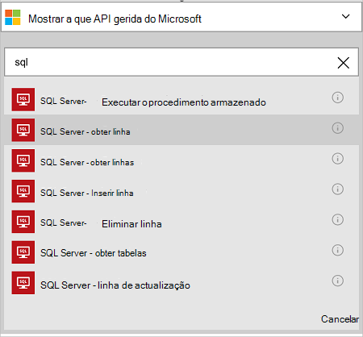
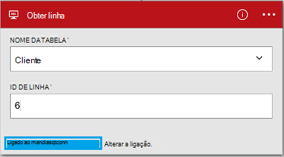

<properties
    pageTitle="Adicionar o conector de base de dados do Azure SQL na suas aplicações de lógica | Microsoft Azure"
    description="Descrição geral do conector de base de dados do Azure SQL com parâmetros REST API"
    services=""
    documentationCenter="" 
    authors="MandiOhlinger"
    manager="anneta"
    editor=""
    tags="connectors"/>

<tags
   ms.service="logic-apps"
   ms.devlang="na"
   ms.topic="article"
   ms.tgt_pltfrm="na"
   ms.workload="na" 
   ms.date="10/18/2016"
   ms.author="mandia"/>

# Começar a trabalhar com o conector de base de dados do Azure SQL
Utilizar o conector de base de dados do Azure SQL, crie fluxos de trabalho para a sua organização gerir os dados nas suas tabelas. 

Base de dados SQL,:

- Crie o seu fluxo de trabalho ao adicionar um novo cliente a uma base de dados de clientes, ou atualizar uma ordem numa base de dados encomendas.
- Utilize as ações para obter uma linha de dados, inserir uma nova linha e até mesmo eliminar. Por exemplo, quando um registo é criado no Dynamics CRM Online (um accionador), em seguida, insira uma linha de uma base de dados do SQL Azure (uma ação). 

Este tópico mostra-lhe como utilizar o conector de base de dados SQL numa aplicação lógica e também lista as ações.

>[AZURE.NOTE] Esta versão do artigo aplica-se para disponibilidade geral lógica aplicações (das versões DG). 

Para saber mais sobre aplicações de lógica, consulte o artigo [o que são as aplicações de lógica](../app-service-logic/app-service-logic-what-are-logic-apps.md) e [criar uma aplicação de lógica](../app-service-logic/app-service-logic-create-a-logic-app.md).

## Ligar à base de dados Azure SQL

Antes de pode aceder a sua aplicação de lógica qualquer serviço, primeiro, criar uma *ligação* ao serviço. Uma ligação fornece conectividade entre uma aplicação de lógica e outro serviço. Por exemplo, para ligar à base de dados SQL, primeiro criar uma *ligação*de base de dados SQL. Para criar uma ligação, introduza as credenciais que normalmente utiliza para aceder ao serviço que está a ligar. Por isso, base de dados SQL, introduza as suas credenciais de base de dados SQL para criar a ligação. 

#### Criar a ligação

>[AZURE.INCLUDE [Create the connection to SQL Azure](../../includes/connectors-create-api-sqlazure.md)]

## Utilize um acionador de

Este conector não tem qualquer accionadores. Utilize os outros accionadores para iniciar a aplicação de lógica, tais como um acionador de periodicidade, um acionador de HTTP Webhook, accionadores disponíveis com outros conectores e muito mais. [Criar uma aplicação de lógica](../app-service-logic/app-service-logic-create-a-logic-app.md) fornece um exemplo.

## Utilizar uma ação
    
Uma ação é uma operação realizada pelo fluxo de trabalho definido numa aplicação de lógica. [Saber mais sobre ações](../app-service-logic/app-service-logic-what-are-logic-apps.md#logic-app-concepts).

1. Selecione o sinal de adição. Verá várias opções: **Adicionar uma ação**, **Adicionar uma condição**ou uma das opções **mais** .

    

2. Selecione **Adicionar uma ação**.

3. Na caixa de texto, escreva "sql" para obter uma lista de todas as ações disponíveis.

     

4. No nosso exemplo, escolha o **SQL Server - obter linha**. Se já existe uma ligação, em seguida, selecione o **nome da tabela** a partir da lista pendente e introduza o **ID de linha** que pretende que seja devolvido.

    

    Se lhe for pedido para as informações de ligação, em seguida, introduza os detalhes para criar a ligação. [Criar a ligação](connectors-create-api-sqlazure.md#create-the-connection) neste tópico descreve estas propriedades. 

    > [AZURE.NOTE] Neste exemplo, vamos devolver uma linha de uma tabela. Para ver os dados nesta linha, adicione outra ação que cria um ficheiro com os campos da tabela. Por exemplo, adicione uma ação do OneDrive que utiliza os campos nome e apelido para criar um novo ficheiro na conta de armazenamento na nuvem. 

5. **Guardar** as suas alterações (canto superior esquerdo da barra de ferramentas). A sua aplicação de lógica está guardada e pode ser activada automaticamente.

## Detalhes técnicos

## Ações de base de dados SQL
Uma ação é uma operação realizada pelo fluxo de trabalho definido numa aplicação de lógica. O conector de base de dados SQL inclui as seguintes ações. 

|Ação|Descrição|
|--- | ---|
|[ExecuteProcedure](connectors-create-api-sqlazure.md#execute-stored-procedure)|Executa um procedimento armazenado no SQL|
|[GetRow](connectors-create-api-sqlazure.md#get-row)|Obtém uma única linha a partir de uma tabela SQL|
|[GetRows](connectors-create-api-sqlazure.md#get-rows)|Obtém linhas de uma tabela SQL|
|[InsertRow](connectors-create-api-sqlazure.md#insert-row)|Insere uma nova linha numa tabela do SQL|
|[Eliminarlinha](connectors-create-api-sqlazure.md#delete-row)|Elimina uma linha de uma tabela SQL|
|[GetTables](connectors-create-api-sqlazure.md#get-tables)|Obtém tabelas a partir de uma base de dados SQL|
|[UpdateRow](connectors-create-api-sqlazure.md#update-row)|Atualiza uma linhas existentes numa tabela do SQL|

### Detalhes de ação

Nesta secção, consulte o artigo os detalhes específicos sobre cada ação, incluindo as propriedades de entrada opcionais ou obrigatórias e qualquer associados com o conector de saída correspondente.

#### Executar o procedimento armazenado
Executa um procedimento armazenado no SQL.  

| Nome da propriedade| Nome a apresentar |Descrição|
| ---|---|---|
|procedimento * | Nome do procedimento | O nome do procedimento armazenado que pretende executar |
|parâmetros * | Parâmetros de entrada | Os parâmetros são dinâmicos e com base no procedimento armazenado que escolher.    Por exemplo, se estiver a utilizar a base de dados de exemplo de Adventure Works, escolha o procedimento armazenado *ufnGetCustomerInformation* . Parâmetro de entrada do **ID de cliente** é apresentado. Introduza "6" ou uma das outras cliente IDs. |

Um asterisco (*) significa que a propriedade é necessária.

##### Detalhes de saída
ProcedureResult: Executa o resultado da execução do procedimento armazenado

| Nome da propriedade | Tipo de dados | Descrição |
|---|---|---|
|OutputParameters|objecto|Valores de parâmetros de saída |
|ReturnCode|número inteiro|Código de um procedimento de retorno |
|Conjuntos de resultados|objecto| Conjuntos de resultados|

#### Obter linha 
Devolve uma única linha de uma tabela SQL.  

| Nome da propriedade| Nome a apresentar |Descrição|
| ---|---|---|
|tabela * | Nome da tabela |Nome da tabela SQL|
|ID de * | Id de linha |Identificador exclusivo da linha para obter|

Um asterisco (*) significa que a propriedade é necessária.

##### Detalhes de saída
Item

| Nome da propriedade | Tipo de dados |
|---|---|
|ItemInternalId|cadeia|

#### Obter linhas 
Obtém linhas de uma tabela SQL.  

|Nome da propriedade| Nome a apresentar|Descrição|
| ---|---|---|
|tabela *|Nome da tabela|Nome da tabela SQL|
|$skip|Contagem de ignorar|Número de entradas para ignorar (predefinição = 0)|
|$top|Contagem de obter máximo|Número máximo de entradas para obter (predefinição = 256)|
|$filter|Consulta de filtro|Uma consulta de filtro ODATA para restringir o número de entradas|
|$orderby|Order By|Uma consulta de OrdenarPor ODATA para especificar a ordem das entradas|

Um asterisco (*) significa que a propriedade é necessária.

##### Detalhes de saída
ItemsList

| Nome da propriedade | Tipo de dados |
|---|---|
|valor|matriz|

#### Inserir linha 
Insere uma nova linha numa tabela do SQL.  

|Nome da propriedade| Nome a apresentar|Descrição|
| ---|---|---|
|tabela *|Nome da tabela|Nome da tabela SQL|
|item *|Linha|Linha para inserir na tabela especificada no SQL|

Um asterisco (*) significa que a propriedade é necessária.

##### Detalhes de saída
Item

| Nome da propriedade | Tipo de dados |
|---|---|
|ItemInternalId|cadeia|

#### Eliminar linha 
Elimina uma linha de uma tabela SQL.  

|Nome da propriedade| Nome a apresentar|Descrição|
| ---|---|---|
|tabela *|Nome da tabela|Nome da tabela SQL|
|ID de *|Id de linha|Identificador exclusivo da linha para eliminar|

Um asterisco (*) significa que a propriedade é necessária.

##### Detalhes de saída
Nenhum.

#### Obter tabelas 
Obtém tabelas a partir de uma base de dados do SQL.  

Não existem parâmetros para esta chamada. 

##### Detalhes de saída 
TablesList

| Nome da propriedade | Tipo de dados |
|---|---|
|valor|matriz|

#### Linha de actualização 
Atualiza uma linha numa tabela do SQL existente.  

|Nome da propriedade| Nome a apresentar|Descrição|
| ---|---|---|
|tabela *|Nome da tabela|Nome da tabela SQL|
|ID de *|Id de linha|Identificador exclusivo da linha para atualizar|
|item *|Linha|Linha com valores actualizados|

Um asterisco (*) significa que a propriedade é necessária.

##### Detalhes de saída  
Item

| Nome da propriedade | Tipo de dados |
|---|---|
|ItemInternalId|cadeia|

### Respostas HTTP

Quando efetuar chamadas para as ações diferentes, poderá receber determinadas respostas. A tabela seguinte descreve as respostas e as respectivas descrições:  

|Nome|Descrição|
|---|---|
|200|OK|
|202|Aceites|
|400|Pedido incorrecto|
|401|Não autorizado|
|403|Proibido|
|404|Não foi encontrado|
|500|Erro de servidor interno. Ocorreu um erro desconhecido|
|predefinido|A operação falhou.|

## Próximos passos

[Criar uma aplicação de lógica](../app-service-logic/app-service-logic-create-a-logic-app.md). Explore as outras conexões disponíveis nas aplicações de lógica na nossa [lista APIs](apis-list.md).
