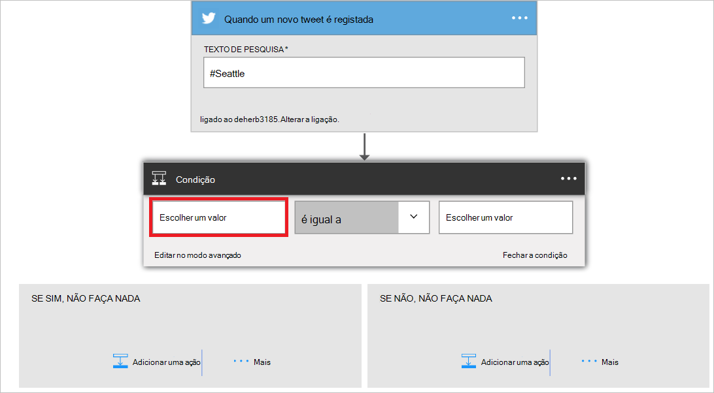

<properties
    pageTitle="Saiba como utilizar o conector de Twitter nas aplicações de lógica | Microsoft Azure"
    description="Descrição geral de conexão Twitter com parâmetros REST API"
    services=""
    documentationCenter="" 
    authors="msftman"
    manager="erikre"
    editor=""
    tags="connectors"/>

<tags
   ms.service="multiple"
   ms.devlang="na"
   ms.topic="article"
   ms.tgt_pltfrm="na"
   ms.workload="na" 
   ms.date="07/18/2016"
   ms.author="deonhe"/>

# Começar a trabalhar com o conector de Twitter

Com o conector de Twitter, pode:

- Publique tweets e obter tweets
- Linhas cronológicas do Access, amigos e seguidores
- Efetuar qualquer uma das outras ações e accionadores descritos a seguir  

Para utilizar [qualquer conexão](./apis-list.md), tem primeiro criar uma aplicação de lógica. Pode começar por [criar uma aplicação de lógica agora](../app-service-logic/app-service-logic-create-a-logic-app.md).  

## Ligar a Twitter

Antes de pode aceder a sua aplicação de lógica qualquer serviço, primeiro tem de criar uma *ligação* ao serviço. Uma [ligação](./connectors-overview.md) fornece conectividade entre uma aplicação de lógica e outro serviço.  

### Criar uma ligação a Twitter

>[AZURE.INCLUDE [Steps to create a connection to Twitter](../../includes/connectors-create-api-twitter.md)]

## Utilize um acionador de Twitter

Um accionador é um evento que pode ser utilizado para iniciar o fluxo de trabalho definido numa aplicação de lógica. [Saiba mais sobre os accionadores](../app-service-logic/app-service-logic-what-are-logic-apps.md#logic-app-concepts).

Neste exemplo, posso irá mostrar-lhe como utilizar o accionador **quando é registada num tweet novo** para procurar #Seattle e, Se #Seattle for encontrada, actualizar um ficheiro no Dropbox com o texto a partir do tweet. Um exemplo de empresa, que poderia para procurar o nome da sua empresa e actualizar uma base de dados do SQL com o texto a partir do tweet.

1. Introduza o *twitter* na caixa de pesquisa no estruturador de aplicações de lógica, em seguida, selecione o accionador **Twitter - quando é registada num tweet novo**   
  
- Introduza *#Seattle* no controlo de **Texto de pesquisa**  
 

Neste momento, a sua aplicação de lógica ter sido configurada com um accionador que começará a execução dos outros accionadores e ações no fluxo de trabalho. 

>[AZURE.NOTE]Para uma aplicação de lógica para serão funcionais, tem de conter pelo menos um accionador e uma ação. Siga os passos na secção seguinte para adicionar uma ação.  

## Adicionar uma condição
Uma vez que recomendamos apenas estiver interessados em tweets de utilizadores com mais de 50 utilizadores, uma condição a confirmar o número de seguidores tem de ser adicionada à aplicação lógica.  

1. Selecione **+ novo passo** para adicionar a ação que gostaria de tomar quando #Seattle encontra-se num tweet novo  
  
- Selecione a ligação **Adicionar uma condição** .  
   
Esta ação abre o controlo de **condição** onde pode verificar condições como *for igual a*, *é menor que*, *for maior do que* *contém*, etc.  
   
- Selecione o controlo de **Escolher um valor** .  
Neste controlo, pode selecionar um ou mais das propriedades a partir de qualquer ações anterior ou accionadores como o valor cuja condição será avaliada como true ou false.
   
- Selecione **…** para expandir a lista de propriedades para que possa ver todas as propriedades que estão disponíveis.        
   
- Selecione a propriedade **count seguidores** .    
   
- Repare a propriedade de contagem seguidores está agora no controlo de valor.    
   
- Selecione **for maior do que** a partir da lista de operadores.    
   
- Introduza 50 como o operando para o operador *for maior do que* .  
A condição agora é adicionada. Guarde o seu trabalho com a ligação de **Guardar** no menu de acima.    
   

## Utilizar uma ação de Twitter

Uma ação é uma operação realizada pelo fluxo de trabalho definido numa aplicação de lógica. [Saber mais sobre ações](../app-service-logic/app-service-logic-what-are-logic-apps.md#logic-app-concepts).  

Agora que adicionou um accionador, siga estes passos para adicionar uma ação que irá registar um novo tweet com os conteúdos de tweets encontrados pelo accionador. Para efeitos deste guia passo a passo serão registados apenas tweets de utilizadores com mais de 50 seguidores.  

No próximo passo, irá adicionar uma ação de Twitter registará num tweet através de alguns das propriedades de cada tweet que foi registado por um utilizador que tenha mais de 50 seguidores.  

1. Selecione **Adicionar uma ação**. Esta ação abre o controlo de pesquisa onde pode procurar outras ações e accionadores.  
   
- Introduza o *twitter* na caixa de pesquisa, em seguida, selecione a ação **Twitter - publicar num tweet** . Esta ação abre o controlo de **mensagem num tweet** onde irá introduzir todos os detalhes para tweet a ser publicado.      
   
- Selecione o controlo de **texto Tweet** . Todos os resultados de ações anterior e accionadores na aplicação lógica agora estão visíveis. Pode selecionar qualquer uma destas e utilizá-los como parte do texto tweet de tweet o novo.     
   
- Selecione o **nome de utilizador**   
- Introduza *diz:* no controlo de texto tweet. Faça isto apenas depois de nome de utilizador.  
- Selecione *Tweet texto*.       
   
- Guardar o seu trabalho e enviar um tweet com o hashtag #Seattle para ativar o seu fluxo de trabalho.  

## Detalhes técnicos

Aqui estão os detalhes sobre accionadores, ações e as respostas que suporta esta ligação:

## Twitter accionadores

O conector de Twitter tem os seguintes accionadores:  

|Accionador | Descrição|
|--- | ---|
|[Quando é registada num tweet novo](connectors-create-api-twitter.md#when-a-new-tweet-is-posted)|Esta operação accionadores um fluxo de quando é registada num tweet nova que corresponde a uma consulta de pesquisa determinado.|

## Ações de twitter

O conector de Twitter tem as seguintes ações:

|Ação|Descrição|
|--- | ---|
|[Obter a linha cronológica de utilizador](connectors-create-api-twitter.md#get-user-timeline)|Esta operação obtém uma lista dos mais recentes tweets publicado por um determinado utilizador.|
|[Obter base da linha cronológica](connectors-create-api-twitter.md#get-home-timeline)|Esta operação obtém a tweets mais recentes e voltar tweets publicados por mim e meu seguidores.|
|[Tweets de pesquisa](connectors-create-api-twitter.md#search-tweets)|Esta operação obtém uma lista de tweets relevantes correspondentes à consulta de pesquisa.|
|[Obter seguidores](connectors-create-api-twitter.md#get-followers)|Esta operação obtém a lista de utilizadores que se seguem um determinado utilizador.|
|[Obter o meu seguidores](connectors-create-api-twitter.md#get-my-followers)|Esta operação obtém a lista de utilizadores que está a seguir-me.|
|[Obter a seguir](connectors-create-api-twitter.md#get-following)|A operação obtém a lista de pessoas a determinado utilizador da seguinte forma.|
|[Obter o meu seguinte](connectors-create-api-twitter.md#get-my-following)|Esta operação obtém a lista de utilizadores que estou a seguir.|
|[Obter o utilizador](connectors-create-api-twitter.md#get-user)|Esta operação obtém os detalhes do perfil para um determinado utilizador, tal como o nome de utilizador, descrição, seguidores contar e mais.|
|[Publicar num tweet](connectors-create-api-twitter.md#post-a-tweet)|Esta operação mensagens num tweet novo.|
## Detalhes de ação

Aqui estão os detalhes das ações e accionadores para este conexão, juntamente com as respectivas respostas:

### Obter a linha cronológica de utilizador
Esta operação obtém uma lista dos mais recentes tweets publicado por um determinado utilizador. 

|Nome da propriedade| Nome a apresentar|Descrição|
| ---|---|---|
|nome de utilizador *|Nome de utilizador|Alça de twitter para o utilizador|
|maxResults|Máximo de resultados|Número máximo de tweets para devolver|

Um * indica que não é necessária uma propriedade

#### Detalhes de saída

TweetModel: Representação de Tweet objeto

| Nome da propriedade | Tipo de dados | Descrição |
|---|---|---|
|TweetText|cadeia|Conteúdo de texto da tweet|
|TweetId|cadeia|ID da tweet|
|CreatedAt|cadeia|Tempo no qual o tweet foi publicada|
|RetweetCount|número inteiro|Número total de tweets novamente para o tweet|
|TweetedBy|cadeia|Nome do utilizador que tem publicou o tweet|
|MediaUrls|matriz|URL do suporte de dados publicadas juntamente com o tweet|
|TweetLanguageCode|cadeia|Código de idioma da tweet|
|TweetInReplyToUserId|cadeia|Id de utilizador do autor da tweet que atuais tweet é uma resposta|
|Favorited|Booleano|Indica se a tweet está marcado como favorited ou não|
|UserMentions|matriz|Lista de utilizadores mencionados a tweet|
|OriginalTweet|não definido|Original tweet a partir da qual é tweeted voltar a tweet atual|
|UserDetails|não definido|Detalhes do utilizador ao qual tweeted|

### Obter base da linha cronológica
Esta operação obtém a tweets mais recentes e voltar tweets publicados por mim e meu seguidores. 

|Nome da propriedade| Nome a apresentar|Descrição|
| ---|---|---|
|maxResults|Máximo de resultados|Número máximo de tweets para devolver|

Um * indica que não é necessária uma propriedade

#### Detalhes de saída

TweetModel: Representação de Tweet objeto

| Nome da propriedade | Tipo de dados | Descrição |
|---|---|---|
|TweetText|cadeia|Conteúdo de texto da tweet|
|TweetId|cadeia|ID da tweet|
|CreatedAt|cadeia|Tempo no qual o tweet foi publicada|
|RetweetCount|número inteiro|Número total de tweets novamente para o tweet|
|TweetedBy|cadeia|Nome do utilizador que tem publicou o tweet|
|MediaUrls|matriz|URL do suporte de dados publicadas juntamente com o tweet|
|TweetLanguageCode|cadeia|Código de idioma da tweet|
|TweetInReplyToUserId|cadeia|Id de utilizador do autor da tweet que atuais tweet é uma resposta|
|Favorited|Booleano|Indica se a tweet está marcado como favorited ou não|
|UserMentions|matriz|Lista de utilizadores mencionados a tweet|
|OriginalTweet|não definido|Original tweet a partir da qual é tweeted voltar a tweet atual|
|UserDetails|não definido|Detalhes do utilizador ao qual tweeted|

### Tweets de pesquisa
Esta operação obtém uma lista de tweets relevantes correspondentes à consulta de pesquisa. 

|Nome da propriedade| Nome a apresentar|Descrição|
| ---|---|---|
|searchQuery *|Texto de pesquisa|Procurar em termos como "" Feliz "hora", #haiku, adora hate ou|
|maxResults|Máximo de resultados|Número máximo de tweets para devolver|

Um * indica que não é necessária uma propriedade

#### Detalhes de saída

TweetModel: Representação de Tweet objeto

| Nome da propriedade | Tipo de dados | Descrição |
|---|---|---|
|TweetText|cadeia|Conteúdo de texto da tweet|
|TweetId|cadeia|ID da tweet|
|CreatedAt|cadeia|Tempo no qual o tweet foi publicada|
|RetweetCount|número inteiro|Número total de tweets novamente para o tweet|
|TweetedBy|cadeia|Nome do utilizador que tem publicou o tweet|
|MediaUrls|matriz|URL do suporte de dados publicadas juntamente com o tweet|
|TweetLanguageCode|cadeia|Código de idioma da tweet|
|TweetInReplyToUserId|cadeia|Id de utilizador do autor da tweet que atuais tweet é uma resposta|
|Favorited|Booleano|Indica se a tweet está marcado como favorited ou não|
|UserMentions|matriz|Lista de utilizadores mencionados a tweet|
|OriginalTweet|não definido|Original tweet a partir da qual é tweeted voltar a tweet atual|
|UserDetails|não definido|Detalhes do utilizador ao qual tweeted|

### Obter seguidores
Esta operação obtém a lista de utilizadores que se seguem um determinado utilizador. 

|Nome da propriedade| Nome a apresentar|Descrição|
| ---|---|---|
|nome de utilizador *|Nome de utilizador|Alça de twitter para o utilizador|
|maxResults|Máximo de resultados|Número máximo de utilizadores para devolver|

Um * indica que não é necessária uma propriedade

#### Detalhes de saída

UserDetailsModel: Detalhes do utilizador Twitter

| Nome da propriedade | Tipo de dados | Descrição |
|---|---|---|
|FullName|cadeia|Nome do utilizador|
|Localização|cadeia|Localização do utilizador|
|ID|número inteiro|Twitter Id do utilizador|
|Nome de utilizador|cadeia|Nome de ecrã do utilizador|
|FollowersCount|número inteiro|Número de seguidores|
|Descrição|cadeia|Descrição do utilizador|
|StatusesCount|número inteiro|Contagem de estado do utilizador|
|FriendsCount|número inteiro|Número de amigos|
|FavouritesCount|número inteiro|Número de tweets que o utilizador tem favorited|
|ProfileImageUrl|cadeia|URL da imagem de perfil|

### Obter o meu seguidores
Esta operação obtém a lista de utilizadores que está a seguir-me. 

|Nome da propriedade| Nome a apresentar|Descrição|
| ---|---|---|
|maxResults|Máximo de resultados|Número máximo de utilizadores para obter|

Um * indica que não é necessária uma propriedade

#### Detalhes de saída

UserDetailsModel: Detalhes do utilizador Twitter

| Nome da propriedade | Tipo de dados | Descrição |
|---|---|---|
|FullName|cadeia|Nome do utilizador|
|Localização|cadeia|Localização do utilizador|
|ID|número inteiro|Twitter Id do utilizador|
|Nome de utilizador|cadeia|Nome de ecrã do utilizador|
|FollowersCount|número inteiro|Número de seguidores|
|Descrição|cadeia|Descrição do utilizador|
|StatusesCount|número inteiro|Contagem de estado do utilizador|
|FriendsCount|número inteiro|Número de amigos|
|FavouritesCount|número inteiro|Número de tweets que o utilizador tem favorited|
|ProfileImageUrl|cadeia|URL da imagem de perfil|

### Obter a seguir
A operação obtém a lista de pessoas a determinado utilizador da seguinte forma. 

|Nome da propriedade| Nome a apresentar|Descrição|
| ---|---|---|
|nome de utilizador *|Nome de utilizador|Alça de twitter para o utilizador|
|maxResults|Máximo de resultados|Número máximo de utilizadores para devolver|

Um * indica que não é necessária uma propriedade

#### Detalhes de saída

UserDetailsModel: Detalhes do utilizador Twitter

| Nome da propriedade | Tipo de dados | Descrição |
|---|---|---|
|FullName|cadeia|Nome do utilizador|
|Localização|cadeia|Localização do utilizador|
|ID|número inteiro|Twitter Id do utilizador|
|Nome de utilizador|cadeia|Nome de ecrã do utilizador|
|FollowersCount|número inteiro|Número de seguidores|
|Descrição|cadeia|Descrição do utilizador|
|StatusesCount|número inteiro|Contagem de estado do utilizador|
|FriendsCount|número inteiro|Número de amigos|
|FavouritesCount|número inteiro|Número de tweets que o utilizador tem favorited|
|ProfileImageUrl|cadeia|URL da imagem de perfil|

### Obter o meu seguinte
Esta operação obtém a lista de utilizadores que estou a seguir. 

|Nome da propriedade| Nome a apresentar|Descrição|
| ---|---|---|
|maxResults|Máximo de resultados|Número máximo de utilizadores para devolver|

Um * indica que não é necessária uma propriedade

#### Detalhes de saída

UserDetailsModel: Detalhes do utilizador Twitter

| Nome da propriedade | Tipo de dados | Descrição |
|---|---|---|
|FullName|cadeia|Nome do utilizador|
|Localização|cadeia|Localização do utilizador|
|ID|número inteiro|Twitter Id do utilizador|
|Nome de utilizador|cadeia|Nome de ecrã do utilizador|
|FollowersCount|número inteiro|Número de seguidores|
|Descrição|cadeia|Descrição do utilizador|
|StatusesCount|número inteiro|Contagem de estado do utilizador|
|FriendsCount|número inteiro|Número de amigos|
|FavouritesCount|número inteiro|Número de tweets que o utilizador tem favorited|
|ProfileImageUrl|cadeia|URL da imagem de perfil|

### Obter o utilizador
Esta operação obtém os detalhes do perfil para um determinado utilizador, tal como o nome de utilizador, descrição, seguidores contar e mais. 

|Nome da propriedade| Nome a apresentar|Descrição|
| ---|---|---|
|nome de utilizador *|Nome de utilizador|Alça de twitter para o utilizador|

Um * indica que não é necessária uma propriedade

#### Detalhes de saída

UserDetailsModel: Detalhes do utilizador Twitter

| Nome da propriedade | Tipo de dados | Descrição |
|---|---|---|
|FullName|cadeia|Nome do utilizador|
|Localização|cadeia|Localização do utilizador|
|ID|número inteiro|Twitter Id do utilizador|
|Nome de utilizador|cadeia|Nome de ecrã do utilizador|
|FollowersCount|número inteiro|Número de seguidores|
|Descrição|cadeia|Descrição do utilizador|
|StatusesCount|número inteiro|Contagem de estado do utilizador|
|FriendsCount|número inteiro|Número de amigos|
|FavouritesCount|número inteiro|Número de tweets que o utilizador tem favorited|
|ProfileImageUrl|cadeia|URL da imagem de perfil|

### Publicar num tweet
Esta operação mensagens num tweet novo. 

|Nome da propriedade| Nome a apresentar|Descrição|
| ---|---|---|
|tweetText|Texto tweet|Texto para ser publicado|
|corpo|Multimédia|Multimédia para publicar exclusivamente|

Um * indica que não é necessária uma propriedade

#### Detalhes de saída

TweetResponseModel: Modelo que representa Tweet registado

| Nome da propriedade | Tipo de dados | Descrição |
|---|---|---|
|TweetId|cadeia|ID da tweet obtido|

### Quando é registada num tweet novo
Esta operação accionadores um fluxo de quando é registada num tweet nova que corresponde a uma consulta de pesquisa determinado. 

|Nome da propriedade| Nome a apresentar|Descrição|
| ---|---|---|
|searchQuery *|Texto de pesquisa|Procurar em termos como "" Feliz "hora", #haiku, adora hate ou|

Um * indica que não é necessária uma propriedade

#### Detalhes de saída

TriggerBatchResponse [TweetModel]

| Nome da propriedade | Tipo de dados |
|---|---|
|valor|matriz|

## Respostas HTTP

Ações e accionadores acima, poderá regressar um ou mais dos seguintes códigos de estado HTTP: 

|Nome|Descrição|
|---|---|
|200|OK|
|202|Aceites|
|400|Pedido incorrecto|
|401|Não autorizado|
|403|Proibido|
|404|Não foi encontrado|
|500|Erro de servidor interno. Ocorreu um erro desconhecido.|
|predefinido|A operação falhou.|

## Próximos passos
[Criar uma aplicação de lógica](../app-service-logic/app-service-logic-create-a-logic-app.md)