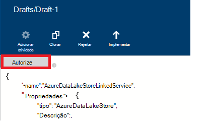

<properties
    pageTitle="Mover os dados para/a partir do Azure dados Lake arquivo | Dados Azure fábrica"
    description="Saiba como mover os dados para a loja de Lake Azure dados utilizando a fábrica de dados do Azure"
    services="data-factory"
    documentationCenter=""
    authors="linda33wj"
    manager="jhubbard"
    editor="monicar"/>

<tags
    ms.service="data-factory"
    ms.workload="data-services"
    ms.tgt_pltfrm="na"
    ms.devlang="na"
    ms.topic="article"
    ms.date="09/27/2016"
    ms.author="jingwang"/>

# Mover os dados de e para a loja de Lake Azure dados utilizando a fábrica de dados do Azure
Este artigo descreve como pode utilizar a atividade de cópia numa fábrica dados Azure para mover os dados ou para Azure dados Lake arquivo para a outra arquivo de dados. Este artigo constrói no artigo do [atividades de movimento de dados](data-factory-data-movement-activities.md) , que apresenta uma descrição geral de movimento de dados com a atividade de cópia e as combinações de arquivo de dados suportadas.

> [AZURE.NOTE]
> Crie uma conta Azure dados Lake loja antes de criar uma tubagem com uma atividade de cópia para mover os dados para a uma loja Azure dados Lake. Para saber mais sobre Azure dados Lake loja, consulte o artigo [Introdução ao Azure dados Lake loja](../data-lake-store/data-lake-store-get-started-portal.md).
>  
> Reveja [construir a sua primeira tutorial de tubagem](data-factory-build-your-first-pipeline.md) para obter passos detalhados para criar uma fábrica de dados, serviços ligados, conjuntos de dados e uma tubagem. Utilize os fragmentos JSON com o Editor de fábrica do mesmo de dados ou Visual Studio ou Azure PowerShell para criar as entidades fábrica de dados.

## Copiar o Assistente de dados
A forma mais fácil para criar uma tubagem que copia dados para a loja do Azure dados Lake é utilizar o Assistente de dados de cópia. Consulte o artigo [Tutorial: criar uma tubagem através do Assistente de cópia](data-factory-copy-data-wizard-tutorial.md) para obter instruções sobre rápido sobre como criar uma tubagem utilizando o Assistente de dados de cópia. 

Os exemplos seguintes fornecem definições de JSON de exemplo que pode utilizar para criar uma tubagem utilizando o [Azure portal](data-factory-copy-activity-tutorial-using-azure-portal.md) ou [Visual Studio](data-factory-copy-activity-tutorial-using-visual-studio.md) ou [Azure PowerShell](data-factory-copy-activity-tutorial-using-powershell.md). Como copiar dados de arquivo de Lake de dados do Azure e armazenamento de Blobs do Azure e para que sejam. No entanto, podem ser copiada **diretamente** a partir de qualquer uma das origens para qualquer um da sumidouros indicado [aqui](data-factory-data-movement-activities.md#supported-data-stores) utilizando a atividade de cópia no Azure dados fábrica dados.  

## Exemplo: Copiar dados de Blobs do Azure ao arquivo de Lake de dados do Azure
O exemplo seguinte mostra:

1.  Um serviço do tipo [AzureStorage](#azure-storage-linked-service-properties)ligado.
2.  Um serviço do tipo [AzureDataLakeStore](#azure-data-lake-linked-service-properties)ligado.
3.  Um [conjunto de dados](data-factory-create-datasets.md) entrada do tipo [AzureBlob](#azure-blob-dataset-type-properties).
4.  Um resultado [conjunto de dados](data-factory-create-datasets.md) do tipo [AzureDataLakeStore](#azure-data-lake-dataset-type-properties).
4.  Uma [tubagem](data-factory-create-pipelines.md) com uma atividade de cópia utiliza [BlobSource](#azure-blob-copy-activity-type-properties) e [AzureDataLakeStoreSink](#azure-data-lake-copy-activity-type-properties).

O exemplo copia séries de tempo dados a partir de um armazenamento de Blobs do Azure ao arquivo do Azure dados Lake cada hora. As propriedades JSON utilizadas nestas amostras são descritas nas secções seguir os exemplos.

**Serviço de armazenamento ligado Azure:**

    {
      "name": "StorageLinkedService",
      "properties": {
        "type": "AzureStorage",
        "typeProperties": {
          "connectionString": "DefaultEndpointsProtocol=https;AccountName=<accountname>;AccountKey=<accountkey>"
        }
      }
    }

**Azure dados Lake ligadas serviço:**

    {
        "name": "AzureDataLakeStoreLinkedService",
        "properties": {
            "type": "AzureDataLakeStore",
            "typeProperties": {
                "dataLakeStoreUri": "https://<accountname>.azuredatalakestore.net/webhdfs/v1",
                "sessionId": "<session ID>",
                "authorization": "<authorization URL>"
            }
        }
    }

### Para criar Azure Lake ligadas serviço de dados utilizando o Editor de fábrica do mesmo de dados
O procedimento seguinte fornece passos para criar um serviço de arquivo de Lake Azure dados ligados utilizando o Editor de fábrica do mesmo de dados.

1. Clique em **arquivo de dados novos** na barra de comandos e selecione **Azure dados Lake loja**.
2. No editor de JSON, para a propriedade **dataLakeStoreUri** , introduza o URI para o lake de dados.
3. Clique em botão de **autorizar** na barra de comando. Deverá visualizar uma janela de pop-up.

    

4. Utilizar as suas credenciais para iniciar sessão e a propriedade de **autorização** na JSON deve ser atribuída a um valor agora.
5. (opcional) Especificar valores para os parâmetros opcionais como **accountName**, **subscriptionID**e **resourceGroupName** a JSON (ou) eliminar estas propriedades do JSON.
6. Na barra de comando para implementar o serviço ligado, clique em **Implementar** .

> [AZURE.IMPORTANT] O código de autorização gerado utilizando o botão **autorizar** expira após algures. **Autorizar** utilizando o **autorizar** botão quando o **token expirar** e novo lançamento o serviço ligado. Consulte a secção [Azure dados Lake ligadas o serviço de arquivo](#azure-data-lake-store-linked-service-properties) para obter detalhes. 

**Conjunto de dados de entrada Blob Azure:**

Dados são selecionados para cima a partir de um novo blob cada hora (frequência: hora, o intervalo: 1). O nome de ficheiro e caminho de pasta para o blob dinamicamente são avaliadas com base na hora de início no setor que está a ser processada. O caminho da pasta utiliza ano, mês e parte do dia da hora de início e nome de ficheiro utiliza a parte da hora da hora de início. "externos": "true" definição informa o serviço de dados fábrica do mesmo que a tabela é a fábrica de dados externa e não é produzida por uma actividade na fábrica de dados.

    {
      "name": "AzureBlobInput",
      "properties": {
        "type": "AzureBlob",
        "linkedServiceName": "StorageLinkedService",
        "typeProperties": {
          "folderPath": "mycontainer/myfolder/yearno={Year}/monthno={Month}/dayno={Day}",
          "partitionedBy": [
            {
              "name": "Year",
              "value": {
                "type": "DateTime",
                "date": "SliceStart",
                "format": "yyyy"
              }
            },
            {
              "name": "Month",
              "value": {
                "type": "DateTime",
                "date": "SliceStart",
                "format": "MM"
              }
            },
            {
              "name": "Day",
              "value": {
                "type": "DateTime",
                "date": "SliceStart",
                "format": "dd"
              }
            },
            {
              "name": "Hour",
              "value": {
                "type": "DateTime",
                "date": "SliceStart",
                "format": "HH"
              }
            }
          ]
        },
        "external": true,
        "availability": {
          "frequency": "Hour",
          "interval": 1
        },
        "policy": {
          "externalData": {
            "retryInterval": "00:01:00",
            "retryTimeout": "00:10:00",
            "maximumRetry": 3
          }
        }
      }
    }

**Azure dados Lake saída conjunto de dados:**

O exemplo copia dados para um arquivo de Azure dados Lake. Novos dados são cópias para dados Lake armazenam cada hora.

    {
        "name": "AzureDataLakeStoreOutput",
        "properties": {
            "type": "AzureDataLakeStore",
            "linkedServiceName": "AzureDataLakeStoreLinkedService",
            "typeProperties": {
                "folderPath": "datalake/output/"
            },
            "availability": {
                "frequency": "Hour",
                "interval": 1
            }
        }
    }

**Gasoduto com uma atividade de cópia:**

A tubagem contém uma atividade de cópia que está configurado para utilizar os conjuntos de dados de entrada e saídos e está agendada para executar a cada hora. No pipeline de definição de JSON, o tipo de **origem** está definido para **BlobSource** e **sink** tipo está definido como **AzureDataLakeStoreSink**.

    {  
        "name":"SamplePipeline",
        "properties":
        {  
            "start":"2014-06-01T18:00:00",
            "end":"2014-06-01T19:00:00",
            "description":"pipeline with copy activity",
            "activities":
            [  
                {
                    "name": "AzureBlobtoDataLake",
                    "description": "Copy Activity",
                    "type": "Copy",
                    "inputs": [
                    {
                        "name": "AzureBlobInput"
                    }
                    ],
                    "outputs": [
                    {
                        "name": "AzureDataLakeStoreOutput"
                    }
                    ],
                    "typeProperties": {
                        "source": {
                            "type": "BlobSource",
                            "treatEmptyAsNull": true,
                            "blobColumnSeparators": ","
                        },
                        "sink": {
                            "type": "AzureDataLakeStoreSink"
                        }
                    },
                    "scheduler": {
                        "frequency": "Hour",
                        "interval": 1
                    },
                    "policy": {
                        "concurrency": 1,
                        "executionPriorityOrder": "OldestFirst",
                        "retry": 0,
                        "timeout": "01:00:00"
                    }
                }
            ]
        }
    }

## Exemplo: Copiar dados a partir do Azure dados Lake loja para BLOBs do Azure
O exemplo seguinte mostra:

1.  Um serviço do tipo [AzureDataLakeStore](#azure-data-lake-linked-service-properties)ligado.
2.  Um serviço do tipo [AzureStorage](#azure-storage-linked-service-properties)ligado.
3.  Um [conjunto de dados](data-factory-create-datasets.md) entrada do tipo [AzureDataLakeStore](#azure-data-lake-dataset-type-properties).
4.  Um resultado [conjunto de dados](data-factory-create-datasets.md) do tipo [AzureBlob](#azure-blob-dataset-type-properties).
5.  Uma [tubagem](data-factory-create-pipelines.md) com uma atividade de cópia utiliza [AzureDataLakeStoreSource](#azure-data-lake-copy-activity-type-properties) e [BlobSink](#azure-blob-copy-activity-type-properties)

O exemplo copia séries de tempo dados a partir de uma loja Azure Lake de dados para um BLOBs do Azure cada hora. As propriedades JSON utilizadas nestas amostras são descritas nas secções seguir os exemplos.

**Arquivo de Lake Azure dados ligados serviço:**

    {
        "name": "AzureDataLakeStoreLinkedService",
        "properties": {
            "type": "AzureDataLakeStore",
            "typeProperties": {
                "dataLakeStoreUri": "https://<accountname>.azuredatalakestore.net/webhdfs/v1",
                "sessionId": "<session ID>",
                "authorization": "<authorization URL>"
            }
        }
    }

> [AZURE.NOTE] Consulte os passos no exemplo anterior para obter um URL de autorização.  

**Serviço de armazenamento ligado Azure:**

    {
      "name": "StorageLinkedService",
      "properties": {
        "type": "AzureStorage",
        "typeProperties": {
          "connectionString": "DefaultEndpointsProtocol=https;AccountName=<accountname>;AccountKey=<accountkey>"
        }
      }
    }

**Azure dados Lake input conjunto de dados:**

Definir **"externos": VERDADEIRO** informa o serviço de dados fábrica do mesmo que a tabela é a fábrica de dados externa e não é produzida por uma actividade na fábrica de dados.

    {
        "name": "AzureDataLakeStoreInput",
        "properties":
        {
            "type": "AzureDataLakeStore",
            "linkedServiceName": "AzureDataLakeStoreLinkedService",
            "typeProperties": {
                "folderPath": "datalake/input/",
                "fileName": "SearchLog.tsv",
                "format": {
                    "type": "TextFormat",
                    "rowDelimiter": "\n",
                    "columnDelimiter": "\t"
                }
            },
            "external": true,
            "availability": {
                "frequency": "Hour",
                "interval": 1
            },
            "policy": {
                "externalData": {
                    "retryInterval": "00:01:00",
                    "retryTimeout": "00:10:00",
                    "maximumRetry": 3
                }
            }
        }
    }

**Conjunto de dados de saída de Blobs do Azure:**

Dados escritos para um novo blob cada hora (frequência: hora, o intervalo: 1). O caminho da pasta para o blob dinamicamente é avaliado com base na hora de início no setor que está a ser processada. O caminho da pasta utiliza ano, mês, dia e partes de horas da hora de início.

    {
      "name": "AzureBlobOutput",
      "properties": {
        "type": "AzureBlob",
        "linkedServiceName": "StorageLinkedService",
        "typeProperties": {
          "folderPath": "mycontainer/myfolder/yearno={Year}/monthno={Month}/dayno={Day}/hourno={Hour}",
          "partitionedBy": [
            {
              "name": "Year",
              "value": {
                "type": "DateTime",
                "date": "SliceStart",
                "format": "yyyy"
              }
            },
            {
              "name": "Month",
              "value": {
                "type": "DateTime",
                "date": "SliceStart",
                "format": "MM"
              }
            },
            {
              "name": "Day",
              "value": {
                "type": "DateTime",
                "date": "SliceStart",
                "format": "dd"
              }
            },
            {
              "name": "Hour",
              "value": {
                "type": "DateTime",
                "date": "SliceStart",
                "format": "HH"
              }
            }
          ],
          "format": {
            "type": "TextFormat",
            "columnDelimiter": "\t",
            "rowDelimiter": "\n"
          }
        },
        "availability": {
          "frequency": "Hour",
          "interval": 1
        }
      }
    }

**Gasoduto com a atividade de cópia:**

A tubagem contém uma atividade de cópia que está configurado para utilizar os conjuntos de dados de entrada e saídos e está agendada para executar a cada hora. No pipeline de definição de JSON, o tipo de **origem** está definido para **AzureDataLakeStoreSource** e **sink** tipo está definido como **BlobSink**.

    {  
        "name":"SamplePipeline",
        "properties":{  
            "start":"2014-06-01T18:00:00",
            "end":"2014-06-01T19:00:00",
            "description":"pipeline for copy activity",
            "activities":[  
                {
                    "name": "AzureDakeLaketoBlob",
                    "description": "copy activity",
                    "type": "Copy",
                    "inputs": [
                      {
                        "name": "AzureDataLakeStoreInput"
                      }
                    ],
                    "outputs": [
                      {
                        "name": "AzureBlobOutput"
                      }
                    ],
                    "typeProperties": {
                        "source": {
                            "type": "AzureDataLakeStoreSource",
                        },
                        "sink": {
                            "type": "BlobSink"
                        }
                    },
                    "scheduler": {
                        "frequency": "Hour",
                        "interval": 1
                    },
                    "policy": {
                        "concurrency": 1,
                        "executionPriorityOrder": "OldestFirst",
                        "retry": 0,
                        "timeout": "01:00:00"
                    }
                }
             ]
        }
    }

## Propriedades do Azure dados Lake ligadas o serviço de arquivo

Pode associar uma conta de armazenamento Azure para uma fábrica de dados Azure utilizando um serviço de armazenamento do Windows Azure ligadas. A tabela seguinte fornece uma descrição para elementos JSON específicas do serviço de armazenamento do Windows Azure ligadas.

| Propriedade | Descrição | Obrigatório |
| :-------- | :----------- | :-------- |
| tipo | A propriedade de tipo tem de estar definida: **AzureDataLakeStore** | Sim |
| dataLakeStoreUri | Especificar informações acerca da conta Azure dados Lake loja. É no seguinte formato: https://<Azure Data Lake account name>.azuredatalakestore.net/webhdfs/v1 | Sim |
| autorização | Clique em botão **autorizar** no **Editor de fábrica do mesmo de dados** e introduza o seu credencial entrada que atribua o URL de autorização gerados automaticamente a esta propriedade.  | Sim |
| ID de sessão | Id da sessão OAuth da sessão de autorização oauth. Cada id da sessão é exclusivo e pode ser utilizada apenas uma vez. Esta definição é gerada automaticamente quando utilizar o Editor de fábrica do mesmo de dados. | Sim |  
| accountName | Nome da conta dados lake | N |
| subscriptionId | Subscrição do Azure ID. | Não (se não for especificado, a subscrição da fábrica dados é utilizada). |
| resourceGroupName |  Nome do grupo de recursos Azure | Não (se não for especificado, grupo de recursos da fábrica dados é utilizado). |

## Expiração do token 
O código de autorização que gerar utilizando o botão **autorizar** expira após algures. Consulte a tabela seguinte para os tempos de expiração para diferentes tipos de contas de utilizador. Poderá ver a seguinte mensagem de erro de mensagens quando a autenticação **token expirar**: "erro de operação de credenciais: invalid_grant - AADSTS70002: erro validar credenciais. AADSTS70008: A conceder acesso fornecido está expirada ou revogado. ID de rastreio: ID de correlação d18629e8-af88-43c5-88e3-d8419eb1fca1: carimbo de data/hora fac30a0c-6be6-4e02-8d69-a776d2ffefd7: 2015-12-15, 21-09-31Z ".

| Tipo de utilizador | Expira após |
| :-------- | :----------- | 
| Contas de utilizador não são geridas pelo Azure Active Directory (@hotmail.com, @live.com, etc.). | 12 horas |
| Contas de utilizadores geridas pelo Azure Active Directory (AAD) | executar 14 dias após o último setor.   cerca de 90 dias, se um setor com base no serviço ligadas com base em OAuth for executado pelo menos uma vez a cada 14 dias. |

Se alterar a palavra-passe antes deste tempo de expiração do token, o token de expira imediatamente e ver o erro mencionado nesta secção. 

Para evitar/resolver este erro, autorizar utilizando o **autorizar** no botão quando o **token expirar** e novo lançamento o serviço ligado. Também pode gerar os valores das propriedades de **ID de sessão** e **autorização** através de programação utilizando código na secção seguinte:

### Para gerar através de programação valores de ID de sessão e autorização 

    if (linkedService.Properties.TypeProperties is AzureDataLakeStoreLinkedService ||
        linkedService.Properties.TypeProperties is AzureDataLakeAnalyticsLinkedService)
    {
        AuthorizationSessionGetResponse authorizationSession = this.Client.OAuth.Get(this.ResourceGroupName, this.DataFactoryName, linkedService.Properties.Type);

        WindowsFormsWebAuthenticationDialog authenticationDialog = new WindowsFormsWebAuthenticationDialog(null);
        string authorization = authenticationDialog.AuthenticateAAD(authorizationSession.AuthorizationSession.Endpoint, new Uri("urn:ietf:wg:oauth:2.0:oob"));

        AzureDataLakeStoreLinkedService azureDataLakeStoreProperties = linkedService.Properties.TypeProperties as AzureDataLakeStoreLinkedService;
        if (azureDataLakeStoreProperties != null)
        {
            azureDataLakeStoreProperties.SessionId = authorizationSession.AuthorizationSession.SessionId;
            azureDataLakeStoreProperties.Authorization = authorization;
        }

        AzureDataLakeAnalyticsLinkedService azureDataLakeAnalyticsProperties = linkedService.Properties.TypeProperties as AzureDataLakeAnalyticsLinkedService;
        if (azureDataLakeAnalyticsProperties != null)
        {
            azureDataLakeAnalyticsProperties.SessionId = authorizationSession.AuthorizationSession.SessionId;
            azureDataLakeAnalyticsProperties.Authorization = authorization;
        }
    }

Consulte os tópicos de [Classe AzureDataLakeStoreLinkedService](https://msdn.microsoft.com/library/microsoft.azure.management.datafactories.models.azuredatalakestorelinkedservice.aspx), [AzureDataLakeAnalyticsLinkedService escolares](https://msdn.microsoft.com/library/microsoft.azure.management.datafactories.models.azuredatalakeanalyticslinkedservice.aspx)e [AuthorizationSessionGetResponse](https://msdn.microsoft.com/library/microsoft.azure.management.datafactories.models.authorizationsessiongetresponse.aspx) para obter detalhes sobre as classes fábrica de dados utilizadas no código. Adicione uma referência a versão de **2.9.10826.1824** do **Microsoft.IdentityModel.Clients.ActiveDirectory.WindowsForms.dll** para a classe de WindowsFormsWebAuthenticationDialog utilizada no código. 
 

## Propriedades do tipo de conjunto de dados Azure dados Lake

Para obter uma lista completa das secções JSON e propriedades que estão disponíveis para a definição de conjuntos de dados, consulte o artigo [criar conjuntos de dados](data-factory-create-datasets.md) . As secções como estrutura, disponibilidade e a política de um conjunto de dados JSON são semelhantes para todos os tipos de conjunto de dados (Azure SQL, BLOBs do Azure, tabela do Azure, etc.).

A secção **typeProperties** é diferente para cada tipo de conjunto de dados e fornece informações sobre a localização, etc., formatar os dados no arquivo de dados. A secção de typeProperties do conjunto de dados do tipo **AzureDataLakeStore** conjunto de dados tem as seguintes propriedades:

| Propriedade | Descrição | Obrigatório |
| :-------- | :----------- | :-------- |
| caminhopasta | Armazenar o caminho para o contentor e uma pasta na Lake de dados Azure. | Sim |
| nome de ficheiro | Nome do ficheiro na loja Azure dados Lake. nome do ficheiro é opcional e entre maiúsculas e minúsculas.   Se especificar um nome de ficheiro, a atividade (incluindo cópia) funciona no ficheiro específico.  Quando não é especificado um nome de ficheiro, cópia inclui todos os ficheiros no caminhopasta de conjunto de dados de entrada.  Quando não é especificado um nome de ficheiro de um conjunto de dados de saída, o nome do ficheiro gerado seria nas seguintes neste formato: dados. <Guid>. txt (por exemplo:: Data.0a405f8a-93ff-4c6f-b3be-f69616f1df7a.txt | N |
| partitionedBy | partitionedBy é uma propriedade opcional. Pode utilizá-lo para especificar um caminhopasta dinâmica e o nome de ficheiro para os dados da série de tempo. Por exemplo, pode ser parametrizada caminhopasta para cada hora de dados. Consulte a secção [utilizar partitionedBy propriedade](#using-partitionedby-property) para obter detalhes e exemplos. | N |
| Formatar | São suportados os seguintes tipos de formato: **TextFormat**, **AvroFormat**, **JsonFormat**, **OrcFormat**, **ParquetFormat**. Defina a propriedade de **tipo** em Formatar para um destes valores. Consulte as secções [Especificando TextFormat](#specifying-textformat), [Especificando AvroFormat](#specifying-avroformat), [Especificando JsonFormat](#specifying-jsonformat), [Especificando OrcFormat](#specifying-orcformat)e [Especificando ParquetFormat](#specifying-parquetformat) para obter detalhes. Se pretender copiar os ficheiros como-é entre com base no ficheiro armazena (cópia binária), pode ignorar a secção formato em ambas as definições do conjunto de dados de entrada e saída.| N
| compressão | Especifique o tipo e o nível de compressão para os dados. Os tipos suportados são: **GZip**, **Deflate**e **BZip2** e níveis de suportados são: **Optimal** e **mais rápida**. Atualmente, as definições de compressão não são suportadas para dados **AvroFormat** ou **OrcFormat**. Para mais informações, consulte a secção de [suporte de compressão](#compression-support) .  | N |

### Utilizar a propriedade partitionedBy
Pode especificar um caminhopasta dinâmica e o nome de ficheiro para os dados da série de tempo com a secção **partitionedBy** , macros de dados fábrica e as variáveis do sistema: SliceStart e SliceEnd, que indicam as horas de início e de fim para um setor dados indicada.

Consulte os artigos [Criar conjuntos de dados](data-factory-create-datasets.md) e [agendar e execução](data-factory-scheduling-and-execution.md) para obter mais detalhes sobre os conjuntos de dados de série de tempo, agendamento e os setores do gráfico de compreender.

#### Exemplo 1

    "folderPath": "wikidatagateway/wikisampledataout/{Slice}",
    "partitionedBy":
    [
        { "name": "Slice", "value": { "type": "DateTime", "date": "SliceStart", "format": "yyyyMMddHH" } },
    ],

Neste exemplo, {setor} é substituído com o valor da variável do sistema SliceStart fábrica de dados no formato (YYYYMMDDHH) especificado. O SliceStart que se refere a hora de início no setor. A caminhopasta é diferente para cada setor. Por exemplo: wikisampledataout/wikidatagateway/2014100103 ou wikisampledataout/wikidatagateway/2014100104

#### Exemplo 2

    "folderPath": "wikidatagateway/wikisampledataout/{Year}/{Month}/{Day}",
    "fileName": "{Hour}.csv",
    "partitionedBy":
     [
        { "name": "Year", "value": { "type": "DateTime", "date": "SliceStart", "format": "yyyy" } },
        { "name": "Month", "value": { "type": "DateTime", "date": "SliceStart", "format": "MM" } },
        { "name": "Day", "value": { "type": "DateTime", "date": "SliceStart", "format": "dd" } },
        { "name": "Hour", "value": { "type": "DateTime", "date": "SliceStart", "format": "hh" } }
    ],

Neste exemplo, ano, mês, dia e hora da SliceStart são extraídos para variáveis separadas que são utilizadas pelo propriedades caminhopasta e nome de ficheiro.

[AZURE.INCLUDE [data-factory-file-format](../../includes/data-factory-file-format.md)]
 

### Suporte de compressão  
Processar grandes conjuntos de dados pode causar congestionamentos e/s e de rede. Por conseguinte, dados comprimidos no armazena podem não só acelerar a transferência de dados através da rede e poupar espaço em disco, mas também trazer melhoramentos significativos ao desempenho no processamento de dados grandes. Atualmente, compressão é suportada para arquivos de dados com base no ficheiro como BLOBs do Azure ou sistema de ficheiros no local.  

Para especificar a compressão de um conjunto de dados, utilize a propriedade de **compressão** no conjunto de dados JSON tal como no exemplo seguinte:   

    {  
        "name": "AzureDatalakeStoreDataSet",  
        "properties": {  
            "availability": {  
                "frequency": "Day",  
                "interval": 1  
            },  
            "type": "AzureDatalakeStore",  
            "linkedServiceName": "DataLakeStoreLinkedService",  
            "typeProperties": {  
                "fileName": "pagecounts.csv.gz",  
                "folderPath": "compression/file/",  
                "compression": {  
                    "type": "GZip",  
                    "level": "Optimal"  
                }  
            }  
        }  
    }  
 
A secção de **compressão** tem duas propriedades:  
  
- **Tipo:** o codec de compressão, que pode ser **GZIP**, **Deflate** ou **BZIP2**.  
- **Nível:** a razão de compressão, que pode ser **Optimal** ou **mais rápida**. 
    - **Mais rápida:** A operação de compressão deve concluir mais rapidamente possível, mesmo se o ficheiro resultante não está optimizada comprimido. 
    - **Optimal**: A operação de compressão deve ser optimizada comprimida, mesmo que a operação demora mais tempo para concluir. 
    
    Para mais informações, consulte o tópico de [Nível de compressão](https://msdn.microsoft.com/library/system.io.compression.compressionlevel.aspx) . 

Suponha que o conjunto de dados de exemplo é utilizado como a saída de uma atividade de cópia. A atividade de cópia comprime os dados de saída com codec GZIP utilizando o rácio ideal e, em seguida, escreve os dados comprimidos para um ficheiro com o nome pagecounts.csv.gz na loja Azure dados Lake.   

Quando especificar propriedade compressão um conjunto de dados entrado JSON, pipeline de lê dados comprimidos da origem. Quando especificar a propriedade de um conjunto de dados de saída JSON, a atividade de cópia pode escrever dados comprimidos para o destino. Eis alguns cenários de exemplo: 

- Dados de leitura GZIP comprimidos a partir de uma loja de Lake do Azure dados, descomprimi-lo e escrever dados de resultado para uma base de dados do Azure SQL. Definir o conjunto de dados do Azure dados Lake loja teclado com a compressão propriedade JSON neste caso. 
- Ler os dados a partir de um ficheiro de texto simples a partir do sistema de ficheiros no local, comprimi-las utilizando o formato de GZip e escrever os dados comprimidos ao arquivo de Lake de dados de Azure. Definir um conjunto de dados da Lake de dados Azure saída com a compressão propriedade JSON neste caso.  
- Ler um dados comprimidos GZIP a partir de uma loja de Lake de dados do Azure, descomprimi-lo, comprimi-lo utilizando BZIP2 e escrever dados de resultados a um arquivo de Lake de dados do Azure. Definir o conjunto de tipo de compressão como GZIP e BZIP2 introduções e conjuntos de dados de saída respetivamente.   

## Propriedades do tipo de dados Lake cópia atividade Azure  
Para obter uma lista completa das secções e propriedades que estão disponíveis para a definição de atividades, consulte o artigo [Criar tubagens](data-factory-create-pipelines.md) . Propriedades, tais como o nome, descrição, de entrada e saída tabelas e política estão disponíveis para todos os tipos de atividades.

Propriedades disponíveis na secção typeProperties da atividade de outro lado variam com cada tipo de atividade. Para actividade de cópia, variar consoante os tipos de origens e sumidouros

**AzureDataLakeStoreSource** suporta a secção de **typeProperties** seguintes propriedades:

| Propriedade | Descrição | Valores permitidos | Obrigatório |
| -------- | ----------- | -------------- | -------- |
| recursivas | Indica se os dados são lidos modo recursivo das pastas sub ou apenas a partir da pasta especificada. | VERDADEIRO (valor predefinido), FALSO | N |

**AzureDataLakeStoreSink** suporta a secção de **typeProperties** seguintes propriedades:

| Propriedade | Descrição | Valores permitidos | Obrigatório |
| -------- | ----------- | -------------- | -------- |
| copyBehavior | Especifica o comportamento de cópia. | **PreserveHierarchy:** preserva a hierarquia de ficheiro na pasta de destino. O caminho do ficheiro de origem para a pasta de origem relativo é idêntico ao relativo caminho do ficheiro de destino para a pasta de destino.  **FlattenHierarchy:** todos os ficheiros da pasta de origem são criados no primeiro nível de pasta de destino. Os ficheiros de destino são criados com o nome de automática gerada.  **MergeFiles:** intercala todos os ficheiros da pasta de origem para um ficheiro. Se o nome de ficheiro/Blob for especificado, o nome do ficheiro Unidas seria o nome especificado; caso contrário, seria nome de ficheiro gerados automaticamente. | N |

[AZURE.INCLUDE [data-factory-structure-for-rectangualr-datasets](../../includes/data-factory-structure-for-rectangualr-datasets.md)]

[AZURE.INCLUDE [data-factory-type-conversion-sample](../../includes/data-factory-type-conversion-sample.md)]

[AZURE.INCLUDE [data-factory-column-mapping](../../includes/data-factory-column-mapping.md)]

## Desempenho e optimização  
Consulte o artigo [desempenho de atividade de cópia e Otimização do guia](data-factory-copy-activity-performance.md) para saber mais sobre os fatores chaves a que o desempenho impacto de movimento de dados (copiar actividade) no Azure fábrica de dados e várias formas para otimizar o-lo.
