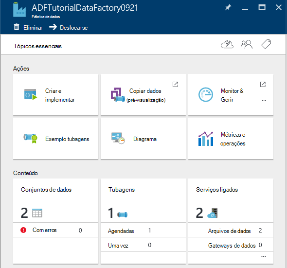

<properties 
    pageTitle="Tutorial: Criar uma tubagem com atividade cópia através do portal Azure | Microsoft Azure" 
    description="Neste tutorial, crie uma pipeline de fábrica do Azure dados com uma atividade de cópia utilizando o Editor de fábrica do mesmo de dados no portal do Azure." 
    services="data-factory" 
    documentationCenter="" 
    authors="spelluru" 
    manager="jhubbard" 
    editor="monicar"/>

<tags 
    ms.service="data-factory" 
    ms.workload="data-services" 
    ms.tgt_pltfrm="na" 
    ms.devlang="na" 
    ms.topic="get-started-article" 
    ms.date="09/16/2016" 
    ms.author="spelluru"/>

# Tutorial: Criar uma tubagem com atividade cópia através do portal Azure
> [AZURE.SELECTOR]
- [Descrição geral e pré-requisitos](data-factory-copy-data-from-azure-blob-storage-to-sql-database.md)
- [Copiar o Assistente](data-factory-copy-data-wizard-tutorial.md)
- [Portal do Azure](data-factory-copy-activity-tutorial-using-azure-portal.md)
- [Visual Studio](data-factory-copy-activity-tutorial-using-visual-studio.md)
- [PowerShell](data-factory-copy-activity-tutorial-using-powershell.md)
- [Modelo do Gestor de recursos Azure](data-factory-copy-activity-tutorial-using-azure-resource-manager-template.md)
- [REST API](data-factory-copy-activity-tutorial-using-rest-api.md)
- [.NET API](data-factory-copy-activity-tutorial-using-dotnet-api.md)

Este tutorial mostra-lhe como criar e monitorizar uma fábrica de dados Azure utilizando o portal do Azure. A tubagem na fábrica dados utiliza uma atividade de copiar para copiar dados de armazenamento de Blobs do Azure para base de dados do SQL Azure.

Eis os passos a que executar como parte deste Tutorial:

Passo | Descrição
-----| -----------
[Criar uma fábrica dados Azure](#create-data-factory) | Neste passo, crie uma fábrica Azure dados com o nome **ADFTutorialDataFactory**.  
[Criar serviços ligados](#create-linked-services) | Neste passo, pode cria dois serviços ligados: **AzureStorageLinkedService** e **AzureSqlLinkedService**.   O AzureStorageLinkedService liga o armazenamento Azure e AzureSqlLinkedService ligações a base de dados do Azure SQL para o ADFTutorialDataFactory. Os dados de entrada para a tubagem reside num contentor de BLOBs nos dados de armazenamento e a saída de Blobs do Azure ser armazenados numa tabela na base de dados Azure SQL. Por conseguinte, adicionar estes arquivos de dados de duas como serviços ligados a fábrica de dados.      
[Criar entrada e saída de conjuntos de dados](#create-datasets) | No passo anterior, criado serviços ligados que se referem à arquivos de dados que contêm os dados de entrada/saída. Neste passo, pode definir dois conjuntos de dados – **InputDataset** e **OutputDataset** – que representam os dados de entrada/saída que estão armazenados nos arquivos de dados.   Para InputDataset, que especificar no contentor de BLOBs que contém um blob com a origem de dados e para o OutputDataset, especificar a tabela de SQL que armazena os dados de saída. Também pode especificar outras propriedades, tais como a estrutura, disponibilidade e a política. 
[Criar uma tubagem](#create-pipeline) | Neste passo, crie uma tubagem denominada **ADFTutorialPipeline** na ADFTutorialDataFactory.   Adicionar uma **atividade de cópia** para o pipeline de dados de cópias de entrada a partir do Azure blob para a tabela do Azure SQL de saída. A atividade de cópia executa o movimento de dados no Azure fábrica de dados. Estiver ligado a por um serviço disponível globalmente que pode copiar dados de entre vários arquivos de dados de forma segura, fiável e dimensionáveis. Consulte o artigo [Dados movimento atividades](data-factory-data-movement-activities.md) artigo para obter detalhes sobre a atividade de cópia. 
[Em curso do monitor](#monitor-pipeline) | Neste passo, monitorizar os setores do gráfico de entrada e saídas tabelas utilizando o Azure portal.

## Pré-requisitos 
Pré-requisitos concluídas listadas no artigo [Descrição geral do Tutorial](data-factory-copy-data-from-azure-blob-storage-to-sql-database.md) antes de executar este tutorial.

## Criar a fábrica de dados
Neste passo, utilize o Azure portal para criar uma fábrica Azure dados com o nome **ADFTutorialDataFactory**.

1.  Depois de início de sessão no [portal do Azure](https://portal.azure.com/), clique em **Novo**, selecione **informações da empresa + Analytics**e clique em **Dados fábrica do mesmo**. 

      

6. No pá **Novo fábrica de dados** :
    1. Introduza **ADFTutorialDataFactory** para o **nome**. 
    
        

        O nome da fábrica dados Azure tem de ser **exclusivo global**. Se receber a seguinte mensagem de erro, altere o nome da fábrica dados (por exemplo, yournameADFTutorialDataFactory) e tente criar novamente. Consulte o tópico de [Dados Factory - as regras de nomenclatura](data-factory-naming-rules.md) para regras de nomenclatura para artefactos fábrica de dados.
    
            Data factory name “ADFTutorialDataFactory” is not available  
     
        
    2. Selecione a sua **subscrição**do Azure.
    3. Para o grupo de recursos, efetue um dos seguintes passos:
        1. Selecione **utilizar existente**e selecione um grupo de recursos existente na lista pendente. 
        2. Selecione **Criar novo**e introduza o nome de um grupo de recursos.   
    
            Alguns dos passos neste tutorial partem do princípio de que utilize o nome: **ADFTutorialResourceGroup** para o grupo de recursos. Para saber mais sobre grupos de recursos, consulte o artigo [utilizar grupos de recursos para gerir os recursos do Azure](../azure-resource-manager/resource-group-overview.md).  
    4. Selecione a **localização** para a fábrica de dados. Apenas as regiões suportados pelo serviço fábrica de dados são apresentadas na lista pendente.
    5. Selecione **Afixar Startboard**.     
    6. Clique em **Criar**.

        > [AZURE.IMPORTANT] Para criar instâncias de fábrica de dados, tem de ser um membro da função [Contribuinte fábrica de dados](../active-directory/role-based-access-built-in-roles.md/#data-factory-contributor) ao nível do grupo de subscrição/recurso.
        >  
        >  O nome da fábrica dados poderá estar registado como um nome DNS no futuro e, consequentemente, ficam publicamente visível.              
9.  Para ver as mensagens de notificação de estado /, clique no ícone de campainha na barra de ferramentas. 

     
10. Após a criação está concluída, verá a **Fábrica de dados** pá conforme mostrado na imagem.

    

## Criar serviços ligados
Serviços ligados ligar arquivos de dados ou calcular serviços a uma fábrica dados Azure. Consulte o artigo [armazena dados suportadas](data-factory-data-movement-activities.md##supported-data-stores-and-formats) para todas as origens e sumidouros suportados pela atividade de cópia. Consulte o artigo [Calcular ligados serviços](data-factory-compute-linked-services.md) para a lista de serviços de cluster suportados por dados fábrica do mesmo. Neste tutorial, não é utilizar qualquer serviço cluster. 

Neste passo, pode cria dois serviços ligados: **AzureStorageLinkedService** e **AzureSqlLinkedService**. AzureStorageLinkedService ligadas ligações de serviço uma conta de armazenamento do Azure e AzureSqlLinkedService liga uma base de dados do Azure SQL ao **ADFTutorialDataFactory**. Criar uma tubagem posteriormente neste tutorial que copia os dados de um contentor de Blobs do AzureStorageLinkedService a uma tabela do SQL no AzureSqlLinkedService.

### Criar um serviço ligado para a conta de armazenamento Azure
1.  No pá **Fábrica de dados** , clique em **autor e implementar** mosaico para iniciar o **Editor de** para a fábrica de dados.

     
5. No **Editor**, clique em **arquivo de dados novos** botão na barra de ferramentas e selecione **armazenamento Azure** a partir do menu pendente. Deverá visualizar o modelo JSON para criar um serviço de armazenamento Azure ligado no painel direito. 

        
6. Substituir `<accountname>` e `<accountkey>` com o nome da conta e valores de chave de conta para a sua conta de armazenamento Azure. 

     
6. Na barra de ferramentas, clique em **Implementar** . Agora deverá ver o airbag **AzureStorageLinkedService** na vista de árvore. 

    

> [AZURE.NOTE]
> Consulte o artigo [mover os dados ou para BLOBs do Azure](data-factory-azure-blob-connector.md#azure-storage-linked-service) para obter mais detalhes acerca das propriedades JSON.

### Criar um serviço ligado para a base de dados do SQL Azure
1. No **Editor de fábrica do mesmo de dados**, clique em **arquivo de dados novos** botão na barra de ferramentas e selecione a **Base de dados do SQL Azure** a partir do menu pendente. Deverá visualizar o modelo JSON para criar o serviço do SQL Azure ligadas no painel direito.
2. Substituir `<servername>`, `<databasename>`, `<username>@<servername>`, e `<password>` com nomes do seu servidor Azure SQL, base de dados, conta de utilizador e palavra-passe. 
3. Clique em **Implementar** na barra de ferramentas para criar e implementar o **AzureSqlLinkedService**.
4. Confirme que está a ver **AzureSqlLinkedService** na vista de árvore. 

> [AZURE.NOTE]
> Consulte o artigo [mover os dados ou para a base de dados do Azure SQL](data-factory-azure-sql-connector.md#azure-sql-linked-service-properties) para obter mais detalhes acerca das propriedades JSON.

## Criar conjuntos de dados
No passo anterior, que criou serviços ligados **AzureStorageLinkedService** e **AzureSqlLinkedService** para ligar uma conta de armazenamento do Windows Azure e a base de dados Azure SQL a fábrica de dados: **ADFTutorialDataFactory**. Neste passo, pode definir dois conjuntos de dados – **InputDataset** e **OutputDataset** – que representam os dados de entrada/saída que estão armazenados nos arquivos de dados referidos por AzureStorageLinkedService e AzureSqlLinkedService, respetivamente. Para InputDataset, que especificar no contentor de BLOBs que contém um blob com a origem de dados e para OutputDataset, especificar a tabela de SQL que armazena os dados de saída. 

### Criar o conjunto de dados de entrada 
Neste passo, criar um conjunto de dados denominado **InputDataset** que aponta para um contentor de Blobs do armazenamento do Windows Azure representada pelo serviço **AzureStorageLinkedService** ligadas.

1. No **Editor** para a fábrica de dados, clique em **... Mais**, clique em **novo conjunto de dados**e clique em **armazenamento de Blobs do Azure** a partir do menu pendente. 

    
2. Substitua JSON no painel direito, o fragmento de JSON seguinte: 

        {
          "name": "InputDataset",
          "properties": {
            "structure": [
              {
                "name": "FirstName",
                "type": "String"
              },
              {
                "name": "LastName",
                "type": "String"
              }
            ],
            "type": "AzureBlob",
            "linkedServiceName": "AzureStorageLinkedService",
            "typeProperties": {
              "folderPath": "adftutorial/",
              "fileName": "emp.txt",
              "format": {
                "type": "TextFormat",
                "columnDelimiter": ","
              }
            },
            "external": true,
            "availability": {
              "frequency": "Hour",
              "interval": 1
            }
          }
        }
        
     Tenha em atenção os seguintes pontos: 
    
    - conjunto de dados **tipo** está definido para **AzureBlob**.
    - **linkedServiceName** está definido para **AzureStorageLinkedService**. Este serviço ligado que criou no passo 2.
    - **caminhopasta** está definido para o contentor **adftutorial** . Também pode especificar o nome de um blob dentro da pasta utilizando a propriedade **nome do ficheiro** . Uma vez que não está a especificar o nome do blob dados a partir de todos os blobs no contentor são considerados como dados de entrada.  
    - Formatar **tipo** está definido para **TextFormat**
    - Existem dois campos no ficheiro de texto – **NomePróprio** e **Apelido** – separado por um caráter de ponto e vírgula (**columnDelimiter**) 
    - A **disponibilidade** está definido para **cada hora** (**frequência** está definido para **hora** e **intervalo** está definido para **1**). Por conseguinte, dados fábrica procura dados de entrada cada hora na pasta de raiz do contentor de BLOBs (**adftutorial**) que especificou. 
    
    Se não especificar um **nome de ficheiro** de um conjunto de dados de **entrada** , todos os ficheiros por blobs a partir da pasta de entrada (**caminhopasta**) são considerados como entradas do tipo. Se especificar um nome de ficheiro a JSON, apenas o especificado ficheiro/blob é considerado asn entrada.
 
    Se não especificar um **nome de ficheiro** para uma **tabela de resultados**, os ficheiros gerados a **caminhopasta** são com nome no seguinte formato: dados. &lt;Guid\&gt;. txt (exemplo: Data.0a405f8a-93ff-4c6f-b3be-f69616f1df7a.txt.).

    Para definir **caminhopasta** e **nome de ficheiro** dinamicamente com base na data e hora **SliceStart** , utilize a propriedade **partitionedBy** . No exemplo seguinte, caminhopasta utiliza ano, mês e dia a partir do SliceStart (hora de início do setor a ser processada) e hora a partir de SliceStart utiliza o nome de ficheiro. Por exemplo, se um setor é endereçados produzido para 2016-09-20T08:00:00, a nomedapasta está definida para wikidatagateway/wikisampledataout/2016/09/20 e o nome de ficheiro está definido para 08.csv. 

            "folderPath": "wikidatagateway/wikisampledataout/{Year}/{Month}/{Day}",
            "fileName": "{Hour}.csv",
            "partitionedBy": 
            [
                { "name": "Year", "value": { "type": "DateTime", "date": "SliceStart", "format": "yyyy" } },
                { "name": "Month", "value": { "type": "DateTime", "date": "SliceStart", "format": "MM" } }, 
                { "name": "Day", "value": { "type": "DateTime", "date": "SliceStart", "format": "dd" } }, 
                { "name": "Hour", "value": { "type": "DateTime", "date": "SliceStart", "format": "hh" } } 
            ],
2. Clique em **Implementar** na barra de ferramentas para criar e implementar o conjunto de dados **InputDataset** . Confirme que está a ver o **InputDataset** na vista de árvore.

> [AZURE.NOTE]
> Consulte o artigo [mover os dados ou para BLOBs do Azure](data-factory-azure-blob-connector.md#azure-blob-dataset-type-properties) para obter mais detalhes acerca das propriedades JSON.

### Criar o conjunto de dados de saída
Nesta parte do passo, criar um conjunto de dados de saída com o nome **OutputDataset**. Pontos este conjunto de dados a uma tabela SQL na base de dados Azure SQL representada pelo **AzureSqlLinkedService**. 

1. No **Editor** para a fábrica de dados, clique em **... Mais**, clique em **novo conjunto de dados**e clique em **Azure SQL** a partir do menu pendente. 
2. Substitua JSON no painel direito, o fragmento de JSON seguinte:

        {
          "name": "OutputDataset",
          "properties": {
            "structure": [
              {
                "name": "FirstName",
                "type": "String"
              },
              {
                "name": "LastName",
                "type": "String"
              }
            ],
            "type": "AzureSqlTable",
            "linkedServiceName": "AzureSqlLinkedService",
            "typeProperties": {
              "tableName": "emp"
            },
            "availability": {
              "frequency": "Hour",
              "interval": 1
            }
          }
        }
        
     Tenha em atenção os seguintes pontos: 
    
    - conjunto de dados **tipo** está definido para **AzureSQLTable**.
    - **linkedServiceName** está definido para **AzureSqlLinkedService** (criou este serviço ligado no passo 2).
    - **tabela** está definido para **emp**.
    - Existem três colunas – **ID**, **NomePróprio**e **Apelido** – na tabela emp na base de dados. ID de é uma coluna de identidade, pelo que necessita especificar apenas **NomePróprio** e **Apelido** aqui.
    - A **disponibilidade** está definido para **cada hora** (**frequência** definir a **hora** e **intervalo** de definido para **1**).  O serviço de dados fábrica gera um setor de dados de saída cada hora na tabela **emp** na base de dados Azure SQL.

3. Clique em **Implementar** na barra de ferramentas para criar e implementar o conjunto de dados **OutputDataset** . Confirme que está a ver o **OutputDataset** na vista de árvore. 

> [AZURE.NOTE]
> Consulte o artigo [mover os dados ou para a base de dados do Azure SQL](data-factory-azure-sql-connector.md#azure-sql-linked-service-properties) para obter mais detalhes acerca das propriedades JSON.

## Criar em curso
Neste passo, criar uma tubagem com uma **Cópia atividade** que utiliza **InputDataset** como entrada e **OutputDataset** como saída.

1. No **Editor** para a fábrica de dados, clique em **... Mais**e clique em **novo em curso**. Em alternativa, pode com o botão direito **tubagens** na vista de árvore e clique em **novo em curso**.
2. Substitua JSON no painel direito, o fragmento de JSON seguinte: 
        
        {
          "name": "ADFTutorialPipeline",
          "properties": {
            "description": "Copy data from a blob to Azure SQL table",
            "activities": [
              {
                "name": "CopyFromBlobToSQL",
                "type": "Copy",
                "inputs": [
                  {
                    "name": "InputDataset"
                  }
                ],
                "outputs": [
                  {
                    "name": "OutputDataset"
                  }
                ],
                "typeProperties": {
                  "source": {
                    "type": "BlobSource"
                  },
                  "sink": {
                    "type": "SqlSink",
                    "writeBatchSize": 10000,
                    "writeBatchTimeout": "60:00:00"
                  }
                },
                "Policy": {
                  "concurrency": 1,
                  "executionPriorityOrder": "NewestFirst",
                  "retry": 0,
                  "timeout": "01:00:00"
                }
              }
            ],
            "start": "2016-07-12T00:00:00Z",
            "end": "2016-07-13T00:00:00Z"
          }
        } 

    Tenha em atenção os seguintes pontos:

    - Na secção de atividades, existe apenas uma atividade cujo **tipo** está definido para **Copiar**.
    - Modo de entrada para a atividade está definido para **InputDataset** e saída da atividade de está definida para **OutputDataset**.
    - Na secção **typeProperties** , **BlobSource** for especificada como o tipo de origem e **SqlSink** for especificada como o tipo de sink.

    Substitua o valor da propriedade **Iniciar** com o valor de dia e de **fim** atual com o dia seguinte. Pode especificar apenas a parte de data e ignorar a parte da hora de data hora. Por exemplo, "2016-02-03", que equivale às "2016-02-03T00:00:00Z"
    
    Inicie o ambos e final DataHora tem de estar no [formato ISO](http://en.wikipedia.org/wiki/ISO_8601). Por exemplo: 2016-10-14T16:32:41Z. A hora de **fim** é opcional, mas utilizamos neste tutorial. 
    
    Se não especificar valor da propriedade de **fim** , é calculada como "**Iniciar + 48 horas**". Para executar a tubagem indefinidamente, especifique a **9999-09-09** como o valor da propriedade de **fim** .
    
    No exemplo anterior, existem 24 dados os setores do gráfico cada setor de dados é produzido por hora.
    
4. Clique em **Implementar** na barra de ferramentas para criar e implementar o **ADFTutorialPipeline**. Confirme que está a ver a tubagem na vista de árvore. 
5. Agora, feche o **Editor de** pá ao clicar em **X**. Clique no **X** novamente para ver a página de base de **Dados fábrica** para o **ADFTutorialDataFactory**.

**Parabéns!** Ter criado uma fábrica dados Azure, serviços ligados, tabelas e uma tubagem e agendada pipeline de com êxito.   
 
### Ver a fábrica de dados numa vista de diagrama 
1. No pá **Fábrica de dados** , clique em **diagrama**.

    
2. Deverá visualizar o diagrama semelhante a imagem seguinte: 

    

    Pode ampliar, reduzir, zoom a 100%, zoom ajustar, automaticamente posicionar tubagens e tabelas e mostrar informações de linhagem da (realça montante e descendentes itens dos itens seleccionados).  Pode fazer duplo clique de um objeto (tabela de entrada/saída ou em curso) para ver as propriedades do mesmo. 
3. Botão direito do rato **ADFTutorialPipeline** na vista de diagrama e clique em **Abrir em curso**. 

    
4. Deverá ver as atividades no pipeline de juntamente com conjuntos de dados de entrada e saídos para as atividades. Neste tutorial, tem apenas uma atividade no pipeline de (copiar actividade) com InputDataset como conjunto de dados de entrada e OutputDataset como conjunto de dados de saída.   

    
5. Clique em **fábrica de dados** na navegação de trilho no canto superior esquerdo para voltar à vista de diagrama. A vista de diagrama apresenta todas as tubagens. Neste exemplo, apenas ter criado uma tubagem.   
 

## Em curso do monitor
Neste passo, utilize o portal do Azure para monitorizar o que é o problema numa fábrica dados Azure. 

### Em curso monitor utilizando a vista de diagrama

1. Clique em **X** para fechar a vista de **diagrama** para ver a página de base de dados fábrica para a fábrica de dados. Se tiver fechado o browser, execute os seguintes passos: 
    2. Navegue até ao [Azure portal](https://portal.azure.com/). 
    2. Faça duplo clique em **ADFTutorialDataFactory** na **Startboard** (ou) clique em **fábricas de dados** no menu à esquerda e pesquise por ADFTutorialDataFactory. 
3. Deverá ver a contagem e os nomes das tabelas e pipeline que criou neste pá.

    
4. Agora, clique em mosaico de **conjuntos de dados** .
5. Na pá **conjuntos de dados** , clique em **InputDataset**. Este conjunto de dados é o conjunto de dados de entrada para **ADFTutorialPipeline**.

       
5. Clique em **... (reticências)** Para ver todos os dados os setores do gráfico.

      

    Repare que todos os setores dados até a hora atual estão **prontas** porque o ficheiro **emp.txt** existe sempre no contentor de BLOBs: **adftutorial\input**. Confirme que os setores do gráfico não aparecem na secção **setores recentemente falhados** na parte inferior.

    Listas tanto **actualizado recentemente os setores do gráfico** e **tiver falhado recentemente os setores do gráfico** são ordenadas pela **hora da última ATUALIZAÇÃO**. 
    
    Clique em **filtro** na barra de ferramentas para filtrar os setores.  
    
    
6. Feche as lâminas até ver a pá **conjuntos de dados** . Clique na **OutputDataset**. Este conjunto de dados é o conjunto de dados de saída para **ADFTutorialPipeline**.

    
6. Deverá visualizar a pá **OutputDataset** conforme apresentado na seguinte imagem:

     
7. Repare que já tenham sido produzidos os setores dados até a hora atual estiverem **prontas**. Os setores do gráfico não aparecem na secção **problema os setores do gráfico** na parte inferior.
8. Clique em **... (Reticências)** Para ver todos os setores.

    
9. Clique em qualquer setor de dados a partir da lista e deverá ver o pá **setor de dados** .

    
  
    Se não estiver no setor no estado **pronta** , pode ver os montante os setores do gráfico que não estão prontos e que estejam a impedir o setor atual a partir de executar na lista de **montante os setores do gráfico que são ainda não está prontos** .
11. No pá **SETOR de dados** , deverá ver que toda a actividade é executado na lista na parte inferior. Clique numa **atividade executar** para ver o pá **atividade executar detalhes** . 

    
12. Clique em **X** para fechar todas as lâminas até chegar novamente para o separador base para o **ADFTutorialDataFactory**.
14. (opcional) Clique em **tubagens** na home page para **ADFTutorialDataFactory**, clique **ADFTutorialPipeline** na pá **tubagens** e agregar através de tabelas (**Consumed**) de entrada ou saída tabelas (**produzidos**).
15. Iniciação **SQL Server Management Studio**, ligar à base de dados do SQL Azure e certifique-se de que as linhas são inseridas em à tabela de **emp** na base de dados.

    

### Monitorizar pipeline através do Monitor gerir App
Também pode utilizar o Monitor e gerir aplicações para monitorizar a sua tubagens. Para obter informações detalhadas sobre como utilizar esta aplicação, consulte o artigo [Monitor e gerir tubagens Azure fábrica de dados utilizando a monitorização e gestão de aplicação](data-factory-monitor-manage-app.md).

1. Clique em mosaico **Monitor e gerir** na home page do seu fábrica de dados.

     
2. Deverá ver **Monitor e gerir aplicações**. Altere a **hora de início** e **hora de fim** para incluir iniciar (2016-07 12) e terminar vezes (2016-07-13) do seu pipeline e clique em **Aplicar**. 

     
3. Selecione uma janela de atividade na lista de **Atividade Windows** para ver os detalhes acerca do mesmo. 
    

## Resumo 
Neste tutorial, que criou uma fábrica Azure dados para copiar dados a partir de um Azure blob para uma base de dados do Azure SQL. Portal do Azure que utilizou para criar a fábrica de dados, serviços ligados, conjuntos de dados e uma tubagem. Eis os passos de alto nível executado neste tutorial:  

1.  Criado um Azure **fábrica de dados**.
2.  Criadas **ligados serviços**:
    1. Um serviço de **Armazenamento do Windows Azure** ligada para ligar a sua conta de armazenamento do Windows Azure que detém dados de entrada.    
    2. Um serviço de ligadas **Azure SQL** para ligar a sua base de dados do Azure SQL que contém os dados de saída. 
3.  Criar **conjuntos de dados** que descrevem os dados de entrada e dados de saída para tubagens.
4.  Criado uma **pipeline de** com uma **Atividade de cópia** com **BlobSource** como origem e **SqlSink** como sink.  

## Consulte também
| Tópico | Descrição |
| :---- | :---- |
| [Atividades de movimento de dados](data-factory-data-movement-activities.md) | Este artigo fornece informações detalhadas sobre a atividade de cópia utilizados no tutorial. |
| [Agendamento e execução](data-factory-scheduling-and-execution.md) | Este artigo explica os aspectos agendamento e execução de modelo de aplicação do Azure fábrica de dados. |
| [Tubagens](data-factory-create-pipelines.md) | Este artigo ajuda-o a compreender tubagens e atividades no Azure fábrica de dados. |
| [Conjuntos de dados](data-factory-create-datasets.md) | Este artigo ajuda-o a compreender conjuntos de dados no Azure fábrica de dados.
| [Monitorizar e gerir tubagens utilizando a aplicação de monitorização](data-factory-monitor-manage-app.md) | Este artigo descreve como monitorizar, gerir e depurar tubagens utilizando a monitorização e gestão de aplicação. 

