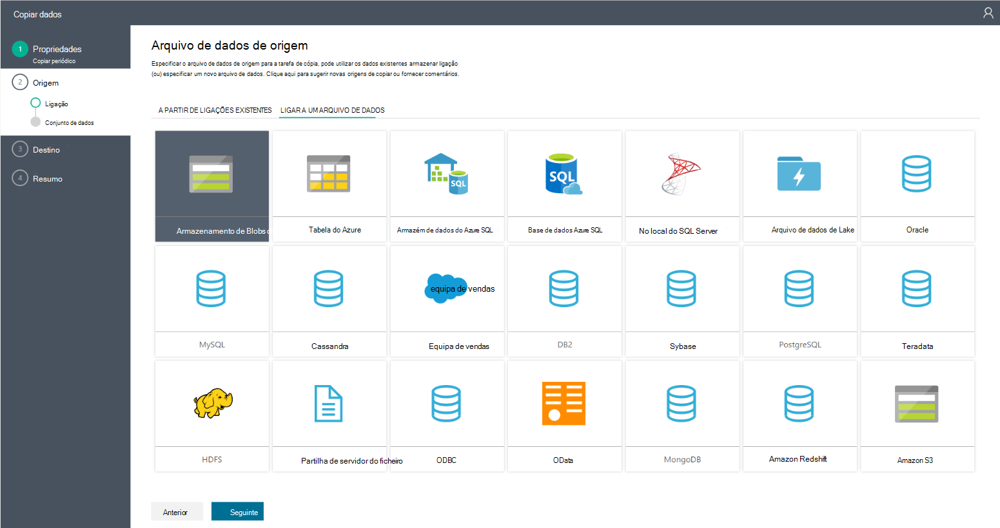

<properties
    pageTitle="Assistente para copiar dados fábrica | Microsoft Azure"
    description="Saiba mais sobre como utilizar o Assistente para copiar dados fábrica para copiar dados de origens de dados suportadas para sumidouros."
    services="data-factory"
    documentationCenter=""
    authors="spelluru"
    manager="jhubbard"
    editor="monicar"/>

<tags
    ms.service="data-factory"
    ms.workload="data-services"
    ms.tgt_pltfrm="na"
    ms.devlang="na"
    ms.topic="article"
    ms.date="09/29/2016"
    ms.author="spelluru"/>

# Assistente para copiar dados fábrica
O Assistente de cópia de fábrica do Azure dados está para facilitar o processo de dados ingesting, que são normalmente um primeiro passo num cenário de integração de dados de fim para fim. Quando aceder através do Assistente de cópia de fábrica do Azure dados, não é necessário compreender quaisquer definições JSON para serviços ligados, conjuntos de dados e tubagens. No entanto, depois de concluir todos os passos no assistente, o assistente cria automaticamente uma tubagem para copiar dados de origem de dados selecionada para o destino seleccionado. Além disso, o Assistente para copiar ajuda-o para validar os dados que está a ser penetração no momento da criação de conteúdos, guarda muito do seu tempo, especialmente quando é ingesting dados pela primeira vez da origem de dados. Para iniciar o Assistente para copiar, clique no mosaico **copiar dados** na home page da sua fábrica de dados.

## Um assistente intuitivo para copiar os dados
Este assistente permite-lhe facilmente mover dados de uma grande variedade de origens de para destinos em minutos. Depois de ir através do assistente, uma tubagem com uma atividade de cópia é criada automaticamente juntamente com entidades dependentes fábrica de dados (serviços ligados e conjuntos de dados). Sem passos adicionais são necessários para criar as em curso.   

> [AZURE.NOTE] Consulte o artigo [tutorial de copiar o Assistente do](data-factory-copy-data-wizard-tutorial.md) artigo para obter instruções passo a passo para criar uma tubagem de exemplo para copiar dados a partir de um Azure blob a uma tabela de base de dados do Azure SQL. 

O Assistente destina-se com dados grandes deve ter em conta a partir do início. É simples e eficiente de autor tubagens fábrica de dados que mover centenas de pastas, ficheiros ou tabelas utilizando o Assistente de dados de cópia. O assistente suporta as seguintes funcionalidades de três: pré-visualização de dados automática, captura esquema e mapeamento e filtragem de dados. 

## Pré-visualização de dados automática 
O Assistente para copiar permite-lhe rever parte dos dados da origem de dados selecionados por si validar se os dados é os dados corretos que pretende copiar. Além disso, se a origem de dados num ficheiro de texto, o Assistente para copiar analisa o ficheiro de texto para obter informações sobre esquemas e delimitadores de coluna e linha automaticamente. 

## Captura de esquema e mapeamento 
O esquema de dados de entrada poderá não corresponder o esquema de dados de saída em alguns casos. Neste cenário, tem de mapear as colunas de esquema de origem para as colunas a partir do esquema de destino. 

O Assistente para copiar mapas automaticamente colunas no esquema de origem para as colunas no esquema de destino. Pode substituir os mapeamentos utilizando as listas pendentes (ou) especificar se uma coluna tem de ser ignorada ao copiar os dados.   

## Filtrar dados  
O assistente permite-lhe filtrar dados de origem para selecionar apenas os dados que tem de ser copiado para o arquivo de dados de destino/sink. Filtragem reduz o volume dos dados sejam copiados para o arquivo de dados sink e, por conseguinte, melhora o débito da operação de cópia. Fornece uma forma flexível para filtrar dados numa base de dados relacional utilizando SQL consulta idioma (ou) ficheiros numa pasta do BLOBs do Azure utilizando [funções fábrica de dados e variáveis](data-factory-functions-variables.md).   

### A filtragem de dados numa base de dados  
No exemplo, a consulta SQL utiliza o `Text.Format` função e `WindowStart` variável. 

### A filtragem de dados numa pasta do BLOBs do Azure
Pode utilizar variáveis no caminho da pasta para copiar dados de uma pasta que é determinada tempo de execução com base em [variáveis do sistema](data-factory-functions-variables.md#data-factory-system-variables). As variáveis suportadas são: **{"ano"}**, **{"mês"}**, **{dia}**, **{hora}**, **{minuto}**e **{personalizado}**. Exemplo: inputfolder / {"ano"} / {mês} / {dia}.

Suponha que tem de entrada pastas no seguinte formato:

    2016/03/01/01
    2016/03/01/02
    2016/03/01/03
    ...

Clique no botão **Procurar** para **ficheiro ou pasta**, procure uma destas pastas (por exemplo, 2016 -> 03 -> 01 -> 02) e clique em **Escolher**. Deverá visualizar `2016/03/01/02` na caixa de texto. Agora, substitua **2016** **{"ano"}**, **03** com **{mês}**, **01** com **{dia}**e **02** **{**hora} e prima a tecla Tab. Deverá ver listas pendentes para selecionar o formato para este quatro variáveis:

   

Como apresentado na captura de ecrã seguinte, também pode utilizar uma variável **personalizado** e [suportadas cadeias de formato](https://msdn.microsoft.com/library/8kb3ddd4.aspx). Para selecionar uma pasta com essa estrutura, utilize o botão **Procurar** pela primeira vez. Em seguida, substitua um valor **{personalizado}**e prima a tecla Tab para ver a caixa de texto onde pode escrever a cadeia do formato.     

## Suporte para diversificados dados e tipos de objeto
Ao utilizar o Assistente para copiar, pode mover forma eficiente centenas de pastas, ficheiros ou tabelas.

## Opções de agendamento
Pode executar a operação de copiar apenas uma vez ou uma agenda (hora a hora, diariamente, e assim sucessivamente). Ambas as opções podem ser utilizadas para boca das conexões no local, na nuvem e cópia local de ambiente de trabalho.

Uma operação de cópia únicos permite apenas uma vez movimento de dados de uma origem de um destino. Aplica-se aos dados de qualquer tamanho e qualquer formato suportado. A cópia agendada permite-lhe copiar dados de uma periodicidade prescrita. Pode utilizar as definições de ricos (como repetir, tempo limite e alertas) para configurar a cópia agendada.

## Próximos passos
Para instruções rápida de utilizar o Assistente de cópia de fábrica do mesmo de dados para criar uma tubagem com cópia atividade, consulte o artigo [Tutorial: criar uma tubagem utilizando o Assistente de cópia](data-factory-copy-data-wizard-tutorial.md).
