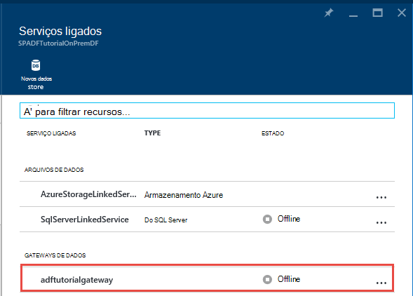

<properties 
    pageTitle="O Data Management Gateway para dados fábrica | Microsoft Azure"
    description="Configure um gateway de dados para mover dados entre no local e na nuvem. Utilize o Data Management Gateway no Azure dados fábrica para mover os seus dados." 
    services="data-factory" 
    documentationCenter="" 
    authors="linda33wj" 
    manager="jhubbard" 
    editor="monicar"/>

<tags 
    ms.service="data-factory" 
    ms.workload="data-services" 
    ms.tgt_pltfrm="na" 
    ms.devlang="na" 
    ms.topic="article" 
    ms.date="10/11/2016" 
    ms.author="jingwang"/>

# O Data Management Gateway
O Data Management Gateway é um agente do cliente que tem de instalar no seu ambiente no local para copiar dados entre arquivos de dados na nuvem e no local. Os arquivos de dados no local suportados pela fábrica de dados estão listados na secção de [origens de dados suportados](data-factory-data-movement-activities.md##supported-data-stores) . 

> [AZURE.NOTE] Atualmente, gateway suporta apenas a atividade de cópia e atividade do procedimento armazenado na fábrica de dados. Não é possível utilizar o gateway a partir de uma atividade personalizada para ter acesso a origens de dados no local. 

Este artigo completa guiadas na [mover dados entre no local e na nuvem arquivos de dados](data-factory-move-data-between-onprem-and-cloud.md) artigo. No tutorial, crie uma tubagem que utiliza o gateway para mover os dados a partir de uma base de dados do SQL Server no local para uma BLOBs do Azure. Este artigo fornece informações aprofundadas detalhadas sobre o Data Management Gateway.   

## Descrição geral

### Capacidades de gateway de gestão de dados
O Data Management Gateway fornece as seguintes capacidades:

- Modelo de origens de dados no local e na nuvem origens de dados dentro da mesma fábrica de dados e mover os dados.
- Têm um painel único de vidro de monitorização e gestão com visibilidade do Estado do gateway a partir do pá a fábrica de dados.
- Gerir o acesso a origens de dados no local em segurança.
    - Sem alterações necessárias para firewall da empresa. Apenas gateway faz com que ligações de baseado em HTTP saída para abrir da internet.
    - Encripte as credenciais para a sua arquivos de dados no local com o seu certificado.
- Mover dados de forma eficaz: os dados são transferidos em paralelo, problemas de rede e são para intermitentes com a opção auto a lógica de repetição.

### Comando fluxo e fluxo de dados
Quando utiliza uma atividade de copiar para copiar dados entre no local e na nuvem, a atividade utiliza um gateway para transferir dados de origem de dados no local à nuvem e vice versa.

Dados de alto nível aqui fluxo para e resumo dos passos para copiar com gateway de dados: 

1.  Programador do dados cria um gateway para uma fábrica de dados do Azure utilizando o [Azure portal](https://portal.azure.com) ou o [Cmdlet do PowerShell](https://msdn.microsoft.com/library/dn820234.aspx). 
2.  Programador do dados cria um serviço ligado para um arquivo de dados no local ao especificar o gateway. Como parte do como configurar o serviço ligado, o Programador de dados utiliza a aplicação de definir as credenciais para especificar tipos de autenticação e as credenciais.  A caixa de diálogo de aplicação de definir as credenciais comunica com o arquivo de dados para testar a ligação e o gateway para guardar as credenciais.
3. Gateway encripta as credenciais com o certificado associado do gateway (fornecido pelo programador de dados), antes de guardar as credenciais na nuvem.
4. Serviço de dados de fábrica do mesmo comunica com o gateway para agendamento e gestão de projectos através de um canal de controlo que utiliza uma fila de bus serviço Azure partilhado. Quando uma tarefa de cópia de actividades necessita de ser pontapés, dados fábrica filas o pedido juntamente com informações de credenciais. Gateway lançados a tarefa depois de fila de espera de consulta.
5.  O gateway desencripta as credenciais com o mesmo certificado e, em seguida, liga-se para o arquivo de dados no local com o tipo de autenticação adequado e as credenciais.
6.  O gateway copia os dados a partir de um arquivo no local para um armazenamento em nuvem, ou vice versa dependendo de como a atividade de cópia é configurada no pipeline de dados. Para este passo, o gateway diretamente a comunica com serviços de armazenamento baseada na nuvem como o armazenamento de Blobs do Azure através de um canal seguro do (HTTPS).

### Considerações para utilizar o gateway
- Uma única instância do Data Management Gateway pode ser utilizada para várias origens de dados no local. No entanto, **uma instância de gateway única está associada a apenas uma fábrica de dados Azure** e não pode ser partilhado com outra fábrica de dados.
- Pode ter **apenas uma instância do Data Management Gateway** instalado num único computador. Suponha, tem duas fábricas de dados que precisam de ter acesso a origens de dados no local, tem de instalar gateways em dois computadores no local. Por outras palavras, um gateway está associado a uma fábrica de dados específicos
- O **gateway não precisa de estar instalado no mesmo computador como origem de dados**. No entanto, ter gateway mais perto à origem de dados reduz o tempo para o gateway ligar à origem de dados. Recomendamos que instale o gateway num computador que é a diferença entre aquele que aloja a origem de dados no local. Quando a gateway e origem de dados estão em computadores diferentes, o gateway não competir para recursos a origem de dados.
- Pode ter **várias gateways em computadores diferentes, ligar-se para o mesmo valor no local origem de dados**. Por exemplo, poderá ter dois gateways funcionar devem dados mas mesma origem de dados no local está registada com ambas as fábricas de dados.
- Se já tiver um gateway instalado no seu computador que serve um cenário de **Power BI** , instale um **gateway separada para Azure dados fábrica** noutro computador.
- Deve ser utilizado gateway mesmo quando utilizar **ExpressRoute**.
- Tratar a sua origem de dados como uma origem de dados no local (que esteja protegido por uma firewall) mesmo quando utiliza **ExpressRoute**. Utilize o gateway para estabelecer ligação entre o serviço e à origem de dados.
- Tem de **utilizar o gateway** mesmo se o arquivo de dados é na nuvem num **Azure IaaS VM**. 

## Instalação

### Pré-requisitos
- As versões de **sistemas operativos** suportadas são Windows 7, Windows 8/8.1, Windows 10, Windows Server 2008 R2, Windows Server 2012, Windows Server 2012 R2. Atualmente, instalação do Data Management Gateway num controlador de domínio não é suportada.
- .NET framework 4.5.1 ou acima é necessária. Se estiver a instalar o gateway num computador Windows 7, instale o .NET Framework 4,5 ou posterior. Consulte o artigo [Requisitos de sistema do .NET Framework](https://msdn.microsoft.com/library/8z6watww.aspx) para obter detalhes. 
- A **configuração** recomendada para o computador de gateway é, pelo menos, GHz 2, 4 núcleos, 8 GB de RAM e disco 80 GB.
- Se o computador anfitrião hibernação, o gateway não responder a pedidos de dados. Por isso, configure um **plano de energia** de adequada no computador antes de instalar o gateway. Se o computador está configurado para hibernação, a instalação do gateway solicita-lhe uma mensagem.
- Tem de ser um administrador no computador para instalar e configurar o Data Management Gateway com êxito. Pode adicionar utilizadores adicionais para **Utilizadores de Gateway de gestão de dados** Windows grupo local. Os membros deste grupo que conseguem utilizar a ferramenta de Gestor de configuração de Gateway de gestão de dados para configurar o gateway. 

Como é executada de atividade de cópia ocorrer numa frequência específica, a utilização de recursos (CPU, memória) no computador também segue o mesmo padrão com pico e idle horas. Utilização de recursos também depende fortemente a quantidade de dados a ser movidos. Quando estão várias tarefas de cópia em curso, verá subir durante as horas de utilização de recursos. 

### Opções de instalação
Pode ser instalado o Data Management Gateway das seguintes formas: 

- Ao transferi um MSI configuração pacote a partir do [Centro de transferências da Microsoft](https://www.microsoft.com/download/details.aspx?id=39717).  O MSI pode também ser utilizado para atualizar existente data Management Gateway para a versão mais recente, com todas as definições de preservados.
- Ao clicar na ligação de **Transferir e instalar o gateway de dados** em configuração MANUAL ou **instalar diretamente neste computador** em configuração da EXPRESS. Consulte o artigo [mover dados entre no local e na nuvem](data-factory-move-data-between-onprem-and-cloud.md) para obter instruções passo a passo sobre como utilizar o programa de configuração de express. O passo manual leva-o até ao centro de transferências.  As instruções para transferir e instalar o gateway a partir do Centro de transferências são na secção seguinte. 

### Melhores práticas de instalação:
1.  Configure esquema de energia no computador anfitrião do gateway para que o computador não hibernação. Se o computador anfitrião hibernação, o gateway não responder a pedidos de dados.
2.  Crie uma cópia de segurança o certificado associado o gateway.

### Instalar o gateway a partir do Centro de transferências
1. Navegue até à [página de transferência do Microsoft Data Management Gateway](https://www.microsoft.com/download/details.aspx?id=39717). 
2. Clique em **Transferir**, selecione a versão adequada (**32 bits** vs. **64 bits**) e clique em **seguinte**. 
3. Executar o **MSI** diretamente ou guardá-lo para o disco rígido e executar.
4. Na página de **boas-vindas** , selecione um **idioma** clique em **seguinte**.
5. **Aceitar** o contrato de licença do utilizador final e clique em **seguinte**. 
6. Selecione a **pasta** para instalar o gateway e clique em **seguinte**. 
7. Na página **pronto para instalar** , clique em **instalar**. 
8. Clique em **Concluir** para concluir a instalação.
9. Obtenha a tecla do portal do Azure. Consulte a secção seguinte para obter instruções passo a passo. 
10. Na página **registar o gateway** do **Gestor de configuração de Gateway de gestão de dados** em execução no seu computador, efetue os seguintes passos: 
    1. Cole a chave no texto.
    2. Opcionalmente, clique em **Mostrar a chave de gateway** para ver o texto da tecla.
    3. Clique em **Registe-se**. 

### Registar o gateway utilizando chave

#### Se já tiver criado um gateway lógico no portal
Para criar um gateway no portal do e obter a chave do **Configurar** pá, siga passos de instruções passo a passo no artigo [mover dados entre no local e na nuvem](data-factory-move-data-between-onprem-and-cloud.md) .    

#### Se já tiver criado o gateway lógico no portal
1. No Azure portal, navegue para a pá **Fábrica de dados** e clique em **Serviços ligados** mosaico.

    
2. Na pá **Serviços ligadas** , selecione lógicos que criou no portal do **gateway** . 

      
2. Na pá **Gateway de dados** , clique em **Transferir e instalar o gateway de dados**.

       
3. Na pá **Configurar** , clique em **recriar chave**. Clique em Sim na mensagem de aviso após cuidadosamente a lê-la.

    
4. Clique em botão Copiarjunto a chave. A tecla é copiada para a área de transferência.
    
     

### Ícones do tabuleiro de sistema / notificações
A imagem seguinte mostra alguns dos ícones tabuleiro que vê. 

Se mover o cursor sobre a mensagem de ícone/notificação do tabuleiro de sistema, verá detalhes sobre o estado da operação de gateway/atualizar numa janela de pop-up.

### Portas e a firewall
Existem duas firewalls é necessário considerar: **firewall da empresa** em execução no router central da organização e **a firewall do Windows** configurado como um daemon no computador local onde o gateway está instalado.  

Ao nível da firewall da empresa, precisa de configurar as portas saídas e domínios seguintes:

| Nomes de domínio | Portas | Descrição |
| ------ | --------- | ------------ |
| *. servicebus.windows.net | 443, 80 | Escutas no serviço Bus Relay ao longo do TCP (requer 443 para aquisição token de controlo de acesso) | 
| *. servicebus.windows.net | 9350-9354 5671 | Reencaminhamento de bus serviço opcional ao longo do TCP | 
| *. core.windows.net | 443 | HTTPS | 
| *. clouddatahub.net | 443 | HTTPS | 
| Graph.Windows.NET | 443 | HTTPS |
| login.Windows.NET | 443 | HTTPS | 

Ao nível de firewall do windows, estas portas saídas normalmente estão ativadas. Se não, pode configurar as portas e domínios em conformidade num computador de gateway.

#### Copiar dados de um arquivo de dados de origem para um arquivo de dados sink

Certifique-se de que as regras de firewall estão activadas corretamente na firewall da empresa, firewall do Windows na máquina de gateway, e o arquivo de dados própria. Activar estas regras permite que o gateway para ligar à origem de ambas e a receber com êxito. Ative as regras para cada arquivo de dados que é envolvidas na operação de cópia.

Por exemplo, para copiar a partir de **um arquivo de dados no local para um Lavatório de base de dados do Azure SQL ou uma armazém de dados do SQL Azure receber**, efetue os seguintes passos: 

- Permitir comunicação de saída **TCP** no porta **1433** para firewall do Windows e firewall da empresa
- Configure as definições da firewall do Azure SQL server para adicionar o endereço IP do máquina de gateway para a lista de endereços IP permitidos. 

### Considerações sobre o servidor proxy
Se o seu ambiente de rede empresarial utiliza um servidor proxy para aceder à internet, configure o Data Management Gateway para utilizar as definições de proxy adequado. Pode definir o proxy durante a fase inicial de registo. 

Gateway utiliza o servidor proxy para ligar ao serviço de nuvem. Clique em ligação **Alterar** durante a configuração inicial. Consulte a caixa de diálogo **definição de proxy** .

Existem três opções de configuração: 

- **Não utilize proxy**: Gateway não explicitamente utilize qualquer proxy para ligar aos serviços em nuvem.
- **Utilizar o proxy de sistema**: Gateway utiliza a definição de proxy está configurada na diahost.exe.config.  Se nenhum proxy estiver configurado na diahost.exe.config, gateway liga-se ao serviço na nuvem diretamente sem ter de aceder através de proxy.
- **Utilizar o proxy personalizado**: configurar o proxy HTTP definição para o gateway, em vez de utilizar configurações no diahost.exe.config.  Endereço e porta são necessários.  Nome de utilizador e palavra-passe são opcionais dependendo da definição de autenticação do seu proxy.  Todas as definições estão encriptadas com o certificado de credenciais do gateway e armazenadas localmente no computador anfitrião do gateway.

Serviço de anfitrião do Gateway de gestão de dados reinicia automaticamente depois de guardar as definições de proxy atualizado. 

Depois de gateway tiver sido registado com êxito, se pretender ver ou atualizar as definições de proxy, utilize o Gestor de configuração de Gateway de gestão de dados. 

1. Inicie o Gestor de configuração de Gateway de gestão de dados.
2. Mudar para o separador **Definições** .
3. Clique em ligação **Alterar** na secção de **HTTP Proxy** para iniciar a caixa de diálogo **Definir Proxy HTTP** .  
4. Depois de clicar no botão **seguinte** , verá uma caixa de diálogo de aviso pedir a sua permissão Guardar a definição de proxy e reinicie o serviço anfitrião do Gateway.

Pode ver e atualizar HTTP proxy utilizando a ferramenta de Gestor de configuração. 

> [AZURE.NOTE] Se configurar um servidor proxy com autenticação NTLM, o serviço anfitrião do Gateway é executado na conta do domínio. Se alterar a palavra-passe para a conta de domínio mais tarde, lembre-se atualizar as definições de configuração do serviço e reinicie-o em conformidade. Devido deste requisito, sugerimos que utiliza uma conta de domínio dedicada para aceder ao servidor proxy, que não necessitam que Atualize a palavra-passe frequentemente.

### Configurar definições do servidor proxy no diahost.exe.config
Se selecionar a definição de **utilizar o proxy de sistema** para o proxy HTTP, gateway utiliza a definição no diahost.exe.config de proxy.  Se não for especificado nenhum proxy no diahost.exe.config, gateway liga-se ao serviço na nuvem diretamente sem ter de aceder através de proxy. O procedimento seguinte fornece instruções para atualizar o ficheiro de configuração. 

1.  No Explorador de ficheiros, faça uma cópia de segurança da C:\Program Files\Microsoft dados gestão Gateway\2.0\Shared\diahost.exe.config efectuar uma cópia do ficheiro original.
2.  Iniciação Notepad.exe executar como administrador e abra o ficheiro de texto "C:\Program Files\Microsoft dados gestão Gateway\2.0\Shared\diahost.exe.config. Localizar a etiqueta predefinida para system.net conforme mostrado no seguinte código:

            <system.net>
                <defaultProxy useDefaultCredentials="true" />
            </system.net>   

    Em seguida, pode adicionar detalhes do servidor de proxy conforme mostrado no exemplo seguinte:

            <system.net>
                  <defaultProxy enabled="true">
                        <proxy bypassonlocal="true" proxyaddress="http://proxy.domain.org:8888/" />
                  </defaultProxy>
            </system.net>

    Propriedades adicionais são permitidas dentro da tag do proxy para especificar as definições necessárias, como scriptLocation. Referem-se para o [proxy elemento (definições de rede)](https://msdn.microsoft.com/library/sa91de1e.aspx) sobre sintaxe.

            <proxy autoDetect="true|false|unspecified" bypassonlocal="true|false|unspecified" proxyaddress="uriString" scriptLocation="uriString" usesystemdefault="true|false|unspecified "/>

3. Guardar o ficheiro de configuração na localização original e, em seguida, reinicie o serviço anfitrião do Gateway de gestão de dados, que escolhe as alterações. Para reiniciar o serviço: utilizar miniaplicação de serviços a partir do painel de controlo ou a partir do **Gestor de configuração de Gateway de gestão de dados** > clique no botão **Parar o serviço de** , em seguida, clique em **Iniciar o serviço**. Se o serviço não é iniciado, é provável que foi adicionada uma sintaxe de etiqueta XML incorreta para o ficheiro de configuração da aplicação que foi editado.     

Para além destes pontos, também precisa para se certificar de que a Microsoft Azure está na lista de branca da sua empresa. A lista de endereços IP do Microsoft Azure válidos pode ser transferida a partir do [Centro de transferências da Microsoft](https://www.microsoft.com/download/details.aspx?id=41653).

#### Possíveis sintomas existência de problemas relacionados com o servidor de proxy e firewall
Se encontrar erros semelhantes às seguintes existentes, é provável devido a configuração incorreta da firewall ou proxy do servidor, que bloqueia gateway de ligar aos dados fábrica para se autenticar. Consulte a secção anterior para garantir a firewall e servidor proxy estiverem configuradas corretamente.

1.  Quando tenta registar o gateway, recebe a seguinte mensagem de erro: "Ocorreu uma falha para registar a chave de gateway. Antes de tentar registar a chave de gateway novamente, confirme que o Data Management Gateway está num estado ligado e o serviço de anfitrião do Gateway de gestão de dados é iniciado."
2.  Quando abre o Gestor de configuração, consulte o estado como "Desligado" ou "Para ligar." Ao visualizar registos de eventos do Windows, em "Visualizador de eventos" > "Aplicação e registos de serviços" > "Data Management Gateway", verá mensagens de erro como o seguinte erro:`Unable to connect to the remote server` 
    `A component of Data Management Gateway has become unresponsive and restarts automatically. Component name: Gateway.`

### Abra a porta 8050 para encriptação de credenciais 
As utilizações de aplicação de **Definir as credenciais** de porta de entrada **8050** para reencaminhamento credenciais para o gateway quando configura no local ligada serviço no portal do Azure. Durante a configuração de gateway, por predefinição, a instalação do Data Management Gateway abri-lo na máquina de gateway.
 
Se estiver a utilizar uma firewall de outro fabricante, pode abrir manualmente a porta 8050. Se ocorrer firewall problema durante a configuração de gateway, pode tentar utilizar o seguinte comando para instalar o gateway sem configurar a firewall.

    msiexec /q /i DataManagementGateway.msi NOFIREWALL=1

Se optar por não abrir a porta 8050 na máquina de gateway, utilize mecanismos diferente com a aplicação de **Definir as credenciais** para configurar as credenciais de arquivo de dados. Por exemplo, pode utilizar o cmdlet do PowerShell [New-AzureRmDataFactoryEncryptValue](https://msdn.microsoft.com/library/mt603802.aspx) . Consulte o artigo pode ser definida como dados armazenam credenciais secção [definir as credenciais e segurança](#set-credentials-and-securityy) .

## Actualização 
Por predefinição, a data Management Gateway é automaticamente actualizado quando uma versão mais recente do gateway está disponível. O gateway não é atualizado até todas as tarefas agendadas terminadas. Não existem novas tarefas são processadas pelo gateway até que a operação de atualização está concluída. Se a atualização falhar, gateway é revertido para a versão antiga. 

Ver a hora de atualização agendada nos seguintes locais:

- Pá de propriedades do gateway no portal do Azure.
- Home page da configuração do Gestor data Management Gateway
- Mensagem de notificação do tabuleiro de sistema. 

No separador base da configuração do Gestor data Management Gateway apresenta a agenda de atualização e a última vez que o gateway foi instalado/actualizados. 

Pode instalar a atualização de imediato ou aguardar que o gateway para ser atualizadas automaticamente à hora agendada. Por exemplo, a imagem seguinte mostra-lhe apresentada no Gestor de configuração de Gateway juntamente com o botão de atualização que pode clicar para instalá-lo imediatamente a mensagem de notificação. 

A mensagem de notificação do tabuleiro do sistema seria conforme apresentado na seguinte imagem: 

Ver o estado da operação de atualização (manual ou automática) no tabuleiro do sistema. Quando iniciar o Gestor de configuração de Gateway próxima vez, verá uma mensagem na barra de notificação que o gateway foi atualizado juntamente com uma ligação para [o que é o novo tópico](data-factory-gateway-release-notes.md).

### Para desativar/ativar a funcionalidade de atualização automática
Pode desativar/activar a funcionalidade de atualização automática ao efetuar os seguintes passos: 

1. Inicie o Windows PowerShell na máquina de gateway. 
2. Mudar para a pasta C:\Program Files\Microsoft dados gestão Gateway\2.0\PowerShellScript.
3. Executar o seguinte comando para ativar a atualização automática de funcionalidades DESATIVAR (desativar).   

        .\GatewayAutoUpdateToggle.ps1  -off

4. Voltar a ativá-lo: 
    
        .\GatewayAutoUpdateToggle.ps1  -on  

## Gestor de configuração 
Depois de instalar o gateway, pode iniciar o Gestor de configuração de Gateway de gestão de dados de uma das seguintes formas: 

- Na janela de **pesquisa** , escreva **Data Management Gateway** para aceder a este utilitário. 
- Executar o executável **ConfigManager.exe** na pasta: **C:\Program Files\Microsoft dados gestão Gateway\2.0\Shared** 
 
### Home page
A Home page permite-lhe fazer as seguintes ações: 

- Ver o estado do gateway (ligado ao serviço de nuvem etc.). 
- **Registe-se** com uma chave a partir do portal.
- **Interromper** e iniciar o **serviço anfitrião do Gateway de gestão de dados** na máquina de gateway.
- **Atualizações de agenda** num momento específico dos dias.
- Ver a data quando o gateway foi a **última atualização**. 

### Página de definições
A página de definições permite-lhe fazer as seguintes ações:

- Ver, alterar e exporte o **certificado** utilizado pelo gateway. Este certificado é utilizado para encriptar as credenciais de origem de dados.
- Alterar **porta HTTPS** para o ponto final. O gateway é aberta uma porta para definir as credenciais da origem de dados. 
- **Estado** do ponto final
- Ver **um certificado SSL** é utilizado para a comunicação de SSL entre portal e o gateway para definir credenciais para origens de dados.  

### Página de diagnóstico
A página de diagnóstico permite-lhe fazer as seguintes ações:

- Activar o verboso **registo**, ver registos no Visualizador de eventos e enviar registos para a Microsoft, se tiver havido uma falha.
- **Testar ligação** a uma origem de dados.  

### Página de ajuda
A página de ajuda apresenta as seguintes informações:  

- Breve descrição do gateway
- Número de versão
- Ligações para ajuda online, a declaração de privacidade e o contrato de licença.  

## Resolução de problemas

- Pode encontrar informações detalhadas em gateway registos nos registos de eventos do Windows. Pode localizá-las utilizando o **Visualizador de eventos** do Windows em **registos de serviços e aplicações** > **Data Management Gateway**. Quando a resolução de problemas relacionados com o gateway, procure eventos de nível de erro de evento Visualizador.
- Se o gateway deixa de funcionar depois de **alterar o certificado**, reinicie o **Serviço de Gateway de gestão de dados** utilizando a ferramenta de Gestor de configuração de Gateway de gestão de dados de Microsoft ou uma aplicação do painel de controlo de serviços. Se continuar a ver um erro, poderá ter de dar permissões explícitas para o utilizador de serviço do Data Management Gateway aceder ao certificado no Gestor de certificados (certmgr).  A conta de utilizador predefinida para o serviço é: **NT Service\DIAHostService**. 
- Se a aplicação de **Gestor de credenciais** falha **encriptar** credenciais quando clica em encriptar botão no Editor de fábrica do mesmo de dados, certifique-se de que está a executar esta aplicação na **máquina de gateway**. Caso contrário, execute a aplicação na máquina de gateway e tente encriptar as credenciais.  
- Se vir a ligação ou erros relacionados com o controlador de arquivo de dados, efetue os seguintes passos: 
    - Inicie o **Gestor de configuração de Gateway de gestão de dados** na máquina de gateway.
    - Mudar para o separador de **diagnóstico**
    - Selecione/introduza valores adequados para campos no grupo **Testar ligação para uma origem de dados no local, utilizar este gateway**
    - Clique em **Testar ligação** para ver se pode ligar a origem de dados no local a partir de máquina de gateway utilizando as informações de ligação e as credenciais. Se o teste de ligação ainda falhar depois de instalar um controlador, reinicie o gateway para a mesma continuar a última alteração.  

    

### Enviar registos de gateway para a Microsoft
Quando contactar Support da Microsoft para obter ajuda com a resolução de problemas de gateway, poderá ser-lhe pedido para partilhar os seus registos de gateway. A versão do gateway permite-lhe partilhar facilmente os registos necessários gateway através de dois cliques do botão no Gestor de configuração de Gateway.   

1. Mudar para o separador da **diagnóstico** do Gestor de configuração de gateway.
 
    
2. Clique em **Enviar registos de** ligação para ver a caixa de diálogo seguinte: 

    
3. (opcional) Clique em **ver os registos** para rever os registos no Visualizador de eventos.
4. (opcional) Clique em **Privacidade** para rever a declaração de privacidade do Microsoft online services. 
3. Quando estiver satisfeito com o que está prestes a carregar, clique em **Enviar registos** de realmente enviar registos de últimos sete dias para a Microsoft para resolução de problemas. Deverá visualizar o estado da operação de registos de envio, conforme apresentado na seguinte imagem:

    
4. Uma vez concluída a operação, verá uma caixa de diálogo conforme apresentado na seguinte imagem:
    
    
5. Anote o **número de mapa** e partilhá-lo com Microsoft Support. O ID de relatório é utilizado para localizar os seus registos de gateway carregados para resolução de problemas.  O ID do relatório também é guardado no Visualizador de eventos para referência.  Pode encontrá-lo verificando o ID do evento "25" e verifique a data e hora.
    
        

### Os registos de gateway arquivo na máquina de anfitrião do gateway
Existem alguns cenários onde está a ter problemas de gateway e não é possível partilhar diretamente os registos de gateway: 

- Instale o gateway e registar o gateway; manualmente
- Tenta registar o gateway com uma chave recuperada no Gestor de configuração 
- Tentar enviar registos de início e o serviço anfitrião do gateway não pode ser ligado;

Nestes casos, pode guardar registos de gateway como um ficheiro zip e partilhá-lo quando contactar o suporte da Microsoft mais tarde. Por exemplo, se receber um erro ao registar o gateway como mostrado na seguinte imagem:   

Clique em ligação de registos de **gateway de arquivo** para arquivar e guardar registos e, em seguida, partilhar o ficheiro zip com suporte da Microsoft. 

### Gateway está online com a funcionalidade limitada 
Ver o estado do gateway como **online com a funcionalidade limitada** para um dos seguintes motivos.

- Gateway não é possível ligar ao serviço de nuvem através de bus de serviço.
- Serviço em nuvem não consegue ligar ao gateway através do bus de serviço.

Quando gateway está online com funcionalidade limitada, não poderá conseguir utilizar o Assistente para copiar dados fábrica para criar tubagens de dados para copiar os dados para a arquivos de dados no local.

Resolução/solução para este problema (online com funcionalidade limitada) baseia-se o gateway não consegue ligar ao serviço na nuvem ou a outra forma. As secções seguintes fornecem estas soluções. 

#### Gateway não consegue ligar ao serviço na nuvem através de bus de serviço
Siga estes passos para obter o gateway novamente online: 

1. Ative a saída portas 9350 9354 em ambos os a Firewall do Windows no computador de gateway e de Firewall da empresa. Consulte a secção [portas e de firewall](#ports-and-firewall) para obter informações detalhadas.
2. Configure definições de proxy no gateway. Consulte a secção [Considerações sobre o servidor Proxy](#proxy-server-considerations) para obter informações detalhadas. 

Como solução, utilize dados fábrica Editor Azure portal (ou) Visual Studio (ou) Azure PowerShell.

#### Erro: O serviço na nuvem não consegue ligar ao gateway através do bus de serviço.
Siga estes passos para obter o gateway novamente online:
 
1. Ative a saída portas 5671 e 9350-9354 em ambos os a Firewall do Windows no computador de gateway e de Firewall da empresa. Consulte a secção [portas e de firewall](#ports-and-firewall) para obter informações detalhadas.
2. Configure definições de proxy no gateway. Consulte a secção [Considerações sobre o servidor Proxy](#proxy-server-considerations) para obter informações detalhadas.
3. Remova a limitação de IP estática no servidor proxy. 

Como solução, pode utilizar o Editor de fábrica do mesmo de dados do Azure portal (ou) Visual Studio (ou) Azure PowerShell.
 
## Mover gateway a partir de um computador para outro
Esta secção fornece passos para mover o gateway cliente a partir de um computador para outro computador. 

2. No portal do, navegue para a **página de base de dados fábrica do mesmo**e clique no mosaico de **Serviços ligados** . 

     
3. Selecione o seu gateway na secção de **GATEWAYS de dados** da pá a **Serviços ligados** .
    
    
4. Na pá **gateway de dados** , clique em **Transferir e instalar o gateway de dados**.
    
     
5. Na pá **Configurar** , clique em **Transferir e instalar o gateway de dados**e siga as instruções para instalar o Data gateway no computador. 

    
6. Mantenha o **Gestor de configuração de Gateway de gestão de dados Microsoft** aberta. 
 
     
7. Na pá de **Configurar** no portal do, clique em **recriar chave** na barra de comandos e clique em **Sim** para a mensagem de aviso. Clique em **botão Copiar** junto ao texto da chave que copia a chave para a área de transferência. O gateway no computador antigo deixa de funcionar como mais cedo recriar a chave.  
    
    
     
8. Cole a **chave** na caixa de texto na página **Registar o Gateway** do **Gestor de configuração de Gateway de gestão de dados** no seu computador. (opcional) Clique em caixa de verificação **Mostrar a chave de gateway** para ver o texto da tecla. 
 
    
9. Clique em **Registe-se** para registar o gateway com o serviço de nuvem.
10. No separador **Definições** , clique em **Alterar** para selecionar o mesmo certificado que foi utilizado com o gateway antigo, introduza a **palavra-passe**e clique em **Concluir**. 
 
    

    Pode exportar um certificado do gateway antigo executando os seguintes passos: iniciação Gestor de configuração de Gateway de gestão de dados no computador antigo, mude para o separador de **certificado** , clique em botão **Exportar** e siga as instruções. 
10. Depois de registo com êxito do gateway, deverá ver o **registo** definido para **registado** e **Estado** definido para **iniciado** na Home page do Gestor de configuração de Gateway. 

## Encriptar credenciais 
Para encriptar as credenciais no Editor de fábrica do mesmo de dados, efetue os seguintes passos:

1. Iniciar o browser no **computador de gateway**, navegue até ao [Azure portal](http://portal.azure.com). Procurar a fábrica de dados se for necessário, fábrica de dados abertos no pá a **Fábrica de dados** e, em seguida, clique em **autor e implementar** para iniciar o Editor de fábrica do mesmo de dados.   
1. Clique num **serviço ligadas** existente na vista de árvore para ver a sua definição de JSON ou criar um serviço ligado que requer um data Management Gateway (por exemplo: SQL Server ou Oracle). 
2. No editor de JSON, para a propriedade **gatewayName** , introduza o nome do gateway. 
3. Introduza o nome do servidor para a propriedade de **Origem de dados** em **connectionString**.
4. Introduza o nome da base de dados para a propriedade de **Catálogo inicial** em **connectionString**.    
5. Clique em **encriptar** botão à barra de comando que inicia o clique-uma vez por aplicação do **Gestor de credenciais** . Deverá ver a caixa de diálogo **Definir as credenciais** . 
    
6. Na caixa de diálogo **Definir as credenciais** , efetue os seguintes passos:  
    1.  Selecione **autenticação** que pretende que o serviço de dados fábrica utilizar para ligar à base de dados. 
    2.  Introduza o nome do utilizador que tenha acesso à base de dados para a definição do **nome de utilizador** . 
    3.  Introduza a palavra-passe para o utilizador para a definição de **palavra-passe** .  
    4.  Clique em **OK** para encriptar as credenciais e fechar a caixa de diálogo. 
5.  Agora deverá ver uma propriedade de **encryptedCredential** em **connectionString** .      
        
            {
                "name": "SqlServerLinkedService",
                "properties": {
                    "type": "OnPremisesSqlServer",
                    "description": "",
                    "typeProperties": {
                        "connectionString": "data source=myserver;initial catalog=mydatabase;Integrated Security=False;EncryptedCredential=eyJDb25uZWN0aW9uU3R",
                        "gatewayName": "adftutorialgateway"
                    }
                }
            }

Se aceder ao portal a partir de um computador que é a diferença entre máquina de gateway, deve certificar-se de que a aplicação de Gestor de credenciais consegue ligar à máquina de gateway. Se a aplicação não é possível alcançar máquina de gateway,-não lhe permite para definir as credenciais da origem de dados e para testar a ligação à origem de dados.  

Quando utilizar a aplicação de **Definir as credenciais** , o portal encripta as credenciais com o certificado especificado no separador **certificado** do **Gestor de configuração de Gateway** na máquina de gateway. 

Se procura uma abordagem baseadas em API para encriptar as credenciais, pode utilizar o cmdlet do PowerShell [New-AzureRmDataFactoryEncryptValue](https://msdn.microsoft.com/library/mt603802.aspx) para encriptar as credenciais. O cmdlet utiliza o certificado que gateway está configurado para utilizar para encriptar as credenciais. Adicionar credenciais encriptadas para o elemento **EncryptedCredential** do **connectionString** a JSON. Utilize o JSON com o cmdlet [AzureRmDataFactoryLinkedService novo](https://msdn.microsoft.com/library/mt603647.aspx) ou no Editor de fábrica do mesmo de dados. 

    "connectionString": "Data Source=<servername>;Initial Catalog=<databasename>;Integrated Security=True;EncryptedCredential=<encrypted credential>",

Existe uma abordagem mais para definir as credenciais utilizando o Editor de fábrica do mesmo de dados. Se criar um serviço do SQL Server ligado utilizando o editor e introduza as credenciais em texto simples, as credenciais são encriptadas utilizando um certificado que possui o serviço de dados fábrica do mesmo. Não utiliza o certificado que gateway está configurado para utilizar. Apesar desta abordagem poderá ser um pouco mais em alguns casos, é menos seguro. Por conseguinte, recomendamos que segue esta abordagem apenas para fins de desenvolvimento/teste. 

## Cmdlets do PowerShell 
Esta secção descreve como criar e registar um gateway utilizando os cmdlets do Azure PowerShell. 

1. Inicie o **Azure PowerShell** no modo de administrador. 
2. Inicie sessão na sua conta Azure executando o seguinte comando e introduzir as suas credenciais Azure. 

    AzureRmAccount de início de sessão
2. Utilize o cmdlet **AzureRmDataFactoryGateway novo** para criar um gateway lógico da seguinte forma:

        $MyDMG = New-AzureRmDataFactoryGateway -Name <gatewayName> -DataFactoryName <dataFactoryName> -ResourceGroupName ADF –Description <desc>

    **Comando de exemplo e a saída**:

        PS C:\> $MyDMG = New-AzureRmDataFactoryGateway -Name MyGateway -DataFactoryName $df -ResourceGroupName ADF –Description “gateway for walkthrough”

        Name              : MyGateway
        Description       : gateway for walkthrough
        Version           :
        Status            : NeedRegistration
        VersionStatus     : None
        CreateTime        : 9/28/2014 10:58:22
        RegisterTime      :
        LastConnectTime   :
        ExpiryTime        :
        ProvisioningState : Succeeded
        Key               : ADF#00000000-0000-4fb8-a867-947877aef6cb@fda06d87-f446-43b1-9485-78af26b8bab0@4707262b-dc25-4fe5-881c-c8a7c3c569fe@wu#nfU4aBlq/heRyYFZ2Xt/CD+7i73PEO521Sj2AFOCmiI

    
4. No Azure PowerShell, mude para a pasta: * *C:\Program Files\Microsoft dados gestão Gateway\2.0\PowerShellScript\**. Executar * *RegisterGateway.ps1* * associada a variável local * *$Key** conforme o seguinte comando. Este script regista o agente de cliente instalado no seu computador com o gateway lógico que criar anterior.

        PS C:\> .\RegisterGateway.ps1 $MyDMG.Key
        
        Agent registration is successful!

    Pode registar o gateway num computador remoto, utilizando o parâmetro IsRegisterOnRemoteMachine. Exemplo:
        
        .\RegisterGateway.ps1 $MyDMG.Key -IsRegisterOnRemoteMachine true

5. Pode utilizar o cmdlet **Get-AzureRmDataFactoryGateway** para obter a lista de Gateways na sua fábrica de dados. Quando o **Estado** apresenta **online**, significa que o gateway está pronto a utilizar.

        Get-AzureRmDataFactoryGateway -DataFactoryName <dataFactoryName> -ResourceGroupName ADF

Pode remover um gateway utilizando o cmdlet **Remover AzureRmDataFactoryGateway** e atualize a descrição de um gateway utilizando os cmdlets do **Conjunto AzureRmDataFactoryGateway** . Para a sintaxe e outros detalhes sobre estes cmdlets, consulte o artigo referência do Cmdlet dados fábrica do mesmo.  

### Listar gateways através do PowerShell

    Get-AzureRmDataFactoryGateway -DataFactoryName jasoncopyusingstoredprocedure -ResourceGroupName ADF_ResourceGroup

### Remover o gateway através do PowerShell
    
    Remove-AzureRmDataFactoryGateway -Name JasonHDMG_byPSRemote -ResourceGroupName ADF_ResourceGroup -DataFactoryName jasoncopyusingstoredprocedure -Force 

## Próximos passos
- Consulte o artigo [mover dados entre no local e na nuvem arquivos de dados](data-factory-move-data-between-onprem-and-cloud.md) artigo. No tutorial, crie uma tubagem que utiliza o gateway para mover os dados a partir de uma base de dados do SQL Server no local para uma BLOBs do Azure.  
