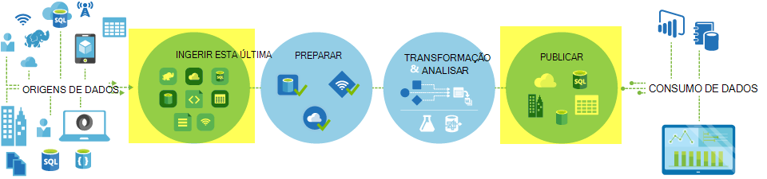
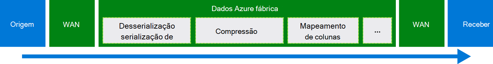
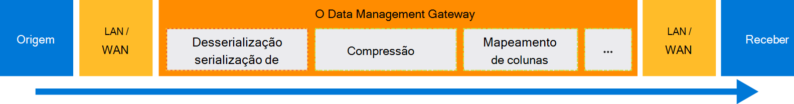

<properties
    pageTitle="Mover dados utilizando a atividade de cópia | Microsoft Azure"
    description="Saiba mais sobre movimento de dados no tubagens fábrica de dados: migração de dados entre armazena na nuvem e entre um arquivo no local e numa loja na nuvem. Utilize actividade de cópia."
    keywords="copiar dados, movimento de dados, migração de dados, transferir os dados"
    services="data-factory"
    documentationCenter=""
    authors="linda33wj"
    manager="jhubbard"
    editor="monicar"/>

<tags
    ms.service="data-factory"
    ms.workload="data-services"
    ms.tgt_pltfrm="na"
    ms.devlang="na"
    ms.topic="article"
    ms.date="09/22/2016"
    ms.author="jingwang"/>

# Mover dados utilizando a atividade de cópia

## Descrição geral
No Azure fábrica de dados, pode utilizar atividade copiar para copiar dados de diferentes formas de vários no local e na nuvem origens de dados para Azure. Depois dos dados são copiados, pode ser ainda mais transformado e analisada. Também pode utilizar a cópia atividade para publicar transformação e os resultados da análise para business intelligence (BI) e o consumo de aplicação.

Atividade de cópia é recorrendo a seguro, fiável, dimensionáveis e o [serviço globalmente disponível](#global). Este artigo fornece detalhes sobre movimento de dados no fábrica de dados e de atividade de cópia.

Primeiro, vamos ver como a migração de dados ocorre entre dois arquivos de dados na nuvem e entre um arquivo de dados no local e um arquivo de dados na nuvem.

> [AZURE.NOTE] Para saber mais sobre atividades em geral, consulte o artigo [tubagens compreensão e atividades](data-factory-create-pipelines.md).

### Copiar dados entre dois arquivos de dados da nuvem
Quando estão arquivos de dados de origem e sink na nuvem, atividade de cópia analise as seguintes fases para copiar dados a partir da origem para o sink. O serviço oferece cópia atividade:

1. Lê dados a partir da loja de dados de origem.
2. Executa serialização/desserialização, compressão/descompressão, mapeamento de coluna e conversão de tipo. Que faz estas operações com base nas configurações de conjunto de dados de entrada, conjunto de dados de saída e atividade de cópia.
3.  Escreve dados para o arquivo de dados de destino.

O serviço escolhe automaticamente a região ideal para executar o movimento de dados. Esta região geralmente é mais próximo ao arquivo de dados sink um.

### Copiar dados entre um arquivo de dados no local e um arquivo de dados na nuvem
Para mover os dados em segurança entre um arquivo de dados no local e um arquivo de dados na nuvem, instale o Data Management Gateway no seu computador no local. O Data Management Gateway é um agente que permite movimento de dados híbrido e processamento. Pode instalá-lo no mesmo computador, como o arquivo de dados propriamente dito ou num computador diferente que tem acesso ao arquivo de dados.

Neste cenário, o Data Management Gateway executa a serialização/desserialização, compressão/descompressão, mapeamento de coluna e conversão de tipo de. Não fluxo de dados através do serviço de fábrica do Azure dados. Em vez disso, o Data Management Gateway escreve diretamente os dados para o arquivo de destino.

Consulte o artigo [mover dados entre no local e na nuvem arquivos de dados](data-factory-move-data-between-onprem-and-cloud.md) para uma introdução e instruções passo a passo. Consulte o artigo [Data Management Gateway](data-factory-data-management-gateway.md) para obter informações detalhadas sobre este agente.

Também pode mover dados ou para suportados arquivos de dados que são alojados em máquinas virtuais do Azure IaaS (VMs) utilizando o Data Management Gateway. Neste caso, pode instalar o Data Management Gateway na mesma VM, como o arquivo de dados propriamente dito ou numa VM separada que tem acesso ao arquivo de dados.

## Formatos de arquivos de dados suportados e
[AZURE.INCLUDE [data-factory-supported-data-stores](../../includes/data-factory-supported-data-stores.md)]

Se precisar de deslocar-se para a dados de um arquivo de dados que copiar atividade não suporta, utilize uma **atividade personalizada** no fábrica de dados com o seu próprio lógica para copiar/mover dados. Para obter detalhes sobre como criar e utilizar uma atividade personalizada, consulte o artigo [atividades personalizadas de utilização no pipeline fábrica de dados do Azure](data-factory-use-custom-activities.md).

### Formatos de ficheiro suportados
Pode utilizar atividade copiar para copiar os ficheiros como-é entre lojas duas dados com base no ficheiro, como BLOBs do Azure, o sistema de ficheiros e HDFS. Para fazê-lo, pode ignorar a [secção formato](data-factory-create-datasets.md) em ambas as definições do conjunto de dados de entrada e saída. Os dados são copiados eficientemente sem qualquer serialização/desserialização.

Atividade de cópia também lê a partir de e escreve ficheiros nos formatos especificados: texto, Avro, ORC, Parquet e JSON. Pode efetuar as seguintes atividades de cópia, por exemplo:

-   Copiar dados no formato de texto (CSV) de Blobs do Azure e escrever para a base de dados do SQL Azure.
-   Copiar ficheiros no formato de texto (CSV) a partir do sistema de ficheiros no local e escrever BLOBs do Azure no formato de Avro.
-   Copie os dados na base de dados do SQL Azure e escrever para HDFS no local no formato ORC.

## Movimento dados globalmente disponíveis
Azure dados fábrica só está disponível nas regiões oeste EUA, Leste dos EUA e Europa Norte. No entanto, o serviço que oferece a atividade de cópia está disponível globalmente nas seguintes regiões e geografias. A topologia de disponível globalmente assegura movimento de dados eficiente que normalmente evita saltos de publicação em região. Consulte [serviços por região](https://azure.microsoft.com/regions/#services) para disponibilidade de fábrica de dados e movimento de dados numa região.

### Copiar dados entre arquivos de dados da nuvem
Quando estão arquivos de dados de origem e sink na nuvem, dados fábrica utiliza uma implementação do serviço na região que está mais próximo sink na mesma localização geográfica para mover os dados. Referir-se a tabela seguinte para o mapeamento:

Região de destino de arquivo de dados | Região utilizada para movimento de dados
:----------------------------------- | :----------------------------
Leste dos EUA | Leste dos EUA
Leste dos EUA 2 | Leste dos EUA 2
Ocidental dos e.u.a. | Ocidental dos e.u.a.
US Ocidental 2 | Ocidental dos e.u.a.
Central (EUA) | Central (EUA)
Oeste Central (EUA) | Central (EUA)
América do Norte Central (EUA) | América do Norte Central (EUA)
Sul Central (EUA) | Sul Central (EUA)
Europa Norte | Europa Norte
Europa Ocidental | Europa Ocidental
Sudeste asiático | Sudeste asiático
Este asiático | Sudeste asiático
Japão leste | Japão leste
Japão oeste | Japão leste
Sul do Brasil | Sul do Brasil
Leste Austrália | Leste Austrália
Sudeste Austrália | Sudeste Austrália
Índia central | Índia central
Sul Índia | Índia central
Índia Ocidental | Índia central

> [AZURE.NOTE] Se a região de destino de arquivo de dados não estiver na lista anterior, atividade de cópia falha em vez de fazê através de uma região alternativa.

### Copiar dados entre um arquivo de dados no local e um arquivo de dados na nuvem
Quando estão a ser copiados dados entre no local (ou máquinas virtuais/IaaS Azure) e armazena na nuvem, [Data Management Gateway](data-factory-data-management-gateway.md) executa movimento de dados num computador no local ou máquina virtual. O não fluxo de dados através do serviço na nuvem, a menos que utilize a funcionalidade [testado cópia](data-factory-copy-activity-performance.md#staged-copy) . Neste caso, os fluxos de dados através de armazenamento de Blobs do Azure transição antes de destina-se para o arquivo de dados sink.

## Criar uma tubagem com cópia de atividade
Pode criar uma tubagem com cópia de atividade de duas formas:

### Utilizando o Assistente de cópia
O Assistente para copiar dados fábrica ajuda-o para criar uma tubagem com atividade de cópia. Este pipeline permite-lhe copiar dados a partir de origens suportadas para destinos *sem escrever JSON* definições serviços ligados, conjuntos de dados e tubagens. Consulte o artigo [Assistente para copiar dados fábrica](data-factory-copy-wizard.md) para obter detalhes sobre o assistente.  

### Utilizando JSON scripts
Pode utilizar o Editor de fábrica do mesmo de dados no portal do Azure, Visual Studio ou Azure PowerShell para criar uma definição de JSON para uma tubagem (utilizando a atividade de cópia). Em seguida, pode implementar o mesmo para criar as em curso numa fábrica de dados. Consulte o artigo [Tutorial: utilizar cópia atividade no pipeline fábrica de dados do Azure](data-factory-copy-data-from-azure-blob-storage-to-sql-database.md) para obter um tutorial com instruções passo a passo.    

Propriedades JSON (como o nome, descrição, de entrada e saída tabelas e políticas) estão disponíveis para todos os tipos de atividades. Propriedades que estão disponíveis na `typeProperties` secção da atividade de variar com cada tipo de atividade.

Para copiar atividade, o `typeProperties` secção varia dependendo dos tipos de origens e afunde. Clique num origem sink na secção de [origens e sumidouros suportadas](#supported-data-stores) para saber mais sobre as propriedades de tipo que suporta a atividade de cópia para esse arquivo de dados.   

Eis uma definição de JSON exemplo:

    {
      "name": "ADFTutorialPipeline",
      "properties": {
        "description": "Copy data from Azure blob to Azure SQL table",
        "activities": [
          {
            "name": "CopyFromBlobToSQL",
            "type": "Copy",
            "inputs": [
              {
                "name": "InputBlobTable"
              }
            ],
            "outputs": [
              {
                "name": "OutputSQLTable"
              }
            ],
            "typeProperties": {
              "source": {
                "type": "BlobSource"
              },
              "sink": {
                "type": "SqlSink",
                "writeBatchSize": 10000,
                "writeBatchTimeout": "60:00:00"
              }
            },
            "Policy": {
              "concurrency": 1,
              "executionPriorityOrder": "NewestFirst",
              "retry": 0,
              "timeout": "01:00:00"
            }
          }
        ],
        "start": "2016-07-12T00:00:00Z",
        "end": "2016-07-13T00:00:00Z"
      }
    }

A agenda que está definida no conjunto de dados de saída determina quando executa a atividade (por exemplo: **diária**, frequência como **dia**e o intervalo como **1**). A atividade copia os dados a partir de um conjunto de dados entrado (**origem**) para um conjunto de dados de saída (**sink**).

Pode especificar mais do que um conjunto de dados de entrada a atividade de cópia. São utilizados para verificar as dependências antes da atividade é executada. No entanto, apenas os dados a partir do primeiro conjunto de dados são copiados para o conjunto de dados de destino. Para obter mais informações, consulte [agendar e execução](data-factory-scheduling-and-execution.md).  

## Desempenho e Otimização do
Consulte o [Guia de sintonização e desempenho de atividade de cópia](data-factory-copy-activity-performance.md), que descreve chaves fatores que afetam o desempenho de movimento de dados (copiar actividade) no Azure fábrica de dados. Também apresenta o desempenho observado durante o ensaio interno e explica as várias formas para otimizar o desempenho da atividade de cópia.

## Agendamento e sequencial cópia
Consulte o artigo [agendar e execução](data-factory-scheduling-and-execution.md) para obter informações detalhadas sobre como funciona o agendamento e execução numa fábrica de dados. É possível executar várias operações de copiar um após o outro de forma sequencial/ordenados. Consulte a secção [encomendou cópia](data-factory-scheduling-and-execution.md#ordered-copy) .

## Conversões de tipos
Arquivos de dados diferentes tem sistemas de tipo de nativo diferente. Atividade de cópia executa conversões de tipo automático a partir de tipos de origens de receber tipos com a abordagem de dois passos seguintes:

1. Converta de tipos de origens nativo para um tipo de .NET.
2. Converta a partir de um tipo de .NET para um tipo de sink nativa.

O mapeamento de um sistema de tipo nativo a um tipo de .NET para um arquivo de dados é no artigo loja respetivos dados. (Clique na ligação específica da tabela [suportadas arquivos de dados](#supported-data-stores) ). Pode utilizar estes mapeamentos para determinar tipos adequados ao criar as tabelas, para que as conversões direita executa a atividade de cópia.

## Próximos passos
- Para saber mais sobre a atividade de cópia, consulte o artigo [copiar dados a partir do armazenamento de Blobs do Azure base de dados do SQL Azure](data-factory-copy-data-from-azure-blob-storage-to-sql-database.md).
- Para obter informações sobre como mover dados a partir de uma loja de dados no local para um arquivo de dados na nuvem, consulte o artigo [mover dados a partir no local para o cloud dados armazena](data-factory-move-data-between-onprem-and-cloud.md).
