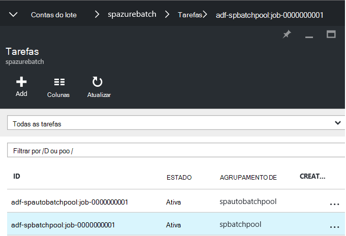
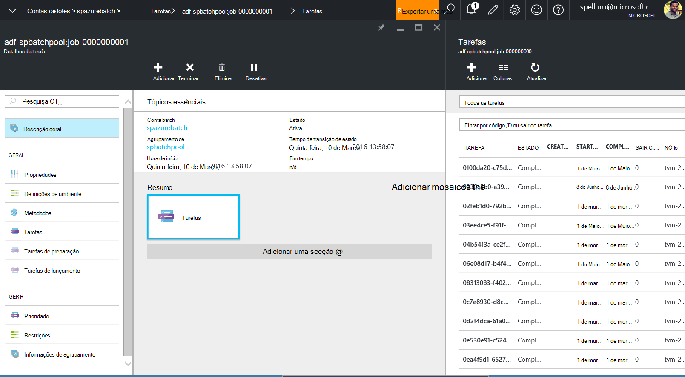

<properties
    pageTitle="Conjuntos de dados em grande escala utilizando fábrica de dados e a secção do processo | Microsoft Azure"
    description="Descreve como a processar grandes quantidades de dados no pipeline fábrica de dados do Azure utilizando a capacidade de processamento paralelas do Azure lote."
    services="data-factory"
    documentationCenter=""
    authors="spelluru"
    manager="jhubbard"
    editor="monicar"/>

<tags
    ms.service="data-factory"
    ms.workload="data-services"
    ms.tgt_pltfrm="na"
    ms.devlang="na"
    ms.topic="article"
    ms.date="10/17/2016"
    ms.author="spelluru"/>

# Processar conjuntos de dados em grande escala utilizando fábrica de dados e a secção
Este artigo descreve uma arquitetura de uma solução de exemplo que se move e processos de conjuntos de dados em grande escala de uma forma automática e agendada. Também fornece um tutorial de fim para fim para implementar a solução utilizando fábrica de dados do Azure e a secção do Azure. 

Este artigo tem mais de nosso artigo típico porque contém instruções sobre uma solução de amostra completa. Se estiver familiarizado com o lote e fábrica de dados, pode obter informações sobre estes serviços e como funcionam em conjunto. Se souber algo sobre os serviços e são estruturar/criação uma solução, pode concentrar-se apenas na [secção de arquitectura](#architecture-of-sample-solution) do artigo e se estiver a desenvolver um protótipo ou uma solução, também poderá querer experimentar a instruções passo a passo no [tutorial](#implementation-of-sample-solution). Vamos convidar os seus comentários sobre este conteúdo e como utilizá-lo.

Primeiro, vamos ver como o serviços fábrica de dados e lote podem ajudar com o processamento de grandes conjuntos de dados na nuvem.     

## Por que motivo lote Azure?
Azure lote permite-lhe executar as aplicações em grande escala alto desempenho e paralelas computação (HPC) eficazmente na nuvem. É um serviço da plataforma que agenda com muitos cluster de trabalho para ser executado numa coleção de máquinas virtuais geridos e pode automaticamente escala calcular recursos para satisfazer as necessidades das suas tarefas.

Com o serviço do lote, pode definir Azure cluster recursos para executar as aplicações em paralelo e em escala. Pode executar a pedido ou agendada tarefas e não precisa de manualmente criar, configurar e gerir um cluster HPC, máquinas virtuais individuais, redes virtuais ou uma tarefa complexa e infraestrutura de agendamento de tarefas.

Consulte os artigos seguintes se não estiver familiarizado com o Azure lote como ajuda-o com Noções sobre a arquitetura de implementação de solução é descrita neste artigo.   

- [Noções básicas do lote Azure](../batch/batch-technical-overview.md)
- [Descrição geral do funcionalidade batch](../batch/batch-api-basics.md)

(opcional) Para saber mais sobre Azure lote, consulte o [caminho de formação para lote Azure](https://azure.microsoft.com/documentation/learning-paths/batch/).

## Por que motivo fábrica dados Azure?
Fábrica de dados é um serviço de integração de dados baseadas na nuvem que orquestra e automatiza o movimento e transformação de dados. Utilizar o serviço de dados fábrica do mesmo, pode criar tubagens dados geridos que mova os dados no local e na nuvem arquivos de dados para um arquivo de dados centralizada (por exemplo: armazenamento de Blobs do Azure) e processo/transformação de dados através de serviços como o Azure HDInsight e Azure máquina aprendizagem. Também pode agendar tubagens de dados ser executado numa forma agendada (hora a hora, diária, semanal, etc.) e um monitor e geri-los rapidamente para identificar problemas e tomar medidas. 

Consulte os artigos seguintes se não estiver familiarizado com o Azure dados fábrica como ajuda-o com Noções sobre a arquitetura de implementação de solução é descrita neste artigo.  

- [Introdução de dados Azure fábrica](data-factory-introduction.md)
- [Construir a sua primeira pipeline de dados](data-factory-build-your-first-pipeline.md)   

(opcional) Para saber mais sobre Azure fábrica de dados, consulte o [caminho de formação para Azure fábrica de dados](https://azure.microsoft.com/documentation/learning-paths/data-factory/).

## Fábrica de dados e lote em conjunto
Dados fábrica inclui incorporadas atividades como atividade copiar para copiar/mover dados a partir de um arquivo de dados de origem para um arquivo de dados de destino e ramo de registo de atividade para processar dados utilizando clusters de Hadoop (HDInsight) no Azure. Consulte o artigo [Atividades de transformação de dados](data-factory-data-transformation-activities.md) para obter uma lista das atividades de transformação suportados. 

Também permite criar actividades .NET personalizadas para mover ou processar dados com o seu próprio lógica e executar estes atividades um cluster de Azure HDInsight ou um conjunto de Azure lote de VMs. Quando utiliza o Azure lote, pode configurar o conjunto para dimensionar automaticamente (adicionar ou remover VMs com base na carga de trabalho) com base numa fórmula fornecidos.     

## Arquitetura de solução da amostra
Apesar da arquitetura descrita neste artigo destina-se uma solução simples, é relevante para cenários complexos como risco modeling serviços financeiros, processamento de imagens e composição e análise genoma. 

O diagrama ilustra 1) como dados fábrica orquestra movimento de dados e processamento e 2) como o Azure lote processa os dados de uma forma paralela. Transferir e imprimir o diagrama para consulta fácil (11 x 17 pol. ou tamanho de A3): [orchestration HPC e dados utilizando lote Azure e fábrica de dados](http://go.microsoft.com/fwlink/?LinkId=717686).

A lista seguinte fornece os passos básicos do processo. A solução inclui código e explicações para criar a solução de fim para fim.

1.  **Configurar o Azure lote com um conjunto de nós de cluster (VMs)**. Pode especificar o número de nós e tamanho de cada nó.

2.  **Criar uma instância de fábrica do Azure dados** que está configurado com entidades que representam armazenamento de Blobs do Azure, o serviço de cluster lote Azure, dados de entrada/saída e um fluxo de trabalho pipeline com as atividades que mova e transformar os dados.

3.   **Criar uma atividade de .NET personalizada no pipeline de fábrica de dados**. A atividade é o código de utilizador que é executada no conjunto de lote Azure.

4.  **Grandes quantidades de arquivo de dados de entrada como blobs no Azure armazenamento**. Dados são divididos em setores lógicos (normalmente por hora).

5.  **Dados fábrica copia os dados que são processados em paralelo** para a localização secundária.

6.  A **fábrica de dados é executado atividade personalizada utilizando o agrupamento atribuído pelo lote**. Dados fábrica pode executar atividades em simultâneo. Cada actividade processa um setor de dados. Os resultados são armazenados no Azure armazenamento.

7.  **Que dados fábrica move os resultados finais para uma localização de terceiro**, para distribuição através de uma aplicação ou para processamento suplementar por outras ferramentas.

## Implementação da solução de exemplo
A solução de exemplo é intencionalmente simple e mostrar-lhe como utilizar a fábrica de dados e lote em conjunto para processar conjuntos de dados. A solução simplesmente conta o número de ocorrências de um termo de pesquisa ("Microsoft") em ficheiros de entrada organizados numa série de tempo. Exporta-lo a contagem de ficheiros de saída.

**Tempo**: Se estiver familiarizado com noções básicas de Azure, dados fábrica e lote e tiver concluído os pré-requisitos indicados abaixo, podemos estimar esta solução demora horas de 1-2 para concluir.

### Pré-requisitos

#### Subscrição do Azure
Se não tiver uma subscrição do Azure, pode criar uma conta de avaliação gratuita apenas de duas minutos. Consulte o artigo [versão de avaliação gratuita](https://azure.microsoft.com/pricing/free-trial/).

#### Conta de armazenamento Azure
Utilizar uma conta de armazenamento Azure para armazenar os dados neste tutorial. Se não tiver uma conta de armazenamento Azure, consulte o artigo [criar uma conta de armazenamento](../storage/storage-create-storage-account.md#create-a-storage-account). Solução da amostra utiliza o armazenamento de Blobs.

#### Conta lote Azure
Crie uma conta do lote Azure utilizando o [Azure portal](http://manage.windowsazure.com/). Consulte o artigo [criar e gerir uma conta Azure lote](../batch/batch-account-create-portal.md). Tenha em atenção a chave conta Azure lote nome e a conta. Também pode utilizar o cmdlet [AzureRmBatchAccount novo](https://msdn.microsoft.com/library/mt603749.aspx) para criar uma conta Azure lote. Para obter instruções detalhadas sobre como utilizar este cmdlet, consulte a [começar a trabalhar com os cmdlets do PowerShell do Azure lote](../batch/batch-powershell-cmdlets-get-started.md) .

Solução da amostra utiliza Azure lote (indiretamente através do pipeline de fábrica do Azure dados) para processar dados de uma forma paralela num conjunto de nós de cluster (uma colecção de máquinas virtuais gerida).

#### Agrupamento de lote Azure das máquinas virtuais (VMs)
Crie um **conjunto de Azure lote** com pelo menos 2 nós de cluster.

1.  No [portal do Azure](https://portal.azure.com), clique em **Procurar** no menu à esquerda e clique em **Lote contas**. 
2. Selecione a sua conta do Azure lote para abrir o pá **Lote de conta** . 
3. Clique em mosaico de **conjuntos de dados** .
4. Na pá **conjuntos de dados** , clique em botão Adicionar na barra de ferramentas para adicionar um conjunto de dados.
    1. Introduza um ID para o conjunto de (**O ID de agrupamento**). Tenha em atenção o **ID do conjunto de**; é necessário ao criar uma solução de dados fábrica do mesmo. 
    2. Especifique o **Windows Server 2012 R2** para a definição do sistema operativo família.
    3. Selecione uma **camada comparar nó**.
    4. Introduza **2** como valor para a definição **Dedicada de destino** .
    5. Introduza **2** como valor para a definição de **tarefas máximo por nó** .
    6. Clique em **OK** para criar o conjunto de dados. 
    
#### Explorador de armazenamento Azure   
[Azure armazenamento Explorer 6 (ferramenta)](https://azurestorageexplorer.codeplex.com/) ou [CloudXplorer](http://clumsyleaf.com/products/cloudxplorer) (a partir do Software de ClumsyLeaf). Utilize estas ferramentas para inspecionar e alterar os dados nos seus projetos de armazenamento do Windows Azure, incluindo os registos das suas aplicações alojado na nuvem.

1.  Criar um contentor denominado **mycontainer** com acesso privado (sem acesso anónimo)

2.  Se estiver a utilizar **CloudXplorer**, crie pastas e subpastas com a seguinte estrutura:

    

    **Inputfolder** e **outputfolder** são as pastas de nível superiores na **mycontainer,** e o **inputfolder** tenha subpastas com carimbos de data-hora (AAAA-MM-DD-HH).

    Se estiver a utilizar **O Explorador de armazenamento do Azure**, o próximo passo, terá de carregar ficheiros com nomes: inputfolder/2015-11-16-00/file.txt, inputfolder/2015-11-16-01/file.txt e assim sucessivamente. Este passo cria automaticamente as pastas.

3.  Crie um ficheiro de texto **ficheiro. txt** no seu computador com o conteúdo que tem a palavra-chave **Microsoft**. Por exemplo: "Testar atividade personalizada do atividade personalizada Microsoft teste Microsoft".

4.  Carregue o ficheiro para as seguintes pastas de entrada no armazenamento de Blobs do Azure.

    

    Se estiver a utilizar **O Explorador de armazenamento do Azure**, carregue o ficheiro de **ficheiro. txt** para **mycontainer**. Na barra de ferramentas para criar uma cópia do blob, clique em **Copiar** . Na caixa de diálogo **Copiar Blob** , altere o **nome do blob de destino** para **inputfolder/2015-11-16-00/file.txt.** Repita este passo para criar inputfolder/2015-11-16-01/file.txt, inputfolder/2015-11-16-02/file.txt, inputfolder/2015-11-16-03/file.txt, inputfolder/2015-11-16-04/file.txt e assim sucessivamente. Esta ação cria automaticamente as pastas.

3.  Criar outro contentor com o nome: **customactivitycontainer**. Carregue o ficheiro zip de atividade personalizada a este contentor.

#### Visual Studio
Instale o Microsoft Visual Studio 2012 ou posterior para criar a atividade de lote personalizada para ser utilizado na solução fábrica de dados.

### Passos para criar a solução de alto nível

1.  Crie uma atividade personalizada que contém a lógica de processamento de dados.
2.  Crie uma fábrica Azure dados que utiliza a atividade personalizada:

### Criar a atividade personalizada

A atividade personalizada fábrica de dados é o coração desta solução de exemplo. Solução da amostra utiliza Azure lote para executar a atividade personalizada. Consulte o artigo [utilizar atividades personalizadas no pipeline fábrica de dados do Azure](data-factory-use-custom-activities.md) para as informações básicas para desenvolver atividades personalizadas e utilizá-los no Azure dados fábrica tubagens.

Para criar uma atividade personalizada .NET, que pode utilizar no pipeline fábrica de dados do Azure, é necessário criar um projeto de **Biblioteca de classes .NET** com uma classe que implementa nessa interface **IDotNetActivity** . Esta interface tem só um método: **Executar**. Eis a assinatura do método:

    public IDictionary<string, string> Execute(
                IEnumerable<LinkedService> linkedServices,
                IEnumerable<Dataset> datasets,
                Activity activity,
                IActivityLogger logger)

O método tem alguns componentes chave que é necessário compreender.

-   O método leva-o até quatro parâmetros:

    1.  **linkedServices**. Uma lista vasto dos serviços ligados ligadas a origens de dados de entrada/saída (por exemplo: armazenamento de Blobs do Azure) para a fábrica de dados. Neste exemplo, existe apenas um serviço ligado de tipo de armazenamento do Windows Azure utilizado para entrada e saída.

    2.  **conjuntos de dados**. Esta é uma lista vasto de conjuntos de dados. Pode utilizar este parâmetro para obter as localizações e os esquemas definidos pela conjuntos de dados de entrada e saídos.

    3.  **atividade**. Este parâmetro representa a atual cluster entidade - neste caso, um serviço de lote Azure.

    4.  **registo**. O registo permite-lhe escrever comentários de depuração de superfície como o registo de "Utilizador" para as em curso.

-   O método devolve um dicionário que pode ser utilizado para corrente de bicicleta atividades personalizadas em conjunto no futuro. Esta funcionalidade ainda não está implementada, por isso, devolver um dicionário vazio a partir do método. 

#### Procedimento: Criar a atividade personalizada

1.  Crie um projeto de biblioteca de classes .NET no Visual Studio.

    1.  Iniciar o **Visual Studio 2012http**/**2013/2015**.

    2.  Clique em **ficheiro**, aponte para **Novo**e clique em **projeto**.

    3.  Expanda **modelos**e selecione **Visual C\#**. Neste tutorial, utiliza o C\#, mas pode utilizar qualquer idioma .NET para desenvolver a atividade personalizada.

    4.  Selecione **A biblioteca de classes** a partir da lista de tipos de projecto no lado direito.

    5.  Introduza **MyDotNetActivity** para o **nome**.

    6.  Selecione **c:\\ADF** para a **localização**. Crie a pasta **ADF** se não existir.

    7.  Clique em **OK** para criar o projeto.

2.  Clique em **Ferramentas**, aponte para **O Gestor de pacotes NuGet**e clique em **Consola do Gestor de pacote**.

3.  Na **Consola do Gestor de pacote**, execute o seguinte comando para importar **Microsoft.Azure.Management.DataFactories**.

            Install-Package Microsoft.Azure.Management.DataFactories

4.  Importe o pacote de NuGet de **Armazenamento do Windows Azure** ao projeto. Precisa deste pacote de uma vez que utiliza o armazenamento de BLOBs API neste exemplo.

        Install-Package Azure.Storage

5.  Adicione diretivas seguintes do **através** para o ficheiro de origem no projeto.

        using System.IO;
        using System.Globalization;
        using System.Diagnostics;
        using System.Linq;

        using Microsoft.Azure.Management.DataFactories.Models;
        using Microsoft.Azure.Management.DataFactories.Runtime;

        using Microsoft.WindowsAzure.Storage;
        using Microsoft.WindowsAzure.Storage.Blob;

6.  Altere o nome do **espaço de nomes** de para **MyDotNetActivityNS**.

        namespace MyDotNetActivityNS

7.  Altere o nome da categoria para **MyDotNetActivity** e deriva-lo a interface de **IDotNetActivity** conforme apresentado abaixo.

        public class MyDotNetActivity : IDotNetActivity

8.  Implementar método (adicionar) a **execução** da interface do **IDotNetActivity** para a classe de **MyDotNetActivity** e copie o código seguinte de exemplo para o método. Consulte a secção [Executar método](#execute-method) para explicação para a lógica utilizada neste método.

        /// 

        /// Execute method is the only method of IDotNetActivity interface you must implement.
        /// In this sample, the method invokes the Calculate method to perform the core logic.  
        /// 

        public IDictionary<string, string> Execute(
            IEnumerable<LinkedService> linkedServices,
            IEnumerable<Dataset> datasets,
            Activity activity,
            IActivityLogger logger)
        {

            // declare types for input and output data stores
            AzureStorageLinkedService inputLinkedService;

            Dataset inputDataset = datasets.Single(dataset => dataset.Name == activity.Inputs.Single().Name);
    
            foreach (LinkedService ls in linkedServices)
                logger.Write("linkedService.Name {0}", ls.Name);

            // using First method instead of Single since we are using the same
            // Azure Storage linked service for input and output.
            inputLinkedService = linkedServices.First(
                linkedService =>
                linkedService.Name ==
                inputDataset.Properties.LinkedServiceName).Properties.TypeProperties
                as AzureStorageLinkedService;

            string connectionString = inputLinkedService.ConnectionString; // To create an input storage client.
            string folderPath = GetFolderPath(inputDataset);
            string output = string.Empty; // for use later.

            // create storage client for input. Pass the connection string.
            CloudStorageAccount inputStorageAccount = CloudStorageAccount.Parse(connectionString);
            CloudBlobClient inputClient = inputStorageAccount.CreateCloudBlobClient();

            // initialize the continuation token before using it in the do-while loop.
            BlobContinuationToken continuationToken = null;
            do
            {   // get the list of input blobs from the input storage client object.
                BlobResultSegment blobList = inputClient.ListBlobsSegmented(folderPath,
                                         true,
                                         BlobListingDetails.Metadata,
                                         null,
                                         continuationToken,
                                         null,
                                         null);

                // Calculate method returns the number of occurrences of
                // the search term (“Microsoft”) in each blob associated
                // with the data slice.
                //
                // definition of the method is shown in the next step.
                output = Calculate(blobList, logger, folderPath, ref continuationToken, "Microsoft");

            } while (continuationToken != null);

            // get the output dataset using the name of the dataset matched to a name in the Activity output collection.
            Dataset outputDataset = datasets.Single(dataset => dataset.Name == activity.Outputs.Single().Name);

            folderPath = GetFolderPath(outputDataset);

            logger.Write("Writing blob to the folder: {0}", folderPath);

            // create a storage object for the output blob.
            CloudStorageAccount outputStorageAccount = CloudStorageAccount.Parse(connectionString);
            // write the name of the file.
            Uri outputBlobUri = new Uri(outputStorageAccount.BlobEndpoint, folderPath + "/" + GetFileName(outputDataset));

            logger.Write("output blob URI: {0}", outputBlobUri.ToString());
            // create a blob and upload the output text.
            CloudBlockBlob outputBlob = new CloudBlockBlob(outputBlobUri, outputStorageAccount.Credentials);
            logger.Write("Writing {0} to the output blob", output);
            outputBlob.UploadText(output);

            // The dictionary can be used to chain custom activities together in the future.
            // This feature is not implemented yet, so just return an empty dictionary.
            return new Dictionary<string, string>();
        }

9.  Adicione os seguintes métodos de ajuda para a classe de. Estes métodos são invocar pelo método **Execute** . Mais nenhumas, o método de **Calcular** isola o código que se repete através de cada blob.

        /// 

        /// Gets the folderPath value from the input/output dataset.
        /// 

        private static string GetFolderPath(Dataset dataArtifact)
        {
            if (dataArtifact == null || dataArtifact.Properties == null)
            {
                return null;
            }

            AzureBlobDataset blobDataset = dataArtifact.Properties.TypeProperties as AzureBlobDataset;
            if (blobDataset == null)
            {
                return null;
            }

            return blobDataset.FolderPath;
        }

        /// 

        /// Gets the fileName value from the input/output dataset.
        /// 

        private static string GetFileName(Dataset dataArtifact)
        {
            if (dataArtifact == null || dataArtifact.Properties == null)
            {
                return null;
            }

            AzureBlobDataset blobDataset = dataArtifact.Properties.TypeProperties as AzureBlobDataset;
            if (blobDataset == null)
            {
                return null;
            }

            return blobDataset.FileName;
        }

        /// 

        /// Iterates through each blob (file) in the folder, counts the number of instances of search term in the file,
        /// and prepares the output text that is written to the output blob.
        /// 

        public static string Calculate(BlobResultSegment Bresult, IActivityLogger logger, string folderPath, ref BlobContinuationToken token, string searchTerm)
        {
            string output = string.Empty;
            logger.Write("number of blobs found: {0}", Bresult.Results.Count<IListBlobItem>());
            foreach (IListBlobItem listBlobItem in Bresult.Results)
            {
                CloudBlockBlob inputBlob = listBlobItem as CloudBlockBlob;
                if ((inputBlob != null) && (inputBlob.Name.IndexOf("$$$.$$$") == -1))
                {
                    string blobText = inputBlob.DownloadText(Encoding.ASCII, null, null, null);
                    logger.Write("input blob text: {0}", blobText);
                    string[] source = blobText.Split(new char[] { '.', '?', '!', ' ', ';', ':', ',' }, StringSplitOptions.RemoveEmptyEntries);
                    var matchQuery = from word in source
                                     where word.ToLowerInvariant() == searchTerm.ToLowerInvariant()
                                     select word;
                    int wordCount = matchQuery.Count();
                    output += string.Format("{0} occurrences(s) of the search term \"{1}\" were found in the file {2}.\r\n", wordCount, searchTerm, inputBlob.Name);
                }
            }
            return output;
        }

    O método **GetFolderPath** devolve o caminho para a pasta que aponta o conjunto de dados para e o método **GetFileName** devolve o nome do que o conjunto de dados aponta para o ficheiro/blob.

        "name": "InputDataset",
        "properties": {
            "type": "AzureBlob",
            "linkedServiceName": "StorageLinkedService",
            "typeProperties": {
                "fileName": "file.txt",
                "folderPath": "mycontainer/inputfolder/{Year}-{Month}-{Day}-{Hour}",

    O método de **Calcular** calcula o número de instâncias da palavra-chave **Microsoft** nos ficheiros de entrada (blobs na pasta). O termo de pesquisa ("Microsoft") é codificado no código.

10.  Compile o projeto. Clique em **Criar** a partir do menu e clique em **Criar solução**.

11.  Iniciar o **Explorador do Windows**e navegue para **posição\\depurar** ou **posição\\solte** pasta dependendo do tipo de compilação.

12.  Criar um ficheiro zip **MyDotNetActivity.zip** que contém todos os binários na ** \\posição\\depurar** pasta. Pretende incluir o MyDotNetActivity. ficheiro **pdb** para que obtenha detalhes adicionais, como o número de linha no código fonte que causaram o problema quando uma falha de ocorre.

    

13.  Carregar **MyDotNetActivity.zip** como um blob ao contentor de BLOBs: **customactivitycontainer** no armazenamento de Blobs do Azure que o **StorageLinkedService** ligado serviço na **ADFTutorialDataFactory** utiliza. Crie o contentor de BLOBs **customactivitycontainer** se ainda não existir.

#### Executar método

Esta secção fornece mais detalhes e as notas sobre o código do método Execute.

1.  Os membros de iteração através da colecção de entrada forem encontrados no espaço de nomes [Microsoft.WindowsAzure.Storage.Blob](https://msdn.microsoft.com/library/azure/microsoft.windowsazure.storage.blob.aspx) . Iteração através da colecção de BLOBs requer utilizando a classe de **BlobContinuationToken** . Na sua essência, tem de utilizar uma efectue-enquanto ciclo com o token de dispositivo de sair do ciclo. Para mais informações, consulte o artigo [como utilizar o armazenamento de Blobs do .NET](../storage/storage-dotnet-how-to-use-blobs.md). Um ciclo básico é mostrado aqui:

        // Initialize the continuation token.
        BlobContinuationToken continuationToken = null;
        do
        {
        // Get the list of input blobs from the input storage client object.
        BlobResultSegment blobList = inputClient.ListBlobsSegmented(folderPath,
                                true,
                                          BlobListingDetails.Metadata,
                                          null,
                                          continuationToken,
                                          null,
                                          null);
        // Return a string derived from parsing each blob.
            output = Calculate(blobList, logger, folderPath, ref continuationToken, "Microsoft");

        } while (continuationToken != null);

    Consulte a documentação para o método de [ListBlobsSegmented](https://msdn.microsoft.com/library/jj717596.aspx) para obter detalhes.

2.  O código para trabalhar através do conjunto de blobs logicamente vai dentro de fazer-enquanto a ligação. Método de **Executar** , fazer-enquanto ciclo transmite a lista de blobs para um método denominado **Calcular**. O método devolve uma variável de cadeia denominada **saída** que é o resultado da tendo sujeita a iteração através de todos os blobs no segmento.

    Devolve o número de ocorrências do termo de pesquisa (**Microsoft**) blob passado para o método de **Calcular** .

        output += string.Format("{0} occurrences of the search term \"{1}\" were found in the file {2}.\r\n", wordCount, searchTerm, inputBlob.Name);

3.  Assim que o método de **Calcular** tem de concluir o trabalho, tem de ser escrita para um novo blob. Por isso, para cada conjunto de blobs processadas, um novo blob pode ser escrito com os resultados. Para escrever um novo blob, encontre primeiro o conjunto de dados de saída.

        // Get the output dataset using the name of the dataset matched to a name in the Activity output collection.
        Dataset outputDataset = datasets.Single(dataset => dataset.Name == activity.Outputs.Single().Name);

4.  O código de chamadas também um método de ajuda: **GetFolderPath** para obter o caminho da pasta (o nome do contentor de armazenamento).

        folderPath = GetFolderPath(outputDataset);

    O **GetFolderPath** converte o objeto de conjunto de dados para um AzureBlobDataSet, que tem uma propriedade denominada caminhopasta.

        AzureBlobDataset blobDataset = dataArtifact.Properties.TypeProperties as AzureBlobDataset;

        return blobDataset.FolderPath;

5.  O código chama o método de **GetFileName** para obter o nome de ficheiro (blob nome). O código é semelhante ao código acima para obter o caminho da pasta.

        AzureBlobDataset blobDataset = dataArtifact.Properties.TypeProperties as AzureBlobDataset;

        return blobDataset.FileName;

6.  O nome do ficheiro é escrito através da criação de um objeto URI. O construtor URI utiliza a propriedade **BlobEndpoint** para devolver o nome do contentor. O nome de ficheiro e caminho da pasta são adicionados à construir o blob de saída URI.  

        // Write the name of the file.
        Uri outputBlobUri = new Uri(outputStorageAccount.BlobEndpoint, folderPath + "/" + GetFileName(outputDataset));

7.  O nome do ficheiro ter sido escrito e agora pode escrever a cadeia de saída do método **Calculate** para um novo blob:

        // Create a blob and upload the output text.
        CloudBlockBlob outputBlob = new CloudBlockBlob(outputBlobUri, outputStorageAccount.Credentials);
        logger.Write("Writing {0} to the output blob", output);
        outputBlob.UploadText(output);

### Criar a fábrica de dados

Na secção [criar a atividade personalizada](#create-the-custom-activity) , criou uma atividade personalizada e carregado o ficheiro zip com binários e o ficheiro PDB para um contentor de Blobs do Azure. Nesta secção, cria um Azure **fábrica de dados** com uma **pipeline** que utiliza a **atividade personalizada**.

O conjunto de dados de entrada para a atividade personalizada representa os blobs (ficheiros) na pasta entrada (mycontainer\\inputfolder) no armazenamento blob do. O conjunto de dados de saída da atividade de representa os blobs saída na pasta saída (mycontainer\\outputfolder) no armazenamento blob do.

Largue um ou mais ficheiros nas pastas de entrada:

    mycontainer -\> inputfolder
        2015-11-16-00
        2015-11-16-01
        2015-11-16-02
        2015-11-16-03
        2015-11-16-04

Por exemplo, largue um ficheiro (ficheiro. txt) com o seguinte conteúdo cada uma das pastas.

    test custom activity Microsoft test custom activity Microsoft

Pasta de cada entrada corresponde a um setor no Azure dados fábrica mesmo se a pasta tenha 2 ou mais ficheiros. Quando é processada cada setor pelas em curso, a atividade personalizada itera todos os blobs na pasta de entrada para esse setor.

Consulte o artigo de cinco ficheiros de saída com o mesmo conteúdo. Por exemplo, o ficheiro de exportação de processamento do ficheiro na pasta 2015-11-16-00 tem o seguinte conteúdo:

    2 occurrences(s) of the search term "Microsoft" were found in the file inputfolder/2015-11-16-00/file.txt.

Se largar vários ficheiros (ficheiro. txt, Ficheiro2. txt, file3.txt) com o mesmo conteúdo para a pasta de entrada, verá o seguinte conteúdo no ficheiro de saída. Cada pasta (2015-11-16-00, etc.) corresponde a um setor neste exemplo, apesar da pasta com vários ficheiros de entrada.

    2 occurrences(s) of the search term "Microsoft" were found in the file inputfolder/2015-11-16-00/file.txt.
    2 occurrences(s) of the search term "Microsoft" were found in the file inputfolder/2015-11-16-00/file2.txt.
    2 occurrences(s) of the search term "Microsoft" were found in the file inputfolder/2015-11-16-00/file3.txt.

O ficheiro de exportação tem três linhas agora, um para cada ficheiro de entrada (BLOBs) na pasta associada no setor (2015-11-16-00).

É criada uma tarefa para cada actividade executar. Neste exemplo, não existe apenas uma atividade no pipeline de. Quando um setor é processada pelas em curso, é executada a atividade personalizada no Azure lote para processar no setor. Uma vez que existem cinco setores (cada setor pode ter várias blobs ou ficheiro), existem cinco tarefas criadas no lote Azure. Quando uma tarefa é executada no lote, é realmente a atividade personalizada que está a ser executado.

O seguinte tutorial fornece detalhes adicionais.

#### Passo 1: Criar a fábrica de dados

1.  Depois de início de sessão no [portal do Azure](https://portal.azure.com/), execute os seguintes passos:

    1.  No menu à esquerda, clique em **Novo** .

    2.  Clique em **dados + Analytics** pá o **Novo** .

    3.  Clique em **Dados fábrica** pá a **análise de dados** .

2.  Na pá **Nova fábrica de dados** , introduza **CustomActivityFactory** para o nome. O nome da fábrica dados Azure tem de ser exclusivo global. Se receber o erro: o **nome da fábrica de dados "CustomActivityFactory" não está disponível**, altere o nome da fábrica dados (por exemplo, **yournameCustomActivityFactory**) e tente criar novamente.

3.  Clique no **Nome do grupo de recursos**e selecione um grupo de recursos existente ou crie um grupo de recursos.

4.  Certifique-se de que está a utilizar a subscrição correta e região onde pretende que a fábrica de dados seja criada.

5.  Clique em **Criar** no pá a **fábrica de dados nova** .

6.  Consulte a fábrica de dados a ser criada no **Dashboard** do Azure portal.

7.  Depois da fábrica de dados foi criada com êxito, verá a página de fábrica do mesmo dados, que mostra-lhe os conteúdos da fábrica de dados.

 

#### Passo 2: Criar serviços ligados

Serviços ligados ligar arquivos de dados ou calcular serviços a uma fábrica dados Azure. Neste passo, aos quais ligação sua conta de **Armazenamento do Windows Azure** e conta **Azure lote** a fábrica de dados.

#### Criar o serviço de armazenamento do Windows Azure ligadas

1.  Clique na **autor e implementar** dispor em mosaico no pá a **Fábrica de dados** para **CustomActivityFactory**. Consulte o Editor de fábrica do mesmo de dados.

2.  Clique em **arquivo de dados novos** na barra de comandos e selecione **armazenamento Azure.** Deverá visualizar o script JSON para criar um serviço de armazenamento do Windows Azure ligadas no editor.

    

3.  Substitua o **nome da conta** com o nome da sua conta de armazenamento Azure e **chave de conta** com a tecla de acesso da conta de armazenamento Azure. Para aprender a obter a sua chave de acesso de armazenamento, consulte o artigo [Ver, copiar e teclas de acesso de armazenamento gerar](../storage/storage-create-storage-account.md#view-copy-and-regenerate-storage-access-keys).

4.  Na barra de comando para implementar o serviço ligado, clique em **Implementar** .

    

#### Criar o lote Azure ligadas serviço

Neste passo, crie um serviço ligado para a sua conta **Azure lote** que é utilizado para executar a atividade personalizada fábrica de dados.

1.  Clique em **Novo calcular** na barra de comandos e selecione **Azure lote.** Deverá visualizar o script JSON para criar um serviço de lote Azure ligadas no editor.

2.  Em JSON script:

    1.  Substitua o **nome da conta** com o nome da sua conta Azure lote.

    2.  Substitua a tecla de acesso da conta Azure lote **tecla de acesso** .

    3.  Introduza o ID do conjunto de para a propriedade **Nome_conjunto** **.** Para esta propriedade, pode especificar o nome do conjunto ou agrupamento de ID.

    4.  Introduza o lote URI para a propriedade JSON **batchUri** . 
    
        > [AZURE.IMPORTANT] O **URL** do **Azure lote pá de conta** é no seguinte formato: \<accountname\>. \<região\>. batch.azure.com. Para a propriedade **batchUri** na JSON, tem de **Remover "accountname."** a partir do URL. Exemplo: `"batchUri": "https://eastus.batch.azure.com"`.

        

        Para a propriedade **Nome_conjunto** , também pode especificar o ID do agrupamento de em vez do nome do conjunto de.

        > [AZURE.NOTE] O serviço de dados fábrica não suporta uma opção a pedido para Azure lote como o faz para HDInsight. Só pode utilizar o seu próprio conjunto Azure lote numa fábrica dados Azure.

    5.  Especifique **StorageLinkedService** para a propriedade **linkedServiceName** . Este serviço ligado que criou no passo anterior. Este armazenamento utilizado como uma área de teste de ficheiros e registos dos.

3.  Na barra de comando para implementar o serviço ligado, clique em **Implementar** .

#### Passo 3: Criar conjuntos de dados

Neste passo, criar conjuntos de dados para representar os dados de entrada e saídos.

#### Criar o conjunto de dados de entrada

1.  No **Editor** para a fábrica de dados, clique em **conjunto de dados novo** botão na barra de ferramentas e clique em **armazenamento de Blobs do Azure** a partir do menu pendente.

2.  Substitua JSON no painel da direita com o fragmento de JSON seguinte:

        {
            "name": "InputDataset",
            "properties": {
                "type": "AzureBlob",
                "linkedServiceName": "AzureStorageLinkedService",
                "typeProperties": {
                    "folderPath": "mycontainer/inputfolder/{Year}-{Month}-{Day}-{Hour}",
                    "format": {
                        "type": "TextFormat"
                    },
                    "partitionedBy": [
                        {
                            "name": "Year",
                            "value": {
                                "type": "DateTime",
                                "date": "SliceStart",
                                "format": "yyyy"
                            }
                        },
                        {
                            "name": "Month",
                            "value": {
                                "type": "DateTime",
                                "date": "SliceStart",
                                "format": "MM"
                            }
                        },
                        {
                            "name": "Day",
                            "value": {
                                "type": "DateTime",
                                "date": "SliceStart",
                                "format": "dd"
                            }
                        },
                        {
                            "name": "Hour",
                            "value": {
                                "type": "DateTime",
                                "date": "SliceStart",
                                "format": "HH"
                            }
                        }
                    ]
                },
                "availability": {
                    "frequency": "Hour",
                    "interval": 1
                },
                "external": true,
                "policy": {}
            }
        }

     Criar uma tubagem posteriormente neste tutorial com a hora de início: 2015-11-hora 16T00:00:00Z e de fim: 2015-11-16T05:00:00Z. Está agendada para produzir dados **por hora**, pelo que existem 5 setores de entrada/saída (entre **00**: 00:00 -\> **05**: 00:00).

     A **frequência** e o **intervalo** para o conjunto de dados de entrada está definida como a **hora** e **1**, que significa que a entrada setor está disponível por hora.

     Eis as horas de início para cada setor, que é representado por **SliceStart** variável do sistema no fragmento de JSON acima.

  	| **Setor** | **Hora de início**          |
  	|-----------|-------------------------|
  	| 1         | 2015-11-16T**00**: 00:00 |
  	| 2         | 2015-11-16T**01**: 00:00 |
  	| 3         | 2015-11-16T**02**: 00:00 |
  	| 4         | 2015-11-16T**03**: 00:00 |
  	| 5         | 2015-11-16T**04**: 00:00 |

     O **caminhopasta** é calculado utilizando a parte do ano, mês, dia e hora da hora de início do setor (**SliceStart**). Por conseguinte, eis como uma pasta de entrada é mapeada para um setor.

  	| **Setor** | **Hora de início**          | **Pasta de entrada**  |
  	|-----------|-------------------------|-------------------|
  	| 1         | 2015-11-16T**00**: 00:00 | 2015-11-16 -**00** |
  	| 2         | 2015-11-16T**01**: 00:00 | 2015-11-16 -**01** |
  	| 3         | 2015-11-16T**02**: 00:00 | 2015-11-16 -**02** |
  	| 4         | 2015-11-16T**03**: 00:00 | 2015-11-16 -**03** |
  	| 5         | 2015-11-16T**04**: 00:00 | 2015-11-16 -**04** |

3.  Clique em **Implementar** na barra de ferramentas para criar e implementar a tabela **InputDataset** . 

#### Criar o conjunto de dados de saída

Neste passo, criar outro conjunto de dados do tipo AzureBlob para representar os dados de saída.

1.  No **Editor** para a fábrica de dados, clique em **conjunto de dados novo** botão na barra de ferramentas e clique em **armazenamento de Blobs do Azure** a partir do menu pendente.

2.  Substitua JSON no painel da direita com o fragmento de JSON seguinte:

        {
            "name": "OutputDataset",
            "properties": {
                "type": "AzureBlob",
                "linkedServiceName": "AzureStorageLinkedService",
                "typeProperties": {
                    "fileName": "{slice}.txt",
                    "folderPath": "mycontainer/outputfolder",
                    "partitionedBy": [
                        {
                            "name": "slice",
                            "value": {
                                "type": "DateTime",
                                "date": "SliceStart",
                                "format": "yyyy-MM-dd-HH"
                            }
                        }
                    ]
                },
                "availability": {
                    "frequency": "Hour",
                    "interval": 1
                }
            }
        }

    É gerado um ficheiro/blob de saída para cada entrada setor. Eis como um ficheiro de exportação chama-se para cada setor. Todos os ficheiros de saída são gerados numa pasta de saída: **mycontainer\\outputfolder**.

  	| **Setor** | **Hora de início**          | **Ficheiro de exportação**       |
  	|-----------|-------------------------|-----------------------|
  	| 1         | 2015-11-16T**00**: 00:00 | 2015-11-16 -**00. txt** |
  	| 2         | 2015-11-16T**01**: 00:00 | 2015-11-16 -**01. txt** |
  	| 3         | 2015-11-16T**02**: 00:00 | 2015-11-16 -**02. txt** |
  	| 4         | 2015-11-16T**03**: 00:00 | 2015-11-16 -**03. txt** |
  	| 5         | 2015-11-16T**04**: 00:00 | 2015-11-16 -**04. txt** |

     Lembre-se de que todos os ficheiros numa pasta do teclado (por exemplo: 2015-11-16-00) fazem parte de um setor com a hora de início: 2015-11-16-00. Quando esta setor é processada, a atividade personalizada analisa através de cada ficheiro e produz uma linha no ficheiro de saída com o número de ocorrências de termo de pesquisa ("Microsoft"). Se existirem três ficheiros na pasta 2015-11-16-00, existem três linhas o ficheiro de exportação: 2015-11-16-00.txt.

3.  Clique em **Implementar** na barra de ferramentas para criar e implementar o **OutputDataset**.

#### Passo 4: Criar e executar a tubagem com atividade personalizada

Neste passo, crie uma tubagem com uma atividade, atividade personalizada que criou anteriormente.

> [AZURE.IMPORTANT] Se ainda não tiver transferido o **ficheiro. txt** , um ficheiro de pastas no contentor de BLOBs, fazê-lo antes de criar as em curso. A propriedade **isPaused** está definida como falso no pipeline de JSON, para que a tubagem executa imediatamente como a data de **início** está no passado.

1.  No Editor de fábrica do mesmo de dados, clique em **pipeline de novo** na barra de comandos. Se não vir o comando, clique em **... (Reticências)** para visualizá-la.

2.  Substitua JSON no painel da direita com o seguinte script JSON:

        {
            "name": "PipelineCustom",
            "properties": {
                "description": "Use custom activity",
                "activities": [
                    {
                        "type": "DotNetActivity",
                        "typeProperties": {
                            "assemblyName": "MyDotNetActivity.dll",
                            "entryPoint": "MyDotNetActivityNS.MyDotNetActivity",
                            "packageLinkedService": "AzureStorageLinkedService",
                            "packageFile": "customactivitycontainer/MyDotNetActivity.zip"
                        },
                        "inputs": [
                            {
                                "name": "InputDataset"
                            }
                        ],
                        "outputs": [
                            {
                                "name": "OutputDataset"
                            }
                        ],
                        "policy": {
                            "timeout": "00:30:00",
                            "concurrency": 5,
                            "retry": 3
                        },
                        "scheduler": {
                            "frequency": "Hour",
                            "interval": 1
                        },
                        "name": "MyDotNetActivity",
                        "linkedServiceName": "AzureBatchLinkedService"
                    }
                ],
                "start": "2015-11-16T00:00:00Z",
                "end": "2015-11-16T05:00:00Z",
                "isPaused": false
           }
        }

    Tenha em atenção os seguintes pontos:

    -   Existe apenas uma atividade no pipeline de e que é do tipo: **DotNetActivity**.

    -   **AssemblyName** está definido para nome da DLL: **MyDotNetActivity.dll**.

    -   **Ponto de entrada** está definido para **MyDotNetActivityNS.MyDotNetActivity**. É basicamente \<espaço de nomes\>. \<NomeClasse\> no seu código.

    -   **PackageLinkedService** está definido para **StorageLinkedService** que aponta para o armazenamento de BLOBs que contém o ficheiro zip de atividade personalizada. Se estiver a utilizar diferentes contas do Azure armazenamento para ficheiros de entrada/saída e o ficheiro zip de atividade personalizada, terá de criar outro serviço de armazenamento do Windows Azure ligadas. Este artigo assume que está a utilizar a mesma conta de armazenamento do Windows Azure.

    -   **PackageFile** está definido para **customactivitycontainer/MyDotNetActivity.zip**. É o formato: \<containerforthezip\>/\<nameofthezip.zip\>.

    -   A atividade personalizada leva **InputDataset** como entrada e **OutputDataset** como saída.

    -   A propriedade **linkedServiceName** da atividade personalizada de aponta para o **AzureBatchLinkedService**, que indica a fábrica de dados do Azure que necessita da atividade personalizada para ser executado no lote Azure.

    -   A definição de **simultaneidade do** é importante. Se utiliza o valor predefinido, que é 1, mesmo se tiver 2 ou mais calcular nós no conjunto de lote Azure, são processados os setores um após o outro. Por conseguinte, não são tomar partido a capacidade de processamento paralelas do Azure lote. Se definir **simultaneidade** para um valor superior, apresentamos 2, significa que dois setores (corresponde ao duas tarefas no Azure lote) podem ser processadas ao mesmo tempo, neste caso, tanto os VMs no lote de Azure conjunto são utilizadas. Por conseguinte, defina a propriedade de simultaneidade corretamente.

    -   Apenas uma tarefa (setor) é executada numa VM em qualquer ponto por predefinição. O motivo é que, por predefinição, as **tarefas máximo por VM** está definido como 1 para que um agrupamento de lote Azure. Como parte da pré-requisitos, criou um conjunto de dados com esta propriedade definida como 2, para que duas dados fábrica os setores do gráfico poderá ser executado numa VM ao mesmo tempo.

    -   propriedade **isPaused** está definida como falso por predefinição. A tubagem executa imediatamente neste exemplo, uma vez que iniciar os setores no passado. Pode definir esta propriedade para true, coloque o cursor a tubagem e defina-o novamente para falso para reiniciar.

    -   A hora de **início** e **fim** é cinco horas a distância e os setores do gráfico são produzidos por hora, para que os setores do cinco gráfico são produzidos por pipeline de.

3.  Na barra de comando para implementar a tubagem, clique em **Implementar** .

#### Passo 5: Teste as em curso

Neste passo, testá-lo a tubagem largando ficheiros para as pastas de entrada. Vamos começar com o pipeline de ensaio com um ficheiro por uma pasta de entrada.

1.  No pá a fábrica de dados no portal do Azure, clique em **diagrama**.

    

2.  Na vista de diagrama, faça duplo clique no conjunto de dados de entrada: **InputDataset**.

    

3.  Deverá visualizar a pá **InputDataset** com todos os cinco setores prontos. Repare a **hora de início do SETOR** e a **hora de fim do SETOR** para cada setor.

    

4.  Na **Vista de diagrama**, agora, clique **OutputDataset**.

5.  Deverá ver que os setores cinco saída estão no estado pronta se já tiver sido produzidos.

    

6.  Utilize o portal do Azure para ver as **tarefas** relacionadas com os **setores** e ver que VM cada setor executou no. Consulte a secção [fábrica de dados e a integração do lote](#data-factory-and-batch-integration) para obter detalhes. 

7.  Deverá ver os ficheiros de saída a **outputfolder** de **mycontainer** no seu armazenamento de Blobs do Azure.

    

    Deverá ver cinco ficheiros de saída, uma para cada entrada setor. Cada um do ficheiro de exportação deve ter conteúdo semelhante ao seguinte resultado:

        2 occurrences(s) of the search term "Microsoft" were found in the file inputfolder/2015-11-16-00/file.txt.

    O diagrama seguinte ilustra como os setores dados fábrica mapeiam para tarefas no lote Azure. Neste exemplo, um setor tem apenas uma executar.

    

8.  Agora, vamos experimentar com vários ficheiros numa pasta. Criar ficheiros: **Ficheiro2. txt**, **file3.txt**, **file4.txt**e **file5.txt** com o mesmo conteúdo tal como no ficheiro. txt na pasta: **2015-11-06-01**.

9.  Na pasta de saída, **elimine** o ficheiro de exportação: **2015-11-16-01.txt**.

10. Agora, no pá **OutputDataset** , com o botão direito no setor **hora de início do SETOR** definido para **16/11/2015 01:00:00 AM**e clique em **Executar** para voltar a executar/reenviados-process no setor. Agora, o setor tem cinco ficheiros em vez de um ficheiro.

    

11. Depois de é executado no setor e o respetivo estado é **pronto**, verifique se o conteúdo no ficheiro de saída para este setor (**2015-11-16-01.txt**) na **outputfolder** de **mycontainer** no seu armazenamento blob. Deve ser uma linha para cada ficheiro no setor.

        2 occurrences(s) of the search term "Microsoft" were found in the file inputfolder/2015-11-16-01/file.txt.
        2 occurrences(s) of the search term "Microsoft" were found in the file inputfolder/2015-11-16-01/file2.txt.
        2 occurrences(s) of the search term "Microsoft" were found in the file inputfolder/2015-11-16-01/file3.txt.
        2 occurrences(s) of the search term "Microsoft" were found in the file inputfolder/2015-11-16-01/file4.txt.
        2 occurrences(s) of the search term "Microsoft" were found in the file inputfolder/2015-11-16-01/file5.txt.

> [AZURE.NOTE] Se não foi eliminada a saída ficheiro 2015-11-16-01.txt antes de tentar com cinco ficheiros de entrada, verá uma linha a partir de execução do setor anterior e cinco linhas a partir da execução do setor actual. Por predefinição, o conteúdo é anexado ao ficheiro de saída, se já existir.

#### Integração fábrica de dados e Batch
O serviço de dados fábrica cria uma tarefa no Azure lote com o nome: **adf-poolname:job-xxx**. 

É criada uma tarefa na tarefa para cada execução de atividade de um setor. Se existirem 10 os setores do gráfico prontos para ser processada, 10 tarefas são criadas na tarefa. Pode ter mais do que um setor executados em paralelo, se tiver vários nós de cluster no conjunto. Se as tarefas máximas por cluster nó estiver definido para > 1, pode ser mais do que um setor em execução no cluster mesmo.

Neste exemplo, existem cinco os setores do gráfico, por isso, cinco tarefas no lote Azure. Com **simultaneidade** definido como **5** no pipeline de JSON no Azure dados fábrica e as **tarefas de máximo por VM** definido para **2** no conjunto de Azure lote por **2** VMs, será tarefas executado rápida (Verifique as horas de início e de fim para tarefas).

Utilize o portal para ver o processo e as suas tarefas que estão associadas com os **setores** e ver que VM cada setor executou no. 

### Depurar as em curso

Depuração consiste em algumas técnicas básicas:

1.  Se não estiver definido no setor entrado para **pronto**, confirme se a estrutura de pastas de entrada está correta e ficheiro. txt existe nas pastas de entrada.

    

2.  Método de **execução** da sua atividade personalizada, utilize o objeto de **IActivityLogger** para registar informações de que o ajuda a resolução de problemas. As mensagens com sessão iniciada aparecem no utilizador\_ficheiro de registo de 0.

    Na pá **OutputDataset** , clique no setor para ver o pá **SETOR de dados** para esse setor. Consulte a **atividade é executado** para esse setor. Deverá visualizar uma actividade executar para no setor. Se clicar em **Executar** na barra de comandos, pode começar a outra actividade executar para o mesmo setor.

    Quando clica em executar a atividade, verá o pá **Detalhes da ATIVIDADE de executar** com uma lista de ficheiros de registo. Verá mensagens com sessão iniciada na **utilizador\_0 registo** ficheiro. Quando ocorre um erro, verá três atividade será executado porque a contagem de tentativas está definida como 3 na pipeline/atividade de JSON. Quando clica em executar a atividade, verá os ficheiros de registo que pode rever para resolver o erro.

    

    Na lista de ficheiros de registo, clique no **utilizador 0.log**. No painel direito são os resultados de utilizando o método de **IActivityLogger.Write** .

    

    Selecione sistema-0.log para qualquer mensagens de erro do sistema e exceções.

        Trace\_T\_D\_12/6/2015 1:43:35 AM\_T\_D\_\_T\_D\_Verbose\_T\_D\_0\_T\_D\_Loading assembly file MyDotNetActivity...

        Trace\_T\_D\_12/6/2015 1:43:35 AM\_T\_D\_\_T\_D\_Verbose\_T\_D\_0\_T\_D\_Creating an instance of MyDotNetActivityNS.MyDotNetActivity from assembly file MyDotNetActivity...

        Trace\_T\_D\_12/6/2015 1:43:35 AM\_T\_D\_\_T\_D\_Verbose\_T\_D\_0\_T\_D\_Executing Module

        Trace\_T\_D\_12/6/2015 1:43:38 AM\_T\_D\_\_T\_D\_Information\_T\_D\_0\_T\_D\_Activity e3817da0-d843-4c5c-85c6-40ba7424dce2 finished successfully

3.  Inclua o ficheiro **PDB** no ficheiro zip de modo a que os detalhes desse erro tenham informações como **Chamar pilha** quando ocorre um erro.

4.  Todos os ficheiros no ficheiro de postal para a atividade personalizado tem de estar no **nível superior** com sem subpastas.

    

5.  Certifique-se de que o **assemblyName** (MyDotNetActivity.dll), o **ponto de entrada** (MyDotNetActivityNS.MyDotNetActivity), **packageFile** (customactivitycontainer/MyDotNetActivity.zip) e **packageLinkedService** (devem apontar para o armazenamento de Blobs do Azure que contém o ficheiro zip) estão definidos para valores corretos.

6.  Se fixa um erro e pretender para voltar o setor a, o botão direito do rato no setor na pá **OutputDataset** e clique em **Executar**.

    

    > [AZURE.NOTE] 
    > Ver um **contentor** no seu armazenamento de Blobs do Azure com o nome: **adfjobs**. Não é eliminado automaticamente este contentor, mas em segurança pode eliminá-lo Depois de terminar testar a solução. Da mesma forma, a solução de dados fábrica cria uma **tarefa** de Azure lote denominada: **adf -\<agrupamento de nome do ID\>: tarefa 0000000001**. Pode eliminar esta tarefa depois de o testar a solução se preferir.
7. As atividades personalizadas não utilizar o ficheiro de **App** a partir do seu pacote. Por isso, se o seu código lê quaisquer cadeias de ligação a partir do ficheiro de configuração,-não funciona no runtime. A melhor prática quando utilizar Azure lote é colocar em espera qualquer segredos no do **Azure KeyVault**, utilize um principal de serviço baseado no certificado para proteger a keyvault e distribuir o certificado ao agrupamento de lote Azure. A atividade personalizada .NET, em seguida, pode aceder segredos de KeyVault o tempo de execução. Esta solução é uma genérica e pode dimensionar para qualquer tipo de palavra-passe, não apenas a cadeia de ligação.

    Existe uma solução mais fácil (mas não prática recomendada): pode criar um **Azure SQL ligadas serviço** com ligação de definições de cadeia, criar um conjunto de dados que utiliza o serviço ligado e o conjunto de dados em cadeia como um conjunto de dados de entrada fictício para a atividade de .NET personalizado. Em seguida, pode aceder a cadeia de ligação o serviço ligadas no código de atividade personalizada e deverá funcionar ajustar o tempo de execução.  

#### Expandir a amostra

É possível expandir este exemplo para saber mais sobre as funcionalidades fábrica de dados do Azure e Azure lote. Por exemplo, para processar setores num intervalo de tempo diferentes, efetue os seguintes passos:

1.  Adicionar as seguintes subpastas na **inputfolder**: 2015-11-16-05 2015-11-16-06, 201-11-16-07, 2011-11-16-08, 2015-11-16-09 e local de entrada de ficheiros nessas pastas. Alterar a hora de fim de tubagem a partir do `2015-11-16T05:00:00Z` para `2015-11-16T10:00:00Z`. Na **Vista de diagrama**, faça duplo clique sobre a **InputDataset**e confirme que estão prontas as entrada os setores do gráfico. Faça duplo clique **OuptutDataset** para ver o estado de saída os setores do gráfico. Se estiverem no estado pronta, selecione outputfolder para os ficheiros de saída.

2.  Aumente ou diminua a definição de **simultaneidade** para compreender como-afeta o desempenho da sua solução, especialmente o processamento que ocorre no lote Azure. (Consulte o passo 4: criar e executar as em curso para saber mais sobre a definição de **simultaneidade** .)

3.  Crie um conjunto de dados com superior/inferior **tarefas máximo por VM**. Para utilizar o novo conjunto de que criou, atualize o lote Azure ligados serviço da solução fábrica de dados. (Consulte o passo 4: criar e executar as em curso para saber mais sobre a definição de **tarefas máximo por VM** .)

4.  Crie um agrupamento de Azure lote com **autoscale** funcionalidade. Dimensionamento automaticamente cluster nós num conjunto de dados Azure lote é o ajuste dinâmico do power utilizado pela sua aplicação de processamento. Por exemplo, pode criar um agrupamento de lote azure com 0 VMs dedicadas e uma fórmula de autoscale com base no número de tarefas pendentes:
 
    Um VM por pendente a tarefa de cada vez (por exemplo: atribua tarefas pendentes -> cinco VMs):

        pendingTaskSampleVector=$PendingTasks.GetSample(600 * TimeInterval_Second);
        $TargetDedicated = max(pendingTaskSampleVector);

    Máximo de um VM uma vez independentemente do número de tarefas pendentes:

        pendingTaskSampleVector=$PendingTasks.GetSample(600 * TimeInterval_Second);
        $TargetDedicated = (max(pendingTaskSampleVector)>0)?1:0;

    Consulte o artigo [automaticamente escala calcular nós num conjunto de dados Azure lote](../batch/batch-automatic-scaling.md) para obter detalhes. 

    Se o conjunto de utilizar a predefinição [autoScaleEvaluationInterval](https://msdn.microsoft.com/library/azure/dn820173.aspx), o serviço do lote poderá demorar 15-30 minutos para preparar a VM antes de executar a atividade personalizada.  Se o conjunto de estiver a utilizar um autoScaleEvaluationInterval diferente, o serviço do lote pode demorar autoScaleEvaluationInterval + 10 minutos. 
     
5. Na solução de amostra, o método **Execute** invoca o método de **Calcular** processa um setor de dados de entrada para produzir um setor de dados de saída. Pode escrever o seu próprio método para processar dados de entrada e substitua a chamada do método Calculate no método Execute uma chamada para o seu método.

 

### Passos seguintes: consumir os dados

Depois de processar dados, pode consumi-la com as ferramentas online como o **Microsoft Power BI**. Seguem-se ligações para ajudá-lo a compreender o Power BI e como utilizá-la no Azure:

-   [Explorar um conjunto de dados no Power BI](https://powerbi.microsoft.com/en-us/documentation/powerbi-service-get-data/)

-   [Introdução ao Power BI Desktop](https://powerbi.microsoft.com/en-us/documentation/powerbi-desktop-getting-started/)

-   [Atualizar dados no Power BI](https://powerbi.microsoft.com/en-us/documentation/powerbi-refresh-data/)

-   [Azure e o Power BI - descrição geral básica](https://powerbi.microsoft.com/en-us/documentation/powerbi-azure-and-power-bi/)

## Referências

-   [Dados Azure fábrica](https://azure.microsoft.com/documentation/services/data-factory/)

    -   [Introdução ao serviço de fábrica de dados do Azure](data-factory-introduction.md)

    -   [Introdução ao Azure fábrica de dados](data-factory-build-your-first-pipeline.md)

    -   [Utilizar atividades personalizadas no pipeline fábrica de dados do Azure](data-factory-use-custom-activities.md)

-   [Azure Batch](https://azure.microsoft.com/documentation/services/batch/)

    -   [Noções básicas do lote Azure](../batch/batch-technical-overview.md)

    -   [Descrição geral das funcionalidades do Azure Batch](../batch/batch-api-basics.md)

    -   [Criar e gerir conta Azure lote no portal do Azure](../batch/batch-account-create-portal.md)

    -   [Introdução ao Azure lote biblioteca .NET](../batch/batch-dotnet-get-started.md)

[batch-explorer]: https://github.com/Azure/azure-batch-samples/tree/master/CSharp/BatchExplorer
[batch-explorer-walkthrough]: http://blogs.technet.com/b/windowshpc/archive/2015/01/20/azure-batch-explorer-sample-walkthrough.aspx

