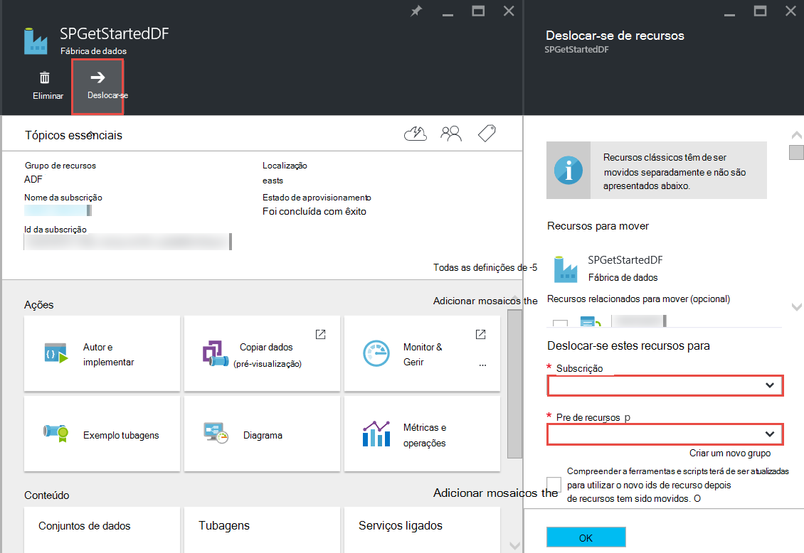

<properties 
    pageTitle="Dados Azure Factory - perguntas mais frequentes" 
    description="Perguntas mais frequentes sobre a fábrica de dados do Azure." 
    services="data-factory" 
    documentationCenter="" 
    authors="sharonlo101" 
    manager="jhubbard" 
    editor="monicar"/>

<tags 
    ms.service="data-factory" 
    ms.workload="data-services" 
    ms.tgt_pltfrm="na" 
    ms.devlang="na" 
    ms.topic="article" 
    ms.date="09/12/2016" 
    ms.author="shlo"/>

# Dados Azure Factory - perguntas mais frequentes

## Perguntas gerais

### O que é o Azure fábrica de dados?

Fábrica de dados é uma conta baseada na nuvem que **automatiza de movimento e de transformação de dados**de serviço de integração de dados. Tal como uma fábrica que é executada equipamento para tirar matéria e transformá-los em produtos terminados, dados fábrica orquestra serviços existentes que recolhem dados não processados e transformam-informações prontos a utilizar. 
 
Dados fábrica permite-lhe criar condicionados por dados fluxos de trabalho para mover dados entre tanto no local e na nuvem arquivos de dados, bem como processo/transformar dados utilizando os serviços de cluster como Azure HDInsight e Azure dados Lake Analytics. Depois de criar uma tubagem que executa a ação que necessita, pode agendar para executar periodicamente (hora a hora, diária, semanal, etc.).   

Consulte o artigo [Descrição geral e conceitos chave](data-factory-introduction.md) para obter mais detalhes. 

### Onde posso encontrar preços detalhes do Azure fábrica de dados?

Ver a [página de detalhes de preços dos dados fábrica] [ adf-pricing-details] para os detalhes do preços para a fábrica de dados do Azure.  

### Como posso começar a com a fábrica de dados do Azure?

- Para obter uma descrição geral da fábrica de dados do Azure, consulte o artigo [Introdução ao Azure fábrica de dados](data-factory-introduction.md).
- Para obter um tutorial sobre como **Copiar/mover dados** através de atividade de cópia, consulte o artigo [copiar dados a partir do armazenamento de Blobs do Azure base de dados do SQL Azure](data-factory-copy-data-from-azure-blob-storage-to-sql-database.md).
- Para obter um tutorial sobre como **transformar dados** utilizando a atividade de Hive HDInsight. Consulte o artigo [processo dados executando ramo script num cluster de Hadoop](data-factory-build-your-first-pipeline.md) 
  
### O que é a disponibilidade de região a fábrica de dados?
Fábrica de dados está disponível no **Europa Norte**e **Oeste dos EUA** . Os serviços de cluster e armazenamento utilizados pelo fábricas de dados podem ser noutras regiões. Consulte o artigo [regiões suportados](data-factory-introduction.md#supported-regions). 
 
### Quais são os limites num número de dados fábricas/tubagens/atividades/conjuntos de dados?
 
Consulte a secção o artigo de [subscrição do Azure e limites de serviço, Quotas e restrições](../azure-subscription-service-limits.md#data-factory-limits) para **Limites de fábrica do Azure dados** .

### O que é a experiência de criação/programador com o serviço de fábrica do Azure dados?

Pode autor/criar fábricas de dados utilizando um dos seguintes procedimentos:

- **Azure portal**  
   pás Factory dados no portal do Azure fornecem interface de utilizador formatado para criar serviços de dados de fábricas ad ligada. O **Editor de fábrica do mesmo de dados**, que também é parte do portal, permite-lhe criar facilmente serviços ligados, tabelas, conjuntos de dados e tubagens ao especificar definições de JSON para esses artefactos. Consulte o artigo [criar a sua primeira pipeline de dados através do portal Azure](data-factory-build-your-first-pipeline-using-editor.md) para um exemplo de utilizando o portal/editor para criar e implementar uma fábrica de dados.

- **Visual Studio**  
   que pode utilizar o Visual Studio para criar uma fábrica dados Azure. Consulte o artigo [criar a sua primeira pipeline de dados utilizando o Visual Studio](data-factory-build-your-first-pipeline-using-vs.md) para obter detalhes. 

- **Azure PowerShell**  
   para tutorial/instruções para criar uma fábrica de dados através do PowerShell, consulte [criar e monitor Azure fábrica de dados através do Azure PowerShell](data-factory-build-your-first-pipeline-using-powershell.md) . Consulte o artigo [Referência da linguagem fábrica Cmdlet] [ adf-powershell-reference] conteúdo na biblioteca MSDN para obter uma documentação abrangente de cmdlets fábrica de dados.
   
- **Biblioteca de classes .NET**  
   através de programação pode criar fábricas de dados utilizando a fábrica de dados .NET SDK. Consulte o artigo [criar, monitorizar e gerir fábricas de dados utilizando .NET SDK](data-factory-create-data-factories-programmatically.md) para obter instruções sobre a criação de uma fábrica de dados utilizando .NET SDK. Consulte o artigo [Referência da linguagem fábrica classe biblioteca] [ msdn-class-library-reference] para documentação abrangente de dados fábrica .NET SDK.

- **REST API**  
   também pode utilizar a API REST exposto pelo serviço de fábrica do Azure dados para criar e implementar fábricas de dados. Consulte o artigo [Referência da linguagem fábrica REST API] [ msdn-rest-api-reference] para documentação abrangente de dados fábrica REST API.
 
- **Modelo do Gestor de recursos do Azure** 
   consulte [Tutorial: criar a primeira fábrica de dados Azure utilizando o Gestor de recursos do Azure modelo](data-factory-build-your-first-pipeline-using-arm.md) detalhes do tipo. 

### Pode mudar o nome de uma fábrica de dados?
Não. Como outros recursos Azure, o nome de uma fábrica Azure dados não pode ser alterado. 

### Posso mover uma fábrica de dados a partir de uma subscrição Azure para outro? 
Sim. Utilize o botão **Mover** no seu pá fábrica de dados, conforme mostrado no seguinte diagrama. 

### Quais são os ambientes de cluster suportados pela fábrica de dados?
A tabela seguinte fornece uma lista de ambientes de cluster suportados pelo dados fábrica e as atividades que podem ser executados em-los. 

| Calcular ambiente | Atividades |
| ------------------- | -------- | 
| [Cluster de HDInsight a pedido](data-factory-compute-linked-services.md#azure-hdinsight-on-demand-linked-service) ou [seu próprio cluster HDInsight](data-factory-compute-linked-services.md#azure-hdinsight-linked-service) | [DotNet](data-factory-use-custom-activities.md), [Hive](data-factory-hive-activity.md), [porco](data-factory-pig-activity.md), [MapReduce](data-factory-map-reduce.md), [Hadoop transmissão](data-factory-hadoop-streaming-activity.md) | 
| [Azure Batch](data-factory-compute-linked-services.md#azure-batch-linked-service) | [DotNet](data-factory-use-custom-activities.md) |  
| [Formação de máquina Azure](data-factory-compute-linked-services.md#azure-machine-learning-linked-service) | [Máquina de atividades de formação: lote execução e de recursos de atualização](data-factory-azure-ml-batch-execution-activity.md) |
| [A análise de dados Azure Lake](data-factory-compute-linked-services.md#azure-data-lake-analytics-linked-service) | [Lake análise de dados U-SQL](data-factory-usql-activity.md)
| [Azure SQL](data-factory-compute-linked-services.md#azure-sql-linked-service), [Armazém de dados do Azure SQL](data-factory-compute-linked-services.md#azure-sql-data-warehouse-linked-service), [SQL Server](data-factory-compute-linked-services.md#sql-server-linked-service) | [Procedimento armazenado](data-factory-stored-proc-activity.md)

## Atividades - perguntas mais frequentes
### Quais são os diferentes tipos de atividades que pode utilizar no pipeline fábrica de dados? 

- [Dados atividades de movimento](data-factory-data-movement-activities.md) para mover os dados.
- [Atividades de transformação de dados](data-factory-data-transformation-activities.md) para processo/transformar dados. 

### Quando uma actividade funciona?
A definição de configuração de **disponibilidade** na tabela de dados de saída determina quando é executada a atividade. Se forem especificados conjuntos de dados de entrada, a atividade verifica se todas as dependências de dados de entrada são correspondidas (ou seja, estado **pronto** ) antes de começar a funcionar. 

## Copiar actividade - perguntas mais frequentes
### É melhor ter uma tubagem com várias atividades ou uma tubagem separada para cada actividade? 
Tubagens são suposto existirem para juntar actividades relacionadas. Se os conjuntos de dados ligação-los não são consumidos por qualquer outra actividade fora de tubagem, pode manter as atividades no uma pipeline. Desta forma, que não precisa para períodos de ativos de tubagem de cadeia para que estes alinharem com os outros. Além disso, a integridade dos dados nas tabelas internas à tubagem melhor é preservada ao atualizar as em curso. Atualização de tubagem deixa de todas as atividades pipeline de essencialmente, remove-los e cria-los novamente. A partir de criação perspetiva, também poderá ser mais fácil de ver o fluxo de dados das atividades relacionadas num único ficheiro JSON para as em curso.

### Quais são os arquivos de dados suportados?
[AZURE.INCLUDE [data-factory-supported-data-stores](../../includes/data-factory-supported-data-stores.md)]

### Quais são os formatos de ficheiro suportados? 
[AZURE.INCLUDE [data-factory-file-format](../../includes/data-factory-file-format.md)]

### Onde é efetuada a operação de cópia? 
Consulte a secção [movimento dados globalmente disponíveis](data-factory-data-movement-activities.md#global) para obter detalhes. Resumindo, quando um arquivo de dados no local está envolvido, é efetuada a operação de cópia pelo Data Management Gateway no seu ambiente no local. E, quando o movimento de dados estiver entre dois arquivos de nuvem, é efetuada a operação de cópia na região mais próximo para a localização de sink na mesma localização geográfica. 

## Atividade de HDInsight - perguntas mais frequentes

### Que regiões são suportadas pelo HDInsight?

Consulte a secção disponibilidade geográficos o seguinte artigo: ou os [Detalhes de preços HDInsight][hdinsight-supported-regions].

### O que região é utilizada por um cluster de HDInsight a pedido?

Cluster HDInsight a pedido é criado na mesma região onde o armazenamento especificados para ser utilizado com o cluster existe.    

### Como associar contas de armazenamento adicional para o seu cluster HDInsight?

Se estiver a utilizar o seu próprio HDInsight Cluster (BYOC - trazer o seu Cluster próprio), consulte os seguintes tópicos: 

- [Utilizar um Cluster de HDInsight com contas de armazenamento alternativo e Metastores][hdinsight-alternate-storage]
- [Utilizar contas de armazenamento adicional com HDInsight ramo][hdinsight-alternate-storage-2]

Se estiver a utilizar um cluster da pedido que é criado pelo serviço fábrica de dados, especifique a contas de armazenamento adicional para o HDInsight ligadas serviço para que o serviço de dados fábrica pode registá-los em seu nome. Na definição do JSON para o serviço de ligadas a pedido, utilize a propriedade **additionalLinkedServiceNames** para especificar contas de armazenamento alternativo, conforme mostrado no seguinte fragmento JSON:
 
    {
        "name": "MyHDInsightOnDemandLinkedService",
        "properties":
        {
            "type": "HDInsightOnDemandLinkedService",
            "typeProperties": {
                "clusterSize": 1,
                "timeToLive": "00:01:00",
                "linkedServiceName": "LinkedService-SampleData",
                "additionalLinkedServiceNames": [ "otherLinkedServiceName1", "otherLinkedServiceName2" ] 
            }
        }
    } 

No exemplo acima, otherLinkedServiceName1 e otherLinkedServiceName2 representam serviços ligados cujas definições de contenham credenciais que precisa de aceder a contas de armazenamento alternativo HDInsight cluster.

## Setores do gráfico - perguntas mais frequentes

### Por que razão são minha entrados setores não no estado pronta?  
Um erro comum não está definir a propriedade **externos** **Verdadeiro** no conjunto de dados de entrada quando os dados de entrada forem externos à fábrica dados (não produzida pela fábrica de dados). 

No exemplo seguinte, só tem de configurar **externos** como verdadeiro no **dataset1**.  

**DataFactory1** Em curso 1: dataset1 -> activity1 -> dataset2 -> activity2 -> dataset3 Pipeline 2: dataset3 -> activity3 -> dataset4

Se tiver outro fábrica de dados com uma tubagem que retira dataset4 (produzidos pela pipeline 2 na fábrica de dados 1), marca dataset4 como um conjunto de dados externo, uma vez que o conjunto de dados é produzido por uma fábrica de dados diferentes (DataFactory1, não DataFactory2).  

**DataFactory2**    
Em curso 1: dataset4 -> activity4 -> dataset5

Se a propriedade externa estiver definida corretamente, verifique se os dados de entrada existem na localização especificada na definição do conjunto de dados de entrada. 

### Como executar um setor noutra altura que meia-noite quando no setor é endereçados produzido diariamente?
Utilize a propriedade de **deslocamento** para especificar o tempo que pretende que o setor para ser apresentado. Consulte a secção [disponibilidade do conjunto de dados](data-factory-create-datasets.md#Availability) para obter detalhes sobre esta propriedade. Eis um breve exemplo:

    "availability":
    {
        "frequency": "Day",
        "interval": 1,
        "offset": "06:00:00"
    }

Os setores do gráfico diárias iniciar em **6 AM** em vez da meia-noite predefinido.     

### Como novamente o um setor?
Pode voltar a executar um setor de uma das seguintes formas: 

- Utilize o monitor do computador e gerir a aplicação para voltar a executar uma janela de atividade ou do setor. Consulte o artigo [selecionada de voltar a executar o windows de atividade](data-factory-monitor-manage-app.md#re-run-selected-activity-windows) para obter instruções.   
- Clique em **Executar** na barra de comandos na pá **SETOR de dados** para o setor no portal do Azure.
- Execute o cmdlet **Set-AzureRmDataFactorySliceStatus** com estado definido como **a aguardar** no setor.   
    
        Set-AzureRmDataFactorySliceStatus -Status Waiting -ResourceGroupName $ResourceGroup -DataFactoryName $df -TableName $table -StartDateTime "02/26/2015 19:00:00" -EndDateTime "02/26/2015 20:00:00" 

Consulte o artigo [Definir AzureRmDataFactorySliceStatus] [ set-azure-datafactory-slice-status] para obter detalhes sobre o cmdlet. 

### Quanto tempo demorar a processar um setor?
Utilize o Explorador de janela de atividade no Monitor e gerir a aplicação para saber quanto tempo demorou para processar um setor de dados. Consulte o artigo [Atividade janela Explorador](data-factory-monitor-manage-app.md#activity-window-explorer) para obter detalhes. 

Também pode fazer o seguinte procedimento no portal do Azure:  

1. Clique em mosaico de **conjuntos de dados** no pá a **Fábrica de dados** para a fábrica de dados.
2. Clique no conjunto de dados específico no pá **conjuntos de dados** .
3. Selecione no setor que está interessado na partir da lista **recentes os setores do gráfico** no pá a **tabela** .
4. Clique na atividade de executar a partir da lista de **Atividade execuções** na pá **SETOR de dados** . 
5. Clique em mosaico de **Propriedades** na pá **Detalhes da ATIVIDADE de executar** . 
6. Deverá ver o campo **duração** com um valor. Este valor é o tempo despendido a processar no setor.   

### Como parar de um setor em execução?
Se precisar de parar de tubagem seja executado, pode utilizar o cmdlet [AzureRmDataFactoryPipeline suspender](https://msdn.microsoft.com/library/mt603721.aspx) . Atualmente, suspender pipeline de não pare as execuções do setor que estão em curso. Depois de concluir as execuções em curso, sem setor extra é recolhida.

Se realmente quer parar a todas as execuções imediatamente, a única forma seria eliminar a tubagem e criá-lo novamente. Se optar por eliminar as em curso, não terá de eliminar tabelas e serviços ligados utilizados pelas em curso. 

[create-factory-using-dotnet-sdk]: data-factory-create-data-factories-programmatically.md
[msdn-class-library-reference]: https://msdn.microsoft.com/library/dn883654.aspx
[msdn-rest-api-reference]: https://msdn.microsoft.com/library/dn906738.aspx

[adf-powershell-reference]: https://msdn.microsoft.com/library/dn820234.aspx 
[azure-portal]: http://portal.azure.com
[set-azure-datafactory-slice-status]: https://msdn.microsoft.com/library/mt603522.aspx

[adf-pricing-details]: http://go.microsoft.com/fwlink/?LinkId=517777
[hdinsight-supported-regions]: http://azure.microsoft.com/pricing/details/hdinsight/
[hdinsight-alternate-storage]: http://social.technet.microsoft.com/wiki/contents/articles/23256.using-an-hdinsight-cluster-with-alternate-storage-accounts-and-metastores.aspx
[hdinsight-alternate-storage-2]: http://blogs.msdn.com/b/cindygross/archive/2014/05/05/use-additional-storage-accounts-with-hdinsight-hive.aspx
 
