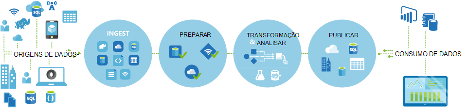

<properties 
    pageTitle="Introdução a fábrica de dados, o serviço de integração de dados | Microsoft Azure" 
    description="Saiba o que é o Azure dados fábrica: um serviço de integração de dados na nuvem que orquestra e automatiza movimento e de transformação de dados." 
    keywords="integração de dados, integração de dados na nuvem, o que é a fábrica de dados azure"
    services="data-factory" 
    documentationCenter="" 
    authors="sharonlo101" 
    manager="jhubbard" 
    editor="monicar"/>

<tags 
    ms.service="data-factory" 
    ms.workload="data-services" 
    ms.tgt_pltfrm="na" 
    ms.devlang="na" 
    ms.topic="get-started-article" 
    ms.date="09/22/2016" 
    ms.author="shlo"/>

# Introdução ao serviço de fábrica do Azure dados, um serviço de integração de dados na nuvem

## O que é o Azure fábrica de dados? 
Fábrica de dados é um serviço de integração de dados baseadas na nuvem que orquestra e automatiza o **movimento** e **transformação** de dados. Pode criar soluções de integração de dados utilizando o serviço de fábrica de dados que podem ingerir esta última dados a partir de vários arquivos de dados, os dados de transformação/processo e publicar os dados de resultados para os arquivos de dados. 

Serviço de fábrica do mesmo dados permite-lhe criar tubagens de dados que mova e transformam os dados e, em seguida, execute as tubagens numa agenda especificada (hora a hora, diária, semanal, etc.). Também fornece visualizações para apresentar a linhagem da e dependências entre o seu tubagens de dados e monitorizar todos os seus tubagens de dados a partir de uma vista individual unificada para identificar facilmente problemas e configuração monitorizar os alertas.

**Figure1.** Ingerir esta última dados a partir de várias origens de dados, preparar, transformar e analisar os dados e, em seguida, publicar dados prontos a utilizar para consumo.

## Tubagens e atividades
Numa solução fábrica de dados, criar um ou mais dados **tubagens**. Uma tubagem é um agrupamento lógico de atividades. São utilizadas para atividades de grupo numa unidade que em conjunto efectuar uma tarefa. 

**Atividades de** definir as ações para efetuar dos seus dados. Por exemplo, pode utilizar uma atividade de copiar para copiar dados a partir do arquivo de dados de um arquivo de dados de outra. Da mesma forma, pode utilizar uma atividade de ramo, executa uma consulta de ramo num cluster Azure HDInsight para transformar ou analisar os seus dados. Dados fábrica suporta dois tipos de atividades: atividades de movimento de dados e as atividades de transformação de dados. 
  
## Atividades de movimento de dados 
[AZURE.INCLUDE [data-factory-supported-data-stores](../../includes/data-factory-supported-data-stores.md)]

Consulte o artigo [Dados movimento atividades](data-factory-data-movement-activities.md) artigo para obter mais detalhes. 

## Atividades de transformação de dados
[AZURE.INCLUDE [data-factory-transformation-activities](../../includes/data-factory-transformation-activities.md)]

Ver [Atividades de transformação de dados](data-factory-data-transformation-activities.md) artigo para obter mais detalhes.

Se precisar de deslocar-se para a dados de um arquivo de dados que copiar atividade não suportar, ou transformar dados utilizando a sua própria lógica, criar uma **atividade de .NET personalizada**. Para obter detalhes sobre como criar e utilizar uma atividade personalizada, consulte o artigo [atividades personalizadas de utilização no pipeline fábrica de dados do Azure](data-factory-use-custom-activities.md).

## Serviços ligados
Serviços ligados definem as informações necessárias para fábrica de dados ligar a recursos externos (exemplos: armazenamento do Windows Azure, no local do SQL Server, Azure HDInsight). Serviços ligados são utilizados para fins de duas numa fábrica de dados:

- Para representar um **arquivo de dados** incluindo, mas não limitado, no local do SQL Server, base de dados Oracle, ficheiro partilhar, ou uma conta de armazenamento de Blobs do Azure. Consulte a secção de [atividades de movimento de dados](data-factory-data-movement-activities.md) para obter uma lista de arquivos de dados suportados. 
- Para representar um **recurso de calcular** que pode alojar a execução de uma atividade. Por exemplo, a atividade de HDInsightHive é executado um cluster de HDInsight Hadoop. Consulte a secção [atividades de transformação de dados](data-factory-data-transformation-activities.md) para obter uma lista de ambientes de cluster suportados. 

## Conjuntos de dados 
Serviços ligados ligação arquivos de dados para uma fábrica dados Azure. Conjuntos de dados representam estruturas de dados nos arquivos de dados. Por exemplo, um serviço de armazenamento do Windows Azure ligadas fornece informações de ligação de dados fábrica ligar a uma conta de armazenamento do Windows Azure. Um conjunto de dados de Blobs do Azure Especifica a contentor blob e a pasta no armazenamento de Blobs do Azure a partir do qual a tubagem deve ler os dados. Da mesma forma, um serviço do SQL Azure ligadas fornece informações de ligação para uma base de dados do Azure SQL e um conjunto de dados do Azure SQL Especifica a tabela que contém os dados.   

## Relação entre dados fábrica entidades
Dados fábrica tem alguns chaves entidades que funcionam em conjunto para definir a entrada e saída de dados, processamento de eventos e a agenda e recursos necessários para executar o fluxo de dados pretendido.

**figura 2.** Relações entre o serviço de conjunto de dados, atividade, tubagem e ligados

Com os quatro conceitos simples de serviços ligados, conjuntos de dados, atividades e tubagens, está pronto para começar! Pode [criar a sua primeira pipeline](data-factory-build-your-first-pipeline.md). 

## Regiões suportadas
Atualmente, pode criar fábricas dados das regiões **Oeste EUA**, **Leste dos EUA**e **Europa Norte** . No entanto, uma fábrica de dados pode aceder arquivos de dados e calcular serviços noutras regiões Azure para mover dados entre arquivos de dados ou dados de processo com calcular serviços. 

Azure fábrica dados propriamente dito não armazenar quaisquer dados. Permite-lhe criar condicionados por dados monetários para orquestrar movimento dos dados entre [suportadas arquivos de dados](data-factory-data-movement-activities.md#supported-data-stores) e de transformação de dados através [dos serviços de calcular](data-factory-compute-linked-services.md) noutras regiões ou num ambiente no local. -Lo também permite-lhe para [monitorizar e gerir fluxos de trabalho](data-factory-monitor-manage-pipelines.md) utilizando ambos programação e mecanismos de IU. 

Apesar de fábrica do Azure dados está disponível no **Apenas Ocidental EUA**, **Leste dos EUA**e regiões da **Europa Norte** , o serviço suporta o movimento de dados numa fábrica de dados está disponível [globalmente](data-factory-data-movement-activities.md#global) em várias regiões. No caso de um arquivo de dados fica atrás uma firewall, em seguida, um [Data Management Gateway](data-factory-move-data-between-onprem-and-cloud.md) instalado no seu ambiente no local move-se os dados em vez disso. 

Por exemplo, diga-nos partem do princípio de que os ambientes de cluster como Azure HDInsight cluster e Azure máquina aprendizagem estiver a executar o sair região da Europa Ocidental. Pode criar e utilizar uma instância de fábrica do Azure dados na Europa Norte e utilizá-la para agendar tarefas no seu ambientes cluster na Europa Ocidental. Bastam alguns em milissegundos para dados fábrica acionado a tarefa no seu ambiente de cluster mas não altera a hora para executar a tarefa no seu ambiente informático.

Estamos a intenção de ter a fábrica de dados do Azure no cada geografia suportada pelo Azure no futuro.
  
## Próximos passos
Para saber como criar fábricas de dados com tubagens de dados, siga as instruções passo a passo seguintes tutoriais. 

Tutorial | Descrição
-------- | -----------
[Criar uma tubagem de dados que processa dados utilizando Hadoop cluster](data-factory-build-your-first-pipeline.md) | Neste tutorial, irá criar primeira fábrica Azure dados com uma tubagem de dados que os **processos e dados** ao executar o script ramo num cluster Azure HDInsight (Hadoop). |
[Criar uma tubagem de dados para mover dados entre dois arquivos de dados da nuvem](data-factory-copy-data-from-azure-blob-storage-to-sql-database.md) | Neste tutorial, cria uma fábrica de dados com uma tubagem esse **move dados** a partir do armazenamento de BLOBs a base de dados do SQL.
[Criar uma tubagem de dados para mover dados entre um arquivo de dados no local e um arquivo de dados da nuvem utilizando o Data Management Gateway](data-factory-move-data-between-onprem-and-cloud.md) | Neste tutorial, criar uma fábrica de dados com uma tubagem esse **move dados** a partir de uma base de dados do SQL Server **no local** para uma BLOBs do Azure. Como parte do tutorial, instalar e configurar o Data Management Gateway no seu computador. 
