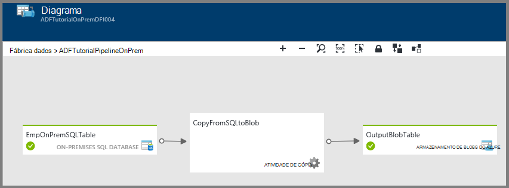
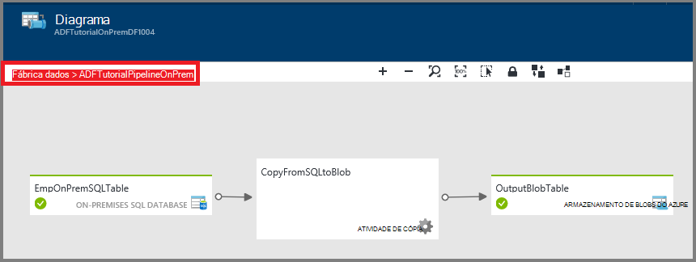
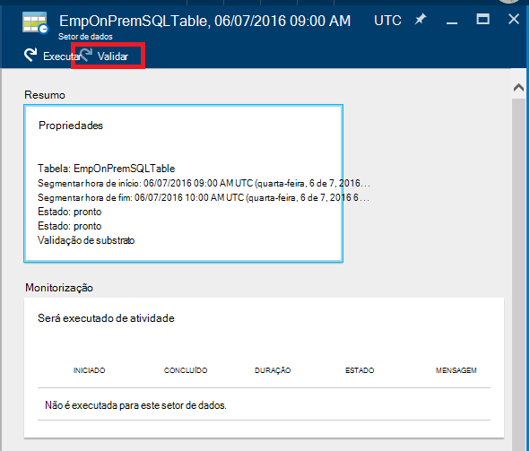
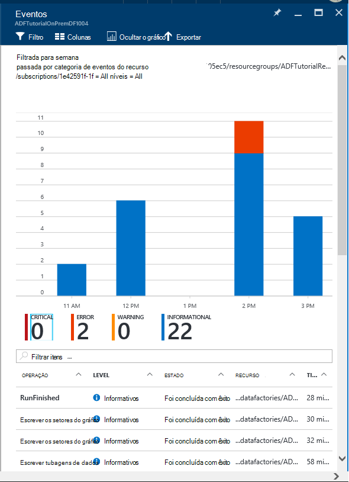

<properties 
    pageTitle="Monitorizar e gerir a fábrica de dados do Azure tubagens" 
    description="Saiba como utilizar o Portal do Azure e Azure PowerShell para monitorizar e gerir fábricas dados Azure e tubagens que criou." 
    services="data-factory" 
    documentationCenter="" 
    authors="spelluru" 
    manager="jhubbard" 
    editor="monicar"/>

<tags 
    ms.service="data-factory" 
    ms.workload="data-services" 
    ms.tgt_pltfrm="na" 
    ms.devlang="na" 
    ms.topic="article" 
    ms.date="09/06/2016" 
    ms.author="spelluru"/>

# Monitorizar e gerir a fábrica de dados do Azure tubagens
> [AZURE.SELECTOR]
- [Utilizar o Azure portal/Azure PowerShell](data-factory-monitor-manage-pipelines.md)
- [Utilizar a monitorização e gestão de aplicação](data-factory-monitor-manage-app.md)

O serviço de dados fábrica fornece uma vista completa e fiável dos seus serviços de movimento armazenamento, transformação e dados. O serviço fornece uma monitorização dashboard ajuda-o a que pode utilizar para efetuar as seguintes tarefas: 

- Avalie rapidamente o estado de funcionamento do pipeline de dados de fim para fim.
- Identificar problemas e efetuar a ação lentes caso seja necessário. 
- Linhagem de dados do registo. 
- Controlar relações entre os seus dados através de qualquer uma das suas fontes.
- Vista completa histórica gestão de contas de dependências, estado de funcionamento do sistema e execução de tarefas.

Este artigo descreve como monitorizar, gerir e depurar seu tubagens. Também fornece informações sobre como criar alertas e receber uma notificação no falhas.

## Compreender tubagens e Estados de atividade
Utilizar o portal do Azure, pode:

- Ver a fábrica de dados como um diagrama
- Ver atividades numa tubagem
- Ver conjuntos de dados de entrada e saídos
- e muito mais. 

Esta secção fornece também como um setor transições a partir de um Estado para outro Estado.   

### Navegue para a fábrica de dados
1.  Inicie sessão no [portal do Azure](https://portal.azure.com).
2.  Clique em **fábricas de dados** no menu à esquerda. Se não VI-lo, clique em **mais serviços >** e clique em **fábricas de dados** em categoria de **informações da empresa + ANALYTICS** . 

    

    Deverá ver todas as fábricas de dados a pá **fábricas de dados** . 
4. Na pá de fábricas dados, selecione a fábrica de dados que lhe interessam.

      
5.  e deverá ver a home page (pá**fábrica de dados** ) para a fábrica de dados.

    

#### Vista de diagrama da sua fábrica de dados
A vista de diagrama de uma fábrica dados fornece uma única painel da Lupa para monitorizar e gerir a fábrica de dados e os seus activos.

Para ver a vista de diagrama da sua fábrica de dados, clique em **diagrama** na página de base de dados fábrica do mesmo.

Pode ampliar, reduzir, zoom para ajustar, aplicar zoom a 100%, bloquear o esquema de diagrama e posicionar automaticamente tubagens e tabelas. Também pode ver as informações de linhagem da dados (Mostrar itens montante e descendentes dos itens seleccionados).
 

### Atividades dentro de uma tubagem 
1. Com o botão direito pipeline de e clique em **Abrir em curso** para ver todas as atividades no pipeline de juntamente com conjuntos de dados de entrada e saídos para as atividades. Esta funcionalidade é útil quando o pipeline compreende da atividade mais do que um e pretende compreender linhagem operacionais avançada de uma única tubagem.

      
2. No exemplo seguinte, verá duas atividades no pipeline de com as entradas e saídas. A atividade intitulada **JoinData** de tipo de atividade de Hive HDInsight e **EgressDataAzure** de tipo de atividade de cópia estão no pipeline exemplo. 
    
     
3. Pode navegar voltar à página de base de dados fábrica do mesmo ao clicar na ligação de fábrica do mesmo de dados na navegação de trilho no canto superior esquerdo.

    

### Estado da vista de cada actividade dentro de uma tubagem
Pode ver o estado atual de uma atividade, veja o estado de qualquer um dos conjuntos de dados produzidos pela atividade. 

Por exemplo: no exemplo seguinte, o **BlobPartitionHiveActivity** executou com êxito e produzidos um conjunto de dados denominado **PartitionedProductsUsageTable**, que se encontra no estado **pronta** .

Fazendo duplo clique sobre a **PartitionedProductsUsageTable** na vista de diagrama demonstra todos os setores produzidos pela será executado de atividade diferentes dentro de uma tubagem. Pode ver o **BlobPartitionHiveActivity** executado com êxito todos os meses para o último oito meses e produzidos os setores no estado **pronta** .

Os setores do conjunto de dados numa fábrica de dados podem ter um dos seguintes Estados:

<table>
<tr>
    <th align="left">Estado</th><th align="left">Subestado</th><th align="left">Descrição</th>
</tr>
<tr>
    <td rowspan="8">Em espera</td><td>ScheduleTime</td><td>Chegou a hora não para setor executar.</td>
</tr>
<tr>
<td>DatasetDependencies</td><td>As dependências montante não estão prontas.</td>
</tr>
<tr>
<td>ComputeResources</td><td>Os recursos de cluster não estão disponíveis.</td>
</tr>
<tr>
<td>ConcurrencyLimit</td> <td>Todas as instâncias de atividade são ocupadas a executar outras os setores do gráfico.</td>
</tr>
<tr>
<td>ActivityResume</td><td>Atividade está em pausa e não é possível executar os setores até retomá-lo.</td>
</tr>
<tr>
<td>Repetir</td><td>Execução de atividade é repetida.</td>
</tr>
<tr>
<td>Validação</td><td>Validação ainda não tem iniciadas.</td>
</tr>
<tr>
<td>ValidationRetry</td><td>A aguardar a validação de ser tentada novamente.</td>
</tr>
<tr>
<tr
<td rowspan="2">Em curso</td><td>Validar</td><td>Validação de progresso.</td>
</tr>
<td></td>
<td>No setor está a ser processado.</td>
</tr>
<tr>
<td rowspan="4">Ocorreu uma falha</td><td>Tempo limite excedido</td><td>Execução demorou mais tempo do que é permitido pela atividade.</td>
</tr>
<tr>
<td>Cancelado</td><td>Cancelado por ação do utilizador.</td>
</tr>
<tr>
<td>Validação</td><td>Falha na validação.</td>
</tr>
<tr>
<td></td><td>Ocorreu uma falha ao gerar e/ou validar no setor.</td>
</tr>
<td>Pronto</td><td></td><td>No setor está pronto para consumo.</td>
</tr>
<tr>
<td>Ignorado</td><td></td><td>Não é processado no setor.</td>
</tr>
<tr>
<td>Nenhum</td><td></td><td>Um setor que utilizado existir com o estado de diferentes, mas tiver sido reposta.</td>
</tr>
</table>

Pode ver os detalhes sobre um setor ao clicar numa entrada de setor na pá **Recentemente atualizados os setores do gráfico** .

 
Se foi executado no setor várias vezes, poderá ver várias linhas, na lista de **atividade é executado** . Pode ver os detalhes sobre uma actividade executar clicando a entrada executar na lista de **que atividade é executado** . A lista apresenta todos os ficheiros de registo juntamente com uma mensagem de erro se qualquer. Esta funcionalidade é útil para ver registos e de depuração sem ter de sair a fábrica de dados.

Se não estiver no setor no estado **pronta** , pode ver os montante os setores do gráfico que não estão prontos e que estejam a impedir o setor atual a partir de executar na lista de **montante os setores do gráfico que são ainda não está prontos** . Esta funcionalidade é útil quando se encontra o setor num estado **à espera** e quiser compreender as dependências montante no qual o setor está à espera.

### Diagrama do Estado do conjunto de dados
Quando implementar uma fábrica de dados e as tubagens têm um período de ativo válido, o conjunto de dados setores transição a partir de um Estado para outro. Atualmente o estado do setor segue diagrama do Estado do seguinte:

O fluxo de transição de estado do conjunto de dados numa fábrica de dados: a aguardar -> em curso/em curso (Validating) -> pronto/falhou

Iniciam os setores num estado **em espera** para condições prévias seja cumprida antes de executar. Em seguida, a atividade de começar a ser executada e no setor vai no estado **Em curso** . A execução de atividade pode ser concluída com êxito ou falhar. No setor é assinalado como **pronto**' ou **falhou** com base no resultado da execução. 

Pode repor o setor para voltar a partir do estado **pronto** ou **Falha** ao estado **em espera** . Pode também marcar o estado da setor **Ignorar**, que impede a atividade de executar e não no setor do processo.

## Gerir tubagens
Pode gerir o seu tubagens através do Azure PowerShell. Por exemplo, pode interromper e retomar tubagens ao executar os cmdlets do Azure PowerShell. 

### Interromper e retomar tubagens
Pode colocar em pausa/suspender tubagens utilizando o cmdlet do Powershell **AzureRmDataFactoryPipeline suspender** . Este cmdlet é útil quando não pretende executar as tubagens até que um problema seja resolvido.

Por exemplo: no ecrã seguinte captura, foi identificou um problema com o **PartitionProductsUsagePipeline** numa **productrecgamalbox1dev** fábrica de dados e queremos suspender as em curso.

Para suspender uma tubagem, execute o seguinte comando do PowerShell:

    Suspend-AzureRmDataFactoryPipeline [-ResourceGroupName] <String> [-DataFactoryName] <String> [-Name] <String>

Por exemplo:

    Suspend-AzureRmDataFactoryPipeline -ResourceGroupName ADF -DataFactoryName productrecgamalbox1dev -Name PartitionProductsUsagePipeline 

Assim que tiver sido fixado o problema com o **PartitionProductsUsagePipeline**, pode ser retomado pipeline de suspenso executando o seguinte comando PowerShell:

    Resume-AzureRmDataFactoryPipeline [-ResourceGroupName] <String> [-DataFactoryName] <String> [-Name] <String>

Por exemplo:

    Resume-AzureRmDataFactoryPipeline -ResourceGroupName ADF -DataFactoryName productrecgamalbox1dev -Name PartitionProductsUsagePipeline 

## Depurar tubagens
Azure dados fábrica fornece capacidades de avançada através do Azure portal e Azure o PowerShell para depurar e resolver problemas de tubagens.

### Encontrar erros numa tubagem
Se a execução de atividade falhar numa tubagem, é o conjunto de dados produzido pela pipeline de num Estado de erro devido a falha. Pode depurar e resolução de problemas no Azure dados fábrica utilizando os seguintes mecanismos.

#### Utilize o portal do Azure depurar um erro:

3.  Na pá **tabela** , clique no setor problema com o **Estado** definido como **falhou**.

    
4.  No pá **SETOR dados** , clique na atividade de executar que falhou.
    
    
5.  No pá **Detalhes da ATIVIDADE de executar** , pode transferir os ficheiros associados o processamento de HDInsight. Clique em transferir para Estado/stderr transferir o ficheiro de registo de erro que contém os detalhes sobre o erro.

      

#### Utilizar o PowerShell para depurar um erro
1.  Inicie o **Azure PowerShell**.
3.  Execute o comando **Get-AzureRmDataFactorySlice** para ver os setores e os respetivos Estados. Deverá visualizar um setor com o estado: **falhou**.       

            Get-AzureRmDataFactorySlice [-ResourceGroupName] <String> [-DataFactoryName] <String> [-TableName] <String> [-StartDateTime] <DateTime> [[-EndDateTime] <DateTime> ] [-Profile <AzureProfile> ] [ <CommonParameters>]
    
    Por exemplo:
        
            Get-AzureRmDataFactorySlice -ResourceGroupName ADF -DataFactoryName LogProcessingFactory -TableName EnrichedGameEventsTable -StartDateTime 2014-05-04 20:00:00

    Substitua o valor de data/hora_início que especificou para o conjunto-AzureRmDataFactoryPipelineActivePeriod **Data/Hora_início** .
4. Agora, execute o cmdlet **Get-AzureRmDataFactoryRun** para obter detalhes sobre atividade executar para no setor.

        Get-AzureRmDataFactoryRun [-ResourceGroupName] <String> [-DataFactoryName] <String> [-TableName] <String> [-StartDateTime] 
        <DateTime> [-Profile <AzureProfile> ] [ <CommonParameters>]
    
    Por exemplo:

        Get-AzureRmDataFactoryRun -ResourceGroupName ADF -DataFactoryName LogProcessingFactory -TableName EnrichedGameEventsTable -StartDateTime "5/5/2014 12:00:00 AM"

    O valor de data/hora_início é hora de início do setor erro/problema que anotou no passo anterior. Data-hora deve ser colocada entre aspas.
5.  Deverá ver o resultado com detalhes sobre o erro (semelhante ao seguinte):

            Id                      : 841b77c9-d56c-48d1-99a3-8c16c3e77d39
            ResourceGroupName       : ADF
            DataFactoryName         : LogProcessingFactory3
            TableName               : EnrichedGameEventsTable
            ProcessingStartTime     : 10/10/2014 3:04:52 AM
            ProcessingEndTime       : 10/10/2014 3:06:49 AM
            PercentComplete         : 0
            DataSliceStart          : 5/5/2014 12:00:00 AM
            DataSliceEnd            : 5/6/2014 12:00:00 AM
            Status                  : FailedExecution
            Timestamp               : 10/10/2014 3:04:52 AM
            RetryAttempt            : 0
            Properties              : {}
            ErrorMessage            : Pig script failed with exit code '5'. See wasb://     adfjobs@spestore.blob.core.windows.net/PigQuery
                                            Jobs/841b77c9-d56c-48d1-99a3-
                        8c16c3e77d39/10_10_2014_03_04_53_277/Status/stderr' for
                        more details.
            ActivityName            : PigEnrichLogs
            PipelineName            : EnrichGameLogsPipeline
            Type                    :
    
    
6.  Pode executar cmdlet **AzureRmDataFactoryLog guardar** com o valor de Id que vê do que a saída e transferir os ficheiros de registo com a **-DownloadLogsoption** o para o cmdlet.

            Save-AzureRmDataFactoryLog -ResourceGroupName "ADF" -DataFactoryName "LogProcessingFactory" -Id "841b77c9-d56c-48d1-99a3-8c16c3e77d39" -DownloadLogs -Output "C:\Test"

## Volte a executar o falhas numa tubagem

### Através do portal Azure

Depois de resolução de problemas e depurar falhas numa tubagem, pode executar novamente falhas ao navegar para o setor do erro e clicar no botão **Executar** na barra de comandos.

Caso o setor falhou devido uma falha de política (para ex: dados não estão disponíveis), pode resolver a falha e volte a validar ao clicar no botão **para validar** na barra de comandos.

### Utilizar o Azure PowerShell

Pode voltar a executar falhas utilizando o cmdlet Set-AzureRmDataFactorySliceStatus. Consulte o artigo [Definir AzureRmDataFactorySliceStatus](https://msdn.microsoft.com/library/mt603522.aspx) tópico para obter a sintaxe e outros detalhes sobre o cmdlet. 

**Exemplo:** O exemplo seguinte define o estado de todos os setores do gráfico para a tabela 'DAWikiAggregatedData' para aguardar na fábrica dados Azure 'WikiADF'.

O UpdateType está definido para UpstreamInPipeline, o que significa que os Estados de cada setor para a tabela e todas as tabelas (montante) dependentes estão definidos para "A aguardar." Outro valor possível para este parâmetro é "Indivíduo."

    Set-AzureRmDataFactorySliceStatus -ResourceGroupName ADF -DataFactoryName WikiADF -TableName DAWikiAggregatedData -Status Waiting -UpdateType UpstreamInPipeline -StartDateTime 2014-05-21T16:00:00 -EndDateTime 2014-05-21T20:00:00

## Criar alertas
Azure utilizador dos eventos quando um recurso Azure (por exemplo, uma fábrica de dados) é criado, actualizado ou eliminado. Pode criar alertas sobre esses eventos. Dados fábrica permite-lhe capturar a várias métricas e criar alertas em métricas. Recomendamos que utilize eventos de monitorização e métricas em tempo real para efeitos de histórico. 

### Alertas de eventos
Eventos Azure fornecem informações úteis para o que se passa nos seus recursos Azure. Azure utilizador dos eventos quando um recurso Azure (por exemplo, uma fábrica de dados) é criado, actualizado ou eliminado. Ao utilizar a fábrica de dados do Azure, eventos gerados quando:

- Azure fábrica de dados é criada/atualizados/eliminados.
- Processamento de dados (denominado como será executado) foi iniciado/concluída.
- Um cluster de HDInsight a pedido é criado e removido.

Pode criar alertas sobre esses eventos de utilizador e configurá-los para enviar notificações de correio eletrónico para o administrador e coadministradores da subscrição. Além disso, pode especificar endereços de e-mail adicionais de utilizadores que precisam de receber notificações de correio eletrónico quando as condições forem cumpridas. Esta funcionalidade é útil quando pretende receber uma notificação no falhas e não quiser monitorizar constantemente a fábrica de dados.

> [AZURE.NOTE] Atualmente, o portal de não mostrar alertas eventos. Utilize a [monitorização e gestão de aplicação](data-factory-monitor-manage-app.md) para ver todos os alertas.

#### Especificar uma definição de alerta:
Para especificar uma definição de alerta, cria um ficheiro JSON descrever as operações que pretende ser alertado no. No exemplo seguinte, o alerta envia uma notificação de e-mail para a operação de RunFinished. Para que seja específico, uma notificação de correio eletrónico é enviada quando tiver concluído uma executar na fábrica de dados e a executar uma falha (estado = FailedExecution).

    {
        "contentVersion": "1.0.0.0",
         "$schema": "http://schema.management.azure.com/schemas/2014-04-01-preview/deploymentTemplate.json#",
        "parameters": {},
        "resources": 
        [
            {
                "name": "ADFAlertsSlice",
                "type": "microsoft.insights/alertrules",
                "apiVersion": "2014-04-01",
                "location": "East US",
                "properties": 
                {
                    "name": "ADFAlertsSlice",
                    "description": "One or more of the data slices for the Azure Data Factory has failed processing.",
                    "isEnabled": true,
                    "condition": 
                    {
                        "odata.type": "Microsoft.Azure.Management.Insights.Models.ManagementEventRuleCondition",
                        "dataSource": 
                        {
                            "odata.type": "Microsoft.Azure.Management.Insights.Models.RuleManagementEventDataSource",
                            "operationName": "RunFinished",
                            "status": "Failed",
                            "subStatus": "FailedExecution"   
                        }
                    },
                    "action": 
                    {
                        "odata.type": "Microsoft.Azure.Management.Insights.Models.RuleEmailAction",
                        "customEmails": [ "<your alias>@contoso.com" ]
                    }
                }
            }
        ]
    }

Da definição do JSON, **subestado** podem ser removidos se não pretender recebê-las numa falha de específica.

Este exemplo configura o alerta para todos os fábricas de dados na sua subscrição. Se pretender que o alerta para ser definido para uma fábrica de dados em particular, pode especificar dados fábrica **URI do recurso** na **origem de dados**:

    "resourceUri" : "/SUBSCRIPTIONS/<subscriptionId>/RESOURCEGROUPS/<resourceGroupName>/PROVIDERS/MICROSOFT.DATAFACTORY/DATAFACTORIES/<dataFactoryName>"

A tabela seguinte fornece a lista de operações disponíveis e Estados (e sub-Estados).

Nome da operação | Estado | Estado de sub
-------------- | ------ | ----------
RunStarted | Iniciado | Iniciar
RunFinished | Ocorreu uma falha / foi concluída com êxito | FailedResourceAllocation  Foi concluída com êxito  FailedExecution  Tempo limite excedido  < cancelada  FailedValidation  Abandonadas
OnDemandClusterCreateStarted | Iniciado
OnDemandClusterCreateSuccessful | Foi concluída com êxito
OnDemandClusterDeleted | Foi concluída com êxito

Consulte o artigo [Criar regra alerta](https://msdn.microsoft.com/library/azure/dn510366.aspx) para obter detalhes sobre os elementos JSON utilizados no exemplo. 

#### Implementar o alerta 
Para implementar o alerta, utilize o cmdlet do Azure PowerShell: **Novo AzureRmResourceGroupDeployment**, conforme mostrado no exemplo seguinte:

    New-AzureRmResourceGroupDeployment -ResourceGroupName adf -TemplateFile .\ADFAlertFailedSlice.json  

Assim que a implementação de grupo de recursos foi concluída com êxito, verá as seguintes mensagens:

    VERBOSE: 7:00:48 PM - Template is valid.
    WARNING: 7:00:48 PM - The StorageAccountName parameter is no longer used and will be removed in a future release.
    Please update scripts to remove this parameter.
    VERBOSE: 7:00:49 PM - Create template deployment 'ADFAlertFailedSlice'.
    VERBOSE: 7:00:57 PM - Resource microsoft.insights/alertrules 'ADFAlertsSlice' provisioning status is succeeded
    
    DeploymentName    : ADFAlertFailedSlice
    ResourceGroupName : adf
    ProvisioningState : Succeeded
    Timestamp         : 10/11/2014 2:01:00 AM
    Mode              : Incremental
    TemplateLink      :
    Parameters        :
    Outputs           :

> [AZURE.NOTE] Pode utilizar a API do resto [Criar regra de alerta](https://msdn.microsoft.com/library/azure/dn510366.aspx) para criar uma regra de alerta. A carga útil JSON é semelhante ao exemplo JSON.  

#### Obter a lista de implementações de grupo de recursos do Azure
Para obter a lista de implementações do grupo de recursos do Azure implementadas, utilize o cmdlet: **Get-AzureRmResourceGroupDeployment**, conforme mostrado no exemplo seguinte:

    Get-AzureRmResourceGroupDeployment -ResourceGroupName adf
    
    DeploymentName    : ADFAlertFailedSlice
    ResourceGroupName : adf
    ProvisioningState : Succeeded
    Timestamp         : 10/11/2014 2:01:00 AM
    Mode              : Incremental
    TemplateLink      :
    Parameters        :
    Outputs           :

#### Resolução de problemas de eventos do utilizador

1. Pode ver todos os eventos gerados depois de clicar no mosaico **métricas e operações** .

    

2. Clique em mosaico de **eventos** para ver os eventos. 

    
3. No pá **eventos** , pode ver os detalhes sobre eventos, filtrar eventos e assim sucessivamente. 

    
4. Clique numa **operação** na lista operações que provoca um erro.
    
     
5. Clique num evento de **erro** para ver os detalhes sobre o erro.

    
  

Consulte o artigo [Azure conhecimentos aprofundados Cmdlets](https://msdn.microsoft.com/library/mt282452.aspx) artigo para os cmdlets do PowerShell que pode utilizar para alertas de adicionar/obter/remover. Eis alguns exemplos de utilizando o cmdlet **Get-AlertRule** : 

    PS C:\> get-alertrule -res $resourceGroup -n ADFAlertsSlice -det
        
            Properties :
            Action      : Microsoft.Azure.Management.Insights.Models.RuleEmailAction
            Condition   :
            DataSource :
            EventName             :
            Category              :
            Level                 :
            OperationName         : RunFinished
            ResourceGroupName     :
            ResourceProviderName  :
            ResourceId            :
            Status                : Failed
            SubStatus             : FailedExecution
            Claims                : Microsoft.Azure.Management.Insights.Models.RuleManagementEventClaimsDataSource
            Condition   :
            Description : One or more of the data slices for the Azure Data Factory has failed processing.
            Status      : Enabled
            Name:       : ADFAlertsSlice
            Tags       :
            $type          : Microsoft.WindowsAzure.Management.Common.Storage.CasePreservedDictionary, Microsoft.WindowsAzure.Management.Common.Storage
            Id: /subscriptions/<subscription ID>/resourceGroups/<resource group name>/providers/microsoft.insights/alertrules/ADFAlertsSlice
            Location   : West US
            Name       : ADFAlertsSlice
    
    PS C:\> Get-AlertRule -res $resourceGroup

            Properties : Microsoft.Azure.Management.Insights.Models.Rule
            Tags       : {[$type, Microsoft.WindowsAzure.Management.Common.Storage.CasePreservedDictionary, Microsoft.WindowsAzure.Management.Common.Storage]}
            Id         : /subscriptions/<subscription id>/resourceGroups/<resource group name>/providers/microsoft.insights/alertrules/FailedExecutionRunsWest0
            Location   : West US
            Name       : FailedExecutionRunsWest0
    
            Properties : Microsoft.Azure.Management.Insights.Models.Rule
            Tags       : {[$type, Microsoft.WindowsAzure.Management.Common.Storage.CasePreservedDictionary, Microsoft.WindowsAzure.Management.Common.Storage]}
            Id         : /subscriptions/<subscription id>/resourceGroups/<resource group name>/providers/microsoft.insights/alertrules/FailedExecutionRunsWest3
            Location   : West US
            Name       : FailedExecutionRunsWest3

    PS C:\> Get-AlertRule -res $resourceGroup -Name FailedExecutionRunsWest0
    
            Properties : Microsoft.Azure.Management.Insights.Models.Rule
            Tags       : {[$type, Microsoft.WindowsAzure.Management.Common.Storage.CasePreservedDictionary, Microsoft.WindowsAzure.Management.Common.Storage]}
            Id         : /subscriptions/<subscription id>/resourceGroups/<resource group name>/providers/microsoft.insights/alertrules/FailedExecutionRunsWest0
            Location   : West US
            Name       : FailedExecutionRunsWest0

Execute os seguintes comandos de obter ajuda para ver os detalhes e exemplos para o cmdlet Get-AlertRule. 

    get-help Get-AlertRule -detailed 
    get-help Get-AlertRule -examples

- Se vir os eventos de alerta geração no portal pá, mas não receber notificações de correio eletrónico, verifique se o endereço de e-mail especificado está definido para receber e-mails de remetentes externos. Alertas de mensagens de correio eletrónico podem ter foi bloqueadas pelas definições de correio electrónico.

### Alertas no métricas
Dados fábrica permite-lhe capturar a várias métricas e criar alertas em métricas. Pode monitorizar e criar alertas nas seguintes métricas para os setores na sua fábrica de dados.
 
- Falhado será executado
- Será executado com êxito

Estes métricas são úteis e permitem-lhe obter uma descrição geral do será executado global falha e bem sucedida na sua fábrica de dados. Métricas são emitidas sempre que existe um setor executar. Na parte superior da hora, estes métricas são agregadas seguia e à sua conta de armazenamento. Por conseguinte, para ativar métricas, configure uma conta de armazenamento.

#### Activar métricas:
Para ativar métricas, clique na partir do pá fábrica de dados:

**Monitorização** -> **métrica** -> **definições de diagnóstico** -> **diagnóstico**

Na pá **diagnóstico** , clique **no** e selecione a conta de armazenamento e guardar.

Assim que é guardado, poderá demorar até uma hora para métricas esteja visível no pá a monitorização, uma vez que a agregação métricas acontece por hora.

### Configurar um alerta métricas:

Clique em **dados fábrica métricas** pá: 

No pá **métrica** , clique em **+ Adicionar alerta** na barra de ferramentas. 

Na página **Adicionar uma regra de alerta** , execute os seguintes passos e clique em **OK**.
 
- Introduza um nome para o alerta (exemplo: Falha ao alerta).
- Introduza uma descrição para o alerta (exemplo: enviar uma mensagem de e-mail quando ocorre uma falha).
- Selecione uma métrica (falhadas execuções vs. será executado com êxito).
- Especificar uma condição e um valor limite.   
- Especifique o período. 
- Especifique se deve ser enviada uma mensagem de e-mail para os proprietários, contribuintes e os leitores.
- e muito mais. 

Assim que a regra alerta for adicionada com êxito, o pá fecha e ver o novo alerta na página **métrica** . 

Também deverá ver o número de alertas no mosaico **alertas** . Clique em **alertas** mosaico.

Na pá **alertas** , pode ver todos os alertas existentes. Para adicionar um alerta, clique em **Adicionar alerta** na barra de ferramentas.

### Notificações de alerta:
Assim que a regra alerta corresponde a condição, deve obter um alerta de e-mail ativado. Quando o problema for resolvido e a condição alerta não correspondem ao qualquer mais, receberá uma mensagem de e-mail resolvida alerta.

Este comportamento é diferente de eventos onde uma notificação é enviada em cada caso de falha para a regra que alerta são elegíveis.

### Implementar alertas através do PowerShell
Pode implementar alertas para métricas da mesma forma, tal como o faria para eventos. 

**Definição de alerta:**

    {
        "contentVersion" : "1.0.0.0",
        "$schema" : "http://schema.management.azure.com/schemas/2014-04-01-preview/deploymentTemplate.json#",
        "parameters" : {},
        "resources" : [
        {
                "name" : "FailedRunsGreaterThan5",
                "type" : "microsoft.insights/alertrules",
                "apiVersion" : "2014-04-01",
                "location" : "East US",
                "properties" : {
                    "name" : "FailedRunsGreaterThan5",
                    "description" : "Failed Runs greater than 5",
                    "isEnabled" : true,
                    "condition" : {
                        "$type" : "Microsoft.WindowsAzure.Management.Monitoring.Alerts.Models.ThresholdRuleCondition, Microsoft.WindowsAzure.Management.Mon.Client",
                        "odata.type" : "Microsoft.Azure.Management.Insights.Models.ThresholdRuleCondition",
                        "dataSource" : {
                            "$type" : "Microsoft.WindowsAzure.Management.Monitoring.Alerts.Models.RuleMetricDataSource, Microsoft.WindowsAzure.Management.Mon.Client",
                            "odata.type" : "Microsoft.Azure.Management.Insights.Models.RuleMetricDataSource",
                            "resourceUri" : "/SUBSCRIPTIONS/<subscriptionId>/RESOURCEGROUPS/<resourceGroupName
    >/PROVIDERS/MICROSOFT.DATAFACTORY/DATAFACTORIES/<dataFactoryName>",
                            "metricName" : "FailedRuns"
                        },
                        "threshold" : 5.0,
                        "windowSize" : "PT3H",
                        "timeAggregation" : "Total"
                    },
                    "action" : {
                        "$type" : "Microsoft.WindowsAzure.Management.Monitoring.Alerts.Models.RuleEmailAction, Microsoft.WindowsAzure.Management.Mon.Client",
                        "odata.type" : "Microsoft.Azure.Management.Insights.Models.RuleEmailAction",
                        "customEmails" : ["abhinav.gpt@live.com"]
                    }
                }
            }
        ]
    }
 
Substitua valores adequados subscriptionId, resourceGroupName e dataFactoryName da amostra.

*metricName* partir agora suporta dois valores:
- FailedRuns
- SuccessfulRuns

**Implementar o alerta:**

Para implementar o alerta, utilize o cmdlet do Azure PowerShell: **Novo AzureRmResourceGroupDeployment**, conforme mostrado no exemplo seguinte:

    New-AzureRmResourceGroupDeployment -ResourceGroupName adf -TemplateFile .\FailedRunsGreaterThan5.json

Deverá visualizar a seguir a mensagem após a implementação com êxito:

    VERBOSE: 12:52:47 PM - Template is valid.
    VERBOSE: 12:52:48 PM - Create template deployment 'FailedRunsGreaterThan5'.
    VERBOSE: 12:52:55 PM - Resource microsoft.insights/alertrules 'FailedRunsGreaterThan5' provisioning status is succeeded
    
    
    DeploymentName    : FailedRunsGreaterThan5
    ResourceGroupName : adf
    ProvisioningState : Succeeded
    Timestamp         : 7/27/2015 7:52:56 PM
    Mode              : Incremental
    TemplateLink      :
    Parameters        :
    Outputs           

Também pode utilizar o cmdlet **Adicionar AlertRule** para implementar uma regra de alerta. Consulte o tópico [Adicionar AlertRule](https://msdn.microsoft.com/library/mt282468.aspx) para obter detalhes e exemplos.  

## Deslocar-se a fábrica de dados para um grupo de recursos diferente ou subscrição
Pode mover uma fábrica de dados para um grupo de recursos diferente ou uma subscrição diferente, utilizando o botão de barra de comando **Mover** na home page da sua fábrica de dados. 

Também pode mover qualquer recursos relacionados (como alertas associadas a fábrica de dados) juntamente com a fábrica de dados.

