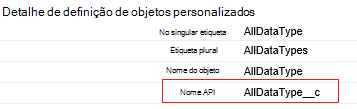

<properties
    pageTitle="Mover dados do Salesforce utilizando dados fábrica | Microsoft Azure"
    description="Saiba mais sobre como mover dados do Salesforce utilizando a fábrica de dados do Azure."
    services="data-factory"
    documentationCenter=""
    authors="linda33wj"
    manager="jhubbard"
    editor="monicar"/>

<tags
    ms.service="data-factory"
    ms.workload="data-services"
    ms.tgt_pltfrm="na"
    ms.devlang="na"
    ms.topic="article"
    ms.date="10/25/2016"
    ms.author="jingwang"/>

# Mover dados do Salesforce utilizando a fábrica de dados do Azure
Este artigo descreve como pode utilizar cópia atividade numa fábrica Azure dados para copiar dados a partir do Salesforce para qualquer arquivo de dados que se encontra listado sob a coluna Sink na tabela [suportadas origens e sumidouros](data-factory-data-movement-activities.md#supported-data-stores) . Este artigo constrói no artigo do [atividades de movimento de dados](data-factory-data-movement-activities.md) , que apresenta uma descrição geral de movimento de dados com cópia atividade e combinações de arquivo de dados suportadas.

Azure dados fábrica atualmente suporta apenas mover os dados da equipa de vendas para [stores]((data-factory-data-movement-activities.md#supported-data-stores) de dados suportados sink, mas não armazena não suporta mover dados a partir de outros dados para a equipa de vendas.

## Pré-requisitos
- Tem de utilizar uma das seguintes edições do Salesforce: Developer Edition, Professional Edition, Enterprise Edition ou ilimitada Edition.
- Permissões de API tem de estar ativada. Consulte o artigo [como ativar o acesso à API na Salesforce por conjunto de permissões?](https://www.data2crm.com/migration/faqs/enable-api-access-salesforce-permission-set/)
- Para copiar dados a partir do Salesforce arquivos de dados no local, tem de ter, pelo menos, dados Management Gateway 2.0 instalado no seu ambiente no local.

## Limites de pedido de Salesforce
Salesforce tem limites para total de pedidos de API e pedidos de API em simultâneo. Consulte a secção "API pedir limites" no artigo [Limites de programador do Salesforce](http://resources.docs.salesforce.com/200/20/en-us/sfdc/pdf/salesforce_app_limits_cheatsheet.pdf) para obter detalhes. Tenha em atenção se o número de pedidos em simultâneo excede o limite, limitação ocorre e irá ver as falhas aleatórias; Se o número total de pedidos de excede o limite, a conta do Salesforce será bloqueada 24 horas; Também poderá receber o erro "REQUEST_LIMIT_EXCEEDED" em ambos os cenários.

## Copiar o Assistente de dados
A forma mais fácil para criar uma tubagem que copia os dados a partir do Salesforce para qualquer uma dos arquivos de dados suportados sink é utilizar o Assistente de dados de cópia. Consulte o artigo [Tutorial: criar uma tubagem através do Assistente de cópia](data-factory-copy-data-wizard-tutorial.md) para obter instruções sobre rápido sobre como criar uma tubagem utilizando o Assistente de dados de cópia.

O exemplo seguinte fornece definições de JSON de exemplo que pode utilizar para criar uma tubagem utilizando o [Azure portal](data-factory-copy-activity-tutorial-using-azure-portal.md), [Visual Studio](data-factory-copy-activity-tutorial-using-visual-studio.md)ou [Azure PowerShell](data-factory-copy-activity-tutorial-using-powershell.md). Como copiar dados a partir do Salesforce ao armazenamento de Blobs do Azure que sejam. No entanto, os dados podem ser copiados para qualquer um da sumidouros indicado [aqui](data-factory-data-movement-activities.md#supported-data-stores) utilizando a atividade de cópia no Azure fábrica de dados.   

## Exemplo: Copiar dados a partir do Salesforce para um BLOBs do Azure
Este exemplo copia dados da equipa de vendas para um BLOBs do Azure cada hora. As propriedades JSON que são utilizadas nestes exemplos são descritas nas secções após os exemplos. Pode copiar os dados diretamente para qualquer uma das PIAs que sejam encontram listadas no artigo [atividades de movimento de dados](data-factory-data-movement-activities.md#supported-data-stores) utilizando a atividade de cópia no Azure fábrica de dados.

Seguem-se erros fábrica de dados que terá de criar para implementar o cenário. As secções que se seguem a lista fornecem detalhes sobre estes passos.

- Um serviço do tipo de [Salesforce](#salesforce-linked-service-properties) ligado
- Um serviço do tipo de [AzureStorage](data-factory-azure-blob-connector.md#azure-storage-linked-service-properties) ligado
- Um [conjunto de dados](data-factory-create-datasets.md) de entrada do tipo de [RelationalTable](#salesforce-dataset-properties)
- Um resultado de [conjunto de dados](data-factory-create-datasets.md) do tipo de [AzureBlob](data-factory-azure-blob-connector.md#azure-blob-dataset-type-properties)
- Uma [tubagem](data-factory-create-pipelines.md) com cópia atividade que utiliza [RelationalSource](#relationalsource-type-properties) e [BlobSink](data-factory-azure-blob-connector.md#azure-blob-copy-activity-type-properties)

**Serviço de Salesforce ligada**

Este exemplo utiliza o serviço de **Salesforce** ligadas. Consulte a secção [Salesforce ligadas serviço](#salesforce-linked-service-properties) para as propriedades que são suportadas por este serviço ligado.  Consulte o artigo [obter token de segurança](https://help.salesforce.com/apex/HTViewHelpDoc?id=user_security_token.htm) para obter instruções sobre como repor/obter o token de segurança.

    {
        "name": "SalesforceLinkedService",
        "properties":
        {
            "type": "Salesforce",
            "typeProperties":
            {
                "username": "<user name>",
                "password": "<password>",
                "securityToken": "<security token>"
            }
        }
    }

**Serviço de armazenamento ligado do Azure**

    {
      "name": "AzureStorageLinkedService",
      "properties": {
        "type": "AzureStorage",
        "typeProperties": {
          "connectionString": "DefaultEndpointsProtocol=https;AccountName=<accountname>;AccountKey=<accountkey>"
        }
      }
    }

**Conjunto de dados de entrada Salesforce**

    {
        "name": "SalesforceInput",
        "properties": {
            "linkedServiceName": "SalesforceLinkedService",
            "type": "RelationalTable",
            "typeProperties": {
                "tableName": "AllDataType__c"  
            },
            "availability": {
                "frequency": "Hour",
                "interval": 1
            },
            "external": true,
            "policy": {
                "externalData": {
                    "retryInterval": "00:01:00",
                    "retryTimeout": "00:10:00",
                    "maximumRetry": 3
                }
            }
        }
    }

A definição **externos** para **true** informa o serviço de dados fábrica do mesmo que o conjunto de dados externa a fábrica de dados e não é produzido por uma actividade na fábrica de dados.

> [AZURE.IMPORTANT] A parte "__c" do nome do API é necessário para qualquer objeto personalizado.

**Conjunto de dados de saída de Blobs do Azure**

Dados escritos para um novo blob cada hora (frequência: hora, o intervalo: 1).

    {
        "name": "AzureBlobOutput",
        "properties":
        {
            "type": "AzureBlob",
            "linkedServiceName": "AzureStorageLinkedService",
            "typeProperties":
            {
                "folderPath": "adfgetstarted/alltypes_c"
            },
            "availability":
            {
                "frequency": "Hour",
                "interval": 1
            }
        }
    }

**Em curso com cópia de atividade**

A tubagem contém atividade de cópia, que é configurado para utilizar a acima de entrada e saída de conjuntos de dados, e está agendada para executar a cada hora. No pipeline de definição de JSON, o tipo de **origem** está definido para **RelationalSource**e o tipo de **sink** está definido para **BlobSink**.

Ver [Propriedades de tipo de RelationalSource](#relationalsource-type-properties) para a lista de propriedades que são suportadas pela RelationalSource.

    {  
        "name":"SamplePipeline",
        "properties":{  
            "start":"2016-06-01T18:00:00",
            "end":"2016-06-01T19:00:00",
            "description":"pipeline with copy activity",
            "activities":[  
            {
                "name": "SalesforceToAzureBlob",
                "description": "Copy from Salesforce to an Azure blob",
                "type": "Copy",
                "inputs": [
                {
                    "name": "SalesforceInput"
                }
                ],
                "outputs": [
                {
                    "name": "AzureBlobOutput"
                }
                ],
                "typeProperties": {
                    "source": {
                        "type": "RelationalSource",
                        "query": "SELECT Id, Col_AutoNumber__c, Col_Checkbox__c, Col_Currency__c, Col_Date__c, Col_DateTime__c, Col_Email__c, Col_Number__c, Col_Percent__c, Col_Phone__c, Col_Picklist__c, Col_Picklist_MultiSelect__c, Col_Text__c, Col_Text_Area__c, Col_Text_AreaLong__c, Col_Text_AreaRich__c, Col_URL__c, Col_Text_Encrypt__c, Col_Lookup__c FROM AllDataType__c"             
                    },
                    "sink": {
                        "type": "BlobSink"
                    }
                },
                "scheduler": {
                    "frequency": "Hour",
                    "interval": 1
                },
                "policy": {
                    "concurrency": 1,
                    "executionPriorityOrder": "OldestFirst",
                    "retry": 0,
                    "timeout": "01:00:00"
                }
            }
            ]
        }
    }

> [AZURE.IMPORTANT] A parte "__c" do nome do API é necessário para qualquer objeto personalizado.

## Propriedades do serviço de Salesforce ligada

A tabela seguinte fornece descrições para elementos JSON que são específicos para o serviço de Salesforce ligada.

| Propriedade | Descrição | Obrigatório |
| -------- | ----------- | -------- |
| tipo | A propriedade de tipo tem de estar definida: **equipa de vendas**. | Sim |
| nome de utilizador |Especifique um nome de utilizador da conta de utilizador. | Sim |
| palavra-passe | Especifique uma palavra-passe da conta de utilizador.  | Sim |
| securityToken | Especifique um token de segurança da conta de utilizador. Consulte o artigo [obter token de segurança](https://help.salesforce.com/apex/HTViewHelpDoc?id=user_security_token.htm) para obter instruções sobre como repor/obter um token de segurança. Para saber mais sobre tokens de segurança em geral, consulte o artigo [segurança e a API](https://developer.salesforce.com/docs/atlas.en-us.api.meta/api/sforce_api_concepts_security.htm).  | Sim |

## Propriedades do conjunto de dados de equipa de vendas

Para obter uma lista completa das secções e propriedades que estão disponíveis para a definição de conjuntos de dados, consulte o artigo [criar conjuntos de dados](data-factory-create-datasets.md) . As secções como estrutura, disponibilidade e a política de um conjunto de dados JSON são semelhantes para todos os tipos de conjunto de dados (Azure SQL, BLOBs do Azure, tabela do Azure e assim sucessivamente).

A secção **typeProperties** é diferente para cada tipo de conjunto de dados e fornece informações sobre a localização dos dados no arquivo de dados. A secção de typeProperties para um conjunto de dados do tipo de **RelationalTable** tem as seguintes propriedades:

| Propriedade | Descrição | Obrigatório |
| -------- | ----------- | -------- |
| Tabela | Nome da tabela do Salesforce. | N (se for especificada uma **consulta** de **RelationalSource** ) |

> [AZURE.IMPORTANT]  A parte "__c" do nome do API é necessário para qualquer objeto personalizado.

## Propriedades do tipo de RelationalSource

Para obter uma lista completa das secções e propriedades que estão disponíveis para a definição de atividades, consulte o artigo [Criar tubagens](data-factory-create-pipelines.md) . Propriedades de como o nome, descrição, entrada e saída tabelas e várias políticas estão disponíveis para todos os tipos de atividades.

As propriedades que estão disponíveis na secção de typeProperties da atividade, outro lado, variam com cada tipo de atividade. Para copiar atividade, estes variam consoante os tipos de origens e sumidouros.

Numa atividade de cópia, quando a origem for do tipo de **RelationalSource** (que inclui a equipa de vendas), as seguintes propriedades estão disponíveis na secção typeProperties:

| Propriedade | Descrição | Valores permitidos | Obrigatório |
| -------- | ----------- | -------------- | -------- |
| consulta | Utilize a consulta personalizada para ler dados. | Uma consulta SQL-92 ou a consulta de [Idioma de consulta de objeto do Salesforce (SOQL)](https://developer.salesforce.com/docs/atlas.en-us.soql_sosl.meta/soql_sosl/sforce_api_calls_soql.htm) . Por exemplo: `select * from MyTable__c`. | N (se a **tabela** do **conjunto de dados** for especificada) |

> [AZURE.IMPORTANT] A parte "__c" do nome do API é necessário para qualquer objeto personalizado.

## Sugestões de consulta

### Obter dados utilizando onde cláusula na coluna Data/hora
Quando especificar a consulta SOQL ou SQL, atenção de pagamento para a diferença de formato de data/hora. Por exemplo:

- **Exemplo SOQL**: $$Text.Format (' SELECIONE Id, nome, BillingCity da conta onde Datadaúltimamodificação > = {0:yyyy-MM-ddTHH:mm:ssZ} e Datadaúltimamodificação < {1:yyyy-MM-ddTHH:mm:ssZ}', WindowStart, WindowEnd)
- **Exemplo SQL**: $$Text.Format ('SELECT * a partir de conta onde Datadaúltimamodificação > = {{ts\'{0:yyyy-MM-dd ss}\'}} e Datadaúltimamodificação < {{ts\'{1:yyyy-MM-dd ss}\'}}', WindowStart, WindowEnd)'.

### Obter dados de relatório do Salesforce
Pode obter dados a partir de relatórios do Salesforce ao especificar consulta como `{call "<report name>"}`, por exemplo, `"query": "{call \"TestReport\"}"`.

### Obter eliminados registos da Reciclagem Salesforce
Para consultar os contornos registos eliminados da Reciclagem Salesforce, pode especificar **"IsDeleted = 1"** na sua consulta. Por exemplo, 

- Para consultar apenas os registos eliminados, especifique "selecione *MyTable__c * *onde IsDeleted = 1**"
- Para consultar a todos os registos, incluindo os existentes e eliminado, especifique "selecione *MyTable__c * *onde IsDeleted = 0 ou IsDeleted = 1**"

[AZURE.INCLUDE [data-factory-structure-for-rectangualr-datasets](../../includes/data-factory-structure-for-rectangualr-datasets.md)]

### Mapeamento de tipo para a equipa de vendas
Tipo de Salesforce | . Tipo de líquido
--------------- | ---------------
Numeração automática | Cadeia
Caixa de verificação | Booleano
Moeda | Dupla
Data | Data/hora
Data/hora | Data/hora
Mensagem de correio electrónico | Cadeia
ID | Cadeia
Relação de pesquisa | Cadeia
Lista de opções de selecção múltipla | Cadeia
Número | Dupla
Percentagem | Dupla
Telefone | Cadeia
Lista de opções | Cadeia
Texto | Cadeia
Área de texto | Cadeia
Área de texto (longo) | Cadeia
Área de texto (RTF) | Cadeia
Texto (encriptado) | Cadeia
URL | Cadeia

[AZURE.INCLUDE [data-factory-column-mapping](../../includes/data-factory-column-mapping.md)]
[AZURE.INCLUDE [data-factory-structure-for-rectangualr-datasets](../../includes/data-factory-structure-for-rectangualr-datasets.md)]

## Desempenho e Otimização do  
Consulte o [Guia de sintonização e desempenho de atividade de cópia](data-factory-copy-activity-performance.md) para saber mais sobre os fatores chaves a que o desempenho impacto de movimento de dados (copiar actividade) no Azure fábrica de dados e várias formas para otimizar o-lo.
