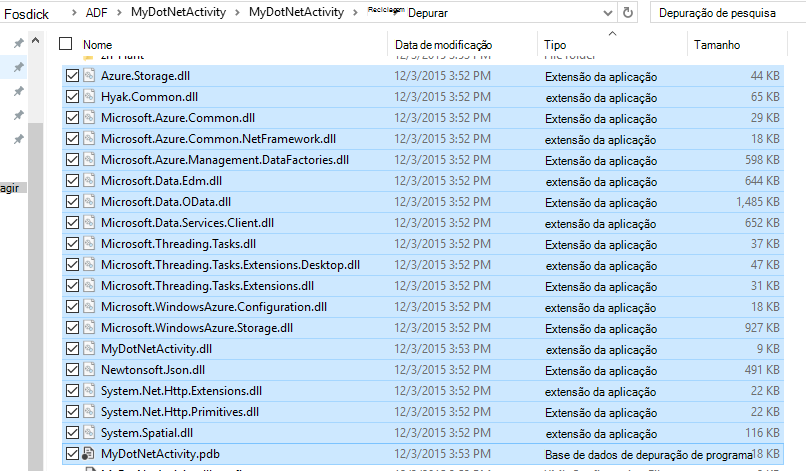
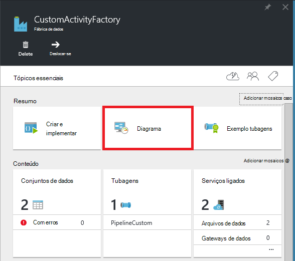
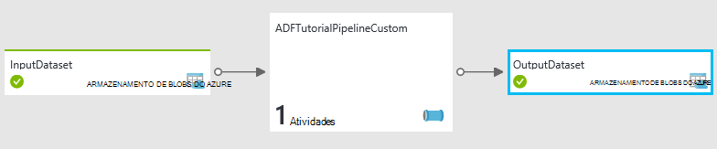
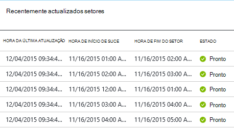
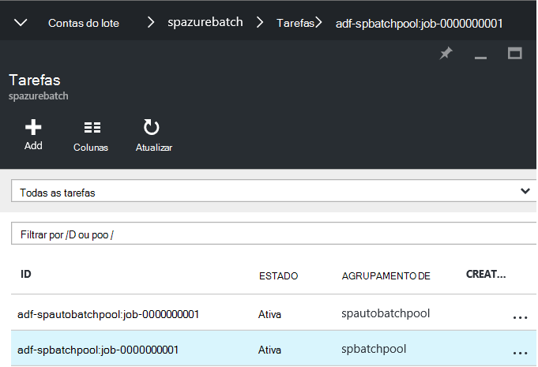
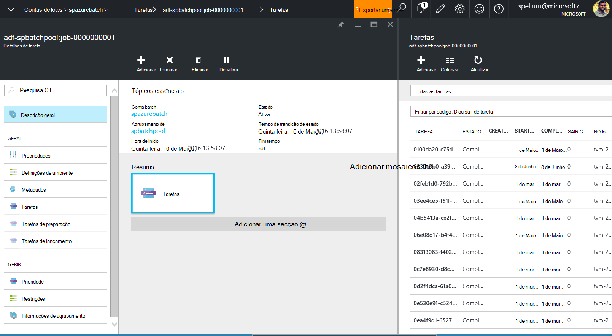
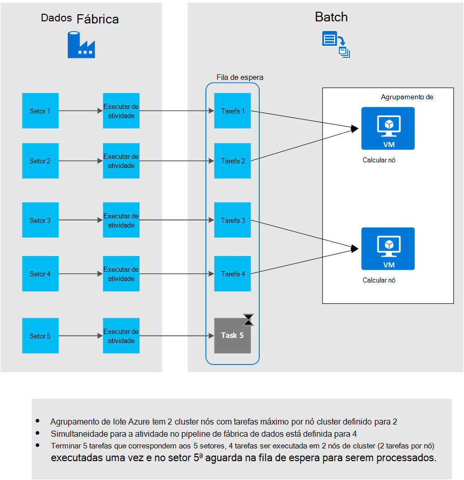

<properties
    pageTitle="Utilizar atividades personalizadas no pipeline fábrica de dados do Azure"
    description="Saiba como criar atividades personalizadas e utilizá-los no pipeline fábrica de dados do Azure."
    services="data-factory"
    documentationCenter=""
    authors="spelluru"
    manager="jhubbard"
    editor="monicar"/>

<tags
    ms.service="data-factory"
    ms.workload="data-services"
    ms.tgt_pltfrm="na"
    ms.devlang="na"
    ms.topic="article"
    ms.date="10/17/2016"
    ms.author="spelluru"/>

# Utilizar atividades personalizadas no pipeline fábrica de dados do Azure
> [AZURE.SELECTOR]
[Ramo](data-factory-hive-activity.md)  
[Porco](data-factory-pig-activity.md)  
[MapReduce](data-factory-map-reduce.md)  
[Transmissão de Hadoop](data-factory-hadoop-streaming-activity.md)
[Formação de máquina](data-factory-azure-ml-batch-execution-activity.md) 
[Procedimento armazenado](data-factory-stored-proc-activity.md)
[Dados Lake Analytics U-SQL](data-factory-usql-activity.md)
[.NET personalizado](data-factory-use-custom-activities.md)

Existem dois tipos de atividades que pode utilizar no pipeline fábrica de dados do Azure.
 
- [Dados atividades de movimento](data-factory-data-movement-activities.md) para mover dados entre [suportadas arquivos de dados](data-factory-data-movement-activities.md#supported-data-stores).
- [Atividades de transformação de dados](data-factory-data-transformation-activities.md) à utilização de dados de transformação/processo calcula como Azure HDInsight, lote Azure e Azure máquina aprendizagem. Por exemplo: ramo de HDInsight e máquina Learning lote execução.  

Se precisar de mover os dados para a um arquivo de dados que não seja suportado pela Azure fábrica de dados, pode criar uma atividade de .NET personalizada com o seu próprio lógica de movimento de dados e utilizar a atividade no pipeline de. 

Da mesma forma, se precisar de transformação/processo de dados de uma forma que não seja suportado pela fábrica de dados, pode criar uma atividade personalizada com o seu próprio lógica de processamento de dados e utilizar a atividade no pipeline de.

> [AZURE.NOTE] Atualmente, o Data Management Gateway suporta apenas a atividade de cópia e atividade do procedimento armazenado na fábrica de dados. Não é possível utilizar o gateway a partir de uma atividade personalizada para ter acesso a origens de dados no local.
 
Pode configurar a atividade de .NET personalizada para executar a utilizar um serviço de **Azure lote** ou um cluster de **Azure HDInsight** .   

O seguinte tutorial fornece instruções passo a passo para criar uma atividade de .NET personalizada e utilizar a atividade personalizada numa tubagem. Tutorial utiliza o serviço do **Azure lote** ligadas. Para utilizar o Azure HDInsight ligadas serviço em vez disso, pode criar um serviço do tipo **HDInsight** (se estiver a utilizar o seu próprio cluster HDInsight) ou **HDInsightOnDemand** ligado (se pretender que a fábrica de dados para criar uma HDInsight cluster a pedido) e utilizá-lo na secção de atividade do pipeline de JSON (**linkedServiceName**). Consulte a secção [utilizar Azure HDInsight ligadas serviços](#use-azure-hdinsight-linked-services) para obter detalhes sobre a utilização do Azure HDInsight para executar a atividade personalizada.

> [AZURE.IMPORTANT] Versão do conjunto 4.5.2 do .NET Framework como a arquitetura de destino para o seu projeto de atividade personalizada .NET no Visual Studio. Fábrica de dados não suporta atividades personalizadas compiladas contra versões .NET Framework posteriormente 4.5.2.   

## Instruções passo a passo 

### Pré-requisitos

- Visual Studio 2012/2013/2015
- Transferir e instalar o [Azure.NET SDK][azure-developer-center]

### Pré-requisitos de lote Azure
Executar suas atividades .NET personalizadas utilizando Azure lote como um recurso de cluster tutorial. Consulte o artigo [Noções básicas do Azure lote] [ batch-technical-overview] para uma descrição geral do lote de Azure service e consulte o artigo [Introdução ao Azure lote biblioteca para o .NET] [ batch-get-started] rapidamente começar com o serviço do Azure lote.

Tutorial, terá de criar uma conta Azure lote com um conjunto de VMs. Eis os passos:

1. Crie uma **conta do lote Azure** utilizando o [Azure portal](http://manage.windowsazure.com). Consulte o artigo [criar e gerir uma conta Azure lote] [ batch-create-account] artigo para obter instruções. Tenha em atenção premida a tecla conta Azure lote nome e a conta.

    Também pode utilizar o [Novo AzureBatchAccount] [ new-azure-batch-account] cmdlet para criar uma conta Azure lote. Consulte o artigo [Utilizar o PowerShell para gerir o Azure lote conta Azure] [ azure-batch-blog] para obter instruções detalhadas sobre como utilizar este cmdlet.
2. Crie um **conjunto de lote Azure**.
    1. No [portal do Azure](https://portal.azure.com), clique em **Procurar** no menu à esquerda e clique em **Lote contas**. 
    2. Selecione a sua conta do Azure lote para abrir o pá **Lote de conta** . 
    3. Clique em mosaico de **conjuntos de dados** .
    4. Na pá **conjuntos de dados** , clique em botão Adicionar na barra de ferramentas para adicionar um conjunto de dados.
        1. Introduza um ID para o conjunto de (**O ID de agrupamento**). Tenha em atenção o **ID do conjunto de**; é necessário ao criar uma solução de dados fábrica do mesmo. 
        2. Especifique o **Windows Server 2012 R2** para a definição do sistema operativo família.
        3. Selecione uma **camada comparar nó**. 
        3. Introduza **2** como valor para a definição **Dedicada de destino** .
        4. Introduza **2** como valor para a definição de **tarefas máximo por nó** .
    5. Clique em **OK** para criar o conjunto de dados. 
 
    Também pode utilizar o cmdlet [AzureBatchPool novo](https://msdn.microsoft.com/library/mt628690.aspx) para criar um agrupamento de lote Azure.    

### Passos de alto nível 
1.  **Criar uma atividade personalizada** para utilizar uma tubagem fábrica de dados. A atividade personalizada neste exemplo contém a lógica de transformação/processamento de dados. 
    1.  No Visual Studio, criar um projeto de biblioteca de classes .NET, adicione o código para processar dados de entrada e compilar o projeto. 
    2.  Código postal todos os ficheiros binários e o ficheiro (opcional) PDB a pasta de saída.  
    3.  Carregue o ficheiro zip ao armazenamento de Blobs do Azure. Os passos detalhados estão a criar a secção de atividade personalizada. 
2. **Criar uma fábrica Azure dados que utiliza a atividade personalizada**:
    1. Crie uma fábrica dados Azure.
    2. Crie serviços ligados.
        1. AzureStorageLinkedService: Fornece armazenamento as credenciais para aceder blobs.
        2. AzureBatchLinkedService: Especifica Azure lote como calcular.
    3. Crie conjuntos de dados.
        1. InputDataset: Especifica o contentor de armazenamento e a pasta para as entrada blobs.
        1. OuputDataset: Especifica o contentor de armazenamento e a pasta para as blobs de saída.
    2. Crie uma tubagem que utiliza a atividade personalizada.
    3. Execute e teste as em curso.
    4. Depurar as em curso.

## Criar a atividade personalizada
Para criar uma atividade personalizada .NET, crie um projeto de **Biblioteca de classes .NET** com uma classe que implementa nessa interface **IDotNetActivity** . Esta interface tem só um método: [Executar](https://msdn.microsoft.com/library/azure/mt603945.aspx) e a sua assinatura é:

    public IDictionary<string, string> Execute(
            IEnumerable<LinkedService> linkedServices, 
            IEnumerable<Dataset> datasets, 
            Activity activity, 
            IActivityLogger logger)
        

O método leva-o até quatro parâmetros:

- **linkedServices**. Esta propriedade é uma vasto lista dos serviços ligados ligadas a origens de dados de entrada/saída (por exemplo: armazenamento de Blobs do Azure) para a fábrica de dados. Neste exemplo, existe apenas um serviço ligado de tipo de armazenamento do Windows Azure utilizado para entrada e saída. 
- **conjuntos de dados**. Esta propriedade é uma lista vasto de conjuntos de dados. Pode utilizar este parâmetro para obter as localizações e os esquemas definidos pela conjuntos de dados de entrada e saídos.
- **atividade**. Esta propriedade representa a atual cluster entidade - neste caso, um lote de Azure.
- **registo**. Este objeto permite-lhe escrever comentários de depuração de superfície como o registo de "Utilizador" para as em curso. 

O método devolve um dicionário que pode ser utilizado para corrente de bicicleta atividades personalizadas em conjunto no futuro. Esta funcionalidade ainda não está implementada, por isso, devolver um dicionário vazio a partir do método.  

### Procedimento 
1.  Crie um projeto de **Biblioteca de classes .NET** .
    <ol type="a">
        <li>Inicie o <b>Visual Studio 2015</b> ou <b>Visual Studio 2013</b> ou <b>Visual Studio 2012</b>.</li>
        <li>Clique em <b>ficheiro</b>, aponte para <b>Novo</b>e clique em <b>projeto</b>.</li>
        <li>Expanda <b>modelos</b>e selecione <b>Visual c#</b>. Neste tutorial, utiliza c#, mas pode utilizar qualquer idioma .NET para desenvolver a atividade personalizada.</li>
        <li>Selecione <b>A biblioteca de classes</b> a partir da lista de tipos de projecto no lado direito.</li>
        <li>Introduza <b>MyDotNetActivity</b> para o <b>nome</b>.</li>
        <li>Selecione <b>C:\ADFGetStarted</b> para a <b>localização</b>.</li>
        <li>Clique em <b>OK</b> para criar o projeto.</li>
    </ol>
2.  Clique em **Ferramentas**, aponte para **O Gestor de pacotes NuGet**e clique em **Consola do Gestor de pacote**.
3.  Na consola do Gestor de pacotes, execute o seguinte comando para importar **Microsoft.Azure.Management.DataFactories**.

        Install-Package Microsoft.Azure.Management.DataFactories

4. Importe o pacote de NuGet de **Armazenamento do Windows Azure** ao projeto.

        Install-Package Azure.Storage

5. Adicione as seguintes instruções de **utilizar** o ficheiro de origem no projeto.

        using System.IO;
        using System.Globalization;
        using System.Diagnostics;
        using System.Linq;

        using Microsoft.Azure.Management.DataFactories.Models;
        using Microsoft.Azure.Management.DataFactories.Runtime;

        using Microsoft.WindowsAzure.Storage;
        using Microsoft.WindowsAzure.Storage.Blob;

6. Altere o nome do **espaço de nomes** de para **MyDotNetActivityNS**.

        namespace MyDotNetActivityNS

7. Altere o nome da categoria para **MyDotNetActivity** e deriva-lo a interface de **IDotNetActivity** conforme mostrado no seguinte fragmento de código:

        public class MyDotNetActivity : IDotNetActivity

8. Implementar método (adicionar) a **execução** da interface do **IDotNetActivity** para a classe de **MyDotNetActivity** e copie o código seguinte de exemplo para o método.

    O exemplo seguinte conta o número de ocorrências do termo de pesquisa ("Microsoft") em cada blob associado a um setor de dados. 

        /// 

        /// Execute method is the only method of IDotNetActivity interface you must implement. 
        /// In this sample, the method invokes the Calculate method to perform the core logic.  
        /// 

        public IDictionary<string, string> Execute(
            IEnumerable<LinkedService> linkedServices,
            IEnumerable<Dataset> datasets,
            Activity activity,
            IActivityLogger logger)
        {
            // to get extended properties (for example: SliceStart)
            DotNetActivity dotNetActivity = (DotNetActivity)activity.TypeProperties;
            string sliceStartString = dotNetActivity.ExtendedProperties["SliceStart"];

            // to log all extended properties           
            IDictionary<string, string> extendedProperties = dotNetActivity.ExtendedProperties;
            logger.Write("Logging extended properties if any...");
            foreach (KeyValuePair<string, string> entry in extendedProperties)
            {
                logger.Write("<key:{0}> <value:{1}>", entry.Key, entry.Value);
            }
        
            // declare types for input and output data stores
            AzureStorageLinkedService inputLinkedService;

            // declare dataset types
            CustomDataset inputLocation;
            AzureBlobDataset outputLocation;

            Dataset inputDataset = datasets.Single(dataset => dataset.Name == activity.Inputs.Single().Name);
            inputLocation = inputDataset.Properties.TypeProperties as CustomDataset;

            foreach (LinkedService ls in linkedServices)
                logger.Write("linkedService.Name {0}", ls.Name);

            // using First method instead of Single since we are using the same 
            // Azure Storage linked service for input and output. 
            inputLinkedService = linkedServices.First(
                linkedService =>
                linkedService.Name ==
                inputDataset.Properties.LinkedServiceName).Properties.TypeProperties
                as AzureStorageLinkedService;

            string connectionString = inputLinkedService.ConnectionString; 

            // To create an input storage client.
            string folderPath = GetFolderPath(inputDataset);
            string output = string.Empty; // for use later.

            // create storage client for input. Pass the connection string.
            CloudStorageAccount inputStorageAccount = CloudStorageAccount.Parse(connectionString);
            CloudBlobClient inputClient = inputStorageAccount.CreateCloudBlobClient();

            // initialize the continuation token before using it in the do-while loop.
            BlobContinuationToken continuationToken = null;
            do
            {   // get the list of input blobs from the input storage client object.
                BlobResultSegment blobList = inputClient.ListBlobsSegmented(folderPath,
                                         true,
                                         BlobListingDetails.Metadata,
                                         null,
                                         continuationToken,
                                         null,
                                         null);
                
                // Calculate method returns the number of occurrences of 
                // the search term (“Microsoft”) in each blob associated
                // with the data slice. definition of the method is shown in the next step.
 
                output = Calculate(blobList, logger, folderPath, ref continuationToken, "Microsoft");

            } while (continuationToken != null);

            // get the output dataset using the name of the dataset matched to a name in the Activity output collection.
            Dataset outputDataset = datasets.Single(dataset => dataset.Name == activity.Outputs.Single().Name);
            // convert to blob location object.
            outputLocation = outputDataset.Properties.TypeProperties as AzureBlobDataset;

            folderPath = GetFolderPath(outputDataset);

            logger.Write("Writing blob to the folder: {0}", folderPath);

            // create a storage object for the output blob.
            CloudStorageAccount outputStorageAccount = CloudStorageAccount.Parse(connectionString);
            // write the name of the file. 
            Uri outputBlobUri = new Uri(outputStorageAccount.BlobEndpoint, folderPath + "/" + GetFileName(outputDataset));

            logger.Write("output blob URI: {0}", outputBlobUri.ToString());
            // create a blob and upload the output text.
            CloudBlockBlob outputBlob = new CloudBlockBlob(outputBlobUri, outputStorageAccount.Credentials);
            logger.Write("Writing {0} to the output blob", output);
            outputBlob.UploadText(output);

            // The dictionary can be used to chain custom activities together in the future.
            // This feature is not implemented yet, so just return an empty dictionary.  

            return new Dictionary<string, string>();
        }

9. Adicione os seguintes métodos de ajuda. O método **Execute** invoca estes métodos de ajuda. O método **GetConnectionString** obtém a cadeia de ligação de armazenamento do Windows Azure e o método **GetFolderPath** obtém a localização de Blobs. Mais nenhumas, o método de **Calcular** isola o código que se repete através de cada blob.

        /// 

        /// Gets the folderPath value from the input/output dataset.
        /// 

        private static string GetFolderPath(Dataset dataArtifact)
        {
            if (dataArtifact == null || dataArtifact.Properties == null)
            {
                return null;
            }

            AzureBlobDataset blobDataset = dataArtifact.Properties.TypeProperties as AzureBlobDataset;
            if (blobDataset == null)
            {
                return null;
            }

            return blobDataset.FolderPath;
        }

        /// 

        /// Gets the fileName value from the input/output dataset.   
        /// 

        private static string GetFileName(Dataset dataArtifact)
        {
            if (dataArtifact == null || dataArtifact.Properties == null)
            {
                return null;
            }

            AzureBlobDataset blobDataset = dataArtifact.Properties.TypeProperties as AzureBlobDataset;
            if (blobDataset == null)
            {
                return null;
            }

            return blobDataset.FileName;
        }

        /// 

        /// Iterates through each blob (file) in the folder, counts the number of instances of search term in the file, 
        /// and prepares the output text that is written to the output blob. 
        /// 

        public static string Calculate(BlobResultSegment Bresult, IActivityLogger logger, string folderPath, ref BlobContinuationToken token, string searchTerm)
        {
            string output = string.Empty;
            logger.Write("number of blobs found: {0}", Bresult.Results.Count<IListBlobItem>());
            foreach (IListBlobItem listBlobItem in Bresult.Results)
            {
                CloudBlockBlob inputBlob = listBlobItem as CloudBlockBlob;
                if ((inputBlob != null) && (inputBlob.Name.IndexOf("$$$.$$$") == -1))
                {
                    string blobText = inputBlob.DownloadText(Encoding.ASCII, null, null, null);
                    logger.Write("input blob text: {0}", blobText);
                    string[] source = blobText.Split(new char[] { '.', '?', '!', ' ', ';', ':', ',' }, StringSplitOptions.RemoveEmptyEntries);
                    var matchQuery = from word in source
                                     where word.ToLowerInvariant() == searchTerm.ToLowerInvariant()
                                     select word;
                    int wordCount = matchQuery.Count();
                    output += string.Format("{0} occurrences(s) of the search term \"{1}\" were found in the file {2}.\r\n", wordCount, searchTerm, inputBlob.Name);
                }
            }
            return output;
        }

    O método GetFolderPath devolve o caminho para a pasta que aponta o conjunto de dados para e o método GetFileName devolve o nome do que o conjunto de dados aponta para o ficheiro/blob. Se havefolderPath define a utilização de variáveis, como {ano}, {mês,} devolve {dia}, etc., o método a cadeia tal como é sem substitui-los com valores de tempo de execução. Consulte a secção [acesso propriedades expandidas](#access-extended-properties) para obter detalhes sobre como aceder ao SliceStart, SliceEnd, etc.    
    
            "name": "InputDataset",
            "properties": {
                "type": "AzureBlob",
                "linkedServiceName": "AzureStorageLinkedService",
                "typeProperties": {
                    "fileName": "file.txt",
                    "folderPath": "adftutorial/inputfolder/",
    
    O método de calcular calcula o número de instâncias da palavra-chave Microsoft nos ficheiros de entrada (blobs na pasta). O termo de pesquisa ("Microsoft") é codificado no código.

10. Compile o projeto. Clique em **Criar** a partir do menu e clique em **Criar solução**.

    > [AZURE.IMPORTANT] Versão do conjunto 4.5.2 do .NET Framework como a arquitetura de destino para o seu projeto: com o botão direito do projeto e, em **Propriedades** para definir a arquitetura de destino. Fábrica de dados não suporta atividades personalizadas compiladas contra versões .NET Framework posteriormente 4.5.2. 
11. Iniciar o **Explorador do Windows**e navegue para a pasta **bin\debug** ou **bin\release** dependendo do tipo de compilação.
12. Criar um ficheiro zip **MyDotNetActivity.zip** que contém todos os binários na <project folder>\bin\Debug pasta. Pretende incluir o ficheiro de **MyDotNetActivity.pdb** para que obtenha detalhes adicionais, como o número de linha no código fonte que causaram o problema se Ocorreu uma falha. Todos os ficheiros no ficheiro de postal para a atividade personalizado tem de estar no **nível superior** com pastas não sub.

    
13. Carregar **MyDotNetActivity.zip** como um blob ao contentor de BLOBs: **customactivitycontainer** no armazenamento de Blobs do Azure que o **AzureStorageLinkedService** ligado serviço na **ADFTutorialDataFactory** utiliza.  Crie o contentor de BLOBs **customactivitycontainer** se ainda não existir.

> [AZURE.NOTE] Se adicionar este projeto de atividade .NET a uma solução no Visual Studio que contém um projecto fábrica de dados e adicione uma referência a projecto do .NET atividade do projeto de aplicação fábrica de dados, não terá realizar os dois últimos passos de criar o ficheiro zip e carregá-lo para o armazenamento de Blobs do Azure manualmente. Quando publicar entidades fábrica de dados utilizando o Visual Studio, estes passos são automaticamente efetuados pelo processo de publicação. Consulte os artigos de [construir a sua primeira pipeline utilizando o Visual Studio](data-factory-build-your-first-pipeline-using-vs.md) e [copiar dados a partir de Blobs do Azure para Azure SQL](data-factory-copy-activity-tutorial-using-visual-studio.md) para saber mais sobre criar e publicar entidades fábrica de dados utilizando o Visual Studio.  

### Executar método

Esta secção fornece mais detalhes e as notas sobre o código do método **Execute** .
 
1. Os membros de iteração através da colecção de entrada forem encontrados no espaço de nomes [Microsoft.WindowsAzure.Storage.Blob](https://msdn.microsoft.com/library/azure/microsoft.windowsazure.storage.blob.aspx) . Iteração através da colecção de BLOBs requer utilizando a classe de **BlobContinuationToken** . Na sua essência, tem de utilizar uma efectue-enquanto ciclo com o token de dispositivo de sair do ciclo. Para mais informações, consulte o artigo [como utilizar o armazenamento de Blobs do .NET](../storage/storage-dotnet-how-to-use-blobs.md). Um ciclo básico é mostrado aqui:

        // Initialize the continuation token.
        BlobContinuationToken continuationToken = null;
        do
        {   
            // Get the list of input blobs from the input storage client object.
            BlobResultSegment blobList = inputClient.ListBlobsSegmented(folderPath,
                                      true,
                                      BlobListingDetails.Metadata,
                                      null,
                                      continuationToken,
                                      null,
                                      null);
            // Return a string derived from parsing each blob.
            output = Calculate(blobList, logger, folderPath, ref continuationToken, "Microsoft");
        } while (continuationToken != null);

    Consulte a documentação para o método de [ListBlobsSegmented](https://msdn.microsoft.com/library/jj717596.aspx) para obter detalhes.

2.  O código para trabalhar através do conjunto de blobs logicamente vai dentro de fazer-enquanto a ligação. Método de **Executar** , fazer-enquanto ciclo transmite a lista de blobs para um método denominado **Calcular**. O método devolve uma variável de cadeia denominada **saída** que é o resultado da tendo sujeita a iteração através de todos os blobs no segmento. 

    Devolve o número de ocorrências do termo de pesquisa (**Microsoft**) blob passado para o método de **Calcular** . 

            output += string.Format("{0} occurrences of the search term \"{1}\" were found in the file {2}.\r\n", wordCount, searchTerm, inputBlob.Name);

3.  Assim que o método de **Calcular** tem de concluir o trabalho, tem de ser escrita para um novo blob. Por isso, para cada conjunto de blobs processadas, um novo blob pode ser escrito com os resultados. Para escrever um novo blob, encontre primeiro o conjunto de dados de saída. 

            // Get the output dataset using the name of the dataset matched to a name in the Activity output collection.
            Dataset outputDataset = datasets.Single(dataset => dataset.Name == activity.Outputs.Single().Name);

            // Convert to blob location object.
            outputLocation = outputDataset.Properties.TypeProperties as AzureBlobDataset;

4.  O código de chamadas também um método de ajuda: **GetFolderPath** para obter o caminho da pasta (o nome do contentor de armazenamento).
 
            folderPath = GetFolderPath(outputDataset);

    O **GetFolderPath** converte o objeto de conjunto de dados para um AzureBlobDataSet, que tem uma propriedade denominada caminhopasta.
            
            AzureBlobDataset blobDataset = dataArtifact.Properties.TypeProperties as AzureBlobDataset;
            
            return blobDataset.FolderPath;

5.  O código chama o método de **GetFileName** para obter o nome de ficheiro (blob nome).  

            AzureBlobDataset blobDataset = dataArtifact.Properties.TypeProperties as AzureBlobDataset;

            return blobDataset.FileName;

6.  O nome do ficheiro é escrito através da criação de um objeto URI. O construtor URI utiliza a propriedade **BlobEndpoint** para devolver o nome do contentor. O nome de ficheiro e caminho da pasta são adicionados à construir o blob de saída URI.  

            // Write the name of the file. 
            Uri outputBlobUri = new Uri(outputStorageAccount.BlobEndpoint, folderPath + "/" + GetFileName(outputDataset));

7.  O nome do ficheiro ter sido escrito e agora pode escrever a cadeia de saída do método Calculate para um novo blob:

            // Create a blob and upload the output text.
            CloudBlockBlob outputBlob = new CloudBlockBlob(outputBlobUri, outputStorageAccount.Credentials);
            logger.Write("Writing {0} to the output blob", output);
            outputBlob.UploadText(output);

## Criar a fábrica de dados através do portal Azure

Na secção **criar a atividade personalizada** , criou uma atividade personalizada e carregado o ficheiro zip com binários e o ficheiro PDB para um contentor de Blobs do Azure. Nesta secção, cria um Azure **fábrica de dados** com uma **pipeline** que utiliza a **atividade personalizada**.
 
O conjunto de dados de entrada para a atividade personalizada representa os blobs (ficheiros) na pasta entrada (adftutorial\inputfolder) de armazenamento de Blobs. O conjunto de dados de saída da atividade de representa os blobs saída na pasta de saída (adftutorial\outputfolder) de armazenamento de Blobs. 

Criar um ficheiro com o nome de **ficheiro. txt** com o seguinte conteúdo e carregue-o para **adftutorial\inputfolder** (adftutorial é o nome do contentor de Blobs do Azure e inputfolder é o nome da pasta no contentor.)

    test custom activity Microsoft test custom activity Microsoft

A pasta de entrada corresponde a um setor no Azure dados fábrica mesmo se a pasta tem dois ou mais ficheiros. Quando é processada cada setor pelas em curso, a atividade personalizada itera todos os blobs na pasta de entrada para esse setor. 

O utilizador vê um ficheiro na pasta adftutorial\output de saída com um ou mais linhas (igual ao número de blobs na pasta entrada):
 
    2 occurrences(s) of the search term "Microsoft" were found in the file inputfolder/2015-11-16-00/file.txt.

Eis os passos a que executar nesta secção:

1. Crie uma **fábrica de dados**.
2. **Serviços ligados** para o conjunto de Azure lote de VMs no qual a atividade personalizada é executado e o armazenamento de Azure que detém os blobs entrada/saída. 
2. Entrada e saída **conjuntos de dados** que representam entrada e saída da atividade personalizada. 
3. **Em curso** que utiliza a atividade personalizada.
4. **Fábrica de dados**. Criar uma ao publicar estes entidades Azure. 

> [AZURE.NOTE] Criar o **ficheiro. txt** e carregue-o para um contentor blob se ainda não o tiver feito. Consulte as instruções acima.  

### Passo 1: Criar a fábrica de dados

1.  Depois de início de sessão no portal do Azure, execute os seguintes passos:
    1.  No menu à esquerda, clique em **Novo** .
    2.  Clique em **dados + Analytics** pá o **Novo** .
    3.  Clique em **Dados fábrica** pá a **análise de dados** .
2.  Na pá **Novo fábrica de dados** , introduza **CustomActivityFactory** para o nome. O nome da fábrica dados Azure tem de ser exclusivo global. Se receber o erro: o **nome da fábrica de dados "CustomActivityFactory" não está disponível**, altere o nome da fábrica dados (por exemplo, **yournameCustomActivityFactory**) e tente criar novamente.
3.  Clique no **Nome do grupo de recursos**e selecione um grupo de recursos existente ou crie um grupo de recursos. 
4.  Certifique-se de que está a utilizar a correta **subscrição** e **região** onde pretende que a fábrica de dados seja criada. 
5.  Clique em **Criar** no pá a **fábrica de dados nova** .
6.  Consulte a fábrica de dados a ser criada no **Dashboard** do Azure portal.
7.  Depois da fábrica de dados foi criada com êxito, verá o pá fábrica de dados, que lhe mostra o conteúdo da fábrica dados.

### Passo 2: Criar serviços ligados

Serviços ligados ligar arquivos de dados ou calcular serviços a uma fábrica dados Azure. Neste passo, aos quais ligação sua conta de armazenamento do Windows Azure e conta Azure lote a fábrica de dados.

#### Criar o serviço de armazenamento do Windows Azure ligadas

1.  Clique na **autor e implementar** dispor em mosaico no pá a **Fábrica de dados** para **CustomActivityFactory**. Consulte o Editor de fábrica do mesmo de dados.
2.  Clique em **arquivo de dados novos** na barra de comandos e selecione **armazenamento Azure**. Deverá visualizar o script JSON para criar um serviço de armazenamento do Windows Azure ligadas no editor.
3.  Substitua o **nome da conta** com o nome da sua conta de armazenamento Azure e **chave de conta** com a tecla de acesso da conta de armazenamento Azure. Para aprender a obter a sua chave de acesso de armazenamento, consulte o artigo [Ver, copiar e teclas de acesso de armazenamento gerar](../storage/storage-create-storage-account.md#view-copy-and-regenerate-storage-access-keys).
4.  Na barra de comando para implementar o serviço ligado, clique em **Implementar** .

#### Criar o lote Azure ligadas serviço

2. No Editor de fábrica do mesmo de dados, clique em **Novo calcular** a partir da barra de comando e selecione o **Lote de Azure** a partir do menu.
3. Efetue as seguintes alterações para o script JSON:
    1. Especifique o nome da conta Azure lote para a propriedade **accountName** . O **URL** do **Azure lote pá de conta** é no seguinte formato: http://**accountname**. region.batch.azure.com. Para a propriedade **batchUri** na JSON, tem de **Remover "accountname."** a partir do URL e utilizar o **accountname** para a propriedade JSON **accountName** .
    2. Especifique a chave da conta Azure lote para a propriedade **accessKey** . 
    3. Especifique o nome do conjunto que criou como parte da pré-requisitos para a propriedade **Nome_conjunto** . Também pode especificar o ID do agrupamento de em vez do nome do conjunto de.
    4. Especifique o Azure lote URI para a propriedade **batchUri** . Ver notas acima para **accountName** propriedade. Exemplo: https://westus.batch.azure.com.  
    5. Especifique o **AzureStorageLinkedService** para a propriedade **linkedServiceName** .
        
            {
              "name": "AzureBatchLinkedService",
              "properties": {
                "type": "AzureBatch",
                "typeProperties": {
                  "accountName": "myazurebatchaccount",
                  "batchUri": "https://westus.batch.azure.com",
                  "accessKey": "<yourbatchaccountkey>",
                  "poolName": "myazurebatchpool",
                  "linkedServiceName": "AzureStorageLinkedService"
                }
              }
            }

        Para a propriedade **Nome_conjunto** , também pode especificar o ID do agrupamento de em vez do nome do conjunto de.

    > [AZURE.NOTE] O serviço de dados fábrica não suporta uma opção a pedido para Azure lote como o faz para HDInsight. Só pode utilizar o seu próprio conjunto Azure lote numa fábrica dados Azure.
    
### Passo 3: Criar conjuntos de dados
Neste passo, criar conjuntos de dados para representar os dados de entrada e saídos.

#### Criar o conjunto de dados de entrada
1.  No **Editor** para a fábrica de dados, clique em **conjunto de dados novo** botão na barra de ferramentas e clique em **armazenamento de Blobs do Azure** a partir do menu pendente.
2.  Substitua JSON no painel da direita com o fragmento de JSON seguinte:

            {
                "name": "InputDataset",
                "properties": {
                    "type": "AzureBlob",
                    "linkedServiceName": "AzureStorageLinkedService",
                    "typeProperties": {
                        "folderPath": "adftutorial/customactivityinput/",
                        "format": {
                            "type": "TextFormat"
                        }
                    },
                    "availability": {
                        "frequency": "Hour",
                        "interval": 1
                    },
                    "external": true,
                    "policy": {}
                }
            }

    Criar uma tubagem posteriormente neste tutorial com a hora de início: 2015-11-hora 16T00:00:00Z e de fim: 2015-11-16T05:00:00Z. Está agendada para produzir dados hora a hora, pelo que existem 5 setores de entrada/saída (entre **00**: 00:00 -> **05**: 00:00). 

    A **frequência** e o **intervalo** para o conjunto de dados de entrada está definida como a **hora** e **1**, que significa que a entrada setor está disponível por hora. Neste exemplo, é o mesmo ficheiro (ficheiro. txt) a intputfolder. 

    Eis as horas de início para cada setor, que é representado por SliceStart variável do sistema no fragmento de JSON acima. 

    
3.  Clique em **Implementar** na barra de ferramentas para criar e implementar o **InputDataset**. Confirme que vir a mensagem de **Tabela criada com êxito** na barra de título do Editor.

#### Criar um conjunto de dados de saída

1. No **editor de fábrica de dados**, clique em **novo conjunto de dados**e, em seguida, clique em **armazenamento de Blobs do Azure** a partir da barra de comando.
2. Substitua o script JSON no painel da direita com o seguinte script JSON:

        {
            "name": "OutputDataset",
            "properties": {
                "type": "AzureBlob",
                "linkedServiceName": "AzureStorageLinkedService",
                "typeProperties": {
                    "fileName": "{slice}.txt",
                    "folderPath": "adftutorial/customactivityoutput/",
                    "partitionedBy": [
                        {
                            "name": "slice",
                            "value": {
                                "type": "DateTime",
                                "date": "SliceStart",
                                "format": "yyyy-MM-dd-HH"
                            }
                        }
                    ]
                },
                "availability": {
                    "frequency": "Hour",
                    "interval": 1
                }
            }
        }

    Localização de saída é **adftutorial/customactivityoutput/** e nome de ficheiro de saída é aaaa-MM-dd-HH.txt que AAAA-MM-dd-HH é o ano, mês, data e hora do setor endereçados produzido. Consulte o artigo [Referência para programadores] [ adf-developer-reference] para obter detalhes.

    É gerado um ficheiro/blob de saída para cada entrada setor. Eis como um ficheiro de exportação chama-se para cada setor. Todos os ficheiros de saída são gerados numa pasta de saída: **adftutorial\customactivityoutput**.

  	| Setor | Hora de início | Ficheiro de exportação |
  	| :---- | :--------- | :---------- | 
  	| 1 | 2015-11-16T00:00:00 | 2015-11-16-00.txt |
  	| 2 | 2015-11-16T01:00:00 | 2015-11-16-01.txt |
  	| 3 | 2015-11-16T02:00:00 | 2015-11-16-02.txt |
  	| 4 | 2015-11-16T03:00:00 | 2015-11-16-03.txt |
  	| 5 | 2015-11-16T04:00:00 | 2015-11-16-04.txt |

    Lembre-se de que todos os ficheiros numa pasta do entrada fazem parte de um setor com as horas de início mencionados acima. Quando esta setor é processada, a atividade personalizada analisa através de cada ficheiro e produz uma linha no ficheiro de saída com o número de ocorrências de termo de pesquisa ("Microsoft"). Se existirem três ficheiros na inputfolder, existem três linhas no ficheiro de saída para cada hora setor: 2015-11-16-00.txt 2015-11-16:01:00:00.txt, etc. 

2. Clique em **Implementar** na barra de comando para implementar o **OutputDataset**.

### Criar e executar uma tubagem que utiliza a atividade personalizada

1. No Editor de fábrica do mesmo de dados, clique em **pipeline de novo** na barra de comandos. Se não vir o comando, clique em **... (Reticências)** para visualizá-la.
2. Substitua o seguinte script JSON JSON no painel direito. 

        {
          "name": "ADFTutorialPipelineCustom",
          "properties": {
            "description": "Use custom activity",
            "activities": [
              {
                "Name": "MyDotNetActivity",
                "Type": "DotNetActivity",
                "Inputs": [
                  {
                    "Name": "InputDataset"
                  }
                ],
                "Outputs": [
                  {
                    "Name": "OutputDataset"
                  }
                ],
                "LinkedServiceName": "AzureBatchLinkedService",
                "typeProperties": {
                  "AssemblyName": "MyDotNetActivity.dll",
                  "EntryPoint": "MyDotNetActivityNS.MyDotNetActivity",
                  "PackageLinkedService": "AzureStorageLinkedService",
                  "PackageFile": "customactivitycontainer/MyDotNetActivity.zip",
                  "extendedProperties": {
                    "SliceStart": "$$Text.Format('{0:yyyyMMddHH-mm}', Time.AddMinutes(SliceStart, 0))"
                  }
                },
                "Policy": {
                  "Concurrency": 2,
                  "ExecutionPriorityOrder": "OldestFirst",
                  "Retry": 3,
                  "Timeout": "00:30:00",
                  "Delay": "00:00:00"
                }
              }
            ],
            "start": "2015-11-16T00:00:00Z",
            "end": "2015-11-16T05:00:00Z",
            "isPaused": false
          }
        }

    Tenha em atenção os seguintes pontos:

    - **Simultaneidade** está definido para **2** para que os setores do duas gráfico são processados em paralelo por 2 VMs no conjunto de Azure lote.
    - Existe uma actividade na secção atividades e é do tipo de: **DotNetActivity**.
    - **AssemblyName** está definido para nome da DLL: **MyDotnetActivity.dll**.
    - **Ponto de entrada** está definido para **MyDotNetActivityNS.MyDotNetActivity**.
    - **PackageLinkedService** está definido para **AzureStorageLinkedService** que aponta para o armazenamento de BLOBs que contém o ficheiro zip de atividade personalizada. Se estiver a utilizar diferentes contas do Azure armazenamento para ficheiros de entrada/saída e o ficheiro zip de atividade personalizada, irá criar outro serviço de armazenamento do Windows Azure ligadas. Este artigo assume que está a utilizar a mesma conta de armazenamento do Windows Azure.
    - **PackageFile** está definido para **customactivitycontainer/MyDotNetActivity.zip**. É o formato: containerforthezip/nameofthezip.zip.
    - A atividade personalizada leva **InputDataset** como entrada e **OutputDataset** como saída.
    - A propriedade linkedServiceName da atividade personalizada de aponta para o **AzureBatchLinkedService**, que indica a fábrica de dados do Azure que necessita de atividade personalizada para ser executado no Azure lote VMs.
    - propriedade **isPaused** está definida como **Falso** por predefinição. A tubagem executa imediatamente neste exemplo, uma vez que iniciar os setores no passado. Pode definir esta propriedade para true, coloque o cursor a tubagem e defina-o novamente para falso para reiniciar. 
    - A hora de **início** e **fim** é **cinco** horas centímetros e os setores do gráfico são produzidos por hora, para que os setores do cinco gráfico são produzidos por pipeline de. 

4. Na barra de comando para implementar a tubagem, clique em **Implementar** .

### Monitorizar as em curso
 
8. No pá a fábrica de dados no portal do Azure, clique em **diagrama**.
    
    
 
9. Na vista de diagrama, agora, clique a OutputDataset.
 
    

10. Deverá ver que os setores cinco saída estão no estado pronta se já tiver sido produzidos.

    
    
12. Certifique-se de que os ficheiros de saída são gerados no armazenamento de BLOBs no contentor **adftutorial** .

    ![a partir de atividade personalizada de saída][image-data-factory-ouput-from-custom-activity]

9. Se abrir o ficheiro de exportação, deverá ver o resultado semelhante ao seguinte resultado:

    foram encontradas 2 ocorrências (s) do termo de pesquisa "Microsoft" inputfolder/2015-11-16-00/file.txt o ficheiro.

10. Utilizar o [Azure portal] [ azure-preview-portal] ou cmdlets do PowerShell do Azure para monitorizar a fábrica de dados, tubagens e conjuntos de dados. Pode ver as mensagens da **ActivityLogger** no código para a atividade personalizada nos registos do (especificamente utilizador-0.log) que pode transferir a partir do portal do ou utilizar os cmdlets.

    ![transferir os registos de atividade personalizada][image-data-factory-download-logs-from-custom-activity]

Consulte o artigo [Monitor do computador e gerir tubagens](data-factory-monitor-manage-pipelines.md) para obter passos detalhados para monitorizar os conjuntos de dados e tubagens.      

### Integração fábrica de dados e Batch
O serviço de dados fábrica cria uma tarefa no Azure lote com o nome: **adf-poolname:job-xxx**. 

Uma tarefa é criada para cada execução de atividade de um setor. Se existirem 10 os setores do gráfico prontos para ser processada, 10 tarefas são criadas nesta tarefa. Pode ter mais do que um setor executados em paralelo, se tiver vários nós de cluster no conjunto. Também pode ter mais do que um setor em execução no cluster mesmo se as tarefas máximas por cluster nó estiver definido para > 1. 

O diagrama seguinte ilustra a relação entre tarefas fábrica de dados do Azure e lote. 

## Depurar as em curso
Depuração consiste em algumas técnicas básicas:

1.  Se vir a seguinte mensagem de erro, confirme que o nome da categoria no ficheiro CS corresponde ao nome do que especificou para a propriedade do **ponto de entrada** no pipeline de JSON. No tutorial acima, o nome da categoria é: MyDotNetActivity e o ponto de entrada a JSON é: MyDotNetActivityNS. **MyDotNetActivity**. 

            MyDotNetActivity assembly does not exist or doesn't implement the type Microsoft.DataFactories.Runtime.IDotNetActivity properly

    Se os nomes corresponderem, confirme se todos os binários estão na **pasta raiz** do ficheiro zip. Isto é, quando abre o ficheiro zip, deverá ver todos os ficheiros na pasta raiz e não no eventuais sub-pastas.   
2.  Se não estiver definido no setor entrado para **pronto**, confirme se a estrutura de pastas de entrada está correta e **ficheiro. txt** existe nas pastas de entrada. 
2.  Método de **execução** da sua atividade personalizada, utilize o objeto de **IActivityLogger** para registar informações de que o ajuda a resolução de problemas. As mensagens com sessão iniciada aparecem nos ficheiros de registo de utilizador (um ou mais ficheiros com o nome: utilizador 0.log, 1.log de utilizador, 2.log de utilizador, etc.). 

    Na pá **OutputDataset** , clique no setor para ver o pá **SETOR de dados** para esse setor. Consulte a **atividade é executado** para esse setor. Deverá visualizar uma actividade executar para no setor. Se clicar em executar na barra de comandos, pode começar a outra actividade executar para o mesmo setor. 

    Quando clica em executar a atividade, verá o pá **Detalhes da ATIVIDADE de executar** com uma lista de ficheiros de registo. Ver mensagens com sessão iniciada no ficheiro user_0.log. Quando ocorre um erro, verá três atividade será executado porque a contagem de tentativas está definida como 3 na pipeline/atividade de JSON. Quando clica em executar a atividade, verá os ficheiros de registo que pode rever para resolver o erro. 

    Na lista de ficheiros de registo, clique no **utilizador 0.log**. No painel direito são os resultados de utilizando o método de **IActivityLogger.Write** . Se não vir a todas as mensagens, verifique se tem mais ficheiros de registo com o nome: user_1.log, user_2.log, etc. Caso contrário, o código pode ter Ocorreu uma falha após a última tem sessão iniciada a mensagem.

    Também deve verificar **0.log de sistema** para qualquer mensagens de erro do sistema e exceções.

3.  Inclua o ficheiro **PDB** no ficheiro zip de modo a que os detalhes desse erro tenham informações como **Chamar pilha** quando ocorre um erro.
4.  Todos os ficheiros no ficheiro de postal para a atividade personalizado tem de estar no **nível superior** com pastas não sub.
5.  Certifique-se de que o **assemblyName** (MyDotNetActivity.dll), o **ponto de entrada**(MyDotNetActivityNS.MyDotNetActivity), **packageFile** (customactivitycontainer/MyDotNetActivity.zip) e **packageLinkedService** (devem apontar para o armazenamento de Blobs do Azure que contém o ficheiro zip) estão definidos para valores corretos. 
6.  Se fixa um erro e pretender para voltar o setor a, o botão direito do rato no setor na pá **OutputDataset** e clique em **Executar**. 
7.  As atividades personalizadas não utilizar o ficheiro de **App** a partir do seu pacote, para que se o seu código lê quaisquer cadeias de ligação a partir do ficheiro de configuração, não funciona no runtime. Melhores práticas ao utilizar o Azure lote são sem soltar qualquer segredos um **Azure KeyVault**, utilizar um principal de serviço baseado no certificado para proteger a **keyvault**e distribuir o certificado ao agrupamento de lote Azure. A atividade personalizada .NET, em seguida, pode aceder segredos de KeyVault o tempo de execução. Esta solução é uma solução genérica e pode dimensionar para qualquer tipo de palavra-passe, não apenas a cadeia de ligação.

    Existe uma solução mais fácil (mas não prática recomendada): pode criar um **Azure SQL ligadas serviço** com ligação de definições de cadeia, criar um conjunto de dados que utiliza o serviço ligado e o conjunto de dados em cadeia como um conjunto de dados de entrada fictício para a atividade de .NET personalizado. Em seguida, pode aceder a cadeia de ligação o serviço ligadas no código de atividade personalizada e deverá funcionar ajustar o tempo de execução.  

## Atualizar a atividade personalizada
Se atualizar o código para a atividade personalizada, criá-lo e carregue o ficheiro zip que contém o novos binários ao armazenamento de Blobs.

## Copiar/mover dados 
Copie cópias de atividade armazenam dados a partir de uma **origem** de dados para um arquivo de dados **sink** . Consulte o artigo [arquivos de dados suportados](data-factory-data-movement-activities.md#supported-data-stores) para a lista de arquivos de dados suportadas como origens e sumidouros para a atividade de cópia. 

Se precisar de mover os dados para a um arquivo de dados que não é suportado pela **Atividade de cópia**, pode utilizar a **atividade personalizada** numa fábrica de dados com o seu próprio lógica para copiar/mover os dados. Ver [dados de HTTP Downloader amostra](https://github.com/Azure/Azure-DataFactory/tree/master/Samples/HttpDataDownloaderSample) no GitHub.  

## Isolamento de domínio de aplicação 
Consulte o artigo [Cross amostra de domínio de aplicação](https://github.com/Azure/Azure-DataFactory/tree/master/Samples/CrossAppDomainDotNetActivitySample) , que mostra como para a criação de uma atividade de .NET personalizada para Azure dados fábrica do mesmo que não está restringido a versões assemblagem utilizados no iniciador de fábrica do Azure dados (por exemplo, WindowsAzure.Storage v4.3.0, Newtonsoft.Json v6.0.x, etc.).

## Acesso propriedades expandidas
Pode declarar propriedades expandidas na atividade de JSON conforme apresentado abaixo: 

    "typeProperties": {
      "AssemblyName": "MyDotNetActivity.dll",
      "EntryPoint": "MyDotNetActivityNS.MyDotNetActivity",
      "PackageLinkedService": "AzureStorageLinkedService",
      "PackageFile": "customactivitycontainer/MyDotNetActivity.zip",
      "extendedProperties": {
        "SliceStart": "$$Text.Format('{0:yyyyMMddHH-mm}', Time.AddMinutes(SliceStart, 0))",
        "DataFactoryName": "CustomActivityFactory"
      }
    },

No código, existem duas propriedades expandidas: **SliceStart** e **DataFactoryName**. O valor para SliceStart baseia-se a variável do sistema SliceStart. Consulte o artigo [Variáveis de sistema](data-factory-scheduling-and-execution.md#data-factory-system-variables) para uma lista de variáveis de sistema suportado. O valor para DataFactoryName é codificado para "CustomActivityFactory". 

Para aceder a estas propriedades expandidas o método **Execute** , utilize código semelhante ao seguinte código: 

    // to get extended properties (for example: SliceStart)
    DotNetActivity dotNetActivity = (DotNetActivity)activity.TypeProperties;
    string sliceStartString = dotNetActivity.ExtendedProperties["SliceStart"];

    // to log all extended properties                               
    IDictionary<string, string> extendedProperties = dotNetActivity.ExtendedProperties;
    logger.Write("Logging extended properties if any...");
    foreach (KeyValuePair<string, string> entry in extendedProperties)
    {
        logger.Write("<key:{0}> <value:{1}>", entry.Key, entry.Value);
    }

## Funcionalidade de dimensionamento automática do lote do Azure
Também pode criar um agrupamento de Azure lote com **autoscale** funcionalidade. Por exemplo, pode criar um agrupamento de lote azure com 0 VMs dedicadas e uma fórmula de autoscale com base no número de tarefas pendentes:

Um VM por pendente a tarefa de cada vez (por exemplo: cinco tarefas pendentes -> cinco VMs):

    pendingTaskSampleVector=$PendingTasks.GetSample(600 * TimeInterval_Second);
    $TargetDedicated = max(pendingTaskSampleVector);

Máximo de um VM uma vez independentemente do número de tarefas pendentes:

    pendingTaskSampleVector=$PendingTasks.GetSample(600 * TimeInterval_Second);
    $TargetDedicated = (max(pendingTaskSampleVector)>0)?1:0;

Consulte o artigo [automaticamente escala calcular nós num conjunto de dados Azure lote](../batch/batch-automatic-scaling.md) para obter detalhes. 

Se o conjunto de utilizar a predefinição [autoScaleEvaluationInterval](https://msdn.microsoft.com/library/azure/dn820173.aspx), o serviço do lote poderá demorar 15-30 minutos para preparar a VM antes de executar a atividade personalizada.  Se o conjunto de estiver a utilizar um autoScaleEvaluationInterval diferente, o serviço do lote pode demorar autoScaleEvaluationInterval + 10 minutos.

## Utilizar os serviços do Azure HDInsight ligadas
No tutorial, utilizava cluster Azure lote para executar a atividade personalizada. Também pode utilizar o seu próprio cluster HDInsight ou se tiver dados fábrica criar um cluster de HDInsight a pedido e fazer com atividade personalizada executar no HDInsight cluster. Eis os passos de alto nível para utilizar um cluster de HDInsight.  

1. Crie um serviço de Azure HDInsight ligadas.   
2. Utilize o serviço de HDInsight ligada em vez de **AzureBatchLinkedService** no pipeline de JSON. 

Pretende alterar as horas de **início** e de **fim** para pipeline de modo a que pode testar o cenário com o serviço do Azure HDInsight.

#### Criar o serviço do Azure HDInsight ligadas 
O serviço de fábrica do Azure dados suporta a criação de um cluster da pedido e utilizá-la para processar entrada para produzir dados de saída. Também pode utilizar o seu próprio cluster para efetuar a mesma. Quando utiliza cluster de HDInsight a pedido, é criado um cluster para cada setor. Considerando que, se utilizar o seu próprio cluster HDInsight, cluster está pronto para processar no setor imediatamente. Por conseguinte, quando utiliza a pedido cluster, poderá não ver os dados de saída mais rapidamente quando utilizar o seu próprio cluster.

> [AZURE.NOTE] O tempo de execução, uma instância de uma atividade de .NET apenas é executada num nó de trabalho no HDInsight cluster; não pode ser dimensionado para ser executado em vários nós. Podem executar várias instâncias da atividade de .NET em paralelo no diferentes nós do HDInsight cluster.

##### Para utilizar um cluster de HDInsight a pedido

1. No **portal do Azure**, clique em **autor e implementar** na página de base de dados fábrica do mesmo.
2. No Editor de fábrica do mesmo de dados, clique em **Novo calcular** a partir da barra de comando e selecione **cluster HDInsight a pedido** a partir do menu.
2. Efetue as seguintes alterações para o script JSON:
    1. Para a propriedade **clusterSize** , especifique o tamanho do HDInsight cluster.
    3. Para a propriedade **timeToLive** , especificar quanto tempo o cliente pode ser inactivo antes de ser eliminada.
    4. A **versão** da propriedade, especifique a versão de HDInsight que pretende utilizar. Se excluir esta propriedade, é utilizada a versão mais recente.  
    5. **LinkedServiceName**, especifique **AzureStorageLinkedService** que tiver criado na obter de iniciação.

            {
                "name": "HDInsightOnDemandLinkedService",
                "properties": {
                    "type": "HDInsightOnDemand",
                    "typeProperties": {
                        "clusterSize": 4,
                        "timeToLive": "00:05:00",
                        "osType": "Windows",
                        "linkedServiceName": "AzureStorageLinkedService",
                    }
                }
            }

2. Na barra de comando para implementar o serviço ligado, clique em **Implementar** .

##### Para utilizar o seu próprio cluster HDInsight:

1. No **portal do Azure**, clique em **autor e implementar** na página de base de dados fábrica do mesmo.
2. No **Editor de fábrica do mesmo de dados**, clique em **Novo calcular** a partir da barra de comando e selecione **HDInsight cluster** a partir do menu.
2. Efetue as seguintes alterações para o script JSON:
    1. Para a propriedade **clusterUri** , introduza o URL para o seu HDInsight. Por exemplo: https://<clustername>.azurehdinsight.net/     
    2. Para a propriedade do **nome de utilizador** , introduza o nome de utilizador que tenha acesso ao HDInsight cluster.
    3. Para a propriedade de **palavra-passe** , introduza a palavra-passe para o utilizador.
    4. Para a propriedade **LinkedServiceName** , introduza **AzureStorageLinkedService**. Tiver criado este serviço ligado no tutorial introdução obter.

2. Na barra de comando para implementar o serviço ligado, clique em **Implementar** .

Para obter mais detalhes, consulte a [Calcular serviços ligados](data-factory-compute-linked-services.md) . 

No **pipeline JSON**, utilize HDInsight (a pedido ou o seu próprio) ligadas serviço: 

    {
      "name": "ADFTutorialPipelineCustom",
      "properties": {
        "description": "Use custom activity",
        "activities": [
          {
            "Name": "MyDotNetActivity",
            "Type": "DotNetActivity",
            "Inputs": [
              {
                "Name": "InputDataset"
              }
            ],
            "Outputs": [
              {
                "Name": "OutputDataset"
              }
            ],
            "LinkedServiceName": "HDInsightOnDemandLinkedService",
            "typeProperties": {
              "AssemblyName": "MyDotNetActivity.dll",
              "EntryPoint": "MyDotNetActivityNS.MyDotNetActivity",
              "PackageLinkedService": "AzureStorageLinkedService",
              "PackageFile": "customactivitycontainer/MyDotNetActivity.zip",
              "extendedProperties": {
                "SliceStart": "$$Text.Format('{0:yyyyMMddHH-mm}', Time.AddMinutes(SliceStart, 0))"
              }
            },
            "Policy": {
              "Concurrency": 2,
              "ExecutionPriorityOrder": "OldestFirst",
              "Retry": 3,
              "Timeout": "00:30:00",
              "Delay": "00:00:00"
            }
          }
        ],
        "start": "2015-11-16T00:00:00Z",
        "end": "2015-11-16T05:00:00Z",
        "isPaused": false
      }
    }

## Exemplos

Exemplo | O que atividade personalizada 
------ | ----------- 
[Dados de HTTP Downloader](https://github.com/Azure/Azure-DataFactory/tree/master/Samples/HttpDataDownloaderSample). | Transfere dados a partir de um ponto final de HTTP ao armazenamento de Blobs do Azure com atividade personalizada c# numa fábrica de dados.
[Exemplo de análise de sentimento twitter](https://github.com/Azure/Azure-DataFactory/tree/master/Samples/TwitterAnalysisSample-CustomC%23Activity) | Invocar um modelo Azure ML e fazer sentimento análise, pontuação, previsão, etc.
[Executar o R Script](https://github.com/Azure/Azure-DataFactory/tree/master/Samples/RunRScriptUsingADFSample). | Invocar script de R ao executar RScript.exe no seu cluster HDInsight que já tem R instalados no mesmo. 
[Domínio de aplicação .NET atividade de cruz](https://github.com/Azure/Azure-DataFactory/tree/master/Samples/CrossAppDomainDotNetActivitySample) | Utilizar versões assemblagem diferente da que são utilizadas no iniciador de fábrica de dados  
 

## Consulte também

[Actualizações de fábrica do azure dados: atividades de executar o ADF personalizada .NET utilizando Azure lote](https://azure.microsoft.com/blog/2015/05/01/azure-data-factory-updates-execute-adf-custom-net-activities-using-azure-batch/).

[batch-net-library]: ../batch/batch-dotnet-get-started.md
[batch-create-account]: ../batch/batch-account-create-portal.md
[batch-technical-overview]: ../batch/batch-technical-overview.md
[batch-get-started]: ../batch/batch-dotnet-get-started.md
[use-custom-activities]: data-factory-use-custom-activities.md
[troubleshoot]: data-factory-troubleshoot.md
[data-factory-introduction]: data-factory-introduction.md
[azure-powershell-install]: https://github.com/Azure/azure-sdk-tools/releases

[developer-reference]: http://go.microsoft.com/fwlink/?LinkId=516908
[cmdlet-reference]: http://go.microsoft.com/fwlink/?LinkId=517456

[new-azure-batch-account]: https://msdn.microsoft.com/library/mt125880.aspx
[new-azure-batch-pool]: https://msdn.microsoft.com/library/mt125936.aspx
[azure-batch-blog]: http://blogs.technet.com/b/windowshpc/archive/2014/10/28/using-azure-powershell-to-manage-azure-batch-account.aspx

[nuget-package]: http://go.microsoft.com/fwlink/?LinkId=517478
[azure-developer-center]: http://azure.microsoft.com/develop/net/
[adf-developer-reference]: http://go.microsoft.com/fwlink/?LinkId=516908
[azure-preview-portal]: https://portal.azure.com/

[adfgetstarted]: data-factory-copy-data-from-azure-blob-storage-to-sql-database.md
[hivewalkthrough]: data-factory-data-transformation-activities.md

[image-data-factory-ouput-from-custom-activity]: ./media/data-factory-use-custom-activities/OutputFilesFromCustomActivity.png

[image-data-factory-download-logs-from-custom-activity]: ./media/data-factory-use-custom-activities/DownloadLogsFromCustomActivity.png
