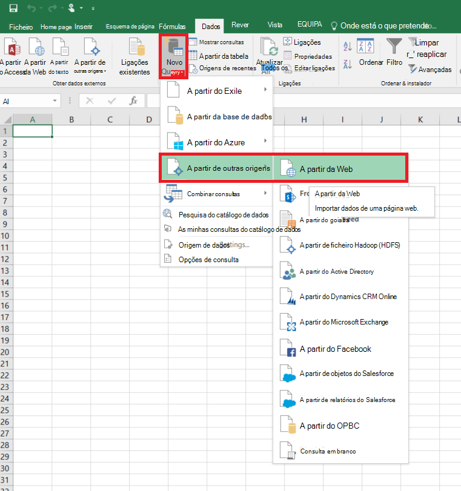
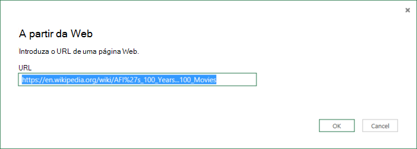
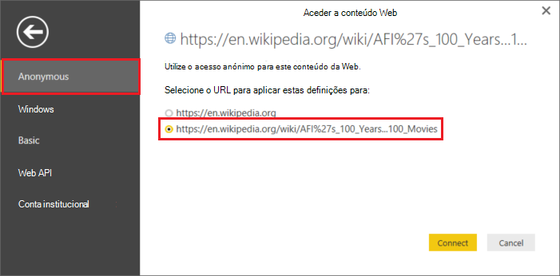
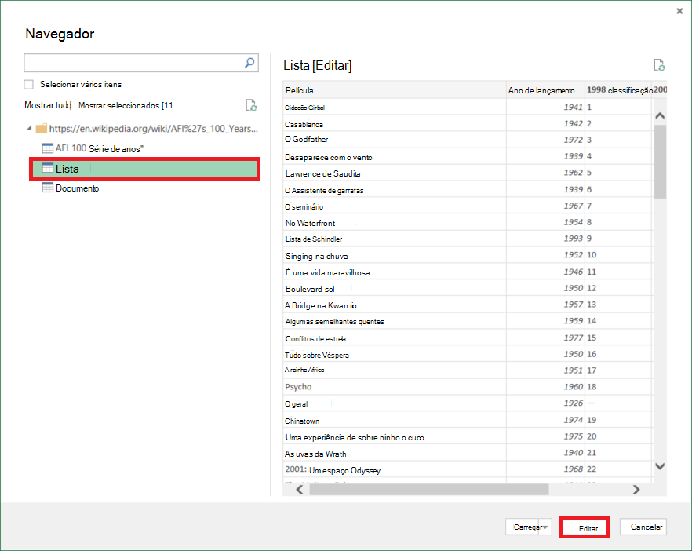
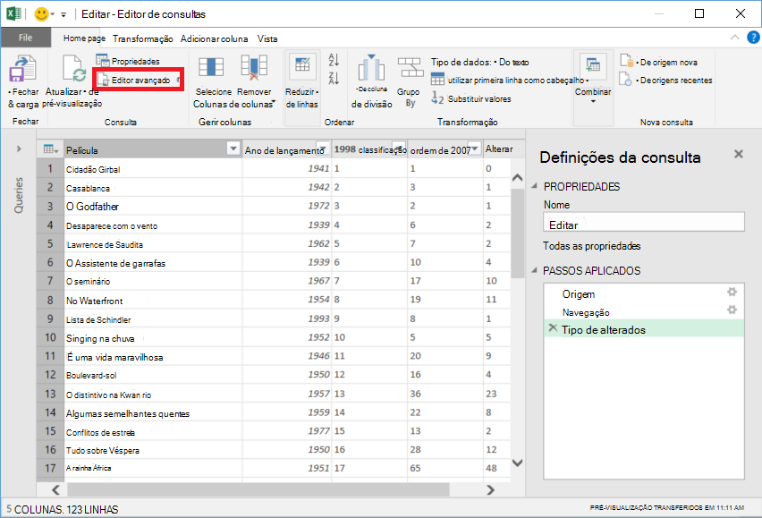
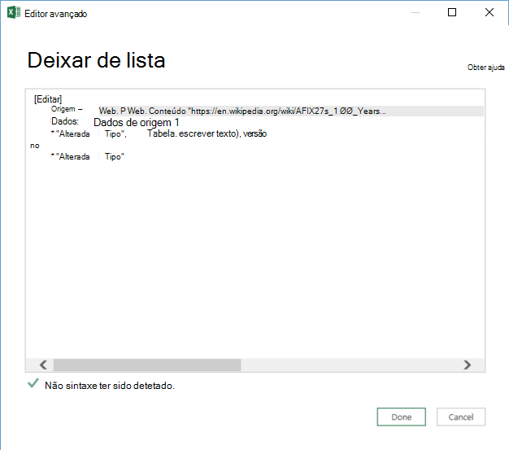

<properties 
    pageTitle="Mover os dados da tabela Web | Dados Azure fábrica" 
    description="Saiba mais sobre como mover os dados no local a partir de uma tabela numa página Web utilizando a fábrica de dados do Azure." 
    services="data-factory" 
    documentationCenter="" 
    authors="linda33wj" 
    manager="jhubbard" 
    editor="monicar"/>

<tags 
    ms.service="data-factory" 
    ms.workload="data-services" 
    ms.tgt_pltfrm="na" 
    ms.devlang="na" 
    ms.topic="article" 
    ms.date="09/26/2016" 
    ms.author="jingwang"/>

# Mover os dados a partir de uma fonte de tabela Web utilizando a fábrica de dados do Azure
Este artigo descreve como pode utilizar a atividade de cópia numa fábrica Azure dados para copiar dados de uma tabela numa página Web ao arquivo de dados de outra. Este artigo constrói no artigo do [atividades de movimento de dados](data-factory-data-movement-activities.md) , que apresenta uma descrição geral de movimento de dados com cópia atividade e combinações de arquivo de dados suportadas.

Atualmente a fábrica de dados suporta apenas mover os dados a partir de uma tabela Web outras arquivos de dados, mas não mover dados a partir de outros dados armazena para um destino na tabela Web.

> [AZURE.NOTE] Este conector Web atualmente suporta apenas extracção conteúdo da tabela a partir de uma página HTML.

## Exemplo: Copiar dados de tabela Web para BLOBs do Azure

Mostra o exemplo abaixo:

1.  Um serviço do tipo [Web](#web-linked-service-properties)ligado.
2.  Um serviço do tipo [AzureStorage](data-factory-azure-blob-connector.md#azure-storage-linked-service-properties)ligado.
3.  Um [conjunto de dados](data-factory-create-datasets.md) entrada do tipo [WebTable](#WebTable-dataset-properties).
4.  Um resultado [conjunto de dados](data-factory-create-datasets.md) do tipo [AzureBlob](data-factory-azure-blob-connector.md#azure-blob-dataset-type-properties).
4.  Uma [tubagem](data-factory-create-pipelines.md) com cópia atividade que utiliza [WebSource](#websource-copy-activity-type-properties) e [BlobSink](data-factory-azure-blob-connector.md#azure-blob-copy-activity-type-properties).

O exemplo copia os dados a partir de uma tabela Web para um BLOBs do Azure cada hora. As propriedades JSON utilizadas nestas amostras são descritas nas secções seguir os exemplos. 

O exemplo seguinte mostra como copiar dados de uma tabela Web para um BLOBs do Azure. No entanto, os dados podem ser copiados diretamente para qualquer uma das PIAs indicadas no artigo [Atividades de movimento de dados](data-factory-data-movement-activities.md) utilizando a atividade de cópia no Azure fábrica de dados. 

**Web ligadas serviço** Este exemplo utiliza o serviço Web ligada com autenticação anónima. Consulte a secção [Web ligadas serviço](#web-linked-service-properties) para diferentes tipos de autenticação pode utilizar. 

    {
        "name": "WebLinkedService",
        "properties":
        {
            "type": "Web",
            "typeProperties":
            {
                "authenticationType": "Anonymous",
                "url" : "https://en.wikipedia.org/wiki/"
            }
        }
    }

**Serviço de armazenamento ligado do Azure**

    {
      "name": "AzureStorageLinkedService",
      "properties": {
        "type": "AzureStorage",
        "typeProperties": {
          "connectionString": "DefaultEndpointsProtocol=https;AccountName=<accountname>;AccountKey=<accountkey>"
        }
      }
    }

**Conjunto de dados de entrada WebTable** A definição **externos** para **true** informa o serviço de dados fábrica do mesmo que o conjunto de dados externa a fábrica de dados e não é produzido por uma actividade na fábrica de dados.

> [AZURE.NOTE] Consulte a secção [obter índice de uma tabela numa página HTML](#get-index-of-a-table-in-an-html-page) para obter os passos para obter o índice de uma tabela numa página HTML.  

    
    {
        "name": "WebTableInput",
        "properties": {
            "type": "WebTable",
            "linkedServiceName": "WebLinkedService",
            "typeProperties": {
                "index": 1,
                "path": "AFI's_100_Years...100_Movies"
            },
            "external": true,
            "availability": {
                "frequency": "Hour",
                "interval":  1
            }
        }
    }

**Conjunto de dados de saída de Blobs do Azure**

Dados escritos para um novo blob cada hora (frequência: hora, o intervalo: 1). 

    {
        "name": "AzureBlobOutput",
        "properties":
        {
            "type": "AzureBlob",
            "linkedServiceName": "AzureStorageLinkedService",
            "typeProperties":
            {
                "folderPath": "adfgetstarted/Movies"
            },
            "availability":
            {
                "frequency": "Hour",
                "interval": 1
            }
        }
    }

**Gasoduto com atividade de cópia**

A tubagem contém uma atividade de cópia está configurado para utilizar a acima de entrada e saída de conjuntos de dados e está agendada para executar a cada hora. No pipeline de definição de JSON, o tipo de **origem** está definido para **WebSource** e **sink** tipo está definido como **BlobSink**. 

Ver [Propriedades de tipo de WebSource](#websource-copy-activity-type-properties) para a lista de propriedades suportadas pela WebSource. 
    
    {  
        "name":"SamplePipeline",
        "properties":{  
        "start":"2014-06-01T18:00:00",
        "end":"2014-06-01T19:00:00",
        "description":"pipeline with copy activity",
        "activities":[  
          {
            "name": "WebTableToAzureBlob",
            "description": "Copy from a Web table to an Azure blob",
            "type": "Copy",
            "inputs": [
              {
                "name": "WebTableInput"
              }
            ],
            "outputs": [
              {
                "name": "AzureBlobOutput"
              }
            ],
            "typeProperties": {
              "source": {
                "type": "WebSource"
              },
              "sink": {
                "type": "BlobSink"
              }
            },
           "scheduler": {
              "frequency": "Hour",
              "interval": 1
            },
            "policy": {
              "concurrency": 1,
              "executionPriorityOrder": "OldestFirst",
              "retry": 0,
              "timeout": "01:00:00"
            }
          }
          ]
       }
    }

## Propriedades da ligadas serviço Web

A tabela seguinte fornece uma descrição para elementos JSON específicas ligado serviço Web.

| Propriedade | Descrição | Obrigatório |
| -------- | ----------- | -------- | 
| tipo | A propriedade de tipo tem de estar definida: **Web** | Sim | 
| URL | URL para a fonte da Web | Sim |
| authenticationType | Anónima ou básica. | Sim |
| nome de utilizador | Nome de utilizador para a autenticação básica. | Sim (para a autenticação básica)
| palavra-passe | Palavra-passe para autenticação básica. | Sim (para a autenticação básica)

### Utilizando a autenticação anónima

    {
        "name": "web",
        "properties":
        {
            "type": "Web",
            "typeProperties":
            {
                "authenticationType": "Anonymous",
                "url" : "https://en.wikipedia.org/wiki/"
            }
        }
    }

### Utilizando a autenticação básica
    
    {
        "name": "web",
        "properties":
        {
            "type": "Web",
            "typeProperties":
            {
                "authenticationType": "basic",
                "url" : "http://myit.mycompany.com/",
                "userName": "Administrator",
                "password": "password"
            }
        }
    }

## Propriedades do conjunto de dados WebTable

Para obter uma lista completa das secções e propriedades que estão disponíveis para a definição de conjuntos de dados, consulte o artigo [criar conjuntos de dados](data-factory-create-datasets.md) . As secções como estrutura, disponibilidade e a política de um conjunto de dados JSON são semelhantes para todos os tipos de conjunto de dados (Azure SQL, BLOBs do Azure, tabela do Azure, etc.).

A secção **typeProperties** é diferente para cada tipo de conjunto de dados e fornece informações sobre a localização dos dados no arquivo de dados. A secção de typeProperties do conjunto de dados do tipo **WebTable** tem as seguintes propriedades

Propriedade | Descrição | Obrigatório
:-------- | :----------- | :--------
tipo    | tipo do conjunto de dados. tem de estar definida para **WebTable** | Sim
caminho | Um URL relativo ao recurso que contém a tabela. | Não. Quando não é especificado um caminho, é utilizado apenas o URL especificado na definição do serviço ligadas. 
índice remissivo | O índice da tabela do recurso. Consulte a secção [obter índice de uma tabela numa página HTML](#get-index-of-a-table-in-an-html-page) para obter os passos para obter o índice de uma tabela numa página HTML. | Sim

**Exemplo:**

    {
        "name": "WebTableInput",
        "properties": {
            "type": "WebTable",
            "linkedServiceName": "WebLinkedService",
            "typeProperties": {
                "index": 1,
                "path": "AFI's_100_Years...100_Movies"
            },
            "external": true,
            "availability": {
                "frequency": "Hour",
                "interval":  1
            }
        }
    }

## WebSource - propriedades do tipo de atividade de cópia

Para obter uma lista completa das secções e propriedades que estão disponíveis para a definição de atividades, consulte o artigo [Criar tubagens](data-factory-create-pipelines.md) . Propriedades, tais como o nome, descrição, de entrada e saída tabelas e política estão disponíveis para todos os tipos de atividades. 

Propriedades disponíveis na secção typeProperties da atividade de outro lado variam com cada tipo de atividade. Para actividade de cópia, eles variam dependendo dos tipos de origens e sumidouros.

Atualmente, quando a origem numa atividade de cópia for tipo **WebSource**, sem propriedades adicionais são suportadas. 

## Obter o índice de uma tabela numa página HTML

1. Inicie o **Excel 2016** e mude para o separador **dados** .  
2. Clique em **Nova consulta** , na barra de ferramentas, aponte para **a partir de outras origens** e clique em **Da Web**.
    
     
3. Na caixa de diálogo **Da Web** , introduza o **URL** que pretende utilizar no serviço ligadas JSON (por exemplo: https://en.wikipedia.org/wiki/) juntamente com o caminho que especificou para o conjunto de dados (por exemplo: AFI 27s_100_Years de %... 100_Movies) e clique em **OK**. 

     

    URL utilizado neste exemplo: https://en.wikipedia.org/wiki/AFI%27s_100_Years...100_Movies 
4.  Se vir a caixa de diálogo **conteúdo da Web do Access** , selecione direita **URL**, **autenticação**e clique em **Ligar**. 

    
5.  Clique num item de **tabela** na vista de árvore para ver o conteúdo a partir da tabela e, em seguida, clique em botão **Editar** na parte inferior.  

     

5. Na janela do **Editor de consultas** , clique em **Editor avançado** botão na barra de ferramentas.

    

6. Na caixa de diálogo Editor avançado, o número ao lado de "Origem" é o índice.

     

Se estiver a utilizar o Excel 2013, utilize o [Microsoft Power Query para Excel](https://www.microsoft.com/download/details.aspx?id=39379) para obter o índice. Consulte o artigo [ligar a uma página web](https://support.office.com/article/Connect-to-a-web-page-Power-Query-b2725d67-c9e8-43e6-a590-c0a175bd64d8) artigo para obter detalhes. Os passos são semelhantes se estiver a utilizar [O Microsoft Power BI para ambiente de trabalho](https://powerbi.microsoft.com/desktop/). 

[AZURE.INCLUDE [data-factory-column-mapping](../../includes/data-factory-column-mapping.md)]

[AZURE.INCLUDE [data-factory-structure-for-rectangualr-datasets](../../includes/data-factory-structure-for-rectangualr-datasets.md)]

## Desempenho e optimização  
Consulte o artigo [desempenho de atividade de cópia e Otimização do guia](data-factory-copy-activity-performance.md) para saber mais sobre os fatores chaves a que o desempenho impacto de movimento de dados (copiar actividade) no Azure fábrica de dados e várias formas para otimizar o-lo.
