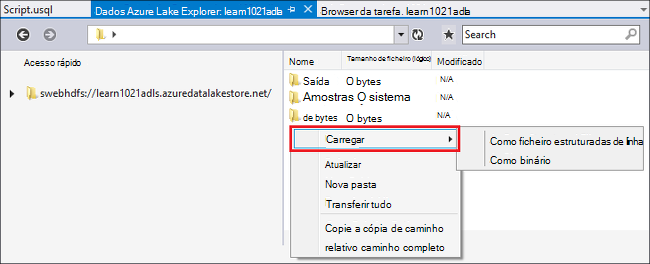
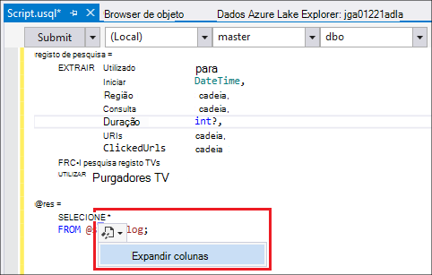
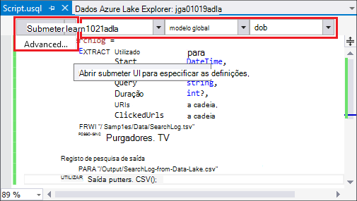
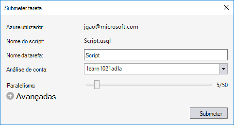
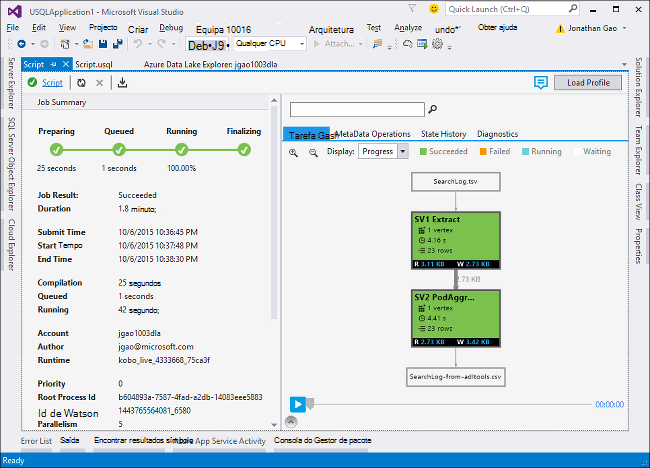
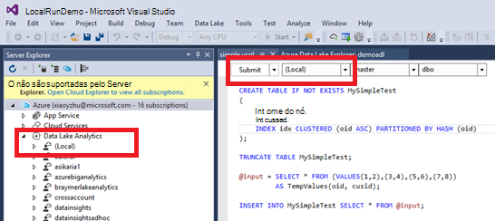
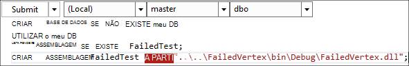

<properties
   pageTitle="Desenvolver scripts de U SQL utilizando ferramentas de Lake de dados para o Visual Studio | Azure"
   description="Saiba como instalar ferramentas de Lake de dados para Visual Studio, como desenvolver e scripts de teste U-SQL. "
   services="data-lake-analytics"
   documentationCenter=""
   authors="edmacauley"
   manager="jhubbard"
   editor="cgronlun"/>

<tags
   ms.service="data-lake-analytics"
   ms.devlang="na"
   ms.topic="get-started-article"
   ms.tgt_pltfrm="na"
   ms.workload="big-data"
   ms.date="05/16/2016"
   ms.author="edmaca"/>

# Tutorial: desenvolver scripts de U SQL utilizando ferramentas de Lake de dados para o Visual Studio

[AZURE.INCLUDE [get-started-selector](../../includes/data-lake-analytics-selector-get-started.md)]

Saiba como instalar ferramentas de Lake de dados para o Visual Studio e utilizar ferramentas de Lake de dados para o Visual Studio para escrever e testar scripts U-SQL.

U SQL é uma linguagem hyper dimensionáveis, altamente extensible para preparar, transformará e analisar todos os dados na lake dados e para além das. Para mais informações, consulte o artigo [referência U SQL] (http://go.microsoft.com/fwlink/p/?LinkId=691348).

##Pré-requisitos

- **Visual Studio 2015, Visual Studio 2013 atualizar 4 ou Visual Studio 2012. Enterprise (Ultimate/Premium), Professional, Comunidade edições são suportadas; Express edition não é suportada. Visual Studio "15" não é atualmente suportada e estamos a trabalhar no que.**
- **Microsoft Azure SDK para .NET versão 2.7.1 ou acima**.  Instalá-lo a utilizar o [instalador do plataforma Web](http://www.microsoft.com/web/downloads/platform.aspx).
- **[Ferramentas de dados Lake para Visual Studio](http://aka.ms/adltoolsvs)**.

    Quando estiver instalada dados Lake ferramentas para o Visual Studio, verá um nó de "Dados Lake Analytics" no servidor Explorer sob o nó de "Azure" (pode abrir o servidor Explorador ao premir Ctrl + Alt + S).

- **Percorrer as seguintes duas secções [Introdução ao Azure dados Lake Analytics utilizando o Azure portal](data-lake-analytics-get-started-portal.md)**.

    - [Criar uma conta Azure dados Lake Analytics](data-lake-analytics-get-started-portal.md#create_adl_analytics_account).
    - [SearchLog.tsv carregar para a conta de armazenamento de Lake dados predefinida](data-lake-analytics-get-started-portal.md#update-data-to-the-default-adl-storage-account).

    Para sua comodidade, pode encontrar um script PowerShell de exemplo para criar um serviço de dados Lake analítico e carregar o ficheiro de dados de origem no [exemplo Appx-A PowerShell para preparar o tutorial](data-lake-analytics-data-lake-tools-get-started.md#appx-a-powershell-sample-for-preparing-the-tutorial).

    As ferramentas de Lake dados não suporta a criação de contas de análise de Lake de dados. Por isso, tem de criá-lo utilizando o portal Azure Azure PowerShell, .NET SDK ou clip de Azure. Para executar uma tarefa de dados Lake Analytics, terá de alguns dados. Apesar das ferramentas de Lake dados suportar o carregamento dos dados, que irá utilizar o portal para carregar os dados de exemplo para facilitar este tutorial seguir.

## Ligar ao Azure

**Para ligar a dados Lake Analytics**

1. Abrir o Visual Studio.
2. A partir do menu **Ver** , clique em **Server Explorer** para abrir o Explorador de servidor. Ou prima **[CTRL] + [ALT] + S**.
3. Botão direito do rato **Azure**, clique em "Ligar ao Microsoft Azure subscrição" e, em seguida, siga as instruções.
4. A partir do **Explorador do servidor**, expanda **Azure**e, em seguida, expanda **Lake a análise de dados**. Deve ver uma lista das suas contas de dados Lake Analytics se existirem qualquer. Não é possível criar contas de análise de Lake dados a partir do Visual Studio. Para criar uma conta, consulte o artigo [Introdução ao Azure dados Lake Analytics utilizando o Azure portal](data-lake-analytics-get-started-portal.md) ou [Introdução ao Azure dados Lake Analytics através do Azure PowerShell](data-lake-analytics-get-started-powershell.md).

## Carregar ficheiros de dados de origem

Carregou alguns dados na secção **pré-requisito** anteriormente no tutorial.  

Caso pretenda utilizar os seus próprios dados, aqui estão os procedimentos para carregar os dados a partir das ferramentas de Lake de dados.

**Carregar ficheiros para a conta Azure dados Lake dependente**

1. A partir do **Explorador do servidor**, expanda **Azure**, expanda **Lake a análise de dados**, expandir a sua conta de dados Lake Analytics, expanda **Contas de armazenamento**. Deve Consulte conta predefinida de armazenamento de Lake de dados e as contas de armazenamento de Lake dados ligadas e as contas de armazenamento do Windows Azure ligadas. A conta de dados Lake predefinida tem uma etiqueta "Conta de armazenamento predefinida".
2. Botão direito do rato a conta de armazenamento de Lake dados predefinida e, em seguida, clique em **Explorador**.  Abre-se as ferramentas de Lake de dados para o painel Visual Studio Explorer.  No lado esquerdo, mostra uma vista em árvore, que a vista de conteúdo é à direita.
3. Navegue para a pasta onde pretende carregar ficheiros,
4. Qualquer espaço em branco com o botão direito e, em seguida, clique em **carregar**.

    

**Carregar ficheiros para uma conta de armazenamento de Blobs do Azure ligada**

1. A partir do **Explorador do servidor**, expanda **Azure**, expanda **Lake a análise de dados**, expandir a sua conta de dados Lake Analytics, expanda **Contas de armazenamento**. Deve Consulte conta predefinida de armazenamento de Lake de dados e as contas de armazenamento de Lake dados ligadas e as contas de armazenamento do Windows Azure ligadas.
2. Expanda a conta de armazenamento Azure.
3. O contentor onde pretende carregar ficheiros com o botão direito e, em seguida, clique em **Explorador**. Se não tiver um contentor, tem de criar um utilizando o portal do Azure, Azure PowerShell ou outras ferramentas pela primeira vez.
4. Navegue para a pasta onde pretende carregar ficheiros,
5. Qualquer espaço em branco com o botão direito e, em seguida, clique em **carregar**.

## Desenvolver scripts U SQL

As tarefas de dados Lake Analytics estão escritas em linguagem U SQL. Para saber mais sobre U SQL, consulte o artigo [Introdução ao linguagem U SQL](data-lake-analytics-u-sql-get-started.md) e a [referência da linguagem U SQL](http://go.microsoft.com/fwlink/?LinkId=691348).

**Para criar e submeter uma tarefa de dados Lake Analytics**

1. No menu **ficheiro** , clique em **Novo**e, em seguida, clique em **projeto**.
2. Selecione o tipo de **Projecto U-SQL** .

    

3. Clique em **OK**. Visual studio cria uma solução com um ficheiro de **Script.usql** .
4. Introduza o seguinte script **Script.usql**:

        @searchlog =
            EXTRACT UserId          int,
                    Start           DateTime,
                    Region          string,
                    Query           string,
                    Duration        int?,
                    Urls            string,
                    ClickedUrls     string
            FROM "/Samples/Data/SearchLog.tsv"
            USING Extractors.Tsv();

        @res =
            SELECT *
            FROM @searchlog;        

        OUTPUT @res   
            TO "/Output/SearchLog-from-Data-Lake.csv"
        USING Outputters.Csv();

    Este script do U SQL lê o ficheiro de dados de origem utilizando **Extractors.Tsv()**e, em seguida, cria um ficheiro csv com **Outputters.Csv()**.

    Não modifique os caminhos de dois a menos que copiou o ficheiro de origem para uma localização diferente.  A análise de dados Lake irá criar a pasta de saída, se não existe.

    É mais simples utilizar os caminhos relativos para ficheiros nas predefinições dados armazenados contas Lake. Também pode utilizar caminhos absolutos.  Por exemplo

        adl://<Data LakeStorageAccountName>.azuredatalakestore.net:443/Samples/Data/SearchLog.tsv

    Tem de utilizar referências absolutos caminhos para aceder a ficheiros nas contas ligadas de armazenamento.  A sintaxe para os ficheiros guardados na conta de armazenamento do Windows Azure associada é:

        wasb://<BlobContainerName>@<StorageAccountName>.blob.core.windows.net/Samples/Data/SearchLog.tsv

    >[AZURE.NOTE] Azure Blob contentor com blobs públicos ou permissões de acesso de contentores público atualmente não são suportadas.  

    Tenha em atenção as seguintes funcionalidades:

    - **IntelliSense**

        Conclusão automática de nome e os membros serão apresentados para o conjunto de linhas, Classes, bases de dados, esquemas e objetos definidos pelo utilizador (UDOs).

        O IntelliSense para entidades de catálogo (bases de dados, esquemas, tabelas, etc UDOs) está relacionada com a sua conta de cluster. Pode verificar a conta ativa cluster atual, a base de dados e o esquema na barra de ferramentas superior e mudá-los através das listas de lista pendente.

    - **Expandir* colunas**

        Clique em à direita do *, deverá vê um sublinhado azul sob o *. Paire o cursor do rato sobre o sublinhado azul e, em seguida, clique na seta para baixo.
        

        Clique em **Expandir colunas**, a ferramenta irá substituir o * com os nomes das colunas.

    - **Formatação automática**

        Os utilizadores podem alterar o avanço do script U SQL com base no código de estrutura em Editar -> Avançadas:

        - Documento com o formato (Ctrl + E, D): Todo o documento de formatos   
        - Formatar seleção (Ctrl + K, Ctrl + F): Formata a seleção. Não se tiver sido feita nenhuma selecção, este atalho formatos a linha que o cursor está no.  

        Toda a formatação de regras são configuráveis em ferramentas de -> Opções -> Editor de texto - > SIP -> a formatação.  
    - **Avanço inteligente**

        Ferramentas de Lake de dados para o Visual Studio é consiga avançar automaticamente expressões enquanto estiver a escrever scripts. Esta funcionalidade está desativada por predefinição, os utilizadores têm de ativá-lo através de verificação U-SQL -> Opções e definições -> parâmetros -> ativar avançar inteligente.

    - **Aceda a definição e localize todas as referências**

        Clicar com o botão direito no nome de um conjunto de linhas/parâmetro/coluna/UDO etc e clicando em Ir para definição (F12) permite-lhe navegar para a sua definição. Ao clicar em localizar todas as referências (Shift + F12), irá mostrar todas as referências.

    - **Inserir caminho do Azure**

        Em vez de renovados caminho do ficheiro Azure e escreva-lo manualmente quando escrever um script, ferramentas de Lake de dados para o Visual Studio fornece uma forma fácil: com o botão direito no editor, clique em Inserir caminho Azure. Navegue para o ficheiro na caixa de diálogo Browser de Blobs do Azure. Clique em **OK**. o caminho do ficheiro será inserido para o seu código.

5. Especificar a conta dados Lake Analytics, a base de dados e o esquema. Pode selecionar **(local)** para executar o script localmente para o efeito de teste. Para mais informações, consulte o artigo [Executar U-SQL localmente](#run-u-sql-locally).

    

    Para mais informações, consulte o artigo [utilizar U-SQL catálogo](data-lake-analytics-use-u-sql-catalog.md).

5. **Solução Explorer**, com o botão direito **Script.usql**e, em seguida, clique em **Criar Script**. Verifique se o resultado no painel de saída.
6. **Solução Explorer**, com o botão direito **Script.usql**e, em seguida, clique em **Submeter Script**. Opcionalmente, também pode clicar em **Submeter** a partir do painel de Script.usql.  Consulte o artigo a captura de ecrã anterior.  Clique na seta para baixo junto ao botão Submeter para submeter utilizando as opções de antecipada:
7. Especifique o **Nome da tarefa**, verifique se a **Análise de conta**e, em seguida, clique em **Submeter**. Resultados de submissão e ligação de tarefa estão disponíveis nas ferramentas de Lake de dados para a janela do Visual Studio resulta quando a apresentação seja concluída.

    

8. Tem de clicar no botão Atualizar para ver o estado da tarefa mais recente e atualizar o ecrã. Quando sucessos tarefa,-irão mostrar-lhe a **Tarefa Graph**, **Meta operações de dados**, **Histórico do Estado**, **diagnóstico**:

    

    * Resumo da tarefa. Mostrar as informações de resumo do projecto actual, por exemplo: Estado, progresso, tempo de execução, Runtime nome, etc Submissores.   
    * Detalhes de tarefa. Obter informações detalhadas sobre esta tarefa são fornecidas, incluindo o script, recursos, vértice execução vista.
    * Gráfico de tarefa. Quatro gráficos são fornecidos para visualizar informações da tarefa: progresso, leitura de dados, os dados escritos, tempo de execução, tempo de execução média por nó, débito de entrada, débito de saída.
    * Operações de metadados. Mostra todas as operações de metadados.
    * Histórico de estado.
    * Diagnósticos. Ferramentas de Lake de dados para o Visual Studio irá diagnosticar execução de tarefas automaticamente. Vai receber alertas quando existem alguns erros ou problemas de desempenho no seu emprego. Consulte o artigo tarefa parte diagnósticos (ligação TBD) para obter mais informações.

**Para verificar o estado da tarefa**

1. A partir do Explorador de servidor, expanda **Azure**, expanda **A análise de dados Lake**, expanda o nome da conta dados Lake Analytics
2. Faça duplo clique em **tarefas** para listar as tarefas.
2. Clique numa tarefa para ver o estado.

**Para ver o resultado da tarefa**

1. A partir do **Explorador do servidor**, expanda **Azure**, expanda **Lake a análise de dados**, expandir a sua conta de dados Lake Analytics, expandir **Contas de armazenamento**, a conta de armazenamento de Lake dados predefinida com o botão direito e, em seguida, clique em **Explorador**.
2.  Faça duplo clique em **exportação** para abrir a pasta
3.  Faça duplo clique **SearchLog a partir do adltools.csv**.

###Reprodução de tarefa

Reprodução de tarefa permite-lhe ver progresso de execução de tarefa e visualmente detetar saída anomalias desempenho ou bloqueios. Esta funcionalidade pode ser utilizada antes da tarefa estiver concluída execução (ou seja, durante o período de tempo que a tarefa ativamente está a ser executado), bem como depois de concluída a execução. Efetuar a reprodução durante a execução de tarefa permitirá que o utilizador para voltar a ouvir o progresso até a hora atual.

**Para ver o progresso de execução de tarefa**  

1. Clique em **Carregar perfil** no canto superior direito. Consulte o artigo a captura de ecrã anterior.
2. Clique no botão Reproduzir no canto inferior esquerdo para rever o progresso de execução de tarefa.
3. Durante a reprodução, clique em **Pausa** para pará-la ou diretamente arraste a barra de progresso para posições específicas.

###Mapa térmico

Ferramentas de Lake de dados para o Visual Studio disponibiliza sobreposições de cor utilizador selecionável em vista de tarefa para indicar o progresso, dados e/s, tempo de execução, débito e/s de cada fase. Através deste, os utilizadores podem descobrir potenciais problemas e distribuição de propriedades da tarefa diretamente e intuitivamente. Pode escolher uma origem de dados para apresentar a partir da lista pendente.  

## Executar o U SQL localmente

Utilização do local de U SQL experiência no Visual Studio, pode:

- Execute scripts de U SQL localmente, juntamente com c# fluidos.
- Depurar c# assemblagem localmente.
- Criar/Eliminar/vista bases de dados locais, fluidos, esquemas e tabelas no servidor Explorer apenas à medida que podem fazer por serviço Azure dados Lake Analytics.

Irá ver uma conta *Local* no Visual Studio e o instalador do cria uma *DataRoot* pasta localizada *C:\LocalRunRoot*. A pasta DataRoot será utilizada:

- Loja metadados incluindo tabelas DBs, TVFs, etc.
- Para obter um script determinado: se um caminho relativo é referenciado nas caminhos de entrada/saída, vamos para cima o DataRoot (bem como caminho o script se o it do entrada)
- A pasta DataRoot não será referenciada se está a tentar registar uma assemblagem e utilizar um caminho relativo (consulte "utilizar conjuntos quando efetuar executar local" peça para obter mais detalhes)

O vídeo seguinte demonstra a funcionalidade de executar local U SQL:

>[AZURE.VIDEO usql-localrun]

### Problemas e limitações conhecidos

- Não é possível criar tabela/DB, etc. no Explorador do servidor para a conta local.
- Quando um caminho relativo é referenciado:

    - Em script input (EXTRAIR * FROM "/ caminho/abc")-o caminho DataRoot e o caminho do script vai ser procurados.
    - No resultado de script (saída para "caminho/abc"): o caminho DataRoot será utilizado como a pasta de saída.
    - No registo assemblagem (xyz ASSEMBLAGEM de criar a partir de "/ caminho/abc"): o caminho do script será procurado, mas não o DataRoot.
    - Em registered TVF/visualizar ou outras entidades de metadados: o caminho DataRoot será procurado, mas não o caminho do script.

    Scripts executou o serviço de dados Lake, a conta de armazenamento predefinida será utilizada como pasta raiz e será procurada em conformidade.

### Testar U SQL scripts localmente
Para obter instruções sobre como desenvolver scripts U SQL, consulte o artigo [scripts desenvolver U-SQL](#develop-and-test-u-sql-scripts). Para criar e executar U SQL scripts localmente, selecione **(Local)** na lista pendente cluster e, em seguida, clique em **Submeter**. Fórum Certifique-se de que tem os dados corretos referenciados - quer referir-se para o caminho absoluto ou colocar os dados na pasta DataRoot.

Pode também um script com o botão direito e, em seguida, clique em **Executar a planear Local** no menu de contexto ou prima **CTRL + F5** local accionador executar.

### Utilizar montagens na local executar

Existem duas formas de executar os ficheiros personalizados c#:

- Escreva conjuntos no código por trás do ficheiro e conjuntos de serão automaticamente registados e ignorados quando o script concluir o processo.
- Criar um projeto de assemblagem c# e registar a dll de saída para a conta local através de um script como abaixo. Tenha em atenção que o caminho é relativo o script em vez da pasta DataRoot.

### Depurar scripts e c# assemblagem localmente

Pode depurar c# assemblagem sem submeter e registá-lo para o serviço de análise do Azure dados Lake. Pode definir pontos de interrupção no código por trás do ficheiro e num projeto c# referenciado.

**Depurar local código no código por trás do ficheiro**
1.  Definir pontos de interrupção no código por trás do ficheiro.
2.  Prima **F5** para depurar script localmente.

O procedimento seguinte só funciona no Visual Studio 2015. No Visual Studio mais antigos poderá ter de adicionar os ficheiros de pdb manualmente.

**Depurar código local num projeto c# referenciada**
1.  Criar um projeto c# assemblagem e criar para gerar a dll de saída.
2.  Registe-se a dll utilizando uma instrução de U SQL:

        CREATE ASSEMBLY assemblyname FROM @"..\..\path\to\output\.dll";
3.  Definir pontos de interrupção no código c#.
4.  Prima **F5** para depurar script com referenciar a c# dll localmente.  

##Consulte também

Para começar a trabalhar com dados Lake análises com ferramentas diferentes, consulte o artigo:

- [Começar a trabalhar com dados Lake Analytics através do portal Azure](data-lake-analytics-get-started-portal.md)
- [Começar a trabalhar com dados Lake Analytics através do PowerShell do Azure](data-lake-analytics-get-started-powershell.md)
- [Introdução ao .NET SDK a utilizar a análise de dados Lake](data-lake-analytics-get-started-net-sdk.md)
- [Depurar c# código tarefas U SQL](data-lake-analytics-debug-u-sql-jobs.md)

Para ver mais tópicos de desenvolvimento:

- [Analisar blogues Web utilizando a análise de dados Lake](data-lake-analytics-analyze-weblogs.md)
- [Desenvolver scripts de U SQL utilizando ferramentas de Lake de dados para o Visual Studio](data-lake-analytics-data-lake-tools-get-started.md)
- [Introdução ao idioma do Azure dados Lake Analytics U-SQL](data-lake-analytics-u-sql-get-started.md)
- [Desenvolver operadores de definidas pelo utilizador U SQL para trabalhos de dados Lake Analytics](data-lake-analytics-u-sql-develop-user-defined-operators.md)

##Exemplo de PowerShell AppX-A para preparar o tutorial

O seguinte script do PowerShell prepara uma conta Azure dados Lake Analytics e a origem de dados, pode ignorar a [scripts de desenvolver U-SQL](data-lake-analytics-data-lake-tools-get-started.md#develop-u-sql-scripts).

    #region - used for creating Azure service names
    $nameToken = "<Enter an alias>"
    $namePrefix = $nameToken.ToLower() + (Get-Date -Format "MMdd")
    #endregion

    #region - service names
    $resourceGroupName = $namePrefix + "rg"
    $dataLakeStoreName = $namePrefix + "adas"
    $dataLakeAnalyticsName = $namePrefix + "adla"
    $location = "East US 2"
    #endregion

    # Treat all errors as terminating
    $ErrorActionPreference = "Stop"

    #region - Connect to Azure subscription
    Write-Host "`nConnecting to your Azure subscription ..." -ForegroundColor Green
    try{Get-AzureRmContext}
    catch{Login-AzureRmAccount}
    #endregion

    #region - Create an Azure Data Lake Analytics service account
    Write-Host "Create a resource group ..." -ForegroundColor Green
    New-AzureRmResourceGroup `
        -Name  $resourceGroupName `
        -Location $location

    Write-Host "Create a Data Lake account ..."  -ForegroundColor Green
    New-AzureRmDataLakeStoreAccount `
        -ResourceGroupName $resourceGroupName `
        -Name $dataLakeStoreName `
        -Location $location

    Write-Host "Create a Data Lake Analytics account ..."  -ForegroundColor Green
    New-AzureRmDataLakeAnalyticsAccount `
        -Name $dataLakeAnalyticsName `
        -ResourceGroupName $resourceGroupName `
        -Location $location `
        -DefaultDataLake $dataLakeStoreName

    Write-Host "The newly created Data Lake Analytics account ..."  -ForegroundColor Green
    Get-AzureRmDataLakeAnalyticsAccount `
        -ResourceGroupName $resourceGroupName `
        -Name $dataLakeAnalyticsName  
    #endregion

    #region - prepare the source data
    Write-Host "Import the source data ..."  -ForegroundColor Green
    $localFolder = "C:\Tutorials\Downloads\" # A temp location for the file.
    $storageAccount = "adltutorials"  # Don't modify this value.
    $container = "adls-sample-data"  #Don't modify this value.

    # Create the temp location  
    New-Item -Path $localFolder -ItemType Directory -Force

    # Download the sample file from Azure Blob storage
    $context = New-AzureStorageContext -StorageAccountName $storageAccount -Anonymous
    $blobs = Azure\Get-AzureStorageBlob -Container $container -Context $context
    $blobs | Get-AzureStorageBlobContent -Context $context -Destination $localFolder

    # Upload the file to the default Data Lake Store account    
    Import-AzureRmDataLakeStoreItem -AccountName $dataLakeStoreName -Path $localFolder"SearchLog.tsv" -Destination "/Samples/Data/SearchLog.tsv"

    Write-Host "List the source data ..."  -ForegroundColor Green
    Get-AzureRmDataLakeStoreChildItem -Account $dataLakeStoreName -Path  "/Samples/Data/"
    #endregion
