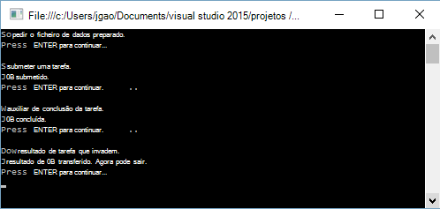

<properties 
   pageTitle="Introdução ao Azure dados Lake Analytics utilizando .NET SDK | Azure" 
   description="Saiba como utilizar o .NET SDK para criar contas do arquivo de Lake de dados, criar tarefas de dados Lake Analytics e submeter tarefas escritas U-SQL. " 
   services="data-lake-analytics" 
   documentationCenter="" 
   authors="edmacauley" 
   manager="jhubbard" 
   editor="cgronlun"/>
 
<tags
   ms.service="data-lake-analytics"
   ms.devlang="na"
   ms.topic="hero-article"
   ms.tgt_pltfrm="na"
   ms.workload="big-data" 
   ms.date="10/26/2016"
   ms.author="edmaca"/>

# Tutorial: introdução ao Azure dados Lake Analytics utilizando .NET SDK

[AZURE.INCLUDE [get-started-selector](../../includes/data-lake-analytics-selector-get-started.md)]

Saiba como utilizar o Azure .NET SDK para submeter tarefas escritas [U SQL](data-lake-analytics-u-sql-get-started.md) para Lake a análise de dados. Para mais informações sobre Lake a análise de dados, consulte o artigo [Descrição geral do Azure dados Lake Analytics](data-lake-analytics-overview.md).

Neste tutorial, irá desenvolver uma aplicação de consola c# para submeter uma tarefa de U SQL lê um separador separados por ficheiro de valores (TSV) e converte-o para um ficheiro de (CSV) com valores separados por ponto e vírgula. Percorrer o mesmo tutorial utilizar outras ferramentas suportadas, clique nos separadores na parte superior deste artigo.

##Pré-requisitos

Antes de começar este tutorial, tem de ter o seguinte procedimento:

- O **visual Studio 2015, Visual Studio 2013 atualizar 4, ou Visual Studio 2012http com Visual C++ instalado**.
- **Microsoft Azure SDK para .NET versão 2.5 ou acima**.  Instalá-lo a utilizar o [instalador do plataforma Web](http://www.microsoft.com/web/downloads/platform.aspx).
- **A análise de Lake dados Azure uma conta**. Consulte o artigo [Gerir dados Lake análises com Azure .NET SDK](data-lake-analytics-manage-use-dotnet-sdk.md).

##Criar a aplicação de consola

Neste tutorial, processar alguns registos de pesquisa.  O registo de pesquisa pode ser armazenado no arquivo de dados Lake ou armazenamento de Blobs do Azure. 

Um exemplo de registo de pesquisa pode ser encontrado num contentor de Blobs do Azure público. Na aplicação, irá transferir o ficheiro para a sua estação de trabalho e, em seguida, carregar o ficheiro para a conta de dados Lake arquivo predefinida da sua conta de análise de Lake de dados.

**Para criar um script de U SQL**

Tarefas de análise de dados Lake estão escritas em linguagem U SQL. Para saber mais sobre U SQL, consulte o artigo [Introdução ao linguagem U SQL](data-lake-analytics-u-sql-get-started.md) e a [referência da linguagem U SQL](http://go.microsoft.com/fwlink/?LinkId=691348).

Criar um ficheiro de **SampleUSQLScript.txt** com o seguinte script U SQL e coloque o ficheiro de **C:\temp\* * caminho.  O caminho é codificado na aplicação do .NET que criar no procedimento seguinte.  

    @searchlog =
        EXTRACT UserId          int,
                Start           DateTime,
                Region          string,
                Query           string,
                Duration        int?,
                Urls            string,
                ClickedUrls     string
        FROM "/Samples/Data/SearchLog.tsv"
        USING Extractors.Tsv();
    
    OUTPUT @searchlog   
        TO "/Output/SearchLog-from-Data-Lake.csv"
    USING Outputters.Csv();

Este script do U SQL lê o ficheiro de dados de origem utilizando **Extractors.Tsv()**e, em seguida, cria um ficheiro csv com **Outputters.Csv()**. 

No c# programa, tem de preparar o ficheiro de **/Samples/Data/SearchLog.tsv** e a pasta **/Output/** .    

É mais simples utilizar os caminhos relativos para ficheiros nas predefinições dados armazenados contas Lake. Também pode utilizar caminhos absolutos.  Por exemplo 

    adl://<Data LakeStorageAccountName>.azuredatalakestore.net:443/Samples/Data/SearchLog.tsv
    
Tem de utilizar referências absolutos caminhos para aceder a ficheiros nas contas ligadas de armazenamento.  A sintaxe para os ficheiros guardados na conta de armazenamento do Windows Azure ligada é:

    wasb://<BlobContainerName>@<StorageAccountName>.blob.core.windows.net/Samples/Data/SearchLog.tsv

>[AZURE.NOTE] Atualmente, não existe um problema conhecido com o serviço do Azure dados Lake.  Se a aplicação de exemplo é interrompida ou encontra um erro, poderá precisar de eliminar manualmente as contas de arquivo de dados de Lake & Lake a análise de dados que cria o script.  Se não estiver familiarizado com o portal do Azure, o guia de [Gerir Azure dados Lake a análise de utilização Azure portal](data-lake-analytics-manage-use-portal.md) irá ajudar a começar.       

**Para criar uma aplicação**

1. Abrir o Visual Studio.
2. Crie uma aplicação de consola do c#.
3. Abra consola de gestão de pacote NuGet e execute os seguintes comandos:

        Install-Package Microsoft.Azure.Management.DataLake.Analytics -Pre
        Install-Package Microsoft.Azure.Management.DataLake.Store -Pre
        Install-Package Microsoft.Azure.Management.DataLake.StoreUploader -Pre
        Install-Package Microsoft.Rest.ClientRuntime.Azure.Authentication -Pre
        Install-Package WindowsAzure.Storage

       
5. No Program.cs, cole o seguinte código:

        using System;
        using System.IO;
        using System.Collections.Generic;
        using System.Threading;
        using Microsoft.Rest;
        using Microsoft.Rest.Azure.Authentication;
        using Microsoft.Azure.Management.DataLake.Store;
        using Microsoft.Azure.Management.DataLake.StoreUploader;
        using Microsoft.Azure.Management.DataLake.Analytics;
        using Microsoft.Azure.Management.DataLake.Analytics.Models;
        using Microsoft.WindowsAzure.Storage.Blob;

        namespace SdkSample
        {
          class Program
          {
            private const string SUBSCRIPTIONID = "<Enter Your Azure Subscription ID>";
            private const string CLIENTID = "1950a258-227b-4e31-a9cf-717495945fc2";
            private const string DOMAINNAME = "common"; // Replace this string with the user's Azure Active Directory tenant ID or domain name, if needed.

            private static string _adlaAccountName = "<Enter an Existing Data Lake Analytics Account Name>";
            private static string _adlsAccountName = "<Enter the default Data Lake Store Account Name>";

            private static DataLakeAnalyticsAccountManagementClient _adlaClient;
            private static DataLakeStoreFileSystemManagementClient _adlsFileSystemClient;
            private static DataLakeAnalyticsJobManagementClient _adlaJobClient;
        
            private static void Main(string[] args)
            {
                string localFolderPath = @"c:\temp\";

                // Connect to Azure
                var creds = AuthenticateAzure(DOMAINNAME, CLIENTID);

                SetupClients(creds, SUBSCRIPTIONID);

                // Transfer the source file from a public Azure Blob container to Data Lake Store.
                CloudBlockBlob blob = new CloudBlockBlob(new Uri("https://adltutorials.blob.core.windows.net/adls-sample-data/SearchLog.tsv"));
                blob.DownloadToFile(localFolderPath + "SearchLog.tsv", FileMode.Create); // from WASB
                UploadFile(localFolderPath + "SearchLog.tsv", "/Samples/Data/SearchLog.tsv"); // to ADLS
                WaitForNewline("Source data file prepared.", "Submitting a job.");

                // Submit the job
                Guid jobId = SubmitJobByPath(localFolderPath + "SampleUSQLScript.txt", "My First ADLA Job");
                WaitForNewline("Job submitted.", "Waiting for job completion.");

                // Wait for job completion
                WaitForJob(jobId);
                WaitForNewline("Job completed.", "Downloading job output.");

                // Download job output
                DownloadFile(@"/Output/SearchLog-from-Data-Lake.csv", localFolderPath + "SearchLog-from-Data-Lake.csv");
        
                WaitForNewline("Job output downloaded. You can now exit.");
            }
        
            public static ServiceClientCredentials AuthenticateAzure(
                string domainName,
                string nativeClientAppCLIENTID)
            {
                // User login via interactive popup
                SynchronizationContext.SetSynchronizationContext(new SynchronizationContext());
                // Use the client ID of an existing AAD "Native Client" application.
                var activeDirectoryClientSettings = ActiveDirectoryClientSettings.UsePromptOnly(nativeClientAppCLIENTID, new Uri("urn:ietf:wg:oauth:2.0:oob"));
                return UserTokenProvider.LoginWithPromptAsync(domainName, activeDirectoryClientSettings).Result;
            }

            public static void SetupClients(ServiceClientCredentials tokenCreds, string subscriptionId)
            {
                _adlaClient = new DataLakeAnalyticsAccountManagementClient(tokenCreds);
                _adlaClient.SubscriptionId = subscriptionId;

                _adlaJobClient = new DataLakeAnalyticsJobManagementClient(tokenCreds);

                _adlsFileSystemClient = new DataLakeStoreFileSystemManagementClient(tokenCreds);
            }

            public static void UploadFile(string srcFilePath, string destFilePath, bool force = true)
            {
                var parameters = new UploadParameters(srcFilePath, destFilePath, _adlsAccountName, isOverwrite: force);
                var frontend = new DataLakeStoreFrontEndAdapter(_adlsAccountName, _adlsFileSystemClient);
                var uploader = new DataLakeStoreUploader(parameters, frontend);
                uploader.Execute();
            }

            public static void DownloadFile(string srcPath, string destPath)
            {
                var stream = _adlsFileSystemClient.FileSystem.Open(_adlsAccountName, srcPath);
                var fileStream = new FileStream(destPath, FileMode.Create);

                stream.CopyTo(fileStream);
                fileStream.Close();
                stream.Close();
            }

            // Helper function to show status and wait for user input
            public static void WaitForNewline(string reason, string nextAction = "")
            {
                Console.WriteLine(reason + "\r\nPress ENTER to continue...");

                Console.ReadLine();

                if (!String.IsNullOrWhiteSpace(nextAction))
                    Console.WriteLine(nextAction);
            }

            // List all Data Lake Analytics accounts within the subscription
            public static List<DataLakeAnalyticsAccount> ListADLAAccounts()
            {
                var response = _adlaClient.Account.List();
                var accounts = new List<DataLakeAnalyticsAccount>(response);

                while (response.NextPageLink != null)
                {
                    response = _adlaClient.Account.ListNext(response.NextPageLink);
                    accounts.AddRange(response);
                }

                Console.WriteLine("You have %i Data Lake Analytics account(s).", accounts.Count);
                for (int i = 0; i < accounts.Count; i++)
                {
                    Console.WriteLine(accounts[i].Name);
                }

                return accounts;
            }
            public static Guid SubmitJobByPath(string scriptPath, string jobName)
            {
                var script = File.ReadAllText(scriptPath);

                var jobId = Guid.NewGuid();
                var properties = new USqlJobProperties(script);
                var parameters = new JobInformation(jobName, JobType.USql, properties, priority: 1, degreeOfParallelism: 1, jobId: jobId);
                var jobInfo = _adlaJobClient.Job.Create(_adlaAccountName, jobId, parameters);

                return jobId;
            }

            public static JobResult WaitForJob(Guid jobId)
            {
                var jobInfo = _adlaJobClient.Job.Get(_adlaAccountName, jobId);
                while (jobInfo.State != JobState.Ended)
                {
                    jobInfo = _adlaJobClient.Job.Get(_adlaAccountName, jobId);
                }
                return jobInfo.Result.Value;
            }
          }
        }

6. Prima **F5** para executar a aplicação. O resultado é como:

    

7. Selecione o ficheiro de exportação.  O caminho e o nome predefinido é c:\Temp\SearchLog-from-Data-Lake.csv.

## Consulte também

- Para ver o mesmo tutorial utilizar outras ferramentas, clique em seletores o separador na parte superior da página.
- Para ver uma consulta mais complexa, consulte o artigo [registos de Web site de analisar utilizando a análise do Azure dados Lake](data-lake-analytics-analyze-weblogs.md).
- Para começar a desenvolver aplicações U SQL, consulte o artigo [scripts de desenvolver U-SQL utilizando ferramentas de Lake de dados para o Visual Studio](data-lake-analytics-data-lake-tools-get-started.md).
- Para saber U SQL, consulte o artigo [Introdução ao Azure dados Lake Analytics U-SQL idioma](data-lake-analytics-u-sql-get-started.md)e [referência da linguagem U SQL](http://go.microsoft.com/fwlink/?LinkId=691348).
- Para tarefas de gestão, consulte o artigo [Gerir Azure dados Lake a análise de utilização Azure portal](data-lake-analytics-manage-use-portal.md).
- Para obter uma descrição geral do Lake a análise de dados, consulte o artigo [Descrição geral do Azure dados Lake Analytics](data-lake-analytics-overview.md).
