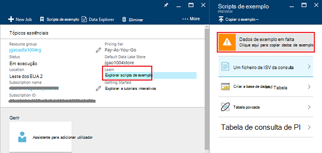
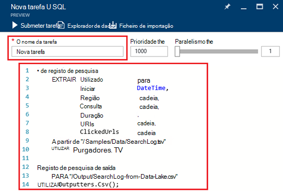
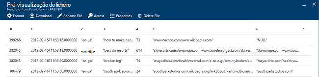

<properties 
   pageTitle="Introdução ao Azure dados Lake Analytics através do portal Azure | Azure" 
   description="Saiba como utilizar o portal do Azure para criar uma conta de análise de Lake de dados, criar uma tarefa de análise de Lake dados utilizando o U SQL e submeter a tarefa. " 
   services="data-lake-analytics" 
   documentationCenter="" 
   authors="edmacauley" 
   manager="jhubbard" 
   editor="cgronlun"/>
 
<tags
   ms.service="data-lake-analytics"
   ms.devlang="na"
   ms.topic="hero-article"
   ms.tgt_pltfrm="na"
   ms.workload="big-data" 
   ms.date="10/06/2016"
   ms.author="edmaca"/>

# Tutorial: introdução ao Azure dados Lake Analytics através do portal Azure

[AZURE.INCLUDE [get-started-selector](../../includes/data-lake-analytics-selector-get-started.md)]

Saiba como utilizar o portal do Azure para criar contas do Azure dados Lake Analytics, definir tarefas de dados Lake Analytics no [U SQL](data-lake-analytics-u-sql-get-started.md)e submeter tarefas para o serviço de dados Lake Analytics. Para mais informações sobre Lake a análise de dados, consulte o artigo [Descrição geral do Azure dados Lake Analytics](data-lake-analytics-overview.md).

Neste tutorial, desenvolver uma tarefa que lê um separador separados por ficheiro de valores (TSV) e converte-o para um ficheiro (CSV valores) de separados por vírgulas. Percorrer o mesmo tutorial utilizar outras ferramentas suportadas, clique nos separadores na parte superior desta secção. Assim que a primeira tarefa é concluída com êxito, pode começar a escrever mais complexas transformações de dados com U-SQL.

##Pré-requisitos

Antes de começar este tutorial, tem de ter os seguintes itens:

- **Azure uma subscrição**. Consulte o artigo [obter Azure versão de avaliação gratuita](https://azure.microsoft.com/pricing/free-trial/).

##Criar dados Lake Analytics conta

Tem de ter uma conta de análise de Lake dados antes de poder executar quaisquer tarefas.

Cada conta dados Lake Analytics tem uma dependência de conta [Azure dados Lake loja]() .  Esta conta é referida como conta predefinida dados Lake loja.  Pode criar a conta de arquivo de Lake dados prévia ou quando cria a sua conta de dados Lake Analytics. Neste tutorial, irá criar a conta de arquivo de Lake de dados com a conta de análise de Lake de dados.

**Para criar uma conta de dados Lake Analytics**

1. Inicie sessão no [portal do Azure](https://portal.azure.com).
2. Clique em **Novo**, clique em **informações da empresa + analytics**e, em seguida, clique em **Lake a análise de dados**.
3. Escreva ou selecione os seguintes valores:

    

    - **Nome**: nome da conta de análise de Lake de dados.
    - **Subscrição**: selecione a subscrição Azure utilizada para a conta de análise.
    - **Grupo de recursos**. Selecione um grupo de recursos do Azure existente ou crie um novo. Gestor de recursos do Azure permite-lhe trabalhar com os recursos na sua aplicação como um grupo. Para mais informações, consulte o artigo [Descrição geral do Gestor de recursos do Azure](resource-group-overview.md). 
    - **Localização**. Selecione um centro de dados Azure para a conta de análise de Lake de dados. 
    - **Arquivo de dados de Lake**: conta de cada dados Lake Analytics tem uma conta de arquivo de Lake dados dependente. A conta de análise de Lake de dados e a conta de arquivo de Lake dados dependente têm de estar localizados no Centro de dados Azure do mesmo. Siga as instruções para criar uma nova conta do arquivo de Lake dados ou selecione uma existente.

8. Clique em **Criar**. Leva-o para o ecrã principal do portal. Um novo mosaico é adicionado a StartBoard com a etiqueta que mostra "Implementar o Azure dados Lake Analytics". Bastam alguns minutos para criar uma conta de análise de Lake de dados. Quando a conta estiver criada, o portal abre-se na conta no pá novo.

Após a criação de uma conta de análise de Lake de dados, pode adicionar contas adicionais do arquivo de Lake de dados e contas de armazenamento do Windows Azure. Para obter instruções, consulte o artigo [Gerir a análise de dados lake conta origens de dados](data-lake-analytics-manage-use-portal.md#manage-account-data-sources).

##Preparar a origem de dados

Neste tutorial, processar alguns registos de pesquisa.  O registo de pesquisa pode ser armazenado numa loja dData Lake ou armazenamento de Blobs do Azure. 

Portal do Azure fornece uma interface de utilizador para copiar alguns ficheiros de dados de exemplo para a conta de dados Lake arquivo predefinida, que incluem um ficheiro de registo de pesquisa.

**Para copiar ficheiros de dados de exemplo**

1. A partir do [Azure portal](https://portal.azure.com), abre a sua conta de análise de Lake de dados.  Consulte o artigo [Gerir a análise de dados Lake contas](data-lake-analytics-get-started-portal.md#manage-accounts) para criar uma e abra a conta no portal.
3. Expandir o painel de **tópicos essenciais** e, em seguida, clique em **explorar scripts de exemplo**. Abre-se outra pá denominado **Scripts de exemplo**.

    

4. Clique em **Falta de dados de exemplo** para copiar os ficheiros de dados de exemplo. Quando concluir, o portal mostra **os dados de exemplo actualizados com êxito**.
7. Pá de conta a análise de dados Lake, clique em **Explorador de dados** no canto superior. 

    

    Abre-se dois pás. Uma é **Explorador de dados**e o outro é a conta de dados Lake arquivo predefinida.
8. Na pá de conta de dados Lake arquivo predefinida, clique em **amostras** para expandir a pasta e clique em **dados** para expandir a pasta. Deverá ver os seguintes ficheiros e pastas:

    - AmbulanceData /
    - AdsLog.tsv
    - SearchLog.tsv
    - Version.txt
    - WebLog.log
    
    Neste tutorial, utiliza o SearchLog.tsv.

Na prática, quer programar aplicações para escrever os dados para um contas ligadas armazenamento ou carregue os dados. Para carregar ficheiros, consulte [carregar dados para o arquivo de dados de Lake](data-lake-analytics-manage-use-portal.md#upload-data-to-adls) ou [carregar dados ao armazenamento Blob](data-lake-analytics-manage-use-portal.md#upload-data-to-wasb).

##Criar e submeter as tarefas de dados Lake Analytics

Depois de ter preparado a origem de dados, pode começar a desenvolver um script U-SQL.  

**Para submeter uma tarefa**

1. Pá conta de dados Lake analytics no portal de, clique em **Nova tarefa**. 

    

    Se não vir a pá, consulte o artigo [Abrir uma conta do Lake a análise de dados a partir do portal](data-lake-analytics-manage-use-portal.md#access-adla-account).
2. Introduza o **Nome da tarefa**e o seguinte script U SQL:

        @searchlog =
            EXTRACT UserId          int,
                    Start           DateTime,
                    Region          string,
                    Query           string,
                    Duration        int?,
                    Urls            string,
                    ClickedUrls     string
            FROM "/Samples/Data/SearchLog.tsv"
            USING Extractors.Tsv();
        
        OUTPUT @searchlog   
            TO "/Output/SearchLog-from-Data-Lake.csv"
        USING Outputters.Csv();

    

    Este script do U SQL lê o ficheiro de dados de origem utilizando **Extractors.Tsv()**e, em seguida, cria um ficheiro csv com **Outputters.Csv()**. 
    
    Não modifique os dois caminhos, a menos que copie o ficheiro de origem para uma localização diferente.  A análise de dados Lake cria a pasta de saída, se não existe.  Neste caso, estamos a utilizar caminhos simples, relativos.  
    
    É mais simples utilizar os caminhos relativos para ficheiros armazenados nas contas de dados Lake predefinido. Também pode utilizar caminhos absolutos.  Por exemplo 
    
        adl://<Data LakeStorageAccountName>.azuredatalakestore.net:443/Samples/Data/SearchLog.tsv
      

    Para mais informações sobre U SQL, consulte o artigo [Introdução ao Azure dados Lake Analytics U-SQL idioma](data-lake-analytics-u-sql-get-started.md) e de [referência da linguagem U SQL](http://go.microsoft.com/fwlink/?LinkId=691348).
     
3. Clique em **Submeter tarefa** situado na parte superior.   
4. Aguarde até que o estado da tarefa é alterado para **com êxito**. Pode ver que a tarefa demorou cerca de um minuto para ser concluída.
    
    No caso de falha a tarefa, consulte o artigo [Monitor e resolver problemas de tarefas de dados Lake Analytics](data-lake-analytics-monitor-and-troubleshoot-jobs-tutorial.md).

5. Na parte inferior da pá, clique no separador de **saída** e, em seguida, clique em **SearchLog a partir de dados Lake.csv**. Pode pré-visualizar, transferir, mudar o nome e eliminar o ficheiro de exportação.

    

##Consulte também

- Para ver uma consulta mais complexa, consulte o artigo [registos de Web site de analisar utilizando a análise do Azure dados Lake](data-lake-analytics-analyze-weblogs.md).
- Para começar a desenvolver aplicações U SQL, consulte o artigo [scripts de desenvolver U-SQL utilizando ferramentas de Lake de dados para o Visual Studio](data-lake-analytics-data-lake-tools-get-started.md).
- Para saber U SQL, consulte [Introdução ao idioma do Azure dados Lake Analytics U-SQL](data-lake-analytics-u-sql-get-started.md).
- Para tarefas de gestão, consulte o artigo [Gerir Azure dados Lake a análise de utilização Azure portal](data-lake-analytics-manage-use-portal.md).
- Para obter uma descrição geral do Lake a análise de dados, consulte o artigo [Descrição geral do Azure dados Lake Analytics](data-lake-analytics-overview.md).
- Para ver o mesmo tutorial utilizar outras ferramentas, clique em seletores o separador na parte superior da página.
- Para registar informações de diagnóstico, consulte o artigo [aceder a registos de diagnóstico para análise do Azure dados Lake](data-lake-analytics-diagnostic-logs.md)
