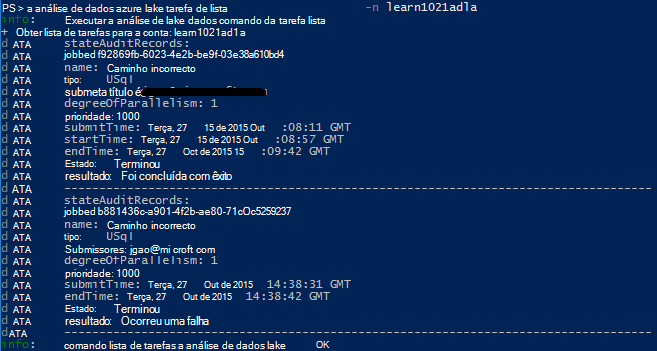

<properties 
   pageTitle="Gerir Azure dados Lake Analytics utilizando a Interface de comandos do Azure | Azure" 
   description="Saiba como gerir contas de dados Lake Analytics, origens de dados, tarefas e os utilizadores que utilizem o clip do Azure" 
   services="data-lake-analytics" 
   documentationCenter="" 
   authors="edmacauley" 
   manager="jhubbard" 
   editor="cgronlun"/>
 
<tags
   ms.service="data-lake-analytics"
   ms.devlang="na"
   ms.topic="article"
   ms.tgt_pltfrm="na"
   ms.workload="big-data" 
   ms.date="05/16/2016"
   ms.author="edmaca"/>

# Gerir as Lake de dados do Azure análises com Azure Interface da linha de comandos (CLI)

[AZURE.INCLUDE [manage-selector](../../includes/data-lake-analytics-selector-manage.md)]

Saiba como gerir contas do Azure dados Lake Analytics, origens de dados, os utilizadores e tarefas utilizando o Azure. Para ver o tópico sobre gestão de utilizar outras ferramentas, clique no separador Seleccionar acima.

**Pré-requisitos**

Antes de começar este tutorial, tem de ter o seguinte procedimento:

- **Azure uma subscrição**. Consulte o artigo [obter Azure versão de avaliação gratuita](https://azure.microsoft.com/pricing/free-trial/).
- **Clip azure**. Consulte o artigo [instalar e configurar o clip do Azure](../xplat-cli-install.md).
    - Transfira e instale a **versão de pré-lançamento** [Azure clip ferramentas](https://github.com/MicrosoftBigData/AzureDataLake/releases) para poder concluir este demonstração.
- **Autenticação**, utilizando o seguinte comando:

        azure login
    Para mais informações sobre a autenticação utilizando uma conta escolar ou profissional, consulte o artigo [ligar a uma subscrição Azure a partir do clip o Azure](../xplat-cli-connect.md).
- **Mudar para o modo de Gestor de recursos do Azure**, utilizando o seguinte comando:

        azure config mode arm

**Para listar comandos de arquivo de dados de Lake e Lake a análise de dados:**

    azure datalake store
    azure datalake analytics

<!-- ################################ -->
<!-- ################################ -->
## Gerir contas

Antes de executar qualquer trabalhos de análise de Lake de dados, tem de ter uma conta de análise de Lake de dados. Ao contrário Azure HDInsight, não pagar para uma conta de análise quando não está em execução uma tarefa.  Pode pagar apenas para o tempo quando estiver em execução uma tarefa.  Para mais informações, consulte o artigo [Descrição geral do Azure dados Lake Analytics](data-lake-analytics-overview.md).  

###Criar contas

    azure datalake analytics account create "<Data Lake Analytics Account Name>" "<Azure Location>" "<Resource Group Name>" "<Default Data Lake Account Name>"

###Actualizar contas

O seguinte comando atualiza as propriedades de uma conta de análise de Lake de dados existente
    
    azure datalake analytics account set "<Data Lake Analytics Account Name>"

###Lista de contas

Contas de análise de Lake de dados de lista 

    azure datalake analytics account list

Contas de análise de lista dados Lake dentro de um grupo de recursos específico

    azure datalake analytics account list -g "<Azure Resource Group Name>"

Obter detalhes de uma conta de análise de Lake dados específica

    azure datalake analytics account show -g "<Azure Resource Group Name>" -n "<Data Lake Analytics Account Name>"

###Eliminar dados Lake Analytics contas

    azure datalake analytics account delete "<Data Lake Analytics Account Name>"

<!-- ################################ -->
<!-- ################################ -->
## Gerir origens de dados de conta

A análise de dados Lake suporta atualmente seguintes origens de dados:

- [Arquivo de Lake de dados do Azure](../data-lake-store/data-lake-store-overview.md)
- [Armazenamento Azure](../storage/storage-introduction.md)

Quando cria uma conta de análise, tem de designar uma conta de armazenamento do Windows Azure dados Lake para ser a conta de armazenamento predefinido. A conta de armazenamento ADL predefinida é utilizada para armazenar os registos de auditoria de metadados e de projeto de tarefa. Depois de ter criado uma conta de análise, pode adicionar contas adicionais de armazenamento de Lake de dados e/ou a conta de armazenamento do Windows Azure. 

### Localizar a conta de armazenamento ADL predefinida

    azure datalake analytics account show "<Data Lake Analytics Account Name>"

O valor está listado em propriedades: datalakeStoreAccount:name.

### Adicionar contas adicionais de armazenamento de Blobs do Azure

    azure datalake analytics account datasource add -n "<Data Lake Analytics Account Name>" -b "<Azure Blob Storage Account Short Name>" -k "<Azure Storage Account Key>"

>[AZURE.NOTE] São suportados apenas Blob armazenamento breves nomes.  Não utilize FQDN, por exemplo "myblob.blob.core.windows.net".

### Adicionar contas adicionais do arquivo de Lake de dados

    azure datalake analytics account datasource add -n "<Data Lake Analytics Account Name>" -l "<Data Lake Store Account Name>" [-d]

[-d] é um parâmetro opcional para indicam se a Lake de dados ser adicionado é a conta de dados Lake predefinida. 

### Atualizar a origem de dados existente

Para configurar uma conta existente do arquivo de Lake de dados seja o predefinido:

    azure datalake analytics account datasource set -n "<Data Lake Analytics Account Name>" -l "<Azure Data Lake Store Account Name>" -d
      
Para atualizar uma chave de conta de armazenamento de BLOBs existente:

    azure datalake analytics account datasource set -n "<Data Lake Analytics Account Name>" -b "<Blob Storage Account Name>" -k "<New Blob Storage Account Key>"

### Lista de origens de dados:

    azure datalake analytics account show "<Data Lake Analytics Account Name>"
    

### Elimine origens de dados:

Para eliminar uma conta do arquivo de Lake dados:

    azure datalake analytics account datasource delete "<Data Lake Analytics Account Name>" "<Azure Data Lake Store Account Name>"

Para eliminar uma conta de armazenamento de BLOBs:

    azure datalake analytics account datasource delete "<Data Lake Analytics Account Name>" "<Blob Storage Account Name>"

## Gerir tarefas

Tem de ter uma conta de análise de Lake dados antes de poder criar uma tarefa.  Para mais informações, consulte o artigo [Gerir a análise de dados Lake contas](#manage-accounts).

### Lista tarefas

    azure datalake analytics job list -n "<Data Lake Analytics Account Name>"

### Obter detalhes sobre o trabalho

    azure datalake analytics job show -n "<Data Lake Analytics Account Name>" -j "<Job ID>"
    
### Submeter tarefas

> [AZURE.NOTE] A prioridade predefinida de uma tarefa é 1000 e o grau de predefinido de paralelismo para uma tarefa é 1.

    azure datalake analytics job create  "<Data Lake Analytics Account Name>" "<Job Name>" "<Script>"

### Cancelar tarefas

Utilize o comando de lista para localizar o id da tarefa e, em seguida, utilize Cancelar para cancelar a tarefa.

    azure datalake analytics job list -n "<Data Lake Analytics Account Name>"
    azure datalake analytics job cancel "<Data Lake Analytics Account Name>" "<Job ID>"

## Gerir catálogo

O catálogo de U SQL é utilizado para estruturar o código e dados para que podem ser partilhados por scripts U-SQL. O catálogo permite que o mais alto desempenho possível com dados no Azure dados Lake. Para mais informações, consulte o artigo [utilizar U-SQL catálogo](data-lake-analytics-use-u-sql-catalog.md).
 
###Itens da lista de catálogo

    #List databases
    azure datalake analytics catalog list -n "<Data Lake Analytics Account Name>" -t database

    #List tables
    azure datalake analytics catalog list -n "<Data Lake Analytics Account Name>" -t table
    
Incluem os tipos de base de dados, esquema, assemblagem, origem de dados externa, tabela, função de valor de tabela ou estatísticas da tabela.

###Criar secreta de catálogo

    azure datalake analytics catalog secret create -n "<Data Lake Analytics Account Name>" <databaseName> <hostUri> <secretName>

### Modificar secreta de catálogo

    azure datalake analytics catalog secret set -n "<Data Lake Analytics Account Name>" <databaseName> <hostUri> <secretName>

###Eliminar secreta de catálogo

    azure datalake analytics catalog secrete delete -n "<Data Lake Analytics Account Name>" <databaseName> <hostUri> <secretName>

<!-- ################################ -->
<!-- ################################ -->
## Utilizar grupos de processador

Aplicações são normalmente constituídas por vários componentes, por exemplo uma aplicação web, base de dados, servidor de base de dados, armazenamento e 3º serviços de terceiros. Gestor de recursos Azure (processador) permite-lhe trabalhar com os recursos na sua aplicação como um grupo, designado de um grupo de recursos do Azure. Pode implementar, atualizar, monitorizar ou eliminar todos os recursos para a sua aplicação numa operação de única e coordenada. Utilizar um modelo para implementação e esse modelo pode ser útil ambientes diferentes, tais como teste, teste e de produção. Pode clarificar faturação da sua organização, veja os custos de agregadas para todo o grupo. Para mais informações, consulte o artigo [Descrição geral do Gestor de recursos do Azure](../azure-resource-manager/resource-group-overview.md). 

Um serviço de dados Lake Analytics pode incluir os seguintes componentes:

- Conta de análise do Azure dados Lake
- Conta de armazenamento do Windows Azure dados Lake predefinidos necessários
- Contas de armazenamento adicional Azure dados Lake
- Contas adicionais de armazenamento do Windows Azure

Pode criar todos estes componentes num processador grupo para torná-las mais fácil de gerir.

Uma conta de análise de Lake de dados e as contas de armazenamento dependentes devem ser colocadas no Centro de dados Azure do mesmo.
O grupo de processador no entanto pode estar num centro de dados diferentes.  

##Consulte também 

- [Descrição geral da análise Lake de dados do Microsoft Azure](data-lake-analytics-overview.md)
- [Começar a trabalhar com dados Lake Analytics através do Portal do Azure](data-lake-analytics-get-started-portal.md)
- [Gerir Azure dados Lake Analytics através do Portal do Azure](data-lake-analytics-manage-use-portal.md)
- [Monitorizar e resolver problemas de tarefas do Azure dados Lake Analytics através do Portal do Azure](data-lake-analytics-monitor-and-troubleshoot-jobs-tutorial.md)

