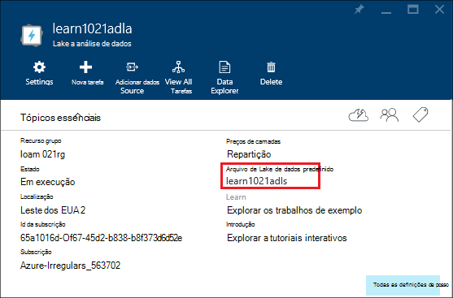

<properties 
   pageTitle="Gerir Azure dados Lake Analytics através do portal Azure | Azure" 
   description="Saiba como gerir dados Lake Analytics acounts, origens de dados, os utilizadores e tarefas." 
   services="data-lake-analytics" 
   documentationCenter="" 
   authors="edmacauley" 
   manager="jhubbard" 
   editor="cgronlun"/>
 
<tags
   ms.service="data-lake-analytics"
   ms.devlang="na"
   ms.topic="article"
   ms.tgt_pltfrm="na"
   ms.workload="big-data" 
   ms.date="10/06/2016"
   ms.author="edmaca"/>

# Gerir Azure dados Lake Analytics através do portal Azure

[AZURE.INCLUDE [manage-selector](../../includes/data-lake-analytics-selector-manage.md)]

Saiba como gerir contas do Azure dados Lake Analytics, origens de dados de conta, os utilizadores e tarefas utilizando o portal do Azure. Para ver tópicos de gestão de utilizar outras ferramentas, clique no Seletor de tabulação na parte superior da página.

**Pré-requisitos**

Antes de começar este tutorial, tem de ter os seguintes itens:

- **Azure uma subscrição**. Consulte o artigo [obter Azure versão de avaliação gratuita](https://azure.microsoft.com/pricing/free-trial/).

<!-- ################################ -->
<!-- ################################ -->
## Gerir contas

Antes de executar qualquer trabalhos de análise de Lake de dados, tem de ter uma conta de análise de Lake de dados. Ao contrário Azure HDInsight, apenas pagar para uma conta de dados Lake Analytics quando executa uma tarefa.  Pode pagar apenas para o tempo quando estiver em execução uma tarefa.  Para mais informações, consulte o artigo [Descrição geral do Azure dados Lake Analytics](data-lake-analytics-overview.md).  

**Para criar uma conta de dados Lake Analytics**

1. Inicie sessão no [portal do Azure](https://portal.azure.com).
2. Clique em **Novo**, clique em **informações da empresa + analytics**e, em seguida, clique em **Lake a análise de dados**.
3. Escreva ou selecione os seguintes valores:

    

    - **Nome**: nome da conta de análise de Lake de dados.
    - **Subscrição**: selecione a subscrição Azure utilizada para a conta de análise.
    - **Grupo de recursos**. Selecione um grupo de recursos do Azure existente ou crie um novo. Gestor de recursos do Azure permite-lhe trabalhar com os recursos na sua aplicação como um grupo. Para mais informações, consulte o artigo [Descrição geral do Gestor de recursos do Azure](resource-group-overview.md). 
    - **Localização**. Selecione um centro de dados Azure para a conta de análise de Lake de dados. 
    - **Arquivo de dados de Lake**: conta de cada dados Lake Analytics tem uma conta de arquivo de Lake dados dependente. A conta de análise de Lake de dados e a conta de arquivo de Lake dados dependente têm de estar localizados no Centro de dados Azure do mesmo. Siga as instruções para criar uma nova conta do arquivo de Lake dados ou selecione uma existente.

8. Clique em **Criar**. Leva-o para o ecrã principal do portal. Um novo mosaico é adicionado a StartBoard com a etiqueta que mostra "Implementar o Azure dados Lake Analytics". Bastam alguns minutos para criar uma conta de análise de Lake de dados. Quando a conta estiver criada, o portal abre-se na conta no pá novo.

Após a criação de uma conta de análise de Lake de dados, pode adicionar contas adicionais do arquivo de Lake de dados e contas de armazenamento do Windows Azure. Para obter instruções, consulte o artigo [Gerir a análise de dados lake conta origens de dados](data-lake-analytics-manage-use-portal.md#manage-account-data-sources).

**Para uma conta de Lake a análise de dados do access/abertas**

1. Inicie sessão no [portal do Azure](https://portal.azure.com/).
2. Clique em **Lake a análise de dados** no menu à esquerda.  Se não o vir, clique em **mais serviços**e, em seguida, clique em **Dados Lake Analytics** em **informações da empresa + Analytics**.
3. Clique na conta de análise de Lake de dados que pretende aceder. Esta é aberta a conta no pá novo.

**Para eliminar uma conta de dados Lake Analytics**

1. Abra a conta de análise de Lake de dados que pretende eliminar. Para obter instruções, consulte o artigo [contas de análise de Lake de dados do Access](#access-adla-account).
2. Clique em **Eliminar** no menu do botão na parte superior a pá.
3. Escreva o nome da conta e, em seguida, clique em **Eliminar**.

Eliminar uma conta de dados Lake análise não elimina as contas de arquivo de Lake dados dependentes. Para obter instruções de eliminar dados Lake armazenamento contas, consulte o artigo [Eliminar dados Lake loja conta](data-lake-store-get-started-portal.md#delete-azure-data-lake-store-account).

<!-- ################################ -->
<!-- ################################ -->
## Gerir origens de dados de conta

A análise de dados Lake suporta atualmente seguintes origens de dados:

- [Arquivo de Lake de dados do Azure](../data-lake-store/data-lake-store-overview.md)
- [Armazenamento Azure](../storage/storage-introduction.md)

Quando cria uma conta de análise de Lake de dados, tem designar uma conta de arquivo do Azure dados Lake para ser a conta de armazenamento predefinido. A conta de arquivo de dados de Lake predefinida é utilizada para armazenar os registos de auditoria de metadados e de projeto de tarefa. Depois de ter criado uma conta de análise de Lake de dados, pode adicionar contas de arquivo de Lake dados adicionais e/ou a conta de armazenamento do Windows Azure. 

**Para localizar a conta de armazenamento de dados Lake predefinida**

- Abra a conta de análise de Lake de dados que pretende gerir. Para obter instruções, consulte o artigo [contas de análise de Lake de dados do Access](#access-adla-account). O arquivo de dados Lake predefinido é mostrado na **essenciais**:

    

**Para adicionar origens de dados adicionais**

1. Abra a conta de análise de Lake de dados que pretende gerir. Para obter instruções, consulte o artigo [contas de análise de Lake de dados do Access](#access-adla-account).
2. Clique em **Definições** e, em seguida, clique em **Origens de dados**. Deve verá a conta de dados Lake arquivo predefinida aí. 
3. Clique em **Adicionar origem de dados**.

    

    Para adicionar uma conta Azure dados Lake loja, tem a conta de nome e o acesso à conta possam consultá-lo.
    Para adicionar um armazenamento de Blobs do Azure, tem a conta de armazenamento e a chave da conta, que pode ser encontrada ao navegar para a conta de armazenamento no portal.

**Para explorar origens de dados**  

1. Abra a conta de análise que pretende gerir. Para obter instruções, consulte o artigo [contas de análise de Lake de dados do Access](#access-adla-account).
2. Clique em **Definições** e, em seguida, clique em **Explorador de dados**. 
 
    
    
3. Clique numa conta de arquivo de Lake de dados para abrir a conta.

    
    
    Para cada conta do arquivo de Lake de dados, pode
    
    - **Nova pasta**: adicionar a nova pasta.
    - **Carregar**: carregar ficheiros para a conta de armazenamento da sua estação de trabalho.
    - **Acesso**: configurar o acesso permissões.
    - **Mudar o nome de pasta**: mudar o nome de uma pasta.
    - **Propriedades da pasta**: Mostrar as propriedades de ficheiro ou pasta, tais como caminho WASB, caminho WEBHDFS, modificado pela última vez tempo e assim sucessivamente.
    - **Eliminar pasta**: eliminar uma pasta.

**Para carregar ficheiros para o arquivo de dados de Lake conta**

1. A partir do Portal de, clique em **Procurar** no menu à esquerda e, em seguida, clique em **Arquivo de dados de Lake**.
2. Clique na conta do arquivo de Lake de dados que pretende carregar os dados para. Para localizar a conta de armazenamento de Lake dados predefinida, consulte [aqui](#default-adl-account).
3. Clique em **Explorador de dados** a partir do menu superior.
4. Clique em **Novo directório** para criar uma nova pasta ou clique num nome de pasta para alterar pasta.
6. Clique em **carregar** a partir do menu superior para carregar ficheiro.

**Para carregar ficheiros para a conta de armazenamento de Blobs do Azure**

Consulte o artigo [carregar dados para trabalhos de Hadoop no HDInsight](../hdinsight/hdinsight-upload-data.md).  As informações que se aplica ao Lake a análise de dados.

## Gerir utilizadores

A análise de dados Lake utiliza o controlo de acesso baseado em funções com o Azure Active Directory. Quando criar uma conta de análise de Lake de dados, uma função de "Administradores de subscrição" é adicionada à conta. Pode adicionar mais utilizadores e grupos de segurança com as seguintes funções:

|Função|Descrição|
|----|-----------|
|Proprietário|Permitem-lhe gerir tudo, incluindo o acesso aos recursos.|
|Contribuinte|Aceder ao portal; submeter e monitorizar tarefas. Para poder submeter tarefas, um contribuinte tem a permissão de leitura ou escrita às contas de arquivo de Lake de dados.|
|DataLakeAnalyticsDeveloper | Submeter, monitorizar e cancelar tarefas.  Estes utilizadores só podem cancelar os seus próprios tarefas. Não pode gerir os seus próprios conta, por exemplo, adicionar utilizadores, alterar as permissões ou eliminar a conta. Para poder executar tarefas, que necessitam de leitura ou acesso de escrita às contas de arquivo de Lake de dados     | 
|Leitor|Permite-lhe ver tudo, mas não faça as alterações.|  
|DevTest Labs utilizador|Permite-lhe ver tudo e ligar, início, reinicie e encerramento máquinas virtuais.|  
|Administrador de acesso de utilizadores|Permite-lhe gerir o acesso do utilizador para recursos Azure.|  

Para obter informações sobre como criar Azure Active Directory utilizadores e grupos de segurança, consulte o artigo [o que é o Azure Active Directory](../active-directory/active-directory-whatis.md).

**Para adicionar utilizadores ou grupos de segurança para uma conta de dados Lake Analytics**

1. Abra a conta de análise que pretende gerir. Para obter instruções, consulte o artigo [contas de análise de Lake de dados do Access](#access-adla-account).
2. Clique em **Definições**e, em seguida, clique em **utilizadores**. Também pode clicar em **Access** na barra de título **Essentials** conforme apresentado na captura de ecrã seguinte:

    
3. Pá **utilizador** , clique em **Adicionar**.
4. Selecionar uma função e adicionar um utilizador e, em seguida, clique em **OK**.

**Nota: Se necessitar deste utilizador ou grupo de segurança submeter tarefas, precisam de ser dada permissão no também a Lake arquivo de dados. Para mais informações, consulte o artigo [seguros dados armazenados no arquivo de dados de Lake](../data-lake-store/data-lake-store-secure-data.md).**

<!-- ################################ -->
<!-- ################################ -->
## Gerir tarefas

Tem de ter uma conta de análise de Lake dados antes de poder executar quaisquer tarefas U-SQL.  Para mais informações, consulte o artigo [Gerir a análise de dados Lake contas](#manage-data-lake-analytics-accounts).

**Para criar uma tarefa**

1. Abra a conta de análise que pretende gerir. Para obter instruções, consulte o artigo [contas de análise de Lake de dados do Access](#access-adla-account).
2. Clique em **nova tarefa**.

    

    Deve ver um novo pá semelhante a:

    

    Para cada tarefa, pode configurar

  	|Nome|Descrição|
  	|----|-----------|
  	|Nome da tarefa|Introduza o nome da tarefa.|
  	|Prioridade|Número menor tem prioridade mais alta. Se as tarefas de duas são ambos na fila, uma com mais baixa prioridade é executado em primeiro lugar|
  	|Paralelismo |Número máximo de processos de cluster que poderão ocorrer ao mesmo tempo. Aumentar este número pode melhorar o desempenho, mas também pode aumentar o custo.|
  	|Script|Introduza o script U SQL para a tarefa.|

    Utilizar a interface do mesmo, pode também explorar as origens de dados de ligação e adicionar ficheiros adicionais para as origens de dados ligados. 
3. Clique em **Submeter a tarefa** se pretende submeter a tarefa.

**Para submeter uma tarefa**

Consulte o artigo [criar a análise de dados Lake tarefas](#create-job).

**Para monitorizar a tarefas**

1. Abra a conta de análise que pretende gerir. Para obter instruções, consulte o artigo [contas de análise de Lake de dados do Access](#access-adla-account). O painel de gestão de projectos mostra as informações da tarefa básicas:

    

3. Clique em **Gestão de projectos** , conforme apresentado na captura de ecrã anterior.

    

4. Clique numa tarefa a partir das listas. Ou clique em **filtro** para ajudá-lo a localizar as tarefas:

    

    Pode filtrar tarefas por **Intervalo de tempo**, **Nome da tarefa**e **autor**.
5. Clique em **Submeter novamente** , se pretender voltar a submeter a tarefa.

**Para voltar a submeter uma tarefa**

Consulte o artigo [tarefas Monitor dados Lake Analytics](#monitor-jobs).

##Monitorizar a utilização de conta

**Para monitorizar a utilização da conta**

1. Abra a conta de análise que pretende gerir. Para obter instruções, consulte o artigo [contas de análise de Lake de dados do Access](#access-adla-account). O painel de utilização mostra a utilização de:

    

2. Faça duplo clique em Painel de para ver mais detalhes.

##Catálogo de U SQL de vista

O [catálogo U SQL](data-lake-analytics-use-u-sql-catalog.md) é utilizada para estruturar o código e dados para que podem ser partilhados por scripts U-SQL. O catálogo permite que o mais alto desempenho possível com dados no Azure dados Lake. A partir do portal do Azure, são conseguem ver catálogo U-SQL.

**Para procurar o catálogo de U SQL**

1. Abra a conta de análise que pretende gerir. Para obter instruções, consulte o artigo [contas de análise de Lake de dados do Access](#access-adla-account).
2. Clique em **Explorador de dados** a partir do menu superior.
3. Expandir **catálogo**, expanda **mestre**, expanda **tabelas, ou **funções de valores de tabela**, ou **assemblagem * *. A captura de ecrã seguinte mostra uma função de valor de tabela.

    

<!-- ################################ -->
<!-- ################################ -->
## Utilizar grupos de Gestor de recursos do Azure

Aplicações são normalmente constituídas por vários componentes, por exemplo uma aplicação web, base de dados, servidor de base de dados, armazenamento e serviços de terceiros. Gestor de recursos do Azure permite-lhe trabalhar com os recursos na sua aplicação como um grupo, designado de um grupo de recursos do Azure. Pode implementar, atualizar, monitorizar ou eliminar todos os recursos para a sua aplicação numa operação de única e coordenada. Utilizar um modelo para implementação e esse modelo pode ser útil ambientes diferentes, tais como teste, teste e produção. Pode clarificar faturação da sua organização, veja os custos de agregadas para todo o grupo. Para mais informações, consulte o artigo [Descrição geral do Gestor de recursos do Azure](../azure-resource-manager/resource-group-overview.md). 

Um serviço de dados Lake Analytics pode incluir os seguintes componentes:

- Conta de análise do Azure dados Lake
- Predefinidos necessários conta Azure dados Lake arquivo
- Contas adicionais Azure dados Lake arquivo
- Contas adicionais de armazenamento do Windows Azure

Pode criar todos estes componentes num grupo de gestão de recursos para torná-las mais fácil de gerir.

Uma conta de análise de Lake de dados e as contas de armazenamento dependentes devem ser colocadas no Centro de dados Azure do mesmo.
O grupo de gestão de recursos no entanto pode estar num centro de dados diferentes.  

##Consulte também 

- [Descrição geral da análise Lake de dados do Microsoft Azure](data-lake-analytics-overview.md)
- [Começar a trabalhar com dados Lake Analytics através do portal Azure](data-lake-analytics-get-started-portal.md)
- [Gerir Azure dados Lake Analytics através do PowerShell do Azure](data-lake-analytics-manage-use-powershell.md)
- [Monitorizar e resolver problemas de tarefas do Azure dados Lake Analytics através do portal Azure](data-lake-analytics-monitor-and-troubleshoot-jobs-tutorial.md)

