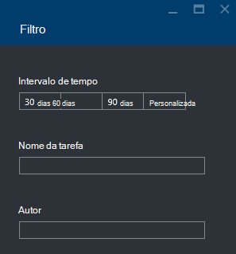

<properties 
   pageTitle="Resolver problemas de tarefas do Azure dados Lake Analytics através do Portal do Azure | Azure" 
   description="Saiba como utilizar o Portal do Azure resolver problemas de tarefas de dados Lake Analytics. " 
   services="data-lake-analytics" 
   documentationCenter="" 
   authors="edmacauley" 
   manager="jhubbard" 
   editor="cgronlun"/>
 
<tags
   ms.service="data-lake-analytics"
   ms.devlang="na"
   ms.topic="article"
   ms.tgt_pltfrm="na"
   ms.workload="big-data" 
   ms.date="05/16/2016"
   ms.author="edmaca"/>

# Resolver problemas de tarefas do Azure dados Lake Analytics através do Portal do Azure

Saiba como utilizar o Portal do Azure resolver problemas de tarefas de dados Lake Analytics.

Neste tutorial, irá programa de configuração de um problema de ficheiro de origem em falta e utilizar o Portal do Azure para resolver o problema.

**Pré-requisitos**

Antes de começar este tutorial, tem de ter o seguinte procedimento:

- **Processo de tarefa de conhecimentos básicos de Lake a análise de dados**. Consulte o artigo [Introdução ao Azure dados Lake Analytics através do Portal do Azure](data-lake-analytics-get-started-portal.md).
- **Análise de Lake de dados A conta**. Consulte o artigo [Introdução ao Azure dados Lake Analytics através do Portal do Azure](data-lake-analytics-get-started-portal.md#create-adl-analytics-account).
- **Copie os dados de exemplo para a conta de arquivo de dados de Lake predefinida**.  Consulte o artigo [preparar dados de origem](data-lake-analytics-get-started-portal.md#prepare-source-data)

##Submeter uma tarefa de dados Lake Analytics

Agora irá criar uma tarefa de U SQL com um nome de ficheiro de origem incorretas.  

**Para submeter a tarefa**

1. A partir do Portal do Azure, clique em **Microsoft Azure** no canto superior esquerdo.
2. Clique no mosaico com o seu nome de conta dados Lake Analytics.  Foi afixada aqui quando a conta foi criada.
Se a conta não é afixada lá, consulte o artigo [Abrir uma conta de análise a partir do portal](data-lake-analytics-manage-use-portal.md#access-adla-account).
3. Clique em **Nova tarefa** a partir do menu superior.
4. Introduza um nome de tarefa e o seguinte script U SQL:

        @searchlog =
            EXTRACT UserId          int,
                    Start           DateTime,
                    Region          string,
                    Query           string,
                    Duration        int?,
                    Urls            string,
                    ClickedUrls     string
            FROM "/Samples/Data/SearchLog.tsv1"
            USING Extractors.Tsv();
        
        OUTPUT @searchlog   
            TO "/output/SearchLog-from-adls.csv"
        USING Outputters.Csv();

    O ficheiro de origem definido no script é **/Samples/Data/SearchLog.tsv1**, onde deve ser **/Samples/Data/SearchLog.tsv**.
     
5. Clique em **Submeter tarefa** situado na parte superior. É aberto um novo painel de detalhes de tarefa. Na barra de título, que apresenta o estado da tarefa. Bastam alguns minutos para concluir. Pode clicar em **Atualizar** para obter o estado mais recente.
6. Aguarde até que o estado da tarefa é alterado para **falhou**.  Se a tarefa está **bem sucedida**, é porque não remover a pasta /Samples. Consulte a secção **pré-requisito** no início do tutorial.

Poderá estar a pensar - por que motivo demora tanto tempo para uma tarefa de pequenas.  Lembre-se de que a análise de dados Lake foi concebida para processar dados grandes.  -Brilha quando está a processar uma grande quantidade de dados utilizando o seu sistema de distribuído.

Vamos partem do princípio de que utilizou ao submeter a tarefa e, feche o portal.  Na secção seguinte, irá obter informações sobre como resolver problemas com a tarefa.

## A tarefa de resolução de problemas

Na secção última, tenham apresentado uma tarefa e, a tarefa falhou.  

**Para ver todas as tarefas**

1. A partir do portal do Azure, clique em **Microsoft Azure** no canto superior esquerdo.
2. Clique no mosaico com o seu nome de conta dados Lake Analytics.  A tarefa de resumo é apresentada no mosaico de **Gestão de projectos** .

    
    
    A tarefa de gestão de fornece-lhe uma vista do Estado da tarefa. Repare que existe uma falha na tarefa.
   
3. Clique no mosaico de **Gestão de projectos** para ver as tarefas. As tarefas são categorizadas em **execução**, **em fila de espera**e **terminou**. Deve ver o seu trabalho falhado na secção **terminou** . Deve ser um primeira na lista. Quando tiver muitas tarefas, pode clicar em **filtro** para ajudá-lo a localizar tarefas.

    

4. Clique na tarefa de falha a partir da lista para abrir os detalhes do projecto numa nova pá:

    
    
    Repare que o botão **Submeter novamente** . Depois de resolver o problema, pode reenviar a tarefa.

5. Clique em peça realçada da captura de ecrã anterior para abrir os detalhes desse erro.  Deverá visualizar algo parecido com:

    

    Indica que a pasta de origem não for encontrada.
    
6. Clique em **Duplicar Script**.
7. Atualize o caminho **FROM** ao seguinte:

    "/ Samples/Data/SearchLog.tsv"

8. Clique em **Submeter tarefa**.

##Consulte também

- [Descrição geral da análise do Azure dados Lake](data-lake-analytics-overview.md)
- [Introdução ao Azure dados Lake Analytics através do PowerShell do Azure](data-lake-analytics-get-started-powershell.md)
- [Introdução ao Azure dados Lake Analytics e U-SQL utilizando o Visual Studio](data-lake-analytics-u-sql-get-started.md)
- [Gerir Azure dados Lake Analytics através do Portal do Azure](data-lake-analytics-manage-use-portal.md)

